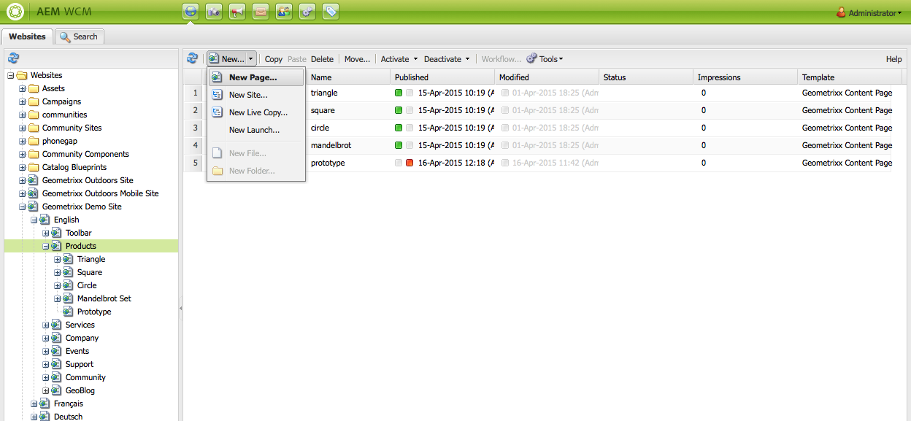

# Criar e organizar páginas{#creating-and-organizing-pages}

Esta seção descreve como criar e gerenciar páginas com o Adobe Experience Manager (AEM) para depois usá-las [criar conteúdo](/help/sites-classic-ui-authoring/classic-page-author-edit-content.md) nessas páginas.

>[!NOTE]
>
>Sua conta precisa do [direitos de acesso apropriados](/help/sites-administering/security.md) e [permissões](/help/sites-administering/security.md#permissions) para executar ações nas páginas, por exemplo, criar, copiar, mover, editar, excluir.
>
>Caso encontre algum problema, sugerimos que você entre em contato com o administrador do sistema.

## Organizar seu site {#organizing-your-website}

Como autor, você deve organizar seu site dentro do AEM. Isso envolve criar e nomear suas páginas de conteúdo de modo que:

* você pode encontrá-los facilmente no ambiente de criação
* os visitantes do seu site podem navegá-los facilmente no ambiente de publicação

Você também pode usar [pastas](#creating-a-new-folder) para ajudar a organizar o seu conteúdo.

A estrutura de um site pode ser considerada como um *estrutura de árvore* que armazena suas páginas de conteúdo. Os nomes dessas páginas de conteúdo são usadas para formar os URLs, enquanto o título é exibido quando o conteúdo da página é visualizado.

A seguir, é mostrado um extrato do site do Geometrixx; onde, por exemplo, o `Triangle` A página será acessada:

* Ambiente de autor

  `http://localhost:4502/cf#/content/geometrixx/en/products/triangle.html`

* Ambiente de publicação

  `http://localhost:4503/content/geometrixx/en/products/triangle.html`

  Dependendo da configuração da sua instância, o uso de `/content` pode ser opcional no ambiente de publicação.

```xml
  /content
    /geometrixx
      /en
        /toolbar...
        /products
          /triangle
            /overview
            /features
          /square...
          /circle...
          /...
        /...
      /fr...
      /de...
      /es...
      /...
    /...
```

Essa estrutura pode ser exibida no console Sites, que pode ser usado para [navegar pela estrutura de árvore](/help/sites-classic-ui-authoring/author-env-basic-handling.md#main-pars-text-15).


### Convenções de nomenclatura da página {#page-naming-conventions}

Ao criar uma página, há dois campos principais:

* **[Título](#title)**:

   * O título é exibido ao usuário no console, na parte superior do conteúdo da página ao editar.
   * Esse campo é obrigatório.

* **[Nome](#name)**:

   * Usado para gerar o URI.
   * A entrada do usuário para este campo é opcional. Se não especificado, o nome é derivado do título.

Ao criar uma página, AEM [valida o nome da página de acordo com as convenções](/help/sites-developing/naming-conventions.md) impostos pelo AEM e pelo JCR.

A implementação e a lista de caracteres permitidos diferem ligeiramente de acordo com a interface do usuário (é mais extensa para a interface habilitada para toque), mas o mínimo permitido é:

* &#39;a&#39; até &#39;z&#39;
* &#39;A&#39; até &#39;Z&#39;
* &#39;0&#39; até &#39;9&#39;
* _ (sublinhado)
* `-` (hífen/sinal de menos)

Use apenas estes caracteres se quiser ter certeza de que serão aceitos/usados (se precisar de detalhes completos sobre todos os caracteres permitidos, consulte [as convenções de nomenclatura](/help/sites-developing/naming-conventions.md)).

#### Título {#title}

Se você fornecer apenas uma página **Título** ao criar uma página, o AEM deriva a página **Nome** desta cadeia de caracteres e [validar o nome de acordo com as convenções](/help/sites-developing/naming-conventions.md) impostos pelo AEM e pelo JCR. Em ambas as interfaces, um **Título** um campo contendo caracteres inválidos será aceito, mas o nome derivado terá os caracteres inválidos substituídos. Por exemplo:

| Título | Nome derivado |
|---|---|
| Schön | schoen.html |
| SC%&amp;&amp;ast;ç+ | sc---c-.html |

#### Nome {#name}

Se você fornecer uma página **Nome** ao criar uma página, AEM [valida o nome de acordo com as convenções](/help/sites-developing/naming-conventions.md) impostos pelo AEM e pelo JCR.

Na interface clássica, você **não é possível inserir caracteres inválidos** no **Nome** campo.

>[!NOTE]
>Na interface habilitada para toque, você **não é possível enviar caracteres inválidos** no **Nome** campo. Quando o AEM detectar caracteres inválidos, o campo será realçado e uma mensagem explicativa será exibida para indicar os caracteres que precisam ser removidos/substituídos.

>[!NOTE]
>
>Evite usar um código de duas letras, conforme definido pela ISO-639-1, a menos que seja uma raiz de idioma.
>
>Consulte [Preparação de conteúdo para tradução](/help/sites-administering/tc-prep.md) para obter mais informações.

### Modelos {#templates}

No AEM, um modelo especifica um tipo especializado de página. Um modelo é usado como a base para qualquer nova página que está sendo criada.

O modelo define a estrutura de uma página, incluindo uma imagem em miniatura e outras propriedades. Por exemplo, você pode ter modelos separados para páginas de produtos, mapas de site e informações de contato. Os modelos são compostos de [componentes](#components).

O AEM vem com vários modelos prontos para uso. Os modelos oferecidos dependem do site individual e as informações que precisam ser fornecidas (ao criar a nova página) dependem da interface do usuário que está sendo usada. Os campos principais são:

* **Título** O título exibido na página da Web resultante.

* **Nome** Usado ao nomear a página.

* **Modelo** Uma lista de modelos disponíveis para uso ao gerar a nova página.

### Componentes {#components}

Os componentes são os elementos fornecidos pelo AEM, desse modo, é possível adicionar tipos específicos de conteúdo. O AEM vem com vários componentes prontos para uso que fornecem funcionalidade abrangente; eles incluem:

* Texto
* Imagem
* Slideshow
* Vídeo
* muito mais

Depois de criar e abrir uma página, você pode [adicionar conteúdo usando os componentes](/help/sites-classic-ui-authoring/classic-page-author-edit-content.md#insertinganewparagraph), disponível no [sidekick](/help/sites-classic-ui-authoring/classic-page-author-env-tools.md#sidekick).

## Gerenciamento de páginas {#managing-pages}

### Criar uma nova página {#creating-a-new-page}

A menos que todas as páginas tenham sido criadas antecipadamente para você, antes de começar a criar conteúdo, você deve criar uma página:

1. No **Sites** selecione o nível no qual deseja criar uma página.

   No exemplo a seguir, você está criando uma página no nível **Produtos** - exibido no painel à esquerda; o painel à direita mostra páginas que já existem no nível em **Produtos**.

   

1. No **Novo...** (clique na seta ao lado de **Novo...**), selecione **Nova página...**. A variável **Criar página** é aberta.

   Clicando **Novo...** O próprio também atua como um atalho para o **Nova página...** opção.

1. A variável **Criar página** permite:

   * Forneça um **Título**; isso é exibido ao usuário.
   * Forneça um **Nome**; usado para gerar o URI. Se não especificado, o nome será derivado do título.

      * Se você fornecer uma página **Nome** ao criar uma página, AEM [valida o nome de acordo com as convenções](/help/sites-developing/naming-conventions.md) impostos pelo AEM e pelo JCR.
      * Na interface clássica, você **não é possível inserir caracteres inválidos** no **Nome** campo.

   * Clique no template que deseja usar para criar a nova página.

     O modelo é usado como a base para a nova página; por exemplo, para determinar o layout básico de uma página de conteúdo.

   >[!NOTE]
   >
   >Consulte [Convenções de nomenclatura da página](#page-naming-conventions).

   As informações mínimas necessárias para criar uma página são **Título** e o template necessário.

   

   >[!NOTE]
   >
   >Se você quiser usar caracteres unicode nos URLs, defina o Alias ( `sling:alias`) propriedade ([propriedades da página](/help/sites-classic-ui-authoring/classic-page-author-edit-page-properties.md)).

1. Clique em **Criar** para criar a página. Você retorna para a **Sites** onde você pode ver uma entrada para a nova página.

   O console fornece informações sobre a página (por exemplo, quando ela foi editada pela última vez e por quem) que é atualizada conforme necessário.

   >[!NOTE]
   >
   >Você também pode criar uma página ao editar uma página existente. Usar **Criar página secundária** do **Página** A guia do sidekick cria uma página diretamente abaixo da página que está sendo editada.

### Abrir uma página para edição {#opening-a-page-for-editing}

Você pode abrir a página para ser [editado](/help/sites-classic-ui-authoring/classic-page-author-edit-content.md#editing-a-component-content-and-properties) por um de vários métodos:

* De **Sites** console, é possível **clique duas vezes** a entrada da página para abri-la para edição.

* De **Sites** console, é possível **clique com o botão direito do mouse** (menu de contexto) o item de página e selecione **Abertura** no menu.

* Depois de abrir uma página, você pode navegar para outras páginas do site (para editá-las) clicando em hiperlinks.

### Copiar e colar uma página      {#copying-and-pasting-a-page}

Ao copiar, é possível copiar:

* uma página única
* uma página junto com todas as subpáginas

1. No **Sites** selecione a página que deseja copiar.

   >[!NOTE]
   >
   >Nesse estágio, é irrelevante se você deseja copiar uma única página ou as subpáginas subjacentes.

1. Clique em **Copiar**.

1. Navegue até o novo local e clique em:

   * **Colar** - para colar a página junto com todas as subpáginas
   * **Shift + Colar** - para colar somente a página selecionada

   As páginas são coladas no novo local.

   >[!NOTE]
   >
   >O nome da página pode ser ajustado automaticamente se uma página existente já tiver o mesmo nome.

   >[!NOTE]
   >
   >Também é possível usar **Copiar página** do **Página** guia do sidekick. Isso abre uma caixa de diálogo onde você pode especificar o destino e assim por diante.

### Mover ou renomear página {#moving-or-renaming-page}

>[!NOTE]
>
>A renomeação de uma página também está sujeita às [convenções de nomenclatura de página](#page-naming-conventions) ao especificar o nome da nova página.

O procedimento para mover ou renomear uma página é o mesmo. Com a mesma ação, é possível:

* mover uma página para um novo local
* renomear uma página no mesmo local
* mover uma página para um novo local e renomeá-la ao mesmo tempo

O AEM oferece a funcionalidade de atualizar links internos para a página que está sendo renomeada ou movida. Isso pode ser feito página por página para proporcionar total flexibilidade.

Para mover ou renomear uma página:

1. Há vários métodos para acionar uma movimentação:

   * No **Sites** , clique para selecionar a página e selecione **Mover...**
   * No **Sites** também é possível selecionar o item de página e, em seguida, **clique com o botão direito do mouse** e selecione **Mover...**
   * Ao editar uma página, você pode selecionar **Mover página** do **Página** guia do sidekick.

1. A variável **Mover** é aberta; aqui você pode especificar um novo local, um novo nome para a página ou ambos.

   

   A página também lista todas as páginas que fazem referência à página que está sendo movida. Dependendo do status da página de referência, talvez seja possível ajustar esses links e/ou republicar as páginas.

1. Preencha os seguintes campos, conforme apropriado:

   * **Destino**

     Use o mapa de site (disponível por meio do seletor suspenso) para selecionar o local para onde a página deve ser movida.

     Se você estiver apenas renomeando a página, ignore este campo.

   * **Mover**

     Especifique a página a ser movida - geralmente, ela é preenchida por padrão, dependendo de como e onde você iniciou a ação de movimentação.

   * **Renomear para**

     O rótulo da página atual é exibido por padrão. Especifique o rótulo da nova página, se necessário.

   * **Ajustar**

     Atualize os links na página listada que apontam para a página movida: por exemplo, se a página A tiver links para a página B, o AEM ajustará os links na página A, caso você mova a página B.

     Isso pode ser selecionado/desmarcado para cada página de referência individual.

   * **Republicar**

     Republicar a página de referência; novamente, isso pode ser selecionado para cada página individual.

   >[!NOTE]
   >
   >Se a página já tiver sido ativada, movê-la automaticamente a desativará. Por padrão, ele será reativado quando a movimentação for concluída, mas isso pode ser alterado ao desmarcar a opção **Republicar** para a página no campo **Mover** janela.

1. Clique em **Mover**. A confirmação será necessária. Clique em **OK** para confirmar.

   >[!NOTE]
   >
   >O título da página não será atualizado.

### Excluir uma página {#deleting-a-page}

1. Você pode excluir uma página de vários locais:

   * No prazo de **Sites** clique para selecionar a página, clique com o botão direito do mouse e selecione **Excluir** no menu resultante.
   * No prazo de **Sites** , clique para selecionar a página e selecione **Excluir** no menu da barra de ferramentas.
   * No sidekick, use o **Página** guia para selecionar **Excluir página** - essa ação exclui a página que está aberta no momento.

1. Depois de selecionar a exclusão de uma página, você deve confirmar a solicitação, pois a ação não pode ser desfeita.

   >[!NOTE]
   >
   >Após a exclusão, se a página tiver sido publicada, é possível restaurar a versão mais recente (ou uma específica), mas ela pode não ter exatamente o mesmo conteúdo da última versão caso tenham sido feitas outras modificações. Consulte [Como Restaurar Páginas](/help/sites-classic-ui-authoring/classic-page-author-work-with-versions.md#restoringpages) para obter mais detalhes.

>[!NOTE]
>
>Se uma página já estiver ativada, ela será automaticamente desativada antes da exclusão.

### Bloquear uma página   {#locking-a-page}

É possível [bloquear/desbloquear uma página](/help/sites-classic-ui-authoring/classic-page-author-edit-content.md#locking-a-page) a partir de um console ou ao editar uma página individual. As informações sobre páginas bloqueadas também são mostradas em ambos os locais.

### Criação de uma nova pasta {#creating-a-new-folder}

>[!NOTE]
>
>As pastas também estão sujeitas às [convenções de nomenclatura de página](#page-naming-conventions) ao especificar um novo nome de pasta.

1. Abra o **Sites** e navegue até o local desejado.
1. No **Novo...** (clique na seta ao lado de **Novo...**), selecione **Nova pasta...**.
1. A variável **Criar pasta** é aberta. Aqui você pode inserir o **Nome** e o **Título**:

   

1. Selecione **Criar** para criar a pasta.
