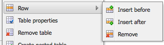

# Editor de rich text {#rich-text-editor}

O Editor de Rich Text é um elemento básico fundamental para inserir conteúdo textual no AEM. É a base de vários componentes, incluindo:

* Texto
* Imagem de texto
* Tabela

## Editor de rich text {#rich-text-editor-1}

A caixa de diálogo de edição WYSIWYG fornece uma ampla variedade de funcionalidades:

>[!NOTE]
>
>Os recursos disponíveis podem ser configurados para projetos individuais, portanto, podem variar para sua instalação.

## Edição no local {#in-place-editing}

Além do modo de Edição de Rich Text baseado em caixas de diálogo, o AEM também fornece o modo de edição no local, que permite a edição direta do texto conforme é exibido no layout da página.

Clique duas vezes em um parágrafo (um clique duplo lento) para entrar no modo de edição local (a borda do componente agora será laranja).

Você poderá editar o texto diretamente na página, em vez de dentro de uma janela de diálogo. Basta fazer as alterações, que serão salvas automaticamente.

>[!NOTE]
>
>Se o localizador de conteúdo estiver aberto, uma barra de ferramentas com as opções de formatação do RTE será exibida na parte superior da guia (como acima).
>
>Se o localizador de conteúdo não estiver aberto, a barra de ferramentas não será exibida.

Atualmente, o modo Edição no local está ativado para elementos de página gerados pelo **Texto** e **Título** componentes.

>[!NOTE]
>
>A variável [!UICONTROL Título] O componente foi projetado para conter um texto curto sem quebras de linha. Ao editar um título no Modo de edição local, inserir uma quebra de linha abre uma nova **Texto** abaixo do título.

## Recursos do Editor de Rich Text {#features-of-the-rich-text-editor}

O Editor de Rich Text fornece uma variedade de recursos, que [depende da configuração](/help/sites-administering/rich-text-editor.md) do componente individual. Os recursos estão disponíveis para a interface otimizada para toque e a clássica.

### Formatos de caractere básico {#basic-character-formats}

Aqui você pode aplicar formatação aos caracteres que selecionou (realçados); algumas opções também possuem teclas de atalho:

* Negrito (Ctrl-B)
* Itálico (Ctrl-I)
* Sublinhado (Ctrl-U)
* Subscrito
* Sobrescrito

Todos operam como um botão de alternância, portanto, a reseleção removerá o formato.

### Estilos e formatos predefinidos {#predefined-styles-and-formats}

Sua instalação pode incluir estilos e formatos predefinidos. Eles estão disponíveis com o **[!UICONTROL Estilo]** e **[!UICONTROL Formato]** listas suspensas e podem ser aplicadas ao texto selecionado.

Um estilo pode ser aplicado a uma cadeia de caracteres específica (um estilo correlaciona-se ao CSS):

Enquanto um formato é aplicado a todo o parágrafo de texto (um formato é baseado em HTML):

Um formato específico só pode ser alterado (o padrão é **[!UICONTROL Parágrafo]**).

Um estilo pode ser removido; coloque o cursor dentro do texto ao qual o estilo foi aplicado e clique no ícone remover:

>[!CAUTION]
>
>Na verdade, não selecione novamente nenhum texto no qual o estilo foi aplicado ou o ícone será desativado.

### Recortar, copiar, colar {#cut-copy-paste}

As funções padrão de **[!UICONTROL Recortar]** e **[!UICONTROL Copiar]** estão disponíveis. Vários sabores de **[!UICONTROL Colar]** são fornecidos para atender a diferentes formatos.

* Recortar (Ctrl-X)
* Copiar (Ctrl-C)
* Colar Esse é o mecanismo de colagem padrão (Ctrl-V) do componente; quando instalado, é configurado para ser [!UICONTROL Colar do Word].

* Colar como texto: elimina todos os estilos e formatações para colar apenas o texto sem formatação.

* Colar do Word: cola o conteúdo como HTML (com alguma reformatação necessária).

### Desfazer, Refazer {#undo-redo}

O AEM mantém um registro das suas últimas 50 ações no componente atual, mantido em ordem cronológica. Essas ações podem ser desfeitas (e então refeitas) em ordem estrita, se necessário.

>[!CAUTION]
>
>O histórico é mantido somente para a sessão de edição atual. Ele é reiniciado sempre que o componente é aberto para edição.

>[!NOTE]
>
>Cinquenta é o número padrão de tarefas. Isso pode ser diferente para a sua instalação.

### Alinhamento {#alignment}

O texto pode ser alinhado à esquerda, ao centro ou à direita.

### Recuo {#indentation}

O recuo de um parágrafo pode ser aumentado ou diminuído. O parágrafo selecionado será recuado, qualquer novo texto inserido manterá o nível atual de recuo.

### Listas {#lists}

Listas com marcadores e numeradas podem ser criadas dentro do texto. Selecione o tipo de lista e comece a digitar ou destaque o texto a ser convertido. Em ambos os casos, um feed de linha iniciará um novo item de lista.

É possível obter listas aninhadas recuando um ou mais itens de lista.

O estilo de uma lista pode ser alterado simplesmente posicionando o cursor dentro da lista e selecionando o outro estilo. Uma sublista também pode ter um estilo diferente da lista que a contém. Isso pode ser aplicado depois que a sublista é criada (por recuo).

### Links {#links}

Um link para um URL (no site ou em um local externo) é gerado destacando o texto necessário e clicando no ícone de hiperlink:

Uma caixa de diálogo permitirá que você especifique o URL de destino; também se ele deve ser aberto em uma nova janela.

É possível:

* Digite um URI diretamente
* Use o mapa do site para selecionar uma página em seu site
* Insira o URI e anexe a âncora de destino; por exemplo, `www.TargetUri.org#AnchorName`
* Insira uma âncora apenas (para fazer referência à &quot;página atual&quot;); Por exemplo, `#anchor`
* Procure uma página no localizador de conteúdo e, em seguida, arraste e solte o ícone de página na caixa de diálogo Hiperlink

>[!NOTE]
>
>O URI pode ser anexado a qualquer um dos protocolos configurados para sua instalação. Em uma instalação padrão, eles são `https://`, `ftp://`, e `mailto:`. Os protocolos não configurados para a sua instalação serão rejeitados e marcados como inválidos.

Para quebrar a posição do link, coloque o cursor em qualquer lugar dentro do texto do link e clique no [!UICONTROL Desvincular] ícone:

### Âncoras {#anchors}

Uma âncora pode ser criada em qualquer lugar dentro do texto posicionando o cursor ou selecionando algum texto. Em seguida, clique no link **Âncora** ícone para abrir o diálogo.

Insira o nome da âncora e clique em **OK** para salvar.

A âncora é exibida quando o componente está sendo editado e agora pode ser usada em um destino para links.

### Localizar e substituir {#find-and-replace}

O AEM fornece uma **Localizar** e uma **Substituir** função (localizar e substituir).

Ambos têm um **Localizar próximo** botão para procurar o texto especificado no componente aberto. Você também pode especificar se precisa que letras maiúsculas e minúsculas sejam correspondidas.

A pesquisa sempre iniciará a partir da posição atual do cursor dentro do texto. Quando o fim do componente for atingido, uma mensagem informará que a próxima operação de pesquisa começará do início.

A variável **Substituir** permite **Localizar**, depois **Substituir** uma instância individual com o texto especificado, ou para **Substituir tudo** instâncias no componente atual.

### Imagens {#images}

As imagens podem ser arrastadas do localizador de conteúdo para adicioná-las ao texto.

>[!NOTE]
>
>O AEM também oferece componentes especializados para configurações de imagem mais detalhadas. Por exemplo, a variável **Imagem** e **Imagem de texto** componentes estão disponíveis.

### Verificador ortográfico {#spelling-checker}

O verificador ortográfico verificará todo o texto no componente atual.

Qualquer grafia incorreta será destacada:

>[!NOTE]
>
>O verificador ortográfico operará no idioma do site ao obter a propriedade de idioma da subárvore ou extrair o idioma do URL. Por exemplo, a variável `en` A ramificação será verificada em busca de inglês e do `de` para o alemão.

### Tabelas {#tables}

As tabelas estão disponíveis:

* Como a variável **Tabela** componente

  

* De dentro do **Texto** componente

  

  >[!NOTE]
  >
  >Embora as tabelas estejam disponíveis no RTE, é recomendável usar o **Tabela** componente ao criar tabelas.

Em ambos os **Texto** e **Tabela** a funcionalidade de tabela de componentes está disponível por meio do menu de contexto (geralmente o botão direito do mouse) clicado na tabela; por exemplo:

>[!NOTE]
>
>No **Tabela** Uma barra de ferramentas especializada também está disponível, incluindo várias funções padrão do editor de rich text, juntamente com um subconjunto das funções específicas da tabela.

As funções específicas da tabela são:

* [Propriedades da tabela](#table-properties)
* [Propriedades da célula](#cell-properties)
* [Adicionar ou Excluir Linhas](#add-or-delete-rows)
* [Adicionar ou excluir colunas](#add-or-delete-columns)
* [Seleção de Linhas ou Colunas Inteiras](#selecting-entire-rows-or-columns)
* [Mesclar Células](#merge-cells)
* [Dividir células](#split-cells)
* [Tabelas aninhadas](#creating-nested-tables)
* [Remover tabela](#remove-table)

#### Propriedades da tabela {#table-properties}

As propriedades básicas da tabela podem ser configuradas antes de clicar em **OK** para salvar:

* **Largura**: a largura total da tabela.

* **Altura**: a altura total da tabela.

* **Borda**: o tamanho da borda da tabela.

* **Preenchimento da célula**: Isso define o espaço em branco entre o conteúdo da célula e suas bordas.

* **Espaçamento entre células**: Isso define a distância entre as células.

>[!NOTE]
>
>Algumas propriedades de célula, como Largura e Altura, podem ser definidas como pixels ou como porcentagens.

>[!CAUTION]
>
>A Adobe recomenda que você defina uma largura para a tabela.

#### Propriedades da célula {#cell-properties}

As propriedades de uma célula específica, ou série de células, podem ser configuradas:

* **Largura**
* **Altura**
* **Alinhamento horizontal** - Esquerda, Centro ou Direita
* **Alinhamento vertical** - Superior, Meio, Inferior ou Linha de Base
* **Tipo de célula**- Dados ou Cabeçalho
* **Aplicar a:** Célula única, Linha inteira, Coluna inteira

#### Adicionar ou Excluir Linhas {#add-or-delete-rows}

As linhas podem ser adicionadas acima ou abaixo da linha atual.

A linha atual também pode ser excluída.

#### Adicionar ou excluir colunas {#add-or-delete-columns}

As colunas podem ser adicionadas à esquerda ou à direita da coluna atual.

A coluna atual também pode ser excluída.

#### Seleção de Linhas ou Colunas Inteiras {#selecting-entire-rows-or-columns}

Seleciona toda a linha ou coluna atual. Ações específicas (por exemplo, mesclar) ficam disponíveis.

#### Mesclar Células {#merge-cells}

 

* Se você selecionou um grupo de células, é possível mesclá-las em um.
* Se você tiver apenas uma célula selecionada, poderá mesclá-la com a célula à direita ou abaixo.

#### Dividir células {#split-cells}

Selecione uma única célula para dividi-la:

* Dividir uma célula horizontalmente gerará uma nova célula à direita da célula atual, dentro da coluna atual.
* Dividir uma célula verticalmente gerará uma nova célula abaixo da célula atual, mas dentro da linha atual.

#### Criação de Tabelas Aninhadas {#creating-nested-tables}

A criação de uma tabela aninhada cria uma tabela independente dentro da célula atual.

>[!NOTE]
>
>Alguns comportamentos adicionais dependem do navegador:
>
>* Windows IE: Use Ctrl+primary-mouse-button-click (geralmente à esquerda) para selecionar várias células.
>* Firefox: arraste o ponteiro para selecionar um intervalo de células.

#### Remover tabela {#remove-table}

Use a opção para remover a tabela de dentro do **[!UICONTROL Texto]** componente.

### Caracteres especiais {#special-characters}

Caracteres especiais podem ser disponibilizados para o editor de rich text; eles podem variar de acordo com a sua instalação.

Use o mouse sobre ele para ver uma versão ampliada do caractere, em seguida, clique para que ele seja incluído no local atual em seu texto.

### Modo de edição de origem {#source-editing-mode}

O modo de edição de origem permite visualizar e editar o HTML subjacente do componente.

Assim, o texto:

Será a seguinte aparência no modo de origem (geralmente, a origem é muito mais longa, portanto, você terá que rolar a tela):

>[!CAUTION]
>
>Ao sair do modo de origem, o AEM faz determinadas verificações de validação (por exemplo, garantir que o texto esteja corretamente contido/aninhado em blocos). Isso pode resultar em alterações nas edições.
