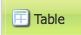
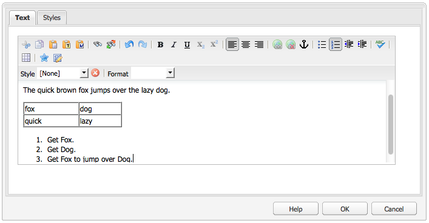

# Rich Text Editor {#rich-text-editor}

O Editor de Rich Text é um elemento básico fundamental para introduzir o conteúdo textual no AEM. É a base de vários componentes, incluindo:

* Texto
* Imagem de texto
* Tabela

## Editor de Rich Text {#rich-text-editor-1}

A caixa de diálogo de edição WYSIWYG fornece uma grande variedade de funcionalidades:

>[!NOTE]
>
>Os recursos disponíveis podem ser configurados para projetos individuais, por isso podem variar de acordo com a sua instalação.

## Edição no local {#in-place-editing}

Além do diálogo com base no modo de Edição de Rich Text, o AEM também fornece o modo de edição local, o qual permite a edição direta do texto enquanto é exibido no layout da página.

Clique duas vezes em um parágrafo (um clique duplo lento) para entrar no modo de edição local (a borda do componente fica laranja).

Você poderá editar o texto diretamente na página, em vez de dentro de uma janela de diálogo. Basta fazer as alterações e elas serão salvas automaticamente.

>[!NOTE]
>
>Se o localizador de conteúdo estiver aberto, uma barra de ferramentas com as opções de formatação do ERT será exibida na parte superior da guia (como mostrado acima).
>
>A barra de ferramentas não será exibida se o localizador de conteúdo não estiver aberto.

No momento, o modo de Edição local está habilitado para elementos de página gerados pelos componentes de **Texto** e **Título**.

>[!NOTE]
>
>O componente [!UICONTROL Título] foi projetado para conter um texto curto se quebras de linha. Ao editar um título no Modo de edição no local, inserir uma quebra de linha abrirá um novo componente de **Texto** abaixo do título.

## Recursos do Editor de Rich Text {#features-of-the-rich-text-editor}

O Editor de Rich Text fornece vários recursos, esses [dependem da configuração](/help/sites-administering/rich-text-editor.md) do componente individual. Os recursos estão disponíveis para a interface otimizada ao toque e clássica.

### Formatos básicos de caracteres {#basic-character-formats}

Aqui, é possível aplicar a formatação aos caracteres selecionados (destacados); algumas opções também têm teclas de atalho:

* Negrito (Ctrl+B)
* Itálico (Ctrl+I)
* Sublinhado (Ctrl+U)
* Subscrito
* Sobrescrito

Todos funcionam como uma alternância, assim, selecionar novamente removerá o formato.

### Estilos e formatos pré-definidos {#predefined-styles-and-formats}

Sua instalação pode incluir estilos e formatos predefinidos. Estão disponíveis com as listas suspensas de **[!UICONTROL estilo]** e **[!UICONTROL formato]** e podem ser aplicados ao texto selecionado.

Um estilo pode ser aplicado a uma sequência específica (um estilo correlaciona-se com CSS):

Considerando que um formato é aplicado a todo o parágrafo do texto (um formato é baseado em HTML):

Um formato específico pode ser apenas alterado (o padrão é **[!UICONTROL Parágrafo]**).

Um estilo pode ser removido; coloque o cursor dentro do texto ao qual o estilo foi aplicado e clique no ícone para remover:

>[!CAUTION]
>
>Não selecione novamente nenhuma parte do texto ao qual o estilo foi aplicado ou, o ícone será desativado.

### Cortar, copiar, colar {#cut-copy-paste}

As funções padrão de **[!UICONTROL recortar]** e **[!UICONTROL copiar]** estão disponíveis. Vários tipos da função **[!UICONTROL colar]** são fornecidos para atender a diferentes formatos.

* Cortar (Ctrl-X)
* Copiar (Ctrl-C)
* Colar
Este é o mecanismo de colagem padrão (Ctrl-V) para o componente; quando instalado e pronto, isso é configurado para ser [!UICONTROL Colar do Word].

* Colar como texto: Remove todos os estilos e formatação para colar apenas o texto sem formatação.

* Colar do Word: Isso cola o conteúdo como HTML (com alguma reformatação necessária).

### Desfazer, refazer {#undo-redo}

O AEM mantém um registro de suas últimas 50 ações no componente atual, mantidas em ordem cronológica. Essas ações podem ser desfeitas (e, em seguida, refeitas), em ordem rigorosa, se necessário.

>[!CAUTION]
>
>O histórico é mantido somente para a sessão de edição atual. Ele é reiniciado sempre que você abrir o componente para edição.

>[!NOTE]
>
>Cinquenta é o número padrão de tarefas. Isso pode ser diferente para a sua instalação.

### Alinhamento {#alignment}

O texto pode ser alinhado na esquerda, centralizado ou na direita.

### Recuo {#indentation}

O recuo de margem de um parágrafo pode ser aumentado ou diminuído. O parágrafo selecionado será recuado, qualquer novo texto inserido manterá o nível atual de recuo de margem.

### Listas {#lists}

As listas com marcadores e numeradas podem ser criadas dentro do texto. Selecione o tipo de lista e comece a digitar ou destaque o texto a ser convertido. Em ambos os casos, um avanço de linha iniciará um novo item da lista.

Para listas aninhadas, recue um ou mais itens da lista.

Para alterar o estilo de uma lista, basta posicionar o cursor dentro da lista e, em seguida, selecionando o outro estilo. Uma sublista também pode ter um estilo diferente da lista que a contém. Isso pode ser aplicado quando a sublista tiver sido criada (por recuo).

### Links {#links}

Um link para um URL (dentro do seu site ou de um local externo) é gerado destacando o texto necessário e clicando no ícone de hiperlink:

Uma caixa de diálogo permitirá que você especifique a URL de destino; e se deve também ser aberta em uma nova janela.

É possível:

* Digite um URI diretamente
* Usar o mapa do site para selecionar uma página dentro do site
* Digite o URI e anexe a âncora do público alvo; por exemplo, `www.TargetUri.org#AnchorName`
* Insira somente uma âncora (para fazer referência à &quot;página atual&quot;); Por exemplo, `#anchor`
* Procure uma página no localizador de conteúdo e arraste e solte o ícone da página na caixa de diálogo Hiperlink

>[!NOTE]
>
>A URL pode ser anexada a quaisquer protocolos configurados para sua instalação. Em uma instalação padrão, eles são `https://`, `ftp://` e `mailto:`. Os protocolos não configurados para sua instalação são rejeitados e marcados como inválidos.

Para quebrar o link, coloque o cursor em qualquer lugar no texto do link e clique no ícone [!UICONTROL Desvincular]:

### Âncoras {#anchors}

Uma âncora pode ser criada em qualquer lugar dentro do texto ao posicionar o cursor ou selecionar algum texto. Em seguida, clique no ícone **âncora** para abrir a caixa de diálogo.

Digite o nome da âncora, em seguida, clique em **OK** para salvar.

A âncora é exibida quando o componente está sendo editado e agora pode ser usada dentro de um destino para os links.

### Localizar e substituir {#find-and-replace}

O AEM fornece as funções **Localizar** e **Substituir**.

As funções tem um botão **Localizar próximo** para pesquisar o componente aberto para o texto especificado. Também é possível especificar caso precise que a letra (maiúscula/minúscula) coincida.

A pesquisa sempre iniciará da posição atual do cursor dentro do texto. Quando o final do componente for atingido uma mensagem vai informá-lo que a próxima operação de busca começará do início.

A opção **Substituir** permite **Localizar** e **Substituir** uma instância individual por um texto especificado, ou **Substituir todas** as instâncias no componente atual.

### Imagens {#images}

As imagens podem ser arrastadas do localizador de conteúdo para adicioná-las ao texto.

>[!NOTE]
>
>O AEM também oferece componentes especializados para uma configuração mais detalhada da imagem. Os componentes **Imagem** e **Imagem de texto**, por exemplo, estão disponíveis.

### Verificador ortográfico {#spelling-checker}

O verificador ortográfico vai conferir todo o texto no componente atual.

Quaisquer erros de ortografia serão destacados:

>[!NOTE]
>
>O verificador ortográfico operará no idioma do site utilizando a propriedade de idioma da subárvore ou extraindo o idioma do URL. Por exemplo, a ramificação `en` será verificada para inglês e a ramificação `de` para alemão.

### Tabelas {#tables}

As tabelas estão disponíveis:

* Como o componente de **Tabela**

   

* No componente **Texto**

   

   >[!NOTE]
   >
   >Embora as tabelas estejam disponíveis no RTE, recomenda-se usar o componente **Table** ao criar tabelas.

Nos componentes **Texto** e **Tabela** a funcionalidade de tabela está disponível por meio do menu de contexto (normalmente, o botão direito do mouse) clicado na tabela; por exemplo:

>[!NOTE]
>
>No componente **Tabela,** uma barra de ferramentas especializada também está disponível, incluindo várias funções do editor de rich text padrão juntamente com um subconjunto de funções específicas de tabela.

As funções específicas da tabela são:

* [Table Properties](#table-properties)
* [Cell Properties](#cell-properties)
* [Add or Delete Rows](#add-or-delete-rows)
* [Add or Delete Columns](#add-or-delete-columns)
* [Selecting Entire Rows or Columns](#selecting-entire-rows-or-columns)
* [Merge Cells](#merge-cells)
* [Split Cells](#split-cells)
* [Tabelas aninhadas](#creating-nested-tables)
* [Remover tabela](#remove-table)

#### Propriedades da tabela  {#table-properties}

As propriedades básicas da tabela podem ser configuradas antes de clicar em **OK** para salvar:

* **Largura**: A largura total da tabela.

* **Altura**: A altura total da tabela.

* **Borda**: O tamanho da borda da tabela.

* **Preenchimento** da célula: Isso define o espaço em branco entre o conteúdo da célula e suas bordas.

* **Espaçamento** da célula: Isso define a distância entre as células.

>[!NOTE]
>
>Algumas propriedades de células, como Largura e Altura, podem ser definidas como pixels ou porcentagens.

>[!CAUTION]
>
>O Adobe recomenda que você defina uma largura para a tabela.

#### Propriedades da célula {#cell-properties}

As propriedades de uma célula específica ou a série de células, podem ser configuradas:

* **Largura**
* **Altura**
* **Alinhamento**  horizontal - Esquerda, Centro ou Direita
* **Alinhamento**  vertical - Parte superior, Meio, Parte inferior ou Linha de base
* **Tipo** de célula - Dados ou cabeçalho
* **Aplicar a:célula** única, linha inteira, coluna inteira

#### Adicionar ou excluir linhas {#add-or-delete-rows}

As linhas podem ser adicionadas acima ou abaixo da linha atual.

A linha atual também pode ser excluída.

#### Adicionar ou remover colunas {#add-or-delete-columns}

As colunas podem ser adicionadas à esquerda ou à direita da coluna atual.

A coluna atual também pode ser excluída.

#### Selecionar linhas ou colunas inteiras {#selecting-entire-rows-or-columns}

Seleciona toda a linha ou coluna atual. As ações específicas (por exemplo, mesclar) estarão, em seguida, disponíveis.

#### Mesclar células {#merge-cells}

 

* Caso tenha selecionado um grupo de células, você pode mesclá-las em uma.
* Caso tenha apenas uma célula selecionada, então você pode mesclá-la com a célula à direita ou abaixo.

#### Dividir células {#split-cells}

Selecione uma única célula para dividi-la:

* Dividir uma célula horizontalmente vai gerar uma nova célula à direita da célula atual, dentro da coluna atual.
* Dividir uma célula verticalmente vai gerar uma nova célula abaixo da célula atual, mas dentro da linha atual.

#### Creating Nested Tables {#creating-nested-tables}

Criar uma tabela aninhada criará uma nova tabela autossuficiente, dentro da célula atual.

>[!NOTE]
>
>Certos comportamentos adicionais são dependentes de um navegador:
>
>* IE do Windows: usar o clique do botão do mouse principal + Ctrl (geralmente à esquerda) para selecionar várias células.
>* Firefox: Arraste o ponteiro para selecionar um intervalo de células.

#### Remove Table {#remove-table}

Use a opção para remover a tabela do componente **[!UICONTROL Texto]**.

### Caracteres especiais {#special-characters}

Os caracteres especiais podem ser disponibilizados para o seu editor de rich text; podem variar de acordo com a sua instalação.

Usar o mouse sobre o caractere para visualizar uma versão ampliada do mesmo, em seguida, clicar para que seja incluído na posição atual em seu texto.

### Modo de edição de fonte {#source-editing-mode}

O modo de edição da origem permite que você visualize e edite o HTML subjacente do componente.

Assim, o texto:

Será como o modo de origem (muitas vezes a origem é muito longa, então será necessário usar a barra de rolagem):

>[!CAUTION]
>
>Ao sair do modo de origem, o AEM fará certas verificações de validação (por exemplo, garantindo que o texto está corretamente contido/aninhado em blocos). Isso pode resultar em mudanças para as suas edições.
