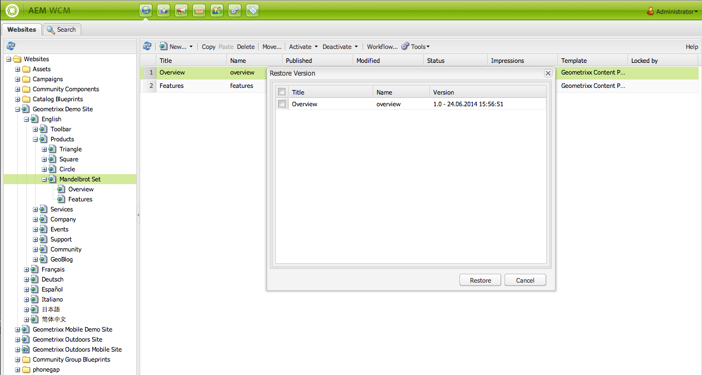
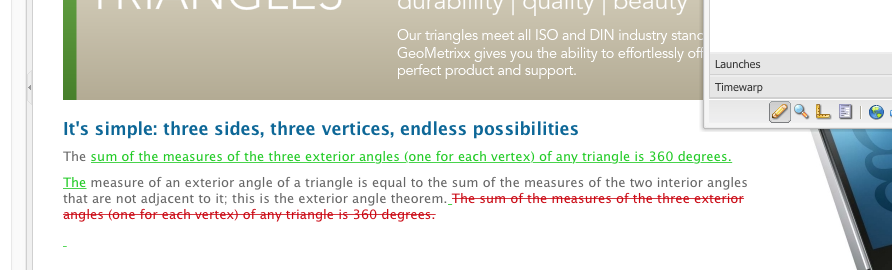

# Trabalhar com versões de páginas{#working-with-page-versions}

O controle de versão cria um “instantâneo” de uma página em um ponto no tempo específico. Com o controle de versão, você pode executar as seguintes ações:

* Criar uma versão de uma página.
* Restaurar uma página para uma versão anterior, por exemplo, para desfazer uma alteração feita em uma página.
* Comparar a versão atual de uma página com uma versão anterior, com diferenças no texto e nas imagens realçadas.

## Criar uma nova versão   {#creating-a-new-version}

Para criar uma nova versão de uma página:

1. No seu navegador, abra a página para a qual você deseja criar uma nova versão.
1. No Sidekick, selecione a guia **Controle de versão,** em seguida, a subguia **Criar versão**.

   

1. Insira um **Comentário** (opcional).
1. Para definir um rótulo para a versão (opcional), clique no botão **Mais >>** e defina o **Rótulo** para nomear a versão. Se o rótulo não estiver definido, a versão será um número incrementado automaticamente.
1. Clique em **Criar versão**. Uma mensagem acinzentada é exibida na página; por exemplo: Versão 1.2 criada para: Camisas.

>[!NOTE]
>
>Uma versão é criada automaticamente quando a página é ativada.

## Restaurar uma versão de página do sidekick  {#restoring-a-page-version-from-sidekick}

Para restaurar a página para uma versão anterior:

1. Abra a página para a qual você deseja restaurar uma versão anterior.
1. No sidekick, selecione a guia **Controle de versão,** em seguida, a subguia **Restaurar versão**.

   

1. Selecione a versão que você deseja restaurar e selecione **Restaurar**.

## Restaurar uma versão de página a partir do Console {#restoring-a-page-version-from-the-console}

Esse método pode ser usado para restaurar uma versão de página. Também pode ser usado para restaurar páginas que foram excluídas anteriormente:

1. No console **Websites,** navegue até a página que você deseja restaurar e selecione-a.
1. No menu superior, selecione **Ferramentas,** em seguida, **Restaurar**:

   

1. A seleção de **Restaurar versão...** lista versões de documento na pasta atual. Mesmo que uma página tenha sido excluída, a última versão será listada:

   

1. Selecione a versão que você deseja restaurar e clique em **Restaurar**. O AEM restaura as versões (ou árvores) que você selecionar.

### Restaurar uma árvore a partir do console  {#restoring-a-tree-from-the-console}

Esse método pode ser usado para restaurar uma versão de página. Também pode ser usado para restaurar páginas que foram excluídas anteriormente:

1. No console **Websites,** navegue até a pasta que você deseja restaurar e selecione-a.
1. No menu superior, selecione **Ferramentas,** em seguida, **Restaurar**.
1. A seleção de **Restaurar árvore...** abre a caixa de diálogo para permitir que você selecione a árvore que deseja restaurar:

   

1. Clique em **Restaurar**. O AEM restaura a árvore selecionada.

## Comparar com uma versão anterior  {#comparing-with-a-previous-version}

Para comparar a versão atual da página com uma versão anterior:

1. No seu navegador, abra a página com a qual você deseja comparar uma versão anterior.
1. No Sidekick, selecione a guia **Controle de versão**, em seguida, a subguia **Restaurar versão** n.

   

1. Selecione a versão que você deseja comparar e clique no botão **Diff**.
1. As diferenças entre a versão atual e a selecionada são exibidas da seguinte forma:

   * O texto que foi excluído é vermelho e riscado.
   * O texto que foi adicionado é verde e destacado.
   * As imagens que foram adicionadas ou excluídas são contornadas por uma borda verde.

   

1. No Sidekick, selecione a subguia **Restaurar versão** e clique no botão **&lt;&lt;Voltar** para exibir a versão atual.

## Timewarp    {#timewarp}

O Timewarp é um recursos criado para simular o estado ***publicado*** de uma página em ocasiões específicas no passado.

O objetivo é permitir o rastreamento do site publicado no ponto selecionado no tempo. Ele usa as ativações de página para determinar o estado do ambiente de publicação.

Para fazer isso:

* O sistema procura a versão de página que estava ativa no momento selecionado.
* Isso significa que a versão mostrada foi criada/ativada *antes* do ponto no tempo selecionado no Timewarp.
* Durante a navegação para uma página que foi excluída, isso também será renderizado - desde que as versões antigas da página ainda estejam disponíveis no repositório.
* Se nenhuma versão publicada for encontrada, o Timewarp reverterá para o estado atual da página sobre o ambiente do autor (isso tem o objetivo de evitar um erro de página /404, que significaria que não é possível navegar mais).

>[!NOTE]
>
>Se as versões forem removidas do repositório, o Timewarp não poderá mostrar a exibição correta. Além disso, se os elementos (como código, css, imagens etc) para renderização do website forem alterados, a exibição será diferente da original, pois esses itens não têm controle de versão no repositório.

### Using the Timewarp Calendar  {#using-the-timewarp-calendar}

O Timewarp está disponível no sidekick.

A versão do calendário será usada se você tiver um dia específico a ser exibido:

1. Abra a guia **Controle de versão** e clique em **Timewarp** (perto da parte inferior do sidekick). A seguinte caixa de diálogo será mostrada:

   

1. Use os seletores de data e hora para especificar a data/hora desejados e clique em **Ir**.

   O Timewarp exibirá a página da maneira como estava em seu estado publicado antes da/na data escolhida.

   >[!NOTE]
   >
   >O Timewarp só funcionará totalmente se você tiver publicado a página antes. Caso contrário, o Timewarp mostrará a página atual no ambiente de criação.

   >[!NOTE]
   >
   >Se você navegar para uma página que foi removida/excluída do repositório, ela será renderizada corretamente se ainda houver versões antigas disponíveis no repositório.

   >[!NOTE]
   >
   >Não é possível editar a versão antiga da página. Ela só está disponível para exibição. Se você deseja restaurar a versão mais antiga, é necessário fazer isso manualmente usando [restaurar](/help/sites-classic-ui-authoring/classic-page-author-work-with-versions.md#restoring-a-page-version-from-sidekick).

1. Quando terminar de exibir a página, clique no seguinte:

   * **Sair do Timewarp** para sair e retornar à página de autor atual.
   * [Exibir linha do tempo](#using-the-timewarp-timeline) para exibir a linha do tempo.

   

### Using the Timewarp Timeline {#using-the-timewarp-timeline}

A versão da linha do tempo será usada se você quiser obter uma visão geral das atividades de publicação na página.

Se você quiser exibir a linha do tempo do documento:

1. Para mostrar a Linha do tempo, você pode executar uma destas ações:

   1. Abra a guia **Controle de versão** e clique em **Timewarp** (perto da parte inferior do sidekick).

   1. Use a caixa de diálogo do sidekick mostrada [depois de usar o Calendário do Timewarp](#using-the-timewarp-calendar).

1. Clique em **Mostrar linha do tempo** - a linha do tempo do documento será exibida; por exemplo:

   

1. Selecione e mova (arraste e solte) a linha do tempo para percorrer a linha do tempo do documento.

   * Todas as linhas indicam versões publicadas.
Quando uma página for ativada, uma nova linha será iniciada. Cada vez que o documento é editado, uma nova cor aparece.
No exemplo abaixo, a linha vermelha indica que a página foi editada durante o período da versão verde inicial e a linha amarela indica que a página foi editada em algum momento durante a versão vermelha etc.

   

1. Clique em:

   1. **Ir** para mostrar o conteúdo da página publicada no ponto de tempo selecionado.
   1. Quando estiver mostrando esse conteúdo, use **Sair do Timewarp** para sair e retornar à página de autor atual.

### Limitações do Timewarp {#timewarp-limitations}

O Timewarp se esforça ao máximo para reproduzir uma página em um ponto selecionado no tempo. No entanto, devido às complexidades da criação contínua de conteúdo no AEM, isso nem sempre é possível. Essas limitações devem ser levadas em conta ao usar o Timewarp.

* **O Timewarp funciona com base nas páginas publicadas** - o Timewarp só funcionará totalmente se você tiver publicado a página anteriormente. Caso contrário, o Timewarp mostrará a página atual no ambiente de criação.
* **O Timewarp usa versões de página** - se você navegar para uma página que foi removida/excluída do repositório, ela será renderizada corretamente se ainda houver versões antigas disponíveis no repositório.
* **As versões removidas afetam o Timewarp** - se as versões forem removidas do repositório, o Timewarp não poderá mostrar a exibição correta.

* **O Timewarp é somente leitura** - não é possível editar a versão antiga da página. Ela só está disponível para exibição. Se você deseja restaurar a versão mais antiga, é necessário fazer isso manualmente usando [restaurar](#main-pars-title-1).

* **O Timewarp é baseado apenas no conteúdo da página** - se os elementos (como código, css, ativos/imagens, etc) para renderização do site forem alterados, a exibição será diferente da original, pois esses itens não têm controle de versão no repositório.

>[!CAUTION]
>
>O Timewarp foi projetado como uma ferramenta para auxiliar autores com a compreensão e criação de conteúdo. Ele não se destina a ser um registro de auditoria ou a fins legais.
