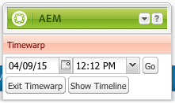
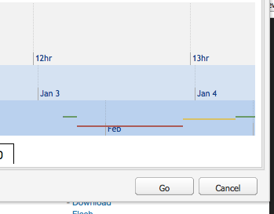

# Trabalhar com versões de páginas{#working-with-page-versions}

O controle de versão cria um “instantâneo” de uma página em um momento específico. Com o controle de versão, você pode executar as seguintes ações:

* Criar uma versão de uma página.
* Restaurar uma página para uma versão anterior para desfazer uma alteração feita em uma página.
* Comparar a versão atual de uma página com uma versão anterior com diferenças no texto e nas imagens destacadas.

## Criar uma versão {#creating-a-new-version}

Para criar uma versão de uma página:

1. No navegador, abra a página para a qual deseja criar uma versão.
1. No Sidekick, selecione a variável **Controle de versão** e, em seguida, **Criar versão** subguia.

   

1. Insira um **Comentário** (opcional).
1. Para definir um rótulo para a versão (opcional), clique no link **Mais >>** e defina o **Rótulo** para nomear a versão. Se o rótulo não for definido, a versão será um número incrementado automaticamente.
1. Clique em **Criar versão**. Uma mensagem esmaecida é exibida na página; por exemplo: Versão 1.2 criada para: Camisas.

>[!NOTE]
>
>Uma versão é criada automaticamente quando a página é ativada.

## Restaurar uma versão da página do Sidekick {#restoring-a-page-version-from-sidekick}

Para restaurar a página para uma versão anterior:

1. Abra a página para a qual deseja restaurar uma versão anterior.
1. No sidekick, selecione a variável **Controle de versão** e, em seguida, **Restaurar versão** subguia.

   

1. Selecione a versão que deseja restaurar e selecione **Restaurar**.

## Restaurar uma versão da página no console {#restoring-a-page-version-from-the-console}

Esse método pode ser usado para restaurar uma versão da página. Ele também pode ser usado para restaurar páginas que foram excluídas anteriormente:

1. No **Sites** navegue até a página que deseja restaurar e selecione-a.
1. No menu superior, selecione **Ferramentas**, depois **Restaurar**:

   

1. Selecionar **Restaurar versão...** lista versões de documentos na pasta atual. Mesmo que uma página tenha sido excluída, a última versão será listada:

   

1. Selecione a versão que deseja restaurar e clique em **Restaurar**. O AEM restaura as versões (ou árvores) selecionadas.

### Restauração de uma árvore no console {#restoring-a-tree-from-the-console}

Esse método pode ser usado para restaurar uma versão da página. Ele também pode ser usado para restaurar páginas que foram excluídas anteriormente:

1. No **Sites** navegue até a pasta que deseja restaurar e selecione-a.
1. No menu superior, selecione **Ferramentas**, depois **Restaurar**.
1. Selecionar **Restaurar árvore...** abre a caixa de diálogo para que você possa selecionar a árvore que deseja restaurar:

   

1. Clique em **Restaurar**. O AEM restaura a árvore selecionada.

## Comparação com uma versão anterior {#comparing-with-a-previous-version}

Para comparar a versão atual da página com uma versão anterior:

1. No navegador, abra a página para a qual deseja comparar com uma versão anterior.
1. No Sidekick, selecione a variável **Controle de versão** e, em seguida, **Restaurar versão** na subguia.

   

1. Selecione a versão que deseja comparar e clique no link **Diferença** botão.
1. As diferenças entre a versão atual e a versão selecionada são exibidas da seguinte maneira:

   * O texto excluído fica vermelho e riscado.
   * O texto adicionado está verde e destacado.
   * As imagens adicionadas ou excluídas têm um quadro verde.

   

1. No Sidekick, selecione a variável **Restaurar versão** e clique na guia **&lt;&lt;back span=&quot;&quot; id=&quot;3&quot; translate=&quot;no&quot; /> botão para exibir a versão atual.**

## Timewarp   {#timewarp}

O Timewarp é um recursos criado para simular o estado ***publicado*** de uma página em ocasiões específicas no passado.

O objetivo é permitir que você rastreie o site publicado no momento selecionado. Isso usa as ativações de página para determinar o estado do ambiente de publicação.

Para fazer isso:

* O sistema procura a versão da página que estava ativa no momento selecionado.
* Isso significa que a versão mostrada foi criada/ativada *antes* o ponto no tempo selecionado no Timewarp.
* Ao navegar para uma página que foi excluída, isso também é renderizado - desde que as versões antigas da página ainda estejam disponíveis no repositório.
* Se nenhuma versão publicada for encontrada, o Timewarp reverterá para o estado atual da página no ambiente de criação (o objetivo é evitar um erro de página/404, o que significa que você não pode mais navegar).

>[!NOTE]
>
>Se as versões forem removidas do repositório, o Timewarp não poderá mostrar a exibição correta. Além disso, se os elementos (como código, css e imagens) para renderização do site forem alterados, a exibição será diferente da original, pois esses itens não têm controle de versão no repositório.

### Uso do calendário do Timewarp {#using-the-timewarp-calendar}

O Timewarp está disponível no sidekick.

A versão do calendário é usada se você tiver um dia específico para ser exibido:

1. Abra o **Controle de versão** e clique em **Timewarp** (perto da parte inferior do sidekick). A seguinte caixa de diálogo é exibida:

   

1. Usando os seletores de data e hora, especifique a data/hora desejada e clique em **Ir**.

   O Timewarp exibe a página como estava em seu estado publicado antes/na data escolhida.

   >[!NOTE]
   >
   >O Timewarp só funcionará totalmente se você tiver publicado a página anteriormente. Caso contrário, ele mostrará a página atual no ambiente de criação.

   >[!NOTE]
   >
   >Se você navegar para uma página que foi removida ou excluída do repositório, ela será renderizada corretamente se ainda houver versões antigas disponíveis no repositório.

   >[!NOTE]
   >
   >Não é possível editar a versão antiga da página. Ela só está disponível para exibição. Se quiser restaurar a versão mais antiga, faça isso manualmente usando [restaurar](/help/sites-classic-ui-authoring/classic-page-author-work-with-versions.md#restoring-a-page-version-from-sidekick).

1. Quando terminar de visualizar a página, clique em:

   * **Sair do Timewarp** para sair e retornar à página do autor atual.
   * [Mostrar Linha do Tempo](#using-the-timewarp-timeline) para exibir a linha do tempo.

   

### Uso da linha de tempo do Timewarp {#using-the-timewarp-timeline}

A versão da linha do tempo é usada se você quiser ter uma visão geral das atividades de publicação na página.

Se quiser exibir a linha do tempo do documento:

1. Para mostrar a Linha do tempo, siga um destes procedimentos:

   1. Abra o **Controle de versão** e clique em **Timewarp** (perto da parte inferior do sidekick).

   1. Usar a caixa de diálogo do sidekick mostrada após [usar o calendário do Timewarp](#using-the-timewarp-calendar).

1. Clique em **Mostrar Linha do Tempo** - a linha do tempo do documento é exibida; por exemplo:

   

1. Selecione e mova (mantenha pressionada e arraste) a linha do tempo para mover pela linha do tempo do documento.

   * Todas as linhas indicam versões publicadas.
Quando uma página é ativada, uma nova linha é iniciada. Toda vez que o documento é editado, uma nova cor aparece.
No exemplo abaixo, a linha vermelha indica que a página foi editada durante o período da versão verde inicial. A linha amarela indica que a página foi editada em algum momento durante a versão vermelha e assim por diante.

   

1. Clique em:

   1. **Ir** para mostrar o conteúdo da página publicada no horário selecionado.
   1. Ao mostrar esse conteúdo, use **Sair do Timewarp** para sair e retornar à página do autor atual.

### Limitações do Timewarp {#timewarp-limitations}

O Timewarp se esforça ao máximo para reproduzir uma página em um ponto selecionado no tempo. No entanto, devido às complexidades da criação contínua de conteúdo no AEM, isso nem sempre é possível. Essas limitações devem ser levadas em conta ao usar o Timewarp.

* **O Timewarp funciona com base nas páginas publicadas**: o Timewarp só funcionará por completo se você tiver publicado a página anteriormente. Caso contrário, ele mostrará a página atual no ambiente de criação.
* **O Timewarp usa versões de página**: se você navegar para uma página que foi removida/excluída do repositório, ela será renderizada corretamente se ainda houver versões antigas disponíveis no repositório.
* **As versões removidas afetam o Timewarp** - se as versões forem removidas do repositório, o Timewarp não poderá mostrar a exibição correta.

* **O Timewarp é somente leitura** - não é possível editar a versão antiga da página. Ela só está disponível para exibição. Se quiser restaurar a versão mais antiga, faça isso manualmente usando [restaurar](#main-pars-title-1).

* **O Timewarp é baseado apenas no conteúdo da página** - Se os elementos (como código, css e ativos de imagem) para renderização do site forem alterados, a exibição será diferente da original. O motivo é porque esses itens não têm controle de versão no repositório.

>[!CAUTION]
>
>O Timewarp foi projetado para ajudar os autores a entender e criar conteúdo. Ele não se destina a ser um registro de auditoria ou a fins legais.
