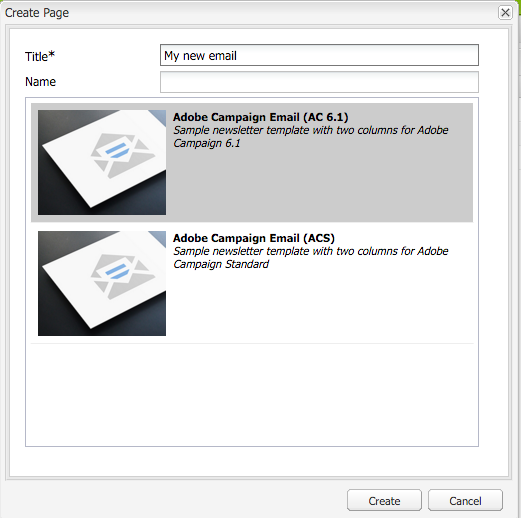
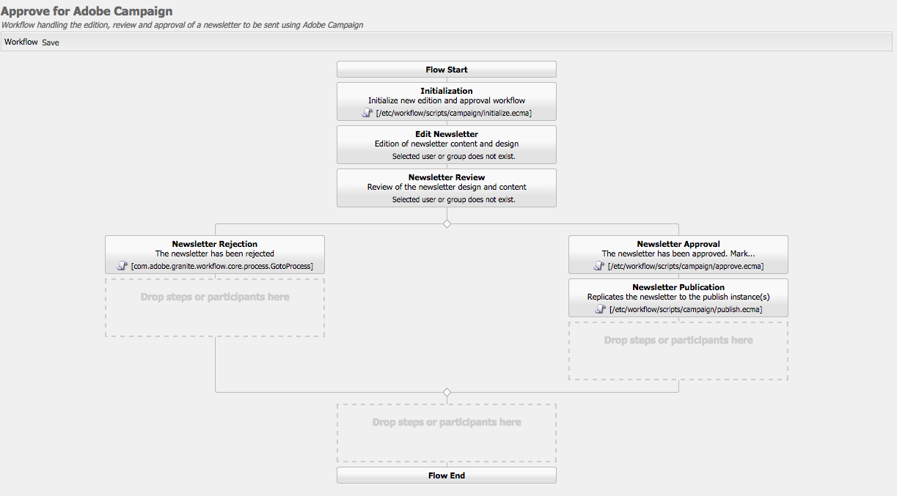

# Trabalhar com o Adobe Campaign 6.1 e o Adobe Campaign Standard{#working-with-adobe-campaign-and-adobe-campaign-standard}

É possível criar conteúdo de email no AEM e processá-lo em emails do Adobe Campaign. Para fazer isso, é preciso:

1. Criar um novo informativo no AEM a partir de um modelo específico do Adobe Campaign.
1. Selecionar [um serviço do Adobe Campaign](#selectingtheadobecampaigncloudservice) antes de editar o conteúdo para acessar todos os recursos.
1. Editar o conteúdo.
1. Validar o conteúdo.

O conteúdo pode ser sincronizado com uma entrega no Adobe Campaign. As instruções detalhadas estão descritas neste documento.

>[!NOTE]
>
>Para usar essa funcionalidade, você deve configurar o AEM para se integrar com o [Adobe Campaign](/help/sites-administering/campaignonpremise.md) ou com o [Adobe Campaign Standard](/help/sites-administering/campaignstandard.md).

## Enviar conteúdo de email por meio do Adobe Campaign {#sending-email-content-via-adobe-campaign}

Depois de configurar o AEM e o Adobe Campaign, é possível criar conteúdo de email diretamente no AEM e processá-lo no Adobe Campaign.

Ao criar conteúdo Adobe Campaign no AEM, é necessário vincular a um serviço Adobe Campaign antes de editar o conteúdo para acessar toda a funcionalidade.

Há dois casos possíveis:

* O conteúdo pode ser sincronizado com uma entrega do Adobe Campaign. Isso permite usar conteúdo do AEM em uma entrega.
* (Somente Adobe Campaign no local) O conteúdo pode ser enviado diretamente para o Adobe Campaign, que gera automaticamente uma nova entrega de email. Esse modo tem restrições.

As instruções detalhadas estão descritas neste documento.

### Criar novo conteúdo email  {#creating-new-email-content}

>[!NOTE]
>
>Ao adicionar modelos de e-mail, não se esqueça de adicioná-los em **/content/campanha** para disponibilizá-los.

1. Em AEM, selecione a pasta **Sites** e navegue pelo seu explorador para descobrir onde as campanhas de e-mail são gerenciadas. No exemplo a seguir, o nó em questão é **Sites** > **Campanha** > **Geometrixx Outdoors** > **Campanhas de correio eletrônico**.

   >[!NOTE]
   >
   >[Amostras de email estão disponíveis apenas no Geometrixx](/help/sites-developing/we-retail.md#weretail). Baixe o conteúdo de amostra do Geometrixx pelo Compartilhamento de pacotes.

   

1. Selecione **Nova** > **Nova página** para criar novo conteúdo de email.
1. Selecione um dos modelos disponíveis que são específicos do Adobe Campaign, e preencha as propriedades gerais da página. Há três modelos disponíveis por padrão:

   * **Email do Adobe Campaign (AC 6.1)**: permite adicionar conteúdo a um modelo predefinido antes de enviá-lo ao Adobe Campaign 6.1 para entrega.
   * **Email do Adobe Campaign (ACS)**: permite adicionar conteúdo a um modelo predefinido antes de enviá-lo ao Adobe Campaign Standard para entrega.

   

1. Clique em **Criar** para criar seu email ou boletim informativo.

### Selecionar o modelo e o serviço de nuvem do Adobe Campaign {#selecting-the-adobe-campaign-cloud-service-and-template}

Para fazer a integração com o Adobe Campaign, é necessário adicionar um serviço de nuvem do Adobe Campaign à página. Isso fornece acesso à personalização e a outras informações do Adobe Campaign.

Além disso, também pode ser necessário selecionar o modelo do Adobe Campaign, alterar o assunto e adicionar conteúdo em texto simples para os usuários que não verão o email em HTML.

1. Selecione a guia **Página** no sidekick e selecione **Propriedades da página.**
1. Na guia **Serviços em nuvem** na janela pop-up, selecione **Adicionar serviço** para adicionar o serviço Adobe Campaign e clique em **OK**.

   

1. Selecione a configuração que corresponde à instância do Adobe Campaign na lista suspensa e clique em **Ok**.

   >[!NOTE]
   >
   >Toque/clique em **OK** ou **Aplicar** depois de adicionar o serviço em nuvem. Isso permite que a guia **Adobe Campaign** funcione corretamente.

1. Se você quiser aplicar um template do delivery de email específico (da Adobe Campaign), diferente do modelo padrão **mail**, selecione **Propriedades da página** novamente. Na guia **Adobe Campaign**, digite o nome interno do template do delivery de email na instância do Adobe Campaign relacionada.

   No Adobe Campaign Standard, o modelo é **Entrega com conteúdo do AEM**. No Adobe Campaign 6.1, o modelo é **Entrega de email com conteúdo do AEM**.

   Quando você seleciona o modelo, o AEM ativa automaticamente os componentes **Newsletter Adobe Campaign**.

### Edição do conteúdo de email {#editing-email-content}

É possível editar conteúdo de email na interface de usuário clássica ou na interface de usuário otimizada para toque.

1. Digite o assunto e a versão de texto do email selecionando **Propriedades da página** > **Email** na caixa de ferramentas.

   

1. Edite o conteúdo do email, adicionando os elementos desejados dentre os disponíveis no sidekick. Para fazer isso, arraste-os e solte-os. Em seguida, clique duas vezes no elemento que deseja editar.

   Por exemplo, é possível adicionar texto contendo campos de personalização.

   

   Consulte [Componentes do Adobe Campaign](/help/sites-classic-ui-authoring/classic-personalization-ac-components.md) para obter uma descrição dos componentes disponíveis para boletins informativos/campanhas de email do Adobe Campaign.

   

### Adicionar personalização {#inserting-personalization}

Ao editar o conteúdo, é possível inserir:

* Campos de contexto do Adobe Campaign. Esses são campos que você pode inserir no texto que serão adaptados de acordo com os dados do recipient (por exemplo, nome, sobrenome ou quaisquer dados da dimensão do público alvo).
* Blocos de personalização do Adobe Campaign. Esses são blocos de conteúdo predefinido que não estão relacionados aos dados do recipient, como o logotipo de uma marca ou o link para um mirror page.

Consulte [Componentes do Adobe Campaign](/help/sites-classic-ui-authoring/classic-personalization-ac-components.md) para obter uma descrição completa dos componentes de campanha.

>[!NOTE]
>
>* Somente os campos da dimensão de direcionamento de **Perfis** do Adobe Campaign são considerados.
>* Ao exibir Propriedades de **Sites**, você não tem acesso aos campos de contexto do Adobe Campaign. É possível acessá-los diretamente do email ao editar.

>

1. Insira um novo componente **Newsletter** > **Texto e personalização (Campanha)**.
1. Clique duas vezes no componente para abri-lo. A janela **Editar** tem uma funcionalidade que permite inserir elementos de personalização.

   >[!NOTE]
   >
   >Os campos de contexto disponíveis correspondem à dimensão de direcionamento **Perfis** no Adobe Campaign.
   >
   >Consulte [Vincular uma página AEM a um email da Adobe Campaign](/help/sites-classic-ui-authoring/classic-personalization-ac-campaign.md#linkinganaempagetoanadobecampaignemail).

   

1. Selecione **Contexto do cliente** no sidekick para testar os campos de personalização usando os dados nos perfis personalizados.

   

1. Uma janela é exibida e permite selecionar o perfil desejado. Os campos de personalização são substituídos automaticamente pelos dados do perfil selecionado.

   

### Visualizar um boletim informativo {#previewing-a-newsletter}

É possível visualizar como o boletim informativo será exibido, além da personalização.

1. Abra o boletim informativo que deseja visualizar e clique em Visualizar (lupa) para encolher o sidekick.
1. Clique em um dos ícones de cliente de email para visualizar seu boletim informativo em cada cliente de email.

   

1. Expanda o sidekick para começar a editar novamente.

### Aprovação de conteúdo no AEM  {#approving-content-in-aem}

Depois que o conteúdo estiver concluído, você pode iniciar o processo de aprovação. Vá para a guia **Fluxo de trabalho** da caixa de ferramentas e selecione **Aprovar para Adobe Campaign** fluxo de trabalho.

Esse fluxo de trabalho pronto para uso tem duas etapas: revisão e aprovação ou revisão e rejeição. No entanto, esse fluxo de trabalho pode ser estendido e adaptado a um processo mais complexo.

Para aprovar o conteúdo para o Adobe Campaign, aplique o fluxo de trabalho selecionando **Fluxo de trabalho** no sidekick, e em seguida **Aprovar para Adobe Campaign** e clique em **Iniciar fluxo de trabalho**. Realize as etapas e aprove o conteúdo. Também é possível descartar o conteúdo selecionando **Rejeitar** em vez de **Aprovar** na última etapa do fluxo de trabalho.

Depois de aprovado, o conteúdo é exibido como aprovado no Adobe Campaign. O email pode então ser enviado.

No Adobe Campaign Standard:

No Adobe Campaign 6.1:

>[!NOTE]
>
>O conteúdo não aprovado pode ser sincronizado com uma entrega no Adobe Campaign, mas a entrega não pode ser realizada. Somente conteúdo aprovado pode ser enviado por meio das entregas do Campaign.

## Vincular o AEM com o Adobe Campaign Standard e o Adobe Campaign 6.1  {#linking-aem-with-adobe-campaign-standard-and-adobe-campaign}

>[!NOTE]
>
>Consulte [Vincular AEM ao Adobe Campaign Standard e Adobe Campaign 6.1](/help/sites-authoring/campaign.md#linking-aem-with-adobe-campaign-standard-and-adobe-campaign-classic) em [Trabalhar com o Adobe Campaign 6.1 e o Adobe Campaign Standard](/help/sites-authoring/campaign.md) na documentação de criação padrão para obter detalhes.

