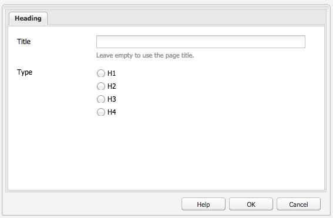
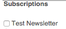

# Componentes do Adobe Campaign{#adobe-campaign-components}

Ao fazer a integração com o Adobe Campaign, você tem componentes disponíveis para trabalhar com informativos e formulários. Ambos estão descritos neste documento.

>[!CAUTION]
>
>Os componentes de email AEM foram descontinuados. Devido à natureza do email, que mescla conteúdo e estilo, os componentes de email fornecidos prontos para uso pelo AEM se tornam de reutilização limitada para clientes devido à necessidade de implementar estilos personalizados em quaisquer componentes necessários para os projetos.
>
>Os componentes de email podem ser implementados no nível do projeto, e os componentes de email AEM obsoletos ilustram como isso pode ser feito. No entanto, esses componentes obsoletos não devem ser usados em projetos.

## Componentes do informativo do Adobe Campaign {#adobe-campaign-newsletter-components}

Todos os componentes do Campaign seguem as práticas recomendadas descritas em [Práticas recomendadas para modelos de email](/help/sites-administering/best-practices-for-email-templates.md) e são baseados na linguagem de marcação Adobe [HTL](https://helpx.adobe.com/br/experience-manager/htl/using/overview.html).

Ao abrir um informativo/email configurado para integração com o Adobe Campaign, você deve ver os seguintes componentes na **Informativo do Adobe Campaign** seção:

* Cabeçalho (Campanha)
* Imagem (Campanha)
* Link (Campanha)
* Modelo de imagem do Scene7 (Campanha)
* Referência direcionada (Campaign)
* Texto e Imagem (Campanha)
* Texto e personalização (Campanha)

Uma descrição desses componentes está na seção a seguir.

### Cabeçalho (Campanha) {#heading-campaign}

O componente de cabeçalho pode:

* Exibir o nome da página atual, deixando a variável **Título** campo em branco.
* Exibir um texto especificado na variável **Título** campo.

Você edita a variável **Cabeçalho (Campaign)** componente diretamente. Deixe em branco para utilizar título da página.

Você pode configurar o seguinte:

* **Título**
Se quiser usar um nome diferente do título da página, insira-o aqui.

* **Nível de cabeçalho (1, 2, 3, 4)**
O nível de cabeçalho com base nos tamanhos de cabeçalho de HTML de 1 a 4.

O exemplo a seguir mostra um componente Cabeçalho (Campaign) sendo exibido.

### Imagem (Campanha) {#image-campaign}

O componente de imagem (campanha) exibe uma imagem e o texto respectivo de acordo com os parâmetros especificados.

Você pode fazer upload de uma imagem, em seguida, editá-la e manipulá-la (por exemplo, recortar, girar, adicionar link/título/texto).

Você pode fazer upload de uma imagem, em seguida, editá-la e manipulá-la (por exemplo, recortar, girar, adicionar link/título/texto). Você pode arrastar e soltar uma imagem do [Localizador de conteúdo](/help/sites-authoring/author-environment-tools.md#thecontentfinderclassicui) diretamente no componente ou na caixa de diálogo Editar. Você também pode clicar duas vezes na área central da caixa de diálogo Editar para navegar pelo sistema de arquivos local e fazer upload de uma imagem. As duas guias da caixa de diálogo Editar também controlam todas as definições e manipulações da imagem:

Quando uma imagem é carregada, você pode configurar o seguinte:

* **Mapa**
Para mapear uma imagem, selecione Mapa. Você pode especificar como deseja criar o mapa de imagem (retângulo, polígono e assim por diante) e para onde a área deve apontar.

* **Cortar**
Selecione Recortar para recortar uma imagem. Use o mouse para recortar a imagem.

* **Girar**
Para girar uma imagem, selecione Girar. Use repetidamente até que a imagem seja girada da maneira que desejar.

* **Limpar**
Remova a imagem atual.

* Barra de zoom (somente clássica) Para aumentar e diminuir o zoom da imagem, use a barra de rolagem abaixo da imagem (acima dos botões OK e Cancelar)
* **Título**
O título da imagem.

* **Texto alternativo**
Um texto alternativo para usar na criação de conteúdo acessível.

* **Vincular ao**
Crie um link para ativos ou outras páginas no seu site.

* **Descrição**
Uma descrição da imagem.

* **Tamanho**
Define a altura e a largura da imagem.

>[!NOTE]
>
>Você deve inserir informações no **Texto alternativo** no campo **Avançado** ou a imagem não poderá ser salva e você verá a seguinte mensagem de erro:
>
>`Validation failed. Verify the values of the marked fields.`

O exemplo a seguir mostra um componente de Imagem (Campaign) sendo exibido.

### Link (Campanha) {#link-campaign}

O componente Link (Campaign) permite adicionar um link ao seu informativo. Esse componente só está disponível na interface do usuário clássica, embora você possa adicionar um na interface do usuário otimizada para toque e abri-lo no modo de compatibilidade.

Você pode configurar o seguinte no **Exibir**, **Informações do URL** ou **Avançado** guias:

* **Legenda do link**
A legenda do link. Este é o texto que os usuários veem.

* **Dica da ferramenta Link**
Adiciona informações adicionais sobre como usar o link.

* **LinkType**
Na lista suspensa, selecione entre um 
**URL personalizado** e um **Documento adaptável**. Este campo é obrigatório. Se você selecionar URL personalizado, é possível fornecer o URL do link. Se você selecionar Documento adaptável, poderá fornecer o caminho do documento.

* **Parâmetro de URL adicional**
Adicione quaisquer parâmetros de URL adicionais. Clique em Adicionar item para adicionar vários itens.

>[!NOTE]
>
>Você deve inserir informações no **Tipo de link** no campo **Informações do URL** ou o componente não poderá ser salvo, e a seguinte mensagem de erro será exibida:
>
>`Validation failed. Verify the values of the marked fields.`

O exemplo a seguir mostra um componente Link (Campaign) sendo exibido.

### Referência direcionada (Campaign) {#targeted-reference-campaign}

O componente Referência direcionada (Campaign) permite criar uma referência a um parágrafo direcionado.

Nesse componente, você navega até o parágrafo direcionado para selecioná-lo.

Clique no menu suspenso para navegar até o parágrafo que deseja referenciar. Quando terminar, clique em **OK**.

### Texto e Imagem (Campanha) {#text-image-campaign}

O componente Texto e imagem (Campaign) adiciona um bloco de texto e uma imagem.

Assim como nos componentes Texto e personalização (Campaign) e Imagem (Campaign) , é possível configurar:

* **Texto**
Inserir texto. Use a barra de ferramentas para modificar a formatação, criar listas e adicionar links.

* **Imagem**
Arraste uma imagem do localizador de conteúdo ou clique para navegar até uma imagem. Recorte ou gire, conforme necessário.

* **Propriedades da imagem** (**Propriedades avançadas de imagem**) Permite que você especifique o seguinte:

   * **Título**
O título do bloco; será exibido ao passar o mouse.

   * **Texto alternativo**
Texto alternativo a ser exibido se a imagem não puder ser exibida.

   * **Link para**
Crie um link para ativos ou outras páginas no seu site.

   * **Descrição**
Uma descrição da imagem.

   * **Tamanho**
Define a altura e a largura da imagem.

>[!NOTE]
>
>O **Texto alternativo** no campo **Avançado** é necessária ou o componente não pode ser salvo, e a seguinte mensagem de erro é exibida:
>
>`Validation failed. Verify the values of the marked fields.`

O exemplo a seguir mostra um componente Texto e imagem (Campaign) sendo exibido.

### Texto e personalização (Campanha) {#text-personalization-campaign}

O componente Texto e personalização (Campaign) permite que você insira um bloco de texto usando um editor WYSIWYG, com a funcionalidade fornecida pelo [Editor de Rich Text](/help/sites-authoring/rich-text-editor.md). Além disso, esse componente permite usar campos de contexto e blocos de personalização disponíveis no Adobe Campaign; consulte também [Inserir personalização](/help/sites-classic-ui-authoring/classic-personalization-ac-campaign.md#inserting-personalization).

A seleção de ícones permite que você formate o texto, incluindo características da fonte, alinhamento, links, listas e recuo.

Adicione texto normalmente no editor de rich text. Adicione a personalização selecionando a lista suspensa do Adobe Campaign e os campos, conforme apropriado.

Você adiciona os campos de texto e contexto ou os blocos de personalização para criar o conteúdo. Em seguida, selecione o Contexto do Cliente para testar os dados nos perfis de persona. Após selecionar uma persona, os campos de personalização são substituídos automaticamente pelos dados do perfil selecionado.

>[!NOTE]
>
>Somente os campos definidos na variável **nms:seedMember** ou uma de suas extensões é levada em conta. Os atributos das tabelas vinculadas a `nms:seedMember` não estão disponíveis.

## Componentes de formulário do Adobe Campaign {#adobe-campaign-form-components}

Use os componentes do Adobe Campaign para criar um formulário que os usuários preenchem para assinar um informativo, cancelar a assinatura de um informativo ou atualizar seus perfis de usuário. Consulte [Criação do Adobe Campaign Forms](/help/sites-classic-ui-authoring/classic-personalization-ac-forms.md) para obter mais informações.

Cada campo de componente pode ser vinculado a um campo de banco de dados do Adobe Campaign. Os campos disponíveis diferem de acordo com o tipo de dados que eles contêm, conforme descrito na seção [Componentes e tipo de dados](#components-and-data-type). Se você estender o esquema do recipient no Adobe Campaign, os novos campos estarão disponíveis nos componentes cujos tipos de dados correspondem.

Ao abrir um formulário configurado para integração com o Adobe Campaign, você verá os seguintes componentes na **Adobe Campaign** seção:

* Caixa de seleção (Campanha)
* Campo de data (Campaign) e Campo de data/HTML5 (Campaign)
* Chave primária criptografada (Campanha)
* Exibição de erro (Campaign)
* Chave de reconciliação oculta (Campanha)
* Campo numérico (Campanha)
* Campo de opções (Campanha)
* Lista de verificação de assinaturas (Campanha)
* Campo de texto (Campanha)

Esta seção descreve cada componente em detalhes.

### Componentes e tipo de dados {#components-and-data-type}

A tabela a seguir descreve os componentes disponíveis para exibir e modificar os dados de perfil do Adobe Campaign. Cada componente pode ser mapeado para um campo de perfil do Adobe Campaign para exibir seu valor e atualizar o campo quando o formulário for enviado. Os diferentes componentes só podem ser correspondidos aos campos de um tipo de dados apropriado.

<table>
 <tbody>
  <tr>
   <td>
<strong>Componente</strong>
 </td>
   <td>
<strong>Tipo de dados do campo Adobe Campaign</strong>
 </td>
   <td>
<strong>Exemplo de campo</strong>
 </td>
  </tr>
  <tr>
   <td>
Caixa de seleção (Campanha)
 </td>
   <td>
booleano
 </td>
   <td>
Não entrar mais em contato (por qualquer canal)
 </td>
  </tr>
  <tr>
   <td>
Campo de dados (Campanha)
 
Campo de data/HTML 5 (Campanha)
 </td>
   <td>
data
 </td>
   <td>
Data de nascimento
 </td>
  </tr>
  <tr>
   <td>
Campo numérico (Campanha)
 </td>
   <td>
numérico (byte, curto, longo, duplo)
 </td>
   <td>
Idade
 </td>
  </tr>
  <tr>
   <td>
Campo de opções (Campanha)
 </td>
   <td>
byte com valores associados
 </td>
   <td>
Sexo
 </td>
  </tr>
  <tr>
   <td>
Campo de texto (Campanha)
 </td>
   <td>
string
 </td>
   <td>
Email
 </td>
  </tr>
 </tbody>
</table>

### Configurações comuns à maioria dos componentes {#settings-common-to-most-components}

Os componentes do Adobe Campaign têm configurações comuns em todos os componentes (exceto os componentes Chave primária criptografada e Chave de reconciliação oculta).

Na maioria dos componentes, você pode configurar o seguinte:

#### Título e texto {#title-and-text}

* **Título**
Se quiser usar um nome diferente do nome do elemento, insira-o aqui.

* **Ocultar Título**
Marque essa caixa de seleção se não quiser que o título fique visível.

* **Descrição**
Adicione uma descrição ao campo para fornecer mais informações para os usuários.

* **Mostrar apenas valor**
Mostra apenas o valor, se houver um

#### Adobe Campaign {#adobe-campaign}

Você pode configurar o seguinte:

* **Mapeamento**
Selecione um campo de personalização do Adobe Campaign, se apropriado.

* **Chave de Reconciliação**
Marque essa caixa de seleção se esse campo fizer parte da chave de reconciliação.

#### Restrições {#constraints}

* **Obrigatório** - Marque essa caixa de seleção para tornar esse componente obrigatório; ou seja, os usuários devem inserir um valor.
* **Mensagem necessária** - Opcionalmente, adicione uma mensagem informando que o campo é obrigatório.

#### Estilo {#styling}

* **CSS**
Insira as classes CSS que deseja usar para esse componente.

### Caixa de seleção (Campanha) {#checkbox-campaign}

O componente Caixa de seleção (Campaign) permite que o usuário modifique campos de perfil do Adobe Campaign que sejam do tipo de dados booleano. Por exemplo, você pode ter um componente Caixa de seleção (Campaign) que permite que o recipient especifique que não deseja ser contatado por meio de nenhum canal.

Você pode [definir configurações comuns à maioria dos componentes do Adobe Campaign](#settings-common-to-most-components) no componente Caixa de seleção (Campaign) .

O exemplo a seguir mostra um componente Caixa de seleção (Campaign) sendo exibido.

### Campo de data (Campaign) e Campo de data/HTML 5 (Campaign) {#date-field-campaign-and-date-field-html-campaign}

Use o campo de data para permitir que os recipients tenham uma data; por exemplo, talvez você queira que os recipients especifiquem suas datas de nascimento. O formato de data corresponde ao formato usado em sua instância do Adobe Campaign.

Além de [configurações comuns à maioria dos componentes do Adobe Campaign](#settings-common-to-most-components), você pode configurar o seguinte:

* **Restrições - Restrição** - Você pode selecionar - **Nenhum** ou **Data** para adicionar a restrição de uma data ou nenhuma restrição. Se você selecionar data, a resposta que os usuários inserirem no campo deverá estar em um formato de data.

* **Mensagem de restrição** - Além disso, é possível adicionar uma mensagem de restrição para que os usuários saibam formatar corretamente suas respostas.
* **Estilo - Largura** - Ajuste a largura do campo clicando ou tocando no botão **+** e **-** ou inserir um número.

O exemplo a seguir mostra um componente Campo de data (Campaign) com a largura ajustada sendo exibida.

### Chave primária criptografada (Campanha) {#encrypted-primary-key-campaign}

Esse componente define o nome do parâmetro de URL que conterá o identificador de um perfil do Adobe Campaign (**Identificador de recurso principal** ou **Chave primária criptografada** no Adobe Campaign Standard e 6.1, respectivamente).

Cada formulário exibindo e modificando os dados de perfil do Adobe Campaign **must** inclua um componente Chave primária criptografada.

Você pode configurar o seguinte no componente Chave primária criptografada (Campaign):

* **Título e texto - Nome do elemento** - O padrão é encryptedPK. Você só precisa alterar o nome do elemento quando ele estiver em conflito com o nome de outro elemento no formulário. Dois campos de formulário não podem ter o mesmo nome de elemento.
* **Adobe Campaign - Parâmetro de URL** - Adicione o parâmetro de URL para a EPK. Por exemplo, você pode usar o valor **epk**.

O exemplo a seguir mostra um componente Chave primária criptografada (Campaign) sendo exibido.

### Exibição de erro (Campaign) {#error-display-campaign}

Esse componente permite exibir erros de backend. O tratamento de erros do formulário precisa ser definido como Encaminhar para que o componente funcione corretamente.

O exemplo a seguir mostra um componente Exibição de erro (Campaign) sendo exibido.

### Chave de reconciliação oculta (Campanha) {#hidden-reconciliation-key-campaign}

O componente Chave de reconciliação oculta (Campaign) permite adicionar campos ocultos como parte da chave de reconciliação a um formulário.

Você pode configurar o seguinte no componente Chave de reconciliação oculta (Campaign):

* **Título e texto - Nome do elemento** - O padrão é reconcilKey. Você só precisa alterar o nome do elemento quando ele estiver em conflito com o nome de outro elemento no formulário. Dois campos de formulário não podem ter o mesmo nome de elemento.
* **Adobe Campaign - Mapeamento** - Mapear para um campo de personalização do Adobe Campaign.

O exemplo a seguir mostra um componente Chave de reconciliação oculta (Campaign) sendo exibido.

### Campo numérico (Campanha) {#numeric-field-campaign}

Use o campo numérico para permitir que os recipients insiram números, por exemplo, sua idade.

Além de [configurações comuns à maioria dos componentes do Adobe Campaign](#settings-common-to-most-components), você pode configurar o seguinte:

* **Restrições - Restrição** menu suspenso Você pode selecionar - **Nenhum** ou **Numérico -** para adicionar a restrição de um número ou nenhuma restrição. Se você selecionar um número, a resposta que os usuários inserirem no campo deverá ser numérica.

* **Mensagem de restrição** - Além disso, é possível adicionar uma mensagem de restrição para que os usuários saibam formatar corretamente suas respostas.
* **Estilo - Largura** - Ajuste a largura do campo clicando ou tocando no botão **+** e **-** ou inserir um número.

O exemplo a seguir mostra um componente Campo numérico (Campaign) com a largura configurada sendo exibida.

### Campo de opções (Campanha) {#option-field-campaign}

Essa lista suspensa permite selecionar uma opção; por exemplo, o gênero ou status de um recipient.

Você pode [definir configurações comuns à maioria dos componentes do Adobe Campaign](#settings-common-to-most-components) no componente Campo de opções (Campaign). Para preencher a lista suspensa, selecione o campo apropriado nos campos de personalização do Adobe Campaign clicando ou tocando no símbolo do Adobe Campaign e navegando até o campo .

O exemplo a seguir mostra um componente Campo de opção (Campaign) sendo exibido.

### Lista de verificação de assinaturas (Campanha) {#subscriptions-checklist-campaign}

Use o **Lista de verificação de assinaturas (Campaign)** para modificar as assinaturas associadas a um perfil do Adobe Campaign.

Quando adicionado a um formulário, esse componente exibe todas as assinaturas disponíveis como caixas de seleção e permite que o usuário selecione as assinaturas desejadas. Quando os usuários enviam o formulário, esse componente inscreve o usuário ou cancela a assinatura dos serviços selecionados, dependendo do tipo de ação de formulário (**Adobe Campaign: Inscrever-se nos Serviços** ou **Adobe Campaign: Cancelar assinatura dos serviços**).

>[!NOTE]
>
>O componente não verifica de quais serviços o usuário já está inscrito/cancelado.

Você pode [definir configurações comuns à maioria dos componentes do Adobe Campaign](#settings-common-to-most-components) no componente Lista de verificação de assinaturas (Campaign) . (Não há configurações do Adobe Campaign disponíveis para esse componente.)

O exemplo a seguir mostra um componente Lista de verificação de assinaturas (Campaign) sendo exibido.

### Campo de texto (Campanha) {#text-field-campaign}

O componente Campo de texto (Campaign) que permite inserir dados do tipo string, como nome, sobrenome, endereço, endereço de email e assim por diante.

Além de [configurações comuns à maioria dos componentes do Adobe Campaign](#settings-common-to-most-components), você pode configurar o seguinte:

* **Restrições - Restrição** - suspenso - Você pode selecionar - **Nenhum**, **Email**, **Nome** (sem tremas) para adicionar a restrição de um endereço de email, nome ou nenhuma restrição. Se você selecionar um email, a resposta que os usuários inserirem no campo deverá ser um endereço de email. Se você selecionar um nome, ele deve ser um nome (trema não são permitidos).

* **Mensagem de restrição** - Além disso, é possível adicionar uma mensagem de restrição para que os usuários saibam formatar corretamente suas respostas.
* **Estilo - Largura** - Ajuste a largura do campo clicando ou tocando no botão **+** e **-** ou inserir um número.

O exemplo a seguir mostra um componente Campo de texto (Campaign) sendo exibido.

