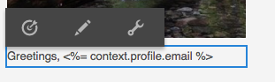

# Direcionamento do seu Adobe Campaign{#targeting-your-adobe-campaign}

Para direcionar seu informativo no Adobe Campaign, primeiro é necessário configurar a segmentação, que só está disponível na interface clássica. Depois disso, você poderá criar experiências direcionadas para o Adobe Campaign.

## Configuração da segmentação no AEM {#setting-up-segmentation-in-aem}

A configuração da segmentação inclui a criação de segmentos, uma marca, uma campanha e experiências. Você só pode criar um segmento na interface clássica. Você pode criar marcas, campanhas e experiências na interface habilitada para toque.

>[!NOTE]
>
>A ID de segmento precisa ser mapeada para a do lado do Adobe Campaign.

### Criação de segmentos {#creating-segments}

Para criar segmentos:

1. Abra o [console de segmentação](http://localhost:4502/miscadmin#/etc/segmentation) em **&lt;host>:&lt;port>/miscadmin#/etc/segmentation**.
1. Crie uma página e insira um título - por exemplo, **Segmentos CA** - e selecione o **Segmento (Adobe Campaign)** modelo.
1. Selecione a página criada na visualização de árvore no lado esquerdo.
1. Crie um segmento, por exemplo, direcionando usuários do sexo masculino, criando uma página no segmento criado chamado Masculino e selecione a **Segmento (Adobe Campaign)** modelo.
1. Abra a página de segmento criada e arraste e solte uma **ID do segmento** do sidekick para a página.
1. Clique duas vezes na característica, insira a ID que representa, nesse caso, o segmento masculino definido no Adobe Campaign - por exemplo, **MACHO** - e clique em **OK**. A seguinte mensagem deve ser exibida: `targetData.segmentCode == "MALE"`
1. Repita as etapas para outro segmento, por exemplo, um segmento direcionado a usuários do sexo feminino.

### Criar uma marca {#creating-a-brand}

Para criar uma marca:

1. Entrada **Sites**, navegue até o **Campanhas** pasta (por exemplo, em We.Retail).
1. Clique em **Criar página** e insira um título para a página, por exemplo, We.Retail Brand e selecione o **Marca** modelo.

### Criar uma campanha {#creating-a-campaign}

Para criar uma campanha:

1. Abra o **Marca** página criada.
1. Clique em **Criar página** e insira um título para a sua página, por exemplo, Campanha We.Retail, e selecione o **Campaign** e clique em **Criar**.

### Criação de experiências {#creating-experiences}

Para criar experiências para segmentos:

1. Abra o **Campaign** página criada.
1. Crie experiências para seus segmentos clicando em **Criar página** e inserir um título para a página, por exemplo, Masculino, enquanto cria uma experiência para o segmento Masculino, e selecione a variável **Experiência** modelo.
1. Abra a página Experiência criada.
1. Clique em **Editar** e, abaixo de Segmentos, clique em **Adicionar item**.
1. Insira o caminho para o segmento masculino, por exemplo, `/etc/segmentation/ac-segments/male` e clique em **OK**. A seguinte mensagem deve ser exibida: *A experiência está direcionada para: Masculino*
1. Repita as etapas anteriores para criar uma experiência para todos os segmentos, por exemplo, o público-alvo feminino.

## Criação de informativo com conteúdo direcionado {#creating-a-newsletter-with-targeted-content}

Depois de criar segmentos, uma marca, uma campanha e uma experiência, você pode criar um informativo com conteúdo direcionado. Depois de criar a experiência, vincule as experiências aos seus segmentos.

Você pode criar o informativo com conteúdo direcionado na interface do usuário habilitada para toque e clássica. Este documento descreve o procedimento para a interface habilitada para toque.

Para criar um informativo com conteúdo direcionado:

1. Crie um boletim informativo com conteúdo direcionado: abaixo de Campanhas por email no Geometrixx Outdoors, clique em **Criar** > **Página** e selecione um dos modelos do Adobe Campaign Mail.

   >[!NOTE]
   >
   >[As amostras de email estão disponíveis somente no Geometrixx](/help/sites-developing/we-retail.md#weretail). Baixe o conteúdo de Geometrixx de amostra do Compartilhamento de pacotes.

1. No informativo, adicione um componente de Texto e Personalização.
1. Adicione texto ao componente Texto e personalização, como &quot;Este é o padrão&quot;.
1. Clique na seta ao lado de **Editar** e selecione **Direcionamento**.
1. Selecione sua marca no menu suspenso Marca e selecione sua Campanha. (Esta é a marca e a campanha que você criou anteriormente).
1. Clique em **Iniciar o direcionamento**. Os segmentos são exibidos na área Públicos. A experiência padrão é usada se nenhum dos segmentos definidos for correspondente.

   >[!NOTE]
   >
   >Por padrão, as amostras de email incluídas com o AEM usam o Adobe Campaign como mecanismo de direcionamento. Para boletins informativos personalizados, talvez seja necessário selecionar o Adobe Campaign como mecanismo de direcionamento. Ao direcionar, clique em + na barra de ferramentas, insira um título para a nova atividade e selecione **Adobe Campaign** como mecanismo de direcionamento.

1. Clique em **Padrão** e, em seguida, o componente Texto e personalização adicionado e você vê o Alvo com uma seta. Clique no ícone para direcionar esse componente.

   

1. Navegue até outro segmento (Masculino) e clique em **Adicionar oferta** e clique no ícone de adição +. Em seguida, edite a oferta.
1. Navegue até outro segmento (Feminino) e clique em **Adicionar oferta** e o ícone de mais +. Em seguida, edite esta oferta.
1. Clique em **Próxima** para ver Mapeamento, clique em **Próxima** para ver Configurações, que não se aplicam ao Adobe Campaign, e clique em **Salvar**.

   O AEM gera automaticamente o código de direcionamento correto para o Adobe Campaign quando o conteúdo é usado em um delivery dentro do Adobe Campaign

1. No Adobe Campaign, crie seu delivery - selecione **Entrega de email com conteúdo AEM** e selecione a conta do AEM local, conforme apropriado, e confirme suas alterações.

   Na visualização HTML, as diferentes experiências dos componentes direcionados são incluídas no código de direcionamento do Adobe Campaign.

   

   >[!NOTE]
   >
   >Se você também configurar os segmentos no Adobe Campaign, clique em **Visualizar** O mostrará as experiências de cada segmento.
