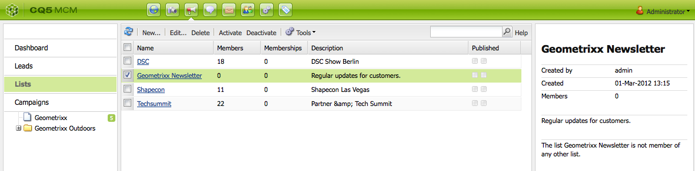
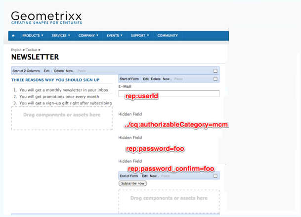
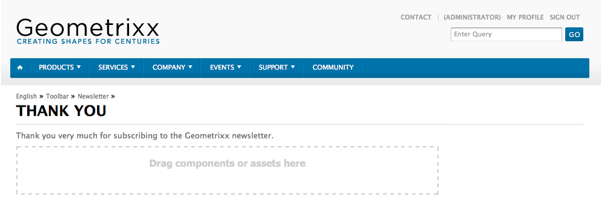

# Criação de uma página de aterrissagem de informativo eficaz{#creating-an-effective-newsletter-landing-page}

Uma página de aterrissagem de informativo eficaz ajuda você a obter o maior número possível de pessoas para se inscreverem no seu informativo (ou outra campanha de email marketing). É possível usar as informações coletadas nas inscrições dos seus informativos para obter leads.

Para criar uma página de aterrissagem de informativo eficaz, você precisa fazer o seguinte:

1. Crie uma lista para o informativo para que as pessoas possam se inscrever nele.
1. Crie o formulário de inscrição. Ao fazer isso, adicione uma etapa de fluxo de trabalho que adicione automaticamente à sua lista de leads a pessoa que se inscreve no informativo.
1. Crie uma página de confirmação que permita que os usuários se inscrevam e, possivelmente, forneça a eles uma promoção.
1. Adicione teasers.

>[!NOTE]
>
>A Adobe não planeja aprimorar mais esse recurso (Gerenciamento de leads e listas).
>A recomendação é aproveitar [Adobe Campaign e a integração para AEM](/help/sites-administering/campaign.md).

## Criação de uma lista para o informativo {#creating-a-list-for-the-newsletter}

Crie uma lista, por exemplo, **Informativo do Geometrixx**, no MCM para o informativo que as pessoas devem assinar. O processo de criar listas é descrito em [Criação de listas](/help/sites-classic-ui-authoring/classic-personalization-campaigns.md#creatingnewlists).

A seguir é exibido um exemplo de lista:

## Criar um formulário de inscrição {#create-a-sign-up-form}

Crie um formulário de registro de informativo que permita que os usuários se inscrevam em tags. O site Geometrixx de amostra fornece uma página de informativo na barra de ferramentas Geometrixx, onde é possível criar seu formulário.

Para criar seu próprio formulário de informativo, consulte as informações sobre como criar formulários na [documentação do Forms](/help/sites-authoring/default-components.md#form). O informativo usa as tags da biblioteca de Tags. Para adicionar outras tags, consulte [Administração de tags](/help/sites-authoring/tags.md#tagadministration).

Os campos ocultos no exemplo a seguir fornecem a quantidade mínima de informações (email). Além disso, você pode adicionar mais campos posteriormente, mas a taxa de conversão será afetada.

O exemplo a seguir é um formulário criado em https://localhost:4502/cf#/content/geometrixx/en/toolbar/newsletter.html.

1. Crie o formulário.

   

1. Clique em **Editar** no componente Formulário para configurar o formulário de forma que ele seja direcionado a uma página de agradecimento (consulte [Criação de páginas de agradecimento](#creating-a-thank-you-page)).

   

1. Defina a ação de Formulário (o que acontecerá quando você enviar o formulário) e configure o grupo para atribuir usuários registrados à lista criada anteriormente (por exemplo, geometrixx-informativo).

   

### Criação de uma página de agradecimento {#creating-a-thank-you-page}

Quando os usuários clicam em **Inscrever-se agora**, você deseja que uma página de agradecimento seja aberta automaticamente. Crie a página de agradecimento na página Informativo do Geometrixx. Depois de criar o Formulário de informativo, edite o componente Formulário e adicione o caminho à página de agradecimento.

O envio da solicitação leva o usuário a uma página de **agradecimento**, após a qual ele receberá um email. Essa página de agradecimento foi criada em /content/geometrixx/en/toolbar/newsletter/thank_you.

### Adição de teasers {#adding-teasers}

Adicione [teasers](/help/sites-classic-ui-authoring/classic-personalization-campaigns.md#teasers) para direcionar públicos-alvo específicos. Por exemplo, você pode adicionar teasers à página de agradecimento e à página de inscrição do informativo.

Para adicionar teasers para criar uma página de aterrissagem de informativo eficaz:

1. Crie um parágrafo de teaser para um brinde de inscrição. Selecione **Primeiro** como a estratégia e inclua o texto informando o brinde que os usuários receberão.

   

1. Crie um parágrafo de teaser para a página de agradecimento. Selecione **Primeiro** como estratégia e inclua um texto indicando que o brinde está a caminho.

   

1. Crie uma campanha com os dois teasers: marque um com negócios e deixe o outro sem marcação.

### Envio de conteúdo aos assinantes {#pushing-content-to-subscribers}

Envie as alterações em páginas usando a funcionalidade de Informativo no MCM. Em seguida, envie conteúdo atualizado aos assinantes.

Consulte [Envio de informativos](/help/sites-classic-ui-authoring/classic-personalization-campaigns.md#newsletters).
