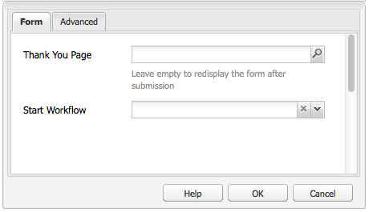

# Criação de uma página inicial efetiva de informativo{#creating-an-effective-newsletter-landing-page}

Uma página de aterrissagem eficaz do informativo ajuda você a obter o máximo de pessoas possível para se inscrever no seu informativo (ou outra campanha de marketing por email). Você pode usar as informações coletadas nas inscrições do seu boletim informativo para obter leads.

Para criar uma landing page efetiva do boletim informativo, faça o seguinte:

1. Crie uma lista para o informativo para que as pessoas possam assiná-lo.
1. Crie o formulário de inscrição. Ao fazer isso, adicione uma etapa de fluxo de trabalho que adiciona automaticamente a pessoa que se inscreve no boletim informativo à sua lista de clientes potenciais.
1. Crie uma página de Confirmação que agradeça os usuários por se inscreverem e possivelmente forneça a eles uma promoção.
1. Adicione teasers.

>[!NOTE]
>
>A Adobe não pretende aprimorar ainda mais esse recurso (Gerenciamento de clientes em potencial e listas).
>A recomendação é usar [Adobe Campaign e a integração com o AEM](/help/sites-administering/campaign.md).

## Criação de uma lista para o informativo {#creating-a-list-for-the-newsletter}

Criar uma lista, por exemplo, **Informativo do Geometrixx**, no MCM para o boletim informativo ao qual as pessoas devem se inscrever. A criação de listas é descrita em [Criação de listas](/help/sites-classic-ui-authoring/classic-personalization-campaigns.md#creatingnewlists).

O exemplo a seguir mostra uma lista:

## Criar um formulário de inscrição {#create-a-sign-up-form}

Crie um formulário de registro de boletim informativo que permita que os usuários assinem tags. O site de exemplo do Geometrixx fornece uma página de informativo na barra de ferramentas do Geometrixx, onde você pode criar o formulário.

Para criar seu próprio formulário de informativo, consulte informações sobre a criação de formulários na [Documentação do Forms](/help/sites-authoring/default-components.md#form). O informativo usa as tags da Biblioteca de tags. Para adicionar tags adicionais, consulte [Administração de tags](/help/sites-authoring/tags.md#tagadministration).

Os campos ocultos no exemplo a seguir fornecem a quantidade mínima de informações (email); além disso, você pode adicionar mais campos posteriormente, mas isso afetará a taxa de conversão.

O exemplo a seguir é um formulário criado em https://localhost:4502/cf#/content/geometrixx/en/toolbar/newsletter.html.

1. Crie o formulário.

   

1. Clique em **Editar** no componente Formulário para configurar o formulário para ir para uma página de agradecimento (consulte [Criando páginas de agradecimento](#creating-a-thank-you-page)).

   

1. Defina a ação Formulário (isso é o que acontecerá quando você enviar o formulário) e configure o grupo para atribuir usuários registrados à lista criada anteriormente (por exemplo, geometrixx-newsletter).

   

### Criando uma página de agradecimento {#creating-a-thank-you-page}

Quando os usuários clicarem em **Inscreva-se agora**, você deseja que a página Obrigado seja aberta automaticamente. Crie a página de agradecimento na página do informativo do Geometrixx. Depois de criar o formulário de informativo, edite o componente de Formulário e adicione o caminho à página de agradecimento.

O envio da solicitação leva o usuário a um **Obrigado** página após a qual receberão um email. Esta página de agradecimento foi criada em /content/geometrixx/en/toolbar/newsletter/thank_you.

### Adicionar teasers {#adding-teasers}

Adicionar [teasers](/help/sites-classic-ui-authoring/classic-personalization-campaigns.md#teasers) para direcionar públicos-alvo específicos. Por exemplo, você pode adicionar teasers à página de agradecimento e à página de cadastro da newsletter.

Para adicionar teasers para criar uma página de aterrissagem efetiva de boletim informativo:

1. Crie um parágrafo de teaser para um presente de inscrição. Selecionar **Primeiro** como estratégia e incluir um texto que informa qual presente eles receberão.

   

1. Crie um parágrafo de teaser para a página de agradecimento. Selecionar **Primeiro** como estratégia e incluir texto que indica que o presente está a caminho.

   

1. Crie uma campanha com os dois teasers — marque um com business e outro sem tags.

### Envio de conteúdo aos assinantes {#pushing-content-to-subscribers}

Enviar quaisquer alterações para páginas por meio da funcionalidade Boletim informativo no MCM. Em seguida, você envia o conteúdo atualizado para os assinantes.

Consulte [Envio de informativos](/help/sites-classic-ui-authoring/classic-personalization-campaigns.md#newsletters).
