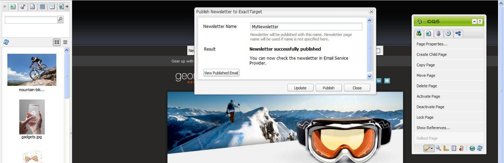

# Publicar um email para provedores de serviços de email{#publishing-an-email-to-email-service-providers}

Você pode publicar informativos em serviços de email, como ExactTarget e Silverpop Engage. Este documento descreve como configurar o AEM para publicar um boletim informativo nesses serviços de email.

>[!NOTE]
>
>Você precisa configurar o provedor de serviços antes de criar e publicar um email. Consulte [Configurando ExactTarget](/help/sites-administering/exacttarget.md) e [Configurando Silverpop Engage](/help/sites-administering/silverpop.md) para obter mais informações.

Para publicar seu email no provedor de serviços de email, é necessário executar as seguintes etapas:

1. Crie um email.
1. Aplicar a configuração do Serviço de email ao email.
1. Publish o email.

>[!NOTE]
>
>Se você atualizar provedores de email, fizer um teste de voo ou enviar um boletim informativo, essas operações falharão se o boletim informativo não for publicado primeiro na instância do Publish ou se a instância do Publish não estiver disponível. Publique seu informativo e verifique se a instância do Publish está em execução.

## Criação de um email {#creating-an-email}

Um email ou informativo que você deseja publicar em um serviço de email pode ser criado em uma campanha usando o modelo **Informativo** do Geometrixx. Você também pode usar o modelo **Geometrixx OutdoorsEmail**. Os exemplos de email/informativo baseados no modelo **Geometrixx Outdoors-Email** estão disponíveis em `https://<hostname>:<port>/cf#/content/campaigns/geometrixx-outdoors/e-mails.html`.

Para criar um email publicado no serviço de email configurado:

1. Vá para **Sites** e depois para **Campanhas**. Selecione uma campanha.
1. Clique em **Novo** para abrir a janela **Criar página**.
1. Geometrixx Insira o título, o nome e selecione o modelo **Boletim Informativo** da lista de modelos disponíveis.
1. Clique em **Criar**.
1. Abra o email criado.
1. Muda para o modo de desenho para selecionar os componentes que deseja mostrar no sidekick.
1. Alterne para o modo de edição e comece a adicionar conteúdo (texto, imagens, [ferramentas de email](#adding-exacttarget-email-tools-to-your-email), [variáveis de personalização](#adding-text-and-personalization-tool-to-your-e-mail) e assim por diante) ao seu email.

### Adicionar ferramentas de email ExactTarget ao seu email {#adding-exacttarget-email-tools-to-your-email}

>[!NOTE]
>
>Esta seção é específica para o serviço ExactTarget.

O componente **Ferramentas de email** do ExactTarget pode adicionar mais funcionalidade de email ao seu email/informativo.

1. Abra um email para ser publicado no ExactTarget.
1. Adicione o componente **ET - Ferramentas de email** à sua página usando o sidekick. Abra o componente no modo Editar.

   

1. Selecione uma opção no menu **Opções**:

<table>
 <tbody>
  <tr>
   <td>Endereço de correio físico (obrigatório)</td>
   <td>Esse componente insere o endereço de correspondência físico de sua organização no email.</td>
  </tr>
  <tr>
   <td>Centro de perfil (obrigatório)</td>
   <td>O centro de perfil é uma página da Web em que os assinantes podem inserir e manter as informações pessoais que você mantém sobre eles.</td>
  </tr>
  <tr>
   <td>Visualizar e-mail como página da web</td>
   <td>Esse componente permite que o usuário visualize o email como uma página da Web.</td>
  </tr>
  <tr>
   <td>Política de privacidade</td>
   <td>Este componente insere o link para sua política de privacidade no email.  </td>
  </tr>
  <tr>
   <td>Central para cancelar inscrição</td>
   <td>Dá ao usuário a opção de cancelar a inscrição na lista de endereçamento.</td>
  </tr>
  <tr>
   <td>Centro de assinaturas</td>
   <td>Uma central de assinaturas é uma página da Web em que um assinante pode controlar as mensagens que recebe da sua organização.</td>
  </tr>
  <tr>
   <td>Rastrear aberturas de e-mail</td>
   <td>Um componente oculto que permite usar o recurso de rastreamento ExactTarget.  </td>
  </tr>
 </tbody>
</table>

>[!NOTE]
>
>O menu suspenso **Options** só será preenchido se a configuração ExactTarget for aplicada ao email. Consulte [Aplicando a configuração do serviço de email às configurações de email](#applying-e-mail-service-configuration-to-e-mail-settings) para obter mais informações.

1. Publish o email para ExactTarget.

   O email com as ferramentas de email está disponível para uso na conta ExactTarget configurada.

>[!NOTE]
>
>* As URLs nas ferramentas de email são substituídas (no email recebido) por seus valores reais apenas quando um email é enviado usando o **Envio simples** ou o **Envio guiado**, mas não o **Envio de teste**.
>
>* Duas das ferramentas de email são necessárias: **Endereço de Correspondência Físico (Obrigatório)** e **Centro de Perfis (Obrigatório)**. Quando o email é publicado no ExactTarget, essas duas ferramentas de email são adicionadas à parte inferior de cada email por padrão.
>

### Adicionar a ferramenta Texto e Personalization ao seu email {#adding-text-and-personalization-tool-to-your-e-mail}

Você pode adicionar campos personalizados em um email adicionando o componente **Text e Personalization** à página:

1. Abrir o email a ser publicado no serviço de email.
1. Para habilitar o campo de personalização do seu serviço de email, adicione a configuração da estrutura ao configurar o serviço de email. Consulte [configurando o Silverpop Engage](/help/sites-administering/silverpop.md) e [configurando o Destino Exato](/help/sites-administering/exacttarget.md) para obter mais informações.
1. Adicione o componente **Text &amp; Personalization** do sidekick. Este componente faz parte do grupo de informativos. Abra este componente no modo de edição.

   

1. Adicione o campo personalizado necessário ao texto selecionando o campo no menu suspenso e clicando em **Inserir**.
1. Clique em **OK** para concluir.

## Aplicando a Configuração do Serviço de Email às Configurações de Email {#applying-e-mail-service-configuration-to-e-mail-settings}

Para aplicar a configuração do serviço de e-mail a um boletim informativo:

1. Criar uma configuração do serviço de e-mail.
1. Abra seu email/informativo.
1. Abra as configurações de email/informativo clicando em **Configurações** ou em **Propriedades da página** no sidekick.
1. Clique em **Adicionar serviço** na guia **Cloud Service**. Você verá a lista de serviços. Selecione a configuração necessária - **ExactTarget** ou **Silverpop** - na lista suspensa.

   

1. Clique em **OK**.

## Publicar emails no serviço de email {#publishing-emails-to-email-service}

Emails/Boletins informativos podem ser publicados em seu serviço de e-mail seguindo estas etapas:

1. Abra o email.
1. Antes de publicar um email, verifique se você aplicou a configuração correta ao email.
1. Clique em **Publicar**. Isso abre a janela **Informativo do Publish para o Provedor de Serviços de Email**.
1. Preencha o campo **Nome do informativo**. O email/informativo é publicado no provedor de serviços de e-mail com esse nome. Caso um nome de email não seja fornecido, o email é publicado usando o nome da página do boletim informativo no AEM.
1. Clique em **Publicar**.

   

   Se bem-sucedido, o AEM confirma que você pode visualizar o email no ExactTarget ou no Silverpop Engage.

   Se houver um ExactTarget, o email publicado poderá ser visualizado ao clicar em **Exibir Email Publicado**. Você será direcionado ao informativo publicado no ExactTarget ([https://members.exacttarget.com/](https://members.exacttarget.com/).)

>[!NOTE]
>
>Se um email/informativo for publicado com o mesmo nome de um email/informativo já publicado, o email/informativo anterior não será substituído. Em vez disso, um novo email/informativo é criado com o mesmo nome (as IDs de dois informativos são, no entanto, diferentes).
>
>A publicação do email/informativo no provedor de serviços de e-mail também publica o email/informativo na instância de publicação do AEM.
>

### Atualização De Um Email Publicado {#updating-a-published-e-mail}

O botão **Atualizar** na caixa de diálogo do Publish permite atualizar um informativo já publicado em um Provedor de Serviços de Email. Caso o informativo ainda não tenha sido publicado e o botão **Atualizar** tenha sido clicado, uma mensagem **O informativo não foi publicado** será exibida.

Para atualizar um email publicado:

1. Abra o email/informativo publicado anteriormente em um provedor de serviços de email que você deseja republicar depois de fazer alterações no email/informativo.
1. Clique em **Publicar**. A janela **Informativo do Publish para o provedor de serviços de e-mail** é exibida. Clique em **Atualizar**.

   Para verificar se o email/informativo foi atualizado no ExactTarget, clique em **Exibir Email Publicado**. Isso leva ao email publicado no ExactTarget.

   Para verificar se o email/informativo foi atualizado no Serviço de email do Silverpop, visite o site Silverpop Engage.
