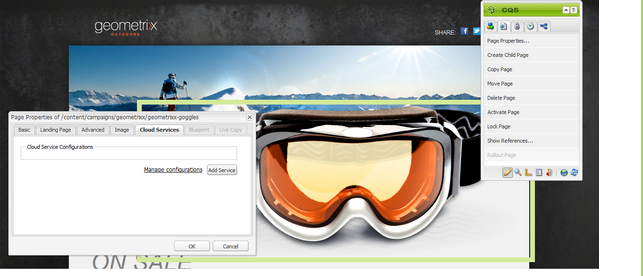

# Gerenciamento de assinaturas{#managing-subscriptions}

>[!NOTE]
>
>O Adobe não planeja aprimorar mais esse recurso (Gerenciamento de leads e listas).
>A recomendação é aproveitar [Adobe Campaign e sua integração AEM](/help/sites-administering/campaign.md).

Os usuários podem ser solicitados a se inscrever **do Provedor de serviços de email** listas de distribuição com a ajuda do **Formulário** componente usado em uma página AEM da Web. Para preparar uma página do AEM com um formulário de inscrição para assinatura de listas de distribuição do seu serviço de email, você deve aplicar a configuração de serviço correspondente à página do AEM que o possível assinante visitará.

## Aplicação da configuração do serviço de email a uma página {#applying-email-service-configuration-to-a-page}

Para configurar uma página do AEM:

1. Navegue até a guia **Sites**.
1. Selecione a página que precisa ser configurada para o serviço. Clique com o botão direito do mouse na página e selecione **Propriedades**.

1. Selecionar **Cloud Services** then **Adicionar Serviço**. Selecione uma configuração na lista de configurações disponíveis.

   

1. Clique em **OK**.

## Criação de um formulário de inscrição em uma página do AEM para assinar/cancelar a assinatura de listas {#creating-a-sign-up-form-on-an-aem-page-for-subscribing-unsubscribing-to-lists}

Para criar um formulário de inscrição e configurá-lo para assinaturas de listas de distribuição do Provedor de serviços de email:

1. Abra a página do AEM que o usuário visitará.
1. Aplique a configuração do Provedor de serviços de email à página.

1. Adicione um componente **Formulário** à página arrastando esse componente do sidekick. Se o componente não estiver disponível, alterne para o modo de design e ative o grupo **Formulário**.
1. Clique em **Editar** no **Início do formulário** e navegue até a **Avançado** guia .
1. No **Formulário** , selecione **Serviço de e-mail: Criar Assinante** e adicionar à lista.
1. Na parte inferior da caixa de diálogo, abra o **Configuração de ação** , que permite selecionar uma ou mais listas de assinaturas.
1. Na lista **Selecionar,** selecione a lista na qual você deseja que os usuários se inscrevam. Você pode adicionar várias listas usando o botão de adição (**Adicionar item**).

   

   >[!NOTE]
   >
   >Sua caixa de diálogo pode ser diferente, dependendo do provedor de serviços de email.

1. Na guia **Formulário**, selecione a página de agradecimento que você deseja que os usuários acessem depois de enviarem o formulário (se ficar em branco, o formulário será exibido novamente após o envio). Clique em **OK**. Um componente de **ID de email** aparece no Formulário, permitindo criar um formulário em que os usuários podem enviar seus endereços de email para assinar ou cancelar a assinatura de uma lista de emails.
1. Adicione o componente de botão **Enviar** da seção **Formulário** no sidekick.

   O formulário está pronto. Publique a página configurada nas etapas acima junto com a página de **agradecimento** na instância de publicação. Qualquer assinante em potencial que visitar a página poderá preencher o formulário e assinar a lista fornecida na configuração.

   >[!NOTE]
   >
   >Para que a assinatura do formulário funcione corretamente, [as chaves de criptografia do autor precisam ser exportadas e importadas na instância de publicação](#exporting-keys-from-author-and-importing-on-publish).

## Exportação de chaves do autor e importação na publicação {#exporting-keys-from-author-and-importing-on-publish}

Para que o processo de assinatura ou cancelamento de assinatura do serviço de email funcione com o uso do formulário de inscrição na instância de publicação, é necessário seguir estas etapas:

1. Na instância de autor, navegue até o Gerenciador de pacotes.
1. Crie um novo pacote. Defina o filtro como `/etc/key`.
1. Construa e faça o download do pacote.
1. Navegue até o Gerenciador de pacotes na instância de publicação e faça upload desse pacote.
1. Navegue até o console do osgi de Publicação e reinicie o pacote chamado **Adobe Granite Crypto Support**.

## Cancelamento da assinatura de usuários em listas {#unsubscribing-users-from-lists}

Para cancelar a assinatura de usuários em listas:

1. Abra as propriedades da página do AEM que tem o formulário de inscrição para cancelar a assinatura de um lead.
1. Aplique a configuração de serviço à página.
1. Crie um formulário de inscrição na página.
1. Ao configurar o componente, selecione a ação **Serviço de email**: **Cancelar inscrição do usuário da lista.**
1. No menu suspenso, selecione a lista apropriada da qual o usuário será removido ao cancelar a assinatura.

   

1. Exportar as chaves do autor para publicar.

## Configurando emails de resposta automática para o serviço de email {#configuring-auto-responder-emails-for-email-service}

Para configurar um email de resposta automática para um assinante:

1. Abra as propriedades da página de AEM que têm o formulário de inscrição para configurar a resposta automática para um lead.
1. Aplique a configuração do ExactTarget à página.

1. Adicione um componente **Formulário** à página arrastando esse componente do sidekick. Se o componente não estiver disponível, alterne para o modo de design e ative o grupo **Formulário**.
1. Clique em **Editar** no **Início do formulário** e navegue até a **Avançado** guia .
1. No **Formulário** , selecione **Serviço de e-mail: Envie um email de resposta automática.**
1. **Selecionar um email** (esse é o email enviado como um email de resposta automática).

1. **Selecionar classificação** (essa classificação é usada para enviar o email).
1. Selecione o **Obrigado** página (a página para a qual os usuários são direcionados depois de enviarem o formulário).

   No **Formulário** selecione a página de agradecimento que deseja que os usuários acessem depois de enviarem o formulário. (Caso deixado em branco, o formulário será exibido novamente após o envio.) Clique em **OK**.

1. Exportar as chaves do autor para publicar.
1. Adicione o componente de botão **Enviar** da seção **Formulário** no sidekick.

   O formulário de inscrição está pronto. Publique a página configurada nas etapas acima junto com a página de **agradecimento** na instância de publicação. Qualquer assinante em potencial que visitar a página poderá preencher o formulário e, ao enviá-lo, o visitante receberá um email de resposta automática na ID de email preenchida nesse formulário.

   >[!NOTE]
   >
   >Para que a assinatura do formulário de inscrição funcione corretamente, [as chaves de criptografia do autor precisam ser exportadas e importadas na instância de publicação](#exporting-keys-from-author-and-importing-on-publish).

   
