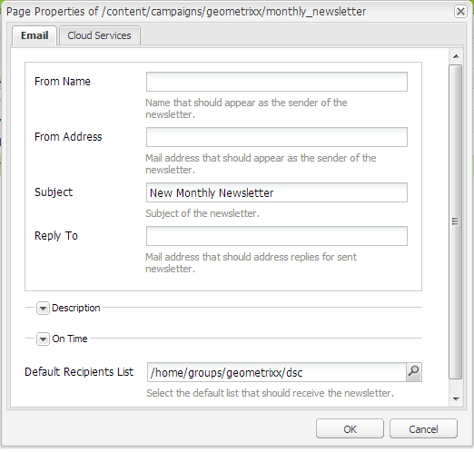

# Email Marketing{#e-mail-marketing}

>[!NOTE]
>
>A Adobe não planeja aprimorar o acompanhamento de email de aberto/retornados (que não podem ser entregues) pelo serviço SMTP do AEM.
>A recomendação é [aproveitar o Adobe Campaign e a integração com o AEM](/help/sites-administering/campaign.md).

O email marketing (por exemplo, informativos) é uma parte importante de qualquer campanha de marketing, pois é usado para enviar conteúdo aos seus leads. No AEM, é possível criar boletins informativos de conteúdo existente do AEM, bem como adicionar novo conteúdo, específico para boletins informativos.

Depois de criados, você pode enviar informativos ao grupo de usuários específico imediatamente ou em outro horário agendado (com o uso de um fluxo de trabalho). Além disso, os usuários podem assinar informativos no formato que escolherem.

Além disso, o AEM permite administrar a funcionalidade de boletim informativo, incluindo a manutenção de tópicos, o arquivamento de boletins informativos e a exibição de estatísticas do boletim informativo.

>[!NOTE]
>
>No Geometrixx, o modelo de informativo abre automaticamente o editor de email. Você pode usar o editor de email em outros modelos com os quais deseja enviar emails, por exemplo, em convites. O editor de email é exibido sempre que uma página é herdada de **mcm/components/newsletter/page**.

Este documento descreve os fundamentos da criação de informativos no AEM. Para obter informações mais detalhadas sobre como trabalhar com email marketing, consulte os seguintes documentos:

* [Criação de uma página de aterrissagem de informativo eficaz](/help/sites-classic-ui-authoring/classic-personalization-campaigns-email-landingpage.md)
* [Gerenciamento de assinaturas](/help/sites-classic-ui-authoring/classic-personalization-campaigns-email-subscriptions.md)
* [Publicar um email em provedores de serviços de email](/help/sites-classic-ui-authoring/classic-personalization-campaigns-email-newsletters.md)
* [Rastreamento de emails retornados](/help/sites-classic-ui-authoring/classic-personalization-campaigns-email-tracking-bounces.md)

>[!NOTE]
>
>Se você atualizar provedores de email, fazer um teste de envio ou enviar um informativo, essas operações falharão se o informativo não for publicado primeiro na Instância de publicação ou se a Instância de publicação não estiver disponível. Publique o informativo e verifique se a Instância de publicação está ativa e em execução.

## Criação de uma experiência de informativo {#creating-a-newsletter-experience}

>[!NOTE]
>
>Notificações por email precisam ser definidas por meio da configuração osgi. Consulte [Configurar notificações por email.](/help/sites-administering/notification.md) 

1. Selecione a sua nova campanha no painel esquerdo ou clique duas vezes no painel direito.

1. Selecione a exibição de lista, usando o ícone:

   

1. Clique em **Novo...**

   É possível especificar o **Título**, o **Nome** e o tipo de experiência a ser criada; neste caso, boletim informativo.

   

1. Clique em **Criar**.

1. Uma nova caixa de diálogo será aberta imediatamente. Aqui você pode inserir as propriedades do boletim informativo.

   A **Lista de destinatários padrão** é um campo obrigatório, pois esta forma o ponto de contato do boletim informativo (consulte [Trabalhar com listas](/help/sites-classic-ui-authoring/classic-personalization-campaigns.md#workingwithlists) para obter mais informações sobre as listas).

   

   * **Nome do remetente** O nome que deve aparecer como o remetente do informativo.

   * **Endereço do remetente** Os endereços de email que devem ser exibidos como remetentes do informativo.

   * **Assunto** Assunto do informativo.

   * **Responder para** O endereço de email que deve tratar das respostas para o informativo enviado.

   * **Descrição** Descrição do boletim informativo.

   * **No horário** O momento para enviar o boletim informativo.

   * **Lista de destinatários padrão** A lista padrão que deve receber o boletim informativo.
   As propriedades podem ser atualizadas posteriormente na caixa de diálogo **Propriedades**.

1. Clique em **OK** para salvar.

## Adição de conteúdo a informativos {#adding-content-to-newsletters}

Você pode adicionar conteúdo, incluindo conteúdo dinâmico, ao seu informativo como faria em qualquer componente do AEM. No Geometrixx, o modelo de boletim informativo tem alguns componentes disponíveis para adicionar e modificar o conteúdo nos boletins informativos.

1. No MCM, clique na guia **Campanhas** e clique duas vezes no boletim informativo ao qual deseja adicionar conteúdo ou editar. O boletim informativo é aberto.

1. Se os componentes não estiverem visíveis, vá para a exibição Design e ative os componentes necessários (por exemplo, os componentes do Informativo) antes de iniciar a edição.
1. Insira qualquer novo texto, imagens ou outros componentes, conforme apropriado. No exemplo do Geometrixx, 4 componentes estão disponíveis: Texto, Imagem, Título e 2 colunas. Seu informativo pode ter mais ou menos componentes, dependendo de como você o configurou.

   >[!NOTE]
   >
   >Você personaliza informativos usando variáveis. No informativo do Geometrixx, as variáveis estão disponíveis no componente Texto. Os valores das variáveis são herdados das informações no perfil do usuário.

   

1. Para inserir variáveis, selecione a variável na lista e clique em **Inserir**. As variáveis são preenchidas a partir do Perfil.

## Personalização de informativos {#personalizing-newsletters}

Você personaliza os informativos inserindo variáveis predefinidas no componente Texto dos informativos no Geometrixx. Os valores das variáveis são herdados das informações no perfil do usuário.

Além disso, é possível simular como um boletim informativo é personalizado ao usar o contexto do cliente e carregar um perfil.

Para personalizar um boletim informativo e simular como será sua aparência:

1. No MCM, abra o boletim informativo que deseja personalizar as configurações. 

1. Abra o componente texto que deseja personalizar. 

1. Posicione o cursor onde deseja exibir a variável e selecione uma variável na lista suspensa, e em seguida clique em **Inserir**. Faça isso para quantas variáveis forem necessárias e clique em **OK**.

   

1. Para simular como a variável será mostrada quando enviada, pressione CTRL+ALT+c para abrir o contexto do cliente e selecione **Carregar**. Selecione o usuário na lista cujo perfil deseja carregar e clique em **OK**.

   As informações do perfil carregado preencheram as variáveis.

   

## Teste de informativos em diferentes clientes de email {#testing-newsletters-in-different-e-mail-clients}

>[!NOTE]
>
>Antes de enviar boletins informativos, verifique a configuração OSGi do Day CQ Link Externalizer em `https://localhost:4502/system/console/configMgr`.
>
>Por padrão, o valor do parâmetro é `localhost:4502` e a operação não pode ser concluída se a porta para a execução da instância for alterada.

Alternar entre clientes de email comuns para ver a forma como o informativo será exibido para seus leads. Por padrão, seu informativo é aberto com nenhum dos clientes de email selecionados.

Atualmente, você pode visualizar informativos nos seguintes clientes de email:

* Yahoo mail
* Gmail
* Hotmail
* Thunderbird
* Microsoft Outlook 2007
* Apple Mail

Para alternar entre clientes, clique no ícone correspondente para visualizar o informativo nesse cliente de email:

1. No MCM, abra o boletim informativo que deseja personalizar as configurações. 

1. Clique em um cliente de email na barra superior para ver como o boletim informativo aparecerá nesse cliente.

   

1. Repita essa etapa para todos os cliente de email adicionais que deseja visualizar.

   

## Personalização das configurações do informativo {#customizing-newsletter-settings}

Embora somente usuários autorizados possam enviar um informativo, você deve personalizar o seguinte:

* A linha de assunto, para que os usuários queiram abrir seu email e também para garantir que seu informativo não acabe marcado como spam.
* Os endereços de remetente, por exemplo noreply@geometrixx.com, para que os usuários recebam o email de um endereço especificado.

Para personalizar as configurações do boletim informativo:

1. No MCM, abra o boletim informativo que deseja personalizar as configurações. 

   

1. Na parte superior do boletim informativo, clique em **Configurações**.

   
1. Insira o endereço de email de **Remetente**

1. Modifique o **Assunto** do email, se necessário.

1. Selecione uma **Lista de destinatários padrão** a partir da lista suspensa.

1. Clique em **OK**.

   Ao testar ou enviar o boletim informativo, os destinatários receberão emails com o endereço de email e assunto especificados.

## Teste de envio de informativos {#flight-testing-newsletters}

Embora testes de envio não sejam obrigatórios, antes de enviar um informativo, convém testá-lo para garantir que ele apareça da maneira desejada.

Testes de envio permitem:

* Verificar o boletim informativo em [todos os clientes pretendidos](#testing-newsletters-in-different-e-mail-clients).
* Validar se o servidor de email está configurado corretamente.
* Determinar se o seu email está sendo sinalizado como spam. (Faça parte da lista de destinatários.)

>[!NOTE]
>
>Se você atualizar provedores de email, fazer um teste de envio ou enviar um informativo, essas operações falharão se o informativo não for publicado primeiro na Instância de publicação ou se a Instância de publicação não estiver disponível. Publique o informativo e verifique se a Instância de publicação está ativa e em execução.

Para testar o envio de informativos:

1. No MCM, abra o boletim informativo que deseja testar e enviar. 

1. Na parte superior do boletim informativo, clique em **Testar** para testar antes de enviar.

   

1. Digite o endereço de email de teste para onde deseja que o boletim informativo seja enviado e clique em **Enviar**. Se quiser alterar o perfil, carregue outro perfil no contexto do cliente. Execute essa ação ao pressionar CTRL+ALT+c, selecionar Carregar e carregar um perfil. 

## Envio de informativos {#sending-newsletters}

>[!NOTE]
>
>A Adobe não planeja aprimorar o acompanhamento de email de aberto/retornados (que não podem ser entregues) pelo serviço SMTP do AEM.
>A recomendação é [aproveitar o Adobe Campaign e a integração com o AEM](/help/sites-administering/campaign.md).

Você pode enviar um informativo a partir dele mesmo ou da lista. Ambos os procedimentos estão descritos a seguir.

>[!NOTE]
>
>Antes de enviar boletins informativos, verifique a configuração OSGi do Day CQ Link Externalizer em `https://localhost:4502/system/console/configMgr`.
>
>Por padrão, o valor do parâmetro é `localhost:4502` e a operação não pode ser concluída se a porta para a execução da instância for alterada.

>[!NOTE]
>
>Se você atualizar provedores de email, fazer um teste de envio ou enviar um informativo, essas operações falharão se o informativo não for publicado primeiro na Instância de publicação ou se a Instância de publicação não estiver disponível. Publique o informativo e verifique se a Instância de publicação está ativa e em execução.

### Envio de informativos a partir de uma campanha {#sending-newsletters-from-a-campaign}

Para enviar um informativo a partir da campanha:

1. No MCM, abra o boletim informativo que deseja enviar.

   >[!NOTE]
   >
   >Antes de enviar, [personalize as configurações](#customizing-newsletter-settings) para incluir o endereço de email remetente e um assunto personalizado para o boletim informativo.
   >
   >
   >[Fazer um teste de pré-lançamento](#flight-testing-newsletters) no boletim informativo antes de enviar é recomendado.

1. Na parte superior do boletim informativo, clique em **Enviar**. O assistente do boletim informativo é aberto.

1. Na lista de destinatários, selecione a lista que deseja que receba o boletim informativo e clique em **Avançar**.

   

1. A conclusão da configuração é confirmada. Clique em **Enviar** para enviar o boletim informativo.

   

   >[!NOTE]
   >
   >Certifique-se de que você seja um dos destinatários para garantir que o boletim informativo seja recebido.

### Envio de informativos de uma lista {#sending-newsletters-from-a-list}

Para enviar um informativo de uma lista:

1. No MCM, clique em **Listas** no painel à esquerda.

   >[!NOTE]
   >
   >Antes de enviar, [personalize as configurações](#customizing-newsletter-settings) para incluir o endereço de email remetente e um assunto personalizado para o boletim informativo. Não é possível testar um boletim informativo se você o enviar da lista; você pode [fazer um teste de pré-lançamento](#flight-testing-newsletters) caso envie-o do boletim informativo.

1. Selecione a caixa de seleção próxima à lista de clientes potenciais aos quais deseja enviar um boletim informativo.

1. No menu **Ferramentas**, selecione **Enviar boletim informativo**. A janela **Enviar boletim informativo** é aberta.

   

1. No campo **Boletim informativo**, selecione o boletim informativo que deseja enviar e clique em **Avançar**.

   

1. A conclusão da configuração é confirmada. Clique em **Enviar** para enviar o boletim informativo selecionado à lista especificada de clientes potenciais.

   

   Seu boletim informativo é enviado para os destinatários selecionados.

## Assinatura de um informativo {#subscribing-to-a-newsletter}

Esta seção descreve como assinar um informativo.

### Assinatura de um informativo {#subscribing-to-a-newsletter-1}

Para assinar um boletim informativo (usando o site Geometrixx como um exemplo):

1. Clique em **Sites**, navegue até a **Barra de ferramentas** do Geometrixx e abra-a.

   

1. No campo **Cadastrar-se** do boletim informativo do Geometrixx, digite o endereço de email e clique em **Cadastrar-se**. Você foi cadastrado no boletim informativo.
