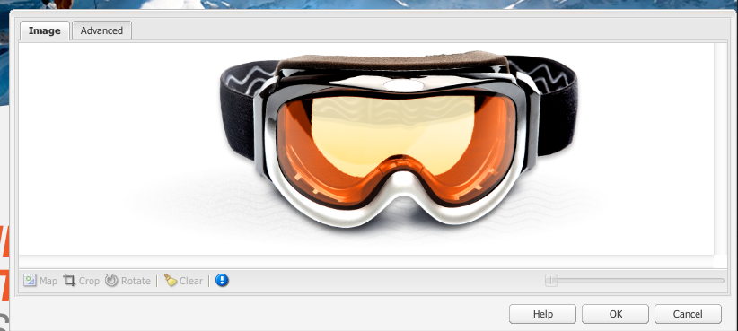

# Página de destino{#landing-pages}

O recurso de páginas de aterrissagem permite a importação rápida e fácil de um design e conteúdo diretamente em uma página AEM. Um desenvolvedor da Web pode preparar o HTML e os ativos adicionais que podem ser importados como uma página inteira ou apenas como parte de uma página. A funcionalidade é útil para criar páginas de aterrissagem de marketing que só estão ativas por um tempo limitado e precisam ser criadas rapidamente.

Esta página descreve o seguinte:

* como as páginas de aterrissagem se parecem no AEM, incluindo os componentes disponíveis
* como criar uma página de aterrissagem e importar um pacote de design
* como trabalhar com landing pages no AEM
* como configurar páginas de aterrissagem móveis

A preparação do pacote de design para importação é abordada em [Extensão e configuração do importador de design](/help/sites-administering/extending-the-design-importer-for-landingpages.md). A integração com o Adobe Analytics é contemplada na [Integração de landing pages ao Adobe Analytics.](/help/sites-administering/integrating-landing-pages-with-adobe-analytics.md)

>[!CAUTION]
>
>O Importador de design, usado para importar páginas de aterrissagem, [foi descontinuado com o AEM 6.5](/help/release-notes/deprecated-removed-features.md#deprecated-features).

>[!CAUTION]
>
>Como o Importador de design requer acesso a `/apps`, ele não funcionará em ambientes de nuvem em containers nos quais `/apps` é imutável.

## O que são landing pages? {#what-are-landing-pages}

As landing pages são sites de uma ou várias páginas que são o &quot;endpoint&quot; de um alcance de marketing - por exemplo, com email, adwords/banners, redes sociais. Uma landing page pode atender a vários propósitos, mas todos têm uma coisa em comum: o visitante deve cumprir uma tarefa e definir o sucesso de uma landing page.

O recurso Landing Pages (Páginas de destino) no AEM permite que os profissionais de marketing trabalhem com designers da Web em agências ou equipes internas de criação para criar designs de página que podem ser facilmente importados para o AEM e ainda ser editáveis pelos profissionais de marketing e publicados sob o mesmo controle que o restante dos sites alimentados pelo AEM.

No AEM, você cria páginas de aterrissagem executando as seguintes etapas:

1. Crie uma página no AEM que contenha a tela landing pages. O AEM é enviado com uma amostra chamada **Página do importador**.

1. [Prepare o HTML e os ativos.](/help/sites-administering/extending-the-design-importer-for-landingpages.md)
1. Coloque os recursos em um arquivo ZIP chamado de Pacote de design.
1. Importe o pacote de design na página do importador.
1. Modifique e publique a página.

### Páginas iniciais da área de trabalho {#desktop-landing-pages}

Uma amostra de página de aterrissagem no AEM é exibida da seguinte maneira:

### Páginas de aterrissagem móveis {#mobile-landing-pages}

Uma landing page também pode ter uma versão móvel da página. Para ter uma versão móvel separada da landing page, o design de importação deve ter dois arquivos html: *index.htm(l)* e *mobile.index.htm(l)*.

O procedimento de importação da landing page é o mesmo de uma landing page normal. O design da landing page tem um arquivo html adicional correspondente à landing page móvel. Esse arquivo html também deve ter uma tela `div` com `id=cqcanvas` exatamente como o html da página de aterrissagem da área de trabalho, ele é compatível com todos os componentes editáveis descritos para a página de aterrissagem da área de trabalho.

A página de aterrissagem móvel é criada como uma página secundária da página de aterrissagem de desktop. Para abri-lo, navegue até a página de aterrissagem em Sites e abra a página secundária.

>[!NOTE]
>
>A página de aterrissagem móvel é excluída/desativada junto com a página de aterrissagem da área de trabalho se ela for excluída ou desativada.

## Componentes da landing page {#landing-page-components}

Para fazer partes do HTML que é importado como editável no AEM, é possível mapear o conteúdo diretamente no HTML das Landing pages para os componentes do AEM. O importador de design entende os seguintes componentes por padrão:

* Texto, para qualquer texto
* Título, para conteúdo em tags H1-6
* Imagem, para imagens que devem ser trocadas
* Chamada para ação:

   * Link Clickthrough
   * Vincular ao gráfico

* Formulário de cliente em potencial CTA, para capturar informações do usuário
* Sistema de parágrafo (Parsys), para permitir que qualquer componente seja adicionado, ou o componente acima convertido

Além disso, é possível estender isso e oferecer suporte a componentes personalizados. Esta seção descreve os componentes em detalhes.

### Texto {#text}

O componente de Texto permite inserir um bloco de texto usando um editor WYSIWYG. Consulte [Componente de texto](/help/sites-authoring/default-components.md#text) para obter mais informações.

Veja a seguir um exemplo de um componente de texto em uma landing page:

#### Título {#title}

O componente de título permite exibir um título e configurar o tamanho (h1-6). Consulte [Componente do título](/help/sites-authoring/default-components.md#title) para obter mais informações.

Veja a seguir um exemplo de um componente de título em uma página de aterrissagem:

#### Imagem {#image}

O componente de imagem exibe uma imagem que você pode arrastar e soltar do Localizador de conteúdo ou clicar em para fazer upload. Consulte [componente de imagem](/help/sites-authoring/default-components.md) para obter mais informações.

Veja a seguir um exemplo de um componente de imagem em uma landing page:

#### Chamada para ação (CTA) {#call-to-action-cta}

Um design de página de aterrissagem pode ter vários links. Alguns deles podem ser destinados a &quot;Chamadas para ação&quot;.

O Plano de ação (CTA) é usado para fazer com que o visitante execute uma ação imediata na página de aterrissagem, como &quot;Assinar agora&quot;, &quot;Exibir este vídeo&quot;, &quot;Somente tempo limitado&quot; e assim por diante.

* Clicar através do link - Permite adicionar um link de texto que, quando clicado, leva o visitante a um URL de destino.
* Link gráfico - Permite adicionar uma imagem que, quando clicada, leva o visitante a um URL de destino.

Ambos os componentes do CTA têm opções semelhantes. O Link Click Through tem opções adicionais de rich text. Os componentes são descritos em detalhes nos parágrafos a seguir.

#### Link de Click Through {#click-through-link}

Esse componente CTA pode ser usado para adicionar um link de texto na landing page. Esse link pode ser clicado para levar o usuário ao URL de destino especificado nas propriedades do componente. Ele faz parte do grupo &quot;Plano de ação&quot;.

**Rótulo** O texto que os usuários veem. É possível modificar a formatação com o editor de rich text.

**URL de direcionamento** Insira o URI que você deseja que os usuários visitem se clicarem no texto.

**Opções de renderização** Descreve as opções de renderização. Você pode selecionar entre as seguintes opções:

* Carregar página em uma nova janela de navegador
* Carregar página na janela atual
* Carregar página no quadro pai
* Cancelar todos os quadros e carregar a página na janela completa do navegador

**CSS** Na guia Estilo, digite um caminho para a folha de estilos CSS.

**ID** Na guia Estilo, insira uma ID para o componente para identificá-lo exclusivamente.

Veja a seguir um exemplo de um link click-through:

#### Vincular ao gráfico {#graphical-link}

Esse componente CTA pode ser usado para adicionar qualquer imagem gráfica com link na página de destino. A imagem pode ser um botão simples ou qualquer imagem gráfica como plano de fundo. Quando a imagem é clicada, o usuário é levado para o URL de destino especificado nas propriedades do componente. Faz parte do **Chamada para ação** grupo.

**Rótulo** O texto que os usuários veem no gráfico. É possível modificar a formatação com o editor de rich text.

**URL de direcionamento** Insira o URI que você deseja que os usuários visitem se clicarem na imagem.

**Opções de renderização** Descreve as opções de renderização. Você pode selecionar entre as seguintes opções:

* Carregar página em uma nova janela de navegador
* Carregar página na janela atual
* Carregar página no quadro pai
* Cancelar todos os quadros e carregar a página na janela completa do navegador

**CSS** Na guia Estilo, digite um caminho para a folha de estilos CSS.

**ID** Na guia Estilo, insira uma ID para o componente para identificá-lo exclusivamente.

Veja a seguir um exemplo de link gráfico:

### Formulário de plano de ação (CTA) {#call-to-action-cta-lead-form}

Um formulário de cliente potencial é um formulário usado para coletar informações de perfil de um visitante/cliente potencial. Essas informações podem ser armazenadas e usadas posteriormente para fazer um marketing eficaz com base nas informações. Essas informações geralmente incluem título, nome, email, data de nascimento, endereço, interesse e assim por diante. Faz parte do **Formulário CTA de cliente em potencial** grupo.

Um exemplo de formulário de lead CTA tem esta aparência:

Os formulários de clientes em potencial do CTA são criados a partir de vários componentes diferentes:

* **Formulário de cliente em potencial**
O componente de formulário de cliente potencial define o início e o fim de um novo formulário de cliente potencial em uma página. Outros componentes podem ser colocados entre esses elementos, como ID de email, Nome e assim por diante.

* **Campos e elementos do formulário**
Os campos e elementos de formulário podem incluir caixas de texto, botões de opção, imagens e assim por diante. O usuário geralmente conclui uma ação em um campo de formulário, como digitar texto. Consulte elementos de formulário individuais para obter mais informações.

* **Componentes do perfil**
Os componentes do perfil estão relacionados aos perfis de visitantes usados para colaboração social e outras áreas em que a personalização do visitante é necessária.

O anterior mostra um exemplo de formulário; ele é composto de **Formulário de cliente em potencial** componente (início e término), com **Nome** e **ID de e-mail** campos usados para entrada e um **Enviar** campo

No sidekick, os seguintes componentes estão disponíveis para o Formulário de lead CTA:

#### Configurações comuns a muitos componentes de formulário de cliente potencial {#settings-common-to-many-lead-form-components}

Embora cada um dos componentes do formulário de cliente potencial tenha uma finalidade diferente, muitos são compostos de opções e parâmetros semelhantes.

Ao configurar qualquer um dos componentes do formulário, as seguintes guias estão disponíveis na caixa de diálogo:

* **Título e texto**
Aqui, é necessário especificar as informações básicas, como o título do componente e qualquer texto que o acompanhe. Quando apropriado, também permite definir outras informações importantes, como se o campo é multisselecionável e se os itens estão disponíveis para seleção.

* **Valores iniciais**
Permite especificar um valor padrão.

* **Restrições**
Aqui você pode especificar se um campo é obrigatório e colocar restrições nesse campo (por exemplo, deve ser numérico e assim por diante).

* **Estilo**
Indica o tamanho e o estilo dos campos.

>[!NOTE]
>
>Os campos exibidos variam dependendo do componente individual.
>
>Nem todas as opções estão disponíveis para todos os componentes de formulário de cliente potencial. Consulte Forms para obter mais informações sobre esses [configurações comuns](/help/sites-authoring/default-components.md#formsgroup).

#### Componentes de formulário de cliente potencial {#lead-form-components}

A seção a seguir descreve os componentes disponíveis para formulários de cliente em potencial de Chamada para Ação.

**Sobre** Permite que os usuários adicionem informações Sobre.

**Campo de endereço** Permite que os usuários insiram informações de endereço. Ao configurar esse componente, você deve inserir o Nome do elemento na caixa de diálogo. O Nome do elemento é o nome do elemento de formulário. Isso indica onde os dados são armazenados no repositório.

**Data de nascimento** Os usuários podem inserir informações de data de nascimento.

**ID de e-mail** Permite que os usuários insiram um endereço de email (identificação).

**Nome** Fornece um campo para que os usuários digitem seu nome.

**Sexo** Os usuários podem selecionar seu gênero em uma lista suspensa.

**Sobrenome** Os usuários podem inserir informações de sobrenome.

**Formulário de cliente em potencial** Adicione este componente para adicionar um formulário de cliente em potencial à página de aterrissagem. Um formulário de cliente potencial contém automaticamente o Início do Formulário de Cliente Potencial e o Fim do Formulário de Cliente Potencial. Entre eles, adicione os componentes de Formulário de cliente potencial descritos nesta seção.

O componente de Formulário de cliente potencial define o início e o fim de um formulário usando o **Início do formulário** e **Fim do formulário** elementos. Eles são sempre emparelhados para garantir que o formulário seja definido corretamente.

Depois de adicionar o formulário de cliente em potencial, você pode configurar o início ou o fim do formulário clicando em **Editar** na barra correspondente.

**Início do formulário de cliente em potencial**

Duas guias estão disponíveis para configuração **Formulário** e **Avançado**:

**Página de agradecimento** A página a ser referenciada para agradecer aos visitantes por fornecer sua entrada. Se deixado em branco, o formulário será exibido novamente após o envio.

**Iniciar fluxo de trabalho** Determina qual fluxo de trabalho será acionado depois que um formulário de cliente potencial for enviado.

**Opções de publicação** As seguintes opções de publicação estão disponíveis:

* Criar cliente em potencial
* Serviço de email: Criar assinante e adicionar à lista - Use se estiver usando um provedor de serviço de email como o ExactTarget.
* Serviço de e-mail: enviar e-mail de resposta automática - Use se estiver usando um provedor de serviços de e-mail como ExactTarget.
* Serviço de email: cancelar a inscrição do usuário na lista - Use se estiver usando um provedor de serviços de email como o ExactTarget.
* Cancelar inscrição do usuário

**Identificador de formulário** O identificador do formulário identifica exclusivamente o formulário de cliente potencial. Use o identificador de formulário se você tiver vários formulários em uma única página; verifique se eles têm identificadores diferentes.

**Carregar caminho** É o caminho para as propriedades do nó usado para carregar valores predefinidos nos campos de formulário de cliente potencial.

Este é um campo opcional que especifica o caminho para um nó no repositório. Quando esse nó tem propriedades que correspondem aos nomes dos campos, os campos apropriados no formulário são pré-carregados com o valor dessas propriedades. Se não houver correspondência, o campo conterá o valor padrão.

**Validação de cliente** Indica se a validação do cliente é necessária para este formulário (a validação do servidor sempre ocorre). Isso pode ser feito em conjunto com o componente Captcha do Forms.

**Tipo de recurso de validação** Define o tipo de recurso de validação de formulário se desejar validar todo o formulário de cliente potencial (em vez de campos individuais).

Se você estiver validando o formulário completo, inclua também um dos seguintes:

* Um script para validação de cliente:
  ` /apps/<myApp>/form/<myValidation>/formclientvalidation.jsp`

* Um script para validação no lado do servidor:
  ` /apps/<myApp>/form/<myValidation>/formservervalidation.jsp`

**Configuração de ação** Dependendo da seleção nas Opções de publicação, a Configuração da ação é alterada. Por exemplo, ao selecionar Criar cliente em potencial, você pode configurar a qual lista o cliente em potencial será adicionado.

* **Mostrar botão Enviar**
Indica se um botão Enviar deve ser mostrado ou não.

* **Enviar nome**
Um identificador se estiver usando vários botões de envio em um formulário.

* **Enviar título**
O nome que aparece no botão, como Enviar ou Enviar.

* **Mostrar botão de redefinição**
Marque a caixa de seleção para tornar o botão Redefinir visível.

* **Redefinir título**
O nome que aparece no botão Redefinir.

* **Descrição**
Informações que aparecem abaixo do botão.

## Criação de uma landing page {#creating-a-landing-page}

Ao criar uma landing page, você precisa executar três etapas:

1. Criar uma página do importador.
1. [Prepare o HTML para importação.](/help/sites-administering/extending-the-design-importer-for-landingpages.md)
1. Importe o pacote de design.

### Uso do importador de design {#use-of-the-design-importer}

Como a importação de páginas envolve a preparação de HTML, a verificação e o teste das páginas, a importação de páginas de aterrissagem deve ser considerada uma tarefa de administrador. Como administrador, os usuários que executam a importação precisam de permissões de leitura, gravação, criação e exclusão no `/apps`. Se o usuário não tiver essas permissões, a importação falhará.

>[!NOTE]
>
>Como o importador de design se destina a ser uma ferramenta administrativa que requer permissões de leitura, gravação, criação e exclusão no `/apps`, o Adobe não recomenda usar o importador de design na produção.

A Adobe recomenda usar o importador de design em uma instância de preparo. Em uma instância de preparo, a importação pode ser testada e validada por um desenvolvedor que é responsável pela implantação do código na instância de produção.

### Criação de uma página do importador {#creating-an-importer-page}

Antes de importar o design da Landing page, é necessário criar uma página de importador, por exemplo, em uma campanha. O template Importer Page permite importar a página de aterrissagem de HTML completo. A página contém uma caixa suspensa na qual o pacote de design da landing page pode ser importado usando a função de arrastar e soltar.

>[!NOTE]
>
>Por padrão, uma página de Importador só pode ser criada em campanhas, mas você também pode sobrepor esse template para criar uma landing page em `/content/mysite`.

Para criar uma nova landing page:

1. Vá para a **Sites** console.
1. Selecione a campanha no painel esquerdo.
1. Clique em **Novo** para abrir o **Criar página** janela.
1. Selecione o **Página do importador** modelo e adicione um título e, opcionalmente, um nome, e clique em **Criar**.

   

   A nova página do importador será exibida.

### Preparação do HTML para importação {#preparing-the-html-for-import}

Antes de importar o pacote de design, o HTML precisa ser preparado. Consulte [Extensão e configuração da importação de design](/help/sites-administering/extending-the-design-importer-for-landingpages.md) para obter mais informações.

### Importação do pacote de design {#importing-the-design-package}

Após a criação de uma página de importador, é possível importar um pacote de design para ela. Os detalhes sobre a criação do pacote de design e sua estrutura recomendada são explicados em [Extensão e configuração da importação de design](/help/sites-administering/extending-the-design-importer-for-landingpages.md).

Supondo que o pacote de design esteja pronto, as etapas a seguir descrevem como importar o pacote de design para uma página do importador.

1. Abra a página do importador que você [criado anteriormente](#creatingablankcanvaspage).

   

1. Arraste e solte o pacote de design na caixa suspensa. Observe que a seta muda de direção quando um pacote é arrastado sobre ela.
1. Como resultado de arrastar e soltar, você vê a landing page no lugar da página do importador. A página de aterrissagem do HTML foi importada com sucesso.

   

>[!NOTE]
>
>Após a importação, a marcação é limpa por motivos de segurança e para evitar a importação e a publicação de marcação inválida. Isso pressupõe uma marcação somente HTML e todas as outras formas de elementos, como SVG em linha ou Componentes da Web, serão filtradas.

>[!NOTE]
>
>Se você tiver problemas para importar o pacote de design, consulte [Solução de problemas](/help/sites-administering/extending-the-design-importer-for-landingpages.md#troubleshooting).

## Trabalho com landing pages {#working-with-landing-pages}

O design e os ativos de uma página de aterrissagem geralmente são criados por um designer, possivelmente em uma agência, em ferramentas para as quais estão acostumados, como Adobe Photoshop ou Adobe Dreamweaver. Quando o design é concluído, o designer envia um arquivo zip com todos os ativos para o marketing. O contato em marketing é responsável por soltar o arquivo zip no AEM e publicar o conteúdo.

Além disso, o designer pode precisar fazer modificações na página de aterrissagem depois que ela for importada, editando ou excluindo o conteúdo e configurando os componentes de chamada para ação. Por último, o profissional de marketing desejará visualizar a landing page e, em seguida, ativar a campanha para garantir que ela seja publicada.

Esta seção descreve como fazer o seguinte:

* Excluir uma página de destino
* Baixar o pacote de design
* Exibir informações de importação
* Redefinir uma landing page
* [Configurar os componentes do CTA e adicionar conteúdo à página](#call-to-action-cta)
* Pré-visualização da página de aterrissagem
* Ativar/publicar uma landing page

Ao importar o pacote de design, **Limpar design** e **Baixar o zip importado** estão disponíveis no menu de configurações da página:

### Download do pacote de design importado {#downloading-the-imported-design-package}

Baixar o arquivo zip permite registrar qual zip foi importado com uma página de aterrissagem específica. Observe que as alterações feitas em uma página não são adicionadas ao zip.

Para baixar o pacote de design importado, clique em **Fazer download do zip** na barra de ferramentas da Landing page.

### Exibição de informações de importação {#viewing-import-information}

A qualquer momento, você pode exibir informações sobre a última importação clicando no ponto de exclamação azul na parte superior da página de aterrissagem na interface clássica do usuário.

Caso o pacote de design importado tenha alguns problemas, por exemplo, se ele se referir a imagens/scripts que não existem no pacote e assim por diante, o importador de design exibirá esses problemas no formato de uma lista. Para exibir a lista de problemas, na interface clássica, clique no link issues na barra de ferramentas da landing page. Na imagem a seguir, clique em **Problemas** abre a janela Importar problemas.

### Redefinição de uma landing page {#resetting-a-landing-page}

Caso queira reimportar o pacote de design da landing page depois de fazer algumas alterações, é possível &quot;limpar&quot; a landing page clicando em **Limpar** na parte superior da página de aterrissagem na interface clássica do usuário ou clique em Limpar no menu de configurações na interface do usuário otimizada para toque. Essa ação exclui a landing page importada e cria uma página do importador em branco.

Ao limpar a landing page, você pode remover as alterações de conteúdo. Se você clicar em **Não**, as alterações de conteúdo são preservadas, ou seja, a estrutura sob `jcr:content/importer`é preservado e somente o componente de página do importador e os recursos em `etc/design` são removidos. Enquanto que, se você clicar em **Sim**, o `jcr:content/importer` também é removido.

>[!NOTE]
>
>Se decidir remover as alterações de conteúdo, todas as alterações feitas na página de destino importada, bem como todas as propriedades da página, serão perdidas quando você clicar em **Limpar**.

### Modificação e adição de componentes em uma página de aterrissagem {#modifying-and-adding-components-on-a-landing-page}

Para modificar componentes na página de aterrissagem, clique duas vezes neles para abri-los e editá-los como faria com qualquer outro componente.

Para adicionar componentes na página de aterrissagem, arraste e solte componentes na página de aterrissagem — do sidekick na interface de usuário clássica ou do painel Componentes na interface de usuário otimizada para toque — e edite conforme apropriado.

>[!NOTE]
>
>Se um componente na página de aterrissagem não puder ser editado, será necessário importar novamente o arquivo zip após [modificação do arquivo HTML.](/help/sites-administering/extending-the-design-importer-for-landingpages.md) Isso significa que, durante a importação, as partes não editáveis não foram convertidas em componentes do AEM.

### Exclusão de uma landing page {#deleting-a-landing-page}

Excluir uma landing page é como excluir uma página AEM normal.

A única exceção é que, ao excluir uma landing page da área de trabalho, ela também exclui a landing page móvel correspondente (se presente), mas não vice-versa.

### Publicação de uma landing page {#publishing-a-landing-page}

Você pode publicar a landing page e todas as suas dependências da mesma forma que publica uma página normal.

>[!NOTE]
>
>A publicação da landing page do desktop também publica a versão móvel correspondente (se houver). Mas a publicação de uma landing page móvel não publica a versão do desktop.
