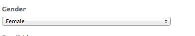

# Páginas de aterrissagem{#landing-pages}

O recurso de páginas de aterrissagem permite a importação rápida e fácil de um design e conteúdo diretamente em uma página do AEM. Um desenvolvedor da web pode preparar o HTML e ativos adicionais que podem ser importados como uma página inteira ou apenas como parte de uma página. Essa funcionalidade é útil para criar páginas de aterrissagem de marketing que ficam ativas apenas por um tempo limitado e precisam ser criadas rapidamente.

Esta página descreve o seguinte:

* o aspecto de páginas de aterrissagem no AEM, incluindo os componentes disponíveis
* como criar uma página de aterrissagem e importar um pacote de design
* como trabalhar com páginas de aterrissagem no AEM
* como configurar páginas de aterrissagem para dispositivos móveis

A preparação do pacote de design para importação é abordada em [Extensão e configuração do Importador de design](/help/sites-administering/extending-the-design-importer-for-landingpages.md). A integração com o Adobe Analytics é abordada em [Integração de páginas de aterrissagem com o Adobe Analytics](/help/sites-administering/integrating-landing-pages-with-adobe-analytics.md).

>[!CAUTION]
>
>O Importador de Design, usado para importar páginas de aterrissagem, [ foi descontinuado com o AEM 6.5](/help/release-notes/deprecated-removed-features.md#deprecated-features).

>[!CAUTION]
>
>Porque o Importador de Design requer acesso a `/apps`, não funcionará em ambientes de nuvem de contêineres em que `/apps` é imutável.

## O que são páginas de aterrissagem? {#what-are-landing-pages}

Páginas de aterrissagem são sites de uma ou várias páginas que são o “ponto final” de uma campanha de marketing, por exemplo, com emails, adwords/banners, redes sociais. Uma página de aterrissagem pode servir a vários propósitos, mas todos têm uma coisa em comum: o visitante deve realizar uma tarefa, e é isso que define o sucesso de uma página de aterrissagem.

O recurso Páginas de aterrissagem no AEM permite que profissionais de marketing trabalhem com designers da web em agências ou equipes de criação internas para criar designs de página que podem ser facilmente importados para o AEM e ainda editados pelos profissionais de marketing e publicados de acordo com as mesmas diretrizes que o restante dos sites desenvolvidos com o AEM.

No AEM, você cria páginas de aterrissagem realizando as seguintes etapas:

1. Crie uma página no AEM que contenha a tela de páginas de aterrissagem. O AEM acompanha uma amostra chamada **Página do importador**.

1. [Prepare o HTML e os ativos.](/help/sites-administering/extending-the-design-importer-for-landingpages.md)
1. Comprima os recursos em um arquivo zip, referido aqui como Pacote de design.
1. Importe o pacote de design na página do importador.
1. Modifique e publique a página.

### Páginas de aterrissagem para desktop {#desktop-landing-pages}

Uma página de aterrissagem de amostra no AEM tem a seguinte aparência:

### Páginas de aterrissagem para dispositivos móveis {#mobile-landing-pages}

Uma página de aterrissagem também pode ter uma versão móvel. Para ter uma versão móvel separada da landing page, o design de importação deve ter dois arquivos html: *index.htm(l)* e *mobile.index.htm(l)*.

O procedimento de importação da página de aterrissagem é o mesmo que o de uma página de aterrissagem normal. O design da página de aterrissagem tem um arquivo html adicional correspondente à página de aterrissagem para dispositivos móveis. Esse arquivo html também deve ter um `div` de tela com `id=cqcanvas`, assim como o html da página de aterrissagem para desktop, e oferece suporte a todos os componentes editáveis descritos para a página de entrada para desktop.

A página de aterrissagem para dispositivos móveis é criada como uma página filho da página de aterrissagem para desktop. Para abri-la, navegue até a página de aterrissagem em Sites e abra a página filho.

>[!NOTE]
>
>A página de aterrissagem para dispositivos móveis será excluída/desativada junto com a página de aterrissagem para desktop se esta última for excluída ou desativada.

## Componentes de páginas de aterrissagem {#landing-page-components}

Para que partes do HTML importado sejam editáveis no AEM, você pode mapear o conteúdo no HTML de páginas de aterrissagem diretamente para componentes do AEM. O importador de design compreende os seguintes componentes por padrão:

* Texto, para qualquer texto
* Título, para conteúdo em tags H1-6
* Imagem, para imagens que devem ser criadas em formatos intercambiáveis
* Frases de chamariz:

   * Link de clickthrough
   * Link gráfico

* Formulário de lead para CTA, para capturar informações de usuários
* Sistema de parágrafos (Parsys), para permitir que qualquer componente seja adicionado ou que o componente acima seja convertido

Além disso, é possível estender esse sistema e oferecer suporte a componentes personalizados. Esta seção descreve os componentes detalhadamente.

### Texto {#text}

O componente deTexto permite que você insira um bloco de texto usando um editor WYSIWYG. Consulte [componente de texto](/help/sites-authoring/default-components.md#text) para obter mais informações.

Veja a seguir um exemplo de um componente de texto em uma página de aterrissagem:

#### Título {#title}

O componente de título permite exibir um título e configurar o tamanho (h1-6). Consulte [componente de título](/help/sites-authoring/default-components.md#title) para obter mais informações.

Veja a seguir um exemplo de um componente de título em uma página de aterrissagem:

#### Imagem {#image}

O componente de imagem exibe uma imagem que você pode arrastar e soltar no Localizador de conteúdo ou clicar para fazer upload. Consulte [componente de imagem](/help/sites-authoring/default-components.md) para obter mais informações.

Veja a seguir um exemplo de um componente de imagem em uma página de aterrissagem:

#### Frases de chamariz (CTA) {#call-to-action-cta}

O design de uma página de aterrissagem pode ter vários links; alguns deles podem ser usados como “Frases de chamariz”.

A Frase de chamariz (CTA) é usada para fazer com que o visitante tome medidas imediatas na página de aterrissagem, como “Inscreva-se agora”, “Assista a este vídeo”, “Somente por tempo limitado” e assim por diante.

* Link de clickthrough - permite adicionar um link de texto que, quando clicado, direciona o visitante a um URL.
* Link gráfico - permite adicionar uma imagem que, quando clicada, leva o visitante para um URL de destino.

Ambos os componentes de CTA têm opções semelhantes. O Link de clickthrough tem opções adicionais de Rich Text. Os componentes estão descritos em detalhes nos parágrafos a seguir.

#### Link de clickthrough {#click-through-link}

Este componente de CTA pode ser usado para adicionar um link de texto na página de aterrissagem. Esse link pode ser clicado para direcionar o usuário ao URL especificado nas propriedades do componente. Ele faz parte do grupo “Frases de chamariz”.

**Rótulo** O texto que os usuários veem. É possível modificar a formatação com o editor de rich text.

**URL de destino** Insira o URI que você deseja que os usuários visitem se clicarem no texto.

**Opções de renderização** Descreve as opções de renderização. Você pode selecionar:

* Carregar página em uma nova janela de navegador
* Carregar página na janela atual
* Carregar página no quadro pai
* Cancelar todos os quadros e carregar a página na janela inteira do navegador

**CSS** Na guia Estilo , insira um caminho para sua folha de estilos CSS.

**ID** Na guia Estilo , insira uma ID para que o componente identifique-o exclusivamente.

Veja a seguir um exemplo de um link de clickthrough:

#### Link gráfico {#graphical-link}

Esse componente de CTA pode ser usado para adicionar qualquer imagem gráfica com um link à página de aterrissagem. A imagem pode ser um simples botão ou qualquer imagem gráfica como fundo. Quando a imagem é clicada, o usuário é levado para o URL de direcionamento especificado nas propriedades do componente. Faz parte do grupo **Frases de chamariz**.

**Rótulo** O texto que os usuários veem no gráfico. É possível modificar a formatação com o editor de rich text.

**URL de destino** Insira o URI que você deseja que os usuários visitem se clicarem na imagem.

**Opções de renderização** Descreve as opções de renderização. Você pode selecionar:

* Carregar página em uma nova janela de navegador
* Carregar página na janela atual
* Carregar página no quadro pai
* Cancelar todos os quadros e carregar a página na janela inteira do navegador

**CSS** Na guia Estilo , insira um caminho para sua folha de estilos CSS.

**ID** Na guia Estilo , insira uma ID para que o componente identifique-o exclusivamente.

Veja a seguir um exemplo de link gráfico:

### Formulário de lead para Frases de chamariz (CTA) {#call-to-action-cta-lead-form}

Um formulário de lead é um formulário usado para coletar informações de perfil de um visitante/lead. Essas informações podem ser armazenadas e usadas posteriormente como base para realizar um marketing eficiente. Em geral, elas incluem o título, o nome, o email, a data de nascimento, o endereço e os interesses dos usuários, entre outras opções. Faz parte do grupo **Formulário de lead para CTA**.

Um exemplo de formulário de lead para CTA pode ser:

Formulários de lead para CTA são construídos a partir de vários componentes diferentes:

* **Formulário de lead** O componente do formulário de lead define o início e o fim de um novo formulário em uma página. Outros componentes podem ser colocados entre esses elementos, como ID do email, Nome e assim por diante.

* **Elementos e campos do formulário**
Os campos e elementos do formulário podem incluir caixas de texto, botões de opção, imagens e assim por diante. O usuário geralmente realiza uma ação em um campo de formulário, como digitar um texto. Consulte os elementos de formulário individuais para obter mais informações.

* **Componentes de perfil** Os componentes de perfil são relacionados aos perfis de visitantes usados para a colaboração social e outras áreas onde é necessária a personalização do visitante.

O anterior mostra um formulário de exemplo; é composto pela variável **Formulário de lead** componente (início e fim), com **Nome** e **ID de email** campos usados para inserir e um **Enviar** campo

No sidekick, os seguintes componentes estão disponíveis para o Formulário de lead para CTA:

#### Configurações comuns a vários componentes de formulário de lead {#settings-common-to-many-lead-form-components}

Embora cada um dos componentes do formulário de lead tenha uma finalidade diferente, muitos são compostos de opções e parâmetros semelhantes.

Ao configurar qualquer um dos componentes do formulário, as seguintes guias estarão disponíveis na caixa de diálogo:

* **Título e texto** Aqui, você precisa especificar as informações básicas, como o título do componente e qualquer texto que o acompanha. Se for o caso, também é possível definir outras informações importantes, como se o campo é de seleção múltipla e se os itens estão disponíveis para seleção.

* **Valores iniciais** Permite especificar um valor padrão.

* **Restrições** Aqui, é possível especificar se um campo é obrigatório e se as restrições de local estão no campo (por exemplo, deve ser numérico e assim por diante).

* **Estilo** Indica o tamanho e estilo dos campos.

>[!NOTE]
>
>Os campos que você vê variam de acordo com o componente individual.
>
>Nem todas as opções estão disponíveis para todos os componentes do formulário de lead. Consulte Formulários para obter mais informações sobre essas[ configurações comuns](/help/sites-authoring/default-components.md#formsgroup).

#### Componentes do formulário de lead {#lead-form-components}

A seção a seguir descreve os componentes disponíveis para formulários de lead para Frases de chamariz.

**Sobre** Permite que os usuários adicionem informações.

**Campo de endereço** Permite que os usuários insiram informações de endereço. Ao configurar esse componente, você deve digitar o Nome do elemento na caixa de diálogo. O Nome do elemento é o nome do elemento de formulário. Indica onde os dados são armazenados no repositório.

**Data de nascimento** Os usuários podem inserir informações de data de nascimento.

**ID de email** Permite que os usuários insiram um endereço de email (identificação).

**Nome** Fornece um campo para os usuários inserirem seus nomes.

**Gênero** Os usuários podem selecionar seu gênero em uma lista suspensa.

**Sobrenome** Os usuários podem inserir informações de Sobrenome.

**Formulário de lead** Adicione esse componente para adicionar um formulário de lead à página de aterrissagem. Um formulário de lead contém automaticamente os campos Início do formulário de lead e Final do formulário de lead. No meio, você adiciona os componentes de Formulário de lead descritos nesta seção.

O componente de Formulário de lead define o início e o fim de um formulário usando o **Início do formulário** e **Fim do formulário** elementos. São sempre pareados para garantir que o formulário esteja definido corretamente.

Depois de adicionar o formulário de ciente em potencial, será possível configurar o início ou o fim do formulário clicando em **Editar** na barra correspondente.

**Início do formulário de lead**

Duas guias estão disponíveis para configuração **Formulário** e **Avançado**:

**Página de agradecimento**
A página para agradecer aos visitantes por suas informações. Caso deixado em branco, o formulário será exibido novamente após o envio.

**Iniciar fluxo de trabalho** Determina qual fluxo de trabalho é acionado após o envio de um formulário de lead.

**Opções de publicação** As seguintes opções de publicação estão disponíveis:

* Criar lead
* Serviço de email: criar assinante e adicionar à lista - Use essa opção se estiver trabalhando com um provedor de serviços de email, como o ExactTarget.
* Serviço de email: Enviar email de resposta automática - Use essa opção se estiver usando um provedor de serviços de email, como o ExactTarget.
* Serviço de email: Cancelar inscrição do usuário da lista - Use essa opção se estiver usando um provedor de serviços de email, como o ExactTarget.
* Cancelar inscrição do usuário

**Identificador de formulário** O identificador de formulário identifica exclusivamente o formulário de lead. Use o identificador de formulário caso tenha vários formulários em uma única página; verifique se eles têm identificadores diferentes.

**Carregar caminho** É o caminho para as propriedades do nó, usado para carregar valores predefinidos nos campos do formulário de lead.

Isso é um campo opcional que especifica o caminho para um nó no repositório. Quando este nó tem propriedades que correspondem aos nomes do campo, os campos apropriados no formulário são pré-carregados com o valor dessas propriedades. Caso não exista nenhuma correspondência, o campo vai conter o valor padrão.

**Validação de cliente** Indica se a validação do cliente é necessária para este formulário (a validação do servidor sempre ocorre). Isso pode ser feito em conjunto com o componente Captcha do Forms.

**Tipo de recurso de validação** Define o tipo de recurso de validação de formulário se você quiser validar todo o formulário de lead (em vez de campos individuais).

Caso esteja validando o formulário completo, inclua também um dos itens a seguir:

* Um script de validação do cliente:
   ` /apps/<myApp>/form/<myValidation>/formclientvalidation.jsp`

* Um script de validação no lado do servidor:
   ` /apps/<myApp>/form/<myValidation>/formservervalidation.jsp`

**Configuração de ação** Dependendo da seleção em Opções de publicação, a Configuração de ação muda. Por exemplo, quando você seleciona Criar lead, pode configurar a lista à qual o lead é adicionado.

* **Mostrar botão enviar** Indica se um botão Enviar deve ser exibido ou não.

* **Nome do botão enviar** Um identificador se você estiver usando vários botões Enviar em um formulário.

* **Título do botão enviar** O nome que aparece no botão, como Enviar.

* **Mostrar botão redefinir** Marque a caixa de seleção para tornar o botão Redefinir visível.

* **Título do botão redefinir** O nome que aparece no botão Redefinir.

* **Descrição** As informações que aparecem abaixo do botão.

## Criação de uma página de aterrissagem {#creating-a-landing-page}

Ao criar uma página de aterrissagem, você precisa realizar três etapas:

1. Criar uma página do importador.
1. [Preparar o HTML para importação.](/help/sites-administering/extending-the-design-importer-for-landingpages.md)
1. Importar o pacote de design.

### Uso do Importador de Design {#use-of-the-design-importer}

A importação de páginas envolve a preparação de HTML, verificação e teste de páginas, portanto a importação de páginas de aterrissagem é usada como uma tarefa de administração. Como administrador, é necessário condeder aos usuários executando a importação permissões para ler, gravar, criar e excluir em `/apps`. Se o usuário não tiver essas permissões, a importação falhará.

>[!NOTE]
>
>Como o importador de design é uma ferramenta de administrador que requer permissões de leitura, gravação, criação e exclusão em `/apps`, o Adobe não recomenda usar o importador de design na produção.

A Adobe recomenda usar o importador de design em uma ocorrência de cenário. Em uma ocorrência de cenário, a importação pode ser testada e validada por um desenvolvedor que é, por sua vez, responsável por implantar o código à ocorrência de produção.

### Criação de uma página do importador {#creating-an-importer-page}

Antes de importar o design da Página de aterrissagem, você precisa criar uma página de importador, por exemplo, em uma campanha. O modelo Páginas do importador permite que você importe sua página de aterrissagem HTML completa. A página contém uma caixa suspensa em que o pacote de design da página de aterrissagem pode ser importado com o uso da técnica de arrastar e soltar.

>[!NOTE]
>
>Por padrão, uma Página do importador só pode ser criada em campanhas, mas também é possível sobrepor este modelo para criar uma página de aterrissagem em `/content/mysite`.

Para criar uma nova página de aterrissagem:

1. Acesse o console **Sites**.
1. Selecione a campanha no painel esquerdo.
1. Clique em **Novo** para abrir a janela **Criar página**.
1. Selecione o modelo de **Página do importador**, adicione um título e, opcionalmente, um nome, e clique em **Criar**.

   

   Sua nova página de importador é exibida.

### Preparação do HTML para importação {#preparing-the-html-for-import}

Antes de importar o pacote de design, o HTML precisa ser preparado. Consulte [Estender e configurar a importação de design](/help/sites-administering/extending-the-design-importer-for-landingpages.md) para obter mais informações.

### Importação do pacote de design {#importing-the-design-package}

Depois que uma página de importador é criada, você pode importar um pacote de design para ela. Os detalhes sobre como criar o pacote de design e a sua estrutura recomendada são explicados em [Estender e configurar a importação de design](/help/sites-administering/extending-the-design-importer-for-landingpages.md).

Supondo que você tenha o pacote de design pronto, as etapas a seguir descrevem como importá-lo para uma página de importador.

1. Abra a página do importador[ criada anteriormente](#creatingablankcanvaspage).

   

1. Arraste e solte o pacote de design na caixa suspensa. Observe que a seta muda de direção quando um pacote é arrastado sobre ela.
1. Como resultado de arrastar e soltar, você verá a página de aterrissagem no lugar da página do importador. Sua página de aterrissagem de HTML foi importada com êxito.

   

>[!NOTE]
>
>Ao importar, a marcação analisada por motivos de segurança e para evitar a importação e publicação de uma marcação inválida. Isso pressupõe que a marcação somente de HTML e outras formas de elementos, como componentes incorporados SVG ou da Web serão filtrados.

>[!NOTE]
>
>Se tiver problemas ao importar o pacote de design, consulte [Solução de problemas](/help/sites-administering/extending-the-design-importer-for-landingpages.md#troubleshooting).

## Trabalhar com páginas de aterrissagem {#working-with-landing-pages}

O design e os ativos de uma página de aterrissagem geralmente são criados por um designer, possivelmente em uma agência, usando ferramentas com as quais ele já está acostumado, como o Adobe Photoshop ou o Adobe Dreamweaver. Quando o design é concluído, o designer envia um arquivo zip com todos os ativos para o setor de marketing. O contato no setor de marketing é então responsável por colocar o arquivo zip no AEM e publicar o conteúdo.

Além disso, o designer pode precisar fazer modificações na página de aterrissagem depois da importação, editando ou excluindo conteúdo e configurando os componentes das frases de chamariz. Por fim, o profissional de marketing deseja visualizar a página de aterrissagem e depois ativar a campanha para garantir que essa página de aterrissagem seja publicada.

Esta seção descreve como fazer o seguinte:

* Excluir uma página de aterrissagem
* Baixar pacote de design
* Visualizar informações de importação
* Redefinir uma página de aterrissagem
* [Configurar os componentes de CTA e adicionar conteúdo à página](#call-to-action-cta)
* Visualizar a página de aterrissagem
* Ativar/publicar uma página de aterrissagem

Ao importar o pacote de design, **Limpar design** e **Baixar zip importado** ficam disponíveis no menu de configurações da página:

### Download do pacote de design importado {#downloading-the-imported-design-package}

Baixar o arquivo zip permite registrar qual arquivo foi importado com uma determinada página de aterrissagem. Observe que as alterações feitas em uma página não são adicionadas ao zip.

Para baixar o pacote de design importado, clique em **Baixar zip** na barra de ferramentas da página de aterrissagem.

### Visualização de informações de importação {#viewing-import-information}

A qualquer momento, você pode visualizar informações sobre a última importação, clicando no ponto de exclamação azul na parte superior da página de aterrissagem da interface do usuário clássica.

Caso o pacote de design importado tenha alguns problemas, por exemplo, se ele fizer referência a imagens/scripts que não existem no pacote, e assim por diante, o importador do design exibirá esses problemas em formato de lista. Para ver a lista de problemas, na interface do usuário clássica, clique no link de problemas na barra de ferramentas da página de aterrissagem. Na imagem a seguir, ao clicar em **Problemas** abre a janela Problemas de importação.

### Redefinição de uma página de aterrissagem {#resetting-a-landing-page}

Caso queira reimportar o pacote de design da página de aterrissagem depois de fazer algumas alterações, poderá “limpar” a página de aterrissagem clicando em **Limpar** na parte superior da página na interface do usuário clássica ou clicando em Limpar no menu de configurações na interface do usuário otimizada para toque. Isso exclui a landing page importada e cria uma página de importador em branco.

Ao limpar a página de aterrissagem, é possível remover as alterações de conteúdo. Se você clicar em **Não**, as alterações de conteúdo são preservadas, ou seja, a estrutura em `jcr:content/importer`é preservado e somente o componente página do importador e os recursos em `etc/design` são removidas. Considerando que, se você clicar em **Sim**, o `jcr:content/importer` O também é removido.

>[!NOTE]
>
>Se decidir remover as alterações de conteúdo, todas as alterações feitas na página de aterrissagem importada, bem como em todas as propriedades da página serão perdidas ao clicar em **Limpar**.

### Modificar e adicionar componentes a uma página de aterrissagem {#modifying-and-adding-components-on-a-landing-page}

Para modificar componentes na página de aterrissagem, clique duas vezes neles para abri-los e editá-los como você faria com qualquer outro componente.

Para adicionar componentes à página de aterrissagem, arraste e solte os componentes na página de aterrissagem (do sidekick na interface do usuário clássica ou do painel Componentes na interface do usuário otimizada para toque) e edite conforme apropriado.

>[!NOTE]
>
>Se um componente na página de aterrissagem não puder ser editado, será necessário reimportar o arquivo zip após[ modificar o arquivo HTML.](/help/sites-administering/extending-the-design-importer-for-landingpages.md) Significa que, durante a importação, as partes não editáveis não foram convertidas em componentes do AEM.

### Exclusão de uma página de aterrissagem {#deleting-a-landing-page}

A exclusão de uma página de aterrissagem é feita da mesma forma que a exclusão de uma página normal do AEM.

A única exceção é que, ao excluir uma página de aterrissagem para desktops, a página de aterrissagem móvel correspondente (quando presente) também é excluída, mas não vice-versa.

### Publicação de uma página de aterrissagem {#publishing-a-landing-page}

Você pode publicar a landing page e todas as suas dependências da mesma forma que uma página normal.

>[!NOTE]
>
>Ao publicar a página de aterrissagem para desktops, a versão móvel correspondente (se houver) também será publicada. Porém, a publicação de uma página de aterrissagem móvel não publica a versão para desktop.
