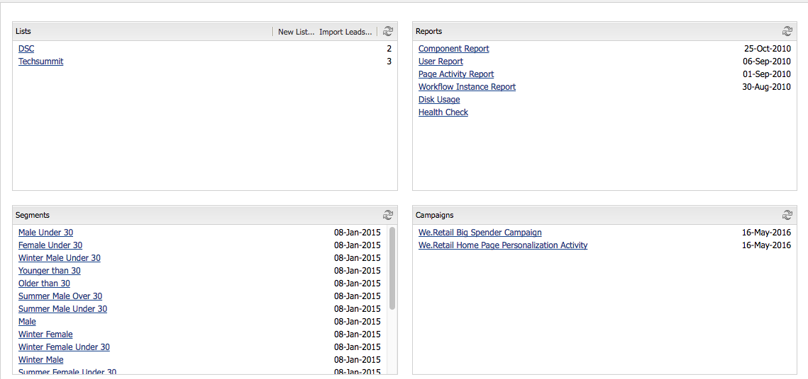
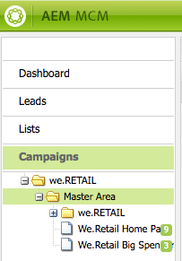

# Trabalhar com o Gerenciador de campanha de marketing{#working-with-the-marketing-campaign-manager}

No AEM, o Gerenciador de campanha de marketing (MCM) é um console que ajuda a gerenciar campanhas de multicanais. Com esse software de automação de marketing, é possível controlar todas suas marcas, campanhas e experiências juntamente com os respectivos segmentos, listas, leads e relatórios.

O MCM pode ser acessado de vários locais no AEM; por exemplo, na tela de Boas-vindas, usando o ícone Campanhas ou com o URL:

`https://<hostname>:<port>/libs/mcm/content/admin.html`

Por exemplo:

`https://localhost:4502/libs/mcm/content/admin.html`

No MCM, você pode acessar:

* **[Painel](#dashboard)** Que é dividido em quatro painéis:

   * [Listas](#lists) Este painel mostra as listas que já foram criadas, juntamente com o número de leads nessa lista. Nesse painel, é possível criar uma nova lista diretamente ou através da importação de leads.
Se selecionar uma lista específica, você será levado para a seção [Listas](#lists) que mostra os detalhes da lista.

   * [Segmentos](/help/sites-classic-ui-authoring/classic-personalization-campaigns.md#anoverviewofsegmentation) Este painel mostra os segmentos definidos. Os segmentos permitem caracterizar uma coleção de visitantes que compartilham determinadas características.
Selecionar um segmento específico abrirá a página de definição de segmento.

   * [Relatórios](/help/sites-administering/reporting.md) O AEM fornece diferentes relatórios para ajudá-lo a analisar e monitorar o status da sua instância. Este painel do MCM lista os relatórios.
Selecionar um relatório abrirá a página do relatório.

   * [Campanhas](#campaigns) Este painel lista suas experiências de campanha, como[ boletins informativos](/help/sites-classic-ui-authoring/classic-personalization-campaigns.md#newsletters) e [ teasers](/help/sites-classic-ui-authoring/classic-personalization-campaigns.md#teasers).

* **[Leads](#leads)** Aqui você pode gerenciar seus leads. É possível criar ou importar leads, editar detalhes específicos para leads individuais ou excluir quando não forem mais necessários. Também é possível adicionar os leads a diferentes grupos, chamados de Listas. **Observação:** a Adobe não planeja aprimorar mais esse recurso.
A recomendação é [aproveitar o Adobe Campaign e a integração com o AEM](/help/sites-administering/campaign.md).

* **[Listas](#lists)** Aqui você pode gerenciar suas listas (de leads).**Observação:** a Adobe não planeja aprimorar mais esse recurso.
A recomendação é [aproveitar o Adobe Campaign e a integração com o AEM](/help/sites-administering/campaign.md).

* **[Campanhas](#campaigns)** Aqui você pode gerenciar suas marcas, campanhas e experiências.

## Painel {#dashboard}

O painel mostra quatro painéis que fornecem uma visão geral de suas listas (de leads), segmentos, relatórios e campanhas. O acesso à funcionalidade básica destes também está disponível aqui.

### Leads {#leads}

>[!NOTE]
>
>A Adobe não planeja aprimorar mais esse recurso (Gerenciamento de leads).
>A recomendação é aproveitar [Adobe Campaign e a integração para AEM](/help/sites-administering/campaign.md).

No AEM MCM, é possível organizar e adicionar leads, inserindo-os manualmente ou importando uma lista separada por vírgulas (por exemplo, uma lista de endereços). Outras maneiras de gerar leads são a partir de inscrições em informativos ou de inscrições em comunidades (se configuradas, elas podem acionar um fluxo de trabalho que multiplica leads). Os Leads normalmente são categorizados e armazenados em uma lista, de modo a permitir a posterior execução de ações em toda a lista (por exemplo, o envio de um email personalizado para uma determinada lista).

Em **Leads** no painel esquerdo, é possível criar, importar, editar e excluir leads, bem como ativá-los ou desativá-los conforme necessário. É possível adicionar um lead a uma lista ou ver a quais listas ele pertence.

>[!NOTE]
>
>Consulte [Trabalho com leads](/help/sites-classic-ui-authoring/classic-personalization-campaigns.md#workingwithleads) para obter informações detalhadas sobre as tarefas específicas.

### Listas {#lists}

>[!NOTE]
>
>A Adobe não planeja aprimorar mais esse recurso (Gerenciamento de listas).
>A recomendação é aproveitar [Adobe Campaign e a integração para AEM](/help/sites-administering/campaign.md).

As listas permitem organizar seus leads em grupos. Com as listas, é possível direcionar suas campanhas de marketing a um grupo seleto de pessoas (por exemplo, é possível enviar um boletim informativo direcionado para uma lista).

Em **Listas**, é possível gerenciar suas listas, criando, importando, editando, mesclando e excluindo as listas que você pode ativar ou desativar, conforme necessário. Também é possível ver os leads nessa lista, verificar se a lista é membro de outra lista ou consultar a descrição.

>[!NOTE]
>
>Consulte [Trabalhar com listas](/help/sites-classic-ui-authoring/classic-personalization-campaigns.md#workingwithlists) para obter informações detalhadas sobre tarefas específicas.

### Campanhas {#campaigns}

>[!NOTE]
>
>Consulte [Teasers e estratégias](/help/sites-classic-ui-authoring/classic-personalization-campaigns.md#workingwithlists), [Configuração da sua campanha](/help/sites-classic-ui-authoring/classic-personalization-campaigns.md#settingupyourcampaign) e [Boletins informativos](/help/sites-classic-ui-authoring/classic-personalization-campaigns.md#newsletters) para obter informações detalhadas sobre tarefas específicas.

Para acessar as campanhas existentes, clique em **Campanhas** no MCM.

* **No painel esquerdo**: há uma lista de todas as marcas e campanhas.
Um clique único em uma marca irá:

   * expandir a lista para mostrar todas as campanhas relacionadas no painel esquerdo; essa lista também mostra o número de experiências que existem para cada campanha.
   * abrir a visão geral da marca no painel direito.

* **No painel direito**: os ícones são exibidos para cada marca (campanhas históricas não serão exibidas).
É possível clicar duas vezes nestes para abrir a visão geral da marca.

#### Visão geral da marca {#brand-overview}

Aqui você pode:

* Consultar o número de campanhas e experiências (número mostrado no painel esquerdo) existente para essa marca.
* Criar uma **Nova...** campanha para essa marca.

* Alterar o intervalo de tempo exibido; selecione **Semana**, **Mês** ou **Trimestre**, use as setas para selecionar períodos específicos ou retornar para **Hoje**.

* Selecione uma campanha (no painel direito) para:

   * Editar as **Propriedades...**
   * **Excluir** a campanha.

* Abra a visão geral da campanha (clique duas vezes em uma campanha no painel direito ou clique uma vez no painel esquerdo).

#### Visão geral da campanha {#campaign-overview}

Para campanhas individuais, há duas exibições disponíveis:

1. **Exibição de calendário**

   Use o ícone:

   

   Apresenta uma lista de todos os pontos de contato (cinza) com os períodos de tempo horizontais das experiências (verde) conectados a esses pontos de contato:

   

   Aqui você pode:

   * Alterar o intervalo de tempo que está visualizando usando as setas ou retornar para **Hoje**.

   * Usar **Adicionar ponto de contato...** para adicionar um novo ponto de contato para uma experiência existente.

   * Clicar em um teaser (no painel direito) para definir **Em tempo** e **Tempo desligado**.

1. **Exibição de lista**

   Use o ícone:

   

   Isso lista todas as experiências (por exemplo, teasers e boletins informativos) para a campanha selecionada:

   

   Aqui você pode:

   * Criar um **Novo...experiência**; por exemplo, ofertas Adobe Target, teasers e boletins informativos.
   * **Editar** os detalhes de uma página de teaser ou boletim informativo específico (também é possível clicar duas vezes).
   * Definir as **Propriedades...** para uma página de teaser ou boletim informativo específico.
   * **Simular** a aparência de uma experiência (página de teaser ou boletim informativo).
Quando a página simulada abrir, será possível abrir o sidekick para alternar para o modo de edição dessa página.

   * **Analisar...** as impressões geradas para uma página.

   * **Excluir** os itens quando não forem mais necessários.
   * **Pesquisar** texto (o campo Título da experiência será pesquisado).
   * Usar a pesquisa **Avançada** para aplicar filtros na pesquisa.

### Simular as experiências da campanha  {#simulating-your-campaign-experiences}

No MCM, clique em **Campanhas**. Certifique-se de que a exibição de lista está ativa, selecione a experiência necessária da campanha e clique em **Simular**. O ponto de contato (página de teaser ou boletim informativo) será aberto para mostrar a experiência selecionada, conforme o visitante a verá.

Também é possível também abrir o sidekick (clique na pequena seta para baixo) para alterar para o modo de edição e atualizar a página.

### Analisar as experiências da campanha  {#analyzing-your-campaign-experiences}

No MCM, clique em **Campanhas**. Certifique-se de que a exibição de lista está ativa, selecione a experiência necessária da campanha e clique em **Analisar...**. Um gráfico das impressões da página será exibido ao longo do tempo.

