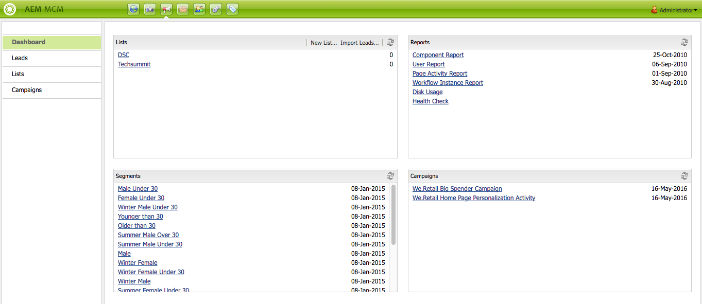

# Trabalhar com o gerente de campanha de marketing{#working-with-the-marketing-campaign-manager}

No AEM, o Gerenciador de campanhas de marketing (MCM) é um console que ajuda você a gerenciar campanhas com vários canais. Com esse software de automação de marketing, você pode gerenciar todas as suas marcas, campanhas e experiências, juntamente com os segmentos, listas, clientes potenciais e relatórios relacionados.

O MCM pode ser acessado de vários locais no AEM; por exemplo, na tela Welcome, usando o ícone Campaigns ou com o URL:

`https://<hostname>:<port>/libs/mcm/content/admin.html`

Por exemplo:

`https://localhost:4502/libs/mcm/content/admin.html`

No MCM, você pode acessar:

* **[Painel](#dashboard)**
Ela é dividida em quatro painéis:

   * [Listas](#lists)
Esse painel mostra as listas que você já criou, juntamente com o número de clientes potenciais nessa lista. Nesse painel, é possível criar uma lista diretamente ou importar clientes em potencial para criar uma lista.
Selecionar uma lista específica levará você ao [Listas](#lists) seção que mostra os detalhes da sua lista.

   * [Segmentos](/help/sites-classic-ui-authoring/classic-personalization-campaigns.md#anoverviewofsegmentation)
Esse painel mostra os segmentos que você definiu. Os segmentos permitem caracterizar uma coleção de visitantes que compartilham certas características.
Selecionar um segmento específico abre a página de definição de segmento.

   * [Relatórios](/help/sites-administering/reporting.md)
O AEM fornece relatórios diferentes para ajudar você a analisar e monitorar o estado da sua instância. Esse painel MCM lista os relatórios.
Selecionar um relatório abre a página do relatório.

   * [Campanhas](#campaigns)
Esse painel lista suas experiências de campanha, como [informativos](/help/sites-classic-ui-authoring/classic-personalization-campaigns.md#newsletters) e [teasers](/help/sites-classic-ui-authoring/classic-personalization-campaigns.md#teasers).

* **[Clientes potenciais](#leads)**
Aqui você pode gerenciar seus leads. Você pode criar ou importar clientes potenciais, editar detalhes específicos de clientes potenciais individuais ou excluir quando não for mais necessário. Você também pode colocar leads em grupos diferentes, chamados de Listas. **Nota:** A Adobe não planeja aprimorar ainda mais esse recurso.
A recomendação é usar [Adobe Campaign e a integração com o AEM](/help/sites-administering/campaign.md).

* **[Listas](#lists)**
Aqui você pode gerenciar suas listas (de clientes potenciais).**Nota:** A Adobe não planeja aprimorar ainda mais esse recurso.
A recomendação é usar [Adobe Campaign e a integração com o AEM](/help/sites-administering/campaign.md).

* **[Campanhas](#campaigns)**
Aqui você pode gerenciar suas marcas, campanhas e experiências.

## Painel {#dashboard}

O painel mostra quatro painéis que fornecem uma visão geral de suas listas (de clientes potenciais), segmentos, relatórios e campanhas. O acesso à funcionalidade básica para esses aplicativos também está disponível aqui.

### Clientes em potencial {#leads}

>[!NOTE]
>
>A Adobe não está planejando aprimorar ainda mais esse recurso (Gerenciando clientes em potencial).
>A recomendação é usar [Adobe Campaign e a integração com o AEM](/help/sites-administering/campaign.md).

No AEM MCM, é possível organizar e adicionar leads inserindo-os manualmente ou importando uma lista separada por vírgulas; por exemplo, uma lista de mala direta. Outras maneiras de gerar leads são: inscrições em newsletters ou inscrições em comunidades (se configuradas, elas podem acionar um workflow que preenche leads). Geralmente, os clientes em potencial são categorizados e colocados em uma lista para que, posteriormente, você possa executar ações em toda a lista; por exemplo, enviar um email personalizado para uma determinada lista.

Em **Clientes potenciais** no painel esquerdo, você pode criar, importar, editar e excluir seus leads e, em seguida, ativar ou desativar, conforme necessário. Você pode adicionar um cliente em potencial a uma lista ou ver a quais listas ele já pertence.

>[!NOTE]
>
>Consulte [Trabalhar com clientes em potencial](/help/sites-classic-ui-authoring/classic-personalization-campaigns.md#workingwithleads) para obter informações detalhadas sobre tarefas específicas.

### Listas {#lists}

>[!NOTE]
>
>O Adobe não pretende aprimorar esse recurso (Gerenciamento de listas).
>A recomendação é usar [Adobe Campaign e a integração com o AEM](/help/sites-administering/campaign.md).

As listas permitem organizar seus leads em grupos. Com listas, você pode direcionar suas campanhas de marketing para um grupo selecionado de pessoas; por exemplo, você pode enviar um informativo direcionado para uma lista.

Em **Listas**, é possível gerenciar suas listas criando, importando, editando, mesclando e excluindo listas que podem ser ativadas ou desativadas conforme necessário. Você também pode visualizar os leads dentro dessa lista, ver se a lista é um membro de outra lista ou ver a descrição.

>[!NOTE]
>
>Consulte [Trabalhar com listas](/help/sites-classic-ui-authoring/classic-personalization-campaigns.md#workingwithlists) para obter informações detalhadas sobre tarefas específicas.

### Campanhas {#campaigns}

>[!NOTE]
>
>Consulte [Teasers e estratégias](/help/sites-classic-ui-authoring/classic-personalization-campaigns.md#workingwithlists), [Configuração da campanha](/help/sites-classic-ui-authoring/classic-personalization-campaigns.md#settingupyourcampaign) e [Boletins informativos](/help/sites-classic-ui-authoring/classic-personalization-campaigns.md#newsletters) para obter informações detalhadas sobre tarefas específicas.

Para acessar campanhas existentes, no MCM clique em **Campanhas**.

* **No painel esquerdo**: há uma lista de todas as marcas e campanhas.
Clicar em uma marca expande a lista para mostrar todas as campanhas relacionadas no painel à esquerda; essa lista também mostra o número de experiências existentes para cada campanha. Também abre a visão geral da marca no painel direito.

* **No painel direito**: os ícones são mostrados para cada marca (as campanhas históricas não serão mostradas).
Você pode clicar duas vezes neles para abrir a visão geral da marca.

#### Visão geral da marca {#brand-overview}

Aqui é possível:

* Veja o número de campanhas e experiências (número mostrado no painel esquerdo) que existem para essa marca.
* Criar um **Novo...** campanha para esta marca.

* Altere o período de tempo que está sendo visualizado; selecione **Semana**, **Month** ou **Trimestre**, use as setas para selecionar períodos específicos ou retornar a **Hoje**.

* Selecione uma campanha (no painel direito) para:

   * Edite o **Propriedades...**
   * **Excluir** a campanha.

* Abra a visão geral da campanha (clique duas vezes em uma campanha no painel direito ou clique uma vez no painel esquerdo).

#### Visão geral da campanha {#campaign-overview}

Para as campanhas individuais, há duas visualizações disponíveis:

1. **Exibição de calendário**

   Use o ícone:

   

   Ele apresenta uma lista de todos os pontos de contato (cinza) com um período horizontal das experiências (verde) conectadas a esse ponto de contato:

   

   Aqui é possível:

   * Altere o período que está visualizando usando as setas ou retorne para **Hoje**.

   * Uso **Adicionar Touchpoint...** para adicionar um novo ponto de contato a uma experiência existente.

   * Clique em um teaser (no painel direito) para definir a **No Prazo** e **Tempo desligado**.

1. **Exibição de lista**

   Use o ícone:

   

   Isso lista todas as experiências (por exemplo, teasers e boletins informativos) da campanha selecionada:

   

   Aqui é possível:

   * Criar um **Novo...** experiência; por exemplo, ofertas, teasers e boletins informativos da Adobe Target.
   * **Editar** os detalhes de uma página de teaser ou boletim informativo específico (um clique duplo também pode ser usado).
   * Defina o **Propriedades...** para uma página de teaser ou boletim informativo específico.
   * **Simular** a aparência de uma experiência (página de teaser ou boletim informativo).
Quando a página simulada estiver aberta, você pode abrir o sidekick para alternar para o modo de edição para essa página.

   * **Analisar...** as impressões geradas para uma página.

   * **Excluir** quando não forem mais necessários.
   * **Pesquisar** para o seu texto (o campo Título da experiência será pesquisado).
   * Uso **Avançado** pesquisa para aplicar filtros à pesquisa.

### Simulação das experiências da campanha {#simulating-your-campaign-experiences}

No MCM, clique em **Campanhas**. Verifique se a exibição de lista está ativa, selecione a experiência de campanha necessária e clique em **Simular**. O ponto de contato (página de teaser ou boletim informativo) será aberto para mostrar a experiência selecionada, pois o visitante a verá.

Aqui, você também pode abrir o sidekick (clique na seta pequena para baixo) para alterar para o modo de edição e atualizar a página.

### Análise das experiências do Campaign {#analyzing-your-campaign-experiences}

No MCM, clique em **Campanhas**. Verifique se a exibição de lista está ativa, selecione a experiência de campanha necessária e selecione **Analisar...**. Um gráfico das impressões da página ao longo do tempo é exibido.

