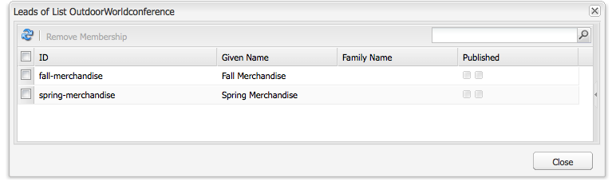

# Configuração da campanha{#setting-up-your-campaign}

Configurar uma nova campanha inclui as seguintes etapas (genéricas):

1. [Criar uma marca](#creating-a-new-brand) para manter suas campanhas.
1. Se necessário, você pode [definir as propriedades da nova marca](#defining-the-properties-for-your-new-brand).
1. [Criar uma campanha](#creating-a-new-campaign) para manter experiências; por exemplo, páginas de teaser ou um boletim informativo.
1. Se necessário, você pode [definir as propriedades da nova campanha](#defining-the-properties-for-your-new-campaign).

Em seguida, dependendo do tipo de experiências criadas, é necessário [criar uma experiência](#creating-a-new-experience). Os detalhes da experiência e as ações que seguem sua criação dependem do tipo de experiência que você deseja criar:

* Se estiver criando um Teaser:

   1. [Criar uma experiência de teaser](/help/sites-classic-ui-authoring/classic-personalization-campaigns.md#creatingateaserexperience).
   1. [Adicionar conteúdo ao seu teaser](/help/sites-classic-ui-authoring/classic-personalization-campaigns.md#addingcontenttoyourteaser).
   1. [Criar um ponto de contato para o teaser](/help/sites-classic-ui-authoring/classic-personalization-campaigns.md#creatingatouchpointforyourteaser) (adicione seu teaser a uma página de conteúdo).

* Se estiver criando um informativo:

   1. [Criar uma experiência com informativo](/help/sites-classic-ui-authoring/classic-personalization-campaigns.md#creatinganewsletterexperience).
   1. [Adicionar conteúdo ao informativo.](/help/sites-classic-ui-authoring/classic-personalization-campaigns.md#addingcontenttonewsletters)
   1. [Personalize o informativo.](/help/sites-classic-ui-authoring/classic-personalization-campaigns.md#personalizingnewsletters)
   1. [Crie uma página de aterrissagem atraente de boletim informativo](/help/sites-classic-ui-authoring/classic-personalization-campaigns.md#settingupanewsletterlandingpage).
   1. [Enviar informativo](/help/sites-classic-ui-authoring/classic-personalization-campaigns.md#sendingnewsletters) assinantes ou clientes potenciais.

* Se estiver criando uma oferta do Adobe Target (antigo Test&amp;Target):

   1. [Criar uma experiência de oferta do Adobe Target](/help/sites-classic-ui-authoring/classic-personalization-campaigns.md#creatingatesttargetofferexperience).
   1. [Fazer a integração com o Adobe Target](/help/sites-classic-ui-authoring/classic-personalization-campaigns.md#integratewithadobetesttarget)

>[!NOTE]
>
>Consulte [Segmentação](/help/sites-administering/campaign-segmentation.md) para obter instruções detalhadas sobre como definir seus segmentos.

## Criação de uma nova marca {#creating-a-new-brand}

1. Abra o **MCM** e selecione **Campanhas** no painel esquerdo.

1. Selecionar **Novo...** para inserir o **Título** e **Nome** e o modelo a ser usado para sua nova marca:

   

1. Clique em **Criar**. A nova marca é mostrada no MCM (com um ícone padrão).

### Definição das propriedades da sua nova marca {#defining-the-properties-for-your-new-brand}

1. De **Campanhas** no painel esquerdo, selecione o ícone de nova marca no painel direito e clique em **Propriedades...**

   Você pode inserir um **Título**, **Descrição** e uma imagem para ser usada como o ícone.

   

1. Clique em **OK** para salvar.

### Criar uma nova campanha {#creating-a-new-campaign}

1. De **Campanhas**, selecione a nova marca no painel esquerdo ou clique duas vezes no ícone no painel direito.

   A visão geral é exibida (vazio se a marca for nova).

1. Clique em **Novo...** e especificar a **Título**, **Nome** e o template a ser usado para sua nova campanha.

   

1. Clique em **Criar**. Sua nova campanha é mostrada no MCM.

### Definição das propriedades da nova campanha {#defining-the-properties-for-your-new-campaign}

Configure as propriedades de campanha que controlam o comportamento:

* **Prioridade:** A prioridade desta campanha em relação a outras campanhas. Quando várias campanhas estão simultaneamente Ativada, a campanha com a maior prioridade controla a experiência do visitante.
* **Horário ligado e desligado:** Essas propriedades controlam o período em que a campanha controla a experiência do visitante. A propriedade No prazo controla o horário em que a campanha começa a controlar a experiência. A propriedade Momento de desligar controla quando as campanhas param de controlar a experiência.
* **Imagem:** A imagem que representa a campanha no AEM.
* **Cloud Service:** As configurações de Cloud Service com as quais a campanha está integrada. (Consulte [Integração com o Adobe Marketing Cloud](/help/sites-administering/marketing-cloud.md).)

* **Adobe Target:** Propriedades que configuram campanhas integradas ao Adobe Target. (Consulte [Integração com o Adobe Target](/help/sites-administering/target.md).)

1. De **Campanhas**, selecione sua marca. No painel direito, selecione sua campanha e clique em **Propriedades**.

   É possível inserir várias propriedades, incluindo uma **Título**, **Descrição** e qualquer **Cloud Service** você quer.

   

1. Clique em **OK** para salvar.

### Criar uma nova experiência {#creating-a-new-experience}

O procedimento para criar uma experiência depende do tipo de experiência:

* [Criar um teaser](/help/sites-classic-ui-authoring/classic-personalization-campaigns.md#creatingateaser)
* [Criação de informativo](/help/sites-classic-ui-authoring/classic-personalization-campaigns.md#creatinganewsletter)
* [Criação de uma oferta do Adobe Target](/help/sites-classic-ui-authoring/classic-personalization-campaigns.md#creatingatesttargetoffer)

>[!NOTE]
>
>Assim como nas versões anteriores, ainda é possível criar a experiência como uma página no **Sites** console do (e todas as páginas criadas em versões anteriores ainda são totalmente compatíveis).
>
>A prática recomendada agora é usar o MCM para criar experiências.

### Configurar sua nova experiência {#configuring-your-new-experience}

Agora que você criou o esqueleto básico para sua experiência, é necessário continuar com as seguintes ações, dependendo do tipo de experiência:

* [Teaser](/help/sites-classic-ui-authoring/classic-personalization-campaigns.md#teasers):

   * [Conecte a página de teaser aos segmentos de visitantes.](/help/sites-classic-ui-authoring/classic-personalization-campaigns.md#applyingasegmenttoyourteaser)
   * [Criar um ponto de contato para o teaser](/help/sites-classic-ui-authoring/classic-personalization-campaigns.md#creatingatouchpointforyourteaser) (adicione seu teaser a uma página de conteúdo).

* [Informativo](/help/sites-classic-ui-authoring/classic-personalization-campaigns.md#newsletters):

   * [Adicionar conteúdo ao informativo.](/help/sites-classic-ui-authoring/classic-personalization-campaigns.md#addingcontenttonewsletters)
   * [Personalize o informativo.](/help/sites-classic-ui-authoring/classic-personalization-campaigns.md#personalizingnewsletters)
   * [Enviar informativo](/help/sites-classic-ui-authoring/classic-personalization-campaigns.md#sendingnewsletters) assinantes ou clientes potenciais.
   * [Crie uma página de aterrissagem atraente de boletim informativo](/help/sites-classic-ui-authoring/classic-personalization-campaigns.md#settingupanewsletterlandingpage).

* [Oferta do Adobe Target](/help/sites-classic-ui-authoring/classic-personalization-campaigns.md#testtargetoffers):

   * [Fazer a integração com o Adobe Target](/help/sites-administering/target.md)

### Adicionar um novo ponto de contato {#adding-a-new-touchpoint}

Se você tiver experiências existentes, poderá adicionar um ponto de contato diretamente da exibição Calendário do MCM:

1. Selecione a exibição de calendário da campanha.

1. Clique em **Adicionar Touchpoint...** para abrir a caixa de diálogo. Especifique a experiência que deseja adicionar:

   

1. Clique em **OK** para salvar.

## Trabalhar com clientes em potencial {#working-with-leads}

>[!NOTE]
>
>A Adobe não está planejando aprimorar ainda mais esse recurso (Gerenciando clientes em potencial).
>A recomendação é usar [Adobe Campaign e a integração com o AEM](/help/sites-administering/campaign.md).

No AEM MCM, é possível organizar e adicionar leads inserindo-os manualmente ou importando uma lista separada por vírgulas, por exemplo, uma lista de mala direta. Outras maneiras de gerar leads são: inscrições em newsletters ou inscrições em comunidades (se configuradas, elas podem acionar um workflow que preenche leads).

Os clientes em potencial geralmente são categorizados e colocados em uma lista para que posteriormente você possa executar ações em toda a lista, por exemplo, enviar um email personalizado para uma determinada lista.

No Painel, acesse todos os leads clicando em **Clientes potenciais** no painel esquerdo. Também é possível acessar clientes em potencial pelo **Listas** painel.

>[!NOTE]
>
>Para adicionar ou modificar os avatares dos usuários, abra a nuvem de sequência de cliques (Ctrl+Alt+c), carregue o perfil e clique em **Editar**.

### Criar novos clientes potenciais {#creating-new-leads}

Depois de criar novos leads, certifique-se de [ativá-los](#activating-or-deactivating-leads) para que você possa rastrear a atividade deles na instância de publicação e personalizar a experiência deles.

Para criar um cliente potencial manualmente:

1. No AEM, navegue até o MCM. No Painel, clique em **Clientes potenciais**.
1. Clique em **Novo**. A variável **Criar novo** é aberta.

   

1. Insira informações nos campos, conforme apropriado. Clique em **Endereço** guia.

   

1. Especifique as informações do endereço, conforme apropriado. Clique em **Salvar** para salvar o lead. Se precisar adicionar outros clientes em potencial, clique em **Salvar e novo**.

   O novo lead aparece no painel Leads. Quando você clica na entrada, todas as informações inseridas são exibidas no painel direito. Depois de criar um cliente potencial, você pode adicioná-lo a uma lista.

   

### Ativar ou desativar clientes em potencial {#activating-or-deactivating-leads}

A ativação de leads ajuda a rastrear sua atividade na instância de publicação e permite personalizar a experiência deles. Quando não quiser mais rastrear a atividade deles, você poderá desativá-los.

Para leads ativos ou desativos:

1. No AEM, navegue até o MCM e clique em **Clientes potenciais**.

1. Selecione os clientes em potencial que deseja ativar ou desativar e clique em **Ativar** ou **Desativar**.

   

   Assim como com as páginas AEM, o status de publicação é indicado na variável **Publicado** coluna.

   

### Importar novos leads {#importing-new-leads}

Ao importar novos leads, você pode adicioná-los automaticamente a uma lista existente ou criar uma lista para incluí-los.

Para importar clientes em potencial de uma lista separada por vírgulas:

1. No AEM, navegue até o MCM e clique em **Clientes potenciais**.

   >[!NOTE]
   >
   >Como alternativa, você pode importar clientes em potencial seguindo um destes procedimentos:
   >
   >* No Painel, clique em **Importar clientes em potencial** no **Listas** painel
   >* Clique em **Listas** e no **Ferramentas** selecione **Importar clientes em potencial**.

1. No **Ferramentas** selecione **Importar** **Clientes potenciais**.

1. Insira as informações conforme descrito em Dados de amostra. Os seguintes campos podem ser importados: email,familyName,givenName,gender,aboutMe,city,country,phoneNumber,postalCode,region,streetAddress

   >[!NOTE]
   >
   >A primeira linha na lista de CSV são rótulos predefinidos que devem ser escritos exatamente como no exemplo:
   >
   >
   >`email,givenName,familyName` - se escrito como `givenname`Por exemplo, o sistema não o reconhecerá.
   >
   >

   

1. Clique em **Avançar**. Aqui, você visualiza os clientes em potencial para garantir que eles sejam precisos.

   

1. Clique em **Avançar**. Selecione a lista à qual você deseja que os clientes em potencial pertençam. Se não quiser que eles pertençam a uma lista, exclua as informações no campo. Por padrão, o AEM cria um nome de lista que inclui a data e a hora. Clique em **Importar**.

   

   O novo lead aparece no painel Leads. Se você clicar na entrada, todas as informações inseridas aparecerão no painel direito. Depois de criar um cliente potencial, você pode adicioná-lo a uma lista.

### Adicionar clientes em potencial a listas {#adding-leads-to-lists}

Para adicionar leads a listas pré-existentes:

1. No MCM, clique em **Clientes potenciais** para exibir todos os leads disponíveis.

1. Selecione os clientes em potencial que deseja adicionar a uma lista marcando a caixa de seleção ao lado do cliente potencial. Você pode adicionar quantos clientes em potencial desejar.

   

1. No **Ferramentas** selecione **Adicionar à lista...** A variável **Adicionar à lista** é aberta.

   

1. Selecione a qual lista você deseja adicionar os leads e clique em **OK**. Os clientes em potencial são adicionados às listas apropriadas.

### Exibir informações de cliente potencial {#viewing-lead-information}

Para exibir as informações do cliente potencial, no MCM, clique na caixa de seleção ao lado do cliente potencial e um painel direito será aberto com todas as informações do cliente potencial exibidas, incluindo a afiliação da lista.

### Modificar clientes em potencial existentes {#modifying-existing-leads}

Para modificar informações sobre lead existentes:

1. No MCM, clique em **Clientes potenciais**. Na lista de clientes potenciais, marque a caixa de seleção ao lado do cliente potencial que deseja editar. Todas as informações do lead aparecem no painel direito.

   

   >[!NOTE]
   >
   >Só é possível editar um único cliente em potencial por vez. Se você precisar modificar clientes em potencial que fazem parte da mesma lista, modifique a lista.

1. Clique em **Editar**. A variável **Editar lead** é aberta.

   

1. Faça as edições conforme necessário e clique em **Salvar** para salvar as alterações.

   >[!NOTE]
   >
   >Para alterar o avatar principal, vá para o perfil dos usuários. É possível carregar o perfil na nuvem de sequência de cliques pressionando CTRL+ALT+c, clicando em **Carregar** e selecionando o perfil.

### Excluir clientes em potencial existentes {#deleting-existing-leads}

Para excluir clientes potenciais existentes no MCM, marque a caixa de seleção ao lado do cliente potencial e clique em **Excluir**. O cliente potencial é removido da lista de clientes potenciais e de todas as listas associadas.

>[!NOTE]
>
>Antes de excluir, o AEM confirma que você deseja excluir o lead existente. Depois de excluído, não é possível recuperá-lo.

## Trabalhar com listas {#working-with-lists}

>[!NOTE]
>
>A Adobe não está planejando aprimorar ainda mais esse recurso (gerenciamento de listas).
>A recomendação é usar [Adobe Campaign e a integração com o AEM](/help/sites-administering/campaign.md).

As listas permitem organizar seus leads em grupos. Com listas, você pode direcionar suas campanhas de marketing para um grupo selecionado de pessoas; por exemplo, é possível enviar um informativo direcionado para uma lista. As listas estão visíveis no MCM, no Painel ou clicando em **Listas**. Ambos fornecem o nome da lista e o número de membros.

Se você clicar em **Listas**, você também poderá verificar se a lista é um membro de outra lista e ver uma descrição.

### Criação de novas listas {#creating-new-lists}

1. No painel MCM, clique em **Nova lista ...** ou em **Listas**, clique em **Novo** .. A janela Criar lista é aberta.

   

1. Insira um nome (obrigatório), se desejar, uma descrição e clique em **Salvar**. A lista é exibida no campo **Listas** painel.

   

### Modificação de listas existentes {#modifying-existing-lists}

1. No MCM, clique em **Listas**.

1. Na lista, marque a caixa de seleção ao lado da lista que deseja editar e clique em **Editar**. A variável **Editar lista** é aberta.

   

   >[!NOTE]
   >
   >Só é possível editar uma lista por vez.

1. Faça edições, conforme necessário, e clique em **Salvar** para salvar as alterações.

### Exclusão de listas existentes {#deleting-existing-lists}

Para excluir listas existentes, no MCM, marque a caixa de seleção ao lado da lista e clique em **Excluir**. A lista é removida. Os clientes potenciais que foram afiliados à lista não são removidos, somente a afiliação com a lista é excluída.

>[!NOTE]
>
>Antes de excluir, o AEM confirma que você deseja excluir as listas existentes. Depois de excluído, não é possível recuperá-lo.

### Mesclar listas {#merging-lists}

É possível mesclar uma lista existente com outra lista. Ao fazer isso, a lista que você está mesclando se torna um membro da outra lista. Ela também ainda existe como uma entidade separada e não deve ser excluída.

Você poderá mesclar listas se tiver a mesma conferência em dois locais diferentes e quiser mesclá-las em uma lista de participantes de todas as conferências.

Para mesclar listas existentes:

1. No MCM, clique em **Listas**.

1. Selecione a lista que você deseja mesclar com outra lista marcando a caixa de seleção ao lado dela.

1. No **Ferramentas** selecione **Mesclar lista**.

   >[!NOTE]
   >
   >Só é possível mesclar uma lista por vez.

1. No **Mesclar lista** selecione a lista que deseja mesclar e clique em **OK**.

   

   A lista que você mesclou deve aumentar em um membro. Para ver se a lista foi mesclada, selecione a lista que você mesclou e na **Ferramentas** selecione **Mostrar clientes em potencial**.

1. Repita a etapa até mesclar todas as listas desejadas.

   

>[!NOTE]
>
>A remoção de uma lista mesclada de sua associação é idêntica à remoção de um cliente potencial de uma lista. Abra o **Listas** , selecione a lista que inclui a lista mesclada e remova a associação clicando no círculo vermelho ao lado da lista.

### Exibição de clientes em potencial em listas {#viewing-leads-in-lists}

A qualquer momento, você pode visualizar quais leads pertencem a uma lista específica navegando ou procurando por membros.

Para exibir os clientes em potencial em listas:

1. No MCM, clique em **Listas**.

1. Marque a caixa de seleção ao lado da lista para a qual deseja exibir membros.

1. No **Ferramentas** selecione **Mostrar clientes em potencial**. O AEM exibe os clientes em potencial que são membros dessa lista. Você pode navegar pela lista ou pesquisar membros.

   >[!NOTE]
   >
   >Além disso, você pode excluir clientes em potencial de uma lista selecionando-os e clicando em **Remover associação**.

   

1. Clique em **Fechar** para retornar ao MCM.
