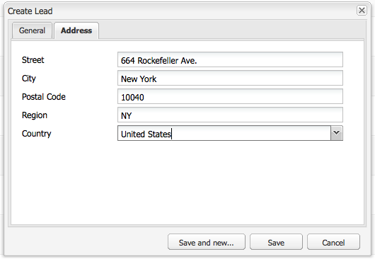
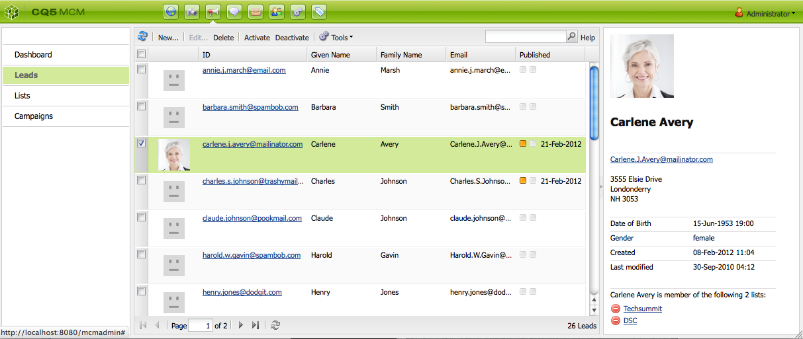
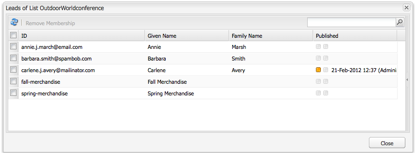

# Configuração da sua campanha{#setting-up-your-campaign}

A configuração de uma nova campanha inclui as seguintes etapas (genéricas):

1. [Criar uma marca](#creating-a-new-brand) para conter suas campanhas.
1. Se necessário, você pode [definir as propriedades da sua nova marca](#defining-the-properties-for-your-new-brand).
1. [Criar uma campanha](#creating-a-new-campaign) para conter experiências, por exemplo, páginas de teaser ou um informativo.
1. Se necessário, você pode [definir as propriedades da sua nova campanha](#defining-the-properties-for-your-new-campaign).

Em seguida, dependendo do tipo de experiência que você está criando, será necessário [criar uma experiência](#creating-a-new-experience). Os detalhes da experiência e as ações que acompanham sua criação dependem do tipo de experiência que você deseja criar:

* Se estiver criando um Teaser:

   1. [Crie uma experiência de teaser](/help/sites-classic-ui-authoring/classic-personalization-campaigns.md#creatingateaserexperience).
   1. [Adicione conteúdo ao seu teaser](/help/sites-classic-ui-authoring/classic-personalization-campaigns.md#addingcontenttoyourteaser).
   1. [Crie um ponto de contato para o teaser](/help/sites-classic-ui-authoring/classic-personalization-campaigns.md#creatingatouchpointforyourteaser) (adicione o teaser a uma página de conteúdo).

* Se estiver criando um informativo:

   1. [Crie uma experiência de informativo](/help/sites-classic-ui-authoring/classic-personalization-campaigns.md#creatinganewsletterexperience).
   1. [Adicione conteúdo ao informativo.](/help/sites-classic-ui-authoring/classic-personalization-campaigns.md#addingcontenttonewsletters)
   1. [Personalize o informativo.](/help/sites-classic-ui-authoring/classic-personalization-campaigns.md#personalizingnewsletters)
   1. [Crie uma página de aterrissagem de informativo atraente](/help/sites-classic-ui-authoring/classic-personalization-campaigns.md#settingupanewsletterlandingpage).
   1. [Envie o informativo](/help/sites-classic-ui-authoring/classic-personalization-campaigns.md#sendingnewsletters) para assinantes ou leads.

* Se estiver criando uma oferta do Adobe Target (anteriormente, Test&amp;Target):

   1. [Crie uma experiência de oferta do Adobe Target](/help/sites-classic-ui-authoring/classic-personalization-campaigns.md#creatingatesttargetofferexperience).
   1. [Faça a integração com o Adobe Target](/help/sites-classic-ui-authoring/classic-personalization-campaigns.md#integratewithadobetesttarget)

>[!NOTE]
>
>Consulte [Segmentação](/help/sites-administering/campaign-segmentation.md) para obter instruções detalhadas sobre como definir seus segmentos.

## Criação de uma nova marca {#creating-a-new-brand}

Para criar uma nova marca:

1. Abra o **MCM** e selecione **Campanhas** no painel esquerdo.

1. Selecione **Novo...** para inserir o **Título**, o **Nome** e o modelo que serão usados para sua nova marca:

   

1. Clique em **Criar**. A nova marca será exibida no MCM (com um ícone padrão).

### Definição das propriedades para sua nova marca {#defining-the-properties-for-your-new-brand}

1. Em **Campanhas** no painel esquerdo, selecione o ícone da nova marca no painel direito e clique em **Propriedades...**

   É possível inserir um **Título**, uma **Descrição** e uma imagem a ser usada como ícone.

   

1. Clique em **OK** para salvar.

### Criação de uma nova campanha {#creating-a-new-campaign}

Para criar uma nova campanha:

1. Em **Campanhas**, selecione a nova marca no painel esquerdo ou clique duas vezes no ícone no painel direito.

   A visão geral será mostrada (em branco se a marca for nova).

1. Clique em **Novo...** e especifique o **Título**, o **Nome** e o modelo que serão usados para sua nova campanha.

   

1. Clique em **Criar**. A nova campanha será exibida no MCM.

### Definição das propriedades da sua nova campanha {#defining-the-properties-for-your-new-campaign}

Configure as propriedades da campanha que controlam o comportamento:

* **Prioridade:** a prioridade dessa campanha em relação a outras campanhas. Quando várias campanhas estão ativadas simultaneamente, a campanha com a maior prioridade controla a experiência dos visitantes.
* **Em tempo e Tempo desligado:** essas propriedades controlam o período de tempo em que a campanha controla a experiência dos visitantes. A propriedade Em tempo controla a hora em que a campanha começa a controlar a experiência. A propriedade Tempo desativado controla quando as campanhas param de controlar a experiência.
* **Imagem:** a imagem que representa a campanha no AEM.
* **Serviços em nuvem:** as configurações dos Serviços em nuvem com as quais a campanha está integrada. (Consulte [Integração com a Adobe Marketing Cloud](/help/sites-administering/marketing-cloud.md).)

* **Adobe Target:** propriedades que configuram campanhas integradas ao Adobe Target. (Consulte [Integração com o Adobe Target](/help/sites-administering/target.md).)

1. Em **Campanhas**, selecione sua marca. No painel direito, selecione sua campanha e clique em **Propriedades**.

   É possível inserir várias propriedades, incluindo um **Título**, uma **Descrição** e todos os **Serviços em nuvem** que desejar.

   

1. Clique em **OK** para salvar.

### Criação de uma nova experiência {#creating-a-new-experience}

O procedimento para criar uma nova experiência depende do tipo de experiência:

* [Criação de um teaser](/help/sites-classic-ui-authoring/classic-personalization-campaigns.md#creatingateaser)
* [Criação de um informativo](/help/sites-classic-ui-authoring/classic-personalization-campaigns.md#creatinganewsletter)
* [Criação de uma oferta do Adobe Target](/help/sites-classic-ui-authoring/classic-personalization-campaigns.md#creatingatesttargetoffer)

>[!NOTE]
>
>Como ocorria nas versões anteriores, ainda é possível criar a experiência como uma página no console **Sites** (e as páginas criadas em versões anteriores ainda são totalmente compatíveis).
>
>A prática recomendada é usar o MCM para criar experiências.

### Configuração da sua nova experiência {#configuring-your-new-experience}

Agora que você criou a estrutura básica da experiência, é necessário continuar com as seguintes ações, dependendo do tipo de experiência:

* [Teaser](/help/sites-classic-ui-authoring/classic-personalization-campaigns.md#teasers):

   * [Conecte a página de teaser a segmentos de visitantes.](/help/sites-classic-ui-authoring/classic-personalization-campaigns.md#applyingasegmenttoyourteaser)
   * [Crie um ponto de contato para o teaser](/help/sites-classic-ui-authoring/classic-personalization-campaigns.md#creatingatouchpointforyourteaser) (adicione o teaser a uma página de conteúdo).

* [Informativo](/help/sites-classic-ui-authoring/classic-personalization-campaigns.md#newsletters):

   * [Adicione conteúdo ao informativo.](/help/sites-classic-ui-authoring/classic-personalization-campaigns.md#addingcontenttonewsletters)
   * [Personalize o informativo.](/help/sites-classic-ui-authoring/classic-personalization-campaigns.md#personalizingnewsletters)
   * [Envie o informativo](/help/sites-classic-ui-authoring/classic-personalization-campaigns.md#sendingnewsletters) para assinantes ou leads.
   * [Crie uma página de aterrissagem de informativo atraente](/help/sites-classic-ui-authoring/classic-personalization-campaigns.md#settingupanewsletterlandingpage).

* [Oferta do Adobe Target](/help/sites-classic-ui-authoring/classic-personalization-campaigns.md#testtargetoffers):

   * [Faça a integração com o Adobe Target](/help/sites-administering/target.md)

### Adição de um novo ponto de interação {#adding-a-new-touchpoint}

Se você já tiver experiências, é possível adicionar um ponto de interação diretamente da exibição Calendário do MCM:

1. Selecione a exibição de calendário para a campanha.

1. Clique em **Adicionar ponto de contato...** para abrir a caixa de diálogo. Especifique a experiência que você deseja adicionar:

   

1. Clique em **OK** para salvar.

## Trabalho com leads {#working-with-leads}

>[!NOTE]
>
>A Adobe não planeja aprimorar mais esse recurso (Gerenciamento de leads).
>A recomendação é [aproveitar o Adobe Campaign e a integração com o AEM](/help/sites-administering/campaign.md).

No AEM MCM, é possível organizar e adicionar leads, inserindo-os manualmente ou importando uma lista separada por vírgulas (por exemplo, uma lista de endereços). Outras maneiras de gerar leads são a partir de inscrições em informativos ou de inscrições em comunidades (se configuradas, elas podem acionar um fluxo de trabalho que multiplica leads).

Geralmente, os leads são categorizados e colocados em uma lista, para que você possa mais tarde realizar ações na lista inteira, por exemplo, enviar um email personalizado para uma determinada lista.

No Painel, você acessa todos os leads clicando em **Leads** no painel esquerdo. Também é possível acessar os leads no painel **Listas**.

>[!NOTE]
>
>Para adicionar ou modificar os avatares dos usuários, abra o Clickstream Cloud (Ctrl + Alt + C), carregue o perfil e clique em **Editar**.

### Criação de novos leads {#creating-new-leads}

Depois de criar novos leads, [ative-os](#activating-or-deactivating-leads) para que você possa acompanhar a atividade deles na instância de publicação e personalizar sua experiência.

Para criar um novo lead manualmente:

1. No AEM, navegue até o MCM. No Painel, clique em **Leads**.
1. Clique em **Novo**. A janela **Criar novo** é aberta.

   

1. Insira informações nos campos, conforme apropriado. Clique na guia **Endereço**.

   

1. Insira informações de endereço, conforme apropriado. Clique em **Salvar** para salvar o lead. Se precisar adicionar outros leads, clique em **Salvar e Novo**.

   O novo lead aparece no painel Leads. Quando você clicar na entrada, todas as informações inseridas aparecerão no painel direito. Depois de criar um lead, você pode adicioná-lo a uma lista.

   

### Ativação ou desativação de leads {#activating-or-deactivating-leads}

A ativação de leads ajuda você a acompanhar a atividade deles na instância de publicação e permite personalizar sua experiência. Quando não quiser mais acompanhar essa atividade, você poderá desativá-los.

Para ativar ou desativar leads:

1. No AEM, navegue até o MCM e clique em **Leads**.

1. Selecione os leads que você deseja ativar ou desativar e clique em **Ativar** ou **Desativar**.

   

   Assim como nas páginas do AEM, o status de publicação é indicado na coluna **Publicado**.

   

### Importação de novos leads {#importing-new-leads}

Ao importar novos leads, você pode adicioná-los automaticamente a uma lista existente ou criar uma nova lista para incluir esses leads.

Para importar leads de uma lista separada por vírgulas:

1. No AEM, navegue até o MCM e clique em **Leads**.

   >[!NOTE]
   >
   >Como alternativa, você pode importar leads seguindo um destes procedimentos:
   >
   >* No Painel, clique em **Importar leads** no painel **Listas** 
   >* Clique em **Listas** e, no menu **Ferramentas**, selecione **Importar leads**.

1. No menu **Ferramentas**, selecione **Importar** **leads**.

1. Insira as informações conforme descrito em Dados de amostra. Os seguintes campos podem ser importados: email,familyName,givenName,gender,aboutMe,city,country,phoneNumber,postalCode,region,streetAddress

   >[!NOTE]
   >
   >A primeira linha na lista CSV são as etiquetas predefinidas que devem ser escritas exatamente como no seguinte exemplo:
   >
   >
   >`email,givenName,familyName` - se escrito como `givenname`, por exemplo, o sistema não o reconhecerá.

   

1. Clique em **Avançar**. Aqui, você visualiza os leads para garantir que eles sejam precisos.

   

1. Clique em **Avançar**. Selecione a lista à qual você deseja que os leads pertençam. Se você não quiser que eles pertençam a uma lista, exclua as informações do campo. Por padrão, o AEM cria um nome de lista que inclui a data e a hora. Clique em **Importar**.

   

   O novo lead aparece no painel Leads. Se você clicar na entrada, todas as informações inseridas aparecerão no painel direito. Depois de criar um lead, você pode adicioná-lo a uma lista.

### Adição de leads a listas {#adding-leads-to-lists}

Para adicionar leads a listas pré-existentes:

1. No MCM, clique em **Leads** para ver todos os leads disponíveis.

1. Selecione os leads que você deseja adicionar a uma lista, marcando a caixa de seleção ao lado do lead. Você pode adicionar quantos leads quiser.

   

1. No menu **Ferramentas**, selecione **Adicionar à lista...** A janela **Adicionar à lista** é aberta.

   

1. Selecione a qual lista você deseja adicionar os leads e clique em **OK**. Os leads são adicionados às listas apropriadas.

### Visualização de informações do lead {#viewing-lead-information}

Para visualizar as informações do lead, no MCM, clique na caixa de seleção ao lado do lead. O painel direito será aberto com todas as informações do lead exibidas, incluindo a afiliação de lista.

### Modificação de leads existentes {#modifying-existing-leads}

Para modificar informações de leads existentes:

1. No MCM, clique em **Leads**. Na lista de leads, marque a caixa de seleção ao lado do lead que você deseja editar. Todas as informações do lead aparecem no painel direito.

   

   >[!NOTE]
   >
   >Você só pode editar um lead de cada vez. Se você precisar modificar leads que fazem parte da mesma lista, é possível modificar a lista diretamente.

1. Clique em **Editar**. A janela **Editar lead** é aberta.

   

1. Faça as edições conforme necessário e clique em **Salvar** para salvar as alterações.

   >[!NOTE]
   >
   >Para alterar o avatar do lead, acesse o perfil do usuário. Você pode carregar o perfil no Clickstream Cloud, pressionando CTRL + ALT + C, clicando em **Carregar** e selecionando o perfil.

### Exclusão de leads existentes {#deleting-existing-leads}

Para excluir leads existentes no MCM, marque a caixa de seleção ao lado do lead e clique em **Excluir**. O lead é removido da lista de leads e de todas as listas associadas.

>[!NOTE]
>
>Antes de excluir, o AEM confirma se você deseja excluir o lead existente. Depois de excluído, não será possível recuperá-lo.

## Trabalhar com listas {#working-with-lists}

>[!NOTE]
>
>A Adobe não planeja aprimorar mais esse recurso (Gerenciamento de listas).
>A recomendação é [aproveitar o Adobe Campaign e a integração com o AEM](/help/sites-administering/campaign.md).

As listas permitem organizar seus leads em grupos. Com elas, você pode direcionar as campanhas de marketing para um grupo seleto de pessoas, por exemplo, pode enviar um informativo para uma lista. Listas são visíveis no MCM, no Painel ou clicando em **Listas**. Ambos fornecem o nome da lista e o número de membros.

Se você clicar em **Listas**, também será possível ver se a lista é membro de outra lista e visualizar uma descrição.

### Criação de novas listas {#creating-new-lists}

Para criar uma nova lista (grupo):

1. No painel do MCM, clique em **Nova lista...** ou em **Listas**, clique em **Novo**. A janela Criar lista é aberta.

   

1. Insira um nome (obrigatório) e, se desejar, uma descrição e clique em **Salvar**. A lista é exibida no painel **Listas**.

   

### Modificação de listas existentes {#modifying-existing-lists}

Para modificar uma lista existente:

1. No MCM, clique em **Listas**.

1. Na lista, marque a caixa de seleção ao lado da lista que você deseja editar e clique em **Editar**. A janela **Editar lista** é aberta.

   

   >[!NOTE]
   >
   >Você só pode editar uma lista de cada vez.

1. Faça edições conforme necessário e clique em **Salvar** para salvar suas alterações.

### Exclusão de listas existentes {#deleting-existing-lists}

Para excluir listas existentes, no MCM, marque a caixa de seleção ao lado da lista e clique em **Excluir**. A lista é removida. Os leads afiliados à lista não são removidos. Apenas a afiliação à lista é excluída.

>[!NOTE]
>
>Antes de excluir, o AEM confirma se você deseja excluir as listas existentes. Depois de excluído, não será possível recuperá-lo.

### Mesclagem de listas {#merging-lists}

É possível mesclar uma lista existente com outra lista. Quando isso é feito, a lista que está sendo mesclada se torna membro da outra lista. Ela ainda existe como uma entidade separada e não deve ser excluída.

Você pode mesclar listas caso tenha a mesma conferência em dois locais diferentes e queira mesclá-las em uma única lista de participantes de todas as conferências.

Para mesclar listas existentes:

1. No MCM, clique em **Listas**.

1. Selecione a lista que você deseja mesclar com outra lista, marcando a caixa de seleção ao lado dela.

1. No menu **Ferramentas**, selecione **Mesclar listas**.

   >[!NOTE]
   >
   >É possível mesclar apenas uma lista por vez.

1. Na janela **Mesclar listas**, selecione a lista com a qual você deseja mesclar e clique em **OK**.

   

   A lista que você mesclou deve aumentar em um membro. Para ver se as listas foram mescladas, selecione a lista mesclada e, no menu **Ferramentas**, selecione **Mostrar leads**.

1. Repita a etapa até ter mesclado todas as listas desejadas.

   

>[!NOTE]
>
>O processo de remover uma lista mesclada de sua associação é idêntico ao de remover um lead de uma lista. Abra a guia **Listas**, selecione a lista que inclui a lista mesclada e remova a associação clicando no círculo vermelho ao lado dessa lista.

### Visualização de leads em listas {#viewing-leads-in-lists}

A qualquer momento, você pode ver quais leads pertencem a uma lista específica navegando ou procurando membros.

Para visualizar os leads que pertencem a uma lista:

1. No MCM, clique em **Listas**.

1. Marque a caixa de seleção ao lado da lista cujos membros você deseja visualizar.

1. No menu **Ferramentas**, selecione **Mostrar leads**. O AEM exibe os leads que são membros dessa lista. É possível navegar pela lista ou pesquisar membros.

   >[!NOTE]
   >
   >Além disso, é possível excluir leads de uma lista, selecionando-os e clicando em **Remover associação**.

   

1. Clique em **Fechar** para retornar ao MCM.
