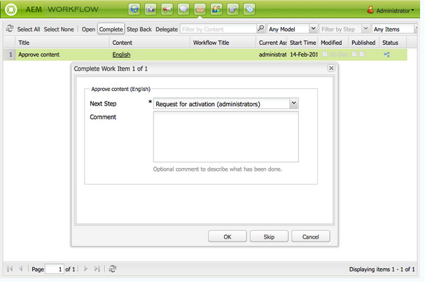
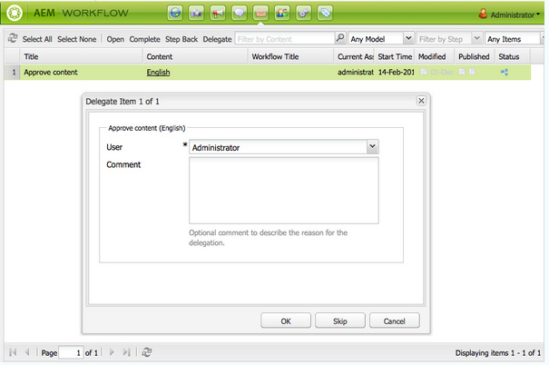

# Participar de fluxos de trabalho{#participating-in-workflows}

Fluxos de trabalho geralmente incluem etapas que exigem que uma pessoa realize uma atividade em uma página ou ativo. O fluxo de trabalho seleciona um usuário ou grupo para realizar a atividade e atribui um item de trabalho a essa pessoa ou grupo.

## Processamento dos seus itens de trabalho {#processing-your-work-items}

É possível executar as seguintes ações para processar um item de trabalho:

* **Concluir**

   Você pode concluir um item para permitir que o fluxo de trabalho progrida para a próxima etapa.

* **Delegar**

   Se uma etapa tiver sido atribuída a você, mas, por algum motivo, você não puder realizar uma ação, será possível delegar a etapa a outro usuário ou grupo.

   Os usuários que estão disponíveis para delegação dependem de quem recebeu o item de trabalho:

   * Se o item de trabalho tiver sido atribuído a um grupo, os membros desse grupo estarão disponíveis.
   * Se o item de trabalho tiver sido atribuído a um grupo e depois delegado a um usuário, os membros desse grupo e esse usuário estarão disponíveis.
   * Se o item de trabalho tiver sido atribuído a um único usuário, ele não poderá ser delegado.

* **Retroceder**

   Se você descobrir que uma etapa, ou uma série de etapas, precisa ser repetida, será possível retroceder. Essa ação permite selecionar uma etapa, ocorrida anteriormente no fluxo de trabalho, para reprocessamento. O fluxo de trabalho retornará à etapa especificada e prosseguirá a partir daí.

## Participar de um fluxo de trabalho {#participating-in-a-workflow}

### Notificações de ações do fluxo de trabalho atribuídas {#notifications-of-assigned-workflow-actions}

Quando um item de trabalho é atribuído a você (por exemplo, **Aprovar conteúdo**), vários alertas e/ou notificações são exibidos:

* A coluna **Status** do console Sites indica quando uma página está em um fluxo de trabalho:

   

* Quando você, ou um grupo ao qual você pertence, recebe um item de trabalho como parte de um fluxo de trabalho, esse item é exibido na Caixa de entrada do fluxo de trabalho do AEM.

   

### Conclusão de uma etapa do participante {#completing-a-participant-step}

Depois de realizar a ação indicada, você pode concluir o item de trabalho, permitindo que o fluxo de trabalho continue. Use o procedimento a seguir para concluir o item de trabalho.

1. Selecione a etapa do fluxo de trabalho e clique no botão **Concluído** na barra de navegação superior.
1. Na caixa de diálogo resultante, selecione a **Próxima etapa**, isto é, a etapa que deve ser executada em seguida. Uma lista suspensa mostra todos os destinos apropriados. Um **Comentário** também pode ser inserido.

   

   O número de etapas listadas depende do design do modelo de fluxo de trabalho.

1. Clique em **OK** para confirmar a ação.

### Delegação de uma etapa do participante  {#delegating-a-participant-step}

Use o procedimento a seguir para delegar um item de trabalho.

1. Clique no botão **Delegar** na barra de navegação superior.
1. Na caixa de diálogo, use a lista suspensa para selecionar o **Usuário** a quem você vai delegar o item de trabalho. Você também pode adicionar um **Comentário**.

   

1. Clique em **OK** para confirmar a ação.

### Retroceder em uma etapa do participante  {#performing-step-back-on-a-participant-step}

Use o procedimento a seguir para retroceder.

1. Clique no botão Retroceder na barra de navegação superior.
1. Na caixa de diálogo resultante, selecione a Etapa anterior, ou seja, a etapa que será executada em seguida, mesmo que ela seja uma etapa anterior no fluxo de trabalho. Uma lista suspensa mostra todos os destinos apropriados.

   

1. Clique em OK para confirmar a ação.

