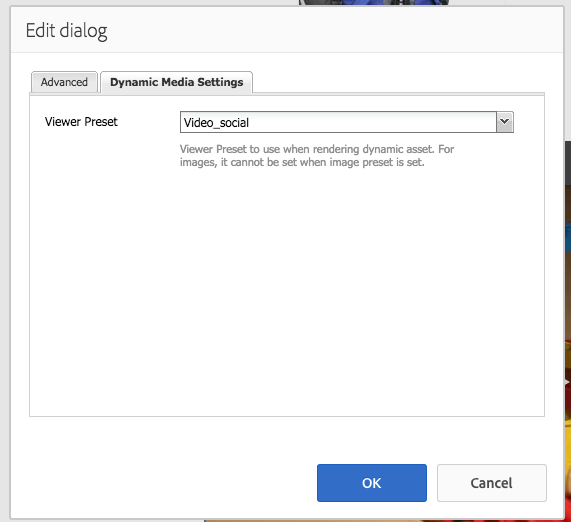

# Adição de ativos do Dynamic Media a páginas{#adding-dynamic-media-assets-to-pages}

To add the Dynamic Media functionality to assets you use on your websites, you can add the **[!UICONTROL Dynamic Media]** or **[!UICONTROL Interactive Media]** component directly on the page. You do this by entering [!UICONTROL Design] mode and enabling the dynamic media components. Em seguida, adicione esses componentes à página e adicionar ativos ao componente. A mídia dinâmica e os componentes de mídia interativa são inteligentes: eles sabem se você está adicionando uma imagem ou um vídeo, e as opções disponíveis mudam de acordo.

Você adiciona ativos de mídia dinâmica diretamente à página se estiver usando o AEM como seu WCM.

>[!NOTE]
>
>Os mapas de imagem estão disponíveis imediatamente para banners de carrossel.

## Adding a Dynamic Media component to a page {#adding-a-dynamic-media-component-to-a-page}

Adding the [!UICONTROL Dynamic Media] or [!UICONTROL Interactive Media] component to a page is the same as adding a component to any page. The [!UICONTROL Dynamic Media] and [!UICONTROL Interactive Media] components are described in detail in the following sections.

Para adicionar um componente/visualizador de mídia dinâmica a uma página:

1. No AEM, abra a página à qual você deseja adicionar o componente Mídia dinâmica.
1. If no Dynamic Media component is available, click the ruler in the [!UICONTROL Sidekick] to enter **[!UICONTROL Design]** mode, click **[!UICONTROL Edit]** parsys, and select **[!UICONTROL Dynamic Media]** to make the Dynamic Media components available.

   >[!NOTE]
   >
   >Para obter mais informações, Consulte [Configuração dos componentes no modo de Design](/help/sites-authoring/default-components-designmode.md).

1. Return to **[!UICONTROL Edit]** mode by clicking the pencil icon in the [!UICONTROL Sidekick].
1. Drag the **[!UICONTROL Dynamic Media]** or **[!UICONTROL Interactive Media]** component from the **[!UICONTROL Other]** group in the sidekick onto the page in the desired location.
1. Clique em **[!UICONTROL Editar]** para abrir o componente.
1. Edite o componente conforme necessário e clique em **[!UICONTROL OK]** para salvar as alterações.

## Componentes de mídia dinâmica {#dynamic-media-components}

[!UICONTROL Dynamic Media] e [!UICONTROL Interative Media] estão disponíveis no [!UICONTROL Sidekick] em **[!UICONTROL Dynamic Media.]** Você usa o componente **[!UICONTROL Mídia interativa]** para quaisquer ativos interativos, como vídeo interativo, imagens interativas ou conjuntos de carrossel. Para todos os outros componentes de mídia dinâmica, use o componente **[!UICONTROL Mídia dinâmica]**.

>[!NOTE]
>
>Esses componentes não estão disponíveis por padrão e precisam ser selecionados no modo de Design antes de serem usados. [Depois que eles forem disponibilizados no modo de Design](/help/sites-authoring/default-components-designmode.md), você poderá adicionar os componentes à sua página como faria com qualquer outro componente do AEM.

### Componente Mídia dinâmica {#dynamic-media-component}

O componente Dynamic Media é inteligente — dependendo se você adicionar uma imagem ou um vídeo, você terá várias opções. O componente oferece suporte a predefinições de imagem, visualizadores baseados em imagem, como conjuntos de imagens, conjuntos de rotação, conjuntos de mídia mista e vídeo. Além disso, o visualizador responde. Ou seja, o tamanho da tela muda automaticamente com base no tamanho da tela. Todos os visualizadores são visualizadores baseados em HTML5.

>[!NOTE]
>
>When you add the [!UICONTROL Dynamic Media] component, and **[!UICONTROL Dynamic Media Settings]** is blank or you cannot add an asset properly, check the following:
>
>* Você [ativou a Mídia dinâmica](/help/assets/config-dynamic.md). As mídias dinâmicas são desativadas por padrão.
>* A imagem tem um arquivo tiff de pirâmide. As imagens importadas antes de a mídia dinâmica ser ativada não possuem um arquivo tiff de pirâmide.

>

#### Ao trabalhar com imagens {#when-working-with-images}

The [!UICONTROL Dynamic Media] component lets you add dynamic images, including image sets, spin sets, and mixed media sets. Você pode ampliar, reduzir e, se aplicável, transformar uma imagem em um conjunto de giro ou selecionar uma imagem de outro tipo de conjunto.

Você também pode configurar a predefinição do visualizador, a predefinição da imagem ou o formato da imagem diretamente no componente. Para tornar uma imagem responsiva, você pode definir os pontos de interrupção ou aplicar uma predefinição de imagem responsiva.

You can edit the following Dynamic Media settings by clicking **[!UICONTROL Edit]** in the component and then clicking the **[!UICONTROL Dynamic Media Settings]** tab.

>[!NOTE]
>
>Por padrão, o componente de imagem do Dynamic Media é adaptável. If you want to make it a fixed size, set it in the component in the **[!UICONTROL Advanced]** tab with the **[!UICONTROL Width]** and **[!UICONTROL Height]** properties.

**[!UICONTROL Predefinição]** do visualizador - selecione uma predefinição do visualizador existente no menu suspenso. Se a predefinição de visualizador que você está procurando não estiver visível, pode ser necessário torná-la visível. Consulte [Gerenciar predefinições do visualizador](/help/assets/managing-viewer-presets.md). Não é possível selecionar uma predefinição de visualizador se você estiver usando uma predefinição de imagem e vice-versa.

Essa será a única opção disponível se você estiver visualizando conjuntos de imagens, conjuntos de rotação ou conjuntos de mix de mídia. As predefinições do visualizador exibidas também são inteligentes - somente as predefinições do visualizador relevantes são exibidas.

**[!UICONTROL Predefinição]** de imagem - selecione uma predefinição de imagem existente no menu suspenso. Se a predefinição de imagem que você está procurando não estiver visível, pode ser necessário torná-la visível. Consulte [Gerenciar predefinições de imagens](/help/assets/managing-image-presets.md). Não é possível selecionar uma predefinição de visualizador se você estiver usando uma predefinição de imagem e vice-versa.

Essa opção não estará disponível se você estiver visualizando conjuntos de imagens, conjuntos de rotação ou conjuntos de mix de mídia.

**[!UICONTROL Modificadores]** de imagem - é possível alterar os efeitos de imagem fornecendo comandos de imagem adicionais. These are described in [Managing Image Presets](/help/assets/managing-viewer-presets.md) and the [Command reference](https://docs.adobe.com/content/help/en/dynamic-media-developer-resources/image-serving-api/image-serving-api/http-protocol-reference/command-reference/c-command-reference.html).

Essa opção não estará disponível se você estiver visualizando conjuntos de imagens, conjuntos de rotação ou conjuntos de mix de mídia.

**[!UICONTROL Pontos de interrupção]** - se você estiver usando esse ativo em um site responsivo, é necessário adicionar os pontos de interrupção da página. Os pontos de interrupção da imagem precisam ser separados por vírgulas (,). Essa opção funciona quando não há altura ou largura definida em uma predefinição de imagem.

Essa opção não estará disponível se você estiver visualizando conjuntos de imagens, conjuntos de rotação ou conjuntos de mix de mídia.

You can edit the following [!UICONTROL Advanced Settings] by clicking **[!UICONTROL Edit]** in the component.

**[!UICONTROL Título]** - Altere o título da imagem.

**[!UICONTROL Texto]** alternativo - Adicione um título à imagem para os usuários que tiverem gráficos desativados.

Essa opção não estará disponível se você estiver visualizando conjuntos de imagens, conjuntos de rotação ou conjuntos de mix de mídia.

**[!UICONTROL URL, Abrir]** - você pode definir um ativo de para abrir um link. Set the **[!UICONTROL URL]** and **[!UICONTROL Open in]** to indicate whether you want it to open in the same window or a new window.

Essa opção não estará disponível se você estiver visualizando conjuntos de imagens, conjuntos de rotação ou conjuntos de mix de mídia.

**[!UICONTROL Largura e altura]** - insira o valor em pixels se desejar que a imagem tenha um tamanho fixo. Deixar esses valores em branco torna o recurso adaptável.

#### When working with video {#when-working-with-video}

Use the [!UICONTROL Dynamic Media] component to add dynamic video to your web pages. Ao editar o componente, você pode optar por usar uma predefinição de visualizador de vídeo predefinida para reproduzir o vídeo na página.

You can edit the following [!UICONTROL Dynamic Media Settings] by clicking **[!UICONTROL Edit]** in the component.

>[!NOTE]
>
>Por padrão, o componente de vídeo Mídia dinâmica é adaptável. If you want to make it a fixed size, set it in the component with the **[!UICONTROL Width]** and **[!UICONTROL Height]** in the **[!UICONTROL Advanced]** tab.

**[!UICONTROL Predefinição]** do visualizador - selecione uma predefinição do visualizador de vídeo existente no menu suspenso. Se a predefinição de visualizador que você está procurando não estiver visível, pode ser necessário torná-la visível. Consulte [Gerenciar predefinições do visualizador](/help/assets/managing-viewer-presets.md).

You can edit the following [!UICONTROL Advanced] settings by clicking **[!UICONTROL Edit]** in the component.

**[!UICONTROL Título]** - Altere o título do vídeo.

**[!UICONTROL Largura e altura]** - insira o valor em pixels se desejar que o vídeo tenha um tamanho fixo. Deixar esses valores em branco faz com ele que seja adaptável.

#### Como fornecer vídeos seguros {#how-to-delivery-secure-video}

No AEM 6.2, ao instalar [FP-13480](https://experience.adobe.com/#/downloads/content/software-distribution/en/aem.html?package=/content/software-distribution/en/details.html/content/dam/aem/public/adobe/packages/cq620/featurepack/cq-6.2.0-featurepack-13480), você pode controlar se um vídeo é entregue por meio de uma conexão SSL segura (HTTPS) ou por uma conexão não segura (HTTP). Por padrão, o protocolo de entrega de vídeo é herdado automaticamente do protocolo da página da web de incorporação. Se a página da web for carregada via HTTPS, o vídeo também será entregue via HTTPS. E vice-versa, se a página da web estiver em HTTP, o vídeo será entregue via HTTP. Na maioria dos casos, esse comportamento padrão é satisfatório, e não há necessidade de fazer alterações na configuração. No entanto, você pode substituir esse comportamento padrão anexando `VideoPlayer.ssl=on` ao final de um caminho de URL ou à lista de outros parâmetros de configuração do visualizador em um trecho de código de incorporação, para forçar a entrega segura de vídeos.

Para obter mais informações sobre a entrega segura de vídeos e o uso do atributo de configuração `VideoPlayer.ssl` no caminho do URL, consulte [Entrega de vídeo seguro](https://docs.adobe.com/content/help/en/dynamic-media-developer-resources/library/viewers-aem-assets-dmc/video/c-html5-video-viewer-20-securevideodelivery.html) no Guia de referência de visualizadores. Além do visualizador de vídeo, o delivery de vídeo seguro está disponível para o visualizador de mídia mista e o visualizador de vídeo interativo.

### Componente Mídia interativa {#interactive-media-component}

O componente Mídia interativa é para ativos que possuem interatividade em pontos de acesso ou mapas de imagem. Se você tiver uma imagem interativa, um vídeo interativo ou um banner de carrossel, use o componente **[!UICONTROL Mídia interativa]**.

The [!UICONTROL Interactive Media] component is smart – depending on whether you add an image or a video, you have various options. Além disso, o visualizador responde. Ou seja, o tamanho da tela muda automaticamente com base no tamanho da tela. Todos os visualizadores são visualizadores baseados em HTML5.

É possível editar as seguintes configurações **[!UICONTROL Gerais]** clicando em **[!UICONTROL Editar]** no componente.

**[!UICONTROL Predefinição]** do visualizador - selecione uma predefinição do visualizador existente no menu suspenso. Se a predefinição de visualizador que você está procurando não estiver visível, pode ser necessário torná-la visível. As Predefinições do visualizador devem ser publicadas para poderem ser usadas. Consulte Gerenciar predefinições do visualizador.

**[!UICONTROL Título]** - Altere o título do vídeo.

**[!UICONTROL Largura e altura]** - insira o valor em pixels se desejar que o vídeo tenha um tamanho fixo. Deixar esses valores em branco faz com ele que seja adaptável.

You can edit the following **[!UICONTROL Add To Cart** settings by clicking **[!UICONTROL Edit]** in the component.

**[!UICONTROL Mostrar ativo]** do produto - por padrão, esse valor é selecionado. O ativo do produto mostra uma imagem do produto, conforme definido no módulo Comércio. Limpe a marca de seleção para não mostrar o ativo do produto.

**[!UICONTROL Mostrar preço]** do produto - por padrão, esse valor é selecionado. O preço do produto mostra o preço do item, conforme definido no módulo Comércio. Limpe a marca de seleção para não mostrar o preço do produto.

**[!UICONTROL Mostrar formulário]** do produto - Por padrão, esse valor não está selecionado. O Formulário de produto inclui quaisquer variantes de produto, como tamanho e cor. Limpe a marca de seleção para não mostrar as variantes do produto.
