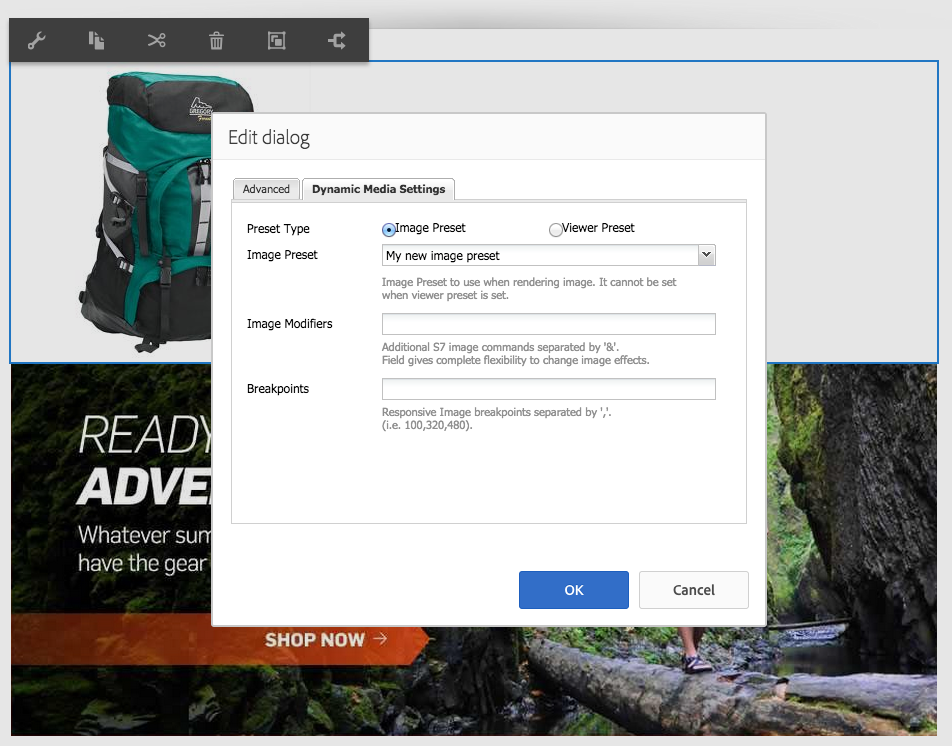

# Adição de ativos do Dynamic Media a páginas{#adding-dynamic-media-assets-to-pages}

Para adicionar a funcionalidade Dynamic Media aos ativos que você usa nos sites, é possível adicionar a variável **[!UICONTROL Dynamic Media]** ou **[!UICONTROL Mídia interativa]** diretamente na página. Enter **[!UICONTROL Design]** e ativar os componentes do Dynamic Media. Em seguida, adicione esses componentes à página e adicionar ativos ao componente. Os componentes de mídia interativa e do Dynamic Media são inteligentes - eles sabem se você está adicionando uma imagem ou um vídeo e as opções disponíveis mudam de acordo.

Você adiciona ativos do Dynamic Media diretamente à página se estiver usando o Adobe Experience Manager como o WCM.

>[!NOTE]
>
>Os mapas de imagem estão disponíveis prontamente para os banners do carrossel.

## Adicionar um componente Dynamic Media a uma página {#adding-a-dynamic-media-component-to-a-page}

Adicionar o [!UICONTROL Dynamic Media] ou [!UICONTROL Mídia interativa] componente a uma página é o mesmo que adicionar um componente a qualquer página. A variável [!UICONTROL Dynamic Media] e [!UICONTROL Mídia interativa] os componentes do são descritos detalhadamente nas seções a seguir.

Para adicionar um componente/visualizador do Dynamic Media a uma página:

1. No Experience Manager, abra a página em que deseja adicionar o componente Dynamic Media.
1. Se nenhum componente do Dynamic Media estiver disponível, selecione a régua na [!UICONTROL Sidekick] para inserir **[!UICONTROL Design]** modo.
1. Selecionar **[!UICONTROL Editar]** parsys
1. Selecionar **[!UICONTROL Dynamic Media]** para disponibilizar os componentes do Dynamic Media.

   >[!NOTE]
   >
   >Consulte [Configuração de componentes no modo de design](/help/sites-authoring/default-components-designmode.md) para obter mais informações.

1. Retornar para **[!UICONTROL Editar]** clicando no ícone de lápis no [!UICONTROL Sidekick].
1. Arraste o **[!UICONTROL Dynamic Media]** ou **[!UICONTROL Mídia interativa]** componente do **[!UICONTROL Outro]** agrupe no sidekick na página no local desejado.
1. Selecionar **[!UICONTROL Editar]** assim, o componente é aberto.
1. [Editar o componente](#dynamic-media-component) conforme necessário.
1. Selecionar **[!UICONTROL OK]** para que as alterações sejam salvas.

## Componentes do Dynamic Media {#dynamic-media-components}

[!UICONTROL Dynamic Media] e [!UICONTROL Mídia interativa] estão disponíveis no [!UICONTROL Sidekick] em **[!UICONTROL Dynamic Media]**. Você usa o **[!UICONTROL Mídia interativa]** componente para qualquer ativo interativo, como vídeo interativo, imagens interativas ou conjuntos de carrossel. Para todos os outros componentes do Dynamic Media, use o **[!UICONTROL Dynamic Media]** componente.

>[!NOTE]
>
>Esses componentes não estão disponíveis por padrão e devem ser selecionados no modo Design antes de usar. [Depois que forem disponibilizados no modo Design](/help/sites-authoring/default-components-designmode.md), você pode adicionar os componentes à sua página como faria com qualquer outro componente Experience Manager.

### Componente do Dynamic Media {#dynamic-media-component}

O componente Dynamic Media é inteligente — dependendo se você adiciona uma imagem ou um vídeo, existem várias opções. O componente oferece suporte a predefinições de imagens, visualizadores baseados em imagem, como conjuntos de imagens, conjuntos de rotação, conjuntos de mídia mista e vídeo. Além disso, o visualizador é responsivo. Ou seja, o tamanho da tela muda automaticamente com base no tamanho da tela. Todos os visualizadores são baseados em HTML5.

>[!NOTE]
>
>Ao adicionar a variável [!UICONTROL Dynamic Media] componente e **[!UICONTROL Configurações do Dynamic Media]** estiver em branco ou não puder adicionar um ativo corretamente, verifique o seguinte:
>
>* Você tem [Dynamic Media habilitado](/help/assets/config-dynamic.md). O Dynamic Media está desativado por padrão.
>* A imagem tem um arquivo TIFF de pirâmide. As imagens importadas antes da ativação do Dynamic Media não têm um arquivo TIFF em pirâmide.
>

#### Ao trabalhar com imagens {#when-working-with-images}

A variável [!UICONTROL Dynamic Media] O componente permite adicionar imagens dinâmicas, incluindo conjuntos de imagens, conjuntos de rotação e conjuntos de mídia mista. Você pode ampliar, reduzir e, se aplicável, girar uma imagem em um conjunto de rotação ou selecionar uma imagem de outro tipo de conjunto.

Também é possível configurar a predefinição do visualizador, a predefinição da imagem ou o formato da imagem diretamente no componente. Para tornar uma imagem responsiva, você pode definir os pontos de interrupção ou aplicar uma predefinição de imagem responsiva.

Você pode editar as seguintes configurações do Dynamic Media clicando em **[!UICONTROL Editar]** no componente e, em seguida, clicando no ícone **[!UICONTROL Configurações do Dynamic Media]** guia.

>[!NOTE]
>
>Por padrão, o componente de imagem do Dynamic Media é adaptável. Se desejar torná-lo de um tamanho fixo, defina-o no componente na **[!UICONTROL Avançado]** com a guia **[!UICONTROL Largura]** e **[!UICONTROL Altura]** propriedades.

**[!UICONTROL Predefinição do visualizador]** - Selecione uma predefinição do visualizador existente no menu suspenso. Se a predefinição do visualizador que você está procurando não estiver visível, é necessário torná-la visível. Consulte [Gerenciamento de predefinições do visualizador](/help/assets/managing-viewer-presets.md). Não é possível selecionar uma predefinição do visualizador se você estiver usando uma predefinição de imagem e vice-versa.

Essa opção só estará disponível se você exibir conjuntos de imagens, conjuntos de rotação ou conjuntos de mídia mista. As predefinições do visualizador exibidas são inteligentes. Ou seja, somente as predefinições relevantes do visualizador são exibidas.

**[!UICONTROL Predefinição de imagem]** - Selecione uma predefinição de imagem existente no menu suspenso. Se a predefinição de imagem que você está procurando não estiver visível, será necessário torná-la visível. Consulte [Gerenciamento de predefinições da imagem](/help/assets/managing-image-presets.md). Não é possível selecionar uma predefinição do visualizador se você estiver usando uma predefinição de imagem e vice-versa.

Essa opção não estará disponível se você estiver visualizando conjuntos de imagens, conjuntos de rotação ou conjuntos de mídia mista.

**[!UICONTROL Modificadores de imagem]** - Você pode alterar os efeitos de imagem fornecendo comandos de imagem adicionais. Esses comandos estão descritos em [Gerenciamento de predefinições da imagem](/help/assets/managing-viewer-presets.md) e a variável [Referência de comando](https://experienceleague.adobe.com/docs/dynamic-media-developer-resources/image-serving-api/image-serving-api/http-protocol-reference/command-reference/c-command-reference.html).

Essa opção não estará disponível se você estiver visualizando conjuntos de imagens, conjuntos de rotação ou conjuntos de mídia mista.

**[!UICONTROL Pontos de interrupção]** - Se você estiver usando esse ativo em um site responsivo, será necessário adicionar os pontos de interrupção da página. Os pontos de interrupção da imagem são separados por vírgulas (,). Essa opção funciona quando não há altura ou largura definidas em uma predefinição de imagem.

Essa opção não estará disponível se você estiver visualizando conjuntos de imagens, conjuntos de rotação ou conjuntos de mídia mista.

Você pode editar o seguinte [!UICONTROL Configurações avançadas] clicando em **[!UICONTROL Editar]** no componente.

**[!UICONTROL Título]** - Alterar o título da imagem.

**[!UICONTROL Texto Alternativo]** - Adicione um título à imagem para os usuários com gráficos desativados.

Essa opção não estará disponível se você estiver visualizando conjuntos de imagens, conjuntos de rotação ou conjuntos de mídia mista.

**[!UICONTROL URL, Abrir em]** - É possível definir um ativo do para abrir um link. Defina o **[!UICONTROL URL]** e **[!UICONTROL Abrir em]** para indicar se deseja que ele seja aberto na mesma janela ou em uma nova janela.

Essa opção não estará disponível se você estiver visualizando conjuntos de imagens, conjuntos de rotação ou conjuntos de mídia mista.

**[!UICONTROL Largura e altura]** - Digite o valor em pixels se quiser que a imagem seja de tamanho fixo. Deixar esses valores em branco torna o ativo adaptável.

#### Ao trabalhar com vídeo {#when-working-with-video}

Use o **[!UICONTROL Dynamic Media]** para adicionar vídeo dinâmico às suas páginas da Web. Ao editar o componente, você pode optar por usar uma predefinição predefinida do visualizador de vídeo para reproduzir o vídeo na página.

Você pode editar o seguinte [!UICONTROL Configurações do Dynamic Media] clicando em **[!UICONTROL Editar]** no componente.

>[!NOTE]
>
>Por padrão, o componente de vídeo do Dynamic Media é adaptável. Se desejar torná-lo de um tamanho fixo, defina-o no componente com a tag **[!UICONTROL Largura]** e **[!UICONTROL Altura]** no **[!UICONTROL Avançado]** guia.

**[!UICONTROL Predefinição do visualizador]** - Selecione uma predefinição do visualizador de vídeo existente no menu suspenso. Se a predefinição do visualizador que você está procurando não estiver visível, é necessário torná-la visível. Consulte [Gerenciamento de predefinições do visualizador](/help/assets/managing-viewer-presets.md).

Você pode editar o seguinte [!UICONTROL Avançado] configurações clicando em **[!UICONTROL Editar]** no componente.

**[!UICONTROL Título]** - Alterar o título do vídeo.

**[!UICONTROL Largura e altura]** - Digite o valor em pixels se quiser que o vídeo seja de tamanho fixo. Deixar esses valores em branco o torna adaptável.

#### Fornecer vídeo seguro {#how-to-delivery-secure-video}

No Experience Manager 6.2, ao instalar [FP-13480](https://experience.adobe.com/#/downloads/content/software-distribution/en/aem.html?package=/content/software-distribution/en/details.html/content/dam/aem/public/adobe/packages/cq620/featurepack/cq-6.2.0-featurepack-13480), você pode controlar se um vídeo é entregue por uma conexão SSL segura (HTTPS) ou por uma conexão não segura (HTTP). Por padrão, o protocolo de entrega de vídeo é herdado automaticamente do protocolo da página da Web de incorporação. Se a página da Web for carregada por HTTPS, o vídeo também será entregue por HTTPS. E, por outro lado, se a página da Web estiver em HTTP, o vídeo será entregue via HTTP. Normalmente, esse comportamento padrão é adequado e não há necessidade de fazer alterações na configuração. No entanto, é possível substituir esse comportamento padrão. Anexar `VideoPlayer.ssl=on` ao final de um caminho de URL ou à lista de outros parâmetros de configuração do visualizador em um trecho de código incorporado. Qualquer ação força a entrega segura do vídeo.

Para obter mais informações sobre a entrega segura de vídeo e o uso da `VideoPlayer.ssl` atributo de configuração no caminho do URL, consulte [Entrega de vídeo segura](https://experienceleague.adobe.com/docs/dynamic-media-developer-resources/library/viewers-aem-assets-dmc/video/c-html5-video-viewer-20-securevideodelivery.html) no Guia de referência de visualizadores. Além do visualizador de vídeo, a entrega segura de vídeo está disponível para o visualizador de Mídia mista e o visualizador de Vídeo interativo.

### Componente de mídia interativa {#interactive-media-component}

O componente de Mídia interativa é para os ativos que têm interatividade, como pontos de acesso ou mapas de imagem. Se você tiver uma imagem interativa, vídeo interativo ou banner do carrossel, use o **[!UICONTROL Mídia interativa]** componente.

A variável [!UICONTROL Mídia interativa] O componente é inteligente - dependendo se você adiciona uma imagem ou um vídeo, existem várias opções. Além disso, o visualizador é responsivo. Ou seja, o tamanho da tela muda automaticamente com base no tamanho da tela. Todos os visualizadores são baseados em HTML5.

Você pode editar o seguinte **[!UICONTROL Geral]** configurações clicando em **[!UICONTROL Editar]** no componente.

**[!UICONTROL Predefinição do visualizador]** - Selecione uma predefinição do visualizador existente no menu suspenso. Se a predefinição do visualizador que você está procurando não estiver visível, é necessário torná-la visível. As predefinições do visualizador devem ser publicadas antes de serem usadas. Consulte [Gerenciar predefinições do visualizador](/help/assets/managing-viewer-presets.md).

**[!UICONTROL Título]** - Alterar o título do vídeo.

**[!UICONTROL Largura e altura]** - Digite o valor em pixels se quiser que o vídeo seja de tamanho fixo. Deixar esses valores em branco o torna adaptável.

Você pode editar o seguinte **[!UICONTROL Adicionar ao carrinho]** configurações clicando em **[!UICONTROL Editar]** no componente.

**[!UICONTROL Mostrar ativo do produto]** - Por padrão, esse valor é selecionado. O ativo do produto mostra uma imagem do produto conforme definido no módulo Commerce. Desmarque a marca de seleção para não mostrar o ativo do produto.

**[!UICONTROL Mostrar preço do produto]** - Por padrão, esse valor é selecionado. Preço do produto mostra o preço do item conforme definido no módulo Commerce. Desmarque a marca de seleção para não mostrar o preço do produto.

**[!UICONTROL Mostrar formulário do produto]** - Por padrão, esse valor não está selecionado. O Formulário de produto inclui qualquer variante de produto, como tamanho e cor. Desmarque a marca de seleção para não mostrar as grades de produtos.
