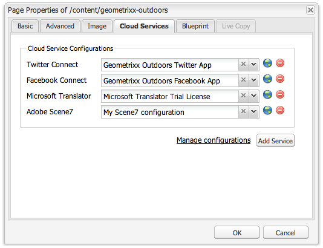

# Adicionar recursos do Scene7 à sua página{#adding-scene-features-to-your-page}

O [Adobe Scene7](https://help.adobe.com/en_US/scene7/using/WS26AB0D9A-F51C-464e-88C8-580A5A82F810.html) é uma solução hospedada para gerenciar, aprimorar, publicar e distribuir ativos de mídia avançada para a Web, dispositivos móveis, email, impressão e monitores conectados à Internet.

É possível visualizar AEM Assets publicados no Scene7 em diversos visualizadores:

* Zoom
* Flyout
* Vídeo
* Modelo de imagem
* Imagem

É possível publicar ativos digitais diretamente do AEM para o Scene7, além de publicar ativos digitais do Scene7 para o AEM.

Este documento descreve como publicar ativos digitais do AEM para o Scene7 e vice-versa. Os visualizadores também são descritos detalhadamente. Para obter informações sobre a configuração do AEM para o Scene7, consulte [Integração do Scene7 com o AEM](/help/sites-administering/scene7.md).

Consulte também [Adição de mapas de imagem](/help/assets/image-maps.md).

Para obter mais informações sobre como usar componentes de vídeo no AEM, consulte o seguinte:

* [Vídeo](/help/sites-classic-ui-authoring/manage-assets-classic-s7-video.md)

>[!NOTE]
>
>If Scene7 assets do not display properly, please make sure that Dynamic media is [disabled](/help/assets/config-dynamic.md#disabling-dynamic-media) and then refresh the page.

## Publicar manualmente no Scene7 por meio do Assets {#manually-publishing-to-scene-from-assets}

É possível publicar ativos digitais no Scene7 pelo console Assets na interface do usuário clássica ou diretamente do ativo. 

>[!NOTE]
>
>O AEM publica no Scene7 de maneira assíncrona. Depois de clicar em **Publicar**, pode levar alguns segundos para que o ativo seja publicado no Scene7.

### Publicação por meio do console Assets {#publishing-from-the-assets-console}

Para publicar no Scene7 por meio do console Assets se os ativos estiverem em uma pasta de destino do Scene7:

1. In the AEM classic UI, click **Digital Assets** to access the digital asset manager.

1. Selecione o ativo (ou ativos) ou a pasta dentro da pasta de destino que deseja publicar no Scene7, clique com o botão direito do mouse e selecione **Publicar no Scene7**. Como alternativa, você pode selecionar **Publicar no Scene7** no menu **Ferramentas**.

   

1. Vá para o Scene7 e confirme que os ativos estão disponíveis.

   >[!NOTE]
   >
   >Se os ativos não estiverem em uma pasta sincronizada do Scene7, a opção **Publicar no Scene7** nos dois menus estará visível, mas desabilitada.

### Publicar a partir de um ativo {#publishing-from-an-asset}

Para publicar manualmente um ativo, ele deve estar localizado na pasta sincronizada do Scene7.

>[!NOTE]
>
>Se o ativo não estiver na pasta sincronizada do Scene7, o link para **Publicar no Scene7** não será exibido.

Para publicar no Scene7 diretamente de um ativo digital:

1. No AEM, clique em **Ativos digitais** para acessar o gerenciador de ativos digitais.

1. Clique duas vezes para abrir um ativo.

1. No painel de detalhes do ativo, selecione **Publicar no Scene7**.

   

1. O link é alterado para **Publicando...** e, em seguida, para **Publicado**. Vá para o Scene7 e confirme que o ativo está disponível.

   >[!NOTE]
   >
   >Se o ativo não for publicado corretamente no Scene7, o link é alterado para **Falha na publicação**. Se o ativo já tiver sido publicado no Scene7, o link aparece como **Publicar novamente no Scene7**. A Republicação permite fazer alterações em um ativo no AEM e publicá-lo novamente.

### Publicar ativos de fora da pasta de destino CQ {#publishing-assets-from-outside-the-cq-target-folder}

A Adobe recomenda que você publique ativos no Scene7 somente a partir de ativos de dentro da pasta de destino do Scene7. However, if you need to upload assets from a folder outside of the target folder, you can still do that by uploading them to an **ad-hoc** folder on Scene7.

Para fazer isso, primeiro defina a configuração de Nuvem da página onde o ativo será exibido. Em seguida, adicione um componente do Scene7 à página e arraste e solte um ativo no componente. After the page properties are set for that page, a **Publish to Scene7** link appears that when selected triggers uploading to Scene7.

>[!NOTE]
>
>Os ativos que estão na pasta ad hoc não aparecem no Navegador de conteúdo do Scene7.

Para publicar ativos que residem fora da pasta de destino CQ:

1. Na interface do usuário clássica do AEM, clique em **Sites** e navegue até a página da Web à qual deseja acrescentar um ativo digital ainda não publicado no Scene7. (As regras usuais de herança de página se aplicam.)

1. No sidekick, clique no ícone **Página**, em seguida clique em **Propriedades da página**.

1. Clique em **Serviços de nuvem**, e em seguida clique em **Adicionar serviços** e selecione **Scene7**.
1. In the **Adobe Scene7** drop-down list, select the desired configuration and click **OK**.

   

1. Na página da Web, adicione um componente do Scene7 ao local desejado na página.
1. No localizador de conteúdo, arraste um ativo digital para o componente. Você verá um link para **Verificar o status de publicação do Scene7**.

   >[!NOTE]
   >
   >If the digital asset is in the CQ target folder, then no link to **Check Scene7 Publication Status** appears. Os ativos são colocados no componente.

   

1. Clique em **Verificar o status de publicação do Scene7**. Se o ativo não estiver publicado, o AEM o publica no Scene7. Depois de enviado por upload, o ativo estará localizado na pasta ad-hoc. Por padrão, a pasta ad-hoc está localizada em **name_of_the_company/CQ5_adhoc**. É possível [alterar essa configuração, se necessário](#configuringtheadhocfolder).

   >[!NOTE]
   >
   >Se o ativo não estiver em uma pasta sincronizada do Scene7 e não houver nenhuma configuração de nuvem no Scene7 associada à página atual, ocorrerá uma falha no upload.

## Componentes do Scene7 {#scene-components}

Os seguintes componentes do Scene7 estão disponíveis no AEM:

* Zoom
* Flyout (Zoom)
* Modelo de imagem
* Imagem
* Vídeo

>[!NOTE]
>
>Esses componentes não estão disponíveis por padrão e precisam ser selecionados no modo de Design antes de serem usados.

Depois que são disponibilizados no modo Design, você pode adicioná-los à sua página como qualquer outro componente do AEM. Os ativos que ainda não foram publicados no Scene7 são publicados se estiverem em uma pasta sincronizada, em uma página ou com uma configuração de nuvem do Scene7.

>[!NOTE]
>
>If you are creating and developing custom S7 viewers and using the Content Finder, you need to explicity add the **allowfullscreen** parameter.

### Aviso de fim de vida útil de visualizadores Flash {#flash-viewers-end-of-life-notice}

Em 31 de janeiro de 2017, o Adobe Scene7 descontinuará oficialmente o suporte de fim de vida para a plataforma do visualizador Flash.

Para obter mais informações sobre essa alteração importante, consulte [Perguntas frequentes sobre o fim de vida útil do visualizador Flash](https://docs.adobe.com/content/docs/pt/aem/6-1/administer/integration/marketing-cloud/scene7/flash-eol.html).

### Adicionar um componente do Scene7 a uma página {#adding-a-scene-component-to-a-page}

Adicionar um componente do Scene7 a uma página é o mesmo que adicionar um componente a qualquer página. Os componentes do Scene7 estão descritos detalhadas nas seções a seguir.

Para adicionar um componente/visualizador do Scene7 a uma página usando a interface do usuário clássica:

1. No AEM, abra a página à qual deseja adicionar o componente do Scene7.

1. Caso nenhum componente do Scene7 esteja disponível, clique na régua no sidekick para entrar no modo de **Design**, clique em **Editar** parsys, em seguida selecione todos os componentes do **Scene7** para torná-los disponíveis.

1. Return to **Edit** mode by clicking the pencil in the sidekick.

1. Arraste um componente do grupo **Scene7** no sidekick até o local desejado na página.

1. Clique em **Editar** para abrir o componente.

1. Edite o componente conforme necessário e clique em **OK** para salvar as alterações.

### Adicionar experiência de exibição interativa a um site responsivo {#adding-interactive-viewing-experiences-to-a-responsive-website}

Design responsivo para seus ativos significa que eles se adaptam dependendo de onde são exibidos. Com o design responsivo, os mesmos ativos podem ser exibidos de maneira eficaz em diversos dispositivos.

Para adicionar uma experiência de exibição interativa a um site responsivo na interface do usuário clássica:

1. Faça logon no AEM e certifique-se de que você tenha [configurado os Serviços de nuvem do Adobe Scene7](/help/sites-administering/scene7.md#configuring-scene-integration) e que os componentes do Scene7 estejam disponíveis.

   >[!NOTE]
   >
   >Se os componentes do Scene7 WCM não estiverem disponíveis, ative-os no modo Design.

1. Em um site com os componentes do Scene7 habilitados, araste um visualizador de **Imagem** até a página.
1. Edite o componente e ajuste os pontos de interrupção na guia **Configurações do Scene7**.

   

1. Verifique se os visualizadores estão sendo redimensionados de maneira adequada e de que todas as interações sejam otimizadas para desktop, tablet e dispositivo móvel.

### Configurações comuns a todos os componentes do Scene7 {#settings-common-to-all-scene-components}

Embora as opções de configuração possam variar, o seguinte é comum a todos os componentes do Scene7:

* **Referência de arquivo**: navegue até um arquivo que deseje referenciar. A referência de arquivo mostra o URL do ativo e não necessariamente todo o URL do Scene7, incluindo os comandos e parâmetros de URL. Não é possível adicionar comandos e parâmetros de URL do Scene7 nesse campo. Eles devem ser adicionados por meio da funcionalidade correspondente no componente.
* **Largura**: permite definir a largura.
* **Altura**: permite definir a altura.

Essas opções de configuração podem ser definidas abrindo (clicando duas vezes em) um componente do Scene7, por exemplo, ao abrir um componente de **Zoom**:

### Zoom {#zoom}

O componente de Zoom HTML5 exibe uma imagem maior quando você pressiona o botão +.

O ativo tem ferramentas de zoom na parte inferior. Clique em **+** para ampliar. Clique em **-** para reduzir. Clicking the **x** or the reset zoom arrow brings the image back to the original size it was imported as. Clique nas setas diagonais para abri-la em tela cheia. Clique em **Editar** para configurar o componente. With this component, you can configure [settings common to all Scene7 components](#settings-common-to-all-scene-components).

### Flyout {#flyout}

No componente do Flyout HTML5, o ativo é exibido como tela dividida; na parte à esquerda, o ativo no tamanho especificado; na parte à direita, a proporção de zoom é exibida. Clique em **Editar** para configurar o componente. With this component, you can configure [settings common to all Scene7 components](/help/sites-administering/scene7.md#settingscommontoallscene7components).

>[!NOTE]
>
>Se o seu componente do Flyout usa um tamanho personalizado, tal tamanho é usado e a configuração de componente é desabilitada.
>
>Se o componente de Flyout usar o tamanho padrão, conforme definido na visualização de design, o tamanho padrão será usado e o componente será estendido para acomodar o tamanho do layout da página com a configuração responsiva do componente ativada. Esteja ciente, no entanto, de que há uma limitação na configuração responsiva do componente. Ao usar o componente do Flyout com a configuração responsiva, você não deve usá-lo com a ampliação de página inteira. Caso contrário, o Flyout poderá se estender além da borda direita da página.

### Imagem {#image}

O componente de imagem do Scene7 permite adicionar funcionalidades do Scene7 a imagens, tais como modificadores do Scene7, predefinições de imagem ou de visualizador e nitidez. O componente de imagem do Scene7 é semelhante a outros componentes de imagem no AEM com a funcionalidade especial do Scene7. In this example, the image has the Scene7 URL modifier, **&amp;op_invert=1** applied.

**Título, Texto** alternativo Na guia Avançado, adicione um título à imagem e ao texto alternativo para os usuários que tiverem gráficos desativados.

**URL, Abrir** Você pode definir um ativo de para abrir um link. Defina o URL e, em Abrir em, indique se você deseja que ele abra na mesma janela ou em uma nova.

**Predefinição** do visualizador Selecione uma predefinição do visualizador existente no menu suspenso. Se a predefinição de visualizador que você está procurando não estiver visível, pode ser necessário torná-la visível. Consulte Gerenciar predefinições do visualizador. Não é possível selecionar uma predefinição de visualizador se você estiver usando uma predefinição de imagem e vice-versa.

**Configuração** do Scene7 Selecione a configuração do Scene7 que deseja usar para buscar predefinições de imagens ativas do SPS.

**Predefinição** de imagem Selecione uma predefinição de imagem existente no menu suspenso. Se a predefinição de imagem que você está procurando não estiver visível, pode ser necessário torná-la visível. Consulte Gerenciar predefinições de imagens. Não é possível selecionar uma predefinição de visualizador se você estiver usando uma predefinição de imagem e vice-versa.

**Formato** de saída Selecione o formato de saída da imagem, por exemplo jpeg. Dependendo do formato de saída selecionado, você pode ter opções de configuração adicionais. Consulte Práticas recomendadas de predefinição de imagem.

**Nitidez** Selecione como deseja tornar a imagem nítida. A nitidez é explicada detalhadamente em Práticas recomendadas da predefinição de imagem e Práticas recomendadas de nitidez.

**Modificadores** de URL Você pode alterar os efeitos de imagem fornecendo comandos de imagem S7 adicionais. Eles estão descritos em Predefinições de imagem e na Referência de comandos.

**Pontos de interrupção** Se o site estiver respondendo, você deseja ajustar os pontos de interrupção. Os pontos de interrupção devem ser separados por vírgulas (,).

### Modelo de imagem {#image-template}

Os [Modelos de imagem do Scene7](https://help.adobe.com/en_US/scene7/using/WS60B68844-9054-4099-BF69-3DC998A04D3C.html) são o conteúdo em camadas do Photoshop que foi importado para o Scene7, onde o conteúdo e as propriedades são parametrizados para a variação. O componente do **Modelo de imagem** permite importar imagens e alterar dinamicamente o texto no AEM. Além disso, é possível configurar o componente do **Modelo de imagem** para usar valores do contexto de cliente, de modo que cada usuário experiencie a imagem de uma maneira personalizada.

Clique em **Editar** para configurar o componente. You can configure [settings common to all Scene7 components](/help/sites-administering/scene7.md#settingscommontoallscene7components) as well as other settings described in this section.

**Referência de arquivo, Largura, Altura** Consulte as configurações comuns a todos os componentes do Scene7.

>[!NOTE]
>
>Os comandos e parâmetros de URL do Scene7 podem ser adicionados diretamente ao URL de referência de arquivo. Eles podem ser definidos somente na interface do componente no painel **Parâmetro**.

**Título, Texto** alternativo Na guia Modelo de imagem do Scene7, adicione um título à imagem e ao texto alternativo para os usuários que tiverem gráficos desativados.

**URL, Abrir** Você pode definir um ativo de para abrir um link. Defina o URL e, em Abrir em, indique se você deseja que ele abra na mesma janela ou em uma nova.

**Painel** de parâmetros Ao importar uma imagem, os parâmetros são pré-preenchidos com informações da imagem. Caso nenhum conteúdo possa ser alterado dinamicamente, essa janela fica vazia.

#### Alterar o texto dinamicamente {#changing-text-dynamically}

Para alterar o texto dinamicamente, insira o novo texto nos campos e clique em **OK**. Neste exemplo, o **Preço** agora é $50 e o frete é de 99 centavos de dólar.

O texto na imagem é alterado. É possível redefinir o texto de volta para o valor original ao clicar em **Redefinir** próximo ao campo.

#### Alterar o texto para refletir o valor de contexto do cliente {#changing-text-to-reflect-the-value-of-a-client-context-value}

To link a field to a client context value, click **Select** to open the client-context menu, select the client context, and click **OK**. Neste exemplo, o nome é alterado com base na vinculação do Nome com o nome formatado no perfil.

O texto reflete o nome do cliente conectado no momento. É possível redefinir o texto de volta para o valor original ao clicar em **Redefinir** próximo ao campo.

#### Transformar o modelo de imagem do Scene7 em um link {#making-the-scene-image-template-a-link}

Para transformar um componente do modelo de imagem do Scene7 em um link clicável:

1. Na página que contém o componente do modelo de imagem do Scene7, clique em **Editar**.
1. No campo de **URL**, insira o URL para qual os usuários são direcionados ao clicarem na imagem. No campo **Abrir em**, selecione se deseja onde o destino seja aberto (uma nova janela ou na mesma).

   

1. Clique em **OK**.

### Componente de vídeo {#video-component}

The Scene7 **Video** component (available from the Scene7 section of the sidekick) uses device and bandwidth detection to serve the right video to each screen. Este componente é um reprodutor de vídeo HTML5; é um visualizador único que pode ser usado em todos os canais.

Ele pode ser usado pra conjuntos de vídeos adaptáveis, um único vídeo MP4 ou um único vídeo F4V.

Consulte [Vídeo](/help/sites-classic-ui-authoring/manage-assets-classic-s7-video.md) para obter mais informações sobre como os vídeos funcionam com a integração do Scene7. In addition, see how [the **Scene7 video** component compares to the foundation **video** component](/help/sites-classic-ui-authoring/manage-assets-classic-s7-video.md).

### Restrições conhecidas do componente de vídeo {#known-limitations-for-the-video-component}

O Adobe DAM e o WCM mostram se um vídeo de origem primária foi carregado. Eles não mostram os ativos de proxy a seguir:

* Representações codificadas do Scene7
* Conjuntos de vídeos adaptáveis do Scene7

Ao usar um conjunto de vídeos adaptáveis com o componente de vídeo do Scene7, o componente precisará ser redimensionado para caber nas dimensões do vídeo.

## Navegador de conteúdo do Scene7 {#scene-content-browser}

O navegador de conteúdo do Scene7 permite visualizar conteúdo do Scene7 diretamente no AEM. To access the content browser, in the Content Finder, select **Scene7** in the touch-optimized user interface or the **S7** icon in the classic user interface. A funcionalidade é idêntica em ambas as interfaces do usuário.

Caso tenha diversas configurações, o AEM exibe, por padrão, a [configuração padrão](/help/sites-administering/scene7.md#configuring-a-default-configuration). É possível selecionar diferentes configurações diretamente no navegador de conteúdo do Scene7 no menu suspenso.

>[!NOTE]
>
>* Os ativos localizados na pasta ad-hoc não aparecerão no navegador de conteúdo do Scene7.
>* Quando a [Exibição segura estiver habilitada](/help/sites-administering/scene7.md#configuring-the-state-published-unpublished-of-assets-pushed-to-scene), tanto os ativos publicados quanto os não publicados no Scene7 aparecerão no navegador de conteúdo do Scene7.
>* If you do not see **Scene7** or the **S7** icon as an option in the content browser, you need to [configure Scene7 to work with AEM](/help/sites-administering/scene7.md).

   >
   >
* Para vídeo, o navegador de conteúdo do Scene7 é compatível com:
   >
   >   
   * Conjuntos de vídeos adaptáveis: contêiner de todas as representações de vídeo necessárias para uma reprodução perfeita em diversas telas
   >   * Vídeo MP4 único
   >   * Vídeo F4V único

### Procurar conteúdo {#browsing-content-in-the-classic-ui}

Pesquise conteúdo no Scene7 ao clicar na guia **S7**.

Para alterar a configuração que você estiver acessando, selecione a configuração. As pastas são alteradas de acordo com a configuração que for selecionada.

Da mesma maneira que você faz com o localizador de conteúdo do Assets, é possível pesquisar por ativos e filtrar resultados. Contudo, diferente do localizador do Assets, ao inserir uma palavra-chave na guia **S7**, o nome de arquivo **começa com** a sequência de caracteres inserida, em vez de **conter** a palavra-chave no nome.

Por padrão, os ativos são exibidos por nome de arquivo. Além disso, é possível filtrar resultados por tipo de ativo.

>[!NOTE]
>
>Para vídeo, o navegador de conteúdo de Scene7 do WCM é compatível com:
>
>* Conjuntos de vídeos adaptáveis: contêiner de todas as representações de vídeo necessárias para uma reprodução perfeita em diversas telas
>* Vídeo MP4 único
>* Vídeo F4V único

>

### Pesquisar ativos do Scene7 com o navegador de conteúdo {#searching-for-scene-assets-with-the-content-browser}

Pesquisar ativos do Scene7 é semelhante a pesquisar ativos do AEM, exceto que quando você pesquisa, na verdade você está vendo uma visualização remota dos ativos no sistema Scene7, em vez de importá-los diretamente para o AEM.

É possível usar a interface do usuário clássica ou a otimizada para toque para visualizar e pesquisar ativos. Dependendo da interface, a maneira como você pesquisa é levemente diferente.

Ao pesquisar em qualquer uma das interfaces de usuário, você pode filtrar pelos seguintes critérios (mostrados aqui na interface otimizada para toque):

**Digite palavras-chave** Você pode pesquisar ativos por nome. Ao pesquisar, as palavras-chave inseridas corresponderão às palavras com as quais o nome de arquivo come. Por exemplo, digitar a palavra “nadar” pesquisaria todos os nomes de arquivo de ativo que comecem com as letras nessa ordem. Não se esqueça de clicar em Enter depois de digitar o termo para encontrar o ativo.

**Pasta/caminho** O nome da pasta que aparece é baseado na configuração selecionada. Para fazer uma busca detalhada, clique no ícone de pasta e selecione uma subpasta, em seguida clique na marca de seleção para selecioná-la.

Se você inserir uma palavra-chave e selecionar uma pasta, o AEM procura nessa pasta e em todas as subpastas. No entanto, se você não digitar nenhuma palavra-chave ao pesquisar, selecionar a pasta exibirá somente os ativos nessa pasta e não incluirá nenhuma subpasta.

Por padrão, o AEM procura na pasta selecionada e em todas as subpastas.

**Tipo de ativo** Selecione Scene7 para navegar pelo conteúdo do Scene7. Essa opção estará disponível somente se o Scene7 tiver sido configurado.

**Configuração** Se você tiver mais de uma configuração Scene7 definida em Cloud Service, poderá selecioná-la aqui. Como resultado, a pasta será alterada com base na configuração escolhida.

**Tipo** de ativo No navegador Scene7, você pode filtrar os resultados para incluir qualquer um dos seguintes: imagens, modelos, vídeos e conjuntos de vídeo adaptáveis. Se você não selecionar nenhum tipo de ativo, o AEM procura todos os tipos de ativo por padrão.

>[!NOTE]
>
>* Na interface do usuário clássica, também é possível procurar pelo **Flash** e pelo **FXG**. A filtragem para eles na interface otimizada para toque não é compatível atualmente.
   >
   >
* Ao pesquisar por vídeo, você estará procurando uma única representação. Os resultados retornam a representação original (apenas *.mp4) e a reprodução codificada.
* Ao pesquisar um conjunto de vídeos adaptáveis, você está pesquisando a pasta e todas as subpastas, mas somente se tiver adicionado uma palavra-chave à pesquisa. Caso não tenha adicionado uma palavra-chave, o AEM não pesquisará nas subpastas.

**Status** da publicação Você pode filtrar ativos com base no status da publicação: Não publicado ou publicado. Se não selecionar um status Publicado, o AEM procura todos os status de publicação por padrão.

