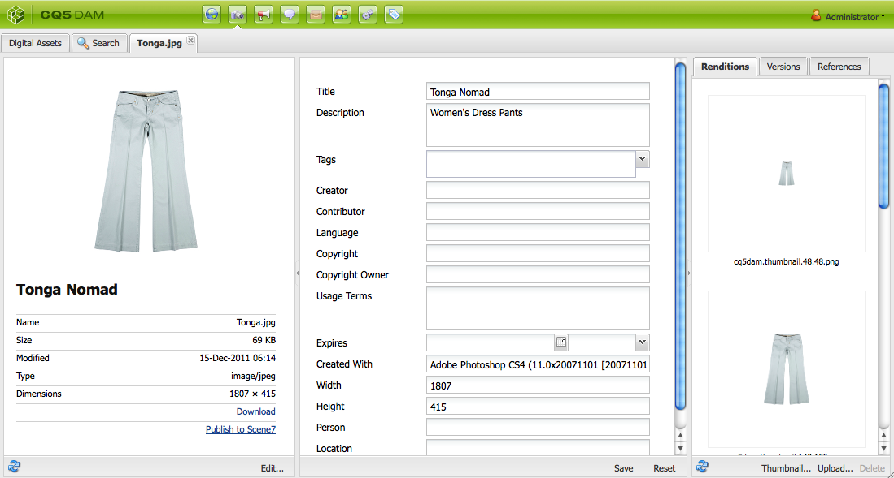
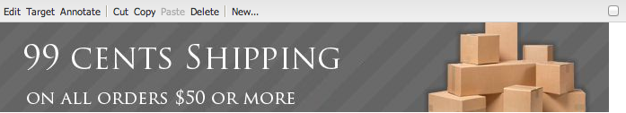
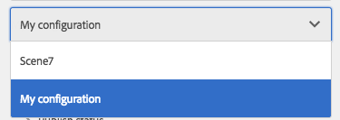

# Adicionar recursos do Dynamic Media Classic (Scene7) à sua página{#adding-scene-features-to-your-page}

[Adobe Dynamic Media Classic (Scene7)](https://experienceleague.adobe.com/docs/dynamic-media-classic/using/home.html) O é uma solução hospedada para gerenciar, aprimorar, publicar e fornecer ativos de mídia avançada para Web, dispositivos móveis, email, impressão e monitores conectados à Internet.

Você pode visualizar ativos do Experience Manager publicados no Dynamic Media Classic (Scene7) em vários visualizadores:

* Zoom
* Flyout
* Vídeo
* Modelo de imagem
* Imagem

Você pode publicar ativos digitais diretamente do Experience Manager para o Dynamic Media Classic (Scene7) e pode publicar ativos digitais do Dynamic Media Classic (Scene7) para o Experience Manager.

Este documento descreve como publicar ativos digitais do Experience Manager para o Dynamic Media Classic (Scene7) e vice-versa. Os visualizadores também são descritos detalhadamente. Para obter informações sobre como configurar o Experience Manager para Dynamic Media Classic (Scene7), consulte [Integração do Dynamic Media Classic (Scene7) com o Experience Manager](/help/sites-administering/scene7.md).

Consulte também [Adicionar mapas de imagem](/help/assets/image-maps.md).

Para obter mais informações sobre o uso de componentes de vídeo com o Experience Manager, consulte o seguinte:

* [Vídeo](/help/sites-classic-ui-authoring/manage-assets-classic-s7-video.md)

>[!NOTE]
>
>Se os ativos do Dynamic Media Classic (Scene7) não forem exibidos corretamente, verifique se o Dynamic Media é [desativado](/help/assets/config-dynamic.md#disabling-dynamic-media) e, em seguida, atualize a página.

## Publicar manualmente no Dynamic Media Classic (Scene7) a partir de ativos {#manually-publishing-to-scene-from-assets}

Você pode publicar ativos digitais no Dynamic Media Classic (Scene7) no console Assets na interface clássica ou diretamente do ativo.

>[!NOTE]
>
>O Experience Manager publica de forma assíncrona no Dynamic Media Classic (Scene7). Após selecionar **[!UICONTROL Publicar]**, pode levar vários segundos para que o ativo seja publicado no Dynamic Media Classic (Scene7).

### Publicação por meio do console Assets {#publishing-from-the-assets-console}

Você pode publicar no Dynamic Media Classic (Scene7) no console Assets se os ativos estiverem em uma pasta de destino Dynamic Media Classic (Scene7).

1. Na interface do usuário do Experience Manager Classic, selecione **[!UICONTROL Ativos digitais]** para acessar o gerenciador de ativos digitais.

1. Selecione o ativo (ou ativos) ou a pasta na pasta de destino que deseja publicar no Dynamic Media Classic (Scene7), clique com o botão direito do mouse e selecione **[!UICONTROL Publicar no Dynamic Media Classic (Scene7)]**. Como alternativa, você pode selecionar **[!UICONTROL Publicar no Dynamic Media Classic (Scene7)]** do **[!UICONTROL Ferramentas]** menu.

   

1. Vá para o Dynamic Media Classic (Scene7) e confirme se os ativos estão disponíveis.

   >[!NOTE]
   >
   >Se os ativos não estiverem em uma pasta sincronizada do Dynamic Media Classic (Scene7), **[!UICONTROL Publicar no Dynamic Media Classic (Scene7)]** em ambos os menus é visível, mas desativado.

### Publicar de um ativo {#publishing-from-an-asset}

Você pode publicar manualmente um ativo, desde que ele esteja localizado na pasta sincronizada do Dynamic Media Classic (Scene7).

>[!NOTE]
>
>Se o ativo não estiver na pasta sincronizada do Dynamic Media Classic (Scene7), o link para **[!UICONTROL Publicar no Dynamic Media Classic (Scene7)]** não é exibida.

Para publicar no Dynamic Media Classic (Scene7) diretamente de um ativo digital:

1. No Experience Manager, selecione **[!UICONTROL Ativos digitais]** para acessar o gerenciador de ativos digitais.

1. Clique duas vezes para abrir um ativo.

1. No painel de detalhes do ativo, selecione **[!UICONTROL Publicar no Dynamic Media Classic (Scene7)]**.

   

1. O link é alterado para **[!UICONTROL Publicando...]** e, em seguida, para **[!UICONTROL Publicado]**. Vá para o Dynamic Media Classic (Scene7) e confirme se o ativo está disponível.

   >[!NOTE]
   >
   >Se o ativo não for publicado corretamente no Dynamic Media Classic (Scene7), o link será alterado para **[!UICONTROL Falha na publicação]**. Se o ativo já tiver sido publicado no Dynamic Media Classic (Scene7), o link exibirá **[!UICONTROL Publicar novamente no Dynamic Media Classic (Scene7)]**. A republicação permite alterar ativos no Experience Manager e republicá-los.

### Publicar ativos de fora da pasta de destino CQ {#publishing-assets-from-outside-the-cq-target-folder}

O Adobe recomenda publicar ativos no Dynamic Media Classic (Scene7) somente a partir de ativos na pasta de destino do Dynamic Media Classic (Scene7). No entanto, se você precisar fazer upload de ativos de uma pasta fora da pasta de destino, ainda poderá fazer isso carregando-os em uma pasta sob demanda no Dynamic Media Classic (Scene7). Primeiro, configure a Configuração da nuvem para a página em que você deseja que o ativo seja exibido. Em seguida, adicione um componente Dynamic Media Classic (Scene7) à página e arraste e solte um ativo no componente. Depois que as propriedades da página forem definidas para essa página, uma **[!UICONTROL Publicar no Dynamic Media Classic (Scene7)]** é exibido que, quando selecionado, aciona o upload para o Dynamic Media Classic (Scene7).

>[!NOTE]
>
>Os ativos que estão na pasta sob demanda não aparecem no Navegador de conteúdo da Dynamic Media Classic (Scene7).

**Para publicar ativos de fora da pasta de destino CQ:**

1. No Experience Manager na interface clássica, selecione **[!UICONTROL Sites]** e navegue até a página da Web à qual deseja adicionar um ativo digital que ainda não foi publicado no Dynamic Media Classic (Scene7). (As regras usuais de herança de página se aplicam.)

1. No sidekick, selecione o **[!UICONTROL Página]** e selecione **[!UICONTROL Propriedades da página]**.

1. Selecionar **[!UICONTROL Cloud Services]**.
1. Selecionar **[!UICONTROL Adicionar serviços]**.
1. Selecionar **[!UICONTROL Dynamic Media Classic (Scene7)]**.
1. No **[!UICONTROL Adobe Dynamic Media Classic (Scene7)]** , selecione a configuração desejada e selecione **[!UICONTROL OK]**.

   

1. Na página da Web, adicione um componente Dynamic Media Classic (Scene7) ao local desejado na página.
1. No localizador de conteúdo, arraste um ativo digital para o componente. Você verá um link para **[!UICONTROL Verificar o status de publicação do Dynamic Media Classic (Scene7)]**.

   >[!NOTE]
   >
   >Se o ativo digital estiver na pasta de destino CQ, nenhum link para **[!UICONTROL Verificar o status de publicação do Dynamic Media Classic (Scene7)]** é exibido. Os ativos são colocados no componente.

   

1. Selecionar **[!UICONTROL Verificar o status de publicação do Dynamic Media Classic (Scene7)]**. Se os ativos não forem publicados, o Experience Manager publica o ativo no Dynamic Media Classic (Scene7). Após ser carregado, o ativo é encontrado na pasta sob demanda. Por padrão, a pasta sob demanda está na **[!UICONTROL name_of_the_company/CQ5_adhoc]**. Você pode [configurar a pasta sob demanda, se necessário](#configuringtheadhocfolder).

   >[!NOTE]
   >
   >Se o ativo não estiver em uma pasta sincronizada do Dynamic Media Classic (Scene7) e não houver nenhuma configuração de nuvem do Dynamic Media Classic (Scene7) associada à página atual, o upload falhará.

## Componentes do Dynamic Media Classic (Scene7) {#scene-components}

Os seguintes componentes do Dynamic Media Classic (Scene7) estão disponíveis no Experience Manager:

* Zoom
* Flyout (Zoom)
* Modelo de imagem
* Imagem
* Vídeo

>[!NOTE]
>
>Esses componentes não estão disponíveis por padrão e devem ser selecionados no modo Design antes de serem usados.

Depois que eles forem disponibilizados no modo Design, você poderá adicionar os componentes à sua página como qualquer outro componente do Experience Manager. Os ativos que ainda não foram publicados no Dynamic Media Classic (Scene7) são publicados no Dynamic Media Classic (Scene7) se estiverem em uma pasta sincronizada, em uma página ou com uma Configuração da nuvem do Dynamic Media Classic (Scene7).

>[!NOTE]
>
>Se você estiver criando e desenvolvendo visualizadores personalizados do S7 e usando o Localizador de conteúdo, deverá adicionar explicitamente a variável `allowfullscreen` parâmetro.

### Aviso de fim de vida útil de visualizadores Flash {#flash-viewers-end-of-life-notice}

A partir de 31 de janeiro de 2017, o Adobe Dynamic Media Classic (Scene7) encerrou oficialmente o suporte para a plataforma do visualizador de Flashes.

### Adicionar um componente do Dynamic Media Classic (Scene7) a uma página {#adding-a-scene-component-to-a-page}

Adicionar um componente do Dynamic Media Classic (Scene7) a uma página é o mesmo que adicionar um componente a qualquer página. Os componentes do Dynamic Media Classic (Scene7) são descritos detalhadamente nas seções a seguir.

Para adicionar um componente/visualizador do Dynamic Media Classic (Scene7) a uma página na interface clássica:

1. No Experience Manager, abra a página à qual deseja adicionar o componente Dynamic Media Classic (Scene7).

1. Se nenhum componente do Dynamic Media Classic (Scene7) estiver disponível, selecione a régua no sidekick a ser inserida **Design** modo , selecione **[!UICONTROL Editar]** parsys e selecione todas as **[!UICONTROL Dynamic Media Classic (Scene7)]** componentes para disponibilizá-los.

1. Retornar para **Editar** selecionando o lápis no sidekick.

1. Arraste um componente do **[!UICONTROL Dynamic Media Classic (Scene7)]** no sidekick até a página no local desejado.

1. Selecione ***[!UICONTROL Editar]** para que você possa abrir o componente.

1. Edite o componente conforme necessário e selecione **[!UICONTROL OK]** para salvar as alterações.

### Adicionar experiências de visualização interativas a um site responsivo {#adding-interactive-viewing-experiences-to-a-responsive-website}

Design responsivo para seus ativos significa que eles se adaptam dependendo de onde são exibidos. Com o design responsivo, os mesmos ativos podem ser exibidos de maneira eficaz em diversos dispositivos.

Para adicionar uma experiência de exibição interativa a um site responsivo na interface do usuário clássica:

1. Faça logon no Experience Manager e verifique se você [Cloud Services configurados do Adobe Dynamic Media Classic (Scene7)](/help/sites-administering/scene7.md#configuring-scene-integration) e que os componentes do Dynamic Media Classic (Scene7) estão disponíveis.

   >[!NOTE]
   >
   >Se os componentes WCM do Dynamic Media Classic (Scene7) não estiverem disponíveis, certifique-se de ativá-los por meio do modo Design.

1. Em um site com os componentes do Dynamic Media Classic (Scene7) ativados, arraste um **[!UICONTROL Imagem]** para a página.
1. Edite o componente e ajuste os pontos de interrupção no **[!UICONTROL Configurações do Dynamic Media Classic (Scene7)]** guia .

   

1. Verifique se os visualizadores estão sendo redimensionados de maneira adequada e de que todas as interações sejam otimizadas para desktop, tablet e dispositivo móvel.

### Configurações comuns a todos os componentes do Dynamic Media Classic (Scene7) {#settings-common-to-all-scene-components}

Embora as opções de configuração variem, as seguintes são comuns a todos os componentes do Dynamic Media Classic (Scene7):

* **Referência de arquivo**: navegue até um arquivo que deseje referenciar. A referência de arquivo mostra o URL do ativo e não necessariamente o URL completo do Dynamic Media Classic (Scene7), incluindo os comandos e parâmetros de URL. Não é possível adicionar comandos e parâmetros de URL do Dynamic Media Classic (Scene7) neste campo. Em vez disso, eles devem ser adicionados por meio da funcionalidade correspondente no componente.
* **Largura**: permite definir a largura.
* **Altura**: permite definir a altura.

Essas opções de configuração são definidas abrindo (clicando duas vezes em) um componente do Dynamic Media Classic (Scene7), por exemplo, ao abrir um **Zoom** componente:

### Zoom {#zoom}

O componente de Zoom HTML5 exibe uma imagem maior quando você pressiona o botão +.

O ativo tem ferramentas de zoom na parte inferior. Selecionar **[!UICONTROL +]** para aumentar. Selecionar **[!UICONTROL -]** para reduzir. Selecionar o **[!UICONTROL x]** ou a seta de redefinição de zoom traz a imagem de volta ao tamanho original de importação. Selecione as setas diagonais para poder torná-las em tela cheia. Selecionar **[!UICONTROL Editar]** para que você possa configurar o componente. Com esse componente, você pode configurar [configurações comuns a todos os componentes do Dynamic Media Classic (Scene7)](#settings-common-to-all-scene-components).

### Flyout {#flyout}

No componente do Flyout HTML5, o ativo é exibido como tela dividida; na parte à esquerda, o ativo no tamanho especificado; na parte à direita, a proporção de zoom é exibida. Selecionar **[!UICONTROL Editar]** para que você possa configurar o componente. Com esse componente, você pode configurar [configurações comuns a todos os componentes do Dynamic Media Classic (Scene7)](/help/sites-administering/scene7.md#settingscommontoallscene7components).

>[!NOTE]
>
>Se o seu componente do Flyout usa um tamanho personalizado, tal tamanho é usado e a configuração de componente é desabilitada.
>
>Se o seu componente do Flyout usar o tamanho padrão, conforme definido na visualização Design, o tamanho padrão será usado. O componente é estendido para acomodar o tamanho do layout da página com a configuração responsiva do componente habilitado. Esteja ciente, no entanto, de que há uma limitação na configuração responsiva do componente. Ao usar o componente do Flyout com configuração responsiva, você não deve usá-lo com o trecho de página completo. Caso contrário, o Flyout poderá se estender além da borda direita da página.

### Imagem {#image}

O componente Imagem do Dynamic Media Classic (Scene7) permite adicionar a funcionalidade Dynamic Media Classic (Scene7) às imagens, como modificadores do Dynamic Media Classic (Scene7), predefinições de imagem ou visualizador e nitidez. O componente de imagem da Dynamic Media Classic (Scene7) é semelhante a outros componentes de imagem no Experience Manager com a funcionalidade especial Dynamic Media Classic (Scene7). Neste exemplo, a imagem tem o modificador de URL da Dynamic Media Classic (Scene7), `&op_invert=1` aplicada.

**Título, Texto alternativo** - Na guia Advanced , adicione um título à imagem e um texto alternativo para os usuários que tenham os gráficos desativados.

**URL, Abrir em** - É possível definir um ativo de para abrir um link. Defina o URL e, em Abrir em, indique se você deseja que ele abra na mesma janela ou em uma nova.

**Predefinição do visualizador** - Selecione uma predefinição de visualizador existente no menu suspenso. Se a predefinição do visualizador que você está procurando não estiver visível, você deve torná-la visível. Consulte Gerenciar predefinições do visualizador. Não é possível selecionar uma predefinição do visualizador se você estiver usando uma predefinição de imagem e vice-versa.

**Configuração do Dynamic Media Classic (Scene7)** - Selecione a configuração do Dynamic Media Classic (Scene7) que deseja usar para buscar predefinições de imagens ativas do SPS.

**Predefinição de imagem** - Selecione uma predefinição de imagem existente no menu suspenso. Se a predefinição de imagem que você está procurando não estiver visível, você deve torná-la visível. Consulte Gerenciar predefinições de imagens. Não é possível selecionar uma predefinição do visualizador se você estiver usando uma predefinição de imagem e vice-versa.

**Formato de saída** - Selecione o formato de saída da imagem, por exemplo jpeg. Dependendo do formato de saída selecionado, você pode ter opções de configuração adicionais. Consulte Práticas recomendadas de predefinição de imagem.

**Nitidez** - Selecione como deseja ajustar a nitidez da imagem. A nitidez é explicada detalhadamente em Práticas recomendadas da predefinição de imagem e Práticas recomendadas de nitidez.

**Modificadores de URL** - Você pode alterar os efeitos da imagem fornecendo comandos adicionais de imagem do S7. Esses comandos são descritos em Predefinições de imagem e na referência de Comando.

**Pontos de interrupção** - Se o seu site for responsivo, você deseja ajustar os pontos de interrupção. Os pontos de interrupção devem ser separados por vírgulas (,).

### Modelo de imagem {#image-template}

Os Modelos de imagem do Dynamic Media Classic (Scene7) são conteúdos em camadas do Photoshop que foram importados para o Dynamic Media Classic (Scene7), onde o conteúdo e as propriedades foram parametrizadas para oferecer variabilidade. O **[!UICONTROL Modelo de imagem]** permite importar imagens e alterar o texto dinamicamente no Experience Manager. Além disso, é possível configurar o componente do **[!UICONTROL Modelo de imagem]** para usar valores do contexto de cliente, de modo que cada usuário experiencie a imagem de uma maneira personalizada.

Selecionar **[!UICONTROL Editar]** - para configurar o componente. Você pode configurar [configurações comuns a todos os componentes do Dynamic Media Classic (Scene7)](/help/sites-administering/scene7.md#settingscommontoallscene7components) e outras configurações descritas nesta seção.

**Referência de arquivo, Largura, Altura** - Consulte [configurações comuns a todos os componentes do Dynamic Media Classic (Scene7)](/help/sites-administering/scene7.md#settingscommontoallscene7components).

>[!NOTE]
>
>Comandos e parâmetros de URL do Dynamic Media Classic (Scene7) não podem ser adicionados diretamente ao URL de referência de arquivo. Eles podem ser definidos somente na interface do componente no painel **[!UICONTROL Parâmetro]**.

**Título, Texto alternativo** - Na guia Modelo de imagem do Dynamic Media Classic (Scene7) , adicione um título à imagem e um texto alternativo para os usuários que tenham os gráficos desativados.

**URL, Abrir em** - É possível definir um ativo de para abrir um link. Defina o URL e, em Abrir em, indique se você deseja que ele abra na mesma janela ou em uma nova.

**Painel de parâmetros** - Ao importar uma imagem, os parâmetros são preenchidos previamente com informações da imagem. Caso nenhum conteúdo possa ser alterado dinamicamente, essa janela fica vazia.

#### Alterar o texto dinamicamente {#changing-text-dynamically}

Para alterar o texto dinamicamente, insira o novo texto nos campos e selecione **[!UICONTROL OK]**. Neste exemplo, o **Preço** agora é $50 e o frete é de 99 centavos de dólar.

O texto na imagem é alterado. Você pode redefinir o texto de volta para o valor original selecionando **[!UICONTROL Redefinir]** ao lado do campo .

#### Alterar texto para refletir o valor de contexto do cliente {#changing-text-to-reflect-the-value-of-a-client-context-value}

Para vincular um campo a um valor de contexto de cliente, selecione **[!UICONTROL Selecionar]** para abrir o menu de contexto do cliente, selecione o contexto do cliente e selecione **[!UICONTROL OK]**. Neste exemplo, o nome é alterado com base na vinculação do Nome com o nome formatado no perfil.

O texto reflete o nome do cliente conectado no momento. Você pode redefinir o texto de volta para o valor original selecionando **[!UICONTROL Redefinir]** ao lado do campo .

#### Transformar o modelo de imagem do Dynamic Media Classic (Scene7) em um link {#making-the-scene-image-template-a-link}

Você pode tornar o componente de modelo de imagem do Dynamic Media Classic (Scene7) um link clicável.

1. Na página com o componente de modelo de imagem do Dynamic Media Classic (Scene7), selecione **[!UICONTROL Editar]**.
1. No campo de **[!UICONTROL URL]**, insira o URL para qual os usuários são direcionados ao clicarem na imagem. No campo **[!UICONTROL Abrir em]**, selecione se deseja onde o destino seja aberto (uma nova janela ou na mesma).

   

1. Selecionar **[!UICONTROL OK]**.

### Componente de vídeo {#video-component}

A Dynamic Media Classic (Scene7) **[!UICONTROL Vídeo]** componente (disponível na seção Dynamic Media Classic (Scene7) do sidekick) usa a detecção de dispositivo e de largura de banda para veicular o vídeo correto em cada tela. Este componente é um reprodutor de vídeo HTML5; é um visualizador único que pode ser usado em todos os canais.

Ele pode ser usado pra conjuntos de vídeos adaptáveis, um único vídeo MP4 ou um único vídeo F4V.

Consulte [Vídeo](/help/sites-classic-ui-authoring/manage-assets-classic-s7-video.md) para obter mais informações sobre como os vídeos funcionam com a integração do Dynamic Media Classic (Scene7). Além disso, veja como [o **Vídeo do Dynamic Media Classic (Scene7)** componente compara com a base **vídeo** componente](/help/sites-classic-ui-authoring/manage-assets-classic-s7-video.md).

### Restrições conhecidas do componente de vídeo {#known-limitations-for-the-video-component}

O Adobe DAM e o WCM mostram se um vídeo de origem primária é carregado. Eles não mostram os ativos de proxy a seguir:

* Representações codificadas do Dynamic Media Classic (Scene7)
* Conjuntos de vídeo adaptáveis Dynamic Media Classic (Scene7)

Ao usar um conjunto de vídeos adaptáveis com o componente de vídeo do Dynamic Media Classic (Scene7), o componente deve ser redimensionado para caber nas dimensões do vídeo.

## Navegador de conteúdo do Dynamic Media Classic (Scene7) {#scene-content-browser}

O navegador de conteúdo do Dynamic Media Classic (Scene7) permite exibir o conteúdo do Dynamic Media Classic (Scene7) diretamente no Experience Manager. Para acessar o navegador de conteúdo, no Localizador de conteúdo, selecione **Dynamic Media Classic (Scene7)** na interface otimizada para toque ou na **S7** na interface do usuário clássica. A funcionalidade é idêntica em ambas as interfaces do usuário.

Se você tiver várias configurações, o Experience Manager por padrão exibirá a variável [configuração padrão](/help/sites-administering/scene7.md#configuring-a-default-configuration). Você pode selecionar configurações diferentes diretamente no navegador de conteúdo do Dynamic Media Classic (Scene7) no menu suspenso.

>[!NOTE]
>
>* Os ativos na pasta sob demanda não aparecem no navegador de conteúdo do Dynamic Media Classic (Scene7).
>* When [A Visualização segura está ativada](/help/sites-administering/scene7.md#configuring-the-state-published-unpublished-of-assets-pushed-to-scene), os ativos publicados e não publicados no Dynamic Media Classic (Scene7) são exibidos no navegador de conteúdo do Dynamic Media Classic (Scene7).
>* Se você não vir **[!UICONTROL Dynamic Media Classic (Scene7)]** ou **[!UICONTROL S7]** como uma opção no navegador de conteúdo, você deve [configurar o Dynamic Media Classic (Scene7) para funcionar com o Experience Manager](/help/sites-administering/scene7.md).
>* Para vídeo, o navegador de conteúdo do Dynamic Media Classic (Scene7) é compatível com:
   >   * Conjuntos de vídeos adaptáveis: contêiner de todas as representações de vídeo necessárias para uma reprodução perfeita em diversas telas
   >   * Vídeo MP4 único
   >   * Vídeo F4V único

### Procurar conteúdo {#browsing-content-in-the-classic-ui}

Navegue pelo conteúdo no Dynamic Media Classic (Scene7) selecionando o **[!UICONTROL S7]** guia .

Você pode alterar a configuração que está acessando selecionando a configuração . As pastas mudam, dependendo da configuração selecionada.

Da mesma maneira que você faz com o localizador de conteúdo do Assets, é possível pesquisar por ativos e filtrar resultados. Contudo, diferente do localizador do Assets, ao inserir uma palavra-chave na guia **S7**, o nome de arquivo **começa com** a sequência de caracteres inserida, em vez de **conter** a palavra-chave no nome.

Por padrão, os ativos são exibidos por nome de arquivo. No entanto, também é possível filtrar os resultados por tipo de ativo.

>[!NOTE]
>
>Para vídeo, o navegador de conteúdo do Dynamic Media Classic (Scene7) do WCM é compatível com:
>
>* Conjuntos de vídeos adaptáveis: contêiner de todas as representações de vídeo necessárias para uma reprodução perfeita em diversas telas
>* Vídeo MP4 único
>* Vídeo F4V único
>

### Pesquise ativos do Dynamic Media Classic (Scene7) com o navegador de conteúdo {#searching-for-scene-assets-with-the-content-browser}

Pesquisar ativos do Dynamic Media Classic (Scene7) é semelhante a pesquisar ativos do Experience Manager. A exceção é que, ao pesquisar, você está vendo uma visualização remota dos ativos no sistema Dynamic Media Classic (Scene7), em vez de importá-los diretamente para o Experience Manager.

É possível usar a interface do usuário clássica ou a otimizada para toque para visualizar e pesquisar ativos. Dependendo da interface, a maneira como você pesquisa é levemente diferente.

Ao pesquisar em qualquer uma das interfaces de usuário, você pode filtrar pelos seguintes critérios (mostrados aqui na interface otimizada para toque):

**Inserir palavras-chave** - Você pode pesquisar ativos por nome. Ao pesquisar as palavras-chave, você digita é com o que o nome do arquivo começa. Por exemplo, digitar a palavra “nadar” pesquisaria todos os nomes de arquivo de ativo que comecem com as letras nessa ordem. Certifique-se de selecionar Enter depois de digitar o termo para localizar o ativo.

**Pasta/caminho** - O nome da pasta é baseado na configuração selecionada. É possível detalhar para níveis inferiores selecionando o ícone de pasta e selecionando uma subpasta. Em seguida, marque a marca de seleção para selecioná-la.

Se você inserir uma palavra-chave e selecionar uma pasta, o Experience Manager pesquisará essa pasta e quaisquer subpastas. No entanto, se você não inserir nenhuma palavra-chave ao pesquisar, selecionar a pasta somente mostrará os ativos nessa pasta e não incluirá nenhuma subpasta.

Por padrão, o Experience Manager pesquisa a pasta selecionada e todas as subpastas.

**Tipo de ativo** - Selecione Dynamic Media Classic (Scene7) para navegar pelo conteúdo do Dynamic Media Classic (Scene7). Essa opção só estará disponível se o Dynamic Media Classic (Scene7) tiver sido configurado.

**Configuração** - Se você tiver mais de uma configuração do Dynamic Media Classic (Scene7) definida no Cloud Services, poderá selecioná-la aqui. Como resultado, a pasta muda com base na configuração escolhida.

**Tipo de ativo** - No navegador Dynamic Media Classic (Scene7), é possível filtrar os resultados para incluir qualquer um dos seguintes itens: imagens, modelos, vídeos e conjuntos de vídeos adaptáveis. Se você não selecionar nenhum tipo de ativo, o Experience Manager, por padrão, pesquisa todos os tipos de ativos.

>[!NOTE]
>
>* Na interface do usuário clássica, também é possível procurar pelo **Flash** e pelo **FXG**. Não há suporte para a filtragem desses dois termos na interface otimizada para toque.
>
>* Ao pesquisar por vídeo, você estará procurando uma única representação. Os resultados retornam a representação original (somente &#42;.mp4) e a representação codificada.
>* Ao pesquisar um conjunto de vídeos adaptáveis, você está pesquisando a pasta e todas as subpastas, mas somente se tiver adicionado uma palavra-chave à pesquisa. Se você não tiver adicionado uma palavra-chave, o Experience Manager não pesquisará nas subpastas.
>

**Publicar status** - Você pode filtrar por ativos com base no status da publicação: Não publicado ou publicado. Se você não selecionar nenhum Status de publicação, o Experience Manager, por padrão, pesquisa todos os status de publicação.

