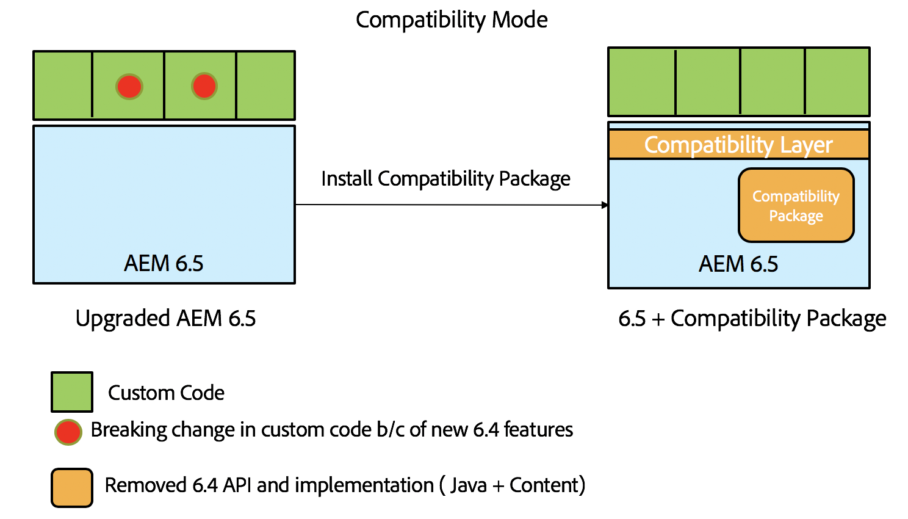

# Compatibilidade com versões anteriores no AEM 6.5{#backward-compatibility-in-aem}

## Visão geral {#overview}

>[!NOTE]
>
>Para obter uma lista de alterações de conteúdo e configuração que não estejam no escopo do Pacote de compatibilidade, consulte [Reestruturação do repositório em AEM](/help/sites-deploying/repository-restructuring.md).

No AEM 6.5, todos os recursos foram desenvolvidos tendo em mente a compatibilidade com versões anteriores.

Na maioria dos casos, os clientes que executam o AEM 6.3 não precisam alterar o código ou as personalizações ao fazer a atualização. Para clientes AEM 6.1 e 6.2, não há alterações adicionais de quebra que as que ocorreriam durante uma atualização para a versão 6.3.

Para obter exceções onde os recursos não puderam ser mantidos com compatibilidade retroativa, problemas de incompatibilidade retroativa para pacotes e conteúdo podem ser atenuados pela instalação de um Pacote de compatibilidade para a versão 6.4 (consulte como configurar abaixo para obter detalhes sobre onde baixar). Este pacote de componentes ajudará a restaurar a compatibilidade na maioria dos casos para aplicativos compatíveis com o AEM 6.4.

O Pacote de compatibilidade permite executar AEM no modo de compatibilidade e adiar o desenvolvimento personalizado em relação aos novos recursos AEM:

>[!NOTE]
>
>Observe que o pacote de compatibilidade é apenas uma solução temporária para adiar o desenvolvimento necessário para ser compatível com AEM 6.5, recomendável somente como uma última opção se você não puder resolver problemas de compatibilidade por meio do desenvolvimento imediatamente após a atualização. É altamente recomendável alternar para o modo nativo e desinstalar o pacote de compatibilidade depois que você decidir continuar com o desenvolvimento personalizado com base no 6.5 e utilizar a funcionalidade 6.5 completa.

O Pacote de compatibilidade tem dois modos: **Roteamento Ativado** e **Roteamento Desativado**.

Isso permite que AEM 6.5 seja executado em três modos:

**Modo nativo:**

O modo nativo é para clientes que desejam usar todos os novos recursos do AEM 6.5 e estão prontos para fazer algum desenvolvimento para que suas personalizações funcionem com todos os novos recursos.

Isso significa que talvez seja necessário fazer ajustes no aplicativo imediatamente após a atualização.

**Modo de compatibilidade: Pacote de compatibilidade instalado com o Roteamento ativado**

O Modo de compatibilidade é para clientes que têm personalizações de interfaces que não são compatíveis com versões anteriores. Isso permite que AEM seja executado no modo de compatibilidade e adiar o desenvolvimento personalizado necessário em relação aos novos recursos AEM que não são compatíveis com alguns de seus códigos personalizados.

**Modo herdado: Pacote de compatibilidade instalado com o Roteamento desativado**

O modo herdado é para clientes que têm interfaces personalizadas baseadas em código herdado ou obsoleto de AEM que foram movidos para fora no pacote de compatibilidade.

## Como configurar {#how-to-set-up}

O Pacote de compatibilidade AEM 6.3 pode ser instalado como um pacote usando o Gerenciador de pacotes. Você pode baixar o [AEM Pacote de compatibilidade 6.3 do site de Distribuição de software](https://experience.adobe.com/#/downloads/content/software-distribution/en/aem.html?package=/content/software-distribution/en/details.html/content/dam/aem/public/adobe/packages/cq640/compatpack/aem-compat-cq64-to-cq63).

Quando o Pacote de compatibilidade estiver instalado, o roteamento poderá ser ativado ou desativado usando um comutador na configuração OSGI, como mostrado abaixo:

Quando o Pacote de compatibilidade estiver instalado e configurado, os recursos serão usados com base no modo de compatibilidade escolhido.
