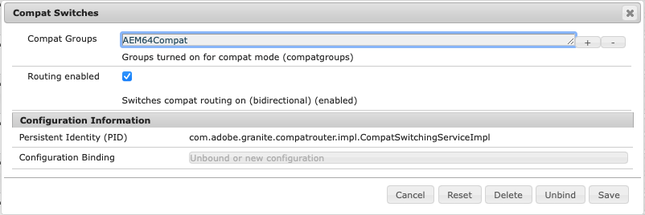

# Compatibilidade com versões anteriores no AEM 6.5{#backward-compatibility-in-aem}

## Visão geral {#overview}

>[!NOTE]
>
>Para obter uma lista de alterações de conteúdo e configuração que não estão no escopo do Pacote de compatibilidade, consulte [Reestruturação do repositório no AEM](/help/sites-deploying/repository-restructuring.md).

No Adobe Experience Manager (AEM) 6.5, todos os recursos foram desenvolvidos tendo em mente a compatibilidade com versões anteriores.

Normalmente, os clientes que executam o AEM 6.3 não devem precisar alterar o código ou as personalizações ao fazer a atualização. Para clientes do AEM 6.1 e 6.2, não há alterações de interrupção adicionais com as quais você se depararia durante uma atualização para o 6.3.

Para exceções em que os recursos não podiam ser mantidos compatíveis com versões anteriores, problemas de incompatibilidade com versões anteriores para pacotes e conteúdo podem ser atenuados. Para fazer isso, instale um Pacote de compatibilidade para 6.4 (consulte como configurar abaixo para obter detalhes sobre onde baixar). Este pacote de compatibilidade ajuda a tp a restaurar a compatibilidade, geralmente para aplicativos compatíveis com AEM 6.4.

O pacote de compatibilidade permite executar o AEM no modo de compatibilidade e adiar o desenvolvimento personalizado em relação aos novos recursos do AEM:

>[!NOTE]
>
>O pacote de compatibilidade é apenas uma solução temporária para adiar o desenvolvimento necessário para ser compatível com o AEM 6.5. A Adobe recomenda isso somente como última opção se você não puder resolver problemas de compatibilidade por meio do desenvolvimento imediatamente após a atualização. Além disso, a Adobe recomenda que você alterne para o modo nativo e desinstale o pacote de compatibilidade depois de decidir continuar o desenvolvimento personalizado com base no 6.5 e aproveitar a funcionalidade completa do 6.5.

O pacote de compatibilidade tem dois modos: **Roteamento Habilitado** e **Roteamento Desabilitado**.

Isso permite que o AEM 6.5 seja executado em três modos:

**Modo nativo:**

O modo nativo é para clientes que desejam usar todos os novos recursos do AEM 6.5 e estão prontos para fazer o desenvolvimento e fazer com que suas personalizações funcionem com todos os novos recursos.

Isso significa que você deve ajustar seu aplicativo imediatamente após a atualização.

**Modo de Compatibilidade: Pacote de Compatibilidade Instalado com Roteamento Habilitado**

O Modo de compatibilidade é para clientes que têm personalizações de interfaces que não são compatíveis com versões anteriores. Isso permite que o AEM seja executado no modo de compatibilidade e adie o desenvolvimento personalizado necessário em relação aos novos Recursos de AEM que não são compatíveis com alguns de seus códigos personalizados.

**Modo Herdado: Pacote de Compatibilidade Instalado com Roteamento Desativado**

O modo herdado é para clientes que têm interfaces personalizadas baseadas em código herdado ou obsoleto do AEM que foi movido para fora no pacote de compatibilidade.

## Como configurar {#how-to-set-up}

A variável **Pacote de compatibilidade do AEM 6.4 para 6.5** pode ser instalado como um pacote usando o Gerenciador de pacotes. Você pode baixar o [Pacote de compatibilidade do AEM 6.4 para 6.5 da Distribuição de software](https://experience.adobe.com/#/downloads/content/software-distribution/en/aem.html?fulltext=compat*&amp;orderby=%40jcr%3Acontent%2Fjcr%3AlastModified&amp;orderby.sort=desc&amp;layout=list&amp;p.offset=0&amp;p.limit=20&amp;package=%2Fcontent%2Fsoftware-distribution%2Fen%2Fdetails.html%2Fcontent%2Fdam%2Faem%2Fpublic%2Fadobe%2Fpackages%2Fcq650%2Fcompatpack%2Faem-compat-cq65-to-cq64) local.

Depois que o Pacote de Compatibilidade é instalado, o roteamento pode ser ativado ou desativado usando um switch na configuração OSGI, conforme mostrado abaixo:

Depois que o pacote de compatibilidade é instalado e configurado, os recursos são usados com base no modo de compatibilidade escolhido.
