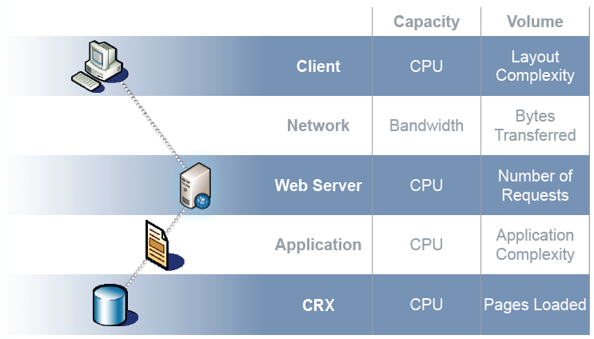

# Otimização do desempenho{#performance-optimization}

>[!NOTE]
>
>Para obter orientações gerais sobre desempenho, leia a página [Diretrizes](/help/sites-deploying/performance-guidelines.md) de desempenho.
>
>Para obter mais informações sobre solução de problemas e correção de problemas de desempenho, consulte também a árvore [](/help/sites-deploying/performance-tree.md)Desempenho.
>
>Além disso, você pode consultar um artigo da Base de conhecimento sobre dicas de ajuste de [desempenho.](https://helpx.adobe.com/experience-manager/kb/performance-tuning-tips.html)

Um problema chave é o tempo que seu site leva para responder às solicitações do visitante. Embora esse valor varie para cada solicitação, um valor médio de público alvo pode ser definido. Uma vez que este valor seja comprovadamente alcançável e sustentável, poderá ser utilizado para acompanhar o desempenho do website e indicar o desenvolvimento de possíveis problemas.

Os tempos de resposta que você desejará serão diferentes nos ambientes de autor e publicação, refletindo as diferentes características da audiência do público alvo:

## Ambiente de criação {#author-environment}

Esse ambiente é usado pelos autores que inserem e atualizam o conteúdo. Ele deve atender a um pequeno número de usuários que geram um grande número de solicitações de desempenho intensivo ao atualizar páginas de conteúdo e os elementos individuais nessas páginas.

## Ambiente de publicação {#publish-environment}

Este ambiente contém conteúdo que você disponibiliza para seus usuários. Neste caso, o número de pedidos é ainda maior e a velocidade é igualmente vital, mas dado que a natureza dos pedidos é menos dinâmica, podem ser aplicados mecanismos adicionais de melhoria do desempenho; como armazenar o conteúdo em cache ou balanceamento de carga.

>[!NOTE]
>
>* Depois de configurar para otimização de desempenho, siga os procedimentos do Dia [](/help/sites-developing/tough-day.md) difícil para testar o ambiente com carga pesada.
>* Consulte também [Dicas](https://helpx.adobe.com/experience-manager/kb/performance-tuning-tips.html)de ajuste de desempenho.
>


## Metodologia de otimização de desempenho {#performance-optimization-methodology}

Uma metodologia de otimização de desempenho para projetos CQ pode ser resumida em cinco regras muito simples que podem ser seguidas para evitar problemas de desempenho do start:

1. [Planejamento para otimização](#planning-for-optimization)
1. [Simular realidade](#simulate-reality)
1. [Estabelecer objetivos sólidos](#establish-solid-goals)
1. [Permanecer relevante](#stay-relevant)
1. [Ciclos de Iteração Ágil](#agile-iteration-cycles)

Essas regras, em grande parte, se aplicam a projetos da Web em geral e são relevantes para gerentes de projetos e administradores de sistemas para garantir que seus projetos não enfrentarão desafios de desempenho quando chegar o momento do lançamento.

### Planejamento para otimização {#planning-for-optimization}


Cerca de 10% do esforço do projeto deve ser planejado para a fase de otimização do desempenho. É claro que os requisitos reais de otimização de desempenho dependerão do nível de complexidade de um projeto e da experiência da equipe de desenvolvimento. Embora seu projeto possa (em última análise) não exigir todo o tempo alocado, é uma boa prática planejar sempre a otimização do desempenho na região sugerida.

Sempre que possível, um projeto deve ser lançado de forma branda para uma audiência limitada, a fim de reunir experiência na vida real e realizar outras otimizações, sem a pressão adicional que se segue a um anúncio completo.

Quando estiver &quot;ao vivo&quot;, a otimização de desempenho não terminará. Este é o momento em que você enfrenta a carga &quot;real&quot; no seu sistema. É importante planejar ajustes adicionais após o lançamento.

Como a carga do sistema muda e os perfis de desempenho do sistema mudam com o tempo, uma &quot;atualização&quot; ou &quot;verificação de integridade&quot; de desempenho deve ser agendada em intervalos de 6 a 12 meses.

### Simular realidade {#simulate-reality}


Se você for ao vivo com um site e descobrir depois do lançamento que você enfrenta problemas de desempenho, há apenas uma razão para isso: Seus testes de carga e desempenho não simularam a realidade de forma suficientemente rigorosa.

Simular a realidade é difícil e quanto esforço você razoavelmente desejará investir para se &quot;real&quot; depende da natureza do seu projeto. &quot;Real&quot; significa não apenas &quot;código real&quot; e &quot;tráfego real&quot;, mas também &quot;conteúdo real&quot;, especialmente em relação ao tamanho e estrutura do conteúdo. Lembre-se de que seus modelos podem se comportar de forma completamente diferente dependendo do tamanho e da estrutura do repositório.

### Estabelecer objetivos sólidos {#establish-solid-goals}


A importância de estabelecer adequadamente objetivos de desempenho não deve ser subestimada. Muitas vezes, uma vez que as pessoas se concentram em objetivos de desempenho específicos, é muito difícil mudar essas metas depois, mesmo que elas se baseiem em pressupostos selvagens.

Estabelecer metas de desempenho boas e sólidas é realmente uma das áreas mais difíceis. Geralmente é melhor coletar registros e benchmarks da vida real de um site comparável (por exemplo, o predecessor do novo site).

### Permanecer relevante {#stay-relevant}


É importante otimizar um gargalo de cada vez. Se você tentar fazer as coisas em paralelo sem validar o impacto de uma otimização, perderá o controle de qual medida de otimização realmente ajudou.

### Ciclos de Iteração Ágil {#agile-iteration-cycles}


O ajuste de desempenho é um processo iterativo que envolve, medição, análise, otimização e validação até que a meta seja atingida. A fim de ter devidamente em conta este aspecto, implemente um processo de validação ágil na fase de otimização, em vez de um processo de teste de peso mais pesado após cada iteração.

Isso significa, em grande parte, que o desenvolvedor que está implementando a otimização deve ter uma maneira rápida de saber se a otimização já atingiu o objetivo. Esta é uma informação valiosa, porque quando a meta é atingida, a otimização termina.

## Diretrizes básicas de desempenho {#basic-performance-guidelines}

Geralmente, mantenha as solicitações html não armazenadas em cache com menos de 100 ms. Mais especificamente, podem servir de orientação:

* 70% das solicitações de páginas devem ser respondidas em menos de 100 ms.
* 25% das solicitações de páginas devem receber uma resposta dentro de 100 ms-300 ms.
* 4% das solicitações de páginas devem receber uma resposta dentro de 300 ms-500 ms.
* 1% das solicitações de páginas devem receber uma resposta dentro de 500 ms-1000 ms.
* Nenhuma página deve responder mais lentamente que 1 segundo.

Os números acima assumem as seguintes condições:

* medido na publicação (sem custos indiretos relacionados a um ambiente de criação)
* medido no servidor (sem sobrecarga de rede)
* não armazenado em cache (sem cache de saída CQ, sem cache do Dispatcher)
* somente para itens complexos com muitas dependências (HTML, JS, PDF, ...)
* nenhuma outra carga no sistema

Há um certo número de problemas que frequentemente contribuem para problemas de desempenho. Eles giram principalmente em torno de:

* ineficiência de armazenamento em cache do dispatcher
* o uso de query em modelos de exibição normais.

O ajuste de nível de JVM e SO geralmente não leva a grandes saltos no desempenho e, portanto, deve ser executado no final do ciclo de otimização.

A maneira como um repositório de conteúdo é estruturado também pode afetar o desempenho. Para obter o melhor desempenho, o número de nós secundários conectados a nós individuais em um repositório de conteúdo não deve exceder 1.000 (como regra geral).

Seus melhores amigos durante um exercício normal de otimização de desempenho são:

* the `request.log`
* tempo com base no componente
* por último, mas não menos importante, um perfilador java.

### Desempenho ao carregar e editar ativos digitais {#performance-when-loading-and-editing-digital-assets}

Devido ao grande volume de dados envolvidos ao carregar e editar ativos digitais, o desempenho pode se tornar um problema.

Duas coisas afetam o desempenho aqui:

* CPU - vários núcleos permitem um trabalho mais suave ao transcodificar
* Disco rígido - discos RAID paralelos atingem o mesmo

Para melhorar o desempenho, considere o seguinte:

* Quantos ativos serão carregados por dia? Uma boa estimativa pode ser baseada em:


* O período em que serão efetuadas as edições (normalmente a duração do dia útil, mais para as operações internacionais).
* O tamanho médio das imagens carregadas (e o tamanho das representações geradas por imagem) em megabytes.
* Determine a taxa média de dados:


* 80% de todas as edições serão feitas em 20% do tempo, portanto, no tempo de pico você terá 4 vezes a taxa média de dados. Esta é a sua meta de desempenho.

## Monitoramento de desempenho {#performance-monitoring}

O desempenho (ou a falta dele) é uma das primeiras coisas que seus usuários notam, de modo que, como em qualquer aplicativo com uma interface do usuário, o desempenho é de importância fundamental. Para otimizar o desempenho da instalação do CQ, é necessário monitorar vários atributos da instância e seu comportamento.

Para obter informações sobre como executar o monitoramento de desempenho, consulte [Monitoramento de desempenho](/help/sites-deploying/monitoring-and-maintaining.md#monitoring-performance).

Os problemas que causam problemas de desempenho geralmente são difíceis de rastrear, mesmo quando seus efeitos são fáceis de ver.

Um ponto de partida básico é um bom conhecimento do seu sistema quando ele está funcionando normalmente. A menos que você saiba como seu ambiente &quot;parece&quot; e &quot;se comporta&quot; quando está funcionando corretamente, pode ser difícil localizar o problema quando o desempenho se deteriorar. Isso significa que você deve dedicar algum tempo investigando seu sistema quando ele estiver sendo executado sem problemas e garantir que a coleta de informações de desempenho seja uma tarefa contínua. Isso fornecerá uma base para comparação caso o desempenho sofra.

O diagrama a seguir ilustra o caminho que uma solicitação de conteúdo CQ pode tomar - e, portanto, o número de elementos diferentes que podem afetar o desempenho.


O desempenho também é um equilíbrio entre Volume e Capacidade:

**Volume** A quantidade de saída processada e entregue pelo sistema.

**Capacidade** A capacidade do sistema de fornecer o volume.

Isso pode ser ilustrado em vários locais da cadeia da Web.



Há várias áreas funcionais que são frequentemente responsáveis por afetar o desempenho:

* Cache
* Código do aplicativo (seu projeto)
* Funcionalidade de pesquisa

### Regras básicas sobre desempenho {#basic-rules-regarding-performance}

Algumas regras devem ser levadas em conta ao otimizar o desempenho:

* O ajuste de desempenho *deve* fazer parte de cada projeto.
* Não otimizar no início do ciclo de desenvolvimento.
* O desempenho é tão bom quanto o elo mais fraco.
* Sempre pense sobre capacidade vs. volume.
* Otimize coisas importantes primeiro.
* Nunca otimize sem metas *realistas* .

>[!NOTE]
>
>Lembre-se de que o mecanismo usado para medir o desempenho muitas vezes afetará exatamente o que você está tentando medir. Você deve sempre tentar explicar essas discrepâncias e eliminar o máximo possível de seus efeitos. em particular, os plug-ins do navegador devem ser desativados sempre que possível.

## Configuração para desempenho {#configuring-for-performance}

Determinados aspectos do CQ (e/ou do CRX subjacente) podem ser configurados para otimizar o desempenho. A seguir estão as possibilidades e sugestões, é necessário ter certeza se, ou como, você usa a funcionalidade em questão antes de fazer alterações.

>[!NOTE]
>
>Para obter informações adicionais, consulte o artigo [da](https://helpx.adobe.com/experience-manager/kb/performance-tuning-tips.html)KB.

### Search Indexing {#search-indexing}

A partir do AEM 6.0, o Adobe Experience Manager usa uma arquitetura de repositório baseada no Oak.

Você pode encontrar as informações de indexação atualizadas aqui:

* [Práticas recomendadas para Query e indexação](/help/sites-deploying/best-practices-for-queries-and-indexing.md)
* [Query e indexação](/help/sites-deploying/queries-and-indexing.md)

### Processamento de fluxo de trabalho simultâneo {#concurrent-workflow-processing}

Limite o número de processos de fluxo de trabalho em execução simultânea para melhorar o desempenho. Por padrão, o motor de workflow processa tantos workflows simultaneamente quanto há processadores disponíveis para a Java VM. Quando as etapas do fluxo de trabalho exigem grandes quantidades de recursos de processamento (RAM ou CPU), a execução paralela de vários desses workflows pode colocar altas demandas nos recursos disponíveis do servidor.

Por exemplo, quando imagens (ou ativos DAM em geral) são carregadas, os workflows importam automaticamente as imagens para o DAM. As imagens são geralmente de alta resolução e podem consumir facilmente centenas de MB de heap para processamento. Manusear essas imagens em paralelo coloca uma carga alta no subsistema de memória e no coletor de lixo.

O motor de workflow usa as filas de trabalhos do Apache Sling para manusear e programar o processamento de itens de trabalho. Os seguintes serviços de fila de trabalhos foram criados por padrão a partir do fábrica do serviço Configuração da fila de trabalhos Apache Sling para processamento de trabalhos de fluxo de trabalho:

* Fila de Fluxo de Trabalho Granite: A maioria das etapas do fluxo de trabalho, como aquelas que processam ativos DAM, usam o serviço Fila de fluxo de trabalho Granite.
* Fila de Trabalho de Processo Externo do Fluxo de Trabalho Granite: Este serviço é usado para etapas de fluxo de trabalho externo especiais que são normalmente usadas para entrar em contato com um sistema externo e pesquisar resultados. Por exemplo, a etapa do processo de Extração de mídia do InDesign é implementada como um processo externo. O motor de workflow usa a fila externa para processar a pesquisa. (Consulte [com.day.cq.workflow.exec.WorkflowExternalProcess](https://helpx.adobe.com/experience-manager/6-5/sites/developing/using/reference-materials/javadoc/com/day/cq/workflow/exec/WorkflowExternalProcess.html).)

Configure esses serviços para limitar o número máximo de processos de fluxo de trabalho em execução simultânea.

**Observação:** A configuração dessas filas de trabalhos afeta todos os workflows, a menos que você tenha criado uma fila de trabalhos para um modelo de fluxo de trabalho específico (consulte [Configurar a fila para um modelo](/help/sites-deploying/configuring-performance.md#configure-the-queue-for-a-specific-workflow) de fluxo de trabalho específico abaixo).

**Configuração no repositório**

Se você estiver configurando os serviços [usando um nó](/help/sites-deploying/configuring-osgi.md#adding-a-new-configuration-to-the-repository)sling:OsgiConfig, é necessário encontrar o PID dos serviços existentes, por exemplo: org.apache.sling.evento.jobs.QueueConfiguration.370aad73-d01b-4a0b-abe4-20198d85f705. Você pode descobrir o PID usando o Console da Web.

É necessário configurar a propriedade chamada queue.maxparalelo.

**Configuração no Console da Web**

Para configurar esses serviços [usando o Console](/help/sites-deploying/configuring-osgi.md#osgi-configuration-with-the-web-console)da Web, localize os itens de configuração existentes abaixo da fábrica do serviço Configuração da fila de trabalhos do Apache Sling.

É necessário configurar a propriedade chamada Máximo de Trabalhos Paralelos.

### Configurar a fila para um fluxo de trabalho específico {#configure-the-queue-for-a-specific-workflow}

Crie uma fila de trabalhos para um modelo de fluxo de trabalho específico para que você possa configurar a manipulação de tarefas para esse modelo de fluxo de trabalho. Dessa forma, suas configurações afetam o processamento de um fluxo de trabalho específico, enquanto a configuração da Fila de Fluxo de Trabalho Granite padrão controla o processamento de outros workflows.

Quando os modelos de fluxo de trabalho são executados, eles criam trabalhos do Sling para um tópico específico. Por padrão, o tópico corresponde aos tópicos configurados para a Fila geral de Fluxo de Trabalho Granite ou para a Fila de Trabalho de Processo Externo de Fluxo de Trabalho Granito:

* com/adobe/granite/workflow/job&amp;ast;
* com/adobe/granite/workflow/external/job&amp;ast;

Os tópicos reais da tarefa que os modelos de fluxo de trabalho geram incluem o sufixo específico do modelo. Por exemplo, o modelo de fluxo de trabalho Atualizar ativo [!UICONTROL do] DAM gera trabalhos com o seguinte tópico:

com/adobe/granite/workflow/job/etc/workflow/models/dam/update_asset/jcr_content/model

Portanto, você pode criar uma fila de trabalhos para o tópico que corresponda aos tópicos de trabalho do seu modelo de fluxo de trabalho. A configuração das propriedades relacionadas ao desempenho da fila afeta apenas o modelo de fluxo de trabalho que gera os trabalhos que correspondem ao tópico da fila.

O procedimento a seguir cria uma fila de trabalhos para um fluxo de trabalho, usando o fluxo de trabalho Atualizar ativo [!UICONTROL do] DAM como exemplo.

1. Execute o modelo de fluxo de trabalho para o qual você deseja criar a fila de trabalhos, para que as estatísticas de tópicos sejam geradas. Por exemplo, adicione uma imagem aos Ativos para executar o fluxo de trabalho Atualizar ativo [!UICONTROL do] DAM.
1. Abra o console Sling Jobs. ([http://localhost:4502/system/console/slingevent](http://localhost:4502/system/console/slingevent))
1. Descubra os tópicos relacionados ao fluxo de trabalho no console. Para o Ativo de atualização do DAM, os seguintes tópicos foram encontrados:

   * com/adobe/granite/workflow/external/job/etc/workflow/models/dam/update_asset/jcr_content/model
   * com/adobe/granite/workflow/job/etc/workflow/models/dam/update_asset/jcr_content/model
   * com/adobe/granite/workflow/job/etc/workflow/models/dam-xmp-write-back/jcr_content/model

1. Crie uma fila de trabalhos para cada um desses tópicos. Para criar uma fila de trabalhos, crie uma configuração de fábrica para o serviço de fábrica da fila de trabalhos do Apache Sling.

   As configurações de fábrica são semelhantes à Fila de fluxo de trabalho Granite descrita em Processamento [de fluxo de trabalho](/help/sites-deploying/configuring-performance.md#concurrent-workflow-processing)simultâneo, exceto que a propriedade Tópicos corresponde ao tópico de suas tarefas de fluxo de trabalho.

### Serviço de Sincronização de Ativos do CQ5 DAM {#cq-dam-asset-synchronization-service}

O `AssetSynchronizationService` é usado para sincronizar ativos de repositórios montados (incluindo LiveLink, Documentum, entre outros). Por padrão, isso faz uma verificação regular a cada 300 segundos (5 minutos), portanto, se você não usar repositórios montados, poderá desativar esse serviço.

Isso é feito [configurando o serviço](/help/sites-deploying/configuring-osgi.md) OSGi **CQ DAM Asset Synchronization Service** para definir o período **de** sincronização ( `scheduler.period`) como (no mínimo) 1 ano (definido em segundos).

### Várias instâncias DAM {#multiple-dam-instances}

A implantação de várias instâncias de DAM pode ajudar no desempenho quando, por exemplo:

* você tem uma carga alta devido ao carregamento regular de um grande número de ativos para o ambiente do autor; aqui, uma instância separada do DAM pode ser dedicada à manutenção do autor.
* você tem várias equipes em locais globais (por exemplo, EUA, Europa e Ásia).

Considerações adicionais são:

* separar &quot;trabalho em andamento&quot; do autor de &quot;final&quot; ao publicar
* separar usuários internos do autor de visitantes/usuários externos ao publicar (por exemplo, agentes, representantes de imprensa, clientes, estudantes etc).

## Práticas recomendadas para garantia de qualidade {#best-practices-for-quality-assurance}

O desempenho é de importância primordial para o seu ambiente de publicação. Portanto, você precisa planejar e analisar cuidadosamente os testes de desempenho que você fará para o ambiente de publicação ao implementar seu projeto.

Esta seção tem como objetivo fornecer uma visão geral padronizada dos problemas envolvidos na definição de um conceito de teste especificamente para testes de desempenho no ambiente *publicado* . Isso interessa principalmente aos engenheiros de controle de qualidade, gerentes de projeto e administradores de sistema.

A seguir está uma abordagem padronizada para testes de desempenho para um aplicativo CQ no ambiente *Publicar* . Isso envolve as seguintes cinco fases:

* [Verificação do conhecimento](#verification-of-knowledge)
* [Definição de âmbito](#scope-definition)
* [Metodologias de teste](#test-methodologies)
* [Definição de objetivos de desempenho](#defining-the-performance-goals)
* [Otimização](#optimization)

O controle é um processo adicional e abrangente - necessário, mas não limitado a testes.

### Verificação do conhecimento {#verification-of-knowledge}

Um primeiro passo é documento das informações básicas que você precisa saber antes de poder testar o start:

* a arquitetura do seu ambiente de teste
* um mapa de aplicações que detalhe os elementos internos que necessitarão de ensaio (isoladamente ou em combinação)

#### Arquitetura de teste {#test-architecture}

Você deve claramente documento a arquitetura do ambiente de teste que está sendo usado para seus testes de desempenho.

Você precisará de uma reprodução do ambiente de publicação de produção planejado, juntamente com o Dispatcher e o Balanceador de carga.

#### Mapa de aplicativos {#application-map}

Para obter uma visão geral clara, você pode criar um mapa de todo o aplicativo (isso pode acontecer a partir de testes no ambiente Autor).

Uma representação em diagrama dos elementos internos do pedido pode fornecer uma panorâmica dos requisitos de ensaio; com a codificação por cores, também pode servir de base para o relatórios.

### Definição do escopo {#scope-definition}

Um aplicativo geralmente terá uma seleção de casos de uso. Alguns serão muito importantes, outros menos.

Para focar o escopo do teste de desempenho na publicação, recomendamos que você defina o seguinte:

* casos mais importantes de uso de negócios
* casos de uso técnico mais críticos

O número de casos de uso depende de você, mas deve ser limitado a um número facilmente gerenciável (por exemplo, entre 5 e 10).

Depois que os casos principais de uso forem selecionados, os KPI (Indicadores chave de desempenho) e as ferramentas usadas para medi-los poderão ser definidos para cada caso. Exemplos de KPIs comuns incluem:

* Tempo de resposta de fim a fim
* Tempo de resposta do servlet
* Tempo de resposta para um único componente
* Tempo de resposta para os serviços
* Número de threads ociosos no pool de threads
* Número de conexões gratuitas
* Recursos do sistema, como CPU e acesso de E/S

### Metodologias de teste {#test-methodologies}

Este conceito tem quatro cenários usados para definir e testar as metas de desempenho:

* Testes de componentes únicos
* Ensaios de componentes combinados
* *Cenário do Live*
* Cenários de erro

Com base nos seguintes princípios:

**Pontos de interrupção do componente**

* Cada componente tem um ponto de interrupção específico quando relacionado ao desempenho. Isso significa que um componente pode mostrar um bom desempenho até que um ponto específico seja atingido, e depois disso o desempenho diminuirá rapidamente.
* Para obter uma visão geral completa do aplicativo, verifique primeiro seus componentes para determinar quando o ponto de interrupção de cada um é atingido.
* Para localizar o ponto de interrupção, é possível executar um teste de carga no qual, durante um período de tempo, você aumenta o número de usuários para criar uma carga crescente. Ao monitorar essa carga e a resposta dos componentes, você encontrará um comportamento de desempenho específico quando o ponto de quebra do componente for atingido. O ponto pode ser qualificado pelo número de transações simultâneas por segundo, juntamente com o número de usuários simultâneos (se o componente for sensível a esse KPI).
* Essas informações podem servir de referência para melhorias, indicar a eficiência das medidas utilizadas e ajudar a definir cenários de teste.

**Transações**

* O termo transação é utilizado para representar a solicitação de uma página da Web completa, incluindo a própria página e todas as chamadas subsequentes; Ou seja, a solicitação de página, quaisquer chamadas, imagens e outros objetos AJAX.**Solicitar Drill-Down**
* Para analisar completamente cada solicitação, você pode representar cada elemento da pilha de chamadas, em seguida, totalizar o tempo médio de processamento de cada uma.

### Definição das Metas de Desempenho {#defining-the-performance-goals}

Depois que o escopo e os KPIs relacionados forem definidos, as metas de desempenho específicas poderão ser definidas. Isso envolve a concepção de cenários de teste, juntamente com valores de público alvo.

Você precisará testar o desempenho em condições médias e de pico. Além disso, você precisará de testes de cenário do Google Live para garantir que possa atender a um maior interesse em seu site quando ele for disponibilizado pela primeira vez.

Qualquer experiência ou estatística que você tenha coletado de um site existente também pode ser útil para determinar objetivos futuros; por exemplo, tráfego superior do seu site ativo.

#### Testes de componente único {#single-component-tests}

Os componentes críticos terão de ser testados - em condições médias e de pico.

Em ambos os casos, você pode definir o número esperado de transações por segundo quando um número predefinido de usuários estiver usando o sistema.

| Componente | Tipo de teste | #Usuários | Tx/seg (Esperado) | Tx/s (Testado) | Descrição |
|---|---|---|---|---|---|
| Página inicial - Usuário único | Média | 1 | 1 |  |  |
|  | Pico | 1 | 3 |  |  |
| Usuários da página inicial 100 | Média | 100 | 3 |  |  |
|  | Pico | 100 | 3 |  |

#### Testes de componentes combinados {#combined-component-tests}

O teste dos componentes em combinação oferece uma reflexão mais detalhada sobre o comportamento dos aplicativos. Novamente, as condições médias e de pico devem ser testadas.

| Cenário | Componente | #Usuários | Tx/seg (Esperado) | Tx/s (Testado) | Descrição |
|---|---|---|---|---|---|
| Média mista | Página inicial | 10 | 1 |  |  |
|  | Pesquisar   | 10 | 1 |  |  |
|  | Notícias | 10 | 2 |  |  |
|  | Eventos | 10 | 1 |  |  |
|  | Ativações | 10 | 3 |  | Simulação do comportamento do autor. |
| Pico misto | Página inicial | 100 | 5 |  |  |
|  | Pesquisar   | 50 | 5 |  |  |
|  | Notícias | 100 | 10 |  |  |
|  | Eventos | 100 | 10 |  |  |
|  | Ativações | 20 | 20 |  | Simulação do comportamento do autor. |

#### Indo para testes ao vivo {#going-live-tests}

Durante os primeiros dias após o site ser disponibilizado, você pode esperar um maior nível de interesse. Isso provavelmente será ainda maior do que os valores de pico que você tem testado. É altamente recomendável testar cenários do Google Live para garantir que o sistema possa atender a essa situação.

| Cenário | Tipo de teste | #Usuários | Tx/seg (Esperado) | Tx/s (Testado) | Descrição |
|---|---|---|---|---|---|
| Pico ao vivo | Página inicial | 200 | 20 |  |  |
|  | Pesquisar   | 100 | 10 |  |  |
|  | Notícias | 200 | 20 |  |  |
|  | Eventos | 200 | 20 |  |  |
|  | Ativações | 20 | 20 |  | Simulação do comportamento do autor. |

#### Testes de cenário de erro {#error-scenario-tests}

Os cenários de erro também devem ser testados para garantir que o sistema reaja corretamente e apropriadamente. Não apenas na forma como o erro em si é tratado, mas no impacto que pode ter no desempenho. Por exemplo:

* o que acontece quando o usuário tenta inserir um termo de pesquisa inválido na caixa de pesquisa
* o que acontece quando o termo de pesquisa é tão geral que retorna um número excessivo de resultados

Ao elaborar esses testes, lembre-se de que nem todos os cenários ocorrerão regularmente. No entanto, o seu impacto em todo o sistema é importante.

| Cenário de erro | Tipo de erro | #Usuários | Tx/seg (Esperado) | Tx/s (Testado) | Descrição |
|---|---|---|---|---|---|
| Sobrecarga do componente de pesquisa | Pesquisar no curinga global (asterisco) | 10 | 1 |  | Somente &amp;ast;&amp;ast;&amp;ast; são pesquisados. |
|  | Palavra de interrupção | 20 | 2 |  | Procurando uma palavra de parada. |
|  | Sequência vazia | 10 | 1 |  | Procurando uma string vazia. |
|  | Caracteres especiais | 10 | 1 |  | Procurando caracteres especiais. |

#### Testes de resistência {#endurance-tests}

Determinados problemas só serão encontrados depois que o sistema estiver em execução por um período contínuo; sejam horas ou mesmo dias. É utilizado um ensaio de resistência para testar uma carga média constante durante um período de tempo necessário. Qualquer degradação do desempenho pode então ser analisada.

| Cenário | Tipo de teste | #Usuários | Tx/seg (Esperado) | Tx/s (Testado) | Descrição |
|---|---|---|---|---|---|
| Teste de resistência (72 horas) | Página inicial | 10 | 1 |  |  |
|  | Pesquisar   | 10 | 1 |  |  |
|  | Notícias | 20 | 2 |  |  |
|  | Eventos | 10 | 1 |  |  |
|  | Ativações | 1 | 3 |  | Simulação do comportamento do autor. |

### Otimização {#optimization}

Nos estágios posteriores de implementação, você precisará otimizar o aplicativo para atingir/maximizar as metas de desempenho.

Todas as otimizações realizadas devem ser testadas para garantir que elas tenham:

* não afetou a funcionalidade
* foram verificados com os ensaios de carga antes de serem libertados

Uma seleção de ferramentas está disponível para ajudá-lo com a geração de carga, monitoramento de desempenho e/ou análise de resultados:

* [JMeter](https://jakarta.apache.org/jmeter/)
* [Carregar Runner](https://www.microfocus.com/en-us/products/loadrunner-load-testing/overview)
* [Determyne](https://www.determyne.com/) InsideApps
* [InfraRED](https://www.infraredsoftware.com/)
* [Perfil interativo Java](https://jiprof.sourceforge.net/)
* e muito mais...

Após a otimização, você precisará testar novamente para confirmar o impacto.

### Relatório {#reporting}

Será necessário um relatórios permanente para manter todos informados do estatuto; como mencionado anteriormente com codificação de cores, o Mapa de arquitetura pode ser usado para isso.

Depois que todos os testes tiverem sido concluídos, você deverá informar sobre:

* qualquer erro crítico encontrado
* questões não críticas que ainda necessitam de uma investigação mais aprofundada
* quaisquer suposições feitas durante os testes
* quaisquer recomendações que possam surgir do teste

## Otimizando o desempenho ao usar o Dispatcher {#optimizing-performance-when-using-the-dispatcher}

O [Dispatcher](https://helpx.adobe.com/experience-manager/dispatcher/using/dispatcher.html) é a ferramenta de cache e/ou balanceamento de carga da Adobe. Ao usar o Dispatcher, você deve considerar a otimização do seu site para o desempenho do cache.

>[!NOTE]
>
>As versões do Dispatcher são independentes do AEM, no entanto, a documentação do Dispatcher é incorporada na documentação do AEM. Sempre use a documentação do Dispatcher incorporada na documentação para obter a versão mais recente do AEM.
>
>Você pode ter sido redirecionado para esta página se tiver seguido um link para a documentação do Dispatcher incorporada à documentação de uma versão anterior do AEM.

O Dispatcher oferta vários mecanismos integrados que você pode usar para otimizar o desempenho se o seu site tira proveito deles. Esta seção informa como criar seu site para maximizar os benefícios do armazenamento em cache.

>[!NOTE]
>
>Pode ajudar você a lembrar que o Dispatcher armazena o cache em um servidor da Web padrão. Isso significa que você:
>
>* pode armazenar em cache tudo o que você pode armazenar como uma página e solicitar usando um URL
>* não é possível armazenar outras coisas, como cookies, dados de sessão e dados de formulário.
>
>
Em geral, muitas estratégias de cache envolvem selecionar bons URLs e não depender desses dados adicionais.
>
>Com o Dispatcher versão 4.1.11, também é possível armazenar em cache cabeçalhos de resposta, consulte [Armazenamento em cache de cabeçalhos](https://helpx.adobe.com/experience-manager/dispatcher/using/dispatcher-configuration.html#configuring-the-dispatcher-cache-cache)de resposta HTTP.


### Calculando a taxa de cache do Dispatcher {#calculating-the-dispatcher-cache-ratio}

A fórmula da taxa de cache estima a porcentagem de solicitações tratadas pelo cache do número total de solicitações que entram no sistema. Para calcular a taxa de cache, é necessário o seguinte:

* O número total de solicitações. Essas informações estão disponíveis no Apache `access.log`. Para obter mais detalhes, consulte a documentação [](https://httpd.apache.org/docs/2.4/logs.html#accesslog)oficial do Apache.

* O número de solicitações que a instância Publicar serviu. Essas informações estão disponíveis na parte `request.log` da instância. Para obter mais detalhes, consulte [Interpretação do request.log](/help/sites-deploying/monitoring-and-maintaining.md#interpreting-the-request-log) e [Localização dos arquivos](/help/sites-deploying/monitoring-and-maintaining.md#finding-the-log-files)de log.

A fórmula para calcular a taxa de cache é:

* (O número total de solicitações **menos** o número de solicitações em Publicar) **dividido** pelo número total de solicitações.

Por exemplo, se o número total de solicitações for 129491 e o número de solicitações atendidas pela instância de publicação for 58959, a taxa de cache será: **(129491 - 58959)/129491= 54.5%**.

Se você não tiver um emparelhamento de um editor/despachante, precisará adicionar solicitações de todos os despachantes e editores juntos para obter uma avaliação precisa. Consulte também [Implantações](/help/sites-deploying/recommended-deploys.md)recomendadas.

>[!NOTE]
>
>Para melhor desempenho, a Adobe recomenda uma taxa de cache de 90% a 95%.

#### Usando codificação de página consistente {#using-consistent-page-encoding}

Com a versão 4.1.11 do Dispatcher, é possível armazenar em cache os cabeçalhos de resposta. Se você não estiver armazenando cabeçalhos de resposta em cache no Dispatcher, poderão ocorrer problemas se você armazenar informações de codificação de página no cabeçalho. Nessa situação, quando o Dispatcher envia uma página do cache, a codificação padrão do servidor da Web é usada para a página. Há duas maneiras de evitar esse problema:

* Se você usar apenas uma codificação, verifique se a codificação usada no servidor da Web é a mesma usada na codificação padrão do site do AEM.
* Use uma `<META>` tag na seção HTML `head` para definir a codificação, como no exemplo a seguir:

```xml
        <META http-equiv="Content-Type" content="text/html; charset=EUC-JP">
```

#### Evitar parâmetros de URL {#avoid-url-parameters}

Se possível, evite parâmetros de URL para as páginas que deseja armazenar em cache. Por exemplo, se você tiver uma galeria de imagens, o seguinte URL nunca será armazenado em cache (a menos que o Dispatcher esteja [configurado adequadamente](https://helpx.adobe.com/experience-manager/dispatcher/using/dispatcher-configuration.html#configuring-the-dispatcher-cache-cache)):

```xml
www.myCompany.com/pictures/gallery.html?event=christmas&amp;page=1
```

No entanto, você pode colocar esses parâmetros no URL da página, da seguinte forma:

```xml
www.myCompany.com/pictures/gallery.christmas.1.html
```

>[!NOTE]
>
>Esse URL chama a mesma página e o mesmo modelo que gallery.html. Na definição do modelo, é possível especificar qual script renderiza a página ou usar o mesmo script para todas as páginas.

#### Personalizar por URL {#customize-by-url}

Se você permitir que os usuários alterem o tamanho da fonte (ou qualquer outra personalização do layout), verifique se as diferentes personalizações são refletidas no URL.

Por exemplo, os cookies não são armazenados em cache, portanto, se você armazenar o tamanho da fonte em um cookie (ou mecanismo semelhante), o tamanho da fonte não será preservado para a página em cache. Como resultado, o Dispatcher retorna aleatoriamente documentos de qualquer tamanho de fonte.

A inclusão do tamanho da fonte no URL como seletor evita esse problema:

```xml
www.myCompany.com/news/main.large.html
```

>[!NOTE]
>
>Para a maioria dos aspectos de layout, também é possível usar folhas de estilos e/ou scripts do cliente. Normalmente, eles funcionam muito bem com o cache.
>
>Isso também é útil para uma versão impressa, onde você pode usar um URL como: &quot;
>
>`www.myCompany.com/news/main.print.html`
>
>Usando a globalização do script da definição do modelo, você pode especificar um script separado que renderiza as páginas de impressão.

#### Invalidando Arquivos De Imagem Usados Como Títulos {#invalidating-image-files-used-as-titles}

Se você renderizar títulos de página, ou outro texto, como imagens, é recomendável armazenar os arquivos para que sejam excluídos após uma atualização de conteúdo na página:

1. Coloque o arquivo de imagem na mesma pasta que a página.
1. Use o seguinte formato de nomeação para o arquivo de imagem:

   `<page file name>.<image file name>`

Por exemplo, você pode armazenar o título da página myPage.html no arquivo myPage.title.gif. Esse arquivo será excluído automaticamente se a página for atualizada, de modo que qualquer alteração no título da página será refletida automaticamente no cache.

>[!NOTE]
>
>O arquivo de imagem não existe fisicamente na instância do AEM. Você pode usar um script que cria dinamicamente o arquivo de imagem. O Dispatcher armazena o arquivo no servidor da Web.

#### Invalidando Arquivos De Imagem Usados Para Navegação {#invalidating-image-files-used-for-navigation}

Se você usar imagens para as entradas de navegação, o método é basicamente o mesmo que com títulos, apenas ligeiramente mais complexo. Armazene todas as imagens de navegação com as páginas de público alvo. Se você usar duas imagens para normais e ativas, poderá usar os seguintes scripts:

* Um script que exibe a página, como de costume.
* Um script que processa solicitações &quot;.normal&quot; e retorna a imagem normal.
* Um script que processa solicitações &quot;.ative&quot; e retorna a imagem ativada.

É importante que você crie essas imagens com o mesmo identificador de nome da página, para garantir que uma atualização de conteúdo exclua essas imagens, bem como a página.

Para páginas que não são modificadas, as imagens ainda permanecem no cache, embora as próprias páginas geralmente sejam invalidadas automaticamente.

#### Personalização {#personalization}

O Dispatcher não pode armazenar dados personalizados em cache, portanto, recomenda-se que você limite a personalização para onde ela for necessária. Para ilustrar por que:

* Se você usar uma página de start personalizável livremente, essa página deverá ser composta sempre que um usuário a solicitar.
* Se, por outro lado, você oferta uma escolha de 10 páginas de start diferentes, você pode armazenar cada uma delas em cache, melhorando assim o desempenho.

>[!NOTE]
>
>Se você personalizar cada página (por exemplo, colocando o nome do usuário na barra de título) não poderá armazená-la em cache, o que pode causar um grande impacto no desempenho.
>
>No entanto, se você precisar fazer isso, poderá:
>
>* use iFrames para dividir a página em uma parte que é a mesma para todos os usuários e uma parte que é a mesma para todas as páginas do usuário. Em seguida, é possível armazenar essas duas partes em cache.
>* use o JavaScript do lado do cliente para exibir informações personalizadas. No entanto, é necessário verificar se a página ainda é exibida corretamente se um usuário desativa o JavaScript.
>


#### Conexões aderentes {#sticky-connections}

[As conexões](https://helpx.adobe.com/experience-manager/dispatcher/using/dispatcher.html#the-benefits-of-load-balancing) adesivas garantem que os documentos de um usuário sejam todos compostos no mesmo servidor. Se um usuário sair desta pasta e posteriormente retornar a ela, a conexão ainda permanecerá. Defina uma pasta para manter todos os documentos que exigem conexões aderentes para o site. Tente não ter outros documentos nele. Isso afeta o balanceamento de carga se você usar páginas personalizadas e dados de sessão.

#### MIME Types {#mime-types}

Há duas maneiras de um navegador determinar o tipo de arquivo:

1. Pela sua extensão (por exemplo, .html, .gif, .jpg etc)
1. Pelo tipo MIME que o servidor envia com o arquivo.

Para a maioria dos arquivos, o tipo MIME está implícito na extensão do arquivo. i.e.:

1. Pela sua extensão (por exemplo, .html, .gif, .jpg etc)
1. Pelo tipo MIME que o servidor envia com o arquivo.

Se o nome do arquivo não tiver extensão, ele será exibido como texto sem formatação.

Com a versão 4.1.11 do Dispatcher, é possível armazenar em cache os cabeçalhos de resposta. Se você não armazenar em cache os cabeçalhos de resposta no Dispatcher, esteja ciente de que o tipo MIME faz parte do cabeçalho HTTP. Dessa forma, se o aplicativo AEM retornar arquivos que não têm um arquivo reconhecido como encerrado e, em vez disso, depender do tipo MIME, esses arquivos poderão ser exibidos incorretamente.

Para garantir que os arquivos sejam armazenados em cache corretamente, siga estas diretrizes:

* Verifique se os arquivos sempre têm a extensão correta.
* Evite scripts de servidor de arquivos genéricos, que têm URLs como download.jsp?file=2214. regravar o script para usar URLs que contenham a especificação do arquivo; para o exemplo anterior, este seria download.2214.pdf.

## Desempenho do backup {#backup-performance}

Esta seção apresenta uma série de benchmarks usados para avaliar o desempenho de backups de CQ e os efeitos da atividade de backup sobre o desempenho do aplicativo. O backup do CQ apresenta uma carga significativa no sistema durante sua execução, e nós medimos isso, bem como os efeitos das configurações de atraso de backup que tentam modular esses efeitos. O objetivo é oferta de alguns dados de referência sobre o desempenho esperado dos backups em configurações realistas e quantidades de dados de produção, além de fornecer orientações sobre como estimar os tempos de backup para sistemas planejados.

### Ambiente de referência {#reference-environment}

#### Sistema físico {#physical-system}

Os resultados reportados neste documento foram obtidos a partir de benchmarks executados em um ambiente de referência com a seguinte configuração. Essa configuração foi projetada para ser semelhante a um ambiente de produção comum em um data center:

* H-P ProLiant DL380 G6, 8 CPUs x 2,533 GHz
* Unidades SCSI conectadas serial de 300 GB e 10.000 RPM
* Controladora RAID de hardware; 8 unidades em uma matriz RAID0+5
* Imagem VMware CPU x 2 Intel Xeon E5540 a 2,53 GHz
* RedHat Linux 2.6.18-194.el5; Java 1.6.0_29
* Instância de autor único executando o CQ 5.5 GM.

O subsistema de disco desse servidor é muito rápido, representando uma configuração RAID de alto desempenho que pode ser usada em um servidor de produção. O desempenho do backup pode ser sensível ao desempenho do disco, e os resultados nesse ambiente refletem o desempenho em uma configuração RAID muito rápida. A imagem VMWare está configurada para ter um único grande volume de disco que reside fisicamente no armazenamento de disco local, na matriz RAID.

A configuração do CQ coloca o repositório e o armazenamento de dados no mesmo volume lógico, ao lado de todo o sistema operacional e do software CQ. O diretório de públicos alvos para backups também reside neste sistema de arquivos lógico.

#### Volumes de dados {#data-volumes}

A tabela a seguir ilustra o tamanho dos volumes de dados usados nos benchmarks de backup. O conteúdo inicial da linha de base é instalado primeiro, e então quantidades conhecidas adicionais de dados são adicionadas para aumentar o tamanho do conteúdo do backup. Os backups serão criados em incrementos específicos para representar um grande aumento no conteúdo e no que pode ser produzido em um dia. A distribuição de conteúdo (páginas, imagens, tags) será basicamente baseada na composição realista do ativo de produção. As páginas, imagens e tags serão limitadas a um máximo de 800 páginas secundárias. Cada página incluirá componentes de título, Flash, texto/imagem, vídeo, apresentação de slides, formulário, tabela, nuvem e carrossel. O upload das imagens será feito a partir de um pool de 400 arquivos únicos que variam de 37 kB a 594 kB.

<table>
 <tbody>
  <tr>
   <td><strong>Conteúdo</strong></td>
   <td><strong>Nós</strong></td>
   <td><strong>Páginas</strong></td>
   <td><strong>Imagens</strong></td>
   <td><strong>Tags</strong></td>
  </tr>
  <tr>
   <td>Instalação básica</td>
   <td>69,610</td>
   <td>562</td>
   <td>256</td>
   <td>237</td>
  </tr>
  <tr>
   <td>Conteúdo pequeno para backup incremental</td>
   <td><br type="_moz" /> </td>
   <td>+100</td>
   <td>+2</td>
   <td>+2</td>
  </tr>
  <tr>
   <td>Conteúdo grande para backup completo</td>
   <td><br type="_moz" /> </td>
   <td>+10,000</td>
   <td>+100</td>
   <td>+100</td>
  </tr>
 </tbody>
</table>

O benchmark de backup é repetido com os conjuntos de conteúdo adicionais adicionados a cada repetição.

#### Cenários de benchmark {#benchmark-scenarios}

Os benchmarks de backup abrangem dois cenários principais: é feito backup quando o sistema está com carga significativa do aplicativo e quando o sistema está ocioso. Embora a recomendação geral seja que os backups sejam executados quando o sistema CQ estiver o mais ocioso possível, há situações em que é necessário que o backup seja executado quando o sistema estiver sendo carregado.

**Os backups de estado** ocioso são executados sem outra atividade no CQ.

**Em Load** Backups (Carregar backups) são executados enquanto o sistema está com menos de 80% de carga dos processos on-line. O atraso do backup variou para ver o impacto na carga.

Os tempos de backup e o tamanho do backup resultante são obtidos dos registros do servidor CQ. Normalmente, é recomendável que os backups sejam programados para períodos fora do horário em que o CQ estiver ocioso, como no meio da noite. Esse cenário é representativo da abordagem recomendada.

O carregamento consistirá em criar/excluir páginas, traversais e query com a maioria da carga proveniente de query e cruzamentos de páginas. A adição e remoção de muitas páginas aumenta continuamente o tamanho do espaço de trabalho e impede que as backups sejam concluídas. A distribuição da carga que o script usará é 75% de traversais de página, 24% de query e 1% de criações de página (nível único sem subpáginas aninhadas). A média de pico de transações por segundo em um sistema ocioso é alcançada com 4 threads simultâneos, que é o que será usado ao testar backups sob carga.

O impacto da carga no desempenho do backup pode ser estimado pela diferença entre o desempenho com e sem essa carga do aplicativo. O impacto do backup no throughput do aplicativo é encontrado comparando o throughput de cenário em transações por hora com e sem um backup simultâneo em andamento e com backups operando com diferentes configurações de &quot;atraso de backup&quot;.

**Configuração** de atraso Para vários dos cenários, também alteramos a configuração de atraso de backup, usando valores de 10 ms (padrão), 1 ms e 0 ms, para explorar como essa configuração afetava o desempenho dos backups.

**Tipo** de backup Todos os backups eram backups externos do repositório feitos em um diretório de backup sem criar um zip, exceto em uma única vez para comparação em que o comando tar era usado diretamente. Como os backups incrementais não podem ser criados em um arquivo zip, ou quando o backup completo anterior é um arquivo zip, o método do diretório de backup é o mais usado em situações de produção.

### Resumo dos resultados {#summary-of-results}

#### Tempo de backup e solução de problemas {#backup-time-and-troughput}

O principal resultado desses benchmarks é mostrar como os tempos de backup variam em função do tipo de backup e da quantidade geral de dados. O gráfico a seguir mostra o tempo de backup obtido usando a configuração de backup padrão, em função do número total de páginas.


Os tempos de backup em uma instância ociosa são bastante consistentes, com uma média de 0,608 MB/s, independentemente dos backups completos ou incrementais (consulte o gráfico abaixo). O tempo de backup é simplesmente uma função da quantidade de dados que está sendo copiada em backup. O tempo para concluir um backup completo aumenta claramente com o número total de páginas. O tempo para concluir um backup incremental também aumenta com o número total de páginas, mas a uma taxa muito menor. O tempo necessário para concluir o backup incremental é muito menor devido à quantidade relativamente pequena de dados que estão sendo copiados em backup.

O tamanho do backup produzido é o principal determinante do tempo necessário para concluir um backup. O gráfico a seguir mostra o tempo gasto em função do tamanho final do backup.


Este gráfico ilustra que os backups incrementais e completos seguem um padrão simples de tamanho versus tempo que podemos medir como throughput. Os tempos de backup em uma instância ociosa são bastante consistentes, com uma média de 0,61 MB/s, independentemente dos backups completos ou incrementais no ambiente de benchmark.

#### Atraso no backup {#backup-delay}

O parâmetro de atraso de backup é fornecido para limitar a extensão em que os backups podem interferir nas cargas de trabalho de produção. O parâmetro especifica um tempo de espera em milissegundos, que é intercalado na operação de backup em uma base arquivo a arquivo. O efeito geral depende em parte do tamanho dos arquivos afetados. A avaliação do desempenho do backup em MB/s oferece uma maneira razoável de comparar os efeitos do atraso no backup.

* A execução de um backup simultaneamente com carga regular do aplicativo terá um impacto negativo na throughput da carga normal.
* O impacto pode ser leve — até 5% — ou pode ser muito significativo — causando até 75% de queda na saída, e isso provavelmente depende do aplicativo mais do que qualquer coisa.
* O backup não é uma carga pesada na CPU e, portanto, as cargas de trabalho de produção que exigem muita CPU seriam menos afetadas pelo backup do que as que exigem muita E/S.


Para comparação, o throughput obtido usando um backup de sistema de arquivos (usando &#39;tar&#39;) para fazer backup dos mesmos arquivos do repositório. O desempenho do tar é comparável, mas ligeiramente maior que o backup com atraso definido como zero. A configuração de até mesmo um pequeno atraso reduz consideravelmente a throughput de backup e o atraso padrão de 10 ms resulta em uma taxa de transferência extremamente reduzida. Em situações em que os backups podem ser programados quando o uso geral do aplicativo é muito baixo ou o aplicativo pode ficar completamente inativo, é provavelmente desejável reduzir o atraso abaixo do valor padrão para permitir que o backup continue mais rapidamente.

O impacto real da throughput do aplicativo de um backup contínuo depende dos detalhes do aplicativo e da infraestrutura. A escolha do valor do atraso deve ser feita por análise empírica do aplicativo, mas deve ser escolhida o mais pequeno possível, para que os backups possam ser concluídos o mais rápido possível. Como há apenas uma correlação fraca entre a escolha do valor do atraso e o impacto na throughput do aplicativo, a escolha do atraso deve favorecer tempos gerais de backup mais curtos, a fim de minimizar o impacto geral dos backups. Um backup que leva 8 horas para ser concluído, mas afeta o throughput em -20%, provavelmente terá um impacto geral maior do que um que leva 2 horas para ser concluído, mas afeta o throughput em -30%.

### Referências {#references}

* [Administração - Backup e restauração](/help/sites-administering/backup-and-restore.md)
* [Gerenciamento - capacidade e volume](/help/managing/best-practices-further-reference.md#capacity-and-volume)

