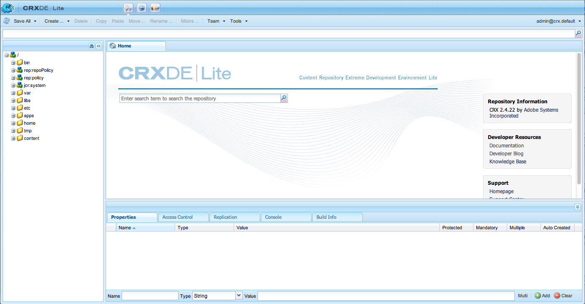

# Instalação independente personalizada{#custom-standalone-install}

Esta seção descreve as opções disponíveis ao instalar uma instância AEM independente. Você também pode ler [Elementos de armazenamento](/help/sites-deploying/storage-elements-in-aem-6.md) para obter mais informações sobre a escolha do tipo de armazenamento de back-end após a instalação do AEM 6 recentemente.

## Alterar o número da porta renomeando o arquivo {#changing-the-port-number-by-renaming-the-file}

A porta padrão para AEM é 4502. Se essa porta não estiver disponível ou já estiver em uso, o Quickstart se configurará automaticamente para usar o primeiro número de porta disponível da seguinte maneira: 4502, 8080, 8081, 8082, 8083, 8084, 8085, 8888, 9362, `<*random*>`.

Você também pode definir o número da porta renomeando o arquivo jar do início rápido, de forma que o nome do arquivo inclua o número da porta; por exemplo, `cq5-publish-p4503.jar` ou `cq5-author-p6754.jar`.

Há várias regras a serem seguidas ao renomear o arquivo jar do início rápido:

* Ao renomear o arquivo, ele deve começar com `cq;` como em `cq5-publish-p4503.jar`.

* Recomenda-se que você *always* prefixar o número da porta com -p; como em cq5-publish-p4503.jar ou cq5-author-p6754.jar.

>[!NOTE]
>
>Isso garante que você não precise se preocupar em cumprir as regras usadas para extrair o número da porta:
>
>* o número da porta deve ser de 4 ou 5 dígitos
>* esses dígitos devem vir depois de um traço
>* se houver outros dígitos no nome do arquivo, o número da porta deverá ter o prefixo `-p`
>* o prefixo &quot;cq5&quot; no início do nome do arquivo é ignorado
>


>[!NOTE]
>
>Você também pode alterar o número da porta usando o `-port` no comando iniciar.

### Considerações sobre o Java 11 {#java-considerations}

Se você estiver executando o Oracle Java 11 (ou, em geral, versões do Java mais recentes do que 8), será necessário adicionar opções adicionais à linha de comando ao iniciar o AEM.

* O seguinte - `-add-opens` os switches precisam ser adicionados para impedir que o reflexo relacionado acesse as mensagens de AVISO no `stdout.log`

```shell
--add-opens=java.desktop/com.sun.imageio.plugins.jpeg=ALL-UNNAMED --add-opens=java.base/sun.net.www.protocol.jrt=ALL-UNNAMED --add-opens=java.naming/javax.naming.spi=ALL-UNNAMED --add-opens=java.xml/com.sun.org.apache.xerces.internal.dom=ALL-UNNAMED --add-opens=java.base/java.lang=ALL-UNNAMED --add-opens=java.base/jdk.internal.loader=ALL-UNNAMED --add-opens=java.base/java.net=ALL-UNNAMED -Dnashorn.args=--no-deprecation-warning
```

* Além disso, você precisa usar o `-XX:+UseParallelGC` para atenuar possíveis problemas de desempenho.

Abaixo há um exemplo de como os parâmetros adicionais da JVM devem ser exibidos ao iniciar o AEM no Java 11:

```shell
-XX:+UseParallelGC --add-opens=java.desktop/com.sun.imageio.plugins.jpeg=ALL-UNNAMED --add-opens=java.base/sun.net.www.protocol.jrt=ALL-UNNAMED --add-opens=java.naming/javax.naming.spi=ALL-UNNAMED --add-opens=java.xml/com.sun.org.apache.xerces.internal.dom=ALL-UNNAMED --add-opens=java.base/java.lang=ALL-UNNAMED --add-opens=java.base/jdk.internal.loader=ALL-UNNAMED --add-opens=java.base/java.net=ALL-UNNAMED -Dnashorn.args=--no-deprecation-warning
```

Finalmente, se você estiver executando uma instância atualizada do AEM 6.3, verifique se a seguinte propriedade está definida como **true** under `sling.properties`:

* `felix.bootdelegation.implicit`

## Modos de execução {#run-modes}

**Modos de execução** permitir ajustar a instância do AEM para uma finalidade específica; por exemplo, criar ou publicar, testar, desenvolver, intranet etc. Esses modos também permitem controlar o uso de conteúdo de amostra. Esse conteúdo de amostra é definido antes da inicialização rápida ser criada e pode incluir pacotes, configurações, etc. Isso pode ser particularmente útil para instalações prontas para produção, quando você desejar manter sua instalação limpa e sem conteúdo de amostra. Para obter mais informações, consulte:

* [Modos de execução](/help/sites-deploying/configure-runmodes.md)

## Adicionar um provedor de instalação de arquivo {#adding-a-file-install-provider}

Por padrão, a pasta `crx-quickstart/install` O é observado por arquivos.
Essa pasta não existe, mas pode ser criada no tempo de execução.

Se um pacote, uma configuração ou um pacote de conteúdo for colocado nesse diretório, ele será automaticamente selecionado e instalado. Se for removido, ele será desinstalado.
É outra maneira de colocar pacotes, pacotes de conteúdo ou configurações no repositório.

Isso é especialmente interessante para vários casos de uso:

* Durante o desenvolvimento, pode ser mais fácil colocar algo no sistema de arquivos.
* Se algo der errado, o console da Web e o repositório não poderão ser acessados. Com isso, você pode colocar pacotes adicionais nesse diretório e eles devem ser instalados.
* O `crx-quickstart/install` A pasta pode ser criada antes do início rápido, e pacotes adicionais podem ser colocados lá.

>[!NOTE]
>
>Consulte também [Como instalar pacotes CRX automaticamente na inicialização do servidor](https://helpx.adobe.com/experience-manager/kb/HowToInstallPackagesUsingRepositoryInstall.html) para obter exemplos.

## Instalar e iniciar o Adobe Experience Manager as a Windows Service {#installing-and-starting-adobe-experience-manager-as-a-windows-service}

>[!NOTE]
>
>Certifique-se de executar o procedimento a seguir enquanto estiver conectado como Administrador ou inicie/execute essas etapas usando o **Executar como administrador** seleção do menu de contexto.
>
>O logon como usuário com privilégios de administrador é **insuficiente**. Se você não tiver feito logon como administrador ao concluir essas etapas, você receberá **Acesso negado** erros.

Para instalar e iniciar o AEM como um serviço do Windows:

1. Abra o arquivo crx-quickstart\opt\helpers\instsrv.bat em um editor de texto.
1. Se você estiver configurando um servidor Windows de 64 bits, substitua todas as instâncias de prunsrv por um dos seguintes comandos, de acordo com seu sistema operacional:

   * prunsrv_amd64
   * prunsrv_ia64

   Este comando chama o script apropriado que inicia o daemon de serviço do Windows em Java de 64 bits em vez de Java de 32 bits.

1. Para evitar que o processo bifurque em mais de um processo, aumente o parâmetro da JVM PermGen. Localize a variável `set jvm_options` e defina o valor da seguinte maneira:

   `set jvm_options=-Xmx1792m`

1. Abra o Prompt de comando, altere o diretório atual para a pasta crx-quickstart/opt/helpers da instalação AEM e insira o seguinte comando para criar o serviço:

   `instsrv.bat cq5`

   Para verificar se o serviço foi criado, abra Serviços no painel de controle Ferramentas Administrativas ou digite `start services.msc` em Prompt de comando. O serviço cq5 é exibido na lista.

1. Inicie o serviço seguindo um destes procedimentos:

   * No painel Controle de serviços , clique em cq5 e em Iniciar.

   

   * Na linha de comando, digite net start cq5.

   

1. O Windows indica que o serviço está em execução. AEM é iniciado e o executável prunsrv é exibido no Gerenciador de tarefas. No navegador da Web, navegue até AEM, por exemplo, `https://localhost:4502` para começar a usar o AEM.

   

>[!NOTE]
>
>Os valores de propriedade no arquivo instsrv.bat são usados ao criar o serviço do Windows. Se você editar os valores de propriedade em instsrv.bat, deverá desinstalar e depois reinstalar o serviço.

>[!NOTE]
>
>Ao instalar o AEM como serviço, você deve fornecer o caminho absoluto para o diretório de logs em `com.adobe.xmp.worker.files.ncomm.XMPFilesNComm` do Configuration Manager.

Para desinstalar o serviço, clique em **Stop** no **Serviços** no painel de controle ou na linha de comando, navegue até a pasta e digite `instsrv.bat -uninstall cq5`. O serviço é removido da lista no **Serviços** painel de controle ou da lista na linha de comando ao digitar `net start`.

## Redefinição do local do diretório de trabalho temporário {#redefining-the-location-of-the-temporary-work-directory}

O local padrão da pasta temporária da máquina java é `/tmp`. AEM também usa essa pasta, por exemplo, ao criar pacotes.

Se quiser alterar o local da pasta temporária (por exemplo, se precisar de um diretório com mais espaço livre), defina um * `<new-tmp-path>`* adicionando o parâmetro da JVM:

`-Djava.io.tmpdir="/<*new-tmp-path*>"`

para:

* linha de comando de inicialização do servidor
* o parâmetro de ambiente CQ_JVM_OPTS no script serverctl ou start

## Outras opções disponíveis no arquivo Quickstart {#further-options-available-from-the-quickstart-file}

Outras opções e convenções de renomeação estão descritas no arquivo de ajuda do Quickstart, que está disponível por meio da opção -help. Para acessar a ajuda, digite:

* `java -jar cq-quickstart-6.5.0.jar -help`

>[!CAUTION]
>
>Essas opções são válidas a partir da versão original do AEM 6.5 (6.5.0.0). Alterações em versões posteriores da controladora são possíveis.

```shell
Loading quickstart properties: default
Loading quickstart properties: instance
Setting properties from filename '/Users/Desktop/AEM/cq-quickstart-6.5.0.jar'
--------------------------------------------------------------------------------
Adobe Experience Manager Quickstart (build 20190328)                            
--------------------------------------------------------------------------------
Usage:                                                                          
 Use these options on the Quickstart command line.                              
--------------------------------------------------------------------------------

-help (--help,-h)
         Show this help message                                                 
-quickstart.server.port (-p,-port) <port>
         Set server port number                                                 
-contextpath (-c,-org.apache.felix.http.context_path) <contextpath>
         Set context path                                                       
-debug <port>
         Enable Java Debugging on port number; forces forking                   
-gui 
         Show GUI if running on a terminal                                      
-nobrowser (-quickstart.nobrowser)
         Do not open browser at startup                                         
-unpack
         Unpack installation files only, do not start the server (implies       
         -verbose)                                                              
-v (-verbose)
         Do not redirect stdout/stderr to files and do not close stdin          
-nofork
         Do not fork the JVM, even if not running on a console                  
-fork
         Force forking the JVM if running on a console, using recommended       
         default memory settings for the forked JVM.                            
-forkargs <args> [<args> ...]
         Additional arguments for the forked JVM, defaults to '-Xmx1024m        
         -XX:MaxPermSize=256m '.  Use -- to specify values starting with -,     
         example: '-forkargs -- -server'                                        
-a (--interface) <interface>
         Optional IP address (interface) to bind to                             
-pt <string>
         Process type (main/fork) - do not use directly, used when forking a    
         process                                                                
-r <string> [<string> [<string> [<string> [<string> [<string> [<string> [<string> [<string> [<string>]]]]]]]]]
         Runmode(s) - Use this to define the run mode(s)                        
-b <string>
         Base folder - defines the path under which the quickstart work folder  
         is created                                                             
-low-mem-action <string>
         Low memory action - what to do if memory is insufficient at startup    
-use-control-port
         Start a control port                                                   
-nointeractive
         Start with no interactivity                                            
-ll <level>
         Define launchpad log level (1 = error...4 = debug)                     
-n   
         Do not install shutdown hook                                           
-D<property>=<value>
         Additional framework properties.                                       
-listener-port <listener-port>
         Set listener port number                                               
-x <string>
         Run a Quickstart extension.                                            
  Options for executing Quickstart extensions:
                                                                                
    -xargs <arg> [<arg> ...]
         Construct an arguments list for a Quickstart extension (e.g. -xargs -- 
         -arg1 val1 -arg2 val2).                                                
--------------------------------------------------------------------------------
Quickstart filename options                                                     
--------------------------------------------------------------------------------
Usage:                                                                          
 Rename the jar file, including one of the patterns shown below, to set the     
corresponding option. Command-line options have priority on these filename      
patterns.                                                                       
--------------------------------------------------------------------------------

-NNNN
         Include -NNNN.jar or -pNNNN in the renamed jar filename to run on port 
         NNNN, for example: quickstart-8085.jar                                 
-nobrowser
         Include -nobrowser in the renamed jar filename to avoid opening the    
         browser at startup, example: quickstart-nobrowser-8085.jar             
-publish
         Include -publish in the renamed jar filename to run in "publish" mode, 
         example: cq-publish-7502.jar                                           
-dynamicmedia
         Include -dynamicmedia in the renamed jar filename to run in            
         "dynamicmedia" mode, example: quickstart-dynamicmedia-4502.jar         
-dynamicmedia_scene7
         Include -dynamicmedia_scene7 in the renamed jar filename to run in     
         "dynamicmedia_scene7" mode, example:                                   
         quickstart-dynamicmedia_scene7-p4502.jar                               
--------------------------------------------------------------------------------
The license.properties file
--------------------------------------------------------------------------------
  The license.properties file stores licensing information, created from the    
  licensing form displayed on first startup and stored in the folder from where 
  Quickstart is run.                                                            
--------------------------------------------------------------------------------
Log files
--------------------------------------------------------------------------------
  Once Quickstart has been unpacked and started, log files can be found under   
  /Users/aheimoz/CQInstallationKits/AEM-65150-L8/crx-quickstart/logs.           
--------------------------------------------------------------------------------
```

## Instalação de AEM no ambiente Amazon EC2 {#installing-aem-in-the-amazon-ec-environment}

Ao instalar o AEM em uma instância do Amazon Elastic Compute Cloud (EC2), se você instalar o autor e publicar na instância do EC2, a instância do Autor será instalada corretamente seguindo o procedimento em [Instalar instâncias do gerenciador de AEM](#installinginstancesofaemmanager); no entanto, a instância Publicar se torna Autor.

Antes de instalar a instância de publicação no ambiente EC2, faça o seguinte:

1. Descompacte o arquivo jar da instância de publicação antes de iniciar a instância pela primeira vez. Para descompactar o arquivo, use o seguinte comando:

   ```xml
   java -jar quickstart.jar -unpack
   ```

   >[!NOTE]
   >
   >Se alterar o modo **after** iniciando a instância na primeira vez, não é possível alterar o modo de execução.

1. Inicie a instância executando:

   ```xml
   java -jar quickstart.jar -r publish
   ```

   >[!CAUTION]
   >
   >Certifique-se de executar a instância primeiro depois de descompactá-la, executando o comando acima. Caso contrário, o preenchimento quickstart.properties não será gerado. Sem esse arquivo, qualquer atualização futura de AEM falhará.

1. No **compartimento** , abra o **start** e verifique a seguinte seção:

   ```xml
   # runmode(s)
   if [ -z "$CQ_RUNMODE" ]; then
    CQ_RUNMODE='author'
   fi
   ```

1. Altere o modo de execução para **publicar** e salve o arquivo.

   ```xml
   # runmode(s)
   if [ -z "$CQ_RUNMODE" ]; then
    CQ_RUNMODE='publish'
   fi
   ```

1. Pare a instância e reinicie-a executando o **start** script.

## Verificando a instalação {#verifying-the-installation}

Os links a seguir podem ser usados para verificar se a instalação está operacional (todos os exemplos são baseados em que a instância está sendo executada na porta 8080 do host local, que o CRX está instalado em /crx e o Launchpad em /):

* `https://localhost:8080/crx/de`
O console CRXDE Lite.

* `https://localhost:8080/system/console`
O Console da Web.

## Ações após a instalação {#actions-after-installation}

Embora haja muitas possibilidades de configurar AEM WCM, algumas ações devem ser tomadas ou, pelo menos, revisadas imediatamente após a instalação:

* Consulte o [Lista de verificação de segurança](/help/sites-administering/security-checklist.md) para tarefas necessárias para garantir que seu sistema permaneça seguro.
* Revise a lista de usuários e grupos padrão instalados com AEM WCM. Verifique se deseja tomar alguma medida em outras contas - consulte [Segurança e administração de usuários](/help/sites-administering/security.md) para obter mais detalhes.

## Acesso ao CRXDE Lite e ao Console da Web {#accessing-crxde-lite-and-the-web-console}

Depois que AEM WCM for iniciado, você também poderá acessar:

* [CRXDE Lite](#accessing-crxde-lite) - usado para acessar e gerenciar o repositório
* [Console da Web](#accessing-the-web-console) - usado para gerenciar ou configurar os pacotes OSGi (também conhecido como console OSGi)

### Acesso ao CRXDE Lite {#accessing-crxde-lite}

Para abrir o CRXDE Lite, você pode selecionar **CRXDE Lite** na tela de boas-vindas ou use seu navegador para navegar até

```
 https://<<i>host</i>>:<<i>port</i>>/crx/de/index.jsp
```

Por exemplo:
`https://localhost:4502/crx/de/index.jsp`



#### Acesso ao Console da Web {#accessing-the-web-console}

Para acessar o console da Web do Adobe CQ, você pode selecionar **Console OSGi** na tela de boas-vindas ou use seu navegador para navegar até

```
 https://<host>:<port>/system/console
```

Por exemplo:
`https://localhost:4502/system/console`
ou para a página Pacotes
`https://localhost:4502/system/console/bundles`


Consulte [Configuração do OSGi com o console da Web](/help/sites-deploying/configuring-osgi.md#osgi-configuration-with-the-web-console) para obter mais detalhes.

## Resolução de problemas {#troubleshooting}

Para obter informações sobre como lidar com problemas que podem surgir durante a instalação, consulte:

* [Resolução de problemas](/help/sites-deploying/troubleshooting.md)

## Desinstalação do Adobe Experience Manager {#uninstalling-adobe-experience-manager}

Como o AEM é instalado em um único diretório, não há necessidade de um utilitário de desinstalação. A desinstalação pode ser tão simples quanto excluir todo o diretório de instalação, embora a forma como você desinstala o AEM dependa do que você deseja alcançar e do armazenamento persistente que você usa.

Se o armazenamento persistente estiver incorporado no diretório de instalação, por exemplo, na instalação padrão do TarPM, a exclusão de pastas também removerá os dados.

>[!NOTE]
>
>O Adobe recomenda fazer backup do repositório antes de excluir o AEM. Se você excluir o todo &lt;cq-installation-directory>, você excluirá o repositório. Para manter os dados do repositório antes de excluir, mover ou copiar o &lt;cq-installation-directory>/crx-quickstart/repository folder em outro lugar antes de excluir as outras pastas.

Se a sua instalação do AEM usar armazenamento externo, por exemplo, um servidor de banco de dados, a remoção de uma pasta não removerá os dados automaticamente, mas removerá a configuração de armazenamento, o que dificulta a restauração do conteúdo JCR.
