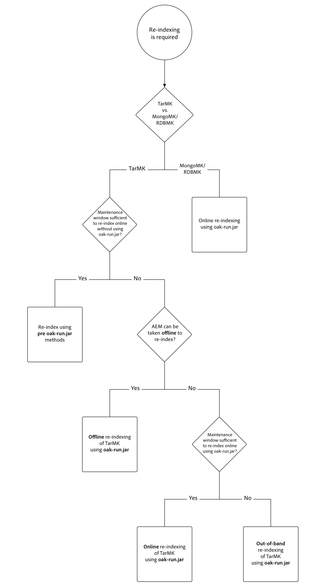

# Indexação via Jar Oak-run {#indexing-via-the-oak-run-jar}

Oak-run suporta todos os casos de uso de indexação na linha de comando sem precisar operar a partir do nível JMX. As vantagens da abordagem do carvalho são:

1. É um novo conjunto de ferramentas de indexação para AEM 6.4
1. Diminui o tempo de reindexação, o que afeta positivamente os tempos de reindexação em repositórios maiores
1. Ela está reduzindo o consumo de recursos durante a reindexação em AEM, o que resulta em melhor desempenho do sistema para outras atividades AEM
1. Oak-run oferece suporte fora de banda: Se as condições de produção não permitirem a execução de reindexação em instâncias de produção, um ambiente clonado poderá ser usado para reindexação, a fim de evitar um impacto crítico no desempenho.

Abaixo, você encontrará uma lista de casos de uso que podem ser aproveitados ao executar operações de indexação por meio da ferramenta `oak-run`.

## Verificações de consistência de índice {#indexconsistencychecks}

>[!NOTE]
>
>Para obter informações mais detalhadas sobre esse cenário, consulte [Caso de uso 1 - Verificação de consistência do índice](/help/sites-deploying/oak-run-indexing-usecases.md#usercase1indexconsistencycheck).

* `oak-run.jar`determina rapidamente se os índices de carvalho de lucene estão corrompidos.
* É seguro executar em uma instância AEM em uso para verificar a consistência dos níveis 1 e 2.

## Estatísticas do Índice {#indexstatistics}

>[!NOTE]
>
>Para obter informações mais detalhadas sobre esse cenário, consulte [Caso de uso 2 - Estatísticas do índice](/help/sites-deploying/oak-run-indexing-usecases.md#usecase2indexstatistics)

* `oak-run.jar` descarta todas as definições de índice, estatísticas de índice importantes e conteúdo de índice para a análise offline.
* É seguro executar em uma instância AEM em uso.

## Reindexação da árvore decisória da abordagem {#reindexingapproachdecisiontree}

Este diagrama é uma árvore decisória para quando usar as várias abordagens de reindexação.

## Indexando novamente MongoMK / RDMBMK {#reindexingmongomk}

>[!NOTE]
>
>Para obter informações mais detalhadas sobre esse cenário, consulte [Caso de uso 3 - Reindexação](/help/sites-deploying/oak-run-indexing-usecases.md#usecase3reindexing).

### Pré-extração de texto para SegmentNodeStore e DocumentNodeStore {#textpre-extraction}

[A pré-extração](/help/sites-deploying/best-practices-for-queries-and-indexing.md#how-to-perform-text-pre-extraction)  de texto (um recurso que já existia com AEM 6.3) pode ser usada para reduzir o tempo de reindexação. A pré-extração de texto pode ser usada em conjunto com todas as abordagens de reindexação.

Dependendo da abordagem de indexação `oak-run.jar`, haverá várias etapas em ambos os lados da etapa Executar reindexação no diagrama abaixo.

>[!NOTE]
>
>Laranja denota atividades onde AEM deve estar em uma janela de manutenção.

### Reindexação online para MongoMK ou RDBMK usando oak-run.jar {#onlinere-indexingformongomk}

>[!NOTE]
>
>Para obter informações mais detalhadas sobre esse cenário, consulte [Reindexar - DocumentNodeStore](/help/sites-deploying/oak-run-indexing-usecases.md#reindexdocumentnodestore).

Este é o método recomendado para reindexar instalações de AEM MongoMK (e RDBMK). Nenhum outro método deve ser usado.

Esse processo precisa ser executado somente em uma única instância AEM no cluster.

## Reindexação do TarMK {#re-indexingtarmk}

>[!NOTE]
>
>Para obter informações mais detalhadas sobre esse cenário, consulte [Reindexar - SegmentNodeStore](/help/sites-deploying/oak-run-indexing-usecases.md#reindexsegmentnodestore).

* **Considerações sobre o modo de espera frio (TarMK)**

   * Não existe uma atenção especial ao modo de espera a frio; as instâncias do modo de espera frio sincronizarão as alterações como de costume.

* **Farms de publicação do AEM (os Farms de publicação do AE devem sempre ser TarMK)**

   * Para o farm de publicação, ele precisa ser feito para todos OU executar as etapas em uma única publicação e clonar a configuração para outros (tomando todas as precauções habituais ao clonar instâncias AEM; sling.id - deve criar um link para algo aqui)

### Indexação on-line para TarMK {#onlinere-indexingfortarmk}

>[!NOTE]
>
>Para obter informações mais detalhadas sobre este cenário, consulte [Reindexação Online - SegmentNodeStore](/help/sites-deploying/oak-run-indexing-usecases.md#onlinereindexsegmentnodestore).

Este é o método usado antes da introdução dos novos recursos de indexação de oak-run.jar. Isso pode ser feito configurando a propriedade `reindex=true` no índice Oak.

Essa abordagem pode ser usada se os efeitos de tempo e desempenho para indexar forem aceitáveis para o cliente. Este é frequentemente o caso das instalações AEM de pequena a média dimensão.

### Indexação on-line do TarMK usando oak-run.jar {#onlinere-indexingtarmkusingoak-run-jar}

>[!NOTE]
>
>Para obter informações mais detalhadas sobre esse cenário, consulte [Reindexação Online - SegmentNodeStore - A instância AEM está em execução](/help/sites-deploying/oak-run-indexing-usecases.md#onlinereindexsegmentnodestoretheaeminstanceisrunning).

A reindexação online do TarMK é mais rápida do que a reindexação Online do TarkMK descrita acima. No entanto, também requer execução durante uma janela de manutenção, com a indicação de que a janela será mais curta e mais etapas são necessárias para executar a reindexação.

>[!NOTE]
>
>Laranja significa operações nas quais AEM devem ser efetuadas num período de manutenção.

### Indexação offline do TarMK usando oak-run.jar {#offlinere-indexingtarmkusingoak-run-jar}

>[!NOTE]
>
>Para obter informações mais detalhadas sobre este cenário, consulte [Reindexação Online - SegmentNodeStore - A Instância AEM é Desligada](/help/sites-deploying/oak-run-indexing-usecases.md#onlinereindexsegmentnodestoreaeminstanceisdown).

A reindexação offline do TarMK é a abordagem de reindexação `oak-run.jar` mais simples para o TarMK, pois requer um único comentário `oak-run.jar`. No entanto, requer que a instância AEM seja desligada.

>[!NOTE]
>
>Vermelho denota operações em que AEM deve ser desligado.

### Indexação de TarMK fora de banda usando oak-run.jar {#out-of-bandre-indexingtarmkusingoak-run-jar}

>[!NOTE]
>
>Para obter informações mais detalhadas sobre esse cenário, consulte [Índice fora da banda - SegmentNodeStore](/help/sites-deploying/oak-run-indexing-usecases.md#outofbandreindexsegmentnodestore).

A reindexação fora de banda minimiza o impacto da reindexação em instâncias AEM em uso.

>[!NOTE]
>
>Vermelho denota operações nas quais AEM pode ser desligado.

## Atualizando Definições de Indexação {#updatingindexingdefinitions}

>[!NOTE]
>
>Para obter informações mais detalhadas sobre esse cenário, consulte [Caso de uso 4 - Atualização das definições de índice](/help/sites-deploying/oak-run-indexing-usecases.md#usecase4updatingindexdefinitions).

### Criando e atualizando definições de índice no TarMK usando o ACS > Verificar índice {#creatingandupdatingindexdefinitionsontarmkusingacsensureindex}

>[!NOTE]
>
>O Índice de garantia ACS é um projeto suportado pela comunidade e não é suportado pelo Suporte a Adobe.

Isso permite que a definição do índice de envio seja feita por meio de um pacote de conteúdo, o que resulta em uma reindexação por meio da configuração do sinalizador de reíndice como `true`. Isso funciona para configurações menores em que a reindexação não leva muito tempo.

Para obter mais informações, consulte a [documentação de garantia de índice ACS](https://adobe-consulting-services.github.io/acs-aem-commons/features/ensure-oak-index/index.html) para obter detalhes.

### Criação e atualização de definições de índice no TarMK usando oak-run.jar {#creatingandupdatingindexdefinitionsontarmkusingoak-run-jar}

Se o impacto de tempo ou desempenho da reindexação usando métodos diferentes de `oak-run.jar` for muito alto, a seguinte abordagem baseada em `oak-run.jar` poderá ser usada para importar e reindexar definições do Índice Lucene em uma instalação AEM baseada em TarMK.

### Criando e Atualizando Definições de Índice no MonogMK usando oak-run.jar {#creatingandupdatingindexdefinitionsonmonogmkusingoak-run-jar}

Se o impacto de tempo ou desempenho da reindexação usando métodos diferentes de `oak-run.jar` for muito alto, a seguinte abordagem baseada em `oak-run.jar` poderá ser usada para importar e reindexar definições do Índice Lucene em instalações de AEM baseadas em MongoMK.

