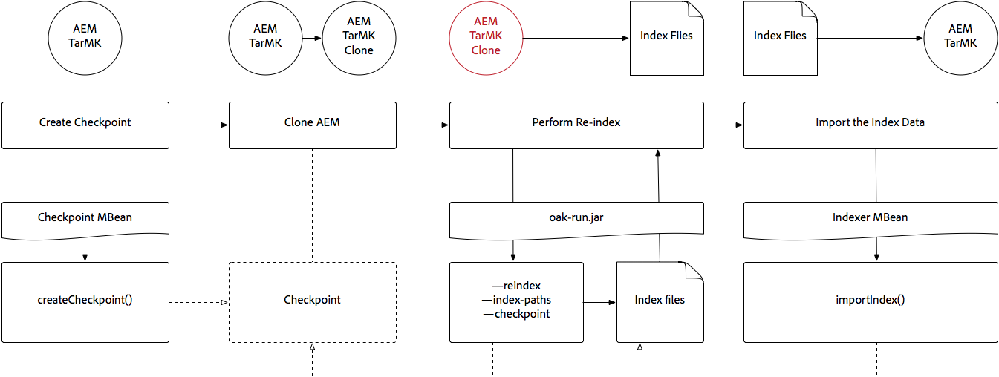

# Indexação por meio do Oak-run Jar {#indexing-via-the-oak-run-jar}

O Oak-run suporta todos os casos de uso de indexação na linha de comando sem precisar operar a partir do nível JMX. As vantagens da abordagem oak-run são:

1. É um novo conjunto de ferramentas de indexação para o AEM 6.4
1. Ele diminui o tempo para reindexação, o que afeta de maneira benéfica os tempos de reindexação em repositórios maiores
1. Ela está reduzindo o consumo de recursos durante a reindexação no AEM, o que resulta em melhor desempenho do sistema para outras atividades do AEM
1. O Oak-run oferece suporte fora de banda: se as condições de produção não permitirem que você execute a reindexação em instâncias de produção, um ambiente clonado poderá ser usado para a reindexação para evitar impacto crítico no desempenho.

Veja abaixo uma lista de casos de uso que podem ser usados ao executar operações de indexação por meio da `oak-run` ferramenta.

## Verificações de consistência de índice {#indexconsistencychecks}

>[!NOTE]
>
>Para obter informações mais detalhadas sobre esse cenário, consulte [Caso de uso 1 - Verificação de consistência do índice](/help/sites-deploying/oak-run-indexing-usecases.md#usercase1indexconsistencycheck).

* `oak-run.jar`determina rapidamente se os índices do Lucene Oak estão corrompidos.
* É seguro executar em uma instância de AEM em uso para verificar a consistência nos níveis 1 e 2.

## Estatísticas de índice {#indexstatistics}

>[!NOTE]
>
>Para obter informações mais detalhadas sobre esse cenário, consulte [Caso de uso 2 - Estatísticas de índice](/help/sites-deploying/oak-run-indexing-usecases.md#usecase2indexstatistics)

* `oak-run.jar` despeja todas as definições de índice, estatísticas de índice importantes e conteúdo de índice para análise offline.
* É seguro executar em uma instância de AEM em uso.

## Árvore de decisão da abordagem de reindexação {#reindexingapproachdecisiontree}

Este diagrama é uma árvore decisória para quando usar as várias abordagens de reindexação.

## Reindexação MongoMK / RDMBMK {#reindexingmongomk}

>[!NOTE]
>
>Para obter informações mais detalhadas sobre esse cenário, consulte [Caso de uso 3 — Reindexação](/help/sites-deploying/oak-run-indexing-usecases.md#usecase3reindexing).

### Pré-extração de texto para SegmentNodeStore e DocumentNodeStore {#textpre-extraction}

[Pré-extração de texto](/help/sites-deploying/best-practices-for-queries-and-indexing.md#how-to-perform-text-pre-extraction) (um recurso que existe com o AEM 6.3) pode ser usado para reduzir o tempo de reindexação. A pré-extração de texto pode ser usada com todas as abordagens de reindexação.

Dependendo do `oak-run.jar` abordagem de indexação, há várias etapas em ambos os lados da etapa Executar reindexação no diagrama abaixo.

>[!NOTE]
>
>Laranja indica atividades em que o AEM deve estar em uma janela de manutenção.

### Reindexação online para MongoMK ou RDBMK usando oak-run.jar {#onlinere-indexingformongomk}

>[!NOTE]
>
>Para obter informações mais detalhadas sobre esse cenário, consulte [Reindexar - DocumentNodeStore](/help/sites-deploying/oak-run-indexing-usecases.md#reindexdocumentnodestore).

Este é o método recomendado para reindexar instalações de AEM MongoMK (e RDBMK). Nenhum outro método deve ser usado.

Execute esse processo somente em uma única instância AEM no cluster.

## Reindexação do TarMK {#re-indexingtarmk}

>[!NOTE]
>
>Para obter informações mais detalhadas sobre esse cenário, consulte [Reindexar - SegmentNodeStore](/help/sites-deploying/oak-run-indexing-usecases.md#reindexsegmentnodestore).

* **Considerações sobre o modo de espera a frio (TarMK)**

   * Não há considerações especiais para o Modo de Espera a Frio; as instâncias de Modo de Espera a Frio sincronizam as alterações como de costume.

* **Farms de publicação do AEM (Farms de publicação do AEM devem ser sempre TarMK)**

   * Para o farm de publicação, isso deve ser feito para todas OU executar as etapas em uma única publicação. Em seguida, clone a configuração para outros (tomando todas as precauções normais ao clonar instâncias de AEM; sling.id - deve vincular a algo aqui).

### Reindexação online para TarMK {#onlinere-indexingfortarmk}

>[!NOTE]
>
>Para obter informações mais detalhadas sobre esse cenário, consulte [Reindexação online - SegmentNodeStore](/help/sites-deploying/oak-run-indexing-usecases.md#onlinereindexsegmentnodestore).

Este é o método usado antes da introdução dos novos recursos de indexação do oak-run.jar. Isso é feito configurando o `reindex=true` no índice Oak.

Essa abordagem pode ser usada se os efeitos de tempo e desempenho para indexação forem aceitáveis para o cliente. Este é frequentemente o caso das instalações de AEM de pequena a média dimensão.

### Reindexação online do TarMK usando oak-run.jar {#onlinere-indexingtarmkusingoak-run-jar}

>[!NOTE]
>
>Para obter informações mais detalhadas sobre esse cenário, consulte [Reindexação online - SegmentNodeStore - A instância do AEM está em execução](/help/sites-deploying/oak-run-indexing-usecases.md#onlinereindexsegmentnodestoretheaeminstanceisrunning).

A reindexação online do TarMK usando o oak-run.jar é mais rápida do que a [Reindexação online para TarMK](#onlinere-indexingfortarmk) acima descritas. No entanto, também requer a execução durante uma janela de manutenção; com a menção de que a janela é mais curta e mais etapas são necessárias para executar a reindexação.

>[!NOTE]
>
>Laranja indica operações em que o AEM deve ser executado em um período de manutenção.

### Reindexação offline do TarMK usando oak-run.jar {#offlinere-indexingtarmkusingoak-run-jar}

>[!NOTE]
>
>Para obter informações mais detalhadas sobre esse cenário, consulte [Reindexação online - SegmentNodeStore - A instância do AEM está desligada](/help/sites-deploying/oak-run-indexing-usecases.md#onlinereindexsegmentnodestoreaeminstanceisdown).

A reindexação offline do TarMK é a mais simples `oak-run.jar` abordagem de reindexação baseada na TarMK, uma vez que requer uma única `oak-run.jar` comentário. No entanto, exige que a instância do AEM seja desligada.

>[!NOTE]
>
>Vermelho indica operações em que o AEM deve ser desligado.

### Re-indexação fora de banda do TarMK usando oak-run.jar  {#out-of-bandre-indexingtarmkusingoak-run-jar}

>[!NOTE]
>
>Para obter informações mais detalhadas sobre esse cenário, consulte [Reindexação fora de banda - SegmentNodeStore](/help/sites-deploying/oak-run-indexing-usecases.md#outofbandreindexsegmentnodestore).

A reindexação fora de banda minimiza o impacto da reindexação em instâncias AEM em uso.

>[!NOTE]
>
>Vermelho indica operações em que o AEM pode ser desligado.

## Atualizando Definições de Indexação {#updatingindexingdefinitions}

>[!NOTE]
>
>Para obter informações mais detalhadas sobre esse cenário, consulte [Caso de uso 4 - Atualização das definições de índice](/help/sites-deploying/oak-run-indexing-usecases.md#usecase4updatingindexdefinitions).

### Criação e atualização das definições de índice no TarMK usando o ACS Ensure Index {#creatingandupdatingindexdefinitionsontarmkusingacsensureindex}

>[!NOTE]
>
>ACS Verifique se o índice é um projeto suportado pela comunidade e não é compatível com o suporte do Adobe.

Isso permite a definição do índice de envio por meio do pacote de conteúdo, o que resultará posteriormente na reindexação por meio da configuração do sinalizador de reindexação como `true`. Isso funciona para configurações menores em que a reindexação não leva muito tempo.

Para obter mais informações, consulte [ACS Assegure a documentação do índice](https://adobe-consulting-services.github.io/acs-aem-commons/features/ensure-oak-index/index.html) para obter detalhes.

### Criando e atualizando definições de índice no TarMK usando oak-run.jar {#creatingandupdatingindexdefinitionsontarmkusingoak-run-jar}

Se o impacto no tempo ou no desempenho da reindexação usando`oak-run.jar` for muito alto, o seguinte `oak-run.jar` abordagem baseada em TarMK pode ser usada para importar e reindexar definições de Índice Lucene em uma instalação de AEM baseada em TarMK.

### Criação e atualização de definições de índice no MonogMK usando oak-run.jar {#creatingandupdatingindexdefinitionsonmonogmkusingoak-run-jar}

Se o impacto no tempo ou no desempenho da reindexação usando`oak-run.jar` for muito alto, o seguinte `oak-run.jar` abordagem baseada em pode ser usada para importar e reindexar definições do Índice Lucene em instalações de AEM baseadas em MongoMK.

