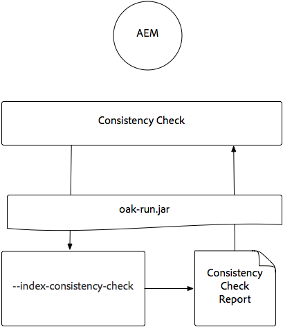

# Indexação via Jar Oak-run {#indexing-via-the-oak-run-jar}

O Oak-run suporta todos os casos de uso de indexação na linha de comando sem ter que operar a partir do nível JMX. As vantagens da abordagem do carvalho são:

1. É um novo conjunto de ferramentas de indexação para o AEM 6.4
1. Ele reduz o tempo de reindexação, o que afeta positivamente os tempos de reindexação em repositórios maiores
1. Ela está reduzindo o consumo de recursos durante a reindexação no AEM, o que resulta em melhor desempenho do sistema para outras atividades AEM
1. O Oak-run oferece suporte fora de banda: Se as condições de produção não permitirem a execução de reindexação em instâncias de produção, um ambiente clonado poderá ser usado para reindexação para evitar um impacto crítico no desempenho.

Abaixo você encontrará uma lista de casos de uso que podem ser aproveitados ao executar operações de indexação por meio da ferramenta `oak-run`.

## Verificações de consistência de índice {#indexconsistencychecks}

>[!NOTE]
>
>Para obter informações mais detalhadas sobre esse cenário, consulte [Caso de uso 1 - Verificação de consistência de índice](/help/sites-deploying/oak-run-indexing-usecases.md#usercase1indexconsistencycheck).

* `oak-run.jar`determina rapidamente se os índices do Lucene oak estão corrompidos.
* É seguro executar em uma instância de AEM em uso para verificar a consistência dos níveis 1 e 2.

## Estatísticas de índice {#indexstatistics}

>[!NOTE]
>
>Para obter informações mais detalhadas sobre esse cenário, consulte [Caso de uso 2 - Estatísticas de índice](/help/sites-deploying/oak-run-indexing-usecases.md#usecase2indexstatistics)

* `oak-run.jar` despeja todas as definições de índice, estatísticas de índice importantes e conteúdo de índice para análise offline.
* Seguro para executar em uma instância de AEM em uso.

## Árvore de decisão da abordagem de reindexação {#reindexingapproachdecisiontree}

Este diagrama é uma árvore de decisão para quando usar as várias abordagens de reindexação.

## Reindexando MongoMK / RDMBMK {#reindexingmongomk}

>[!NOTE]
>
>Para obter informações mais detalhadas sobre esse cenário, consulte [Caso de uso 3 - Reindexação](/help/sites-deploying/oak-run-indexing-usecases.md#usecase3reindexing).

### Pré-extração de texto para SegmentNodeStore e DocumentNodeStore {#textpre-extraction}

[A pré-extração de texto](/help/sites-deploying/best-practices-for-queries-and-indexing.md#how-to-perform-text-pre-extraction)  (um recurso existente com o AEM 6.3) pode ser usada para reduzir o tempo de reindexação. A pré-extração de texto pode ser usada em conjunto com todas as abordagens de reindexação.

Dependendo da abordagem de indexação `oak-run.jar`, haverá várias etapas em ambos os lados da etapa Executar reindexação no diagrama abaixo.

>[!NOTE]
>
>Laranja indica atividades em que AEM devem estar em uma janela de manutenção.

### Reindexação online para MongoMK ou RDBMK usando oak-run.jar {#onlinere-indexingformongomk}

>[!NOTE]
>
>Para obter informações mais detalhadas sobre esse cenário, consulte [Reindex - DocumentNodeStore](/help/sites-deploying/oak-run-indexing-usecases.md#reindexdocumentnodestore).

Este é o método recomendado para reindexar as instalações de AEM MongoMK (e RDBMK). Nenhum outro método deve ser usado.

Esse processo precisa ser executado somente em uma única instância do AEM no cluster.

## Reindexação do TarMK {#re-indexingtarmk}

>[!NOTE]
>
>Para obter informações mais detalhadas sobre esse cenário, consulte [Reindexar - SegmentNodeStore](/help/sites-deploying/oak-run-indexing-usecases.md#reindexsegmentnodestore).

* **Considerações sobre o modo de espera a frio (TarMK)**

   * Não existe uma atenção especial ao Cold Standby; as instâncias do Cold Standby sincronizarão as alterações como de costume.

* **Farms de publicação do AEM (os Farms de publicação do AEM devem sempre ser TarMK)**

   * Para o farm de publicação, ele precisa ser feito para todos OU executar as etapas em uma única publicação e clonar a configuração para outros (tomando todas as precisões habituais ao clonar instâncias AEM; sling.id - deve vincular a algo aqui)

### Re-indexação online para TarMK {#onlinere-indexingfortarmk}

>[!NOTE]
>
>Para obter informações mais detalhadas sobre esse cenário, consulte [Reindexação Online - SegmentNodeStore](/help/sites-deploying/oak-run-indexing-usecases.md#onlinereindexsegmentnodestore).

Este é o método usado antes da introdução dos novos recursos de indexação do oak-run.jar. Isso pode ser feito definindo a propriedade `reindex=true` no índice Oak.

Essa abordagem pode ser usada se os efeitos de tempo e desempenho a serem indexados forem aceitáveis para o cliente. Este é frequentemente o caso das instalações de AEM de pequena a média dimensão.

### Restabelecimento de Indexação Online do TarMK usando oak-run.jar {#onlinere-indexingtarmkusingoak-run-jar}

>[!NOTE]
>
>Para obter informações mais detalhadas sobre esse cenário, consulte [Online Reindex - SegmentNodeStore - The AEM Instance is Running](/help/sites-deploying/oak-run-indexing-usecases.md#onlinereindexsegmentnodestoretheaeminstanceisrunning).

A reindexação on-line do TarMK usando o oak-run.jar é mais rápida que o [Re-Indexação Online para TarMK](#onlinere-indexingfortarmk) descrito acima. No entanto, também requer execução durante uma janela de manutenção; com a menção de que a janela será mais curta e mais etapas são necessárias para executar a reindexação.

>[!NOTE]
>
>Laranja significa operações em que a AEM deve ser executada durante um período de manutenção.

### Reindexação offline do TarMK usando oak-run.jar {#offlinere-indexingtarmkusingoak-run-jar}

>[!NOTE]
>
>Para obter informações mais detalhadas sobre esse cenário, consulte [Reindexação Online - SegmentNodeStore - A Instância AEM é Encerrada](/help/sites-deploying/oak-run-indexing-usecases.md#onlinereindexsegmentnodestoreaeminstanceisdown).

A reindexação offline do TarMK é a abordagem de reindexação `oak-run.jar` mais simples para o TarMK, pois requer um único comentário `oak-run.jar`. No entanto, requer que a instância de AEM seja desligada.

>[!NOTE]
>
>Vermelho significa operações nas quais AEM devem ser encerradas.

### Re-indexação fora de banda TarMK usando oak-run.jar  {#out-of-bandre-indexingtarmkusingoak-run-jar}

>[!NOTE]
>
>Para obter informações mais detalhadas sobre esse cenário, consulte [Out of Band Reindex - SegmentNodeStore](/help/sites-deploying/oak-run-indexing-usecases.md#outofbandreindexsegmentnodestore).

A reindexação fora de banda minimiza o impacto da reindexação em instâncias de AEM em uso.

>[!NOTE]
>
>Vermelho significa operações nas quais AEM podem ser encerradas.

## Atualizando definições de indexação {#updatingindexingdefinitions}

>[!NOTE]
>
>Para obter informações mais detalhadas sobre esse cenário, consulte [Caso de uso 4 - Atualização das definições de índice](/help/sites-deploying/oak-run-indexing-usecases.md#usecase4updatingindexdefinitions).

### Criação e atualização de definições de índice no TarMK usando o ACS Assurance Index {#creatingandupdatingindexdefinitionsontarmkusingacsensureindex}

>[!NOTE]
>
>O ACS Assurance Index é um projeto suportado pela comunidade e não é suportado pelo Adobe Support.

Isso permite a definição do índice de envio por meio do pacote de conteúdo, o que resulta em reindexação por meio da configuração do sinalizador de reindexação para `true`. Isso funciona para configurações menores, onde a reindexação não leva muito tempo.

Para obter mais informações, consulte a [documentação de Garantia de Índice ACS](https://adobe-consulting-services.github.io/acs-aem-commons/features/ensure-oak-index/index.html) para obter detalhes.

### Criação e atualização de definições de índice no TarMK usando oak-run.jar {#creatingandupdatingindexdefinitionsontarmkusingoak-run-jar}

Se o impacto de tempo ou desempenho da reindexação usando métodos `oak-run.jar` diferentes for muito alto, a seguinte abordagem baseada em `oak-run.jar` poderá ser usada para importar e reindexar as definições do Índice Lucene em uma instalação de AEM baseada em TarMK.

### Criando e Atualizando Definições de Índice no MonogMK usando oak-run.jar {#creatingandupdatingindexdefinitionsonmonogmkusingoak-run-jar}

Se o impacto de tempo ou desempenho da reindexação usando métodos `oak-run.jar` diferentes for muito alto, a seguinte abordagem baseada em `oak-run.jar` poderá ser usada para importar e reindexar definições do Índice Lucene em instalações de AEM baseadas em MongoMK.

