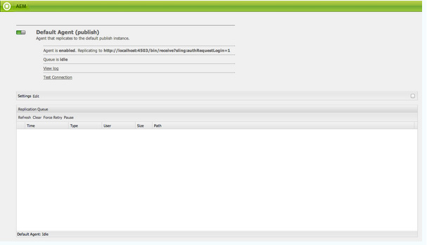
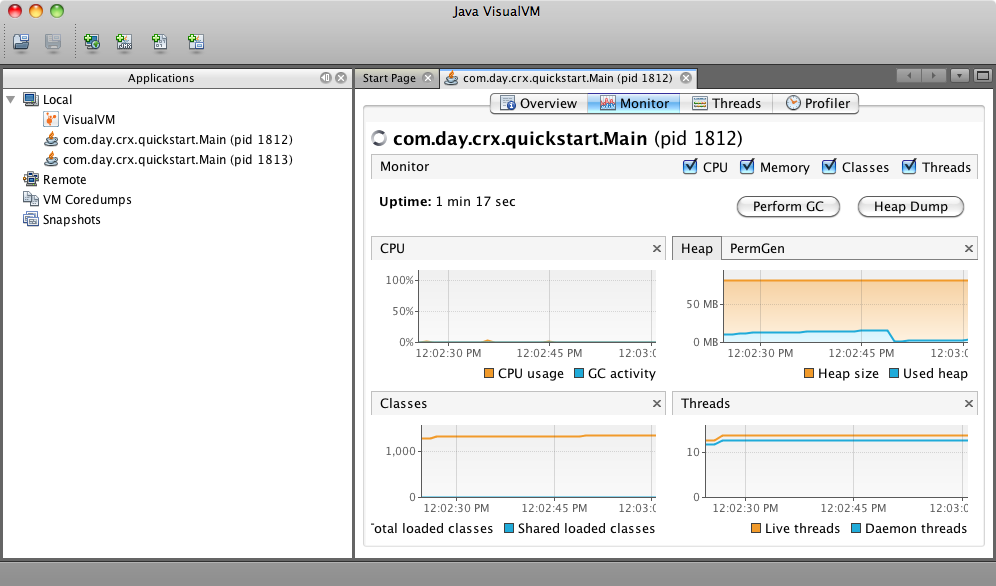

# Monitorar e manter sua instância de AEM{#monitoring-and-maintaining-your-aem-instance}

Após a implantação de suas instâncias de AEM, determinadas tarefas serão necessárias para monitorar e manter a operação, o desempenho e a integridade.

Um fator importante aqui é que, para reconhecer possíveis problemas, você precisa saber como seus sistemas se parecem e se comportam em condições normais. Isso é feito de forma mais eficaz, monitorando o sistema e coletando informações durante um período de tempo.

| Marcar | Considerações | Comentário / Ações |
|---|---|---|
| Plano de backup. |  | Consulte como [Fazer backup de sua instância](/help/sites-deploying/monitoring-and-maintaining.md#backups). |
| Plano de recuperação de desastres. | As diretrizes de recuperação de desastres de sua empresa. |  |
| Um sistema de rastreamento de erros está disponível para problemas de relatório. | Por exemplo, [bugzilla](https://www.bugzilla.org/), [jira](https://www.atlassian.com/software/jira/) ou um de muitos outros. |  |
| Os sistemas de arquivos estão sendo monitorados. | O repositório CRX será &quot;congelado&quot; se não houver espaço livre em disco suficiente. Ele será retomado assim que o espaço estiver disponível. | As mensagens &quot; `*ERROR* LowDiskSpaceBlocker`&quot; podem ser vistas no arquivo de log quando o espaço livre se tornar baixo. |
| [Os ](/help/sites-deploying/monitoring-and-maintaining.md#working-with-audit-records-and-log-files) arquivos de log estão sendo monitorados. |  |  |
| O monitoramento do sistema está (constantemente) sendo executado em segundo plano. | Incluindo utilização de CPU, memória, disco e rede. Usando, por exemplo, iostat / vmstat / perfmon. | Os dados registrados são visualizados e podem ser usados para rastrear problemas de desempenho. Dados brutos também podem ser acessados. |
| [AEM desempenho está sendo monitorado](/help/sites-deploying/monitoring-and-maintaining.md#monitoring-performance). | Incluindo [Solicitar contadores](/help/sites-deploying/monitoring-and-maintaining.md#request-counters) para monitorar os níveis de tráfego. | Caso se verifique uma perda significativa ou a longo prazo do desempenho, deve ser efetuado um inquérito pormenorizado. |
| Você está monitorando seus [Agentes de Replicação](/help/sites-deploying/monitoring-and-maintaining.md#monitoring-your-replication-agents). |  |  |
| Limpar regularmente instâncias de fluxo de trabalho. | Tamanho do repositório e desempenho do workflow. | Consulte [Limpeza regular de instâncias de fluxo de trabalho](/help/sites-administering/workflows-administering.md#regular-purging-of-workflow-instances). |

## Backups {#backups}

É uma boa prática fazer backups de:

* Instalação do software - antes/depois de alterações significativas na configuração
* O conteúdo mantido no repositório - regularmente

Sua empresa provavelmente terá uma política de backup que você precisará seguir, considerações adicionais sobre o que fazer backup e quando incluir:

* a importância do sistema e dos dados.
* com que frequência as alterações são feitas no software ou nos dados.
* volume de dados; ocasionalmente, a capacidade pode ser um problema, assim como o tempo necessário para executar o backup.
* se o backup pode ser feito enquanto os usuários estão online; e, se possível, qual é o impacto no desempenho.
* A distribuição geográfica dos utilizadores; ou seja, quando é o melhor momento para fazer backup (para minimizar o impacto)?
* sua política de recuperação de desastres; há diretrizes sobre onde os dados de backup devem ser armazenados (por exemplo, fora do local, meio específico etc.).

Geralmente, um backup completo é feito em intervalos regulares (por exemplo, diariamente, semanalmente ou mensalmente), com backups incrementais entre (por exemplo, a cada hora, diariamente ou semanalmente).

>[!CAUTION]
>
>Ao implementar backups de suas instâncias de produção, testes *devem* ser feitos para garantir que o backup possa ser restaurado com êxito.
>
>Sem isso, o backup é potencialmente inútil (pior cenário).

>[!NOTE]
>
>Para obter mais informações sobre desempenho de backup, leia a seção [Desempenho do Backup](/help/sites-deploying/configuring-performance.md#backup-performance).

### Backup da instalação do software {#backing-up-your-software-installation}

Após a instalação ou alterações significativas na configuração, faça um backup da instalação do software.

Para fazer isso, você precisa [fazer backup de todo o repositório](#backing-up-your-repository) e, em seguida:

1. Pare de AEM.
1. Faça backup de todo o `<cq-installation-dir>` do seu sistema de arquivos.

>[!CAUTION]
>
>Se você estiver operando um servidor de aplicativos de terceiros, as pastas adicionais podem estar em um local diferente e também podem precisar ser copiadas em backup. Consulte [Como instalar AEM com um Servidor de Aplicativos](/help/sites-deploying/application-server-install.md) para obter informações sobre como instalar servidores de aplicativos. [](/content/docs/en/aem/6-3/deploy/installing.md#instalação do adobe experience manager com um servidor de aplicativos)

>[!CAUTION]
>
>Há suporte para backup incremental do armazenamento de dados do arquivo; ao usar o backup incremental para outros componentes (como o índice Lucene), verifique se os arquivos excluídos também estão marcados como excluídos no backup.

>[!NOTE]
>
>O espelhamento de disco também pode ser usado como um mecanismo de backup.

### Backup do repositório {#backing-up-your-repository}

A seção [Backup and Restore](/help/sites-administering/backup-and-restore.md) da documentação do CRX cobre todos os problemas relacionados aos backups do repositório CRX.

Para obter detalhes completos sobre como fazer um backup on-line &quot;ativo&quot;, consulte [Criando um Backup Online](/help/sites-administering/backup-and-restore.md#online-backup).

## Limpeza de versão {#version-purging}

A ferramenta **Purge Versions** destina-se a limpar as versões de um nó ou uma hierarquia de nós no seu repositório. Seu objetivo principal é ajudar você a reduzir o tamanho do repositório, removendo versões antigas dos nós.

Esta seção trata das operações de manutenção relacionadas ao recurso de controle de versão do AEM. A ferramenta **Purge Version** destina-se a limpar as versões de um nó ou uma hierarquia de nós no seu repositório. Seu objetivo principal é ajudar você a reduzir o tamanho do repositório, removendo versões antigas dos nós.

### Visão geral {#overview}

A ferramenta **Limpar versões** está disponível no console **[Ferramentas](/help/sites-administering/tools-consoles.md)** em **Controle de versão** ou diretamente em:

`https://<server>:<port>/etc/versioning/purge.html`


**Iniciar** caminhoUm caminho absoluto no qual a limpeza deve ser feita. Você pode selecionar Iniciar caminho clicando no navegador da árvore do repositório.

**** RecursivoAo limpar dados, você pode escolher entre executar a operação em um nó ou em uma hierarquia inteira, selecionando Recursivo. No último caso, o caminho especificado define o nó raiz da hierarquia.

**Versões máximas a** manterO número máximo de versões a serem mantidas para um nó. Quando esse número excede esse valor, as versões mais antigas são removidas.

**** Idade máxima da versãoA idade máxima da versão de um nó. Quando a idade de uma versão exceder esse valor, ela será removida.

**Seco** RunComo a remoção de versões do seu conteúdo é definida e não pode ser revertida sem restaurar um backup, a ferramenta Purge Versions fornece um modo de execução seca que permite visualizar as versões eliminadas. Para iniciar uma execução seca do processo de limpeza, clique em Execução de prática.

**** PurgeLaunch a limpeza das versões no nó definido pelo Caminho de início.

### Limpando Versões de um Site {#purging-versions-of-a-web-site}

Para limpar versões de um site, proceda da seguinte maneira:

1. Navegue até **[Ferramentas](/help/sites-administering/tools-consoles.md)** **console**, selecione **Controle de versão** e clique duas vezes em **Limpar versões.**
1. Defina o caminho de início do conteúdo a ser removido (por exemplo, `/content/geometrixx-outdoors`).

   * Se desejar limpar apenas o nó definido pelo seu caminho, desmarque **Recursive**.
   * Se desejar limpar o nó definido pelo seu caminho e seus descendentes, selecione **Recursive**.

1. Defina o número máximo de versões (para cada nó) que deseja manter. Deixe em branco para não usar essa configuração.

1. Defina a idade máxima da versão em dias (para cada nó) que deseja manter. Deixe em branco para não usar essa configuração.

1. Clique em **Execução de prática** para visualizar o que o processo de limpeza faria.
1. Clique em **Purge** para iniciar o processo.

>[!CAUTION]
>
>Os nós removidos não podem ser revertidos sem restaurar o repositório. Você deve cuidar da sua configuração, de modo que recomendamos que você sempre execute um exercício de simulação antes de limpar.

### Análise do Console {#analyzing-the-console}

Os processos **Execução de prática** e **Limpar** listam todos os nós que foram processados. Durante o processo, um nó pode ter um dos seguintes status:

* `ignore (not versionnable)`: o nó não oferece suporte ao controle de versão e é ignorado durante o processo.

* `ignore (no version)`: o nó não tem nenhuma versão e é ignorado durante o processo.

* `retained`: o nó não é removido.
* `purged`: o nó é removido.

Além disso, o console fornece informações úteis sobre as versões:

* `V 1.0`: o número da versão.
* `V 1.0.1`*: a estrela indica que a versão é a atual.

* `Thu Mar 15 2012 08:37:32 GMT+0100`: a data da versão.

No próximo exemplo:

* As versões **[!DNL Shirts]** são removidas porque a idade da versão é superior a 2 dias.
* As versões **[!DNL Tonga Fashions!]** são removidas porque o número de versões é maior que 5.


## Trabalhar com registros de auditoria e arquivos de registro {#working-with-audit-records-and-log-files}

Registros de auditoria e arquivos de log relacionados ao Adobe Experience Manager (AEM) podem ser encontrados em vários locais. O seguinte é fornecido para fornecer uma visão geral do que pode ser encontrado.

### Trabalhar com logs {#working-with-logs}

AEM registros WCM detalhados. Depois de descompactar e iniciar o Quickstart, você pode encontrar logs em:

* `<cq-installation-dir>/crx-quickstart/logs/`

* `<cq-installation-dir>/crx-quickstart/repository/`

#### Rotação do arquivo de log {#log-file-rotation}

A rotação do arquivo de log refere-se ao processo que limita o crescimento do arquivo ao criar um novo arquivo periodicamente. No AEM, um arquivo de log chamado `error.log` será girado uma vez por dia de acordo com as regras fornecidas:

* O arquivo `error.log` é renomeado de acordo com o padrão {original_filename} `.yyyy-MM-dd`. Por exemplo, em 11 de julho de 2010, o arquivo de log atual é renomeado para `error.log-2010-07-10`, então um novo `error.og` é criado.

* Os arquivos de log anteriores não são excluídos, portanto, é sua responsabilidade limpar arquivos de log antigos periodicamente para limitar o uso do disco.

>[!NOTE]
>
>Se você atualizar a instalação do AEM, observe que qualquer arquivo de log existente que não for mais usado pelo AEM permanecerá no disco. Você pode removê-los sem riscos. Todas as novas entradas de log serão gravadas nos novos arquivos de log.

### Encontrar os arquivos de log {#finding-the-log-files}

Vários arquivos de log são mantidos no servidor de arquivos onde você instalou o AEM:

* `<cq-installation-dir>/crx-quickstart/logs`

   * `access.log`
Todas as solicitações de acesso para AEM WCM e o repositório são registradas aqui.

   * `audit.log`
As ações de moderação são registradas aqui.

   * `error.log`
Mensagens de erro (de vários níveis de gravidade) são registradas aqui.

   * [ `ImageServer-<PortId>-yyyy>-<mm>-<dd>.log`](https://experienceleague.adobe.com/docs/dynamic-media-developer-resources/image-serving-api/image-serving-api/config-admin/server-logging/c-image-server-log.html)
Este log é usado somente se  [!DNL Dynamic Media] estiver ativado. Ele fornece estatísticas e informações analíticas usadas para analisar o comportamento do processo interno do ImageServer.

   * `request.log`
Cada solicitação de acesso é registrada aqui junto com a resposta.

   * [ `s7access-<yyyy>-<mm>-<dd>.log`](https://experienceleague.adobe.com/docs/dynamic-media-developer-resources/image-serving-api/image-serving-api/config-admin/server-logging/c-access-log.html)
Este log é usado somente se  [!DNL Dynamic Media] estiver ativado. O log s7access registra cada solicitação feita para [!DNL Dynamic Media] por meio de `/is/image` e `/is/content`.

   * `stderr.log`
Retém mensagens de erro, novamente de vários níveis de gravidade, geradas durante a inicialização. Por padrão, o nível de log é definido como 
`Warning` ( `WARN`)

   * `stdout.log`
Mantém mensagens de registro que indicam eventos durante a inicialização.

   * `upgrade.log`
Fornece um log de todas as operações de atualização que são executadas a partir do 
`com.day.compat.codeupgrade` e  `com.adobe.cq.upgradesexecutor` pacotes.

* `<cq-installation-dir>/crx-quickstart/repository`

   * `revision.log`
Informações sobre lançamentos de revisão.

>[!NOTE]
>
>Os registros ImageServer e s7access não são incluídos no pacote **Download completo **gerado a partir da página **system/console/status-Bundlelist **s. Para fins de suporte, em caso de problemas de [!DNL Dynamic Media], anexe também os registros do ImageServer e s7access ao entrar em contato com o Suporte ao cliente.

### Ativando o Nível de Log DEBUG {#activating-the-debug-log-level}

O nível de log padrão ([Apache Sling Logging Configuration](/help/sites-deploying/osgi-configuration-settings.md#apacheslingloggingconfiguration)) é Information, portanto, as mensagens de depuração não são registradas.

Para ativar o nível de log de depuração para um Agente de log, defina a propriedade `org.apache.sling.commons.log.level` para depurar no repositório. Por exemplo, em `/libs/sling/config/org.apache.sling.commons.log.LogManager` para configurar o [Apache Sling Logging global](/help/sites-deploying/osgi-configuration-settings.md#apacheslingloggingconfiguration).

>[!CAUTION]
>
>Não deixe o log no nível do log de depuração por mais tempo do que o necessário, pois ele gera muitas entradas de log, consumindo recursos.

Uma linha no arquivo de depuração geralmente começa com DEBUG, em seguida, fornece o nível de log, a ação do instalador e a mensagem de log. Por exemplo:

```shell
DEBUG 3 WebApp Panel: WebApp successfully deployed
```

Os níveis de log são os seguintes:

| 0 | Erro fatal | A ação falhou e o instalador não pode continuar. |
|---|---|---|
| 1 | Erro | A ação falhou. A instalação continua, mas uma parte AEM WCM não foi instalada corretamente e não funcionará. |
| 2 | Aviso | A ação foi bem-sucedida, mas encontrou problemas. AEM WCM pode ou não funcionar corretamente. |
| 3 | Info | A ação foi bem sucedida. |

### Criar um arquivo de log personalizado {#create-a-custom-log-file}

>[!NOTE]
>
>Ao trabalhar com a Adobe Experience Manager existem vários métodos de gerenciamento das configurações desses serviços; consulte [Configuração do OSGi](/help/sites-deploying/configuring-osgi.md) para obter mais detalhes e as práticas recomendadas.

Em determinadas circunstâncias, você pode criar um arquivo de log personalizado com um nível de log diferente. Você pode fazer isso no repositório ao:

1. Se ainda não existir, crie uma nova pasta de configuração ( `sling:Folder`) para o seu projeto `/apps/<project-name>/config`.
1. Em `/apps/<project-name>/config`, crie um nó para a nova [Configuração do Apache Sling Logging Logger](/help/sites-deploying/osgi-configuration-settings.md#apacheslingloggingloggerconfigurationfactoryconfiguration):

   * Nome: `org.apache.sling.commons.log.LogManager.factory.config-<identifier>` (já que este é um Agente de Log)

      Em que `<identifier>` é substituído por texto livre que você (deve) inserir para identificar a instância (não é possível omitir essas informações).

      Por exemplo, `org.apache.sling.commons.log.LogManager.factory.config-MINE`

   * Tipo: `sling:OsgiConfig`
   >[!NOTE]
   >
   >Embora não seja um requisito técnico, é aconselhável tornar `<identifier>` único.

1. Defina as seguintes propriedades neste nó:

   * Nome: `org.apache.sling.commons.log.file`

      Tipo: String

      Valor: especificar o arquivo de log; por exemplo, `logs/myLogFile.log`

   * Nome: `org.apache.sling.commons.log.names`

      Tipo: String[] (String + Multi)

      Valor: especificar os serviços OSGi para os quais o agente de log deve registrar mensagens; por exemplo, todos os itens a seguir:

      * `org.apache.sling`
      * `org.apache.felix`
      * `com.day`
   * Nome: `org.apache.sling.commons.log.level`

      Tipo: String

      Valor: especifique o nível de log necessário ( `debug`, `info`, `warn` ou `error`); por exemplo `debug`

   * Configure os outros parâmetros conforme necessário:

      * Nome: `org.apache.sling.commons.log.pattern`

         Tipo: `String`

         Valor: especificar o padrão da mensagem de log, conforme necessário; por exemplo,

         `{0,date,dd.MM.yyyy HH:mm:ss.SSS} *{4}* [{2}] {3} {5}`
   >[!NOTE]
   >
   >`org.apache.sling.commons.log.pattern` suporta até seis argumentos.
   >
   >{0} O carimbo de data e hora do tipo `java.util.Date`
   >
   >{1} o marcador de log
   >
   >{2} o nome do thread atual
   >
   >{3} o nome do agente de log
   >
   >{4} o nível de log
   >
   >{5} a mensagem de log
   >
   >Se a chamada de log incluir um `Throwable`, o rastreamento de pilha será anexado à mensagem.

   >[!CAUTION]
   >
   >org.apache.sling.commons.log.names deve ter um valor.

   >[!NOTE]
   >
   >Os caminhos do gravador de log são relativos ao local `crx-quickstart`.
   >
   >Portanto, um arquivo de log especificado como:
   >
   >`logs/thelog.log`
   >
   >escreve para:
   >
   >`<cq-installation-dir>/crx-quickstart/logs/thelog.log`.
   >
   >E um arquivo de log especificado como:
   >
   >`../logs/thelog.log`
   >
   >grava em um diretório:
   >
   >`<cq-installation-dir>/logs/`\
   >(ou seja, ao lado de `<cq-installation-dir>/crx-quickstart/`)

1. Essa etapa só é necessária quando um novo Gravador é necessário (ou seja, com uma configuração diferente do Gravador padrão).

   >[!CAUTION]
   >
   >Uma nova configuração de gravador de log é necessária somente quando o padrão existente não é adequado.
   >
   >Se nenhum Escritor explícito estiver configurado, o sistema gerará automaticamente um Escritor implícito com base no padrão.

   Em `/apps/<project-name>/config`, crie um nó para a nova [Configuração do Apache Sling Logging Writer](/help/sites-deploying/osgi-configuration-settings.md#apacheslingloggingwriterconfigurationfactoryconfiguration):

   * Nome: `org.apache.sling.commons.log.LogManager.factory.writer-<identifier>` (como este é um Escritor)

      Assim como com o Logger, `<identifier>` é substituído pelo texto livre que você (deve) inserir para identificar a instância (não é possível omitir essas informações). Por exemplo, `org.apache.sling.commons.log.LogManager.factory.writer-MINE`

   * Tipo: `sling:OsgiConfig`
   >[!NOTE]
   >
   >Embora não seja um requisito técnico, é aconselhável tornar `<identifier>` único.

   Defina as seguintes propriedades neste nó:

   * Nome: `org.apache.sling.commons.log.file`

      Tipo: `String`

      Valor: especificar o arquivo de log de forma que ele corresponda ao arquivo especificado no logger;

      para este exemplo, `../logs/myLogFile.log`.

   * Configure os outros parâmetros conforme necessário:

      * Nome: `org.apache.sling.commons.log.file.number`

         Tipo: `Long`

         Valor: especifique o número de arquivos de log que deseja manter; por exemplo, `5`

      * Nome: `org.apache.sling.commons.log.file.size`

         Tipo: `String`

         Valor: Especificar como necessário para controlar a rotação dos ficheiros por tamanho/data; por exemplo, `'.'yyyy-MM-dd`
   >[!NOTE]
   >
   >`org.apache.sling.commons.log.file.size` controla a rotação do arquivo de log definindo:
   >
   >* um tamanho máximo de arquivo
   >* um cronograma de data/hora

   >
   >para indicar quando um novo arquivo será criado (e o arquivo existente será renomeado de acordo com o padrão de nome).
   >
   >* É possível especificar um limite de tamanho com um número. Se nenhum indicador de tamanho for fornecido, isso será considerado como o número de bytes ou você poderá adicionar um dos indicadores de tamanho - `KB`, `MB` ou `GB` (caso é ignorado).
   >* Um agendamento de hora/data pode ser especificado como um padrão `java.util.SimpleDateFormat`. Isso define o período após o qual o arquivo será girado; também o sufixo anexado ao arquivo girado (para identificação).

   >
   >O padrão é &#39;.&#39;aaaa-MM-dd (para rotação diária do log).
   >
   >Por exemplo, à meia-noite de 20 de janeiro de 2010 (ou quando a primeira mensagem de log após isso ocorrer para ser precisa), ../logs/error.log será renomeado para ../logs/error.log.2010-01-20. O registro para o dia 21 de janeiro será feito para (um novo e vazio) ../logs/error.log até ser acumulado na próxima mudança de dia.
   >
   >| `'.'yyyy-MM` | Rotação no início de cada mês |
   >|---|---|
   >| `'.'yyyy-ww` | Rotação no primeiro dia de cada semana (depende da localidade). |
   >| `'.'yyyy-MM-dd` | Rotação à meia-noite todos os dias. |
   >| `'.'yyyy-MM-dd-a` | Rotação à meia-noite e ao meio-dia de cada dia. |
   >| `'.'yyyy-MM-dd-HH` | Rotação no topo de cada hora. |
   >| `'.'yyyy-MM-dd-HH-mm` | Rotação no início de cada minuto. |
   >
   >Observação: Ao especificar uma hora/data:
   > 1. O texto literal &quot;escape&quot; deve estar dentro de um par de aspas simples (&#39; &#39;);
      >
      >     
      isso evita que determinados caracteres sejam interpretados como letras padrão.
      >
      >  
   1. Use somente caracteres permitidos para um nome de arquivo válido em qualquer lugar na opção .


1. Leia seu novo arquivo de log com a ferramenta escolhida.

   O arquivo de log criado por este exemplo será `../crx-quickstart/logs/myLogFile.log`.

O Felix Console também fornece informações sobre o Suporte ao Log do Sling em `../system/console/slinglog`; por exemplo `https://localhost:4502/system/console/slinglog`.

### Encontrar os registros de auditoria {#finding-the-audit-records}

São mantidos registros de auditoria para fornecer um registro de quem fez o quê e quando. Registros de auditoria diferentes são gerados para eventos AEM WCM e OSGi.

#### AEM registros de Auditoria WCM mostrados durante a Criação de página {#aem-wcm-audit-records-shown-when-page-authoring}

1. Abra uma página.
1. No sidekick, você pode selecionar a guia com o ícone de bloqueio e, em seguida, clicar duas vezes em **Log de auditoria...**
1. Uma nova janela abrirá mostrando a lista de registros de auditoria da página atual.

   

1. Clique em **OK** quando quiser fechar a janela.

#### AEM registros de Auditoria do WCM no repositório {#aem-wcm-auditing-records-within-the-repository}

Na pasta `/var/audit`, os registros de auditoria são mantidos de acordo com o recurso. É possível fazer o detalhamento até visualizar os registros individuais e as informações que eles contêm.

Essas entradas têm as mesmas informações que são exibidas ao editar uma página.

#### Registros de Auditoria do OSGi no Console da Web {#osgi-audit-records-from-the-web-console}

Os eventos OSGi também geram registros de auditoria que podem ser vistos na guia **Status de Configuração** -> **Arquivos de Log** no Console da Web AEM:


## Monitorar seus agentes de replicação {#monitoring-your-replication-agents}

Você pode monitorar suas [filas de replicação](/help/sites-deploying/replication.md) para detectar quando uma fila está inativa ou bloqueada - o que pode indicar um problema com uma instância de publicação ou sistema externo:

* todas as filas necessárias estão ativadas?
* ainda são necessárias filas desativadas?
* todas as filas `enabled` devem ter o status `idle` ou `active`, que indicam a operação normal; nenhuma fila deve ser `blocked`, o que geralmente é um sinal de problemas no lado dos receptores.

* se o tamanho da fila aumentar com o tempo, isso pode indicar uma fila bloqueada.

Para monitorar um agente de replicação:

1. Acesse a guia **Ferramentas** no AEM.
1. Clique em **Replicação**.
1. Clique duas vezes no link para agentes do ambiente apropriado (no painel esquerdo ou direito); por exemplo, **Agentes no autor**.

   A janela resultante mostra uma visão geral de todos os agentes de replicação para o ambiente do autor, incluindo o target e o status.

1. Clique no nome do agente apropriado (que é um link) para mostrar informações detalhadas sobre esse agente:

   

   Aqui você pode:

   * Veja se o agente está ativado.
   * Consulte o target de qualquer replicação.
   * Veja se a fila de replicação está ativa no momento (habilitada).
   * Veja se há algum item na fila.
   * **** Refreshor  **** Clearto atualize a exibição de entradas da fila; isso ajuda você a ver os itens entrando e deixando a fila.

   * **Exibir** Logon para acessar o log de qualquer ação pelo agente de replicação.
   * **Testar** conexão com a instância de destino.
   * **Forçar** Repetição em qualquer item da fila, se necessário.

   >[!CAUTION]
   >
   >Não use o link &quot;Testar conexão&quot; para a Caixa de saída de replicação inversa em uma instância de publicação.
   >
   >Se um teste de replicação for executado para uma fila da Caixa de saída, todos os itens mais antigos que a replicação de teste serão reprocessados com cada replicação inversa.
   >
   >Se esses itens já existirem em uma fila, eles poderão ser encontrados com a seguinte consulta XPath JCR e deverão ser removidos.
   >
   >`/jcr:root/var/replication/outbox//*[@cq:repActionType='TEST']`

Novamente, você pode desenvolver uma solução para detectar todos os agentes de replicação (localizados em `/etc/replication/author` ou `/etc/replication/publish`), em seguida, verificar o status do agente ( `enabled`, `disabled`) e a fila subjacente ( `active`, `idle`, `blocked`).

## Monitorar o desempenho {#monitoring-performance}

[A ](/help/sites-deploying/configuring-performance.md) Otimização de desempenho é um processo interativo que recebe foco durante o desenvolvimento. Após a implantação, geralmente é revisado após intervalos ou eventos específicos.

Os métodos usados ao coletar informações para otimização também podem ser usados para monitoramento contínuo.

>[!NOTE]
>
>Configurações específicas [disponíveis para melhorar o desempenho](/help/sites-deploying/configuring-performance.md#configuring-for-performance) também podem ser verificadas.

Apresenta-se a seguir uma lista de problemas comuns de desempenho que ocorrem, juntamente com propostas sobre como detectar e contrariá-los.

| Área | Sintoma(s) | Para aumentar a capacidade... | Para reduzir o volume... |
|---|---|---|---|
| Cliente | Alto uso da CPU do cliente. | Instale uma CPU cliente com desempenho mais alto. | Simplifique o layout (HTML). |
|  | Baixo uso da CPU do servidor. | Atualize para um navegador mais rápido. | Melhore o cache do lado do cliente. |
|  | Alguns clientes são rápidos, alguns lentos. |  |  |
| Servidor |  |  |  |
| Rede | O uso da CPU é baixo em servidores e clientes. | Remova qualquer gargalo de rede. | Melhore/otimize a configuração do cache do cliente. |
|  | A navegação local no servidor é (comparativamente) rápida. | Aumente a largura de banda da rede. | Reduza o &quot;peso&quot; das páginas da Web (por exemplo, menos imagens, HTML otimizado). |
| Web-server | O uso da CPU no servidor da Web é alto. | Cluster seus servidores da Web. | Reduza as ocorrências por página (visita). |
|  |  | Use um balanceador de carga de hardware. |  |
| Aplicativo | O uso da CPU do servidor é alto. | Cluster as instâncias de AEM. | Procure e elimine pernos de CPU e memória (use análise de código, saída de tempo etc.). |
|  | Alto consumo de memória. |  | Melhore o armazenamento em cache em todos os níveis. |
|  | Tempos de resposta baixos. |  | Otimizar modelos e componentes (por exemplo, estrutura, lógica). |
| Repositório |  |  |  |
| Cache |  |  |  |

Problemas de desempenho podem resultar de várias causas que não têm nada a ver com seu site, incluindo lentidão temporária na velocidade da conexão, carga da CPU e muito mais.

Também pode afetar todos os seus visitantes ou apenas um subconjunto deles.

Todas essas informações precisam ser obtidas, classificadas e analisadas antes que você possa otimizar o desempenho geral ou resolver problemas específicos.

* Antes de enfrentar um problema de desempenho:

   * recolher o máximo possível de informações para desenvolver um bom conhecimento do sistema em circunstâncias normais

* Quando você tiver um problema de desempenho:

   * tente replicá-lo com um (ou preferencialmente mais) navegador padrão da Web, em um cliente diferente que você sabe que tem bom desempenho geral e/ou no próprio servidor (se possível)
   * verifique se algo (relacionado ao sistema) foi alterado em um espaço de tempo apropriado e se alguma dessas alterações pode ter afetado o desempenho
   * faça perguntas como:

      * o problema ocorre apenas em momentos específicos?
      * o problema ocorre apenas em páginas específicas?
      * outras solicitações são afetadas?
   * colete o máximo possível de informações para comparar com seu conhecimento do sistema em circunstâncias normais:


### Ferramentas para monitorar e analisar o desempenho {#tools-for-monitoring-and-analyzing-performance}

A seguir, há uma breve visão geral de algumas das ferramentas disponíveis para monitorar e analisar o desempenho.

Alguns deles dependerão do seu sistema operacional.

<table>
 <tbody>
  <tr>
   <td>Ferramenta</td>
   <td>Usado para analisar...</td>
   <td>Uso / Mais informações...</td>
  </tr>
  <tr>
   <td>request.log</td>
   <td>Tempos de resposta e simultaneidade.</td>
   <td><a href="#interpreting-the-request-log">Interpretação do request.log</a>.</td>
  </tr>
  <tr>
   <td>truss/strace</td>
   <td>Carregamentos de página</td>
   <td><p>Comandos Unix/Linux para rastrear chamadas e sinais do sistema. Aumente o nível de log para <code>INFO</code>.</p> <p>Analise o número de carregamentos de página por solicitação, quais páginas etc.</p> </td>
  </tr>
  <tr>
   <td>Despejos de thread</td>
   <td>Observe threads da JVM. Identifique as disputas, bloqueios e corredores longos.</td>
   <td><p>Dependendo do sistema operacional:<br /> - Unix/Linux: <code>kill -QUIT &lt;<em>pid</em>&gt;</code><br /> - Windows (modo console): Ctrl-Break<br /> </p> <p>Ferramentas de análise também estão disponíveis, como <a href="https://java.net/projects/tda/">TDA</a>.<br /> </p> </td>
  </tr>
  <tr>
   <td>Despejos de heap</td>
   <td>Problemas de memória insuficiente que causam desempenho lento.</td>
   <td><p>Adicione a opção:<br /> <code>-XX:+HeapDumpOnOutOfMemoryError</code><br /> à chamada java para AEM.</p> <p>Consulte o <a href="https://java.sun.com/javase/6/webnotes/trouble/TSG-VM/html/clopts.html#gbzrr">Troubleshooting Guide for Java SE 6 with HotSpot VM</a>.</p> </td>
  </tr>
  <tr>
   <td>Chamadas do sistema</td>
   <td>Identificar problemas de tempo.</td>
   <td><p>As chamadas para <code>System.currentTimeMillis()</code> ou <code>com.day.util</code>.Timing são usadas para gerar carimbos de data e hora de seu código ou por meio de <a href="#html-comments">HTML-comments</a>.</p> <p><strong>Observação:</strong> elas devem ser implementadas para que possam ser ativadas/desativadas, conforme necessário; quando um sistema está a funcionar sem problemas, não será necessário o custo indireto da recolha de estatísticas.</p> </td>
  </tr>
  <tr>
   <td>Apache Bench</td>
   <td>Identifique vazamentos de memória, analise seletivamente o tempo de resposta.</td>
   <td><p>o uso básico é:</p> <p><code>ab -k -n &lt;<em>requests</em>&gt; -c &lt;<em>concurrency</em>&gt; &lt;<em>url</em>&gt;</code></p> <p>Consulte <a href="#apache-bench">Apache Bench</a> e <a href="https://httpd.apache.org/docs/2.2/programs/ab.html">ab man page</a> para obter detalhes completos.</p> </td>
  </tr>
  <tr>
   <td>Análise de pesquisa</td>
   <td> </td>
   <td>Executar consultas de pesquisa offline, identificar o tempo de resposta da consulta, testar e confirmar o conjunto de resultados.<br /> </td>
  </tr>
  <tr>
   <td>JMeter</td>
   <td>Ensaios de carga e de funcionamento.</td>
   <td><a href="https://jakarta.apache.org/jmeter/">https://jakarta.apache.org/jmeter/</a></td>
  </tr>
  <tr>
   <td>JProfiler</td>
   <td>Criação de perfis de CPU e memória detalhados.</td>
   <td><a href="https://www.ej-technologies.com/">https://www.ej-technologies.com/</a></td>
  </tr>
  <tr>
   <td>JConsole</td>
   <td>Observe métricas e threads da JVM.</td>
   <td><p>Uso: jconsole</p> <p>Consulte <a href="https://java.sun.com/developer/technicalArticles/J2SE/jconsole.html">jconsole</a> e <a href="#monitoring-performance-using-jconsole">Monitorar o desempenho usando o JConsole</a>.</p> <p><strong>Observação:</strong> com o JDK 1.6, o JConsole é extensível com plug-ins; por exemplo, Top ou TDA (Thread Dump Analyzer).</p> </td>
  </tr>
  <tr>
   <td>Java VisualVM</td>
   <td>Observe métricas, threads, memória e criação de perfis da JVM.</td>
   <td><p>Uso: jvisualvm ou visual<br /> </p> <p>Consulte <a href="https://java.sun.com/javase/6/docs/technotes/tools/share/jvisualvm.html">jvisualvm</a>, <a href="https://visualvm.dev.java.net/">visualvm</a> e <a href="#monitoring-performance-using-j-visualvm">Monitorar desempenho usando (J)VisualVM</a>.</p> <p><strong>Observação:</strong> com o JDK 1.6, o VisualVM é extensível com plug-ins.</p> </td>
  </tr>
  <tr>
   <td>truss/strace, lsof</td>
   <td>Chamada de kernel detalhada e análise de processo (Unix).</td>
   <td>Comandos Unix/Linux.</td>
  </tr>
  <tr>
   <td>Estatísticas de tempo</td>
   <td>Consulte estatísticas de tempo para renderização da página.</td>
   <td><p>Para ver as estatísticas de tempo da renderização da página, você pode usar <strong>Ctrl-Shift-U</strong> junto com <code>?debugClientLibs=true</code> definido no URL.</p> </td>
  </tr>
  <tr>
   <td>Ferramenta de criação de perfis de CPU e memória<br /> </td>
   <td><a href="#interpreting-the-request-log">Usada ao analisar solicitações lentas durante o desenvolvimento</a>.</td>
   <td>Por exemplo, <a href="https://www.yourkit.com/">YourKit</a>.</td>
  </tr>
  <tr>
   <td><a href="#information-collection">Coleta de informações</a></td>
   <td>O estado contínuo da instalação.</td>
   <td>Saber o máximo possível sobre sua instalação também pode ajudá-lo a rastrear o que pode ter causado uma mudança no desempenho e se essas alterações são justificadas. Essas métricas precisam ser coletadas em intervalos regulares para que você possa ver facilmente as alterações significativas.</td>
  </tr>
 </tbody>
</table>

### Interpretação do request.log {#interpreting-the-request-log}

Esse arquivo registra as informações básicas sobre cada solicitação feita ao AEM. A partir destas valiosas conclusões, podemos extrair.

O `request.log` oferece uma maneira integrada de obter uma visão de quanto tempo as solicitações levam. Para fins de desenvolvimento, é útil `tail -f` no `request.log` e observar os tempos de resposta lentos. Para analisar um `request.log` maior, recomendamos o [uso de `rlog.jar` que permite classificar e filtrar por tempos de resposta](#using-rlog-jar-to-find-requests-with-long-duration-times).

Recomendamos isolar as páginas &quot;lentas&quot; do `request.log` e ajustá-las individualmente para obter um melhor desempenho. Isso geralmente é feito incluindo métricas de desempenho por componente ou usando uma ferramenta de criação de perfil de desempenho, como ` [yourkit](https://www.yourkit.com/)`.

#### Monitorar o tráfego no seu site {#monitoring-traffic-on-your-website}

O log de solicitações registra cada solicitação feita, juntamente com a resposta feita:

```xml
09:43:41 [66] -> GET /author/y.html HTTP/1.1
09:43:41 [66] <- 200 text/html 797ms
```

Ao totalizar todas as entradas de GET em um período específico (por exemplo, durante vários períodos de 24 horas), você pode fazer declarações sobre o tráfego médio em seu site.

#### Monitoramento dos tempos de resposta com o request.log {#monitoring-response-times-with-the-request-log}

Um bom ponto de partida para análise de desempenho é o log de solicitação:

`<cq-installation-dir>/crx-quickstart/logs/request.log`

O log tem a seguinte aparência (as linhas são encurtadas para simplificar):

```xml
31/Mar/2009:11:32:57 +0200 [379] -> GET /path/x HTTP/1.1
31/Mar/2009:11:32:57 +0200 [379] <- 200 text/html 33ms
31/Mar/2009:11:33:17 +0200 [380] -> GET /path/y HTTP/1.1
31/Mar/2009:11:33:17 +0200 [380] <- 200 application/json 39ms
```

Esse log tem uma linha por solicitação ou resposta:

* A data em que cada pedido ou resposta foi apresentado.
* O número da solicitação, entre colchetes. Esse número corresponde à solicitação e à resposta.
* Uma seta indicando se esta é uma solicitação (seta apontando para a direita) ou uma resposta (seta para a esquerda).
* Para solicitações, a linha contém:

   * o método (tipicamente, GET, HEAD ou POST)
   * a página solicitada
   * o protocolo

* Para respostas, a linha contém:

   * o código de status (200 significa &quot;sucesso&quot;, 404 significa &quot;página não encontrada&quot;
   * o tipo MIME
   * o tempo de resposta

Usando pequenos scripts, você pode extrair as informações necessárias do arquivo de log e reunir as estatísticas desejadas. A partir dessas páginas, você pode ver quais páginas ou tipos de páginas estão lentas e se o desempenho geral é satisfatório.

#### Monitorar os tempos de resposta da pesquisa com o request.log {#monitoring-search-response-times-with-the-request-log}

As solicitações de pesquisa também são registradas no arquivo de log:

```xml
31/Mar/2009:11:35:34 +0200 [338] -> GET /author/playground/en/tools/search.html?query=dilbert&size=5&dispenc=utf-8 HTTP/1.1
31/Mar/2009:11:35:34 +0200 [338] <- 200 text/html 1562ms
```

Assim, como acima, você pode usar scripts para extrair as informações relevantes e criar estatísticas.

No entanto, após determinar o tempo de resposta, talvez seja necessário analisar por que a solicitação está levando tempo e o que pode ser feito para melhorar a resposta.

#### Monitoramento do número e impacto de usuários simultâneos {#monitoring-the-number-and-impact-of-concurrent-users}

Novamente, o `request.log` pode ser usado para monitorar a simultaneidade e a reação do sistema a ela.

Devem ser feitos testes para determinar quantos usuários simultâneos o sistema pode lidar antes que um impacto negativo seja observado. Mais uma vez, os scripts podem ser usados para extrair resultados do arquivo de log:

* monitorar o número de solicitações feitas em um período específico, por exemplo, um minuto
* Testar simultaneamente os efeitos de um número específico de utilizadores que formulam os mesmos pedidos (o mais próximo possível); Por exemplo, 30 usuários clicando em **Save** ao mesmo tempo.

```xml
31/Mar/2009:11:45:29 +0200 [333] -> GET /author/libs/Personalize/content/statics.close.gif HTTP/1.1
31/Mar/2009:11:45:29 +0200 [334] -> GET /author/libs/Personalize/content/statics.detach.gif HTTP/1.1
31/Mar/2009:11:45:30 +0200 [335] -> GET /author/libs/CFC/content/imgs/logo.rZMNURccynWcTpCxyuBNiTCoiBMmw000.default.gif HTTP/1.1
31/Mar/2009:11:45:32 +0200 [335] <- 304 text/html 0ms
31/Mar/2009:11:45:33 +0200 [334] <- 200 image/gif 31ms
31/Mar/2009:11:45:38 +0200 [333] <- 200 image/gif 31ms
31/Mar/2009:11:45:42 +0200 [336] -> GET /author/libs/CFC/content/imgs/logo.rZMNURccynWcTZRXunQbbQtvuuCMbRRBuWXz0000.default.gif HTTP/1.1
31/Mar/2009:11:45:43 +0200 [337] -> GET /author/titlebar_bg.gif HTTP/1.1
31/Mar/2009:11:45:43 +0200 [336] <- 304 text/html 0ms
31/Mar/2009:11:45:44 +0200 [337] <- 304 text/html 0ms
```

### Usar o rlog.jar para localizar solicitações com tempos de longa duração {#using-rlog-jar-to-find-requests-with-long-duration-times}

AEM inclui várias ferramentas auxiliares localizadas em:
`<cq-installation-dir>/crx-quickstart/opt/helpers`

Uma dessas opções, `rlog.jar`, pode ser usada para classificar rapidamente `request.log` para que as solicitações sejam exibidas por duração, do maior ao menor tempo.

O comando a seguir mostra os possíveis argumentos:

```shell
$java -jar rlog.jar
Request Log Analyzer Version 21584 Copyright 2005 Day Management AG
Usage:
  java -jar rlog.jar [options] <filename>
Options:
  -h               Prints this usage.
  -n <maxResults>  Limits output to <maxResults> lines.
  -m <maxRequests> Limits input to <maxRequest> requests.
  -xdev            Exclude POST request to CRXDE.
```

Por exemplo, você pode executá-lo especificando `request.log` arquivo como parâmetro e mostrar as 10 primeiras solicitações que têm a duração mais longa:

```shell
$ java -jar ../opt/helpers/rlog.jar -n 10 request.log
*Info * Parsed 464 requests.
*Info * Time for parsing: 22ms
*Info * Time for sorting: 2ms
*Info * Total Memory: 1mb
*Info * Free Memory: 1mb
*Info * Used Memory: 0mb
------------------------------------------------------
     18051ms 31/Mar/2009:11:15:34 +0200 200 GET /content/geometrixx/en/company.html text/ html
      2198ms 31/Mar/2009:11:15:20 +0200 200 GET /libs/cq/widgets.js application/x-javascript
      1981ms 31/Mar/2009:11:15:11 +0200 200 GET /libs/wcm/content/welcome.html text/html
      1973ms 31/Mar/2009:11:15:52 +0200 200 GET /content/campaigns/geometrixx.teasers..html text/html
      1883ms 31/Mar/2009:11:15:20 +0200 200 GET /libs/security/cq-security.js application/x-javascript
      1876ms 31/Mar/2009:11:15:20 +0200 200 GET /libs/tagging/widgets.js application/x-javascript
      1869ms 31/Mar/2009:11:15:20 +0200 200 GET /libs/tagging/widgets/themes/default.js application/x-javascript
      1729ms 30/Mar/2009:16:45:56 +0200 200 GET /libs/wcm/content/welcome.html text/html; charset=utf-8
      1510ms 31/Mar/2009:11:15:34 +0200 200 GET /bin/wcm/contentfinder/asset/view.json/ content/dam?_dc=1238490934657&query=&mimeType=image&_charset_=utf-8 application/json
      1462ms 30/Mar/2009:17:23:08 +0200 200 GET /libs/wcm/content/welcome.html text/html; charset=utf-8
```

Talvez seja necessário concatenar os arquivos individuais `request.log` se você precisar fazer essa operação em uma amostra de dados grande.

### Apache Bench {#apache-bench}

Para minimizar o impacto de casos especiais (como coleta de lixo, etc.), é recomendável usar uma ferramenta como `apachebench` (consulte por exemplo, [ab](https://httpd.apache.org/docs/2.2/programs/ab.html) para obter mais documentação) para ajudar a identificar vazamentos de memória e analisar seletivamente o tempo de resposta.

O Apache Bench pode ser usado da seguinte maneira:

```shell
$ ab -c 5 -k -n 1000 "https://localhost:4503/content/geometrixx/en/company.html"
This is ApacheBench, Version 2.3 <$Revision: 655654 $>
Copyright 1996 Adam Twiss, Zeus Technology Ltd, https://www.zeustech.net/
Licensed to The Apache Software Foundation, https://www.apache.org/

Benchmarking localhost (be patient)
Completed 100 requests
Completed 200 requests
Completed 300 requests
Completed 400 requests
Completed 500 requests
Completed 600 requests
Completed 700 requests
Completed 800 requests
Completed 900 requests
Completed 1000 requests
Finished 1000 requests

Server Software: Day-Servlet-Engine/4.1.52
Server Hostname: localhost
Server Port: 4503

Document Path: /content/geometrixx/en/company.html
Document Length: 24127 bytes

Concurrency Level: 5
Time taken for tests: 69.766 seconds
Complete requests: 1000
Failed requests: 998
(Connect: 0, Receive: 0, Length: 998, Exceptions: 0)
Write errors: 0
Keep-Alive requests: 0
Total transferred: 24160923 bytes
HTML transferred: 24010923 bytes
Requests per second: 14.33 /sec (mean)
Time per request: 348.828 [ms] (mean)
Time per request: 69.766 [ms] (mean, across all concurrent requests)
Transfer rate: 338.20 [Kbytes/sec] received

Connection Times (ms)
min mean[+/-sd] median max
Connect: 0 1 3.9 0 58
Processing: 138 347 568.5 282 8106
Waiting: 137 344 568.1 281 8106
Total: 139 348 568.4 283 8106

Percentage of the requests served within a certain time (ms)
50% 283
66% 323
75% 356
80% 374
90% 439
95% 512
98% 1047
99% 1132
100% 8106 (longest request)
```

Os números acima são obtidos de um notebook MAcBook Pro padrão (meados de 2010) acessando a página da empresa geometrixx, conforme incluído em uma instalação padrão do AEM. A página é muito simples, mas não é otimizada para desempenho.

`apachebench` também exibe o tempo por solicitação como a média, em todas as solicitações simultâneas; consulte  `Time per request: 54.595 [ms]` (média, em todas as solicitações simultâneas). Você pode alterar o valor do parâmetro de simultaneidade `-c` (número de várias solicitações para executar de cada vez) para ver quaisquer efeitos.

### Contadores de solicitação {#request-counters}

As informações sobre o tráfego de solicitação (número de solicitações durante um período de tempo específico) fornecem uma indicação da carga em sua instância. Essas informações podem ser extraídas de [request.log](#interpreting-the-request-log), embora o uso de contadores automatize a coleta de dados para permitir que você veja:

* diferenças significativas na atividade (ou seja, diferença entre &quot;muitos pedidos&quot; e &quot;baixa atividade&quot;)
* quando uma instância não está sendo usada
* qualquer reinicialização (contadores são redefinidos como 0)

Para automatizar a coleta de informações, você também pode instalar um RequestFilter para incrementar um contador em cada solicitação. Vários contadores podem ser usados para períodos diferentes.

As informações recolhidas podem ser utilizadas para indicar:

* alterações significativas na atividade
* uma instância redundante
* qualquer reinicialização (contador redefinido para 0)

### Comentários HTML {#html-comments}

Recomenda-se que cada projeto inclua `html comments` para desempenho do servidor. É possível encontrar muitos bons exemplos públicos; selecione uma página, abra a fonte da página para visualizar e role até o final, código como o seguinte pode ser visto:

```xml
</body>
 </html>
        <!--
        Page took 58 milliseconds to be rendered by server
         -->
```

### Monitorar o desempenho usando o JConsole {#monitoring-performance-using-jconsole}

O comando da ferramenta `jconsole` está disponível com o JDK.

1. Inicie a instância do AEM.
1. Executar `jconsole.`
1. Selecione sua instância de AEM e **Connect**.

1. No aplicativo `Local`, clique duas vezes em `com.day.crx.quickstart.Main`; a Visão geral será exibida como padrão:

   

   Depois disso, você poderá selecionar outras opções.

### Monitorar o desempenho usando (J)VisualVM {#monitoring-performance-using-j-visualvm}

Desde o JDK 1.6, o comando da ferramenta `jvisualvm` está disponível. Depois de instalar o JDK 1.6, você pode:

1. Inicie a instância do AEM.

   >[!NOTE]
   >
   >Se estiver usando o Java 5, você pode adicionar o argumento `-Dcom.sun.management.jmxremote` à linha de comando java que inicia sua JVM. O JMX é ativado por padrão com o Java 6.

1. Execute:

   * `jvisualvm`: na pasta bin do JDK 1.6 (versão testada)
   * `visualvm`: pode ser baixado do  [VisualVM](https://visualvm.dev.java.net/)  (versão de borda sangrando)

1. No aplicativo `Local`, clique duas vezes em `com.day.crx.quickstart.Main`; a Visão geral será exibida como padrão:

   

   Depois disso, você pode selecionar outras opções, incluindo Monitor:

   

Você pode usar essa ferramenta para gerar despejos de encadeamento e despejos de cabeçote de memória. Estas informações são frequentemente solicitadas pela equipe de suporte técnico.

### Coleta de informações {#information-collection}

Saber o máximo possível sobre sua instalação pode ajudá-lo a rastrear o que pode ter causado uma mudança de desempenho e se essas alterações são justificadas. Essas métricas precisam ser coletadas em intervalos regulares para que você possa ver facilmente as alterações significativas.

As seguintes informações podem ser úteis:

* [Quantos autores estão trabalhando com o sistema?](#how-many-authors-are-working-with-the-system)
* [Qual é o número médio de ativações de página por dia?](#what-is-the-average-number-of-page-activations-per-day)
* [Quantas páginas você mantém atualmente neste sistema?](#how-many-pages-do-you-currently-maintain-on-this-system)
* [Se você usa o MSM, qual é o número médio de implantações por mês?](#if-you-use-msm-what-is-the-average-number-of-rollouts-per-month)
* [Qual é o número médio de Live Copies por mês?](#what-is-the-average-number-of-live-copies-per-month)
* [Se você usa o AEM Assets, quantos ativos você mantém atualmente no Assets?](#ifyouusecqdamhowmanyassetsdoyoucurrentlymaintainincqdam)
* [Qual é o tamanho médio dos ativos?](#what-is-the-average-size-of-the-assets)
* [Quantos modelos são usados atualmente?](#how-many-templates-are-currently-used)
* [Quantos componentes são usados atualmente?](#how-many-components-are-currently-used)
* [Quantas solicitações por hora você tem no sistema de criação em horário de pico?](#how-many-requests-per-hour-do-you-have-on-the-author-system-at-peak-time)
* [Quantas solicitações por hora você tem no sistema de publicação no horário de pico?](#how-many-requests-per-hour-do-you-have-on-the-publish-system-at-peak-time)

#### Quantos autores estão trabalhando com o sistema? {#how-many-authors-are-working-with-the-system}

Para ver o número de autores que usaram o sistema desde a instalação, use a linha de comando:

```shell
cd <cq-installation-dir>/crx-quickstart/logs
cut -d " " -f 3 access.log | sort -u | wc -l
```

Para ver o número de autores trabalhando em uma determinada data:

```shell
grep "<date>" access.log | cut -d " " -f 3 | sort -u | wc -l
```

#### Qual é o número médio de ativações de página por dia? {#what-is-the-average-number-of-page-activations-per-day}

Para ver o número total de ativações de página desde que a instalação do servidor use uma consulta de repositório; via CRXDE - Ferramentas - Consulta:

* **Tipo** `XPath`

* **Caminho** `/`

* **Query** `//element(*, cq:AuditEvent)[@cq:type='Activate']`

Em seguida, calcule o número de dias decorridos desde a instalação para calcular a média.

#### Quantas páginas você mantém atualmente neste sistema? {#how-many-pages-do-you-currently-maintain-on-this-system}

Para ver o número de páginas atualmente no servidor, use uma consulta de repositório; via CRXDE - Ferramentas - Consulta:

* **Tipo** `XPath`

* **Caminho** `/`

* **Query** `//element(*, cq:Page)`

#### Se você usa o MSM, qual é o número médio de implantações por mês? {#if-you-use-msm-what-is-the-average-number-of-rollouts-per-month}

Para determinar o número total de implantações desde a instalação, use uma consulta de repositório; via CRXDE - Ferramentas - Consulta:

* **Tipo** `XPath`

* **Caminho** `/`

* **Query** `//element(*, cq:AuditEvent)[@cq:type='PageRolledOut']`

Calcule o número de meses decorridos desde a instalação para calcular a média.

#### Qual é o número médio de Live Copies por mês? {#what-is-the-average-number-of-live-copies-per-month}

Para determinar o número total de Live Copies feitas desde a instalação, use uma consulta de repositório; via CRXDE - Ferramentas - Consulta:

* **Tipo** `XPath`

* **Caminho** `/`

* **Query** `//element(*, cq:LiveSyncConfig)`

Use novamente o número de meses decorridos desde a instalação para calcular a média.

#### Se você usa o AEM Assets, quantos ativos você mantém atualmente no Assets? {#if-you-use-aem-assets-how-many-assets-do-you-currently-maintain-in-assets}

Para ver quantos ativos do DAM você mantém atualmente, use uma consulta de repositório; via CRXDE - Ferramentas - Consulta:

* **Tipo** `XPath`
* **Caminho** `/`
* **Query** `/jcr:root/content/dam//element(*, dam:Asset)`

#### Qual é o tamanho médio dos ativos? {#what-is-the-average-size-of-the-assets}

Para determinar o tamanho total da pasta `/var/dam`:

1. Use o WebDAV para mapear o repositório para o sistema de arquivos local.

1. Use a linha de comando:

   ```shell
   cd /Volumes/localhost/var
   du -sh dam/
   ```

   Para obter o tamanho médio, divida o tamanho global pelo número total de ativos em `/var/dam` (obtido acima).

#### Quantos modelos são usados atualmente? {#how-many-templates-are-currently-used}

Para ver o número de modelos atualmente no servidor, use uma consulta de repositório; via CRXDE - Ferramentas - Consulta:

* **Tipo** `XPath`
* **Caminho** `/`
* **Query** `//element(*, cq:Template)`

#### Quantos componentes são usados atualmente? {#how-many-components-are-currently-used}

Para ver o número de componentes atualmente no servidor, use uma consulta de repositório; via CRXDE - Ferramentas - Consulta:

* **Tipo** `XPath`
* **Caminho** `/`
* **Query** `//element(*, cq:Component)`

#### Quantas solicitações por hora você tem no sistema de criação em horário de pico? {#how-many-requests-per-hour-do-you-have-on-the-author-system-at-peak-time}

Para determinar as solicitações por hora que você tem no sistema de criação no horário de pico:

1. Para determinar o número total de solicitações desde a instalação, use a linha de comando:

   ```shell
   cd <cq-installation-dir>/crx-quickstart/logs
   grep -R "\->" request.log | wc -l
   ```

1. Para determinar as datas de início e término:

   ```shell
   vim request.log
   G / 1G: for the last/first lines
   ```

   Use esses valores para calcular o número de horas decorridas desde a instalação e, em seguida, o número médio de solicitações por hora.

#### Quantas solicitações por hora você tem no sistema de publicação no horário de pico? {#how-many-requests-per-hour-do-you-have-on-the-publish-system-at-peak-time}

Repita o procedimento acima na sua instância de publicação.

## Analisando Cenários Específicos {#analyzing-specific-scenarios}

Veja a seguir uma lista de sugestões sobre o que verificar se você começa a enfrentar determinados problemas de desempenho. A lista não é (infelizmente) totalmente abrangente.

>[!NOTE]
>
>Consulte também os seguintes artigos para obter mais informações:
>
>* [Despejos de thread](https://helpx.adobe.com/experience-manager/kb/TakeThreadDump.html)
>* [Analisar problemas de memória](https://helpx.adobe.com/experience-manager/kb/AnalyzeMemoryProblems.html)
>* [Analisar usando o criador de perfis integrado](https://helpx.adobe.com/experience-manager/kb/AnalyzeUsingBuiltInProfiler.html)
>* [Analisar processos lentos e bloqueados](https://helpx.adobe.com/experience-manager/kb/AnalyzeSlowAndBlockedProcesses.html)

>


### CPU em 100% {#cpu-at}

Se a CPU do seu sistema estiver constantemente em execução a 100%, consulte:

* Base de conhecimento:

   * [Analisar processos lentos e bloqueados](https://helpx.adobe.com/experience-manager/kb/AnalyzeSlowAndBlockedProcesses.html)

### Memória insuficiente {#out-of-memory}

Embora tais erros devam ser detectados durante o Desenvolvimento e o Teste, alguns cenários podem escapar.

Se o sistema estiver ficando sem memória, isso pode ser visto de várias maneiras, incluindo degradação de desempenho e mensagens de erro, incluindo o subtexto:

`java.lang.OutOfMemoryError`

Nesses casos, verifique:

* As configurações da JVM usadas para [iniciar AEM](/help/sites-deploying/deploy.md#getting-started)
* Base de conhecimento:

   * [Analise problemas de memória](https://helpx.adobe.com/experience-manager/kb/AnalyzeMemoryProblems.html)

### E/S de disco {#disk-i-o}

Se o sistema estiver ficando sem espaço em disco ou se você perceber que o disco está quebrando, veja:

* Se você desabilitou a coleta de informações de depuração; isso pode ser configurado em vários locais, incluindo:

   * [Manipulador de script JSP do Apache Sling](/help/sites-deploying/osgi-configuration-settings.md#apacheslingjspscripthandler)
   * [Manipulador de script Java do Apache Sling](/help/sites-deploying/osgi-configuration-settings.md#apacheslingjavascripthandler)
   * [Configuração de registro do Apache Sling](/help/sites-deploying/osgi-configuration-settings.md#apacheslingloggingconfiguration)
   * [Gerenciador da biblioteca HTML CQ](/help/sites-deploying/osgi-configuration-settings.md#daycqhtmllibrarymanager)
   * [Filtro de depuração do CQ WCM](/help/sites-deploying/osgi-configuration-settings.md#daycqwcmdebugfilter)
   * [Loggers](/help/sites-deploying/monitoring-and-maintaining.md#activating-the-debug-log-level) [](/help/sites-deploying/configuring.md#loggersandwritersforindividualservices)

* Se e como você configurou [Limpeza de Versão](/help/sites-deploying/version-purging.md)
* Base de conhecimento:

   * [Muitos arquivos abertos](https://helpx.adobe.com/experience-manager/kb/TooManyOpenFiles.html)
   * [O diário consome muito espaço em disco](https://helpx.adobe.com/experience-manager/kb/JournalTooMuchDiskSpace.html)

### Degradação regular de desempenho {#regular-performance-degradation}

Se o desempenho da sua instância se deteriorar após cada reinicialização (às vezes uma semana ou mais tarde), o seguinte poderá ser verificado:

* [Sem memória](#outofmemory)
* Base de conhecimento:

   * [Sessões Não Fechadas](https://helpx.adobe.com/experience-manager/kb/AnalyzeUnclosedSessions.html)

### Ajuste da JVM {#jvm-tuning}

A Java Virtual Machine (JVM) melhorou significativamente em relação ao ajuste (especialmente desde o Java 7). Por causa disso, especificar um tamanho razoável fixo da JVM e usar os padrões geralmente será adequado.

Se as configurações padrão não forem adequadas, é importante estabelecer um método para monitorar e avaliar o desempenho do GC antes de tentar ajustar a JVM; isso pode envolver fatores de monitoramento, incluindo tamanho do heap, algoritmo e outros aspectos.

Algumas opções comuns são:

* VerboseGC:

   ```
   -verbose:gc \
    -Xloggc:$LOGS/verbosegc.log \
    -XX:+PrintGCDetails \
    -XX:+PrintGCDateStamps
   ```

O log resultante pode ser assimilado por um visualizador de GC, como:

` [https://www.ibm.com/developerworks/library/j-ibmtools2/](https://www.ibm.com/developerworks/library/j-ibmtools2/)`

Ou JConsole:

* Essas configurações são para uma conexão JMX &quot;aberta&quot;:

   ```
   -Dcom.sun.management.jmxremote \
    -Dcom.sun.management.jmxremote.port=8889 \
    -Dcom.sun.management.jmxremote.authenticate=false \
    -Dcom.sun.management.jmxremote.ssl=false
   ```

* Em seguida, conecte-se à JVM com o JConsole; consulte:
   ` [https://docs.oracle.com/javase/6/docs/technotes/guides/management/jconsole.html](https://docs.oracle.com/javase/6/docs/technotes/guides/management/jconsole.html)`

Isso ajudará você a ver a quantidade de memória sendo usada, quais algoritmos GC estão sendo usados, quanto tempo levam para serem executados e qual efeito isso tem no desempenho do aplicativo. Sem isso, o ajuste é apenas &quot;botões de giro aleatório&quot;.

>[!NOTE]
>
>Para a VM do Oracle, há também informações em:
>
>[https://docs.oracle.com/javase/7/docs/technotes/guides/vm/server-class.html](https://docs.oracle.com/javase/7/docs/technotes/guides/vm/server-class.html)
