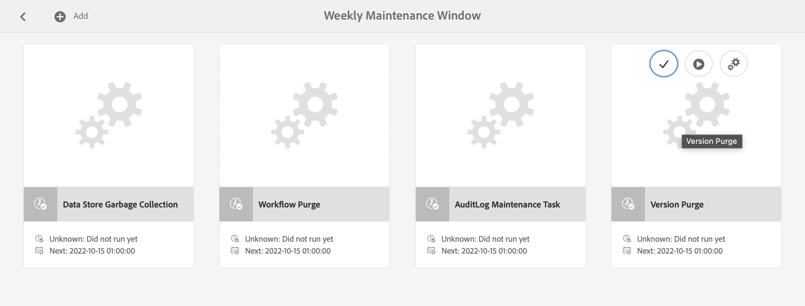

# Monitoramento e manutenção da instância do Adobe Experience Manager{#monitoring-and-maintaining-your-aem-instance}

Depois que as instâncias do AEM forem implantadas, você deverá monitorar e manter a operação, o desempenho e a integridade.

Um fator chave é que, para reconhecer possíveis problemas, você precisa saber como o seu sistema se parece e se comporta sob condições normais. Essa capacidade é melhor realizada monitorando o sistema e coletando informações ao longo do tempo.

| Verificar | Considerações | Comentário / Ações |
|---|---|---|
| Plano de backup. |  | Veja como [Fazer backup de sua Instância](/help/sites-deploying/monitoring-and-maintaining.md#backups). |
| Plano de recuperação de desastres. | Diretrizes de recuperação de desastres da sua empresa. |  |
| Um sistema de rastreamento de erros está disponível para reportar problemas. | Por exemplo, [Bugzilla](https://www.bugzilla.org/), [Jira](https://www.atlassian.com/software/jira) ou um entre muitos outros. |  |
| Os sistemas de arquivos estão sendo monitorados. | O repositório do CRX &quot;congela&quot; se não houver espaço livre em disco suficiente. Ela será retomada depois que houver espaço disponível. | As mensagens &quot; `*ERROR* LowDiskSpaceBlocker`&quot; podem ser vistas no arquivo de log quando o espaço livre se torna baixo. |
| [Arquivos de log](/help/sites-deploying/monitoring-and-maintaining.md#working-with-audit-records-and-log-files) estão sendo monitorados. |  |  |
| O monitoramento do sistema é executado (constantemente) em segundo plano. | Incluindo uso de CPU, memória, disco e rede. Usando por exemplo, iostat / vmstat / perfmon. | Os dados registrados são visualizados e podem ser usados para rastrear problemas de desempenho. Os dados brutos também estão acessíveis. |
| [O desempenho do AEM está sendo monitorado](/help/sites-deploying/monitoring-and-maintaining.md#monitoring-performance). | Incluindo [Contadores de Solicitações](/help/sites-deploying/monitoring-and-maintaining.md#request-counters) para monitorar os níveis de tráfego. | Caso se verifique uma perda significativa ou a longo prazo do desempenho, deve proceder-se a uma investigação aprofundada. |
| Você está monitorando os [Agentes de replicação](/help/sites-deploying/monitoring-and-maintaining.md#monitoring-your-replication-agents). |  |  |
| Limpe regularmente as instâncias de fluxo de trabalho. | Tamanho do repositório e desempenho do workflow. | Consulte [Limpeza regular de instâncias de fluxo de trabalho](/help/sites-administering/workflows-administering.md#regular-purging-of-workflow-instances). |

## Backups {#backups}

É uma boa prática fazer backups de:

* Instalação do software - antes/depois de mudanças significativas na configuração
* O conteúdo mantido no repositório - regularmente

Sua empresa provavelmente tem uma política de backup que você segue, considerações adicionais sobre o que e quando fazer backup incluem o seguinte:

* a importância do sistema e dos dados.
* com que frequência as alterações são feitas no software ou nos dados.
* volume de dados; a capacidade pode, ocasionalmente, ser um problema, assim como o tempo necessário para realizar o backup.
* se o backup pode ser feito enquanto os usuários estão on-line e, se possível, qual é o impacto no desempenho.
* a distribuição geográfica dos usuários; ou seja, quando é o melhor momento para fazer backup (para minimizar o impacto)?
* sua política de recuperação de desastres? há diretrizes sobre onde os dados de backup devem ser armazenados (por exemplo, mídia externa e específica).

Geralmente, um backup completo é feito em intervalos regulares (por exemplo, diariamente, semanalmente ou mensalmente), com backups incrementais entre eles (por exemplo, a cada hora, diariamente ou semanalmente).

>[!CAUTION]
>
>Ao implementar backups de suas instâncias de produção, testes *devem* ser feitos para garantir que você possa restaurar o backup com êxito.
>
>Sem esse teste, o backup pode ser inútil (na pior das hipóteses).

>[!NOTE]
>
>Para obter mais informações sobre desempenho de backup, leia a seção [Desempenho de Backup](/help/sites-deploying/configuring-performance.md#backup-performance).

### Fazendo backup da instalação do software {#backing-up-your-software-installation}

Após a instalação ou após alterações significativas na configuração, crie um backup da instalação do software.

Para realizar esta tarefa, [faça backup de todo o repositório](#backing-up-your-repository) e, em seguida:

1. Pare o AEM.
1. Faça backup de todo o `<cq-installation-dir>` do seu sistema de arquivos.

>[!CAUTION]
>
>Se você estiver operando um servidor de aplicativos de terceiros, as pastas adicionais podem estar em um local diferente e também devem ter backup. Consulte [Como instalar o AEM com um Servidor de Aplicativos](/help/sites-deploying/application-server-install.md) para obter informações sobre como instalar servidores de aplicativos.

>[!CAUTION]
>
>O backup incremental do armazenamento de dados de arquivos é suportado; ao usar o backup incremental para outros componentes (como o índice Lucene), verifique se os arquivos excluídos também são marcados como excluídos no backup.

>[!NOTE]
>
>O espelhamento de disco também pode ser usado como um mecanismo de backup.

### Fazendo backup do repositório {#backing-up-your-repository}

A seção [Backup e restauração](/help/sites-administering/backup-and-restore.md) da documentação do CRX abrange todos os problemas relacionados a backups do repositório do CRX.

Para obter detalhes completos sobre como fazer um backup online dinâmico, consulte [Criando um Backup Online](/help/sites-administering/backup-and-restore.md#online-backup).

## Limpeza de versão {#version-purging}

A ferramenta **Versões de Limpeza** serve para limpar as versões de um nó ou de uma hierarquia de nós no seu repositório. Seu principal objetivo é ajudá-lo a reduzir o tamanho do repositório removendo versões antigas dos nós.

Esta seção trata das operações de manutenção relacionadas ao recurso de controle de versão do AEM. A ferramenta **Limpar Versão** destina-se a limpar as versões de um nó ou uma hierarquia de nós no seu repositório. Seu principal objetivo é ajudá-lo a reduzir o tamanho do repositório removendo versões antigas dos nós.

### Visão geral {#overview}

A ferramenta **Versões de Limpeza** está disponível como uma tarefa de manutenção semanal. Antes de usar o pela primeira vez, ele deve ser adicionado e configurado. Depois disso, ele poderá ser executado mediante solicitação ou semanalmente.

### Expurgando Versões de um Site {#purging-versions-of-a-web-site}

Para expurgar versões de um site, proceda da seguinte forma:

1. Navegue até **[Ferramentas](/help/sites-administering/tools-consoles.md)** **console**, selecione **Operação**, **Manutenção** e **Janela de Manutenção Semanal**.

1. Selecione **+ Adicionar** na barra de ferramentas superior.

   

1. Selecione **Limpeza de Versão** na lista suspensa na caixa de diálogo **Adicionar Nova Tarefa**. Depois **Salvar**.

   

1. A tarefa **Limpeza de Versão** foi adicionada. Use as ações do cartão para:
   * Selecionar - revela ações adicionais na barra de ferramentas superior
   * Executar - para executar a expurgação configurada imediatamente
   * Configurar - para configurar a tarefa de limpeza semanal

   

1. Selecione a ação **Configurar** para abrir o Console da Web para a **Tarefa de Limpeza de Versão do WCM do Day CQ**, na qual você pode configurar:

   

   * **Limpar caminhos**
Defina o caminho inicial do conteúdo a ser removido; por exemplo, `/content/wknd`.

     >[!CAUTION]
     >
     >A Adobe recomenda definir vários caminhos para cada um dos sites.
     >
     >A definição de um caminho com muitos filhos pode aumentar significativamente o tempo para executar a limpeza.

   * **Limpar versões recursivamente**

      * Desmarque se desejar expurgar apenas o nó definido pelo caminho.
      * Selecione se quiser expurgar o nó definido pelo seu caminho e seus descendentes.

   * **Número máximo de versões**
Defina o número máximo de versões (para cada nó) que deseja manter. Deixe em branco para não usar esta configuração.

   * **Número mínimo de versões**
Defina o número mínimo de versões (para cada nó) que deseja manter. Deixe em branco para não usar esta configuração.

   * **Idade máxima da versão**
Defina o tempo de vida máximo da versão em dias (para cada nó) que você deseja manter. Deixe em branco para não usar esta configuração.

   Depois **Salvar**.

1. Navegue/retorne à janela **Janela de manutenção semanal** e selecione **Executar** para iniciar o processo imediatamente.

>[!CAUTION]
>
>Você pode usar a caixa de diálogo da interface clássica para executar um [Dry Run](#analyzing-the-console) de sua configuração:
>
>* http://localhost:4502/etc/versioning/purge.html
>
>Os nós limpos não podem ser revertidos sem restaurar o repositório. Cuide de sua configuração sempre executando uma simulação antes da limpeza.

#### Dry Run - Análise do console {#analyzing-the-console}

A interface clássica fornece uma opção de **Execução Seca** de:

* http://localhost:4502/etc/versioning/purge.html

O processo lista todos os nós que foram processados. Durante o processo, um nó pode ter um dos seguintes status:

* `ignore (not versionnable)`: o nó não dá suporte ao controle de versão e é ignorado durante o processo.

* `ignore (no version)`: o nó não tem nenhuma versão e é ignorado durante o processo.

* `retained`: o nó não está removido.
* `purged`: o nó está limpo.

Além disso, o console fornece informações úteis sobre as versões:

* `V 1.0`: o número da versão.
* `V 1.0.1`&#42;: a estrela indica que a versão é a versão atual (base) e não pode ser removida.

* `Thu Mar 15 2012 08:37:32 GMT+0100`: a data da versão.

No próximo exemplo:

* As versões **[!DNL Shirts]** foram removidas porque sua idade da versão é superior a dois dias.
* As versões **[!DNL Tonga Fashions!]** foram removidas porque seu número de versões é superior a 5.


## Trabalhar com registros de auditoria e arquivos de log {#working-with-audit-records-and-log-files}

Registros de auditoria e arquivos de log relacionados ao Adobe Experience Manager (AEM) podem ser encontrados em vários locais. O seguinte é fornecido para lhe dar uma visão geral do que você pode encontrar e onde pode encontrá-lo.

### Trabalhar com logs {#working-with-logs}

O AEM WCM registra logs detalhados. Depois de descompactar e iniciar o Quickstart, você pode encontrar logs em:

* `<cq-installation-dir>/crx-quickstart/logs/`

* `<cq-installation-dir>/crx-quickstart/repository/`

#### Rotação de arquivo de log {#log-file-rotation}

Rotação de arquivos de registro refere-se ao processo que limita o crescimento do arquivo criando um arquivo periodicamente. No AEM, um arquivo de log chamado `error.log` é girado uma vez por dia de acordo com as regras fornecidas:

* O arquivo `error.log` é renomeado de acordo com o padrão `{original_filename}.yyyy-MM-dd`. Por exemplo, em 11 de julho de 2010, o arquivo de log atual será renomeado para `error.log-2010-07-10`, depois um novo `error.log` será criado.

* Os arquivos de registro anteriores não são excluídos, portanto, é sua responsabilidade limpar arquivos de registro antigos periodicamente para limitar o uso do disco.

>[!NOTE]
>
>Se você atualizar a instalação do AEM, qualquer arquivo de log existente que não for mais usado pelo AEM permanecerá no disco. Você pode removê-los sem riscos. Todas as novas entradas de log são gravadas nos novos arquivos de log.

### Localizando os arquivos de registro {#finding-the-log-files}

Vários arquivos de log são mantidos no servidor de arquivos em que você instalou o AEM:

* `<cq-installation-dir>/crx-quickstart/logs`

   * `access.log`
Todas as solicitações de acesso ao WCM do AEM e ao repositório estão registradas aqui.

   * `audit.log`
As ações de moderação são registradas aqui.

   * `error.log`
Mensagens de erro (de vários níveis de gravidade) são registradas aqui.

   * [`ImageServer-<PortId>-yyyy>-<mm>-<dd>.log`](https://experienceleague.adobe.com/docs/dynamic-media-developer-resources/image-serving-api/image-serving-api/config-admin/server-logging/c-image-server-log.html?lang=pt-BR)
Este log só será usado se [!DNL Dynamic Media] estiver habilitado. Ele fornece estatísticas e informações analíticas usadas para analisar o comportamento do processo interno do ImageServer.

   * `request.log`
Cada solicitação de acesso é registrada aqui junto com a resposta.

   * [`s7access-<yyyy>-<mm>-<dd>.log`](https://experienceleague.adobe.com/docs/dynamic-media-developer-resources/image-serving-api/image-serving-api/config-admin/server-logging/c-access-log.html?lang=pt-BR)
Este log só será usado se [!DNL Dynamic Media] estiver habilitado. O log de acesso s7registra cada solicitação feita a [!DNL Dynamic Media] até `/is/image` e `/is/content`.

   * `stderr.log`
Mantém mensagens de erro, novamente de diferentes níveis de gravidade, geradas durante a inicialização. Por padrão, o nível de log está definido como `Warning` ( `WARN`)

   * `stdout.log`
Contém mensagens de registro indicando eventos durante a inicialização.

   * `upgrade.log`
Fornece um log de todas as operações de atualização executadas a partir dos pacotes `com.day.compat.codeupgrade` e `com.adobe.cq.upgradesexecutor`.

* `<cq-installation-dir>/crx-quickstart/repository/segmentstore`

   * `journal.log`
Informações de diário de revisão.

>[!NOTE]
>
>Os logs ImageServer e s7access não estão incluídos no pacote **Download completo** gerado a partir da página **system/console/status-Bundlelist**. Para fins de suporte, se você tiver [!DNL Dynamic Media] problemas, anexe os logs ImageServer e s7access quando entrar em contato com o Suporte ao cliente.

### Ativando o Nível de Log DEBUG {#activating-the-debug-log-level}

O nível de log padrão ([Configuração de Log do Apache Sling](/help/sites-deploying/osgi-configuration-settings.md#apacheslingloggingconfiguration)) é Informação, portanto, as mensagens de depuração não são registradas.

Para ativar o nível de log de depuração de um Agente de Log, defina a propriedade `org.apache.sling.commons.log.level` como debug no repositório. Por exemplo, em `/libs/sling/config/org.apache.sling.commons.log.LogManager` para configurar o [Log global do Apache Sling](/help/sites-deploying/osgi-configuration-settings.md#apacheslingloggingconfiguration).

>[!CAUTION]
>
>Não deixe o log no nível de log de depuração por mais tempo do que o necessário, pois ele gera várias entradas de log, consumindo recursos.

Uma linha no arquivo de depuração geralmente começa com DEBUG, em seguida, fornece o nível de log, a ação do instalador e a mensagem de log. Por exemplo:

```shell
DEBUG 3 WebApp Panel: WebApp successfully deployed
```

Os níveis de log são os seguintes:

| 0 | Erro fatal | A ação falhou e o instalador não pode continuar. |
|---|---|---|
| 1 | Erro | Falha na ação. A instalação continua, mas uma parte do AEM WCM não foi instalada corretamente e não funciona. |
| 2 | Aviso | A ação foi bem-sucedida, mas encontrou problemas. O AEM WCM pode ou não funcionar corretamente. |
| 3 | Informações | A ação foi bem-sucedida. |

### Criar um arquivo de log personalizado {#create-a-custom-log-file}

>[!NOTE]
>
>Ao trabalhar com o Adobe Experience Manager, há vários métodos de gerenciamento das definições de configuração desses serviços; consulte [Configurar OSGi](/help/sites-deploying/configuring-osgi.md) para obter mais detalhes e as práticas recomendadas.

Em determinadas circunstâncias, talvez você queira criar um arquivo de log personalizado com um nível de log diferente. No repositório, faça o seguinte:

1. Se não existir, crie uma pasta de configuração ( `sling:Folder`) para seu projeto `/apps/<project-name>/config`.
1. Em `/apps/<project-name>/config`, crie um nó para a nova [Configuração do logger de log do Apache Sling](/help/sites-deploying/osgi-configuration-settings.md#apacheslingloggingloggerconfigurationfactoryconfiguration):

   * Nome: `org.apache.sling.commons.log.LogManager.factory.config-<identifier>`

     Onde `<identifier>` é substituído por texto livre que você (deve) inserir para identificar a instância (você não pode omitir essas informações).

     Por exemplo, `org.apache.sling.commons.log.LogManager.factory.config-MINE`

   * Tipo: `sling:OsgiConfig`

   >[!NOTE]
   >
   >Embora não seja um requisito técnico, é aconselhável tornar `<identifier>` exclusivo.

1. Defina as seguintes propriedades nesse nó:

   * Nome: `org.apache.sling.commons.log.file`

     Tipo: String

     Valor: especifique o Arquivo de Log; por exemplo, `logs/myLogFile.log`

   * Nome: `org.apache.sling.commons.log.names`

     Tipo: Cadeia De Caracteres [] (Cadeia De Caracteres + Múltipla)

     Valor: especifique os serviços OSGi para os quais o Logger registrará mensagens; por exemplo, todos os seguintes:

      * `org.apache.sling`
      * `org.apache.felix`
      * `com.day`

   * Nome: `org.apache.sling.commons.log.level`

     Tipo: String

     Valor: especifique o nível de log necessário ( `debug`, `info`, `warn` ou `error`); por exemplo, `debug`

   * Configure os outros parâmetros conforme necessário:

      * Nome: `org.apache.sling.commons.log.pattern`

        Tipo: `String`

        Value: especifique o padrão da mensagem de log conforme necessário; por exemplo,

        `{0,date,dd.MM.yyyy HH:mm:ss.SSS} *{4}* [{2}] {3} {5}`

   >[!NOTE]
   >
   >`org.apache.sling.commons.log.pattern` dá suporte a até seis argumentos.
   >
   >{0} O carimbo de data/hora do tipo `java.util.Date`
   >
   >{1} o marcador de log
   >
   >{2} o nome do thread atual
   >
   >{3} o nome do agente de log
   >
   >{4} o nível de log
   >
   >{5} a mensagem de log
   >
   >Se a chamada de log incluir um `Throwable`, o rastreamento de pilha será anexado à mensagem.

   >[!CAUTION]
   >
   >org.apache.sling.commons.log.names deve ter um valor.

   >[!NOTE]
   >
   >Os caminhos do gravador de log são relativos ao local `crx-quickstart`.
   >
   >Portanto, um arquivo de log especificado como:
   >
   >`logs/thelog.log`
   >
   >grava em:
   >
   >`<cq-installation-dir>/crx-quickstart/logs/thelog.log`.
   >
   >E um arquivo de log especificado como:
   >
   >`../logs/thelog.log`
   >
   >grava em um diretório:
   >
   >`<cq-installation-dir>/logs/`\
   >(ou seja, próximo a `<cq-installation-dir>/crx-quickstart/`)

1. Essa etapa só é necessária quando um novo Gravador é necessário (ou seja, com uma configuração diferente do Gravador padrão).

   >[!CAUTION]
   >
   >Uma nova Configuração de Gravador de Log só é necessária quando o padrão existente não é adequado.
   >
   >Se nenhum Gravador explícito estiver configurado, o sistema gera automaticamente um Gravador implícito com base no padrão.

   Em `/apps/<project-name>/config`, crie um nó para a nova [Configuração do Gravador de Log do Apache Sling](/help/sites-deploying/osgi-configuration-settings.md#apacheslingloggingwriterconfigurationfactoryconfiguration):

   * Nome: `org.apache.sling.commons.log.LogManager.factory.writer-<identifier>` (um Gravador)

     Assim como no Logger, `<identifier>` é substituído pelo texto livre que você (deve) inserir para identificar a instância (você não pode omitir essas informações). Por exemplo, `org.apache.sling.commons.log.LogManager.factory.writer-MINE`

   * Tipo: `sling:OsgiConfig`

   >[!NOTE]
   >
   >Embora não seja um requisito técnico, é aconselhável tornar `<identifier>` exclusivo.

   Defina as seguintes propriedades nesse nó:

   * Nome: `org.apache.sling.commons.log.file`

     Tipo: `String`

     Value: especifique o Arquivo de Log para que ele corresponda ao arquivo especificado no Logger;

     para este exemplo, `../logs/myLogFile.log`.

   * Configure os outros parâmetros conforme necessário:

      * Nome: `org.apache.sling.commons.log.file.number`

        Tipo: `Long`

        Valor: especifique o número de arquivos de log que deseja manter; por exemplo, `5`

      * Nome: `org.apache.sling.commons.log.file.size`

        Tipo: `String`

        Valor: especifique conforme necessário para controlar a rotação de arquivos por tamanho/data; por exemplo, `'.'yyyy-MM-dd`

   >[!NOTE]
   >
   >`org.apache.sling.commons.log.file.size` controla a rotação do arquivo de log definindo:
   >
   >* um tamanho máximo de arquivo
   >* um cronograma de hora/data
   >
   >para indicar quando um novo arquivo será criado (e o arquivo existente será renomeado de acordo com o padrão de nome).
   >
   >* Um limite de tamanho pode ser especificado com um número. Se nenhum indicador de tamanho for fornecido, ele será tomado como o número de bytes ou você poderá adicionar um dos indicadores de tamanho - `KB`, `MB` ou `GB` (maiúsculas e minúsculas são ignoradas).
   >* Um cronograma de data/hora pode ser especificado como um padrão `java.util.SimpleDateFormat`. Ele define o período após o qual o arquivo é girado. Além disso, o sufixo anexado ao arquivo girado (para identificação).
   >
   >O padrão é &#39;.&#39;dd/MM/yyyy (para rotação diária de logs).
   >
   >Por exemplo, à meia-noite de 20 de janeiro de 2010 (ou quando a primeira mensagem de log após essa data ocorrer para ser precisa), ../logs/error.log será renomeado para ../logs/error.log.2010-01-20. Os registros de 21 de janeiro são enviados para (um novo e vazio) ../logs/error.log até serem transferidos na próxima alteração do dia.
   >
   >| `'.'yyyy-MM` | Rotação no início de cada mês |
   >|---|---|
   >| `'.'yyyy-ww` | Rotação no primeiro dia de cada semana (depende do local). |
   >| `'.'yyyy-MM-dd` | Rotação à meia-noite de cada dia. |
   >| `'.'yyyy-MM-dd-a` | Rotação à meia-noite e ao meio-dia de cada dia. |
   >| `'.'yyyy-MM-dd-HH` | Rotação na parte superior de cada hora. |
   >| `'.'yyyy-MM-dd-HH-mm` | Rotação no início de cada minuto. |
   >
   >Observação: Ao especificar uma data/hora:
   >
   >1. Você deve &quot;escapar&quot; o texto literal dentro de um par de aspas simples (&#39; &#39;);
   >
   >    Evita que determinados caracteres sejam interpretados como letras de padrão.
   >
   >1. Use somente caracteres permitidos para um nome de arquivo válido em qualquer lugar na opção.

1. Leia o novo arquivo de log com a ferramenta escolhida.

   O arquivo de log criado por este exemplo é `../crx-quickstart/logs/myLogFile.log`.

O Felix Console também fornece informações sobre o Suporte ao Log do Sling em `../system/console/slinglog`; por exemplo, `https://localhost:4502/system/console/slinglog`.

### Localizando os Registros de Auditoria {#finding-the-audit-records}

Os registros de auditoria são mantidos para fornecer um registro de quem fez o que e quando. Registros de auditoria diferentes são gerados para eventos WCM e OSGi do AEM.

#### Registros de auditoria WCM do AEM exibidos ao criar páginas {#aem-wcm-audit-records-shown-when-page-authoring}

1. Abra uma página.
1. No sidekick, você pode selecionar a guia com o ícone de bloqueio e clicar duas vezes em **Log de auditoria...**
1. Uma nova janela é aberta mostrando a lista de registros de auditoria da página atual.

   

1. Clique em **OK** quando quiser fechar a janela.

#### Registros de auditoria do AEM WCM no repositório {#aem-wcm-auditing-records-within-the-repository}

Na pasta `/var/audit`, os registros de auditoria são mantidos de acordo com o recurso. Você pode fazer drill-down até ver registros individuais e as informações que eles contêm.

Essas entradas contêm as mesmas informações que são exibidas ao editar uma página.

#### Registros de auditoria OSGi no console da Web {#osgi-audit-records-from-the-web-console}

Os eventos OSGi também geram registros de auditoria que podem ser vistos na guia **Status da configuração** > **Arquivos de log** no Console da Web do AEM:


## Monitorar os agentes de replicação {#monitoring-your-replication-agents}

Você pode monitorar as [filas de replicação](/help/sites-deploying/replication.md) para detectar quando uma fila está inativa ou bloqueada, o que, por sua vez, pode indicar um problema com uma instância de publicação ou sistema externo:

* todas as filas necessárias estão habilitadas?
* ainda são necessárias filas desativadas?
* todas as filas `enabled` devem ter o status `idle` ou `active`, o que indica operação normal; nenhuma fila deve ser `blocked`, o que geralmente é um sinal de problemas no lado do receptor.

* se o tamanho da fila aumentar com o tempo, pode indicar uma fila bloqueada.

Para monitorar um agente de replicação:

1. Acesse a guia **Ferramentas** no AEM.
1. Clique em **Replicação**.
1. Clique duas vezes no link para agentes do ambiente apropriado (no painel esquerdo ou direito); por exemplo, **Agentes no autor**.

   A janela resultante mostra uma visão geral de todos os agentes de replicação para o ambiente de criação, incluindo o destino e o status.

1. Clique no nome do agente apropriado (que é um link) para mostrar informações detalhadas sobre esse agente:

   

   Aqui você pode:

   * Veja se o agente está ativado.
   * Visualizar o destino de qualquer replicação.
   * Veja se a fila de replicação está ativa (ativada).
   * Verificar se há itens na fila.
   * **Atualizar** ou **Limpar** para atualizar a exibição de entradas da fila. Isso ajuda a ver os itens que entram e saem da fila.
   * **Exibir Log** para acessar o log de quaisquer ações pelo agente de replicação.
   * **Testar Conexão** com a instância de destino.
   * **Forçar nova tentativa** em qualquer item da fila, se necessário.

   >[!CAUTION]
   >
   >Não use o link &quot;Testar conexão&quot; para a Caixa de saída de replicação reversa em uma instância de publicação.
   >
   >Se um teste de replicação for executado para uma fila da Caixa de saída, quaisquer itens mais antigos que a replicação de teste serão reprocessados com cada replicação reversa.
   >
   >Se esses itens existirem em uma fila, poderão ser encontrados com a seguinte consulta XPath JCR e deverão ser removidos.
   >
   >`/jcr:root/var/replication/outbox//*[@cq:repActionType='TEST']`

Novamente, você pode desenvolver uma solução para detectar todos os agentes de replicação (localizados em `/etc/replication/author` ou `/etc/replication/publish`) e, em seguida, verificar o status do agente ( `enabled`, `disabled`) e da fila subjacente ( `active`, `idle`, `blocked`).

## Monitorando o desempenho {#monitoring-performance}

[Otimização de Desempenho](/help/sites-deploying/configuring-performance.md) é um processo interativo que recebe foco durante o desenvolvimento. Após a implantação, ela é revisada após intervalos ou eventos específicos.

Métodos usados ao coletar informações para otimização também podem ser usados para monitoramento contínuo.

>[!NOTE]
>
>Também é possível verificar as [configurações específicas disponíveis para melhorar o desempenho](/help/sites-deploying/configuring-performance.md#configuring-for-performance).

A seguir, uma lista de problemas comuns de desempenho que ocorrem, juntamente com propostas sobre como detectá-los e neutralizá-los.

| Área | Sintoma | Para aumentar a capacidade... | Para reduzir o volume... |
|---|---|---|---|
| Cliente | Alto uso do CPU do cliente. | Instale um CPU cliente com melhor desempenho. | Layout Simplificar (HTML). |
|   | Baixo uso do CPU do servidor. | Atualize para um navegador mais rápido. | Melhore o cache do lado do cliente. |
|   | Alguns clientes são rápidos, outros lentos. |  |  |
| Servidor |  |  |  |
| Rede | Baixo uso do CPU em servidores e clientes. | Remova todos os gargalos de rede. | Melhorar/otimizar a configuração do cache do cliente. |
|   | A navegação local no servidor é (comparativamente) rápida. | Aumente a largura de banda da rede. | Reduza o &quot;peso&quot; de suas páginas da Web (por exemplo, menos imagens, HTML otimizado). |
| Servidor da Web | O uso do CPU no servidor da Web é alto. | Faça cluster dos servidores da Web. | Reduza as ocorrências por página (visita). |
|   |  | Use um balanceador de carga de hardware. |  |
| Aplicativo | O uso do CPU do servidor é alto. | Agrupe suas instâncias do AEM. | Procure e elimine travas de memória e do CPU (use a revisão do código e a saída de tempo). |
|   | Alto consumo de memória. |  | Melhore o armazenamento em cache em todos os níveis. |
|   | Tempos de resposta baixos. |  | Otimizar modelos e componentes (por exemplo, estrutura, lógica). |
| Repositório |  |  |  |
| Cache |  |  |  |

Os problemas de desempenho podem resultar de várias causas que não têm nada a ver com o seu site, incluindo lentidão temporária na velocidade da conexão, carga do CPU e muito mais.

Também pode afetar todos os visitantes ou somente um subconjunto deles.

Todas essas informações devem ser obtidas, classificadas e analisadas antes que você possa otimizar o desempenho geral ou resolver problemas específicos.

* Antes de você ter um problema de desempenho:

   * recolher o máximo de informações possível para desenvolver um bom conhecimento do funcionamento do sistema em circunstâncias normais

* Quando você tiver um problema de desempenho:

   * tente replicá-lo com um navegador da web padrão (ou preferencialmente mais), em um cliente diferente que você saiba que tem bom desempenho geral e/ou no próprio servidor (se possível)
   * verifique se algo (relacionado ao sistema) foi alterado em um espaço de tempo adequado e se alguma dessas alterações pode ter afetado o desempenho
   * faça perguntas como:

      * o problema ocorre somente em momentos específicos?
      * o problema ocorre somente em páginas específicas?
      * as outras solicitações serão afetadas?

   * colete o máximo de informações possível para comparar com seu conhecimento do sistema em circunstâncias normais:

### Ferramentas para Monitorar e Analisar Desempenho {#tools-for-monitoring-and-analyzing-performance}

A seguir há uma breve visão geral de algumas das ferramentas disponíveis para monitorar e analisar o desempenho.

Algumas dessas ferramentas dependem do sistema operacional.

<table>
 <tbody>
  <tr>
   <td>Ferramenta </td>
   <td>Usado para analisar...</td>
   <td>Uso / Mais informações...</td>
  </tr>
  <tr>
   <td>request.log</td>
   <td>Tempos de resposta e simultaneidade.</td>
   <td><a href="#interpreting-the-request-log">Interpretando request.log</a>.</td>
  </tr>
  <tr>
   <td>treliça/esteira</td>
   <td>Carregamentos de página</td>
   <td><p>Comandos Unix/Linux para rastrear chamadas e sinais do sistema. Aumente o nível de log para <code>INFO</code>.</p> <p>Analise o número de carregamentos de página por solicitação e quais páginas.</p> </td>
  </tr>
  <tr>
   <td>Despejos de encadeamento</td>
   <td>Observe as threads da JVM. Identificar contenções, bloqueios e corredores.</td>
   <td><p>Dependente do sistema operacional:<br /> - Unix/Linux: <code>kill -QUIT &lt;<em>pid</em>&gt;</code><br /> - Windows (modo de console): Ctrl-Break<br /> </p> <p>Ferramentas de análise também estão disponíveis, como <a href="https://github.com/irockel/tda">TDA</a>.<br /> </p> </td>
  </tr>
  <tr>
   <td>Despejos de pilha</td>
   <td>Problemas de falta de memória que causam desempenho lento.</td>
   <td><p>Adicione a opção:<br /> <code>-XX:+HeapDumpOnOutOfMemoryError</code><br /> à chamada Java™ que vai para o AEM.</p> <p>Consulte a <a href="https://docs.oracle.com/javase/8/docs/technotes/guides/troubleshoot/prepapp002.html#CEGBHDFH">Página Opções/Sinalizadores para Solução de Problemas do JVM</a>.</p> </td>
  </tr>
  <tr>
   <td>Chamadas do sistema</td>
   <td>Identifique problemas de tempo.</td>
   <td><p>Chamadas para <code>System.currentTimeMillis()</code> ou <code>com.day.util</code>. O horário é usado para gerar carimbos de data e hora a partir de seu código, ou por meio de <a href="#html-comments">comentários de HTML</a>.</p> <p><strong>Observação:</strong> implemente esses itens para que eles possam ser ativados/desativados conforme necessário; quando um sistema está em execução sem problemas, a sobrecarga de coletar estatísticas não é necessária.</p> </td>
  </tr>
  <tr>
   <td>Apache Bench</td>
   <td>Identifique vazamentos de memória e analise seletivamente o tempo de resposta.</td>
   <td><p>o uso básico é:</p> <p><code>ab -k -n &lt;<em>requests</em>&gt; -c &lt;<em>concurrency</em>&gt; &lt;<em>url</em>&gt;</code></p> <p>Consulte a <a href="#apache-bench">Apache Bench</a> e a <a href="https://httpd.apache.org/docs/2.4/programs/ab.html">página do manual ab</a> para obter detalhes completos.</p> </td>
  </tr>
  <tr>
   <td>Análise de pesquisa</td>
   <td> </td>
   <td>Executar consultas de pesquisa offline, identificar o tempo de resposta da consulta, testar e confirmar o conjunto de resultados.<br /> </td>
  </tr>
  <tr>
   <td>JMeter</td>
   <td>Testes de carga e funcionais.</td>
   <td><a href="https://jmeter.apache.org/">https://jmeter.apache.org/</a></td>
  </tr>
  <tr>
   <td>JProfiler</td>
   <td>CPU detalhado e definição de perfil de memória.</td>
   <td><a href="https://www.ej-technologies.com/">https://www.ej-technologies.com/</a></td>
  </tr>
  <tr>
   <td>Gravador de voo Java™</td>
   <td>O Java™ Flight Recorder (JFR) é uma ferramenta para coletar dados de diagnóstico e criação de perfil sobre um aplicativo Java™ em execução.</td>
   <td><a href="https://docs.oracle.com/javase/8/docs/technotes/guides/troubleshoot/tooldescr004.html#BABJJEEE">https://docs.oracle.com/javase/8/docs/technotes/guides/troubleshoot/tooldescr004.html#BABJJEEE</a></td>
  </tr>
  <tr>
   <td>JConsole</td>
   <td>Observe métricas e threads da JVM.</td>
   <td><p>Uso: jconsole</p> <p>Consulte <a href="https://docs.oracle.com/javase/8/docs/technotes/guides/management/jconsole.html">jconsole</a> e <a href="#monitoring-performance-using-jconsole">Monitorando o Desempenho usando o JConsole</a>.</p> <p><strong>Observação:</strong> com o JDK 1.8, o JConsole é extensível com plug-ins; por exemplo, Superior ou TDA (Analisador de despejo de thread).</p> </td>
  </tr>
  <tr>
   <td>Java™ VisualVM</td>
   <td>Observe métricas, threads, memória e criação de perfil da JVM.</td>
   <td><p>Uso: visualvm ou visualvm<br /> </p> <p>Consulte <a href="https://docs.oracle.com/javase/8/docs/technotes/guides/visualvm/">visualvm</a> e <a href="#monitoring-performance-using-j-visualvm">Monitorando o Desempenho usando (J)VisualVM</a>.</p> <p><strong>Observação:</strong> com o JDK 1.8, o VisualVM é extensível com plug-ins. O VisualVM é descontinuado após o JDK 9. Em vez disso, use o Gravador de voo Java™.</p> </td>
  </tr>
  <tr>
   <td>treliça/esteira, lsof</td>
   <td>Análise detalhada de processos e chamadas do kernel (UNIX®).</td>
   <td>Comandos Unix/Linux.</td>
  </tr>
  <tr>
   <td>Estatísticas de tempo</td>
   <td>Consulte estatísticas de tempo para renderização de página.</td>
   <td><p>Para ver as estatísticas de tempo da renderização da página, você pode usar <strong>Ctrl-Shift-U</strong> junto com <code>?debugClientLibs=true</code> definidos na URL.</p> </td>
  </tr>
  <tr>
   <td>CPU e ferramenta de criação de perfil de memória<br /> </td>
   <td><a href="#interpreting-the-request-log">Usado ao analisar solicitações lentas durante o desenvolvimento</a>.</td>
   <td>Por exemplo, <a href="https://www.yourkit.com/">SeuKit</a>. ou o <a href="https://docs.oracle.com/javase/8/docs/technotes/guides/troubleshoot/tooldescr004.html#BABJJEEE">Java™ Flight Recorder</a>.</td>
  </tr>
  <tr>
   <td><a href="#information-collection">Coleta de informações</a></td>
   <td>O estado contínuo da sua instalação.</td>
   <td>Saber o máximo possível sobre a sua instalação também pode ajudá-lo a rastrear o que pode ter causado uma mudança no desempenho e se essas alterações são justificadas. Colete essas métricas em intervalos regulares para que você possa ver facilmente alterações significativas.</td>
  </tr>
 </tbody>
</table>

### Interpretando o request.log {#interpreting-the-request-log}

Esse arquivo registra informações básicas sobre cada solicitação feita ao AEM. Daí podem ser extraídas conclusões valiosas.

O `request.log` oferece uma maneira integrada de verificar quanto tempo as solicitações levam. Para fins de desenvolvimento, é útil `tail -f` o `request.log` e observar tempos de resposta lentos. Para analisar um `request.log` maior, a Adobe recomenda o [uso do `rlog.jar`, que permite classificar e filtrar os tempos de resposta](#using-rlog-jar-to-find-requests-with-long-duration-times).

A Adobe recomenda isolar as páginas &quot;lentas&quot; do `request.log` e ajustá-las individualmente para obter um melhor desempenho. Inclua métricas de desempenho por componente ou use uma ferramenta de criação de perfil de desempenho como o ` [yourkit](https://www.yourkit.com/)`.

#### Monitoramento de tráfego em seu site {#monitoring-traffic-on-your-website}

O log de solicitação registra cada solicitação feita, juntamente com a resposta feita:

```xml
09:43:41 [66] -> GET /author/y.html HTTP/1.1
09:43:41 [66] <- 200 text/html 797ms
```

Ao totalizar todas as entradas do GET em períodos específicos (por exemplo, em vários períodos de 24 horas), você pode fazer declarações sobre o tráfego médio no seu site.

#### Monitoramento dos tempos de resposta com o request.log {#monitoring-response-times-with-the-request-log}

Um bom ponto de partida para a análise de desempenho é o registro de solicitações:

`<cq-installation-dir>/crx-quickstart/logs/request.log`

O registro tem a seguinte aparência (as linhas são encurtadas para simplificar):

```xml
31/Mar/2009:11:32:57 +0200 [379] -> GET /path/x HTTP/1.1
31/Mar/2009:11:32:57 +0200 [379] <- 200 text/html 33ms
31/Mar/2009:11:33:17 +0200 [380] -> GET /path/y HTTP/1.1
31/Mar/2009:11:33:17 +0200 [380] <- 200 application/json 39ms
```

Este log tem uma linha por solicitação ou resposta:

* A data em que cada solicitação ou resposta foi feita.
* O número da solicitação, em colchetes. Esse número corresponde à solicitação e à resposta do.
* Uma seta indicando se é uma solicitação (seta apontando para a direita) ou uma resposta (seta para a esquerda).
* Para solicitações de, a linha contém:

   * o método (normalmente, GET, HEAD ou POST)
   * a página solicitada
   * o protocolo

* Para respostas, a linha contém:

   * o código de status (200 significa &quot;sucesso&quot;, 404 significa &quot;página não encontrada&quot;
   * o tipo MIME
   * o tempo de resposta

Usando scripts pequenos, você pode extrair as informações necessárias do arquivo de log e montar as estatísticas desejadas. Nessas estatísticas, é possível ver quais páginas ou tipos de páginas estão lentas e se o desempenho geral é satisfatório.

#### Monitoramento dos tempos de resposta de pesquisa com o request.log {#monitoring-search-response-times-with-the-request-log}

As solicitações de pesquisa também são registradas no arquivo de log:

```xml
31/Mar/2009:11:35:34 +0200 [338] -> GET /author/playground/en/tools/search.html?query=dilbert&size=5&dispenc=utf-8 HTTP/1.1
31/Mar/2009:11:35:34 +0200 [338] <- 200 text/html 1562ms
```

Assim, como acima, você pode usar scripts para extrair as informações relevantes e criar estatísticas.

No entanto, após determinar o tempo de resposta, analise por que a solicitação está demorando e o que pode ser feito para melhorar a resposta.

#### Monitoramento do número e do impacto de usuários simultâneos {#monitoring-the-number-and-impact-of-concurrent-users}

Novamente, o `request.log` pode ser usado para monitorar a simultaneidade e a reação do sistema a ele.

Testes devem ser feitos para determinar quantos usuários simultâneos o sistema pode manipular antes que um impacto negativo seja visto. Novamente, os scripts podem ser usados para extrair resultados do arquivo de log:

* monitore quantas solicitações são feitas em um período específico, como um minuto.
* testar os efeitos de um número específico de usuários fazendo todas as mesmas solicitações ao mesmo tempo (o mais próximo possível). Por exemplo, 30 usuários clicando em **Salvar** ao mesmo tempo.

```xml
31/Mar/2009:11:45:29 +0200 [333] -> GET /author/libs/Personalize/content/statics.close.gif HTTP/1.1
31/Mar/2009:11:45:29 +0200 [334] -> GET /author/libs/Personalize/content/statics.detach.gif HTTP/1.1
31/Mar/2009:11:45:30 +0200 [335] -> GET /author/libs/CFC/content/imgs/logo.rZMNURccynWcTpCxyuBNiTCoiBMmw000.default.gif HTTP/1.1
31/Mar/2009:11:45:32 +0200 [335] <- 304 text/html 0ms
31/Mar/2009:11:45:33 +0200 [334] <- 200 image/gif 31ms
31/Mar/2009:11:45:38 +0200 [333] <- 200 image/gif 31ms
31/Mar/2009:11:45:42 +0200 [336] -> GET /author/libs/CFC/content/imgs/logo.rZMNURccynWcTZRXunQbbQtvuuCMbRRBuWXz0000.default.gif HTTP/1.1
31/Mar/2009:11:45:43 +0200 [337] -> GET /author/titlebar_bg.gif HTTP/1.1
31/Mar/2009:11:45:43 +0200 [336] <- 304 text/html 0ms
31/Mar/2009:11:45:44 +0200 [337] <- 304 text/html 0ms
```

### Usar rlog.jar para encontrar solicitações com tempos de longa duração {#using-rlog-jar-to-find-requests-with-long-duration-times}

O AEM inclui várias ferramentas auxiliares no seguinte:
`<cq-installation-dir>/crx-quickstart/opt/helpers`

Uma dessas ferramentas, `rlog.jar`, pode ser usada para classificar rapidamente `request.log` de modo que as solicitações sejam exibidas por duração, do mais longo ao menor tempo.

O comando a seguir mostra os argumentos possíveis:

```shell
$java -jar rlog.jar
Request Log Analyzer Version 21584 Copyright 2005 Day Management AG
Usage:
  java -jar rlog.jar [options] <filename>
Options:
  -h               Prints this usage.
  -n <maxResults>  Limits output to <maxResults> lines.
  -m <maxRequests> Limits input to <maxRequest> requests.
  -xdev            Exclude POST request to CRXDE.
```

Por exemplo, você pode executá-lo especificando o arquivo `request.log` como parâmetro e mostrar as dez primeiras solicitações que têm a duração mais longa:

```shell
$ java -jar ../opt/helpers/rlog.jar -n 10 request.log
*Info * Parsed 464 requests.
*Info * Time for parsing: 22ms
*Info * Time for sorting: 2ms
*Info * Total Memory: 1mb
*Info * Free Memory: 1mb
*Info * Used Memory: 0mb
------------------------------------------------------
     18051ms 31/Mar/2009:11:15:34 +0200 200 GET /content/geometrixx/en/company.html text/ html
      2198ms 31/Mar/2009:11:15:20 +0200 200 GET /libs/cq/widgets.js application/x-javascript
      1981ms 31/Mar/2009:11:15:11 +0200 200 GET /libs/wcm/content/welcome.html text/html
      1973ms 31/Mar/2009:11:15:52 +0200 200 GET /content/campaigns/geometrixx.teasers..html text/html
      1883ms 31/Mar/2009:11:15:20 +0200 200 GET /libs/security/cq-security.js application/x-javascript
      1876ms 31/Mar/2009:11:15:20 +0200 200 GET /libs/tagging/widgets.js application/x-javascript
      1869ms 31/Mar/2009:11:15:20 +0200 200 GET /libs/tagging/widgets/themes/default.js application/x-javascript
      1729ms 30/Mar/2009:16:45:56 +0200 200 GET /libs/wcm/content/welcome.html text/html; charset=utf-8
      1510ms 31/Mar/2009:11:15:34 +0200 200 GET /bin/wcm/contentfinder/asset/view.json/ content/dam?_dc=1238490934657&query=&mimeType=image&_charset_=utf-8 application/json
      1462ms 30/Mar/2009:17:23:08 +0200 200 GET /libs/wcm/content/welcome.html text/html; charset=utf-8
```

Concatene os arquivos `request.log` individuais se precisar fazer essa operação em uma amostra de dados grande.

### Apache Bench {#apache-bench}

Para minimizar o impacto de casos especiais (como coleta de lixo), é recomendável usar uma ferramenta como o `apachebench` (por exemplo, [ab](https://httpd.apache.org/docs/2.4/programs/ab.html) para documentação adicional) para ajudar a identificar vazamentos de memória e analisar seletivamente o tempo de resposta.

O Apache Bench pode ser usado da seguinte maneira:

```shell
$ ab -c 5 -k -n 1000 "https://localhost:4503/content/geometrixx/en/company.html"
This is ApacheBench, Version 2.3 <$Revision: 655654 $>
Copyright 1996 Adam Twiss, Zeus Technology Ltd, https://www.zeustech.net/
Licensed to The Apache Software Foundation, https://www.apache.org/

Benchmarking localhost (be patient)
Completed 100 requests
Completed 200 requests
Completed 300 requests
Completed 400 requests
Completed 500 requests
Completed 600 requests
Completed 700 requests
Completed 800 requests
Completed 900 requests
Completed 1000 requests
Finished 1000 requests

Server Software: Day-Servlet-Engine/4.1.52
Server Hostname: localhost
Server Port: 4503

Document Path: /content/geometrixx/en/company.html
Document Length: 24127 bytes

Concurrency Level: 5
Time taken for tests: 69.766 seconds
Complete requests: 1000
Failed requests: 998
(Connect: 0, Receive: 0, Length: 998, Exceptions: 0)
Write errors: 0
Keep-Alive requests: 0
Total transferred: 24160923 bytes
HTML transferred: 24010923 bytes
Requests per second: 14.33 /sec (mean)
Time per request: 348.828 [ms] (mean)
Time per request: 69.766 [ms] (mean, across all concurrent requests)
Transfer rate: 338.20 [Kbytes/sec] received

Connection Times (ms)
min mean[+/-sd] median max
Connect: 0 1 3.9 0 58
Processing: 138 347 568.5 282 8106
Waiting: 137 344 568.1 281 8106
Total: 139 348 568.4 283 8106

Percentage of the requests served within a certain time (ms)
50% 283
66% 323
75% 356
80% 374
90% 439
95% 512
98% 1047
99% 1132
100% 8106 (longest request)
```

Os números acima são retirados de um notebook MAcBook Pro padrão (meados de 2010) que acessa a página da empresa Geometrixx, conforme incluído em uma instalação padrão do AEM. A página é simples, mas não otimizada para desempenho.

O `apachebench` também exibe o tempo por solicitação como a média em todas as solicitações simultâneas; consulte `Time per request: 54.595 [ms]` (média em todas as solicitações simultâneas). Você pode alterar o valor do parâmetro de simultaneidade `-c` (número de várias solicitações a serem executadas de cada vez) para ver os efeitos.

### Contadores de solicitações {#request-counters}

Informações sobre o tráfego de solicitações (número de solicitações durante um período específico) fornecem uma indicação da carga na instância. Estas informações podem ser extraídas de [request.log](#interpreting-the-request-log), embora o uso de contadores automatize a coleta de dados para permitir que você veja:

* diferenças significativas na atividade (ou seja, diferenciar entre &quot;muitas solicitações&quot; e &quot;baixa atividade&quot;)
* quando uma instância não está sendo usada
* qualquer reinicialização (os contadores são redefinidos como 0)

Para automatizar a coleta de informações, você também pode instalar um RequestFilter para incrementar um contador em cada solicitação. Vários contadores podem ser usados para diferentes períodos.

As informações recolhidas podem ser utilizadas para indicar:

* alterações significativas na atividade
* uma instância redundante
* qualquer reinicialização (o contador é redefinido para 0)

### Comentários no HTML {#html-comments}

É recomendável que todos os projetos incluam `html comments` para desempenho de servidor. Muitos bons exemplos públicos podem ser encontrados. Selecione uma página, abra a origem da página para exibição e role até a parte inferior. Códigos como os seguintes podem ser vistos:

```xml
</body>
 </html>
        <!--
        Page took 58 milliseconds to be rendered by server
         -->
```

### Monitorando o desempenho usando o JConsole {#monitoring-performance-using-jconsole}

O comando de ferramenta `jconsole` está disponível com o JDK.

1. Inicie sua instância do AEM.
1. Executar `jconsole.`
1. Selecione sua instância do AEM e **Conecte**.

1. No aplicativo `Local`, clique duas vezes em `com.day.crx.quickstart.Main`; a Visão Geral é exibida como padrão:

   

   Agora é possível selecionar outras opções.

### Monitoramento de desempenho usando (J)VisualVM {#monitoring-performance-using-j-visualvm}

Para o JDK 6-8, o comando de ferramenta `visualvm` está disponível. Depois de instalar um JDK, você pode fazer o seguinte:

1. Inicie sua instância do AEM.

   >[!NOTE]
   >
   >Se estiver usando o Java™ 5, você pode adicionar o argumento `-Dcom.sun.management.jmxremote` à linha de comando do Java™ que inicia sua JVM. O JMX é ativado por padrão com o Java™ 6.

1. Execute:

   * `jvisualvm`: na pasta bin do JDK 1.6 (versão testada)
   * `visualvm`: pode ser baixado de [VisualVM](https://docs.oracle.com/javase/8/docs/technotes/guides/visualvm/) (versão de borda sangrada)

1. No aplicativo `Local`, clique duas vezes em `com.day.crx.quickstart.Main`. A Visão geral é exibida como o padrão:

   

   Agora é possível selecionar outras opções, incluindo Monitorar:

   

Você pode usar esta ferramenta para gerar despejos de thread e despejos de cabeçote de memória. Essas informações são solicitadas com frequência pela equipe de suporte técnico.

### Coleta de informações {#information-collection}

Saber o máximo possível sobre a instalação do pode ajudar a identificar o que pode ter causado uma alteração no desempenho e se essas alterações são justificadas. Colete essas métricas em intervalos regulares para que você possa ver facilmente alterações significativas.

As seguintes informações podem ser úteis:

* [Quantos autores estão trabalhando com o sistema?](#how-many-authors-are-working-with-the-system)
* [Qual é o número médio de ativações de página por dia?](#what-is-the-average-number-of-page-activations-per-day)
* [Quantas páginas você mantém atualmente neste sistema?](#how-many-pages-do-you-currently-maintain-on-this-system)
* [Se você usa o MSM, qual é o número médio de implantações por mês?](#if-you-use-msm-what-is-the-average-number-of-rollouts-per-month)
* [Qual é o número médio de Live Copies por mês?](#what-is-the-average-number-of-live-copies-per-month)
* [Se você usa o AEM Assets, quantos ativos você mantém atualmente no Assets?](#ifyouusecqdamhowmanyassetsdoyoucurrentlymaintainincqdam)
* [Qual é o tamanho médio dos ativos?](#what-is-the-average-size-of-the-assets)
* [Quantos modelos são usados atualmente?](#how-many-templates-are-currently-used)
* [Quantos componentes são usados atualmente?](#how-many-components-are-currently-used)
* [Quantas solicitações por hora você tem no sistema do autor no horário de pico?](#how-many-requests-per-hour-do-you-have-on-the-author-system-at-peak-time)
* [Quantas solicitações por hora você tem no sistema de publicação no horário de pico?](#how-many-requests-per-hour-do-you-have-on-the-publish-system-at-peak-time)

#### Quantos autores estão trabalhando com o sistema? {#how-many-authors-are-working-with-the-system}

Para ver o número de autores que usaram o sistema desde a instalação, use a linha de comando:

```shell
cd <cq-installation-dir>/crx-quickstart/logs
cut -d " " -f 3 access.log | sort -u | wc -l
```

Para ver o número de autores trabalhando em uma determinada data:

```shell
grep "<date>" access.log | cut -d " " -f 3 | sort -u | wc -l
```

#### Qual é o número médio de ativações de página por dia? {#what-is-the-average-number-of-page-activations-per-day}

Para ver o número total de ativações de página desde a instalação do servidor, use uma consulta do repositório; por meio do CRXDE - Ferramentas - Consulta:

* **Tipo** `XPath`

* **Caminho** `/`

* **Consulta** `//element(*, cq:AuditEvent)[@cq:type='Activate']`

Em seguida, calcule o número de dias decorridos desde a instalação para calcular a média.

#### Quantas páginas você mantém atualmente neste sistema? {#how-many-pages-do-you-currently-maintain-on-this-system}

Para ver o número de páginas atualmente no servidor, use uma consulta de repositório; via CRXDE - Ferramentas - Consulta:

* **Tipo** `XPath`

* **Caminho** `/`

* **Consulta** `//element(*, cq:Page)`

#### Se você usa o MSM, qual é o número médio de implantações por mês? {#if-you-use-msm-what-is-the-average-number-of-rollouts-per-month}

Para determinar o número total de implantações desde a instalação, use uma consulta de repositório; por meio do CRXDE - Ferramentas - Consulta:

* **Tipo** `XPath`

* **Caminho** `/`

* **Consulta** `//element(*, cq:AuditEvent)[@cq:type='PageRolledOut']`

Calcule o número de meses decorridos desde a instalação para calcular a média.

#### Qual é o número médio de Live Copies por mês? {#what-is-the-average-number-of-live-copies-per-month}

Para determinar o número total de Live Copies feitas desde a instalação, use uma consulta de repositório; via CRXDE - Ferramentas - Consulta:

* **Tipo** `XPath`

* **Caminho** `/`

* **Consulta** `//element(*, cq:LiveSyncConfig)`

Use novamente o número de meses decorridos desde a instalação para calcular a média.

#### Se você usa o AEM Assets, quantos ativos você mantém atualmente no Assets? {#if-you-use-aem-assets-how-many-assets-do-you-currently-maintain-in-assets}

Para ver quantos ativos DAM você mantém atualmente, use uma consulta de repositório; via CRXDE - Ferramentas - Consulta:

* **Tipo** `XPath`
* **Caminho** `/`
* **Consulta** `/jcr:root/content/dam//element(*, dam:Asset)`

#### Qual é o tamanho médio dos ativos? {#what-is-the-average-size-of-the-assets}

Para determinar o tamanho total da pasta `/var/dam`:

1. Use WebDAV para mapear o repositório para o sistema de arquivos local.

1. Usar a linha de comando:

   ```shell
   cd /Volumes/localhost/var
   du -sh dam/
   ```

   Para obter o tamanho médio, divida o tamanho global pelo número total de ativos em `/var/dam` (obtido acima).

#### Quantos modelos são usados atualmente? {#how-many-templates-are-currently-used}

Para ver o número de modelos atualmente no servidor, use uma consulta de repositório; via CRXDE - Ferramentas - Consulta:

* **Tipo** `XPath`
* **Caminho** `/`
* **Consulta** `//element(*, cq:Template)`

#### Quantos componentes são usados atualmente? {#how-many-components-are-currently-used}

Para ver o número de componentes atualmente no servidor, use uma consulta de repositório; via CRXDE - Ferramentas - Consulta:

* **Tipo** `XPath`
* **Caminho** `/`
* **Consulta** `//element(*, cq:Component)`

#### Quantas solicitações por hora você tem no sistema do autor no horário de pico? {#how-many-requests-per-hour-do-you-have-on-the-author-system-at-peak-time}

Para determinar as solicitações por hora que você tem no sistema do autor no horário de pico:

1. Para determinar o número total de solicitações desde a instalação, use a linha de comando:

   ```shell
   cd <cq-installation-dir>/crx-quickstart/logs
   grep -R "\->" request.log | wc -l
   ```

1. Para determinar as datas inicial e final:

   ```shell
   vim request.log
   G / 1G: for the last/first lines
   ```

   Use esses valores para calcular o número de horas decorridas desde a instalação e, em seguida, o número médio de solicitações por hora.

#### Quantas solicitações por hora você tem no sistema de publicação no horário de pico? {#how-many-requests-per-hour-do-you-have-on-the-publish-system-at-peak-time}

Repita o procedimento acima na instância de publicação.

## Análise de cenários específicos {#analyzing-specific-scenarios}

Veja a seguir uma lista de sugestões sobre o que verificar se você começa a enfrentar determinados problemas de desempenho. A lista não é (infelizmente) totalmente abrangente.

>[!NOTE]
>
>Consulte também os seguintes artigos para obter mais informações:
>
>* [Despejos de thread](https://experienceleague.adobe.com/docs/experience-cloud-kcs/kbarticles/KA-17452.html?lang=pt-BR)
>* [Analisar problemas de memória](https://experienceleague.adobe.com/docs/experience-cloud-kcs/kbarticles/KA-17482.html?lang=pt-BR)
>* [Analisar usando o criador de perfil interno](https://experienceleague.adobe.com/docs/experience-cloud-kcs/kbarticles/KA-17499.html?lang=pt-BR)
>

### Memória insuficiente {#out-of-memory}

Embora esses erros devam ser detectados durante o desenvolvimento e o teste, alguns cenários podem ser ignorados.

Se o sistema estiver ficando sem memória, esse problema poderá ser observado de várias maneiras, incluindo degradação de desempenho e mensagens de erro, incluindo o subtexto:

`java.lang.OutOfMemoryError`

Nesses casos, verifique:

* As configurações JVM usadas para [iniciar o AEM](/help/sites-deploying/deploy.md#getting-started)
* Base de conhecimento:

* [Analisar problemas de memória](https://experienceleague.adobe.com/docs/experience-cloud-kcs/kbarticles/KA-17482.html?lang=pt-BR)

### E/S de disco {#disk-i-o}

Se o sistema estiver ficando sem espaço em disco ou se você notar hash no disco, consulte:

* Se você tiver desativado a coleção de informações de depuração, ela poderá ser configurada em vários locais, incluindo os seguintes:

   * [Manipulador de script JSP do Apache Sling](/help/sites-deploying/osgi-configuration-settings.md#apacheslingjspscripthandler)
   * [Apache Sling JavaScript Handler](/help/sites-deploying/osgi-configuration-settings.md#apacheslingjavascripthandler)
   * [Configuração de registro do Apache Sling](/help/sites-deploying/osgi-configuration-settings.md#apacheslingloggingconfiguration)
   * [Gerenciador de biblioteca HTML CQ](/help/sites-deploying/osgi-configuration-settings.md#daycqhtmllibrarymanager)
   * [Filtro de depuração CQ WCM](/help/sites-deploying/osgi-configuration-settings.md#daycqwcmdebugfilter)
   * [Loggers](/help/sites-deploying/monitoring-and-maintaining.md#activating-the-debug-log-level)

* Se e como você configurou a [Limpeza de Versão](/help/sites-deploying/version-purging.md)
* Base de conhecimento:

   * [Muitos Arquivos Abertos]&#x200B;(https://experienceleague.adobe.com/docs/experience-cloud-kcs/kbarticles/KA-17470.html?lang=pt-BR

### Degradação regular do desempenho {#regular-performance-degradation}

Se você observar o desempenho da sua instância se deteriorando após cada reinicialização (às vezes, uma semana ou mais tarde), o seguinte pode ser verificado:

* [Memória insuficiente](#outofmemory)
* Base de conhecimento:

   * [Resolvedor de Recursos Não Fechados](https://experienceleague.adobe.com/pt-br/docs/experience-cloud-kcs/kbarticles/ka-23761)

### Ajuste de JVM {#jvm-tuning}

A Java™ Virtual Machine (JVM) melhorou em relação ao ajuste (especialmente desde o Java™ 7). Dessa forma, geralmente é adequado especificar um tamanho de JVM fixo e razoável e usar os padrões.

Se as configurações padrão não forem adequadas, é importante estabelecer um método para monitorar e avaliar o desempenho de GC. Faça isso antes de tentar ajustar a JVM. Esse processo pode envolver fatores de monitoramento, incluindo tamanho do heap, algoritmo e outros aspectos.

Algumas opções comuns são:

* VerboseGC:

  ```
  -verbose:gc \
   -Xloggc:$LOGS/verbosegc.log \
   -XX:+PrintGCDetails \
   -XX:+PrintGCDateStamps
  ```

O log resultante pode ser assimilado por um visualizador de GC, como:

` [https://www.ibm.com/developerworks/library/j-ibmtools2/](https://www.ibm.com/developerworks/library/j-ibmtools2/)`

Ou JConsole:

* Estas configurações são para uma conexão JMX &quot;aberta&quot;:

  ```
  -Dcom.sun.management.jmxremote \
   -Dcom.sun.management.jmxremote.port=8889 \
   -Dcom.sun.management.jmxremote.authenticate=false \
   -Dcom.sun.management.jmxremote.ssl=false
  ```

* Em seguida, conecte-se à JVM com o JConsole; consulte o seguinte:
  ` [https://docs.oracle.com/javase/8/docs/technotes/guides/management/jconsole.html](https://docs.oracle.com/javase/8/docs/technotes/guides/management/jconsole.html)`

Você pode ver quanta memória está sendo usada, quais algoritmos de GC estão sendo usados, quanto tempo eles levam para serem executados e qual efeito esse processo tem no desempenho do aplicativo. Sem ele, o ajuste é apenas &quot;aleatoriamente girando botões&quot;.

>[!NOTE]
>
>Para a VM da Oracle, também há informações em:
>
>[https://docs.oracle.com/javase/8/docs/technotes/guides/vm/server-class.html](https://docs.oracle.com/javase/8/docs/technotes/guides/vm/server-class.html)
