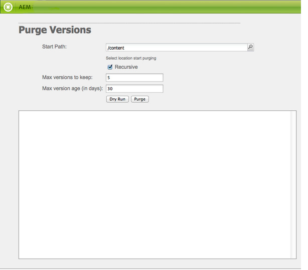

# Monitorando e Mantendo sua instância AEM{#monitoring-and-maintaining-your-aem-instance}

Depois que suas instâncias AEM tiverem sido implantadas, determinadas tarefas serão necessárias para monitorar e manter sua operação, desempenho e integridade.

Um fator chave aqui é que para reconhecer possíveis problemas você precisa saber como seus sistemas se parecem e se comportam em condições normais. A melhor forma de o fazer é monitorar o sistema e coletar informações ao longo de um período de tempo.

| Marcar | Considerações | Comentário / Ações |
|---|---|---|
| Plano de backup. |  | Consulte como fazer [backup da instância](/help/sites-deploying/monitoring-and-maintaining.md#backups). |
| Plano de recuperação de desastres. | Suas diretrizes de recuperação de desastres para empresas. |  |
| Um sistema de rastreamento de erros está disponível para problemas de relatórios. | Por exemplo, [bugzilla](https://www.bugzilla.org/), [jira](https://www.atlassian.com/software/jira/)ou um de muitos outros. |  |
| Os sistemas de arquivos estão sendo monitorados. | O repositório CRX &quot;congela&quot; se não houver espaço livre em disco suficiente. Ele será retomado assim que o espaço se tornar disponível. | As mensagens &quot; `*ERROR* LowDiskSpaceBlocker`&quot; podem ser visualizadas no arquivo de log quando o espaço livre se tornar baixo. |
| [Os arquivos](/help/sites-deploying/monitoring-and-maintaining.md#working-with-audit-records-and-log-files) de log estão sendo monitorados. |  |  |
| O monitoramento do sistema está (constantemente) sendo executado em segundo plano. | Incluindo o uso da CPU, memória, disco e rede. Usando, por exemplo, iostat / vmstat / perfmon. | Os dados registrados são visualizados e podem ser usados para rastrear problemas de desempenho. Os dados brutos também podem ser acessados. |
| [AEM desempenho está sendo monitorado](/help/sites-deploying/monitoring-and-maintaining.md#monitoring-performance). | Incluindo Contadores [de](/help/sites-deploying/monitoring-and-maintaining.md#request-counters) solicitação para monitorar os níveis de tráfego. | Caso se verifique uma perda significativa ou a longo prazo do desempenho, deve ser efetuada uma investigação aprofundada. |
| Você está monitorando seus agentes [de replicação](/help/sites-deploying/monitoring-and-maintaining.md#monitoring-your-replication-agents). |  |  |
| Expurgar instâncias de fluxo de trabalho regularmente. | Tamanho do repositório e desempenho do fluxo de trabalho. | Consulte Expurgação [regular de instâncias](/help/sites-administering/workflows-administering.md#regular-purging-of-workflow-instances)de fluxo de trabalho. |

## Backups {#backups}

É uma boa prática fazer backups de:

* Instalação do software - antes/depois de alterações significativas na configuração
* O conteúdo mantido no repositório - regularmente

Sua empresa provavelmente terá uma política de backup que será necessário seguir, considerações adicionais sobre o que fazer backup e quando incluir:

* o quão crítico é o sistema e os dados.
* com que frequência as alterações são feitas no software ou nos dados.
* volume de dados; ocasionalmente, a capacidade pode ser um problema, assim como o tempo necessário para executar o backup.
* se o backup pode ser feito enquanto os usuários estiverem on-line; e se possível, qual é o impacto no desempenho.
* A distribuição geográfica dos utilizadores; ou seja, quando é o melhor momento para fazer backup (para minimizar o impacto)?
* sua política de recuperação de desastres; há diretrizes sobre onde os dados de backup devem ser armazenados (por exemplo, fora do local, meio específico etc.).

Muitas vezes, é feito um backup completo em intervalos regulares (por exemplo, diários, semanais ou mensais), com backups incrementais entre (por exemplo, por hora, por dia ou por semana).

>[!CAUTION]
>
>Ao implementar backups das instâncias de produção, *devem* ser feitos testes para garantir que o backup possa ser restaurado com êxito.
>
>Sem isso, o backup é potencialmente inútil (pior cenário).

>[!NOTE]
>
>Para obter mais informações sobre o desempenho do backup, leia a seção Desempenho [do](/help/sites-deploying/configuring-performance.md#backup-performance) Backup.

### Fazer backup da instalação do software {#backing-up-your-software-installation}

Após a instalação, ou alterações significativas na configuração, faça um backup da instalação do software.

Para fazer isso, é necessário fazer [backup de todo o repositório](#backing-up-your-repository) e, em seguida:

1. Pare de AEM.
1. Faça backup de todo o sistema `<cq-installation-dir>` de arquivos.

>[!CAUTION]
>
>Se você estiver operando um servidor de aplicativos de terceiros, as pastas adicionais podem estar em um local diferente e talvez também seja necessário fazer backup delas. Consulte [Como instalar AEM com um Servidor](/help/sites-deploying/application-server-install.md) de aplicativos para obter informações sobre como instalar servidores de aplicativos. [](/content/docs/en/aem/6-3/deploy/installing.md#installing adobe experience manager with an application server)

>[!CAUTION]
>
>Há suporte para backup incremental do armazenamento de dados de arquivos; ao usar backup incremental para outros componentes (como o índice Lucene), verifique se os arquivos excluídos também estão marcados como excluídos no backup.

>[!NOTE]
>
>O espelhamento de disco também pode ser usado como um mecanismo de backup.

### Backup do repositório {#backing-up-your-repository}

A seção [Backup and Restore](/help/sites-administering/backup-and-restore.md) da documentação CRX cobre todos os problemas relacionados aos backups do repositório CRX.

Para obter detalhes completos sobre como fazer um backup on-line &quot;hot&quot;, consulte [Criação de um backup](/help/sites-administering/backup-and-restore.md#online-backup)on-line.

## Expurgação de versão {#version-purging}

A ferramenta **Expurgar Versões** destina-se a expurgar as versões de um nó ou uma hierarquia de nós no repositório. Seu objetivo principal é ajudar a reduzir o tamanho do repositório, removendo versões antigas de seus nós.

Esta seção trata das operações de manutenção relacionadas ao recurso de controle de versão do AEM. A ferramenta **Expurgar versão** destina-se a expurgar as versões de um nó ou uma hierarquia de nós no repositório. Seu objetivo principal é ajudar a reduzir o tamanho do repositório, removendo versões antigas de seus nós.

### Visão geral {#overview}

A ferramenta **Expurgar versões** está disponível no console **[Ferramentas](/help/sites-administering/tools-consoles.md)** em **Controle de versão** ou diretamente em:

`https://<server>:<port>/etc/versioning/purge.html`



**Caminho** do start Um caminho absoluto no qual a expurgação deve ser feita. Você pode selecionar o Caminho do Start clicando no navegador da árvore do repositório.

**Recursivo** Ao expurgar dados, você pode escolher entre executar a operação em um nó ou em uma hierarquia inteira selecionando Recursivo. No último caso, o caminho especificado define o nó raiz da hierarquia.

**Versões máximas para manter** o número máximo de versões a serem mantidas para um nó. Quando esse número excede esse valor, as versões mais antigas são removidas.

**Idade** máxima da versão A idade máxima da versão de um nó. Quando a idade de uma versão exceder esse valor, ele será removido.

**Execução** seca Como a remoção de versões do seu conteúdo é definitiva e não pode ser revertida sem a restauração de um backup, a ferramenta Expurgar versões fornece um modo de execução em seco que permite que você pré-visualização as versões expurgadas. Para iniciar uma execução seca do processo de expurgação, clique em Execução de prática.

**Expurgar** Inicie a expurgação das versões no nó definido pelo Caminho do Start.

### Expurgando Versões de um Site {#purging-versions-of-a-web-site}

Para expurgar versões de um site, proceda da seguinte maneira:

1. Navegue até o **[console](/help/sites-administering/tools-consoles.md)** Ferramentas **, selecione Controle de** versão **e clique com o duplo em** **Expurgar versões.**
1. Defina o caminho do start do conteúdo a ser expurgado (por exemplo, `/content/geometrixx-outdoors`).

   * Se você quiser apenas expurgar o nó definido pelo seu caminho, desmarque **Recursivo**.
   * Se desejar expurgar o nó definido pelo seu caminho e seus descendentes, selecione **Recursivo**.

1. Defina o número máximo de versões (para cada nó) que deseja manter. Deixe em branco para não usar essa configuração.

1. Defina a idade máxima da versão em dias (para cada nó) que deseja manter. Deixe em branco para não usar essa configuração.

1. Clique em **Execução** de prática para pré-visualização do que o processo de expurgação faria.
1. Clique em **Expurgar** para iniciar o processo.

>[!CAUTION]
>
>Os nós removidos não podem ser revertidos sem restaurar o repositório. Você deve cuidar de sua configuração, então recomendamos que você sempre execute uma execução seca antes de purgar.

### Analisando o console {#analyzing-the-console}

A Execução **** prática e a **Expurgação** processam a lista de todos os nós que foram processados. Durante o processo, um nó pode ter um dos seguintes status:

* `ignore (not versionnable)`: o nó não oferece suporte ao controle de versão e é ignorado durante o processo.

* `ignore (no version)`: o nó não tem nenhuma versão e é ignorado durante o processo.

* `retained`: o nó não é expurgado.
* `purged`: o nó é limpo.

Além disso, o console fornece informações úteis sobre as versões:

* `V 1.0`: o número da versão.
* `V 1.0.1`*: a estrela indica que a versão é a atual.

* `Thu Mar 15 2012 08:37:32 GMT+0100`: a data da versão.

No próximo exemplo:

* As **[!DNL Shirts]** versões são removidas porque a idade da versão é superior a 2 dias.
* As **[!DNL Tonga Fashions!]** versões são removidas porque seu número de versões é maior que 5.


## Trabalhar com registros de auditoria e arquivos de registro {#working-with-audit-records-and-log-files}

Registros de auditoria e arquivos de registro relacionados ao Adobe Experience Manager (AEM) podem ser encontrados em vários locais. A seguir, é fornecida uma visão geral do que você pode encontrar.

### Trabalhar com registros {#working-with-logs}

AEM WCM registra registros detalhados. Depois de desempacotar e start Quickstart, você pode encontrar registros em:

* `<cq-installation-dir>/crx-quickstart/logs/`

* `<cq-installation-dir>/crx-quickstart/repository/`

#### Rotação do arquivo de log {#log-file-rotation}

A rotação do arquivo de log refere-se ao processo que limita o crescimento do arquivo ao criar um novo arquivo periodicamente. No AEM, um arquivo de log chamado `error.log` será girado uma vez por dia, de acordo com as regras fornecidas:

* O `error.log` arquivo é renomeado de acordo com o padrão {original_filename} `.yyyy-MM-dd`. Por exemplo, em 11 de julho de 2010, o arquivo de log atual será renomeado `error.log-2010-07-10`e um novo arquivo `error.og` será criado.

* Os arquivos de log anteriores não são excluídos, portanto, é sua responsabilidade limpar os arquivos de log antigos periodicamente para limitar o uso do disco.

>[!NOTE]
>
>Se você atualizar sua instalação AEM, observe que qualquer arquivo de log existente que não for mais usado pelo AEM permanecerá no disco. Você pode removê-los sem riscos. Todas as novas entradas de log serão gravadas nos novos arquivos de log.

### Como localizar os arquivos de registro {#finding-the-log-files}

Vários arquivos de log são mantidos no servidor de arquivos onde você instalou AEM:

* `<cq-installation-dir>/crx-quickstart/logs`

   * `access.log`
Todas as solicitações de acesso ao AEM WCM e ao repositório são registradas aqui.

   * `audit.log`
As ações de moderação estão registradas aqui.

   * `error.log`
Mensagens de erro (de níveis variados de gravidade) são registradas aqui.

   * [ `ImageServer-<PortId>-yyyy>-<mm>-<dd>.log`](https://docs.adobe.com/content/help/en/dynamic-media-developer-resources/image-serving-api/image-serving-api/config-admin/server-logging/c-image-server-log.html)
Este registro só é usado se [!DNL Dynamic Media] estiver ativado. Fornece estatísticas e informações analíticas usadas para analisar o comportamento do processo interno do ImageServer.

   * `request.log`
Cada solicitação de acesso é registrada aqui junto com a resposta.

   * [ `s7access-<yyyy>-<mm>-<dd>.log`](https://docs.adobe.com/content/help/en/dynamic-media-developer-resources/image-serving-api/image-serving-api/config-admin/server-logging/c-access-log.html)
Este registro só é usado se [!DNL Dynamic Media] estiver ativado. O registro de acesso s7access registra cada solicitação feita [!DNL Dynamic Media] por meio `/is/image` e `/is/content`.

   * `stderr.log`
Retém mensagens de erro, novamente de níveis variáveis de gravidade, geradas durante a inicialização. Por padrão, o nível de log é definido como 
`Warning` ( `WARN`)

   * `stdout.log`
Retém mensagens de registro indicando eventos durante a inicialização.

   * `upgrade.log`
Fornece um registro de todas as operações de atualização que são executadas a partir da 
`com.day.compat.codeupgrade` e `com.adobe.cq.upgradesexecutor` pacotes.

* `<cq-installation-dir>/crx-quickstart/repository`

   * `revision.log`
Revise as informações do diário.

>[!NOTE]
>
>Os registros de acesso ImageServer e s7access não estão incluídos no pacote **Download completo **gerado a partir da **página **system/console/status-Bundlelist **page. Para fins de suporte, se tiver [!DNL Dynamic Media] problemas, anexe também os registros do ImageServer e s7access ao entrar em contato com o Suporte ao cliente.

### Ativando o nível de log DEBUG {#activating-the-debug-log-level}

O nível de log padrão ([Apache Sling Logging Configuration](/help/sites-deploying/osgi-configuration-settings.md#apacheslingloggingconfiguration)) é Information, portanto, as mensagens de depuração não são registradas em log.

Para ativar o nível de log de depuração para um Logger, defina a propriedade `org.apache.sling.commons.log.level` para depurar no repositório. Por exemplo, para configurar `/libs/sling/config/org.apache.sling.commons.log.LogManager` o registro Apache Sling [global](/help/sites-deploying/osgi-configuration-settings.md#apacheslingloggingconfiguration).

>[!CAUTION]
>
>Não deixe o log no nível do log de depuração por mais tempo do que o necessário, pois ele gera muitas entradas de log, consumindo recursos.

Uma linha no arquivo de depuração geralmente é start com DEBUG, em seguida, fornece o nível de log, a ação do instalador e a mensagem de log. Por exemplo:

```shell
DEBUG 3 WebApp Panel: WebApp successfully deployed
```

Os níveis de log são os seguintes:

| 0 | Erro fatal | A ação falhou e o instalador não pode continuar. |
|---|---|---|
| 1 | Erro | A ação falhou. A instalação continua, mas uma parte do AEM WCM não foi instalada corretamente e não funcionará. |
| 2 | Aviso | A ação foi bem-sucedida, mas encontrou problemas. AEM WCM pode ou não funcionar corretamente. |
| 3 | Info | A ação foi bem sucedida. |

### Criar um arquivo de log personalizado {#create-a-custom-log-file}

>[!NOTE]
>
>When working with Adobe Experience Manager there are several methods of managing the configuration settings for such services; see [Configuring OSGi](/help/sites-deploying/configuring-osgi.md) for more details and the recommended practices.

Em determinadas circunstâncias, você pode querer criar um arquivo de log personalizado com um nível de log diferente. Você pode fazer isso no repositório:

1. Se ainda não existir, crie uma nova pasta de configuração ( `sling:Folder`) para o seu projeto `/apps/<project-name>/config`.
1. Em `/apps/<project-name>/config`, crie um nó para a nova configuração [do](/help/sites-deploying/osgi-configuration-settings.md#apacheslingloggingloggerconfigurationfactoryconfiguration)Apache Sling Logging Logger:

   * Nome: `org.apache.sling.commons.log.LogManager.factory.config-<identifier>` (como este é um Logger)

      Onde `<identifier>` é substituído pelo texto livre que você (deve) deve digitar para identificar a instância (não é possível omitir essas informações).

      Por exemplo, `org.apache.sling.commons.log.LogManager.factory.config-MINE`

   * Tipo: `sling:OsgiConfig`
   >[!NOTE]
   >
   >Embora não seja um requisito técnico, é aconselhável tornar `<identifier>` único.

1. Defina as seguintes propriedades neste nó:

   * Nome: `org.apache.sling.commons.log.file`

      Tipo: String

      Valor: especificar o arquivo de log; por exemplo, `logs/myLogFile.log`

   * Nome: `org.apache.sling.commons.log.names`

      Tipo: String[] (String + Multi)

      Valor: especificar os serviços OSGi para os quais o agente de registro deve registrar as mensagens; por exemplo, todas as seguintes opções:

      * `org.apache.sling`
      * `org.apache.felix`
      * `com.day`
   * Nome: `org.apache.sling.commons.log.level`

      Tipo: String

      Valor: especificar o nível de log necessário ( `debug`, `info`, `warn` ou `error`); por exemplo `debug`

   * Configure os outros parâmetros conforme necessário:

      * Nome: `org.apache.sling.commons.log.pattern`

         Tipo: `String`

         Valor: especificar o padrão da mensagem de registro, conforme necessário; por exemplo,

         `{0,date,dd.MM.yyyy HH:mm:ss.SSS} *{4}* [{2}] {3} {5}`
   >[!NOTE]
   >
   >`org.apache.sling.commons.log.pattern` apoia até seis argumentos.
   >
   >{0} O carimbo de data e hora do tipo `java.util.Date`
   >
   >{1} o marcador de log
   >
   >{2} o nome do thread atual
   >
   >{3} o nome do agente de log
   >
   >{4} o nível de log
   >
   >{5} a mensagem de registro
   >
   >Se a chamada de log incluir um rastreamento de pilha, ele será anexado à mensagem. `Throwable`

   >[!CAUTION]
   >
   >org.apache.sling.commons.log.names deve ter um valor.

   >[!NOTE]
   >
   >Os caminhos do gravador de log são relativos ao `crx-quickstart` local.
   >
   >Portanto, um arquivo de log especificado como:
   >
   >`logs/thelog.log`
   >
   >escreve para:
   >
   >`<cq-installation-dir>/crx-quickstart/logs/thelog.log`.
   >
   >E um arquivo de log especificado como:
   >
   >`../logs/thelog.log`
   >
   >grava em um diretório:
   >
   >`<cq-installation-dir>/logs/`\
   >(ou seja, próximo a `<cq-installation-dir>/crx-quickstart/`)

1. Essa etapa só é necessária quando um novo Gravador é necessário (isto é, com uma configuração diferente do Gravador padrão).

   >[!CAUTION]
   >
   >Uma nova Configuração de Gravador de Log é necessária somente quando o padrão existente não é adequado.
   >
   >Se nenhum Escritor explícito estiver configurado, o sistema gerará automaticamente um Escritor implícito com base no padrão.

   Em `/apps/<project-name>/config`, crie um nó para a nova Configuração [](/help/sites-deploying/osgi-configuration-settings.md#apacheslingloggingwriterconfigurationfactoryconfiguration)do Apache Sling Logging Writer:

   * Nome: `org.apache.sling.commons.log.LogManager.factory.writer-<identifier>` (como este é um Escritor)

      Assim como no Logger, `<identifier>` é substituído pelo texto livre que você (deve) digitar para identificar a instância (não é possível omitir essas informações). Por exemplo, `org.apache.sling.commons.log.LogManager.factory.writer-MINE`

   * Tipo: `sling:OsgiConfig`
   >[!NOTE]
   >
   >Embora não seja um requisito técnico, é aconselhável tornar `<identifier>` único.

   Defina as seguintes propriedades neste nó:

   * Nome: `org.apache.sling.commons.log.file`

      Tipo: `String`

      Valor: especificar o arquivo de log para que ele corresponda ao arquivo especificado no Log;

      para este exemplo, `../logs/myLogFile.log`.

   * Configure os outros parâmetros conforme necessário:

      * Nome: `org.apache.sling.commons.log.file.number`

         Tipo: `Long`

         Valor: especifique o número de arquivos de log que deseja manter; por exemplo, `5`

      * Nome: `org.apache.sling.commons.log.file.size`

         Tipo: `String`

         Valor: especificar, se for caso disso, o controlo da rotação dos ficheiros por dimensão/data; por exemplo, `'.'yyyy-MM-dd`
   >[!NOTE]
   >
   >`org.apache.sling.commons.log.file.size` controla a rotação do arquivo de log ao configurar:
   >
   >* um tamanho máximo de arquivo
   >* uma programação de data/hora

   >
   >para indicar quando um novo arquivo será criado (e o arquivo existente será renomeado de acordo com o padrão de nome).
   >
   >* Um limite de tamanho pode ser especificado com um número. Se nenhum indicador de tamanho for fornecido, isso será considerado como o número de bytes, ou você poderá adicionar um dos indicadores de tamanho - `KB`, `MB`ou `GB` (caso seja ignorado).
   >* Uma programação de hora/data pode ser especificada como um `java.util.SimpleDateFormat` padrão. Isso define o período após o qual o arquivo será girado; também o sufixo anexado ao arquivo girado (para identificação).

   >
   >O padrão é &#39;.&#39;aaaa-MM-dd (para rotação diária do log).
   >
   >Assim, por exemplo, à meia-noite de 20 de janeiro de 2010 (ou quando a primeira mensagem de registro depois disso ocorrer para ser precisa), ../logs/error.log será renomeado para ../logs/error.log.2010-01-20. O registro para o dia 21 de janeiro será enviado para (um novo e vazio) ../logs/error.log até que seja lançado na próxima mudança de dia.
   >
   >| `'.'yyyy-MM` | Rotação no início de cada mês |
   >|---|---|
   >| `'.'yyyy-ww` | Rotação no primeiro dia de cada semana (depende da localidade). |
   >| `'.'yyyy-MM-dd` | Rotação à meia-noite todos os dias. |
   >| `'.'yyyy-MM-dd-a` | Rotação à meia-noite e ao meio-dia de cada dia. |
   >| `'.'yyyy-MM-dd-HH` | Rotação no topo de cada hora. |
   >| `'.'yyyy-MM-dd-HH-mm` | Rotação no início de cada minuto. |
   >
   >Observação: Ao especificar uma data/hora:
   > 1. O texto literal &quot;escape&quot; deve estar dentro de um par de aspas simples ( &quot;&#39;);
      >
      >     
      isso serve para evitar que determinados caracteres sejam interpretados como letras padrão.
      >
      >  
   1. Use somente caracteres permitidos para um nome de arquivo válido em qualquer lugar na opção.


1. Leia seu novo arquivo de log com a ferramenta escolhida.

   O arquivo de log criado por este exemplo será `../crx-quickstart/logs/myLogFile.log`.

O Console do Felix também fornece informações sobre o suporte ao Sling Log em `../system/console/slinglog`; por exemplo `https://localhost:4502/system/console/slinglog`.

### Localizando os registros de auditoria {#finding-the-audit-records}

Os registros de auditoria são mantidos para fornecer um registro de quem fez o quê e quando. Registros de auditoria diferentes são gerados para eventos AEM WCM e OSGi.

#### AEM registros de Auditoria do WCM mostrados durante a Criação de Página {#aem-wcm-audit-records-shown-when-page-authoring}

1. Abra uma página.
1. No sidekick, você pode selecionar a guia com o ícone de cadeado e, em seguida, clicar em duplo no Log **de auditoria...**
1. Uma nova janela será aberta mostrando a lista dos registros de auditoria para a página atual.

   

1. Clique em **OK** quando quiser fechar a janela.

#### AEM registros de Auditoria do WCM no repositório {#aem-wcm-auditing-records-within-the-repository}

Na `/var/audit` pasta, os registros de auditoria são mantidos de acordo com o recurso. Você pode fazer o detalhamento até visualizar os registros individuais e as informações que eles contêm.

Essas entradas possuem as mesmas informações que são exibidas ao editar uma página.

#### Registros de auditoria do OSGi do Console da Web {#osgi-audit-records-from-the-web-console}

Os eventos OSGi também geram registros de auditoria que podem ser vistos na guia Status **de** configuração -> guia Arquivos **de** registro no Console da Web AEM:


## Monitorando seus Agentes de Replicação {#monitoring-your-replication-agents}

Você pode monitorar suas filas [de](/help/sites-deploying/replication.md) replicação para detectar quando uma fila está desativada ou bloqueada - o que, por sua vez, pode indicar um problema com uma instância de publicação ou sistema externo:

* todas as filas necessárias estão ativadas?
* alguma fila desativada ainda é necessária?
* todas as `enabled` filas devem ter o estatuto `idle` ou `active`, que indicam o funcionamento normal; não devem existir filas `blocked`, o que é muitas vezes um sinal de problemas do lado dos receptores.

* se o tamanho da fila aumentar com o tempo, isso pode indicar uma fila bloqueada.

Para monitorar um agente de replicação:

1. Acesse a guia **Ferramentas** no AEM.
1. Clique em **Replicação**.
1. Clique com o duplo no link para os agentes do ambiente apropriado (no painel esquerdo ou direito); por exemplo, **Agentes no autor**.

   A janela resultante mostra uma visão geral de todos os seus agentes de replicação para o ambiente do autor, incluindo seu público alvo e status.

1. Clique no nome do agente apropriado (que é um link) para mostrar informações detalhadas sobre esse agente:

   

   Aqui você pode:

   * Veja se o agente está ativado.
   * Veja o público alvo de qualquer replicação.
   * Veja se a fila de replicação está ativa no momento (ativada).
   * Veja se há algum item na fila.
   * **Atualizar** ou **Limpar** para atualizar a exibição de entradas da fila; isso ajuda você a ver os itens entrando e saindo da fila.

   * **Log** de visualizações para acessar o log de quaisquer ações pelo agente de replicação.
   * **Testar conexão** com a instância do público alvo.
   * **Forçar nova tentativa** em qualquer item da fila, se necessário.

   >[!CAUTION]
   >
   >Não use o link &quot;Testar conexão&quot; para a caixa de saída de replicação inversa em uma instância de publicação.
   >
   >Se um teste de replicação for executado para uma fila de caixa de saída, todos os itens mais antigos que a replicação de teste serão processados novamente com cada replicação reversa.
   >
   >Se esses itens já existirem em uma fila, eles podem ser encontrados com o seguinte query XPath JCR e devem ser removidos.
   >
   >`/jcr:root/var/replication/outbox//*[@cq:repActionType='TEST']`

Novamente, você pode desenvolver uma solução para detectar todos os agentes de replicação (localizados em `/etc/replication/author` ou `/etc/replication/publish`), em seguida, verificar o status do agente ( `enabled`, `disabled`) e a fila subjacente ( `active`, `idle`, `blocked`).

## Monitoramento do desempenho {#monitoring-performance}

[A Otimização](/help/sites-deploying/configuring-performance.md) de Desempenho é um processo interativo que recebe foco durante o desenvolvimento. Depois da implantação, geralmente é revisado após eventos ou intervalos específicos.

Os métodos usados ao coletar informações para otimização também podem ser usados para monitoramento contínuo.

>[!NOTE]
>
>Também é possível verificar [configurações específicas disponíveis para melhorar o desempenho](/help/sites-deploying/configuring-performance.md#configuring-for-performance) .

As listas a seguir apresentam problemas comuns de desempenho, juntamente com propostas sobre como detectar e contrariá-los.

| Área | Sintoma(s) | Para aumentar a capacidade... | Para reduzir o volume... |
|---|---|---|---|
| Cliente | Alto uso da CPU do cliente. | Instale uma CPU cliente com desempenho mais alto. | Simplificar o layout (HTML). |
|  | Baixo uso da CPU do servidor. | Atualize para um navegador mais rápido. | Melhore o cache do cliente. |
|  | Alguns clientes são rápidos, alguns lentos. |  |  |
| Servidor |  |  |  |
| Rede | O uso da CPU é baixo nos servidores e clientes. | Remova todos os gargalos de rede. | Melhore/otimize a configuração do cache do cliente. |
|  | A navegação local no servidor é (comparativamente) rápida. | Aumente a largura de banda da rede. | Reduza o &quot;peso&quot; de suas páginas da Web (por exemplo, menos imagens, HTML otimizado). |
| Servidor Web | O uso da CPU no servidor da Web é alto. | Agrupe seus servidores da Web. | Reduza as ocorrências por página (visita). |
|  |  | Use um balanceador de carga de hardware. |  |
| Aplicativo | O uso da CPU do servidor é alto. | Agrupe suas instâncias AEM. | Procure e elimine pernos de CPU e memória (use análise de código, saída de tempo etc). |
|  | Alto consumo de memória. |  | Melhore o cache em todos os níveis. |
|  | Baixo tempo de resposta. |  | Otimizar modelos e componentes (por exemplo, estrutura, lógica). |
| Repositório |  |  |  |
| Cache |  |  |  |

Problemas de desempenho podem resultar de várias causas que não têm nada a ver com seu site, incluindo lentidão temporária na velocidade da conexão, carga da CPU e muito mais.

Isso também pode afetar todos os seus visitantes, ou somente um subconjunto deles.

Todas essas informações precisam ser obtidas, selecionadas e analisadas antes que você possa otimizar o desempenho geral ou resolver problemas específicos.

* Antes de enfrentar um problema de desempenho:

   * recolher o máximo de informações possível para desenvolver um bom conhecimento do funcionamento do sistema em circunstâncias normais

* Ao enfrentar um problema de desempenho:

   * tente replicá-lo com um (ou, de preferência, mais) navegador da Web padrão, em um cliente diferente que você sabe que tem bom desempenho geral e/ou no próprio servidor (se possível)
   * verifique se algo (relacionado ao sistema) mudou em um espaço de tempo apropriado e se alguma dessas alterações pode ter afetado o desempenho
   * faça perguntas como:

      * o problema ocorre apenas em momentos específicos?
      * o problema ocorre apenas em páginas específicas?
      * outras solicitações são afetadas?
   * coletar o máximo de informações possível para comparar com seu conhecimento do sistema em circunstâncias normais:


### Ferramentas para monitorar e analisar o desempenho {#tools-for-monitoring-and-analyzing-performance}

A seguir, há uma breve visão geral de algumas das ferramentas disponíveis para monitorar e analisar o desempenho.

Alguns deles dependerão do seu sistema operacional.

<table>
 <tbody>
  <tr>
   <td>Ferramenta</td>
   <td>Usado para analisar...</td>
   <td>Uso / Mais informações...</td>
  </tr>
  <tr>
   <td>request.log</td>
   <td>Tempo de resposta e simultaneidade.</td>
   <td><a href="#interpreting-the-request-log">Interpretação do request.log</a>.</td>
  </tr>
  <tr>
   <td>trusco/traço</td>
   <td>Carregamentos de página</td>
   <td><p>Comandos Unix/Linux para rastrear chamadas e sinais do sistema. Aumente o nível de log para <code>INFO</code>.</p> <p>Analise o número de cargas de página por solicitação, quais páginas etc.</p> </td>
  </tr>
  <tr>
   <td>Despejo de thread</td>
   <td>Observe threads JVM. Identifique as disputas, bloqueios e corredores longos.</td>
   <td><p>Dependendo do sistema operacional:<br /> - Unix/Linux: <code>kill -QUIT &lt;<em>pid</em>&gt;</code><br /> - Windows (modo console): Ctrl-Break<br /> </p> <p>Ferramentas de análise também estão disponíveis, como <a href="https://java.net/projects/tda/">TDA</a>.<br /> </p> </td>
  </tr>
  <tr>
   <td>Despejos de heap</td>
   <td>Problemas de falta de memória que causam desempenho lento.</td>
   <td><p>Adicione o seguinte:<br /> <code>-XX:+HeapDumpOnOutOfMemoryError</code><br /> para a chamada java para AEM.</p> <p>Consulte o Guia <a href="https://java.sun.com/javase/6/webnotes/trouble/TSG-VM/html/clopts.html#gbzrr">de solução de problemas para Java SE 6 com VM</a>HotSpot.</p> </td>
  </tr>
  <tr>
   <td>Chamadas do sistema</td>
   <td>Identifique problemas de tempo.</td>
   <td><p>Chamadas para <code>System.currentTimeMillis()</code> ou <code>com.day.util</code>.Timing são usadas para gerar carimbos de data e hora a partir de seu código ou por meio de comentários <a href="#html-comments">em</a>HTML.</p> <p><strong>Observação:</strong> Devem ser implementadas de modo a poderem ser ativadas/desativadas, conforme necessário; quando um sistema estiver a funcionar sem problemas, a sobrecarga da recolha de estatísticas não será necessária.</p> </td>
  </tr>
  <tr>
   <td>Apache Bench</td>
   <td>Identifique os vazamentos de memória, analise seletivamente o tempo de resposta.</td>
   <td><p>o uso básico é:</p> <p><code>ab -k -n &lt;<em>requests</em>&gt; -c &lt;<em>concurrency</em>&gt; &lt;<em>url</em>&gt;</code></p> <p>Consulte <a href="#apache-bench">Apache Bench</a> e a página <a href="https://httpd.apache.org/docs/2.2/programs/ab.html">do</a> ab man para obter detalhes completos.</p> </td>
  </tr>
  <tr>
   <td>Análise de pesquisa</td>
   <td> </td>
   <td>Execute query de pesquisa off-line, identifique o tempo de resposta do query, teste e confirme o conjunto de resultados.<br /> </td>
  </tr>
  <tr>
   <td>JMeter</td>
   <td>Ensaios de carga e de funcionamento.</td>
   <td><a href="https://jakarta.apache.org/jmeter/">https://jakarta.apache.org/jmeter/</a></td>
  </tr>
  <tr>
   <td>JProfiler</td>
   <td>Definição de perfil detalhada da CPU e da memória.</td>
   <td><a href="https://www.ej-technologies.com/">https://www.ej-technologies.com/</a></td>
  </tr>
  <tr>
   <td>JConsole</td>
   <td>Observe métricas e threads JVM.</td>
   <td><p>Uso: jconsole</p> <p>Consulte <a href="https://java.sun.com/developer/technicalArticles/J2SE/jconsole.html">jconsole</a> e <a href="#monitoring-performance-using-jconsole">Monitorando o desempenho usando o JConsole</a>.</p> <p><strong>Observação:</strong> Com o JDK 1.6, o JConsole é extensível com plug-ins; por exemplo, Superior ou TDA (Thread Dump Analyzer).</p> </td>
  </tr>
  <tr>
   <td>Java VisualVM</td>
   <td>Observe métricas, threads, memória e criação de perfis JVM.</td>
   <td><p>Uso: jvisual ou visual<br /> </p> <p>Consulte <a href="https://java.sun.com/javase/6/docs/technotes/tools/share/jvisualvm.html">jvisualvm</a>, <a href="https://visualvm.dev.java.net/">visualvm</a> e <a href="#monitoring-performance-using-j-visualvm">Monitorando o desempenho usando (J)VisualVM</a>.</p> <p><strong>Observação:</strong> Com o JDK 1.6, o VisualVM é extensível com plug-ins.</p> </td>
  </tr>
  <tr>
   <td>trusco/traço, lista</td>
   <td>Chamada de kernel e análise de processo (Unix).</td>
   <td>Comandos Unix/Linux.</td>
  </tr>
  <tr>
   <td>Estatísticas de tempo</td>
   <td>Consulte estatísticas de tempo para renderização de página.</td>
   <td><p>Para ver as estatísticas de tempo para renderização de página, você pode usar <strong>Ctrl-Shift-U</strong> junto com <code>?debugClientLibs=true</code> definido no URL.</p> </td>
  </tr>
  <tr>
   <td>Ferramenta de definição de perfis de CPU e memória<br /> </td>
   <td><a href="#interpreting-the-request-log">Usado ao analisar solicitações lentas durante o desenvolvimento</a>.</td>
   <td>Por exemplo, <a href="https://www.yourkit.com/">YourKit</a>.</td>
  </tr>
  <tr>
   <td><a href="#information-collection">Coleta de informações</a></td>
   <td>O estado contínuo da sua instalação.</td>
   <td>Saber o máximo possível sobre a sua instalação também pode ajudá-lo a rastrear o que pode ter causado uma mudança no desempenho e se essas alterações são justificadas. Essas métricas precisam ser coletadas em intervalos regulares para que você possa ver facilmente alterações significativas.</td>
  </tr>
 </tbody>
</table>

### Interpretação do request.log {#interpreting-the-request-log}

Este arquivo registra informações básicas sobre cada solicitação feita para AEM. A partir destas valiosas conclusões pode ser extraída.

A `request.log` oferta é uma forma integrada de ver quanto tempo as solicitações demoram. Para fins de desenvolvimento, é útil para `tail -f` o `request.log` e observar os tempos de resposta lentos. Para analisar um valor maior, `request.log` recomendamos o [uso do `rlog.jar` qual permite classificar e filtrar os tempos](#using-rlog-jar-to-find-requests-with-long-duration-times)de resposta.

Recomendamos isolar as páginas &quot;lentas&quot; do `request.log`e ajustá-las individualmente para obter um melhor desempenho. Isso geralmente é feito incluindo métricas de desempenho por componente ou usando uma ferramenta de definição de perfil de desempenho, como ` [yourkit](https://www.yourkit.com/)`.

#### Monitorando o tráfego em seu site {#monitoring-traffic-on-your-website}

O registro de solicitações registra cada solicitação feita, juntamente com a resposta feita:

```xml
09:43:41 [66] -> GET /author/y.html HTTP/1.1
09:43:41 [66] <- 200 text/html 797ms
```

Ao totalizar todas as entradas de GET dentro de um período específico (por exemplo, durante vários períodos de 24 horas), você pode fazer declarações sobre o tráfego médio em seu site.

#### Monitorando os tempos de resposta com request.log {#monitoring-response-times-with-the-request-log}

Um bom ponto de partida para a análise de desempenho é o registro de solicitações:

`<cq-installation-dir>/crx-quickstart/logs/request.log`

O log é exibido da seguinte maneira (as linhas são encurtadas para simplificar):

```xml
31/Mar/2009:11:32:57 +0200 [379] -> GET /path/x HTTP/1.1
31/Mar/2009:11:32:57 +0200 [379] <- 200 text/html 33ms
31/Mar/2009:11:33:17 +0200 [380] -> GET /path/y HTTP/1.1
31/Mar/2009:11:33:17 +0200 [380] <- 200 application/json 39ms
```

Este registro tem uma linha por solicitação ou resposta:

* A data em que cada solicitação ou resposta foi feita.
* O número da solicitação, entre colchetes. Esse número corresponde à solicitação e à resposta.
* Uma seta indicando se esta é uma solicitação (seta apontando para a direita) ou uma resposta (seta para a esquerda).
* Para solicitações, a linha contém:

   * o método (tipicamente, GET, HEAD ou POST)
   * a página solicitada
   * protocolo

* Para respostas, a linha contém:

   * o código de status (200 significa &quot;sucesso&quot;, 404 significa &quot;página não encontrada&quot;
   * o tipo MIME
   * o tempo de resposta

Usando scripts pequenos, você pode extrair as informações necessárias do arquivo de log e reunir as estatísticas desejadas. Dessas, você pode ver quais páginas ou tipos de páginas estão lentas e se o desempenho geral é satisfatório.

#### Monitorando tempos de resposta de pesquisa com request.log {#monitoring-search-response-times-with-the-request-log}

As solicitações de pesquisa também são registradas no arquivo de log:

```xml
31/Mar/2009:11:35:34 +0200 [338] -> GET /author/playground/en/tools/search.html?query=dilbert&size=5&dispenc=utf-8 HTTP/1.1
31/Mar/2009:11:35:34 +0200 [338] <- 200 text/html 1562ms
```

Assim, como acima, você pode usar scripts para extrair as informações relevantes e criar estatísticas.

No entanto, depois de determinar o tempo de resposta, talvez seja necessário analisar por que a solicitação está demorando e o que pode ser feito para melhorar a resposta.

#### Monitoramento do número e impacto de usuários simultâneos {#monitoring-the-number-and-impact-of-concurrent-users}

Mais uma vez, `request.log` é possível monitorar a simultaneidade e a reação do sistema a ela.

Devem ser feitos testes para determinar quantos usuários simultâneos o sistema pode lidar antes que um impacto negativo seja observado. Os scripts novamente podem ser usados para extrair resultados do arquivo de log:

* monitorar quantas solicitações são feitas em um período específico, por exemplo, um minuto
* Testar os efeitos de um número específico de utilizadores que formulam os mesmos pedidos ao mesmo tempo (o mais próximo possível); Por exemplo, 30 usuários que clicam em **Salvar** ao mesmo tempo.

```xml
31/Mar/2009:11:45:29 +0200 [333] -> GET /author/libs/Personalize/content/statics.close.gif HTTP/1.1
31/Mar/2009:11:45:29 +0200 [334] -> GET /author/libs/Personalize/content/statics.detach.gif HTTP/1.1
31/Mar/2009:11:45:30 +0200 [335] -> GET /author/libs/CFC/content/imgs/logo.rZMNURccynWcTpCxyuBNiTCoiBMmw000.default.gif HTTP/1.1
31/Mar/2009:11:45:32 +0200 [335] <- 304 text/html 0ms
31/Mar/2009:11:45:33 +0200 [334] <- 200 image/gif 31ms
31/Mar/2009:11:45:38 +0200 [333] <- 200 image/gif 31ms
31/Mar/2009:11:45:42 +0200 [336] -> GET /author/libs/CFC/content/imgs/logo.rZMNURccynWcTZRXunQbbQtvuuCMbRRBuWXz0000.default.gif HTTP/1.1
31/Mar/2009:11:45:43 +0200 [337] -> GET /author/titlebar_bg.gif HTTP/1.1
31/Mar/2009:11:45:43 +0200 [336] <- 304 text/html 0ms
31/Mar/2009:11:45:44 +0200 [337] <- 304 text/html 0ms
```

### Usar o rlog.jar para localizar solicitações com tempos de longa duração {#using-rlog-jar-to-find-requests-with-long-duration-times}

AEM inclui várias ferramentas auxiliares localizadas em:
`<cq-installation-dir>/crx-quickstart/opt/helpers`

Uma dessas opções, `rlog.jar`, pode ser usada para classificar rapidamente `request.log` para que as solicitações sejam exibidas por duração, do maior ao menor tempo.

O seguinte comando mostra os possíveis argumentos:

```shell
$java -jar rlog.jar
Request Log Analyzer Version 21584 Copyright 2005 Day Management AG
Usage:
  java -jar rlog.jar [options] <filename>
Options:
  -h               Prints this usage.
  -n <maxResults>  Limits output to <maxResults> lines.
  -m <maxRequests> Limits input to <maxRequest> requests.
  -xdev            Exclude POST request to CRXDE.
```

Por exemplo, você pode executá-lo especificando o arquivo `request.log` como parâmetro e mostrar as 10 primeiras solicitações com a maior duração:

```shell
$ java -jar ../opt/helpers/rlog.jar -n 10 request.log
*Info * Parsed 464 requests.
*Info * Time for parsing: 22ms
*Info * Time for sorting: 2ms
*Info * Total Memory: 1mb
*Info * Free Memory: 1mb
*Info * Used Memory: 0mb
------------------------------------------------------
     18051ms 31/Mar/2009:11:15:34 +0200 200 GET /content/geometrixx/en/company.html text/ html
      2198ms 31/Mar/2009:11:15:20 +0200 200 GET /libs/cq/widgets.js application/x-javascript
      1981ms 31/Mar/2009:11:15:11 +0200 200 GET /libs/wcm/content/welcome.html text/html
      1973ms 31/Mar/2009:11:15:52 +0200 200 GET /content/campaigns/geometrixx.teasers..html text/html
      1883ms 31/Mar/2009:11:15:20 +0200 200 GET /libs/security/cq-security.js application/x-javascript
      1876ms 31/Mar/2009:11:15:20 +0200 200 GET /libs/tagging/widgets.js application/x-javascript
      1869ms 31/Mar/2009:11:15:20 +0200 200 GET /libs/tagging/widgets/themes/default.js application/x-javascript
      1729ms 30/Mar/2009:16:45:56 +0200 200 GET /libs/wcm/content/welcome.html text/html; charset=utf-8
      1510ms 31/Mar/2009:11:15:34 +0200 200 GET /bin/wcm/contentfinder/asset/view.json/ content/dam?_dc=1238490934657&query=&mimeType=image&_charset_=utf-8 application/json
      1462ms 30/Mar/2009:17:23:08 +0200 200 GET /libs/wcm/content/welcome.html text/html; charset=utf-8
```

Talvez seja necessário concatenar os `request.log` arquivos individuais se você precisar realizar essa operação em uma amostra de dados grande.

### Apache Bench {#apache-bench}

Para minimizar o impacto de casos especiais (como coleta de lixo, etc.), é recomendável usar uma ferramenta como `apachebench` (consulte [ab](https://httpd.apache.org/docs/2.2/programs/ab.html) para obter mais documentação) para ajudar a identificar vazamentos de memória e analisar seletivamente o tempo de resposta.

O Apache Bench pode ser usado da seguinte maneira:

```shell
$ ab -c 5 -k -n 1000 "https://localhost:4503/content/geometrixx/en/company.html"
This is ApacheBench, Version 2.3 <$Revision: 655654 $>
Copyright 1996 Adam Twiss, Zeus Technology Ltd, https://www.zeustech.net/
Licensed to The Apache Software Foundation, https://www.apache.org/

Benchmarking localhost (be patient)
Completed 100 requests
Completed 200 requests
Completed 300 requests
Completed 400 requests
Completed 500 requests
Completed 600 requests
Completed 700 requests
Completed 800 requests
Completed 900 requests
Completed 1000 requests
Finished 1000 requests

Server Software: Day-Servlet-Engine/4.1.52
Server Hostname: localhost
Server Port: 4503

Document Path: /content/geometrixx/en/company.html
Document Length: 24127 bytes

Concurrency Level: 5
Time taken for tests: 69.766 seconds
Complete requests: 1000
Failed requests: 998
(Connect: 0, Receive: 0, Length: 998, Exceptions: 0)
Write errors: 0
Keep-Alive requests: 0
Total transferred: 24160923 bytes
HTML transferred: 24010923 bytes
Requests per second: 14.33 /sec (mean)
Time per request: 348.828 [ms] (mean)
Time per request: 69.766 [ms] (mean, across all concurrent requests)
Transfer rate: 338.20 [Kbytes/sec] received

Connection Times (ms)
min mean[+/-sd] median max
Connect: 0 1 3.9 0 58
Processing: 138 347 568.5 282 8106
Waiting: 137 344 568.1 281 8106
Total: 139 348 568.4 283 8106

Percentage of the requests served within a certain time (ms)
50% 283
66% 323
75% 356
80% 374
90% 439
95% 512
98% 1047
99% 1132
100% 8106 (longest request)
```

Os números acima são obtidos de um notebook MAcBook Pro padrão (meados de 2010) acessando a página de empresa do geometrixx, conforme incluído em uma instalação padrão do AEM. A página é muito simples, mas não otimizada para desempenho.

`apachebench` também exibe o tempo por solicitação como a média, em todas as solicitações simultâneas; consulte `Time per request: 54.595 [ms]` (média, em todas as solicitações simultâneas). Você pode alterar o valor do parâmetro de simultaneidade `-c` (número de várias solicitações a serem executadas de cada vez) para ver quaisquer efeitos.

### Contadores de solicitação {#request-counters}

As informações sobre o tráfego de solicitação (número de solicitações durante um período específico) fornecem uma indicação da carga da sua instância. Essas informações podem ser extraídas de [request.log](#interpreting-the-request-log), embora o uso de contadores automatize a coleta de dados para permitir que você veja:

* diferenças significativas na atividade (ou seja, diferenciar entre &quot;muitas solicitações&quot; e &quot;baixa atividade&quot;)
* quando uma instância não está sendo usada
* qualquer reinicialização (contadores são redefinidos para 0)

Para automatizar a coleta de informações, também é possível instalar um RequestFilter para incrementar um contador em cada solicitação. Vários contadores podem ser usados para períodos diferentes.

As informações recolhidas podem ser utilizadas para indicar:

* alterações significativas na atividade
* uma instância redundante
* qualquer reinício (redefinição de contador para 0)

### Comentários HTML {#html-comments}

Recomenda-se que cada projeto inclua `html comments` o desempenho do servidor. São muitos os bons exemplos públicos; selecione uma página, abra a fonte da página para exibição e role até a parte inferior, código como o seguinte pode ser visto:

```xml
</body>
 </html>
        <!--
        Page took 58 milliseconds to be rendered by server
         -->
```

### Monitorando o desempenho usando o JConsole {#monitoring-performance-using-jconsole}

O comando tool `jconsole` está disponível com o JDK.

1. Start sua instância AEM.
1. Executar `jconsole.`
1. Selecione sua instância AEM e **Connect**.

1. De dentro do `Local` aplicativo, clique com o duplo `com.day.crx.quickstart.Main`; a Visão geral será mostrada como padrão:

   

   Depois disso, você pode selecionar outras opções.

### Monitorando o desempenho usando (J)VisualVM {#monitoring-performance-using-j-visualvm}

Como o JDK 1.6, o comando de ferramenta `jvisualvm` está disponível. Depois de instalar o JDK 1.6, você pode:

1. Start sua instância AEM.

   >[!NOTE]
   >
   >Se estiver usando o Java 5, você pode adicionar o `-Dcom.sun.management.jmxremote` argumento à linha de comando java que start sua JVM. O JMX é ativado por padrão com o Java 6.

1. Execute:

   * `jvisualvm`: na pasta bin do JDK 1.6 (versão testada)
   * `visualvm`: pode ser baixado do [VisualVM](https://visualvm.dev.java.net/) (versão de borda sangrando)

1. De dentro do `Local` aplicativo, clique com o duplo `com.day.crx.quickstart.Main`; a Visão geral será mostrada como padrão:

   

   Depois disso, você pode selecionar outras opções, incluindo Monitor:

   

Você pode usar essa ferramenta para gerar despejos de thread e despejos de cabeçote de memória. Essas informações são frequentemente solicitadas pela equipe de suporte técnico.

### Coleta de informações {#information-collection}

Saber o máximo possível sobre a sua instalação pode ajudá-lo a rastrear o que pode ter causado uma mudança no desempenho e se essas alterações são justificadas. Essas métricas precisam ser coletadas em intervalos regulares para que você possa ver facilmente alterações significativas.

As seguintes informações podem ser úteis:

* [Quantos autores estão trabalhando com o sistema?](#how-many-authors-are-working-with-the-system)
* [Qual é o número médio de ativações de página por dia?](#what-is-the-average-number-of-page-activations-per-day)
* [Quantas páginas você mantém atualmente neste sistema?](#how-many-pages-do-you-currently-maintain-on-this-system)
* [Se você usar MSM, qual é o número médio de lançamentos por mês?](#if-you-use-msm-what-is-the-average-number-of-rollouts-per-month)
* [Qual é o número médio de Live Copies por mês?](#what-is-the-average-number-of-live-copies-per-month)
* [Se você usar o AEM Assets, quantos ativos você mantém atualmente no Assets?](#ifyouusecqdamhowmanyassetsdoyoucurrentlymaintainincqdam)
* [Qual é o tamanho médio dos ativos?](#what-is-the-average-size-of-the-assets)
* [Quantos modelos são usados atualmente?](#how-many-templates-are-currently-used)
* [Quantos componentes são usados atualmente?](#how-many-components-are-currently-used)
* [Quantas solicitações por hora você tem no sistema do autor em horário de pico?](#how-many-requests-per-hour-do-you-have-on-the-author-system-at-peak-time)
* [Quantas solicitações por hora você tem no sistema de publicação em tempo de pico?](#how-many-requests-per-hour-do-you-have-on-the-publish-system-at-peak-time)

#### Quantos autores estão trabalhando com o sistema? {#how-many-authors-are-working-with-the-system}

Para ver o número de autores que usaram o sistema desde a instalação, use a linha de comando:

```shell
cd <cq-installation-dir>/crx-quickstart/logs
cut -d " " -f 3 access.log | sort -u | wc -l
```

Para ver o número de autores trabalhando em uma determinada data:

```shell
grep "<date>" access.log | cut -d " " -f 3 | sort -u | wc -l
```

#### Qual é o número médio de ativações de página por dia? {#what-is-the-average-number-of-page-activations-per-day}

Para ver o número total de ativações de página desde a instalação do servidor, use um query de repositório; via CRXDE - Ferramentas - Query:

* **Tipo** `XPath`

* **Caminho** `/`

* **Query** `//element(*, cq:AuditEvent)[@cq:type='Activate']`

Em seguida, calcule o número de dias decorridos desde a instalação para calcular a média.

#### Quantas páginas você mantém atualmente neste sistema? {#how-many-pages-do-you-currently-maintain-on-this-system}

Para ver o número de páginas atualmente no servidor, use um query de repositório; via CRXDE - Ferramentas - Query:

* **Tipo** `XPath`

* **Caminho** `/`

* **Query** `//element(*, cq:Page)`

#### Se você usar MSM, qual é o número médio de lançamentos por mês? {#if-you-use-msm-what-is-the-average-number-of-rollouts-per-month}

Para determinar o número total de implantações desde a instalação, use um query de repositório; via CRXDE - Ferramentas - Query:

* **Tipo** `XPath`

* **Caminho** `/`

* **Query** `//element(*, cq:AuditEvent)[@cq:type='PageRolledOut']`

Calcule o número de meses decorridos desde a instalação para calcular a média.

#### Qual é o número médio de Live Copies por mês? {#what-is-the-average-number-of-live-copies-per-month}

Para determinar o número total de Live Copies feitas desde a instalação, use um query de repositório; via CRXDE - Ferramentas - Query:

* **Tipo** `XPath`

* **Caminho** `/`

* **Query** `//element(*, cq:LiveSyncConfig)`

Use novamente o número de meses decorridos desde a instalação para calcular a média.

#### Se você usar o AEM Assets, quantos ativos você mantém atualmente no Assets? {#if-you-use-aem-assets-how-many-assets-do-you-currently-maintain-in-assets}

Para ver quantos ativos DAM você mantém atualmente, use um query de repositório; via CRXDE - Ferramentas - Query:

* **Tipo** `XPath`
* **Caminho** `/`
* **Query** `/jcr:root/content/dam//element(*, dam:Asset)`

#### Qual é o tamanho médio dos ativos? {#what-is-the-average-size-of-the-assets}

Para determinar o tamanho total da `/var/dam` pasta:

1. Use o WebDAV para mapear o repositório para o sistema de arquivos local.

1. Use a linha de comando:

   ```shell
   cd /Volumes/localhost/var
   du -sh dam/
   ```

   Para obter o tamanho médio, divida o tamanho global pelo número total de ativos em `/var/dam` (obtidos acima).

#### Quantos modelos são usados atualmente? {#how-many-templates-are-currently-used}

Para ver o número de modelos atualmente no servidor, use um query de repositório; via CRXDE - Ferramentas - Query:

* **Tipo** `XPath`
* **Caminho** `/`
* **Query** `//element(*, cq:Template)`

#### Quantos componentes são usados atualmente? {#how-many-components-are-currently-used}

Para ver o número de componentes atualmente no servidor, use um query de repositório; via CRXDE - Ferramentas - Query:

* **Tipo** `XPath`
* **Caminho** `/`
* **Query** `//element(*, cq:Component)`

#### Quantas solicitações por hora você tem no sistema do autor em horário de pico? {#how-many-requests-per-hour-do-you-have-on-the-author-system-at-peak-time}

Para determinar as solicitações por hora que você tem no sistema do autor em tempo de pico:

1. Para determinar o número total de solicitações desde a instalação, use a linha de comando:

   ```shell
   cd <cq-installation-dir>/crx-quickstart/logs
   grep -R "\->" request.log | wc -l
   ```

1. Para determinar as datas de start e término:

   ```shell
   vim request.log
   G / 1G: for the last/first lines
   ```

   Use esses valores para calcular o número de horas decorridas desde a instalação e, em seguida, o número médio de solicitações por hora.

#### Quantas solicitações por hora você tem no sistema de publicação em tempo de pico? {#how-many-requests-per-hour-do-you-have-on-the-publish-system-at-peak-time}

Repita o procedimento acima na instância de publicação.

## Analisando cenários específicos {#analyzing-specific-scenarios}

Veja a seguir uma lista de sugestões sobre o que verificar se o start apresenta determinados problemas de desempenho. A lista não é (infelizmente) totalmente abrangente.

>[!NOTE]
>
>Consulte também os seguintes artigos para obter mais informações:
>
>* [Despejo de thread](https://helpx.adobe.com/experience-manager/kb/TakeThreadDump.html)
>* [Analisar problemas de memória](https://helpx.adobe.com/experience-manager/kb/AnalyzeMemoryProblems.html)
>* [Analisar usando o profiler incorporado](https://helpx.adobe.com/experience-manager/kb/AnalyzeUsingBuiltInProfiler.html)
>* [Analisar processos lentos e bloqueados](https://helpx.adobe.com/experience-manager/kb/AnalyzeSlowAndBlockedProcesses.html)

>


### CPU em 100% {#cpu-at}

Se a CPU do seu sistema estiver constantemente em execução a 100%, então consulte:

* A Base de conhecimento:

   * [Analisar processos lentos e bloqueados](https://helpx.adobe.com/experience-manager/kb/AnalyzeSlowAndBlockedProcesses.html)

### Memória insuficiente {#out-of-memory}

Embora esses erros devam ser detectados durante o Desenvolvimento e o Teste, alguns cenários podem se desviar.

Se o sistema estiver ficando sem memória, isso pode ser visto de várias maneiras, incluindo a degradação do desempenho e mensagens de erro, incluindo o subtexto:

`java.lang.OutOfMemoryError`

Nesses casos, verifique:

* As configurações JVM usadas para o [start AEM](/help/sites-deploying/deploy.md#getting-started)
* A Base de conhecimento:

   * [Analisar problemas de memória](https://helpx.adobe.com/experience-manager/kb/AnalyzeMemoryProblems.html)

### E/S de disco {#disk-i-o}

Se o sistema estiver sem espaço em disco ou se você perceber que o disco está acabando, consulte:

* Se você desabilitou a coleta de informações de depuração; isso pode ser configurado em vários locais, incluindo:

   * [Manipulador De Script JSP Do Apache Sling](/help/sites-deploying/osgi-configuration-settings.md#apacheslingjspscripthandler)
   * [Manipulador de Java Script do Apache Sling](/help/sites-deploying/osgi-configuration-settings.md#apacheslingjavascripthandler)
   * [Configuração de registro do Apache Sling](/help/sites-deploying/osgi-configuration-settings.md#apacheslingloggingconfiguration)
   * [Gerenciador de biblioteca HTML do CQ](/help/sites-deploying/osgi-configuration-settings.md#daycqhtmllibrarymanager)
   * [Filtro de Depuração do CQ WCM](/help/sites-deploying/osgi-configuration-settings.md#daycqwcmdebugfilter)
   * [Loggers](/help/sites-deploying/monitoring-and-maintaining.md#activating-the-debug-log-level) [](/help/sites-deploying/configuring.md#loggersandwritersforindividualservices)

* Se e como você configurou a Expurgação de [Versão](/help/sites-deploying/version-purging.md)
* A Base de conhecimento:

   * [Muitos arquivos abertos](https://helpx.adobe.com/experience-manager/kb/TooManyOpenFiles.html)
   * [O journal consome muito espaço em disco](https://helpx.adobe.com/experience-manager/kb/JournalTooMuchDiskSpace.html)

### Degradação regular do desempenho {#regular-performance-degradation}

Se o desempenho de sua instância se deteriorar após cada reinicialização (às vezes uma semana ou mais), é possível verificar o seguinte:

* [Memória insuficiente](#outofmemory)
* A Base de conhecimento:

   * [Sessões Não Fechadas](https://helpx.adobe.com/experience-manager/kb/AnalyzeUnclosedSessions.html)

### Ajuste de JVM {#jvm-tuning}

A Java Virtual Machine (JVM) melhorou significativamente em relação ao ajuste (especialmente desde o Java 7). Por esse motivo, a especificação de um tamanho JVM fixo razoável e o uso dos padrões será geralmente adequado.

Se as configurações padrão não forem adequadas, é importante estabelecer um método para monitorar e avaliar o desempenho do GC antes de tentar ajustar o JVM; isso pode envolver fatores de monitoramento, incluindo tamanho do heap, algoritmo e outros aspectos.

Algumas opções comuns são:

* VerboseGC:

   ```
   -verbose:gc \
    -Xloggc:$LOGS/verbosegc.log \
    -XX:+PrintGCDetails \
    -XX:+PrintGCDateStamps
   ```

O log resultante pode ser assimilado por um visualizador de GC, como:

` [https://www.ibm.com/developerworks/library/j-ibmtools2/](https://www.ibm.com/developerworks/library/j-ibmtools2/)`

Ou JConsole:

* Essas configurações são para uma conexão JMX &quot;wide open&quot;:

   ```
   -Dcom.sun.management.jmxremote \
    -Dcom.sun.management.jmxremote.port=8889 \
    -Dcom.sun.management.jmxremote.authenticate=false \
    -Dcom.sun.management.jmxremote.ssl=false
   ```

* Em seguida, conecte-se à JVM com o JConsole; consulte:
   ` [https://docs.oracle.com/javase/6/docs/technotes/guides/management/jconsole.html](https://docs.oracle.com/javase/6/docs/technotes/guides/management/jconsole.html)`

Isso ajudará você a ver quanta memória está sendo usada, quais algoritmos GC estão sendo usados, quanto tempo levam para serem executados e qual efeito isso tem no desempenho do aplicativo. Sem isso, o ajuste é apenas &quot;botões de giro aleatório&quot;.

>[!NOTE]
>
>Para a VM da Oracle, também há informações em:
>
>[https://docs.oracle.com/javase/7/docs/technotes/guides/vm/server-class.html](https://docs.oracle.com/javase/7/docs/technotes/guides/vm/server-class.html)
