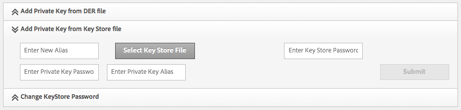
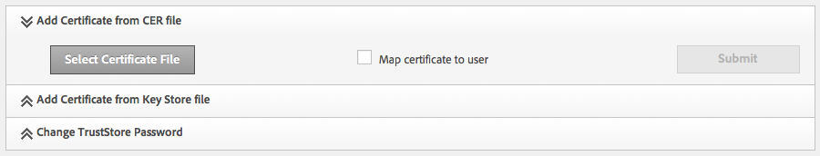

# Replicação usando SSL mútuo{#replicating-using-mutual-ssl}

Configure AEM para que um agente de replicação na instância do autor use SSL (MSSL) mútuo para se conectar com a instância de publicação. Usando o MSSL, o agente de replicação e o serviço HTTP na instância de publicação usam certificados para autenticar um ao outro.

A configuração do MSSL para replicação envolve a execução das seguintes etapas:

1. Crie ou obtenha chaves privadas e certificados para as instâncias de autor e publicação.
1. Instale as chaves e os certificados nas instâncias de autor e publicação:

   * Autor: Chave privada do autor e certificado de publicação.
   * Publicar: A chave privada da publicação e o certificado do autor. O certificado está associado à conta de usuário autenticada com o agente de replicação.

1. Configure o serviço HTTP baseado em jetty na instância Publicar.
1. Configure as propriedades de transporte e SSL do agente de replicação.


Você deve determinar qual conta de usuário está executando a replicação. Ao instalar o certificado de autor confiável na instância de publicação, o certificado é associado a essa conta de usuário.

## Obtenção ou criação de credenciais para MSSL {#obtaining-or-creating-credentials-for-mssl}

Você precisa de uma chave privada e um certificado público para as instâncias de autor e publicação:

* As chaves privadas devem estar contidas no formato pkcs#12 ou JKS.
* Os certificados devem estar contidos no formato pkcs#12 ou JKS. Além disso, o certificado contido no formato &quot;CER&quot; também pode ser adicionado ao Granite Truststore.
* Certificados podem ser autoassinados ou assinados por uma CA reconhecida.

### Formato JKS {#jks-format}

Gere uma chave privada e um certificado no formato JKS. A chave privada é armazenada em um arquivo KeyStore e o certificado é armazenado em um arquivo TrustStore. Use [Java `keytool`](https://docs.oracle.com/javase/7/docs/technotes/tools/solaris/keytool.html) para criar ambos.

Execute as seguintes etapas usando Java `keytool` para criar a chave privada e a credencial:

1. Gerar um par de chave privado-público em um KeyStore.
1. Crie ou obtenha o certificado:

   * Autoassinado: Exporte o certificado do KeyStore.
   * Assinado pela AC: Gere uma solicitação de certificado e envie-a para a CA.

1. Importe o certificado para um TrustStore.

Use o procedimento a seguir para criar uma chave privada e um certificado autoassinado para as instâncias de autor e publicação. Use valores diferentes para opções de comando de acordo.

1. Abra uma janela de linha de comando ou terminal. Para criar o par de chaves privado-público, digite o seguinte comando, usando valores de opção da tabela abaixo:

   ```shell
   keytool -genkeypair -keyalg RSA -validity 3650 -alias alias -keystore keystorename.keystore  -keypass key_password -storepass  store_password -dname "CN=Host Name, OU=Group Name, O=Company Name,L=City Name, S=State, C=Country_ Code"
   ```

   | Opção | Autor | Publicação |
   |---|---|---|
   | -alias | author | publicação |
   | -keystore | author.keystore | publish.keystore |

1. Para exportar o certificado, digite o seguinte comando usando valores de opção na tabela abaixo:

   ```shell
   keytool -exportcert -alias alias -file cert_file -storetype jks -keystore keystore -storepass store_password
   ```

   | Opção | Autor | Publicação |
   |---|---|---|
   | -alias | autor | publicação |
   | -arquivo | author.cer | publish.cer |
   | -keystore | author.keystore | publish.keystore |

### formato Pkcs#12 {#pkcs-format}

Gere uma chave privada e um certificado no formato pkcs#12. Use [openSSL](https://www.openssl.org/) para gerá-los. Use o procedimento a seguir para gerar uma chave privada e uma solicitação de certificado. Para obter o certificado, assine a solicitação com sua chave privada (certificado autoassinado) ou envie a solicitação para uma CA. Em seguida, gere o arquivo pkcs#12 que contém a chave privada e o certificado.

1. Abra uma janela de linha de comando ou terminal. Para criar a chave privada, digite o seguinte comando, usando valores de opção da tabela abaixo:

   ```shell
   openssl genrsa -out keyname.key 2048
   ```

   | Opção | Autor | Publicação |
   |---|---|---|
   | -out | author.key | publish.key |

1. Para gerar uma solicitação de certificado, digite o seguinte comando, usando valores de opção da tabela abaixo:

   ```shell
   openssl req -new -key keyname.key -out key_request.csr
   ```

   | Opção | Autor | Publicação |
   |---|---|---|
   | -key | author.key | publish.key |
   | -out | author_request.csr | publish_request.csr |

   Assine a solicitação de certificado ou envie-a para uma CA.

1. Para assinar a solicitação de certificado, digite o seguinte comando, usando valores de opção da tabela abaixo:

   ```shell
   openssl x509 -req -days 3650 -in key_request.csr -signkey keyname.key -out certificate.cer
   ```

   | Opção | Autor | Publicação |
   |---|---|---|
   | -signkey | author.key | publish.key |
   | -em | author_request.csr | publish_request.csr |
   | -out | author.cer | publish.cer |

1. Para adicionar sua chave privada e o certificado assinado a um arquivo pkcs#12, digite o seguinte comando, usando os valores de opção da tabela abaixo:

   ```shell
   openssl pkcs12 -keypbe PBE-SHA1-3DES -certpbe PBE-SHA1-3DES -export -in certificate.cer -inkey keyname.key -out pkcs12_archive.pfx -name "alias"
   ```

   | Opção | Autor | Publicação |
   |---|---|---|
   | -inkey | author.key | publish.key |
   | -out | author.pfx | publish.pfx |
   | -em | author.cer | publish.cer |
   | -name | autor | publicação |

## Instale a chave privada e o TrustStore no autor {#install-the-private-key-and-truststore-on-author}

Instale os seguintes itens na instância do autor:

* A chave privada da instância do autor.
* O certificado da instância de publicação.

Para executar o procedimento a seguir, você deve estar conectado como um administrador da instância do autor.

### Instale a chave privada do autor {#install-the-author-private-key}

1. Abra a página Gerenciamento de usuários para a instância do autor. ([http://localhost:4502/libs/granite/security/content/useradmin.html](http://localhost:4502/libs/granite/security/content/useradmin.html))
1. Para abrir as propriedades da sua conta de usuário, clique ou toque no seu nome de usuário.
1. Se o link Criar KeyStore aparecer na área Configurações da conta, clique no link. Configure uma senha e clique em OK.
1. Na área Configurações da conta, clique em Gerenciar armazenamento de chaves.

   

1. Clique em Adicionar chave privada do arquivo de armazenamento de chave.

   

1. Clique em Selecionar arquivo de armazenamento de chave, procure e selecione o arquivo author.keystore ou o arquivo author.pfx se estiver usando pkcs#12 e clique em Abrir.
1. Insira um alias e a senha para o armazenamento de chaves. Digite o alias e a senha da chave privada e clique em Enviar.
1. Feche a caixa de diálogo Gerenciamento do KeyStore.

   

### Instale o certificado de publicação {#install-the-publish-certificate}

1. Abra a página Gerenciamento de usuários para a instância do autor. ([http://localhost:4502/libs/granite/security/content/useradmin.html](http://localhost:4502/libs/granite/security/content/useradmin.html))
1. Para abrir as propriedades da sua conta de usuário, clique ou toque no seu nome de usuário.
1. Se o link Criar TrustStore aparecer na área Configurações da conta, clique no link, crie uma senha para o TrustStore e clique em OK.
1. Na área Configurações da conta, clique em Gerenciar TrustStore.
1. Clique em Adicionar certificado do arquivo CER.

   

1. Desmarque a opção Mapear certificado para usuário. Clique em Selecionar arquivo de certificado, selecione publish.cer e clique em Abrir.
1. Feche a caixa de diálogo Gerenciamento do TrustStore.

   

## Instalar chave privada e TrustStore ao publicar {#install-private-key-and-truststore-on-publish}

Instale os seguintes itens na instância de publicação:

* A chave privada da instância de publicação.
* O certificado da instância do autor. Associe o certificado ao usuário usado para executar solicitações de replicação.

Para executar o procedimento a seguir, você deve estar conectado como um administrador da instância de publicação.

### Instale a chave privada de publicação {#install-the-publish-private-key}

1. Abra a página Gerenciamento de usuários para a instância de publicação. ([http://localhost:4503/libs/granite/security/content/useradmin.html](http://localhost:4503/libs/granite/security/content/useradmin.html))
1. Para abrir as propriedades da sua conta de usuário, clique ou toque no seu nome de usuário.
1. Se o link Criar KeyStore aparecer na área Configurações da conta, clique no link. Configure uma senha e clique em OK.
1. Na área Configurações da conta, clique em Gerenciar armazenamento de chaves.
1. Clique em Adicionar chave privada do arquivo de armazenamento de chave.
1. Clique em Selecionar arquivo de armazenamento de chave, procure e selecione o arquivo publish.keystore ou o arquivo publish.pfx se estiver usando pkcs#12 e clique em Abrir.
1. Insira um alias e a senha para o armazenamento de chaves. Digite o alias e a senha da chave privada e clique em Enviar.
1. Feche a caixa de diálogo Gerenciamento do KeyStore.

### Instale o Certificado do Autor {#install-the-author-certificate}

1. Abra a página Gerenciamento de usuários para a instância de publicação. ([http://localhost:4503/libs/granite/security/content/useradmin.html](http://localhost:4503/libs/granite/security/content/useradmin.html))
1. Localize a conta de usuário que você usa para executar solicitações de replicação e clique ou toque no nome de usuário.
1. Se o link Criar TrustStore aparecer na área Configurações da conta, clique no link, crie uma senha para o TrustStore e clique em OK.
1. Na área Configurações da conta, clique em Gerenciar TrustStore.
1. Clique em Adicionar certificado do arquivo CER.
1. Verifique se a opção Mapear certificado para usuário está selecionada. Clique em Selecionar arquivo de certificado, selecione author.cer e clique em Abrir.
1. Clique em Enviar e feche a caixa de diálogo Gerenciamento do TrustStore.

## Configurar o serviço HTTP em Publicar {#configure-the-http-service-on-publish}

Configure as propriedades do Apache Felix Jetty Based HTTP Service na instância de publicação para que ele use HTTPS ao acessar o Granite Keystore. O PID do serviço é `org.apache.felix.http`.

A tabela a seguir lista as propriedades do OSGi que você precisa configurar se está usando o Console da Web.

| Nome da propriedade no console da Web | Nome da propriedade OSGi | Valor |
|---|---|---|
| Ativar HTTPS | org.apache.felix.https.enable | verdadeiro |
| Habilitar HTTPS para usar o Granite KeyStore | org.apache.felix.https.use.granite.keystore | verdadeiro |
| Porta HTTPS | org.osgi.service.http.port.secure | 8443 (ou outra porta desejada) |
| Certificado do cliente | org.apache.felix.https.clientcertificate | &quot;Certificado de cliente pretendido&quot; |

## Configurar o Agente de Replicação no Autor {#configure-the-replication-agent-on-author}

Configure o agente de replicação na instância do autor para usar o protocolo HTTPS ao se conectar à instância de publicação. Para obter informações completas sobre a configuração de agentes de replicação, consulte [Configuração dos Agentes de Replicação](/help/sites-deploying/replication.md#configuring-your-replication-agents).

Para ativar o MSSL, configure as propriedades na guia Transporte de acordo com a seguinte tabela:

<table>
 <tbody>
  <tr>
   <th>Propriedade</th>
   <th>Valor</th>
  </tr>
  <tr>
   <td>URI</td>
   <td><p>https://server_name:SSL_port/bin/receive?sling:authRequestLogin=1</p> <p>Por exemplo:</p> <p>http://localhost:8443/bin/receive?sling:authRequestLogin=1</p> </td>
  </tr>
  <tr>
   <td>Usuário</td>
   <td>Nenhum valor</td>
  </tr>
  <tr>
   <td>Senha</td>
   <td>Nenhum valor</td>
  </tr>
  <tr>
   <td>SSL</td>
   <td>Autenticação do cliente</td>
  </tr>
 </tbody>
</table>


Depois de configurar o agente de replicação, teste a conexão para determinar se o MSSL está configurado corretamente.

```xml
29.08.2014 14:02:46 - Create new HttpClient for Default Agent
29.08.2014 14:02:46 - * HTTP Version: 1.1
29.08.2014 14:02:46 - * Using Client Auth SSL configuration *
29.08.2014 14:02:46 - adding header: Action:Test
29.08.2014 14:02:46 - adding header: Path:/content
29.08.2014 14:02:46 - adding header: Handle:/content
29.08.2014 14:02:46 - deserialize content for delivery
29.08.2014 14:02:46 - No message body: Content ReplicationContent.VOID is empty
29.08.2014 14:02:46 - Sending POST request to http://localhost:8443/bin/receive?sling:authRequestLogin=1
29.08.2014 14:02:46 - sent. Response: 200 OK
29.08.2014 14:02:46 - ------------------------------------------------
29.08.2014 14:02:46 - Sending message to localhost:8443
29.08.2014 14:02:46 - >> POST /bin/receive HTTP/1.0
29.08.2014 14:02:46 - >> Action: Test
29.08.2014 14:02:46 - >> Path: /content
29.08.2014 14:02:46 - >> Handle: /content
29.08.2014 14:02:46 - >> Referer: about:blank
29.08.2014 14:02:46 - >> Content-Length: 0
29.08.2014 14:02:46 - >> Content-Type: application/octet-stream
29.08.2014 14:02:46 - --
29.08.2014 14:02:46 - << HTTP/1.1 200 OK
29.08.2014 14:02:46 - << Connection: Keep-Alive
29.08.2014 14:02:46 - << Server: Day-Servlet-Engine/4.1.64
29.08.2014 14:02:46 - << Content-Type: text/plain;charset=utf-8
29.08.2014 14:02:46 - << Content-Length: 26
29.08.2014 14:02:46 - << Date: Fri, 29 Aug 2014 18:02:46 GMT
29.08.2014 14:02:46 - << Set-Cookie: login-token=3529326c-1500-4888-a4a3-93d299726f28%3ac8be86c6-04bb-4d18-80d6-91278e08d720_98797d969258a669%3acrx.default; Path=/; HttpOnly; Secure
29.08.2014 14:02:46 - << Set-Cookie: cq-authoring-mode=CLASSIC; Path=/; Secure
29.08.2014 14:02:46 - <<
29.08.2014 14:02:46 - << R
29.08.2014 14:02:46 - << eplicationAction TEST ok.
29.08.2014 14:02:46 - Message sent.
29.08.2014 14:02:46 - ------------------------------------------------
29.08.2014 14:02:46 - Replication (TEST) of /content successful.
Replication test succeeded
```

