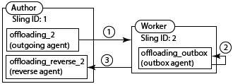

# Descarregamento de tarefas{#offloading-jobs}

## Introdução {#introduction}

A descarga distribui tarefas de processamento que somam instâncias do Experience Manager em uma topologia. Com o descarregamento, você pode usar instâncias específicas do Experience Manager para executar tipos específicos de processamento. O processamento especializado permite maximizar o uso dos recursos disponíveis do servidor.

A descarga é baseada nos recursos [Apache Sling Discovery](https://sling.apache.org/documentation/bundles/discovery-api-and-impl.html) e Sling JobManager. Para usar a descarga, adicione clusters do Experience Manager a uma topologia e identifique os tópicos de trabalho que o cluster processa. Os clusters são compostos de uma ou mais instâncias do Experience Manager, de modo que uma única instância é considerada um cluster.

Para obter informações sobre como adicionar instâncias a uma topologia, consulte [Administração de topologias](/help/sites-deploying/offloading.md#administering-topologies).

### Distribuição de trabalho {#job-distribution}

O Sling JobManager e o JobConsumer permitem a criação de jobs que são processados em uma topologia:

* JobManager: Um serviço que cria empregos para tópicos específicos.
* JobConsumer: Um serviço que executa trabalhos de um ou mais tópicos. Vários serviços JobConsumer podem ser registrados para o mesmo tópico.

Quando o JobManager cria um job, a estrutura de Descarregamento seleciona um cluster do Experience Manager na topologia para executar o job:

* O cluster deve incluir uma ou mais instâncias que estejam executando um JobConsumer registrado para o tópico do trabalho.
* O tópico deve ser ativado para pelo menos uma instância no cluster.

Consulte [Configuração do Consumo](/help/sites-deploying/offloading.md#configuring-topic-consumption) de Tópico para obter informações sobre como refinar a distribuição de jobs.

Quando a estrutura de Descarregamento seleciona um cluster para executar um job e o cliente é composto de várias instâncias, a Distribuição de Sling determina qual instância no cluster executa o job.

### Cargas de trabalho {#job-payloads}

A estrutura de descarga oferece suporte a cargas de trabalho que associam jobs a recursos no repositório. As cargas de trabalho são úteis quando as tarefas são criadas para recursos de processamento e a tarefa é descarregada para outro computador.

Após a criação de um cargo, a carga fica apenas garantida na instância que cria o job. Ao descarregar a tarefa, os agentes de replicação garantem que a carga seja criada na instância que eventualmente consuma a tarefa. Quando a execução da tarefa é concluída, a replicação reversa faz com que a carga seja copiada de volta para a instância que criou a tarefa.

## Administração de topologias {#administering-topologies}

As topologias são clusters do Experience Manager que estão participando da descarga em conjunto. Um cluster consiste em uma ou mais instâncias de servidor do Experience Manager (uma única instância é considerada um cluster).

Cada instância do Experience Manager executa os seguintes serviços relacionados à descarga:

* Serviço de descoberta: Envia solicitações para um Conector de topologia para unir a topologia.
* Conector de topologia: Recebe as solicitações de ingresso e aceita ou recusa cada solicitação.

O Serviço de descoberta de todos os membros da topologia aponta para o Conector de topologia em um dos membros. Nas seções a seguir, esse membro é chamado de membro raiz.

Cada cluster na topologia contém uma instância reconhecida como líder. O líder do cluster interage com a topologia em nome dos outros membros do cluster. Quando o pontilhado deixa o cluster, um novo pontilhado do cluster é automaticamente escolhido.

### Exibição da topologia {#viewing-the-topology}

Use o Navegador de topologia para explorar o estado da topologia na qual a instância do Experience Manager está participando. O Navegador de topologia mostra os clusters e as instâncias da topologia.

Para cada cluster, você verá uma lista de membros do cluster que indica a ordem na qual cada membro ingressou no cluster e qual membro é o Líder. A propriedade Current indica a instância que você está administrando no momento.

Para cada instância do cluster, é possível ver várias propriedades relacionadas à topologia:

* Uma lista de tópicos para o consumidor de trabalho do exemplo.
* Os pontos finais expostos para conexão com a topologia.
* Os tópicos da tarefa para os quais a instância está registrada para descarregamento.
* Os tópicos da tarefa que a instância processa.

1. Usando a interface de usuário para toque, clique na guia Ferramentas. ([http://localhost:4502/tools.html](http://localhost:4502/tools.html))
1. Na área Operações de granito, clique em Descarregamento do navegador.
1. No painel de navegação, clique em Navegador de topologia.

   Os clusters que estão participando da topologia são exibidos.

   

1. Clique em um cluster para ver uma lista das instâncias no cluster e sua ID, status atual e status de pontilhado.
1. Clique em uma ID de instância para ver as propriedades mais detalhadas.

Você também pode usar o Console da Web para obter informações sobre topologia de visualização. O console fornece mais informações sobre os clusters de topologia:

* Qual instância é a instância local.
* Os serviços do Conector de topologia que esta instância usa para se conectar à topologia (de saída) e aos serviços que se conectam a essa instância (de entrada).
* Alterar histórico das propriedades de topologia e instância.

Use o seguinte procedimento para abrir a página Gerenciamento de topologia do Console da Web:

1. Abra o Console da Web em seu navegador. ([http://localhost:4502/system/console](http://localhost:4502/system/console))
1. Clique em Principal > Gerenciamento de topologia.

   

### Configuração da associação à topologia {#configuring-topology-membership}

O Apache Sling Resource-Based Discovery Service é executado em cada instância para controlar como as instâncias do Experience Manager interagem com uma topologia.

O serviço Discovery envia solicitações POST periódicas (pulsações) aos serviços do Topology Connector para estabelecer e manter conexões com a topologia. O serviço Topology Connector mantém uma lista de permissões de endereços IP ou nomes de host que podem participar da topologia:

* Para unir uma instância a uma topologia, especifique o URL do serviço Conector de topologia do membro raiz.
* Para permitir que uma instância participe de uma topologia, adicione a instância à lista de permissões do serviço Conector de topologia do membro raiz.

Use o console da Web ou um nó sling:OsgiConfig para configurar as seguintes propriedades do serviço org.apache.sling.detection.impt.Config:

<table>
 <tbody>
  <tr>
   <th>Nome da Propriedade</th>
   <th>Nome OSGi</th>
   <th>Descrição</th>
   <th>Valor padrão</th>
  </tr>
  <tr>
   <td>Tempo limite do Heartbeat (segundos)</td>
   <td>HeartbeatTimeout</td>
   <td>A quantidade de tempo em segundos para aguardar uma resposta de pulsação antes que a instância de destino seja considerada indisponível. </td>
   <td>20</td>
  </tr>
  <tr>
   <td>Intervalo de pulsação (segundos)</td>
   <td>HeartbeatInterval</td>
   <td>A quantidade de tempo em segundos entre as pulsações.</td>
   <td>15</td>
  </tr>
  <tr>
   <td>Atraso mínimo no Evento (segundos)</td>
   <td>minEventDelay</td>
   <td>
Quando uma alteração ocorre na topologia, o tempo necessário para atrasar a alteração de estado de TOPOLOGY_CHANGING para TOPOLOGY_CHANGED. Cada alteração que ocorre quando o estado é TOPOLOGY_CHANGING aumenta o atraso nessa quantidade de tempo.
 
Esse atraso impede que os ouvintes sejam inundados com eventos. 
 
Para não usar atraso, especifique 0 ou um número negativo.
 </td>
   <td>3</td>
  </tr>
  <tr>
   <td>URLs do conector de topologia</td>
   <td>topologyConnectorUrls</td>
   <td>Os URLs dos serviços do Topology Connector para enviar mensagens de pulsação.</td>
   <td>http://localhost:4502/libs/sling/topology/connector</td>
  </tr>
  <tr>
   <td>Lista de permissões do conector de topologia</td>
   <td>topologyConnectorWhitelist</td>
   <td>A lista de endereços IP ou nomes de host que o serviço local do Topology Connector permite na topologia. </td>
   <td>
localhost
 
127.0.0.1
 </td>
  </tr>
  <tr>
   <td>Nome do descritor do repositório</td>
   <td>leaderElectionRepositoryDescriptor</td>
   <td> </td>
   <td>&lt;sem valor&gt;</td>
  </tr>
 </tbody>
</table>

Use o procedimento a seguir para conectar uma instância do CQ ao membro raiz de uma topologia. O procedimento aponta a instância para o URL do Conector de topologia do membro de topologia raiz. Execute esse procedimento em todos os membros da topologia.

1. Abra o Console da Web em seu navegador. ([http://localhost:4502/system/console](http://localhost:4502/system/console))
1. Clique em Principal > Gerenciamento de topologia.
1. Clique em Configurar serviço de descoberta.
1. Adicione um item à propriedade URLs do conector de topologia e especifique o URL do serviço do conector de topologia raiz. O URL está no formato https://rootservername:4502/libs/sling/topology/connector.

Execute o seguinte procedimento no membro raiz da topologia. O procedimento adiciona os nomes dos outros membros da topologia à lista de permissões do serviço de descoberta.

1. Abra o Console da Web em seu navegador. ([http://localhost:4502/system/console](http://localhost:4502/system/console))
1. Clique em Principal > Gerenciamento de topologia.
1. Clique em Configurar serviço de descoberta.
1. Para cada membro da topologia, adicione um item à propriedade Lista de permissões do conector de topologia e especifique o nome do host ou endereço IP do membro da topologia.

## Configuração do consumo de tópicos {#configuring-topic-consumption}

Use o navegador de descarga para configurar o consumo de tópicos das instâncias do Experience Manager na topologia. Para cada instância, é possível especificar os tópicos que ela consome. Por exemplo, para configurar sua topologia de forma que somente uma instância consuma tópicos de um tipo específico, desative o tópico em todas as instâncias, exceto uma.

Os trabalhos são instâncias distribuídas de quantidade que têm o tópico associado ativado usando a lógica round-robin.

1. Usando a interface de usuário para toque, clique na guia Ferramentas. ([http://localhost:4502/tools.html](http://localhost:4502/tools.html))
1. Na área Operações de granito, clique em Descarregamento do navegador.
1. No painel de navegação, clique em Descarregamento do navegador.

   Os tópicos de descarga e as instâncias do servidor que podem consumir os tópicos são exibidos.

   

1. Para desativar o consumo de um tópico para uma instância, abaixo do nome do tópico, clique em Desativar ao lado da instância.
1. Para configurar todo o consumo de tópico de uma instância, clique no identificador de instância abaixo de qualquer tópico.

   

1. Clique em um dos seguintes botões ao lado de um tópico para configurar o comportamento de consumo da instância e clique em Salvar:

   * Ativado: Esta instância consome trabalhos deste tópico.
   * Desativado: Esta instância não consome trabalhos deste tópico.
   * Exclusivo: Essa instância consome trabalhos apenas deste tópico.
   **Observação:** Quando você seleciona Exclusivo para um tópico, todos os outros tópicos são automaticamente definidos como Desativado.

### Consumidores de trabalho instalados {#installed-job-consumers}

Várias implementações do JobConsumer são instaladas com o Experience Manager. Os tópicos para os quais esses Consumidores de trabalho estão registrados são exibidos no Navegador de descarga. Os tópicos adicionais que aparecem são aqueles que JobConsumers personalizados registraram. A tabela a seguir descreve o JobConsumers padrão.

| Tópico do trabalho | PID do serviço | Descrição |
|---|---|---|
| / | org.apache.sling.event.impl.jobs.deprecated.EventAdminBridge | Instalado com o Apache Sling. Processa trabalhos que o administrador do evento OSGi gera para compatibilidade com versões anteriores. |
| com/day/cq/Replication/job/&amp;ast; | com.day.cq.replication.impl.AgentManagerImpl | Um agente de replicação que replica cargas de trabalho. |
| com/adobe/granite/workflow/offloading | com.adobe.granite.workflow.core.offloading.WorkflowOffloadingJobConsumer | Processa trabalhos que o fluxo de trabalho do [!UICONTROL DAM Update Asset Offloader] gera. |

### Desativar e ativar tópicos para uma instância {#disabling-and-enabling-topics-for-an-instance}

O serviço Gerenciador de consumidor de trabalho do Apache Sling fornece propriedades de lista de permissões e de negação de tópicos. Configure essas propriedades para ativar ou desativar o processamento de tópicos específicos em uma instância do Experience Manager.

**Observação:** Se a instância pertencer a uma topologia, você também poderá usar o Navegador de descarga em qualquer computador na topologia para ativar ou desativar tópicos.

A lógica que cria a lista de tópicos ativados primeiro permite todos os tópicos que estão na lista de permissões e, em seguida, remove tópicos que estão na lista negra.Por padrão, todos os tópicos estão ativados (o valor da lista de permissões é `*`) e nenhum tópico está desativado (a lista negra não tem valor).

Use o Console da Web ou um `sling:OsgiConfig` nó para configurar as seguintes propriedades. Para `sling:OsgiConfig` nós, o PID do serviço Gerenciador de Consumidores de Trabalho é org.apache.sling.evento.impl.jobs.JobConsumerManager.

| Nome da propriedade no console da Web | ID do OSGi | Descrição |
|---|---|---|
| Lista de permissões do tópico | job.consumermanager.whitelist | Uma lista de tópicos que o serviço local do JobManager processa. O valor padrão do &amp;ast; faz com que todos os tópicos sejam enviados para o serviço TopicConsumer registrado. |
| Lista negra de tópicos | job.consumermanager.blacklist | Uma lista de tópicos que o serviço local do JobManager não processa. |

## Criação De Agentes De Replicação Para Descarregamento {#creating-replication-agents-for-offloading}

A estrutura de descarga usa replicação para transportar recursos entre o autor e o trabalhador. A estrutura de descarga cria automaticamente agentes de replicação quando as instâncias ingressam na topologia. Os agentes são criados com valores padrão. Você deve alterar manualmente a senha que os agentes usam para autenticação.

>[!CAUTION]
>
>Um problema conhecido com os agentes de replicação gerados automaticamente requer a criação manual de novos agentes de replicação. Siga o procedimento em [Problemas ao usar os agentes](/help/sites-deploying/offloading.md#problems-using-the-automatically-generated-replication-agents) de replicação gerados automaticamente antes de criar os agentes para descarga.

Crie os agentes de replicação que transportam cargas de trabalho entre instâncias para descarregamento. A ilustração a seguir mostra os agentes que devem ser descarregados do autor para uma instância de trabalho. O autor tem uma Sling ID de 1 e a instância do trabalhador tem uma Sling ID de 2:

Essa configuração exige os três agentes a seguir:

1. Um agente de saída na instância do autor que é replicado para a instância do trabalhador.
1. Um agente reverso na instância do autor que puxa da caixa de saída na instância do trabalhador.
1. Um agente da caixa de saída na instância do trabalhador.

Esse esquema de replicação é semelhante ao usado entre as instâncias de autor e publicação. No entanto, para a situação de descarregamento, todas as instâncias envolvidas são instâncias de criação.

>[!NOTE]
>
>A estrutura de descarga usa a topologia para obter os endereços IP das instâncias de descarga. A estrutura então cria automaticamente os agentes de replicação com base nesses endereços IP. Se os endereços IP das instâncias de descarga forem alterados posteriormente, a alteração será propagada automaticamente na topologia depois que a instância for reiniciada. No entanto, a estrutura de descarga não atualiza automaticamente os agentes de replicação para refletir os novos endereços IP. Para evitar essa situação, use endereços IP fixos para todas as instâncias na topologia.

### Como nomear os agentes de replicação para descarga {#naming-the-replication-agents-for-offloading}

Use um formato específico para a propriedade ***Name*** dos agentes de replicação para que a estrutura de descarga use automaticamente o agente correto para instâncias específicas do trabalhador.

**Nomear o agente de saída na instância do autor:**

`offloading_<slingid>`, onde `<slingid>` é a Sling ID da instância do trabalhador.

Exemplo: `offloading_f5c8494a-4220-49b8-b079-360a72f71559`

**Nomear o agente reverso na instância do autor:**

`offloading_reverse_<slingid>`, onde `<slingid>` é a Sling ID da instância do trabalhador.

Exemplo: `offloading_reverse_f5c8494a-4220-49b8-b079-360a72f71559`

**Nomear a caixa de saída na instância do trabalhador:**

`offloading_outbox`

### Criação do agente de saída {#creating-the-outgoing-agent}

1. Criar um Agente **de** Replicação no autor. (Consulte a [documentação dos agentes](/help/sites-deploying/replication.md)de replicação). Especifique qualquer **Título**. O **Nome** deve seguir a convenção de nomenclatura.
1. Crie o agente usando as seguintes propriedades:

   | Propriedade | Valor |
   |---|---|
   | Configurações > Tipo de serialização | Padrão |
   | Transporte >URI de transporte | https://*`<ip of target instance>`*:*`<port>`*`/bin/receive?sling:authRequestLogin=1` |
   | Transporte > Usuário de transporte | Usuário de replicação na instância do público alvo |
   | Transporte > Senha de transporte | Senha do usuário de replicação na instância do público alvo |
   | Estendido > Método HTTP | POSTAGEM |
   | Acionadores > Ignorar padrão | Verdadeiro |

### Criação do agente reverso {#creating-the-reverse-agent}

1. Criar um Agente **de Replicação** Inversa no autor. (Consulte a [documentação dos agentes](/help/sites-deploying/replication.md)de replicação.) Especifique qualquer **Título**. O **Nome** deve seguir a convenção de nomenclatura.
1. Crie o agente usando as seguintes propriedades:

   | Propriedade | Valor |
   |---|---|
   | Configurações > Tipo de serialização | Padrão |
   | Transporte >URI de transporte | https://*`<ip of target instance>`*:*`<port>`*`/bin/receive?sling:authRequestLogin=1` |
   | Transporte > Usuário de transporte | Usuário de replicação na instância do público alvo |
   | Transporte > Senha de transporte | Senha do usuário de replicação na instância do público alvo |
   | Estendido > Método HTTP | GET |

### Criação do agente da caixa de saída {#creating-the-outbox-agent}

1. Crie um Agente **de** Replicação na instância do trabalhador. (Consulte a [documentação dos agentes](/help/sites-deploying/replication.md)de replicação.) Especifique qualquer **Título**. O **Nome** deve ser `offloading_outbox`.
1. Crie o agente usando as seguintes propriedades.

   | Propriedade | Valor |
   |---|---|
   | Configurações > Tipo de serialização | Padrão |
   | Transporte >URI de transporte | repo://var/replication/outbox |
   | Acionador > Ignorar padrão | Verdadeiro |

### Localizando a ID de Sling {#finding-the-sling-id}

Obtenha a Sling ID de uma instância do Experience Manager usando um dos seguintes métodos:

* Abra o Console da Web e, nas Configurações Sling, localize o valor da propriedade Sling ID ([http://localhost:4502/system/console/status-slingsettings](http://localhost:4502/system/console/status-slingsettings)). Esse método é útil se a instância ainda não fizer parte da topologia.
* Use o navegador Topologia se a instância já fizer parte da topologia.

## Descarregamento do processamento de ativos DAM {#offloading-the-processing-of-dam-assets}

Configure as instâncias de uma topologia para que instâncias específicas executem o processamento em segundo plano de ativos adicionados ou atualizados no DAM.

Por padrão, o Experience Manager executa o fluxo de trabalho do Ativo [!UICONTROL de atualização de] DAM quando um ativo DAM é alterado ou um é adicionado ao DAM. Altere o comportamento padrão para que o Experience Manager execute o fluxo de trabalho do [!UICONTROL DAM Update Asset Offloader] . Este fluxo de trabalho gera um trabalho do JobManager que tem um tópico de `com/adobe/granite/workflow/offloading`. Em seguida, configure a topologia para que o trabalho seja descarregado para um funcionário dedicado.

>[!CAUTION]
>
>Nenhum fluxo de trabalho deve ser temporário quando usado com a descarga do fluxo de trabalho. Por exemplo, o fluxo de trabalho Atualizar ativo  DAM não deve ser temporário quando usado para descarregamento de ativos. Para definir/desdefinir o sinalizador transitório em um fluxo de trabalho, consulte Workflows transitórios.

O procedimento a seguir assume as seguintes características para a topologia de descarga:

* Uma ou mais instâncias do Experience Manager estão criando instâncias com as quais os usuários interagem para adicionar ou atualizar ativos DAM.
* Os usuários não devem interagir diretamente com uma ou mais instâncias do Experience Manager que processam os ativos DAM. Essas instâncias são dedicadas ao processamento em segundo plano de ativos DAM.

1. Em cada instância do Experience Manager, configure o Discovery Service para que aponte para o Topography Connector raiz. (Consulte [Configuração da associação](#title4)de topologia.)
1. Configure o Conector de Topografia raiz para que as instâncias de conexão estejam na lista de permissões.
1. Abra o navegador de descarga e desative o `com/adobe/granite/workflow/offloading` tópico nas instâncias com que os usuários interagem para carregar ou alterar ativos do DAM.

   

1. Em cada instância com a qual os usuários interagem para carregar ou alterar ativos DAM, configure os iniciadores de fluxo de trabalho para usar o fluxo de trabalho de Descarregamento [!UICONTROL de ativos de atualização de] DAM:

   1. Abra o console Fluxo de trabalho.
   1. Clique na guia Iniciador.
   1. Localize as duas configurações do Iniciador que executam o fluxo de trabalho do Ativo [!UICONTROL de atualização do] DAM. Um tipo de evento de configuração do iniciador é Nó criado e o outro tipo é Nó modificado.
   1. Altere ambos os tipos de evento para que eles executem o fluxo de trabalho de Descarregamento [!UICONTROL de ativos de atualização do] DAM. (Para obter informações sobre configurações de iniciador, consulte [Iniciar Workflows quando os nós mudarem](/help/sites-administering/workflows-starting.md).)

1. Nas instâncias que executam o processamento em segundo plano de ativos DAM, desative os iniciadores de fluxo de trabalho que executam o fluxo de trabalho do Ativo [!UICONTROL de atualização do] DAM.

## Leitura adicional {#further-reading}

Além dos detalhes apresentados nesta página, você também pode ler o seguinte:

* Para obter informações sobre o uso de APIs Java para criar trabalhos e consumidores de trabalho, consulte [Criação e consumo de trabalhos para descarregamento](/help/sites-developing/dev-offloading.md).
