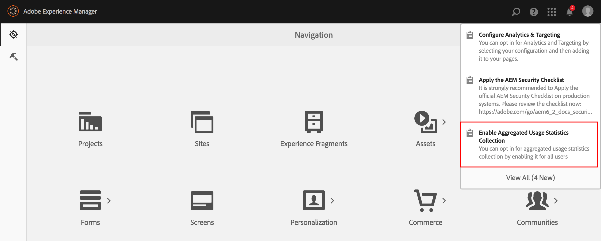

# Optar Pela Coleta De Estatísticas De Uso Agregado{#opting-into-aggregated-usage-statistics-collection}

## Introdução {#introduction}

Você pode ajudar a melhorar a Adobe Marketing Cloud enviando estatísticas da Adobe sobre como você interage com o AEM. Essas informações não contêm dados sobre os visitantes do site de sua empresa e serão usadas apenas para ajudar a Adobe a fornecer, oferecer suporte e melhorar a experiência do usuário.

Você pode optar pela coleta de estatísticas de uso usando a interface de usuário de toque ou o console da Web.

>[!NOTE]
>
>Existem várias normas relativas à proteção de dados e à privacidade; incluindo, por exemplo, o RGPD e o CCPA. O AEM Sites está pronto para ajudar os clientes com suas obrigações de proteção de dados e conformidade com a privacidade. Esta página orienta os clientes pelos procedimentos para aceitar (ou recusar) a Coleta de Estatísticas de Uso Agregado.
>
>Para obter mais informações, consulte também o Centro [de privacidade da](https://www.adobe.com/privacy.html)Adobe.

>[!NOTE]
>
>Você também pode optar por não participar a qualquer momento usando o Console [da](/help/sites-deploying/opt-in-aggregated-usage-statistics.md#opt-in-by-using-the-web-console) Web ou não selecionando a opção de não participação na tela de aceitação do AEM.

## Aceitar usando a interface de usuário de toque {#opt-in-by-using-the-touch-ui}

Na primeira vez que você iniciar o AEM, poderá aceitar usando a interface de usuário para toque da seguinte maneira:

1. Na tela Navegação do AEM, clique no ícone **Caixa de entrada** (sino).

   

1. Na lista suspensa, clique em &quot;**Ativar coleta** de estatísticas de uso agregado&quot;.

   

1. Na tela de aceitação, selecione &quot;**Permitir coleta de estatísticas** de uso agregadas&quot;.

   

1. Clique em &quot;**Concluído**&quot;.

## Aceitar usando o Console da Web {#opt-in-by-using-the-web-console}

Você pode aceitar (ou recusar) usando o Console da Web da seguinte maneira:

1. Na tela Navegação do AEM, clique em **Ferramentas** e em **Operações**.

   

1. Na janela Operações, clique em Console **Web**.

   

1. Procure &quot;Coleta **de estatísticas de uso** agregado&quot;.
1. Clique no ícone **Editar** .

   

1. Marque a caixa de seleção **Ativado** . Como alternativa, você pode desmarcar a caixa de seleção se quiser recusar a coleta de estatísticas de uso.

   

1. Clique em **Salvar**.

