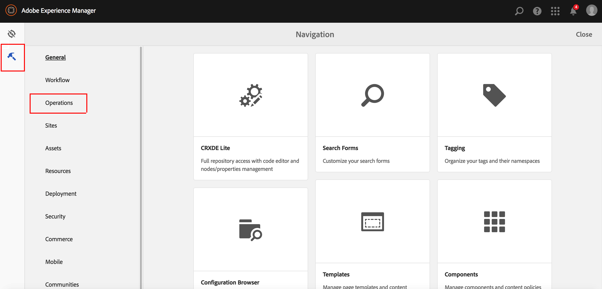

# Ativando A Coleta De Estatísticas De Uso Agregado{#opting-into-aggregated-usage-statistics-collection}

## Introdução {#introduction}

Você pode ajudar a melhorar o Adobe Marketing Cloud enviando estatísticas de Adobe sobre como você interage com o AEM. Estas informações não contêm dados sobre os visitantes do site da sua empresa e só serão usadas para ajudar o Adobe a fornecer, suportar e melhorar a experiência do usuário.

Você pode aderir à coleção de estatísticas de uso usando a interface para toque ou o Console da Web.

>[!NOTE]
>
>Há várias regulamentações de proteção e privacidade de dados; incluindo, por exemplo, o GDPR e o CCPA. A AEM Sites está pronta para ajudar os clientes em suas obrigações de conformidade de proteção e privacidade de dados. Esta página orienta os clientes por meio dos procedimentos de aceitação (ou recusa) da Coleta de Estatísticas de Uso Agregado.
>
>Para obter mais informações, consulte também o [Centro de privacidade do Adobe](https://www.adobe.com/br/privacy.html).

>[!NOTE]
>
>Também é possível recusar a qualquer momento usando o [Console da Web](/help/sites-deploying/opt-in-aggregated-usage-statistics.md#opt-in-by-using-the-web-console) ou não selecionando a opção de aceitação na tela de aceitação do AEM.

## Aceitar usando a interface para toque {#opt-in-by-using-the-touch-ui}

Na primeira vez que você iniciar o AEM, poderá aceitar usando a interface para toque da seguinte maneira:

1. Na tela de Navegação do AEM, clique na guia **Caixa de entrada** Ícone (sino).

   

1. Na lista suspensa, clique em &quot;**Permitir coleta de dados estatísticos de uso agregados**&quot;.

   

1. Na tela de aceitação, selecione &quot;**Permitir coleta de dados estatísticos de uso agregados**&quot;.

   

1. Clique em &quot;**Concluído**&quot;.

## Aceitar usando o console da Web {#opt-in-by-using-the-web-console}

Você pode aceitar (ou recusar) usando o Console da Web da seguinte maneira:

1. Na tela de Navegação do AEM, clique em **Ferramentas** e depois **Operações**.

   

1. Na janela Operações, clique em **Console da Web**.

   

1. Pesquisar por &quot;**Coleta de Estatísticas de Uso Agregado**&quot;.
1. Clique em **Editar** ícone.

   

1. Marque a caixa de seleção **Ativado.** Como alternativa, desmarque a caixa de seleção se desejar recusar a coleta de estatísticas de uso.

   

1. Clique em **Salvar**.
