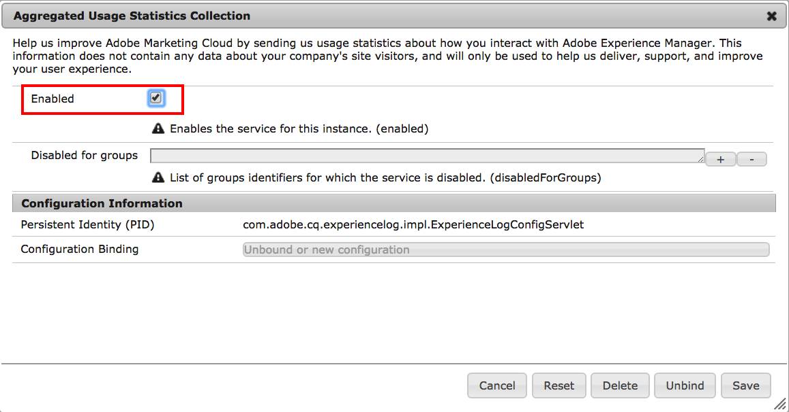

# Aceitação Em Coleta De Estatísticas De Uso Agregado{#opting-into-aggregated-usage-statistics-collection}

## Introdução {#introduction}

Você pode ajudar a melhorar o Adobe Marketing Cloud enviando estatísticas do Adobe sobre como você interage com o AEM. Essas informações não contêm dados sobre os visitantes do site de sua empresa e serão usadas apenas para ajudar o Adobe a fornecer, oferecer suporte e melhorar a experiência do usuário.

Você pode aderir à coleção de estatísticas de uso usando a interface do usuário de toque ou o console da Web.

>[!NOTE]
>
>Existem vários regulamentos sobre proteção de dados e privacidade; incluindo, por exemplo, o GDPR e a CCPA. A AEM Sites está pronta para ajudar os clientes com suas obrigações de proteção de dados e conformidade com a privacidade. Esta página orienta os clientes pelos procedimentos para aceitar (ou não) a Coleta de Estatísticas de Uso Agregado.
>
>Para obter mais informações, consulte também a [Adobe Center](https://www.adobe.com/br/privacy.html).

>[!NOTE]
>
>Você também pode recusar a qualquer momento usando o [Console da Web](/help/sites-deploying/opt-in-aggregated-usage-statistics.md#opt-in-by-using-the-web-console) ou não selecionando a opção de aceitação na tela de aceitação AEM.

## Aceitar usando a interface de toque {#opt-in-by-using-the-touch-ui}

Na primeira vez que você começar a AEM, é possível aceitar usando a interface do usuário de toque da seguinte maneira:

1. Na tela Navegação de AEM, clique no botão **Caixa de entrada** Ícone (sino).

   

1. Na lista suspensa, clique em &quot;**Ativar Coleta de Estatísticas de Uso Agregado**&quot;.

   

1. Na tela de opção, selecione &quot;**Permitir coleta de estatísticas de uso agregadas**&quot;.

   

1. Clique em &quot;**Concluído**&quot;.

## Aceitar usando o Console da Web {#opt-in-by-using-the-web-console}

Você pode aceitar (ou rejeitar) usando o Console da Web da seguinte maneira:

1. Na tela Navegação de AEM, clique em **Ferramentas** e depois **Operações**.

   

1. Na janela Operações, clique em **Console da Web**.

   

1. Pesquisar por &quot;**Coleta de Estatísticas de Uso Agregado**&quot;.
1. Clique no botão **Editar** ícone .

   

1. Marque a caixa de seleção **Ativado.** Como alternativa, você pode desmarcar a caixa de seleção se quiser recusar a coleta de estatísticas de uso.

   

1. Clique em **Salvar**.
