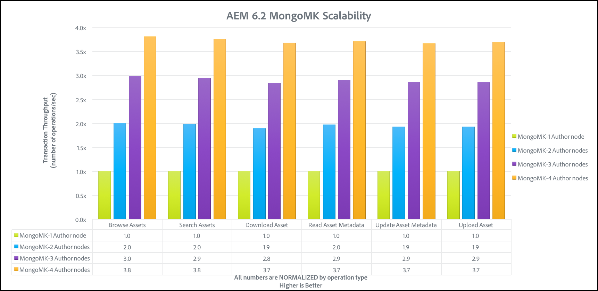

# Diretrizes de desempenho{#performance-guidelines}

Esta página fornece orientações gerais sobre como otimizar o desempenho da sua implantação de AEM. Se você for novo em AEM, passe as páginas a seguir antes de ler as diretrizes de desempenho do start:

* [AEM conceitos básicos](/help/sites-deploying/deploy.md#basic-concepts)
* [Visão geral do Armazenamento no AEM](/help/sites-deploying/storage-elements-in-aem-6.md#overview-of-storage-in-aem)
* [Implantações recomendadas](/help/sites-deploying/recommended-deploys.md)
* [Requisitos técnicos](/help/sites-deploying/technical-requirements.md)

As opções de implantação disponíveis para AEM são ilustradas abaixo (role para visualização em todas as opções):

<table>
 <tbody>
  <tr>
   <td>
<strong>AEM</strong>
 
<strong>Produto</strong>
 </td>
   <td>
<strong>Topologia</strong>
 </td>
   <td>
<strong>Sistema Operacional</strong>
 </td>
   <td>
<strong>Servidor de aplicativos</strong>
 </td>
   <td>
<strong>JRE</strong>
 </td>
   <td>
<strong>Segurança</strong>
 </td>
   <td>
<strong>Kernel Micro</strong>
 </td>
   <td>
<strong>Armazenamento de dados</strong>
 </td>
   <td>
<strong>Indexação</strong>
 </td>
   <td>
<strong>Servidor Web</strong>
 </td>
   <td>
<strong>Navegador</strong>
 </td>
   <td>
<strong>Marketing Cloud</strong>
 </td>
  </tr>
  <tr>
   <td>
Sites
 </td>
   <td>
Não-HA
 </td>
   <td>
Windows
 </td>
   <td>
CQSE
 </td>
   <td>
Oracle
 </td>
   <td>
LDAP
 </td>
   <td>
Tar
 </td>
   <td>
Segmento
 </td>
   <td>
Propriedade
 </td>
   <td>
Apache
 </td>
   <td>
Borda
 </td>
   <td>
Target
 </td>
  </tr>
  <tr>
   <td>
Ativos
 </td>
   <td>
Publicar-HA
 </td>
   <td>
Solaris
 </td>
   <td>
WebLogic
 </td>
   <td>
IBM
 </td>
   <td>
SAML
 </td>
   <td>
MongoDB
 </td>
   <td>
Arquivo
 </td>
   <td>
Lucene
 </td>
   <td>
IIS
 </td>
   <td>
IE
 </td>
   <td>
Análise
 </td>
  </tr>
  <tr>
   <td>
Communities
 </td>
   <td>
Autor-CS
 </td>
   <td>
Chapéu vermelho
 </td>
   <td>
WebSphere
 </td>
   <td>
HP
 </td>
   <td>
Oauth
 </td>
   <td>
RDB/Oracle
 </td>
   <td>
S3/Azure
 </td>
   <td>
Solr
 </td>
   <td>
iPlanet
 </td>
   <td>
FireFox
 </td>
   <td>
Campanha
 </td>
  </tr>
  <tr>
   <td>
Forms
 </td>
   <td>
Descarga do autor
 </td>
   <td>
HP-UX
 </td>
   <td>
Tomcat
 </td>
   <td>
 
 </td>
   <td>
 
 </td>
   <td>
RDB/DB2
 </td>
   <td>
MongoDB
 </td>
   <td>
 
 </td>
   <td>
 
 </td>
   <td>
Cromo
 </td>
   <td>
Social
 </td>
  </tr>
  <tr>
   <td>
Móvel
 </td>
   <td>
Author-Cluster
 </td>
   <td>
IBM AIX
 </td>
   <td>
JBoss
 </td>
   <td>
 
 </td>
   <td>
 
 </td>
   <td>
RDB/MySQL
 </td>
   <td>
RDBMS
 </td>
   <td>
 
 </td>
   <td>
 
 </td>
   <td>
Safari
 </td>
   <td>
Público
 </td>
  </tr>
  <tr>
   <td>
Vários sites
 </td>
   <td>
ASRP
 </td>
   <td>
SUCO
 </td>
   <td>
 
 </td>
   <td>
 
 </td>
   <td>
 
 </td>
   <td>
RDB/SQLServer
 </td>
   <td>
 
 </td>
   <td>
 
 </td>
   <td>
 
 </td>
   <td>
 
 </td>
   <td>
Ativos
 </td>
  </tr>
  <tr>
   <td>
Commerce
 </td>
   <td>
MSRP
 </td>
   <td>
Apple OS
 </td>
   <td>
 
 </td>
   <td>
 
 </td>
   <td>
 
 </td>
   <td>
 
 </td>
   <td>
 
 </td>
   <td>
 
 </td>
   <td>
 
 </td>
   <td>
 
 </td>
   <td>
Ativação
 </td>
  </tr>
  <tr>
   <td>
Dynamic Media
 </td>
   <td>
JSRP
 </td>
   <td>
 
 </td>
   <td>
 
 </td>
   <td>
 
 </td>
   <td>
 
 </td>
   <td>
 
 </td>
   <td>
 
 </td>
   <td>
 
 </td>
   <td>
 
 </td>
   <td>
 
 </td>
   <td>
Móvel
 </td>
  </tr>
  <tr>
   <td>
Brand Portal
 </td>
   <td>
J2E
 </td>
   <td>
 
 </td>
   <td>
 
 </td>
   <td>
 
 </td>
   <td>
 
 </td>
   <td>
 
 </td>
   <td>
 
 </td>
   <td>
 
 </td>
   <td>
 
 </td>
   <td>
 
 </td>
   <td>
 
 </td>
  </tr>
  <tr>
   <td>
AoD
 </td>
   <td>
 
 </td>
   <td>
 
 </td>
   <td>
 
 </td>
   <td>
 
 </td>
   <td>
 
 </td>
   <td>
 
 </td>
   <td>
 
 </td>
   <td>
 
 </td>
   <td>
 
 </td>
   <td>
 
 </td>
   <td>
 
 </td>
  </tr>
  <tr>
   <td>
LiveFyre
 </td>
   <td>
 
 </td>
   <td>
 
 </td>
   <td>
 
 </td>
   <td>
 
 </td>
   <td>
 
 </td>
   <td>
 
 </td>
   <td>
 
 </td>
   <td>
 
 </td>
   <td>
 
 </td>
   <td>
 
 </td>
   <td>
 
 </td>
  </tr>
  <tr>
   <td>
Screens
 </td>
   <td>
 
 </td>
   <td>
 
 </td>
   <td>
 
 </td>
   <td>
 
 </td>
   <td>
 
 </td>
   <td>
 
 </td>
   <td>
 
 </td>
   <td>
 
 </td>
   <td>
 
 </td>
   <td>
 
 </td>
   <td>
 
 </td>
  </tr>
  <tr>
   <td>
Segurança do Documento
 </td>
   <td>
 
 </td>
   <td>
 
 </td>
   <td>
 
 </td>
   <td>
 
 </td>
   <td>
 
 </td>
   <td>
 
 </td>
   <td>
 
 </td>
   <td>
 
 </td>
   <td>
 
 </td>
   <td>
 
 </td>
   <td>
 
 </td>
  </tr>
  <tr>
   <td>
Process Mgt
 </td>
   <td>
 
 </td>
   <td>
 
 </td>
   <td>
 
 </td>
   <td>
 
 </td>
   <td>
 
 </td>
   <td>
 
 </td>
   <td>
 
 </td>
   <td>
 
 </td>
   <td>
 
 </td>
   <td>
 
 </td>
   <td>
 
 </td>
  </tr>
  <tr>
   <td>
aplicativo para desktop
 </td>
   <td>
 
 </td>
   <td>
 
 </td>
   <td>
 
 </td>
   <td>
 
 </td>
   <td>
 
 </td>
   <td>
 
 </td>
   <td>
 
 </td>
   <td>
 
 </td>
   <td>
 
 </td>
   <td>
 
 </td>
   <td>
 
 </td>
  </tr>
 </tbody>
</table>

>[!NOTE]
>
>As diretrizes de desempenho se aplicam principalmente à AEM Sites.

## Quando usar as Diretrizes de Desempenho {#when-to-use-the-performance-guidelines}

Você deve usar as diretrizes de desempenho nas seguintes situações:

* **Primeira implantação**: Ao planejar a implantação do AEM Sites ou do Assets pela primeira vez, é importante compreender as opções disponíveis ao configurar o Micro Kernel, o Node Store e o Data Store (em comparação com as configurações padrão). Por exemplo, alterar as configurações padrão do Data Store para TarMK para File Data Store.
* **Atualizando para uma nova versão**: Ao atualizar para uma nova versão, é importante entender as diferenças de desempenho em relação ao ambiente em execução. Por exemplo, atualizando de AEM 6.1 para 6.2 ou de AEM 6.0 CRX2 para 6.2 OAK.
* **O tempo de resposta é lento**: Quando a arquitetura de notebook selecionada não atender aos seus requisitos, é importante entender as diferenças de desempenho em comparação a outras opções de topologia. Por exemplo, implantar o TarMK em vez de MongoMK ou usar um Arquivo de armazenamento de dados em vez de um Amazon S3 ou Microsoft Azure Data Store.
* **Adicionar mais autores**: Quando a topologia TarMK recomendada não atender aos requisitos de desempenho e o upgrade do nó Autor atingir a capacidade máxima disponível, é importante entender as diferenças de desempenho em comparação ao uso do MongoMK com três ou mais nós de Autor. Por exemplo, implantar MongoMK em vez de TarMK.
* **Adicionar mais conteúdo**: Quando a arquitetura recomendada do Data Store não atender aos seus requisitos, é importante entender as diferenças de desempenho em relação a outras opções do Data Store. Exemplo: usando o Amazon S3 ou o Microsoft Azure Data Store em vez de um File Data Store.

## Introdução {#introduction}

Este capítulo fornece uma visão geral da arquitetura AEM e de seus componentes mais importantes. Ele também fornece diretrizes de desenvolvimento e descreve os cenários de teste usados nos testes de benchmark TarMK e MongoMK.

### A Plataforma AEM {#the-aem-platform}

A plataforma AEM consiste nos seguintes componentes:

Para obter mais informações sobre a plataforma AEM, consulte [O que é AEM](/help/sites-deploying/deploy.md#what-is-aem).

### A arquitetura AEM {#the-aem-architecture}

Há três blocos componentes importantes para uma implantação AEM. A **Instância do autor** que é usada por autores, editores e aprovadores de conteúdo para criar e revisar conteúdo. Quando o conteúdo é aprovado, é publicado em um segundo tipo de instância chamada **Instância de publicação** de onde é acessada pelos usuários finais. O terceiro elemento é o **Dispatcher**, que é um módulo que lida com o armazenamento em cache e a filtragem de URL e está instalado no servidor Web. Para obter informações adicionais sobre a arquitetura AEM, consulte [Cenários de implantação típicos](/help/sites-deploying/deploy.md#typical-deployment-scenarios).

### Micro Kernels {#micro-kernels}

Micro Kernels atua como gerentes de persistência em AEM. Existem três tipos de Micro Kernels usados com AEM: TarMK, MongoDB e Banco de Dados Relacional (sob suporte restrito). Escolher um que atenda às suas necessidades depende da finalidade de sua ocorrência e do tipo de implantação que você esteja considerando. Para obter informações adicionais sobre Micro Kernels, consulte a página [Implantações recomendadas](/help/sites-deploying/recommended-deploys.md).

### Nodestore {#nodestore}

Em AEM, os dados binários podem ser armazenados independentemente dos nós de conteúdo. O local onde os dados binários são armazenados é chamado de **Armazenamento de Dados**, enquanto o local dos nós e propriedades de conteúdo é chamado de **Armazenamento de Nó**.

>[!NOTE]
>
>A Adobe recomenda que o TarMK seja a tecnologia de persistência padrão usada pelos clientes para as instâncias de autor e publicação do AEM.

>[!CAUTION]
>
>O Micro Kernel do Banco de Dados Relacional está sob suporte restrito. Entre em contato com o [Atendimento ao cliente do Adobe](https://helpx.adobe.com/br/marketing-cloud/contact-support.html) antes de usar esse tipo de Micro Kernel.

### Armazenamento de dados {#data-store}

Ao lidar com um grande número de binários, recomenda-se que um armazenamento de dados externo seja usado em vez dos armazenamentos de nó padrão para maximizar o desempenho. Por exemplo, se seu projeto exigir um grande número de ativos de mídia, armazená-los no Arquivo ou no Arquivo de Dados do Azure/S3 tornará o acesso mais rápido do que armazená-los diretamente em um MongoDB.

Para obter mais detalhes sobre as opções de configuração disponíveis, consulte [Configuração de Nó e Armazenamento de Dados](/help/sites-deploying/data-store-config.md).

>[!NOTE]
>
>A Adobe recomenda escolher a opção de implantar AEM no Azure ou nos serviços da Web da Amazon (AWS) usando os serviços gerenciados da Adobe, onde os clientes se beneficiarão de uma equipe que tem a experiência e as habilidades de implantar e operar AEM nesses ambientes de computação em nuvem. Consulte nossa [documentação adicional sobre os Serviços gerenciados da Adobe](https://www.adobe.com/marketing-cloud/enterprise-content-management/managed-services-cloud-platform.html?aemClk=t).
>
>Para obter recomendações sobre como implantar AEM no Azure ou AWS, fora dos Serviços gerenciados da Adobe, recomendamos trabalhar diretamente com o provedor de nuvem ou um de nossos parceiros que ofereçam suporte à implantação de AEM no ambiente de nuvem de sua escolha. O provedor ou parceiro de nuvem selecionado é responsável pelas especificações de dimensionamento, design e implementação da arquitetura que eles suportarão para atender aos seus requisitos específicos de desempenho, carga, escalabilidade e segurança.
>
>Para obter detalhes adicionais, consulte também a página [requisitos técnicos](/help/sites-deploying/technical-requirements.md#supported-platforms).

### Pesquisar {#search-features}

Nesta seção estão listados os provedores de índice personalizados usados com AEM. Para saber mais sobre indexação, consulte [Oak Query e Indexing](/help/sites-deploying/queries-and-indexing.md).

>[!NOTE]
>
>Para a maioria das implantações, o Adobe recomenda o uso do Índice Lucene. Você deve usar o Solr somente para escalabilidade em implantações especializadas e complexas.

### Diretrizes de desenvolvimento {#development-guidelines}

Você deve se desenvolver para AEM visando **desempenho e escalabilidade**. Abaixo estão apresentadas várias práticas recomendadas que podem ser seguidas:

**DO**

* Aplicar separação de apresentação, lógica e conteúdo
* Usar AEM APIs existentes (por exemplo: Linho) e ferramentas (ex: Replicação)
* Desenvolver no contexto do conteúdo real
* Desenvolver para obter um cache ideal
* Minimizar o número de salvamentos (ex: usando workflows transitórios)
* Verifique se todos os pontos finais HTTP são RESTful
* Restringir o escopo da observação do JCR
* Tenha cuidado com o fio assíncrono

**NÃO**

* Não use APIs JCR diretamente, se você puder
* Não altere /libs, mas use sobreposições
* Não use query sempre que possível
* Não use o Sling Bindings para obter os serviços OSGi no código Java, mas use:

   * @Referência em um componente DS
   * @Injetar em um modelo Sling
   * sling.getService() em uma classe Sightly Use
   * sling.getService() em um JSP
   * um ServiceTracker
   * acesso direto ao registro do serviço OSGi

Para obter mais detalhes sobre o desenvolvimento em AEM, leia [Desenvolvimento - Noções básicas](/help/sites-developing/the-basics.md). Para obter mais práticas recomendadas, consulte [Práticas recomendadas de desenvolvimento](/help/sites-developing/best-practices.md).

### Cenários de benchmark {#benchmark-scenarios}

>[!NOTE]
>
>Todos os testes de referência mostrados nesta página foram realizados em laboratório.

Os cenários de teste detalhados abaixo são usados para as seções de benchmark dos capítulos TarMK, MongoMk e TarMK vs MongoMk. Para ver qual cenário foi usado para um teste de benchmark específico, leia o campo Cenário da tabela [Especificações técnicas](/help/sites-deploying/performance-guidelines.md#tarmk-performance-benchmark).

**Cenário de produto único**

Ativos AEM:

* Interações do usuário: Procurar ativos / Pesquisar ativos / Baixar ativos / Ler metadados do ativo / Atualizar metadados do ativo / Carregar ativo / Executar fluxo de trabalho de upload do ativo
* Modo de execução: usuários simultâneos, interação única por usuário

**Cenário de combinação de produtos**

AEM Sites + Ativos:

* Interações do usuário do Sites: Ler página do artigo / Ler página / Criar parágrafo / Editar parágrafo / Criar página de conteúdo / Ativar página de conteúdo / Pesquisa do autor
* Interações do usuário do Assets: Procurar ativos / Pesquisar ativos / Baixar ativos / Ler metadados do ativo / Atualizar metadados do ativo / Carregar ativo / Executar fluxo de trabalho de upload do ativo
* Modo de execução: usuários simultâneos, interações mistas por usuário

**Cenário de caso de uso vertical**

Mídia:

* Ler Página Do Artigo (27.4%), Ler Página (10.9%), Criar Sessão (2.6%), Ativar Página Do Conteúdo (1.7%), Criar Página Do Conteúdo (0.4%), Criar Parágrafo (4.3%), Editar Parágrafo (0.9%), Componente Da Imagem (0.9%), Pesquisar Ativos (20%), Ler Metadados Do Ativo (8.5%), Baixar Ativo (4.2%), Pesquisar Ativo (0.2%), Atualizar Metadados de Ativo (2.4%), Carregar Ativo (1.2%), Procurar Projeto (4.9%), Ler Projeto (6.6%), Adicionar Ativo do Projeto (1.2%), Adicionar Site do Projeto (1.2%), Criar Projeto (0.1%), Pesquisa do Autor )
* Modo de execução: usuários simultâneos, interações mistas por usuário

## TarMK {#tarmk}

Este capítulo fornece diretrizes gerais de desempenho para o TarMK que especificam os requisitos mínimos de arquitetura e a configuração das configurações. Os testes de referência são também fornecidos para maior clarificação.

O Adobe recomenda que o TarMK seja a tecnologia de persistência padrão usada pelos clientes em todos os cenários de implantação, tanto para as instâncias de autor e publicação do AEM.

Para obter mais informações sobre o TarMK, consulte [Cenários de Implantação](/help/sites-deploying/recommended-deploys.md#deployment-scenarios) e [Armazenamento Tar](/help/sites-deploying/storage-elements-in-aem-6.md#tar-storage).

### Diretrizes mínimas de arquitetura do TarMK {#tarmk-minimum-architecture-guidelines}

>[!NOTE]
>
>As diretrizes mínimas de arquitetura apresentadas abaixo são para ambientes de produção e sites de alto tráfego. Essas **não** são as [especificações mínimas](/help/sites-deploying/technical-requirements.md#prerequisites) necessárias para executar AEM.

Para estabelecer um bom desempenho ao usar o TarMK, você deve start da seguinte arquitetura:

* Uma instância de autor
* Duas instâncias de publicação
* Dois Dispatchers

Veja a seguir as diretrizes de arquitetura para AEM sites e AEM Assets.

>[!NOTE]
>
>A replicação sem binários deve ser ativada **ON** se o Repositório de Dados de Ficheiros for partilhado.

**Diretrizes da arquitetura Tar para AEM Sites**

**Diretrizes da arquitetura Tar para AEM Assets**

### Diretriz de configurações do TarMK {#tarmk-settings-guideline}

Para obter um bom desempenho, siga as diretrizes de configuração apresentadas abaixo. Para obter instruções sobre como alterar as configurações, [consulte esta página](https://helpx.adobe.com/experience-manager/kb/performance-tuning-tips.html).

<table>
 <tbody>
  <tr>
   <td><strong>Configuração</strong></td>
   <td><strong>Parâmetro</strong></td>
   <td><strong>Valor</strong></td>
   <td><strong>Descrição</strong></td>
  </tr>
  <tr>
   <td>Sling Job Queues</td>
   <td><code>queue.maxparallel</code></td>
   <td>Defina o valor para metade do número de núcleos da CPU. </td>
   <td>Por padrão, o número de threads simultâneos por fila de trabalhos é igual ao número de núcleos da CPU.</td>
  </tr>
  <tr>
   <td>Fila de Fluxo de Trabalho Transitório Granite</td>
   <td><code>Max Parallel</code></td>
   <td>Defina o valor para metade do número de núcleos da CPU</td>
   <td> </td>
  </tr>
  <tr>
   <td>Parâmetros JVM</td>
   <td>
<code>Doak.queryLimitInMemory</code>
 
<code>Doak.queryLimitReads</code>
 
<code>Dupdate.limit</code>
 
<code>Doak.fastQuerySize</code>
 </td>
   <td>
500000
 
100000
 
250000
 
Verdadeiro
 </td>
   <td>Adicione esses parâmetros JVM no script de start AEM para impedir que query expansivos sobrecarreguem os sistemas.</td>
  </tr>
  <tr>
   <td>Configuração do índice Lucene</td>
   <td>
<code>CopyOnRead</code>
 
<code>CopyOnWrite</code>
 
<code>Prefetch Index Files</code>
 </td>
   <td>
Ativado
 
Ativado
 
Ativado
 </td>
   <td>Para obter mais detalhes sobre os parâmetros disponíveis, consulte <a href="https://jackrabbit.apache.org/oak/docs/query/lucene.html">esta página</a>.</td>
  </tr>
  <tr>
   <td>Armazenamento de dados = Armazenamento de dados S3</td>
   <td>
<code>maxCachedBinarySize</code>
 
<code>cacheSizeInMB</code>
 </td>
   <td>
1048576 (1MB) ou menor
 
2-10% do tamanho máximo do heap
 </td>
   <td>Consulte também <a href="/help/sites-deploying/data-store-config.md#data-store-configurations">Configurações de armazenamento de dados</a>.</td>
  </tr>
  <tr>
   <td>Fluxo de trabalho do Ativo de atualização do DAM</td>
   <td><code>Transient Workflow</code></td>
   <td>verificado</td>
   <td>Esse fluxo de trabalho controla a atualização de ativos.</td>
  </tr>
  <tr>
   <td>Writeback de metadados DAM</td>
   <td><code>Transient Workflow</code></td>
   <td>verificado</td>
   <td>Esse fluxo de trabalho gerencia XMP gravação no binário original e define a última data modificada no JCR.</td>
  </tr>
 </tbody>
</table>

### Benchmark de desempenho TarMK {#tarmk-performance-benchmark}

#### Especificações técnicas {#technical-specifications}

Os testes de benchmark foram executados com as seguintes especificações:

|  | **Nó do autor** |
|---|---|
| Servidor | Hardware Bare Metal (HP) |
| Sistema Operacional | Linux RedHat |
| CPU / núcleos | CPU Intel(R) Xeon(R) E5-2407 @2,40GHz, 8 núcleos |
| RAM | 32 GB |
| Disco | Magnético |
| Java | Oracle JRE versão 8 |
| Heap JVM | 16 GB |
| Produto | AEM 6.2 |
| Nodestore | TarMK |
| Armazenamento de dados | Arquivo DS |
| Cenário | Produto único: Ativos / 30 threads simultâneos |

#### Resultados do benchmark de desempenho {#performance-benchmark-results}

>[!NOTE]
>
>Os números apresentados abaixo foram normalizados para 1 como linha de base e não são os números de débito reais.

 

## MongoMK {#mongomk}

O principal motivo para escolher o backend de persistência MongoMK sobre TarMK é dimensionar as instâncias horizontalmente. Isso significa ter duas ou mais instâncias do autor ativas em execução o tempo todo e usar o MongoDB como sistema de armazenamento de persistência. A necessidade de executar mais de uma instância do autor resulta geralmente do fato de a CPU e a capacidade de memória de um único servidor, suportando todas as atividades de criação simultâneas, não serem mais sustentáveis.

Para obter mais informações sobre o TarMK, consulte [Cenários de Implantação](/help/sites-deploying/recommended-deploys.md#deployment-scenarios) e [Armazenamento Mongo](/help/sites-deploying/storage-elements-in-aem-6.md#mongo-storage).

### Diretrizes mínimas de arquitetura do MongoMK {#mongomk-minimum-architecture-guidelines}

Para estabelecer um bom desempenho ao usar o MongoMK, você deve start da seguinte arquitetura:

* Três instâncias de Autor
* Duas instâncias de publicação
* Três instâncias MongoDB
* Dois Dispatchers

>[!NOTE]
>
>Em ambientes de produção, o MongoDB sempre será usado como um conjunto de réplicas com um primário e dois secundários. Leituras e escritos vão para o primário e leituras podem ir para os secundários. Se o armazenamento não estiver disponível, um dos secundários pode ser substituído por um árbiter, mas os conjuntos de réplicas MongoDB sempre devem ser compostos por um número ímpar de instâncias.

>[!NOTE]
>
>A replicação sem binários deve ser ativada **ON** se o Repositório de Dados de Ficheiros for partilhado.

### Diretrizes de configurações do MongoMK {#mongomk-settings-guidelines}

Para obter um bom desempenho, siga as diretrizes de configuração apresentadas abaixo. Para obter instruções sobre como alterar as configurações, [consulte esta página](https://helpx.adobe.com/experience-manager/kb/performance-tuning-tips.html).

<table>
 <tbody>
  <tr>
   <td><strong>Configuração</strong></td>
   <td><strong>Parâmetro</strong></td>
   <td><strong>Valor (padrão)</strong></td>
   <td><strong>Descrição</strong></td>
  </tr>
  <tr>
   <td>Sling Job Queues</td>
   <td><code>queue.maxparallel</code></td>
   <td>Defina o valor para metade do número de núcleos da CPU. </td>
   <td>Por padrão, o número de threads simultâneos por fila de trabalhos é igual ao número de núcleos da CPU.</td>
  </tr>
  <tr>
   <td>Fila de Fluxo de Trabalho Transitório Granite</td>
   <td><code>Max Parallel</code></td>
   <td>Defina o valor para metade do número de núcleos da CPU.</td>
   <td> </td>
  </tr>
  <tr>
   <td>Parâmetros JVM</td>
   <td>
<code>Doak.queryLimitInMemory</code>
 
<code>Doak.queryLimitReads</code>
 
<code>Dupdate.limit</code>
 
<code>Doak.fastQuerySize</code>
 
<code>Doak.mongo.maxQueryTimeMS</code>
 </td>
   <td>
500000
 
100000
 
250000
 
Verdadeiro
 
60000
 </td>
   <td>Adicione esses parâmetros JVM no script de start AEM para impedir que query expansivos sobrecarreguem os sistemas.</td>
  </tr>
  <tr>
   <td>Configuração do índice Lucene</td>
   <td>
<code>CopyOnRead</code>
 
<code>CopyOnWrite</code>
 
<code>Prefetch Index Files</code>
 </td>
   <td>
Ativado
 
Ativado
 
Ativado
 </td>
   <td>Para obter mais detalhes sobre os parâmetros disponíveis, consulte <a href="https://jackrabbit.apache.org/oak/docs/query/lucene.html">esta página</a>.</td>
  </tr>
  <tr>
   <td>Armazenamento de dados = Armazenamento de dados S3</td>
   <td>
<code>maxCachedBinarySize</code>
 
<code>cacheSizeInMB</code>
 </td>
   <td>
1048576 (1MB) ou menor
 
2-10% do tamanho máximo do heap
 </td>
   <td>Consulte também <a href="/help/sites-deploying/data-store-config.md#data-store-configurations">Configurações de armazenamento de dados</a>.</td>
  </tr>
  <tr>
   <td>DocumentNodeStoreService</td>
   <td>
<code>cache</code>
 
<code>nodeCachePercentage</code>
 
<code>childrenCachePercentage</code>
 
<code>diffCachePercentage</code>
 
<code>docChildrenCachePercentage</code>
 
<code>prevDocCachePercentage</code>
 
<code>persistentCache</code>
 </td>
   <td>
2048
 
35 (25)
 
20 (10)
 
30 (5)
 
10 (3)
 
4 (4)
 
./cache,size=2048,binary=0,-compact,-compress
 </td>
   <td>
O tamanho padrão do cache é definido como 256 MB.
 
Tem impacto no tempo necessário para executar a invalidação do cache.
 </td>
  </tr>
  <tr>
   <td>observação do carvalho</td>
   <td>
<code>thread pool</code>
 
<code>length</code>
 </td>
   <td>
mín. &amp; máx. = 20
 
50000
 </td>
   <td> </td>
  </tr>
 </tbody>
</table>

### Benchmark de desempenho MongoMK {#mongomk-performance-benchmark}

### Especificações técnicas {#technical-specifications-1}

Os testes de benchmark foram executados com as seguintes especificações:

|  | **Nó Autor** | **Nó MongoDB** |
|---|---|---|
| Servidor | Hardware Bare Metal (HP) | Hardware Bare Metal (HP) |
| Sistema Operacional | Linux RedHat | Linux RedHat |
| CPU / núcleos | CPU Intel(R) Xeon(R) E5-2407 @2,40GHz, 8 núcleos | CPU Intel(R) Xeon(R) E5-2407 @2,40GHz, 8 núcleos |
| RAM | 32 GB | 32 GB |
| Disco | Magnético - >1 k IOPS | Magnético - >1 k IOPS |
| Java | Oracle JRE versão 8 | N/A |
| Heap JVM | 16 GB | N/A |
| Produto | AEM 6.2 | MongoDB 3.2 WiredTiger |
| Nodestore | MongoMK | N/A |
| Armazenamento de dados | Arquivo DS | N/A |
| Cenário | Produto único: Ativos / 30 threads simultâneos | Produto único: Ativos / 30 threads simultâneos |

### Resultados do benchmark de desempenho {#performance-benchmark-results-1}

>[!NOTE]
>
>Os números apresentados abaixo foram normalizados para 1 como linha de base e não são os números de débito reais.

 

## TarMK vs MongoMK {#tarmk-vs-mongomk}

A regra básica que precisa ser considerada ao escolher entre os dois é que o TarMK foi projetado para desempenho, enquanto o MongoMK é usado para escalabilidade. O Adobe recomenda que o TarMK seja a tecnologia de persistência padrão usada pelos clientes em todos os cenários de implantação, tanto para as instâncias de autor e publicação do AEM.

O principal motivo para escolher o backend de persistência MongoMK sobre TarMK é dimensionar as instâncias horizontalmente. Isso significa ter duas ou mais instâncias do autor ativas em execução o tempo todo e usar o MongoDB como sistema de armazenamento de persistência. A necessidade de executar mais de uma instância do autor geralmente resulta do fato de a CPU e a capacidade de memória de um único servidor, suportando todas as atividades de criação simultâneas, não serem mais sustentáveis.

Para obter mais detalhes sobre TarMK vs MongoMK, consulte [Implantações recomendadas](/help/sites-deploying/recommended-deploys.md#microkernels-which-one-to-use).

### Diretrizes TarMK vs MongoMk {#tarmk-vs-mongomk-guidelines}

**Benefícios do TarMK**

* Propósito criado para aplicativos de gestão de conteúdo
* Os arquivos são sempre consistentes e podem ser copiados em backup usando qualquer ferramenta de backup baseada em arquivos
* Fornece um mecanismo de failover - consulte [Cold Standby](/help/sites-deploying/tarmk-cold-standby.md) para obter mais detalhes
* Oferece armazenamento de dados confiável e de alto desempenho com mínima sobrecarga operacional
* TCO mais baixo (custo total de propriedade)

**Critérios de escolha de MongoMK**

* Número de usuários nomeados conectados em um dia: nos milhares ou mais
* Número de usuários simultâneos: nas centenas ou mais
* Volume de ingestões de ativos por dia: em centenas de milhares ou mais
* Volume de edições de página por dia: em centenas de milhares ou mais
* Volume de pesquisas por dia: em dezenas de milhares ou mais

### TarMK vs MongoMK Benchmarks {#tarmk-vs-mongomk-benchmarks}

>[!NOTE]
>
>Os números apresentados abaixo foram normalizados para 1 como linha de base e não são números reais de débito.

### Especificações técnicas do cenário 1 {#scenario-technical-specifications}

<table>
 <tbody>
  <tr>
   <td><strong> </strong></td>
   <td><strong>Nó OAK do autor</strong></td>
   <td><strong>Nó MongoDB</strong></td>
   <td> </td>
  </tr>
  <tr>
   <td>Servidor</td>
   <td>Hardware Bare Metal (HP)</td>
   <td>Hardware Bare Metal (HP)</td>
   <td> </td>
  </tr>
  <tr>
   <td>Sistema Operacional</td>
   <td>Linux RedHat</td>
   <td>Linux RedHat</td>
   <td> </td>
  </tr>
  <tr>
   <td>CPU / núcleos</td>
   <td>CPU Intel(R) Xeon(R) E5-2407 @2,40GHz, 8 núcleos</td>
   <td>CPU Intel(R) Xeon(R) E5-2407 @2,40GHz, 8 núcleos</td>
   <td> </td>
  </tr>
  <tr>
   <td>RAM</td>
   <td>32 GB</td>
   <td>32 GB</td>
   <td> </td>
  </tr>
  <tr>
   <td>Disco</td>
   <td>Magnético - &gt;1 k IOPS</td>
   <td>Magnético - &gt;1 k IOPS</td>
   <td> </td>
  </tr>
  <tr>
   <td>Java</td>
   <td>Oracle JRE versão 8</td>
   <td>N/A</td>
   <td> </td>
  </tr>
  <tr>
   <td>Heap16 GB JVM</td>
   <td>16 GB</td>
   <td>N/A</td>
   <td> </td>
  </tr>
  <tr>
   <td>Produto </td>
   <td>AEM 6.2</td>
   <td>MongoDB 3.2 WiredTiger</td>
   <td> </td>
  </tr>
  <tr>
   <td>Nodestore</td>
   <td>TarMK ou MongoMK</td>
   <td>N/A</td>
   <td> </td>
  </tr>
  <tr>
   <td>Armazenamento de dados</td>
   <td>Arquivo DS </td>
   <td>N/A</td>
   <td> </td>
  </tr>
  <tr>
   <td>Cenário</td>
   <td>
  Produto único: Ativos / 30 threads simultâneos por execução
 </td>
   <td> </td>
   <td> </td>
  </tr>
 </tbody>
</table>

### Resultados do benchmark de desempenho do cenário 1 {#scenario-performance-benchmark-results}

### Especificações técnicas do cenário 2 {#scenario-technical-specifications-1}

>[!NOTE]
>
>Para ativar o mesmo número de Autores com MongoDB como com um sistema TarMK, você precisa de um cluster com dois nós AEM. Um cluster MongoDB de quatro nós pode lidar com 1,8 vezes o número de autores de uma instância TarMK. Um cluster MongoDB de oito nós pode lidar com 2,3 vezes o número de Autores que uma instância TarMK.

<table>
 <tbody>
  <tr>
   <td><strong> </strong></td>
   <td><strong>Nó TarMK do autor</strong></td>
   <td><strong>Nó MongoMK do autor</strong></td>
   <td><strong>Nó MongoDB</strong></td>
  </tr>
  <tr>
   <td>Servidor</td>
   <td>AWS c3.8xlarge</td>
   <td>AWS c3.8xlarge</td>
   <td>AWS c3.8xlarge</td>
  </tr>
  <tr>
   <td>Sistema Operacional</td>
   <td>Linux RedHat</td>
   <td>Linux RedHat</td>
   <td>Linux RedHat</td>
  </tr>
  <tr>
   <td>CPU / núcleos</td>
   <td>32</td>
   <td>32</td>
   <td>32</td>
  </tr>
  <tr>
   <td>RAM</td>
   <td>60 GB</td>
   <td>60 GB</td>
   <td>60 GB</td>
  </tr>
  <tr>
   <td>Disco</td>
   <td>SSD - IOPS de 10 mil</td>
   <td>SSD - IOPS de 10 mil</td>
   <td>SSD - IOPS de 10 mil</td>
  </tr>
  <tr>
   <td>Java</td>
   <td>Oracle JRE versão 8</td>
   <td>  Oracle JRE versão 8</td>
   <td>N/A</td>
  </tr>
  <tr>
   <td>Heap16 GB JVM</td>
   <td>30 GB</td>
   <td>30 GB</td>
   <td>N/A</td>
  </tr>
  <tr>
   <td>Produto </td>
   <td>AEM 6.2</td>
   <td>AEM 6.2</td>
   <td>  MongoDB 3.2 WiredTiger</td>
  </tr>
  <tr>
   <td>Nodestore</td>
   <td>TarMK </td>
   <td>MongoMK</td>
   <td>  N/A</td>
  </tr>
  <tr>
   <td>Armazenamento de dados</td>
   <td>Arquivo DS </td>
   <td>  Arquivo DS</td>
   <td>  N/A</td>
  </tr>
  <tr>
   <td>Cenário</td>
   <td>
    Caso de uso vertical: Threads simultâneos de mídia/2000
 </td>
   <td></td>
   <td></td>
  </tr>
 </tbody>
</table>

### Resultados do benchmark de desempenho do cenário 2 {#scenario-performance-benchmark-results-1}

### Diretrizes de escalabilidade da arquitetura para AEM Sites e ativos {#architecture-scalability-guidelines-for-aem-sites-and-assets}

## Resumo das diretrizes de desempenho {#summary-of-performance-guidelines}

As orientações apresentadas nesta página podem resumir-se da seguinte forma:

* **O TarMK com File** Datastoreé a arquitetura recomendada para a maioria dos clientes:

   * Topologia mínima: uma instância do autor, duas instâncias de publicação, dois Dispatchers
   * Replicação sem binários ativada se o Repositório de Dados de Arquivo for compartilhado

* **MongoMK com File** Datastoreé a arquitetura recomendada para a escalabilidade horizontal da camada Autor:

   * Topologia mínima: três instâncias de Autor, três instâncias de MongoDB, duas instâncias de Publicação, dois Dispatchers
   * Replicação sem binários ativada se o Repositório de Dados de Arquivo for compartilhado

* **Os** notebooks devem ser armazenados no disco local, não em um armazenamento conectado à rede (NAS)
* Ao usar **Amazon S3**:

   * O armazenamento de dados Amazon S3 é compartilhado entre a camada Autor e Publicar
   * A replicação sem binários deve estar ativada
   * A coleta de lixo do Datastore requer uma primeira execução em todos os nós Autor e Publicação e, em seguida, uma segunda execução em Autor

* **O índice personalizado deve ser criado além do** indexado predefinido com base nas pesquisas mais comuns

   * Os índices de Lucene devem ser usados para os índices personalizados

* **A personalização do fluxo de trabalho pode melhorar substancialmente o desempenho**, por exemplo, a remoção da etapa de vídeo no fluxo de trabalho &quot;Atualizar ativo&quot;, a desativação de ouvintes que não são usados etc.

Para obter mais detalhes, leia também a página [Implantações recomendadas](/help/sites-deploying/recommended-deploys.md).
