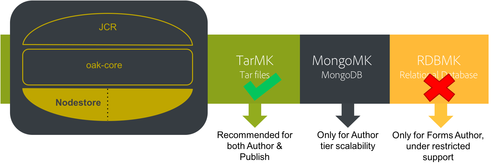

# Diretrizes de desempenho{#performance-guidelines}

Esta página fornece diretrizes gerais sobre como otimizar o desempenho da implementação do AEM. Se você é novo no AEM, reveja as seguintes páginas antes de começar a ler as diretrizes de desempenho:

* [Conceitos básicos sobre AEM](/help/sites-deploying/deploy.md#basic-concepts)
* [Visão geral do armazenamento no AEM](/help/sites-deploying/storage-elements-in-aem-6.md#overview-of-storage-in-aem)
* [Implantações recomendadas](/help/sites-deploying/recommended-deploys.md)
* [Requisitos técnicos](/help/sites-deploying/technical-requirements.md)

Ilustradas abaixo estão as opções de implantação disponíveis para AEM (role a tela para exibir todas as opções):

<table>
 <tbody>
  <tr>
   <td>
<strong>AEM</strong>
 
<strong>Produto</strong>
 </td>
   <td>
<strong>Topologia</strong>
 </td>
   <td>
<strong>Sistema Operacional</strong>
 </td>
   <td>
<strong>Servidor de aplicativos</strong>
 </td>
   <td>
<strong>JRE</strong>
 </td>
   <td>
<strong>Segurança</strong>
 </td>
   <td>
<strong>Micro Kernel</strong>
 </td>
   <td>
<strong>Armazenamento de dados</strong>
 </td>
   <td>
<strong>Indexação</strong>
 </td>
   <td>
<strong>Servidor Web</strong>
 </td>
   <td>
<strong>Navegador</strong>
 </td>
   <td>
<strong>Experience Cloud</strong>
 </td>
  </tr>
  <tr>
   <td>
Sites
 </td>
   <td>
Não HA
 </td>
   <td>
Windows
 </td>
   <td>
CQSE
 </td>
   <td>
Oracle
 </td>
   <td>
LDAP
 </td>
   <td>
TAR
 </td>
   <td>
Segmento
 </td>
   <td>
Propriedade
 </td>
   <td>
Apache
 </td>
   <td>
Edge
 </td>
   <td>
Planejado
 </td>
  </tr>
  <tr>
   <td>
Assets
 </td>
   <td>
Publish-HA
 </td>
   <td>
Solaris™
 </td>
   <td>
WebLogic
 </td>
   <td>
IBM®
 </td>
   <td>
SAML
 </td>
   <td>
MongoDB
 </td>
   <td>
Arquivo
 </td>
   <td>
Lucene
 </td>
   <td>
IIS
 </td>
   <td>
IE
 </td>
   <td>
Analytics
 </td>
  </tr>
  <tr>
   <td>
Communities
 </td>
   <td>
Author-CS
 </td>
   <td>
Red Hat®
 </td>
   <td>
WebSphere®
 </td>
   <td>
HP
 </td>
   <td>
Oauth
 </td>
   <td>
RDB/Oracle
 </td>
   <td>
S3/Azure
 </td>
   <td>
Solr
 </td>
   <td>
iPlanet
 </td>
   <td>
FireFox
 </td>
   <td>
Campaign
 </td>
  </tr>
  <tr>
   <td>
Forms
 </td>
   <td>
Descarregamento de autor
 </td>
   <td>
HP-UX
 </td>
   <td>
Tomcat
 </td>
   <td>
 
 </td>
   <td>
 
 </td>
   <td>
RDB/DB2
 </td>
   <td>
MongoDB
 </td>
   <td>
 
 </td>
   <td>
 
 </td>
   <td>
Chrome
 </td>
   <td>
Social
 </td>
  </tr>
  <tr>
   <td>
Móvel
 </td>
   <td>
Cluster do autor
 </td>
   <td>
IBM® AIX®
 </td>
   <td>
JBoss®
 </td>
   <td>
 
 </td>
   <td>
 
 </td>
   <td>
RDB/MySQL
 </td>
   <td>
RDBMS
 </td>
   <td>
 
 </td>
   <td>
 
 </td>
   <td>
Safari
 </td>
   <td>
Público
 </td>
  </tr>
  <tr>
   <td>
Vários sites
 </td>
   <td>
ASRP
 </td>
   <td>
SUSE®
 </td>
   <td>
 
 </td>
   <td>
 
 </td>
   <td>
 
 </td>
   <td>
RDB/SQLServer
 </td>
   <td>
 
 </td>
   <td>
 
 </td>
   <td>
 
 </td>
   <td>
 
 </td>
   <td>
Assets
 </td>
  </tr>
  <tr>
   <td>
Commerce
 </td>
   <td>
MSRP
 </td>
   <td>
SO APPLE
 </td>
   <td>
 
 </td>
   <td>
 
 </td>
   <td>
 
 </td>
   <td>
 
 </td>
   <td>
 
 </td>
   <td>
 
 </td>
   <td>
 
 </td>
   <td>
 
 </td>
   <td>
Ativação
 </td>
  </tr>
  <tr>
   <td>
Dynamic Media
 </td>
   <td>
JSRP
 </td>
   <td>
 
 </td>
   <td>
 
 </td>
   <td>
 
 </td>
   <td>
 
 </td>
   <td>
 
 </td>
   <td>
 
 </td>
   <td>
 
 </td>
   <td>
 
 </td>
   <td>
 
 </td>
   <td>
Móvel
 </td>
  </tr>
  <tr>
   <td>
Brand Portal
 </td>
   <td>
J2E
 </td>
   <td>
 
 </td>
   <td>
 
 </td>
   <td>
 
 </td>
   <td>
 
 </td>
   <td>
 
 </td>
   <td>
 
 </td>
   <td>
 
 </td>
   <td>
 
 </td>
   <td>
 
 </td>
   <td>
 
 </td>
  </tr>
  <tr>
   <td>
AoD
 </td>
   <td>
 
 </td>
   <td>
 
 </td>
   <td>
 
 </td>
   <td>
 
 </td>
   <td>
 
 </td>
   <td>
 
 </td>
   <td>
 
 </td>
   <td>
 
 </td>
   <td>
 
 </td>
   <td>
 
 </td>
   <td>
 
 </td>
  </tr>
  <tr>
   <td>
LiveFyre
 </td>
   <td>
 
 </td>
   <td>
 
 </td>
   <td>
 
 </td>
   <td>
 
 </td>
   <td>
 
 </td>
   <td>
 
 </td>
   <td>
 
 </td>
   <td>
 
 </td>
   <td>
 
 </td>
   <td>
 
 </td>
   <td>
 
 </td>
  </tr>
  <tr>
   <td>
Screens
 </td>
   <td>
 
 </td>
   <td>
 
 </td>
   <td>
 
 </td>
   <td>
 
 </td>
   <td>
 
 </td>
   <td>
 
 </td>
   <td>
 
 </td>
   <td>
 
 </td>
   <td>
 
 </td>
   <td>
 
 </td>
   <td>
 
 </td>
  </tr>
  <tr>
   <td>
Segurança de Doc
 </td>
   <td>
 
 </td>
   <td>
 
 </td>
   <td>
 
 </td>
   <td>
 
 </td>
   <td>
 
 </td>
   <td>
 
 </td>
   <td>
 
 </td>
   <td>
 
 </td>
   <td>
 
 </td>
   <td>
 
 </td>
   <td>
 
 </td>
  </tr>
  <tr>
   <td>
Gerenciamento de processos
 </td>
   <td>
 
 </td>
   <td>
 
 </td>
   <td>
 
 </td>
   <td>
 
 </td>
   <td>
 
 </td>
   <td>
 
 </td>
   <td>
 
 </td>
   <td>
 
 </td>
   <td>
 
 </td>
   <td>
 
 </td>
   <td>
 
 </td>
  </tr>
  <tr>
   <td>
Aplicativo de desktop do  
 </td>
   <td>
 
 </td>
   <td>
 
 </td>
   <td>
 
 </td>
   <td>
 
 </td>
   <td>
 
 </td>
   <td>
 
 </td>
   <td>
 
 </td>
   <td>
 
 </td>
   <td>
 
 </td>
   <td>
 
 </td>
   <td>
 
 </td>
  </tr>
 </tbody>
</table>

>[!NOTE]
>
>As diretrizes de desempenho se aplicam principalmente ao AEM Sites.

## Quando usar as diretrizes de desempenho {#when-to-use-the-performance-guidelines}

Use as diretrizes de desempenho nas seguintes situações:

* **Primeira implantação**: ao planejar a implantação do AEM Sites ou do Assets pela primeira vez, é importante entender as opções disponíveis. Especialmente ao configurar o Micro Kernel, o Armazenamento de nós e o Armazenamento de dados (em comparação às configurações padrão). Por exemplo, alterar as configurações padrão do Armazenamento de dados para TarMK para Armazenamento de dados de arquivo.
* **Atualização para uma nova versão**: ao atualizar para uma nova versão, é importante entender as diferenças de desempenho em comparação ao ambiente de execução. Por exemplo, atualização do AEM 6.1 para 6.2 ou do AEM 6.0 CRX2 para o 6.2 OAK.
* **O tempo de resposta é lento**: quando a arquitetura do Nodestore selecionada não atende aos seus requisitos, é importante entender as diferenças de desempenho em comparação a outras opções de topologia. Por exemplo, implantar TarMK em vez de MongoMK ou usar um Armazenamento de dados de arquivo em vez de um Armazenamento de dados Amazon S3 ou Microsoft® Azure.
* **Adicionar mais autores**: quando a topologia TarMK recomendada não estiver cumprindo os requisitos de desempenho e o upsizing do nó Autor tiver atingido a capacidade máxima disponível, entenda as diferenças de desempenho. Compare com o uso de MongoMK com três ou mais nós de Autor. Por exemplo, implantar MongoMK em vez de TarMK.
* **Adicionar mais conteúdo**: quando a arquitetura de armazenamento de dados recomendada não atende aos seus requisitos, é importante entender as diferenças de desempenho em comparação a outras opções de armazenamento de dados. Exemplo: usar o Amazon S3 ou o Microsoft® Azure Data Store em vez de um File Data Store.

## Introdução {#introduction}

Este capítulo fornece uma visão geral da arquitetura do AEM e seus componentes mais importantes. Também fornece diretrizes de desenvolvimento e descreve os cenários de teste usados nos testes de referência TarMK e MongoMK.

### A plataforma AEM {#the-aem-platform}

A plataforma AEM consiste nos seguintes componentes:

Para obter mais informações sobre a plataforma AEM, consulte [O que é AEM](/help/sites-deploying/deploy.md#what-is-aem).

### A arquitetura do AEM {#the-aem-architecture}

Há três componentes importantes para uma implantação do AEM. A variável **Instância do autor** que é usado por autores, editores e aprovadores de conteúdo para criar e revisar o conteúdo. Quando o conteúdo for aprovado, será publicado em um tipo de segunda instância chamado de **Publicar instância** de onde é acessado pelos usuários finais. O terceiro elemento é a **Dispatcher** que é um módulo que lida com armazenamento em cache e filtragem de URL e está instalado no servidor da web. Para obter informações adicionais sobre a arquitetura AEM, consulte [Cenários de implantação típicos](/help/sites-deploying/deploy.md#typical-deployment-scenarios).

### Micro Kernels {#micro-kernels}

Os micronúcleos atuam como gerenciadores de persistência no AEM. Há três tipos de Micro Kernels usados com AEM: TarMK, MongoDB e Banco de Dados Relacional (sob suporte restrito). Escolher um para atender às suas necessidades depende da finalidade da instância e do tipo de implantação que você está considerando. Para obter informações adicionais sobre os Micro Kernels, consulte a [Implantações recomendadas](/help/sites-deploying/recommended-deploys.md) página.

### Nodestore {#nodestore}

No AEM, os dados binários podem ser armazenados independentemente dos nós de conteúdo. O local onde os dados binários são armazenados é chamado de **Armazenamento de dados**, enquanto a localização dos nós e propriedades de conteúdo é chamada de **Armazenamento de nós**.

>[!NOTE]
>
>A Adobe recomenda que o TarMK seja a tecnologia de persistência padrão usada pelos clientes para as instâncias AEM Author e Publish.

>[!CAUTION]
>
>O Micro Kernel do Banco de Dados Relacional está sob suporte restrito. Contato [Atendimento ao cliente Adobe](https://experienceleague.adobe.com/?support-solution=General&amp;support-tab=home#support) antes de usar esse tipo de Micro Kernel.

### Armazenamento de dados {#data-store}

Ao lidar com um grande número de binários, é recomendável usar um armazenamento de dados externo em vez dos armazenamentos de nó padrão para maximizar o desempenho. Por exemplo, se seu projeto requer muitos ativos de mídia, armazená-los no Arquivo ou no Armazenamento de dados do Azure/S3 torna mais rápido acessá-los do que armazená-los diretamente em um MongoDB.

Para obter mais detalhes sobre as opções de configuração disponíveis, consulte [Configuração de nós e armazenamentos de dados](/help/sites-deploying/data-store-config.md).

>[!NOTE]
>
>O Adobe recomenda a escolha da opção de implantação do AEM no Azure ou no Amazon Web Services (AWS) usando o Adobe Managed Services. Os clientes se beneficiam de uma equipe que tem a experiência e as habilidades de implantação e operação do AEM nesses ambientes de computação em nuvem. Consulte [documentação adicional sobre o Adobe Managed Services](https://business.adobe.com/products/experience-manager/managed-services.html?aemClk=t).
>
>Para obter recomendações sobre como implantar o AEM no Azure ou no AWS, fora do Adobe Managed Services, o Adobe recomenda trabalhar diretamente com o provedor de nuvem. Ou trabalhe com um dos parceiros da Adobe que oferecem suporte à implantação do AEM no ambiente de nuvem de sua escolha. O provedor ou parceiro de nuvem selecionado é responsável pelas especificações de dimensionamento, design e implementação da arquitetura à qual dá suporte para atender aos seus requisitos específicos de desempenho, carga, escalabilidade e segurança.
>
>>Consulte também a [requisitos técnicos](/help/sites-deploying/technical-requirements.md#supported-platforms) página.

### Pesquisar {#search-features}

Listados nesta seção estão os provedores de índice personalizados usados com AEM. Para saber mais sobre indexação, consulte [Consultas e indexação do Oak](/help/sites-deploying/queries-and-indexing.md).

>[!NOTE]
>
>Para a maioria das implantações, o Adobe recomenda usar o Índice Lucene. Use o Solr somente para escalabilidade em implantações especializadas e complexas.

### Diretrizes de desenvolvimento {#development-guidelines}

Desenvolver para o AEM visando **desempenho e escalabilidade**. Estas são as práticas recomendadas que você pode seguir:

**FAZER**

* Aplicar separação de apresentação, lógica e conteúdo
* Usar APIs (por exemplo: Sling) e ferramentas (por exemplo: Replication) do AEM existentes
* Desenvolver no contexto do conteúdo real
* Desenvolver para uma capacidade de armazenamento em cache ideal
* Minimizar o número de salvamentos (por exemplo: usando fluxos de trabalho transitórios)
* Verifique se todos os pontos de extremidade HTTP são RESTful
* Restringir o escopo de observação do JCR
* Considere o thread assíncrono

**NÃO**

* Não use APIs JCR diretamente, se você puder
* Não altere /libs, use sobreposições
* Não usar consultas sempre que possível
* Não use Ligações Sling para obter serviços OSGi no código Java™, mas use:

   * @Reference em um componente DS
   * @Inject em um modelo Sling
   * sling.getService() em uma classe de uso Sightly
   * sling.getService() em um JSP
   * um ServiceTracker
   * acesso direto ao registro do serviço OSGi

Para obter mais detalhes sobre o desenvolvimento do AEM, leia [Desenvolvimento - Noções básicas](/help/sites-developing/the-basics.md). Para obter práticas recomendadas adicionais, consulte [Práticas recomendadas de desenvolvimento](/help/sites-developing/best-practices.md).

### Cenários de benchmark {#benchmark-scenarios}

>[!NOTE]
>
>Todos os testes de benchmark exibidos nesta página foram executados em ambiente de laboratório.

Os cenários de teste detalhados abaixo são usados para as seções de benchmark dos capítulos TarMK, MongoMk e TarMK vs. MongoMk. Para ver qual cenário foi usado para um teste de benchmark específico, leia o campo Cenário na seção [Especificações técnicas](/help/sites-deploying/performance-guidelines.md#tarmk-performance-benchmark) tabela.

**Cenário de produto único**

AEM Assets:

* Interações do usuário: Procurar ativos / Pesquisar ativos / Baixar ativo / Ler metadados de ativo / Atualizar metadados de ativo / Fazer upload de ativo / Executar upload de fluxo de trabalho de ativo
* Modo de execução: usuários simultâneos, única interação por usuário

**Cenário de produtos mistos**

AEM Sites + Assets:

* Interações de usuário do Sites: Ler página de artigo / Ler página / Criar parágrafo / Editar parágrafo / Criar página de conteúdo / Ativar página de conteúdo / Pesquisar autor
* Interações do usuário de ativos: Procurar ativos / Pesquisar ativos / Baixar ativo / Ler metadados de ativo / Atualizar metadados de ativo / Fazer upload de ativo / Executar upload de fluxo de trabalho de ativo
* Modo de execução: usuários simultâneos, interações mistas por usuário

**Cenário de caso de uso vertical**

Mídia:

* `Read Article Page (27.4%), Read Page (10.9%), Create Session (2.6%), Activate Content Page (1.7%), Create Content Page (0.4%), Create Paragraph (4.3%), Edit Paragraph (0.9%), Image Component (0.9%), Browse Assets (20%), Read Asset Metadata (8.5%), Download Asset (4.2%), Search Asset (0.2%), Update Asset Metadata (2.4%), Upload Asset (1.2%), Browse Project (4.9%), Read Project (6.6%), Project Add Asset (1.2%), Project Add Site (1.2%), Create Project (0.1%), Author Search (0.4%)`
* Modo de execução: usuários simultâneos, interações mistas por usuário

## TarMK {#tarmk}

Este capítulo fornece as diretrizes gerais de desempenho para TarMK especificando os requisitos mínimos de arquitetura e a configuração das configurações. Os testes de referência também são apresentados para maior clarificação.

A Adobe recomenda que o TarMK seja a tecnologia de persistência padrão usada pelos clientes em todos os cenários de implantação, para as instâncias Autor e Publicar do AEM.

Para obter mais informações sobre TarMK, consulte [Cenários de implantação](/help/sites-deploying/recommended-deploys.md#deployment-scenarios) e [Armazenamento Tar](/help/sites-deploying/storage-elements-in-aem-6.md#tar-storage).

### Diretrizes de arquitetura mínima da TarMK {#tarmk-minimum-architecture-guidelines}

>[!NOTE]
>
>As diretrizes de arquitetura mínimas apresentadas abaixo são para ambientes de produção e sites de alto tráfego. Essas diretrizes são **não** o [especificações mínimas](/help/sites-deploying/technical-requirements.md#prerequisites) para executar o AEM.

Para estabelecer um bom desempenho ao usar TarMK, você deve começar com a seguinte arquitetura:

* Uma instância de Author
* Duas instâncias de publicação
* Dois Dispatchers

Ilustradas abaixo estão as diretrizes de arquitetura para sites AEM e AEM Assets.

>[!NOTE]
>
>A replicação sem binários deve ser ativada **LIGADO** se o armazenamento de dados do arquivo for compartilhado.

**Diretrizes de arquitetura Tar para o AEM Sites**

**Diretrizes de arquitetura Tar para o AEM Assets**

### Diretriz de configurações TarMK {#tarmk-settings-guideline}

Para um bom desempenho, você deve seguir as diretrizes de configuração apresentadas abaixo. Para obter instruções sobre como alterar as configurações, [ver esta página](https://experienceleague.adobe.com/docs/experience-manager-65/deploying/configuring/configuring-performance.html?lang=pt-BR).

<table>
 <tbody>
  <tr>
   <td><strong>Configuração</strong></td>
   <td><strong>Parâmetro</strong></td>
   <td><strong>Valor</strong></td>
   <td><strong>Descrição</strong></td>
  </tr>
  <tr>
   <td>Filas de trabalhos do Sling</td>
   <td><code>queue.maxparallel</code></td>
   <td>Defina o valor como metade do número de núcleos da CPU. </td>
   <td>Por padrão, o número de threads simultâneos por fila de trabalhos é igual ao número de núcleos da CPU.</td>
  </tr>
  <tr>
   <td>Fila de fluxo de trabalho transitório do Granite</td>
   <td><code>Max Parallel</code></td>
   <td>Defina o valor para a metade do número de núcleos da CPU</td>
   <td> </td>
  </tr>
  <tr>
   <td>Parâmetros JVM</td>
   <td>
<code>Doak.queryLimitInMemory</code>
 
<code>Doak.queryLimitReads</code>
 
<code>Dupdate.limit</code>
 
<code>Doak.fastQuerySize</code>
 </td>
   <td>
500000
 
100000
 
250000
 
Verdadeiro
 </td>
   <td>Para evitar que consultas expansivas sobrecarreguem os sistemas, adicione esses parâmetros JVM no script de inicialização AEM.</td>
  </tr>
  <tr>
   <td>Configuração do índice Lucene</td>
   <td>
<code>CopyOnRead</code>
 
<code>CopyOnWrite</code>
 
<code>Prefetch Index Files</code>
 </td>
   <td>
Habilitado
 
Habilitado
 
Habilitado
 </td>
   <td>Para obter mais informações sobre os parâmetros disponíveis, consulte <a href="https://jackrabbit.apache.org/oak/docs/query/lucene.html">esta página</a>.</td>
  </tr>
  <tr>
   <td>Armazenamento de dados = Armazenamento de dados S3</td>
   <td>
<code>maxCachedBinarySize</code>
 
<code>cacheSizeInMB</code>
 </td>
   <td>
1048576 (1 MB) ou menor
 
2 a 10% do tamanho máximo do heap
 </td>
   <td>Consulte também <a href="/help/sites-deploying/data-store-config.md#data-store-configurations">Configurações do armazenamento de dados</a>.</td>
  </tr>
  <tr>
   <td>Fluxo de trabalho do Ativo de atualização DAM</td>
   <td><code>Transient Workflow</code></td>
   <td>verificado</td>
   <td>Esse fluxo de trabalho controla a atualização de ativos.</td>
  </tr>
  <tr>
   <td>Writeback de metadados DAM</td>
   <td><code>Transient Workflow</code></td>
   <td>verificado</td>
   <td>Esse fluxo de trabalho gerencia o write-back do XMP para o binário original e define a última data modificada em JCR.</td>
  </tr>
 </tbody>
</table>

### Benchmark de desempenho TarMK {#tarmk-performance-benchmark}

#### Especificações técnicas {#technical-specifications}

Os testes de referência foram realizados nas seguintes especificações:

| | **Nó do autor** |
|---|---|
| Servidor | Hardware sem sistema operacional (HP) |
| Sistema Operacional | Red Hat® Linux® |
| CPU / Núcleos | CPU Intel(R) Xeon(R) E5-2407 @2.40GHz, 8 núcleos |
| RAM | 32 GB |
| Disco | Magnético |
| Java™ | Oracle JRE versão 8 |
| Heap de JVM | 16 GB |
| Produto | AEM 6.2 |
| Nodestore | TarMK |
| Armazenamento de dados | Arquivo DS |
| Cenário | Produto único: Ativos / 30 threads simultâneas |

#### Resultados do Benchmark de Desempenho {#performance-benchmark-results}

>[!NOTE]
>
>Os números apresentados abaixo foram normalizados para 1 como a linha de base e não são os números de rendimento reais.

 

## MongoMK {#mongomk}

O principal motivo para escolher o back-end de persistência MongoMK em vez do TarMK é dimensionar as instâncias horizontalmente. Essa capacidade significa ter duas ou mais instâncias de autor ativas sempre em execução e usando o MongoDB como o sistema de armazenamento de persistência. A necessidade de executar mais de uma instância de autor geralmente resulta do fato de que a capacidade da CPU e da memória de um único servidor, que suporta todas as atividades de criação simultâneas, não é mais sustentável.

Para obter mais informações sobre TarMK, consulte [Cenários de implantação](/help/sites-deploying/recommended-deploys.md#deployment-scenarios) e [Armazenamento Mongo](/help/sites-deploying/storage-elements-in-aem-6.md#mongo-storage).

### Diretrizes de arquitetura mínima do MongoMK {#mongomk-minimum-architecture-guidelines}

Para estabelecer um bom desempenho ao usar o MongoMK, você deve começar pela seguinte arquitetura:

* Três instâncias de autor
* Duas instâncias de publicação
* Três instâncias do MongoDB
* Dois Dispatchers

>[!NOTE]
>
>Em ambientes de produção, o MongoDB é sempre usado como um conjunto de réplicas com um primário e dois secundários. As leituras e gravações vão para o principal e as leituras para o secundário. Se o armazenamento não estiver disponível, um dos secundários pode ser substituído por um árbitro, mas os conjuntos de réplicas do MongoDB sempre devem ser compostos de um número ímpar de instâncias.

>[!NOTE]
>
>A replicação sem binários deve ser ativada **LIGADO** se o armazenamento de dados do arquivo for compartilhado.

### Diretrizes de configurações do MongoMK {#mongomk-settings-guidelines}

Para um bom desempenho, você deve seguir as diretrizes de configuração apresentadas abaixo. Para obter instruções sobre como alterar as configurações, [ver esta página](https://experienceleague.adobe.com/docs/experience-manager-65/deploying/configuring/configuring-performance.html?lang=pt-BR).

<table>
 <tbody>
  <tr>
   <td><strong>Configuração</strong></td>
   <td><strong>Parâmetro</strong></td>
   <td><strong>Valor (padrão)</strong></td>
   <td><strong>Descrição</strong></td>
  </tr>
  <tr>
   <td>Filas de trabalhos do Sling</td>
   <td><code>queue.maxparallel</code></td>
   <td>Defina o valor como metade do número de núcleos da CPU. </td>
   <td>Por padrão, o número de threads simultâneos por fila de trabalhos é igual ao número de núcleos da CPU.</td>
  </tr>
  <tr>
   <td>Fila de fluxo de trabalho transitório do Granite</td>
   <td><code>Max Parallel</code></td>
   <td>Defina o valor como metade do número de núcleos da CPU.</td>
   <td> </td>
  </tr>
  <tr>
   <td>Parâmetros JVM</td>
   <td>
<code>Doak.queryLimitInMemory</code>
 
<code>Doak.queryLimitReads</code>
 
<code>Dupdate.limit</code>
 
<code>Doak.fastQuerySize</code>
 
<code>Doak.mongo.maxQueryTimeMS</code>
 </td>
   <td>
500000
 
100000
 
250000
 
Verdadeiro
 
60000
 </td>
   <td>Para evitar que consultas expansivas sobrecarreguem os sistemas, adicione esses parâmetros JVM no script de inicialização AEM.</td>
  </tr>
  <tr>
   <td>Configuração do índice Lucene</td>
   <td>
<code>CopyOnRead</code>
 
<code>CopyOnWrite</code>
 
<code>Prefetch Index Files</code>
 </td>
   <td>
Habilitado
 
Habilitado
 
Habilitado
 </td>
   <td>Para obter mais detalhes sobre parâmetros disponíveis, consulte <a href="https://jackrabbit.apache.org/oak/docs/query/lucene.html">esta página</a>.</td>
  </tr>
  <tr>
   <td>Armazenamento de dados = Armazenamento de dados S3</td>
   <td>
<code>maxCachedBinarySize</code>
 
<code>cacheSizeInMB</code>
 </td>
   <td>
1048576 (1 MB) ou menor
 
2 a 10% do tamanho máximo do heap
 </td>
   <td>Consulte também <a href="/help/sites-deploying/data-store-config.md#data-store-configurations">Configurações do armazenamento de dados</a>.</td>
  </tr>
  <tr>
   <td>DocumentNodeStoreService</td>
   <td>
<code>cache</code>
 
<code>nodeCachePercentage</code>
 
<code>childrenCachePercentage</code>
 
<code>diffCachePercentage</code>
 
<code>docChildrenCachePercentage</code>
 
<code>prevDocCachePercentage</code>
 
<code>persistentCache</code>
 </td>
   <td>
2048
 
35 (25)
 
20 (10)
 
30 (5)
 
10 (3)
 
4 (4)
 
./cache,size=2048,binary=0,-compact,-compress
 </td>
   <td>
O tamanho padrão do cache é definido como 256 MB.
 
Tem impacto no tempo necessário para executar a invalidação de cache.
 </td>
  </tr>
  <tr>
   <td>oak-observed</td>
   <td>
<code>thread pool</code>
 
<code>length</code>
 </td>
   <td>
mín. e máx. = 20
 
50000
 </td>
   <td> </td>
  </tr>
 </tbody>
</table>

### Benchmark de desempenho MongoMK {#mongomk-performance-benchmark}

### Especificações técnicas {#technical-specifications-1}

Os testes de referência foram realizados nas seguintes especificações:

| | **Nó Autor** | **Nó MongoDB** |
|---|---|---|
| Servidor | Hardware sem sistema operacional (HP) | Hardware sem sistema operacional (HP) |
| Sistema Operacional | Red Hat® Linux® | Red Hat® Linux® |
| CPU / Núcleos | CPU Intel(R) Xeon(R) E5-2407 @2.40GHz, 8 núcleos | CPU Intel(R) Xeon(R) E5-2407 @2.40GHz, 8 núcleos |
| RAM | 32 GB | 32 GB |
| Disco | Magnético - >1k IOPS | Magnético - >1k IOPS |
| Java™ | Oracle JRE versão 8 | N/A |
| Heap de JVM | 16 GB | N/A |
| Produto | AEM 6.2 | MongoDB 3.2 WiredTiger |
| Nodestore | MongoMK | N/A |
| Armazenamento de dados | Arquivo DS | N/A |
| Cenário | Produto único: Ativos / 30 threads simultâneas | Produto único: Ativos / 30 threads simultâneas |

### Resultados do Benchmark de Desempenho {#performance-benchmark-results-1}

>[!NOTE]
>
>Os números apresentados abaixo foram normalizados para 1 como a linha de base e não são os números de rendimento reais.

 

## TarMK vs MongoMK {#tarmk-vs-mongomk}

A regra básica para considerar ao escolher entre os dois é que o TarMK é projetado para desempenho, enquanto o MongoMK é usado para escalabilidade. A Adobe recomenda que o TarMK seja a tecnologia de persistência padrão usada pelos clientes em todos os cenários de implantação, para as instâncias Autor e Publicar do AEM.

O principal motivo para escolher o back-end de persistência MongoMK em vez do TarMK é dimensionar as instâncias horizontalmente. Essa funcionalidade significa ter duas ou mais instâncias de autor ativas sempre em execução e usando o MongoDB como o sistema de armazenamento de persistência. A necessidade de executar mais de uma instância de autor geralmente resulta do fato de que a capacidade da CPU e da memória de um único servidor, que suporta todas as atividades de criação simultâneas, não é mais sustentável.

Para mais detalhes sobre TarMK vs MongoMK, consulte [Implantações recomendadas](/help/sites-deploying/recommended-deploys.md#microkernels-which-one-to-use).

### Diretrizes TarMK vs MongoMk {#tarmk-vs-mongomk-guidelines}

**Benefícios do TarMK**

* Desenvolvido especificamente para aplicativos de gerenciamento de conteúdo
* Os arquivos são sempre consistentes e podem ser submetidos a backup usando qualquer ferramenta de backup baseada em arquivos
* Fornece um mecanismo de failover - consulte [Modo de espera frio](/help/sites-deploying/tarmk-cold-standby.md) para obter mais detalhes
* Oferece alto desempenho e armazenamento de dados confiável com sobrecarga operacional mínima
* TCO mais baixo (custo total de propriedade)

**Critérios para a escolha do MongoMK**

* Número de usuários nomeados conectados em um dia: milhares ou mais
* Número de usuários simultâneos: centenas ou mais
* Volume de assimilações de ativos por dia: em centenas de milhares ou mais
* Volume de edições de página por dia: em centenas de milhares ou mais
* Volume de pesquisas por dia: em dezenas de milhares ou mais

### Referenciais TarMK vs MongoMK {#tarmk-vs-mongomk-benchmarks}

>[!NOTE]
>
>Os números apresentados abaixo foram normalizados para 1 como a linha de base e não são números de taxa de transferência reais.

### Especificações técnicas do cenário 1 {#scenario-technical-specifications}

<table>
 <tbody>
  <tr>
   <td><strong> </strong></td>
   <td><strong>Nó de OAK do autor</strong></td>
   <td><strong>Nó MongoDB</strong></td>
   <td> </td>
  </tr>
  <tr>
   <td>Servidor</td>
   <td>Hardware sem sistema operacional (HP)</td>
   <td>Hardware sem sistema operacional (HP)</td>
   <td> </td>
  </tr>
  <tr>
   <td>Sistema Operacional</td>
   <td>Red Hat® Linux®</td>
   <td>Red Hat® Linux®</td>
   <td> </td>
  </tr>
  <tr>
   <td>CPU / Núcleos</td>
   <td>CPU Intel(R) Xeon(R) E5-2407 @2.40GHz, 8 núcleos</td>
   <td>CPU Intel(R) Xeon(R) E5-2407 @2.40GHz, 8 núcleos</td>
   <td> </td>
  </tr>
  <tr>
   <td>RAM</td>
   <td>32 GB</td>
   <td>32 GB</td>
   <td> </td>
  </tr>
  <tr>
   <td>Disco</td>
   <td>Magnético - &gt;1k IOPS</td>
   <td>Magnético - &gt;1k IOPS</td>
   <td> </td>
  </tr>
  <tr>
   <td>Java™</td>
   <td>Oracle JRE versão 8</td>
   <td>N/A</td>
   <td> </td>
  </tr>
  <tr>
   <td>Heap JVM de 16 GB</td>
   <td>16 GB</td>
   <td>N/A</td>
   <td> </td>
  </tr>
  <tr>
   <td>Produto </td>
   <td>AEM 6.2</td>
   <td>MongoDB 3.2 WiredTiger</td>
   <td> </td>
  </tr>
  <tr>
   <td>Nodestore</td>
   <td>TarMK ou MongoMK</td>
   <td>N/A</td>
   <td> </td>
  </tr>
  <tr>
   <td>Armazenamento de dados</td>
   <td>Arquivo DS </td>
   <td>N/A</td>
   <td> </td>
  </tr>
  <tr>
   <td>Cenário</td>
   <td>
  Um único produto: ativos/30 threads simultâneos por execução
 </td>
   <td> </td>
   <td> </td>
  </tr>
 </tbody>
</table>

### Resultados do teste de desempenho do cenário 1 {#scenario-performance-benchmark-results}

### Especificações técnicas do cenário 2 {#scenario-technical-specifications-1}

>[!NOTE]
>
>Para habilitar o mesmo número de Autores com MongoDB que com um sistema TarMK, você precisa de um cluster com dois nós AEM. Um cluster MongoDB de quatro nós pode lidar com 1,8 vez o número de autores do que uma instância TarMK. Um cluster MongoDB de oito nós pode lidar com 2,3 vezes o número de autores do que uma instância TarMK.

<table>
 <tbody>
  <tr>
   <td><strong> </strong></td>
   <td><strong>Nó TarMK do autor</strong></td>
   <td><strong>Nó MongoMK do autor</strong></td>
   <td><strong>Nó MongoDB</strong></td>
  </tr>
  <tr>
   <td>Servidor</td>
   <td>AWS c3.8xlarge</td>
   <td>AWS c3.8xlarge</td>
   <td>AWS c3.8xlarge</td>
  </tr>
  <tr>
   <td>Sistema Operacional</td>
   <td>Red Hat® Linux®</td>
   <td>Red Hat® Linux®</td>
   <td>Red Hat® Linux®</td>
  </tr>
  <tr>
   <td>CPU / Núcleos</td>
   <td>32</td>
   <td>32</td>
   <td>32</td>
  </tr>
  <tr>
   <td>RAM</td>
   <td>60 GB</td>
   <td>60 GB</td>
   <td>60 GB</td>
  </tr>
  <tr>
   <td>Disco</td>
   <td>SSD - 10.000 IOPS</td>
   <td>SSD - 10.000 IOPS</td>
   <td>SSD - 10.000 IOPS</td>
  </tr>
  <tr>
   <td>Java™</td>
   <td>Oracle JRE versão 8</td>
   <td>  Oracle JRE versão 8</td>
   <td>N/A</td>
  </tr>
  <tr>
   <td>Heap JVM de 16 GB</td>
   <td>30 GB</td>
   <td>30 GB</td>
   <td>N/A</td>
  </tr>
  <tr>
   <td>Produto </td>
   <td>AEM 6.2</td>
   <td>AEM 6.2</td>
   <td>  MongoDB 3.2 WiredTiger</td>
  </tr>
  <tr>
   <td>Nodestore</td>
   <td>TarMK </td>
   <td>MongoMK</td>
   <td>  N/A</td>
  </tr>
  <tr>
   <td>Armazenamento de dados</td>
   <td>Arquivo DS </td>
   <td>  Arquivo DS</td>
   <td>  N/A</td>
  </tr>
  <tr>
   <td>Cenário</td>
   <td>
    Caso de uso vertical: Mídia/threads simultâneas do 2000
 </td>
   <td></td>
   <td></td>
  </tr>
 </tbody>
</table>

### Resultados do teste de desempenho do cenário 2 {#scenario-performance-benchmark-results-1}

### Diretrizes de escalabilidade da arquitetura para AEM Sites e Assets {#architecture-scalability-guidelines-for-aem-sites-and-assets}

## Resumo das diretrizes de desempenho  {#summary-of-performance-guidelines}

As diretrizes apresentadas nesta página podem ser resumidas da seguinte maneira:

* **TarMK com armazenamento de dados de arquivos** - A arquitetura recomendada para a maioria dos clientes:

   * Topologia mínima: uma instância de autor, duas instâncias de publicação, dois Dispatchers
   * Replicação sem binários ativada se o armazenamento de dados de arquivos estiver compartilhado

* **MongoMK com armazenamento de dados de arquivos** - A arquitetura recomendada para escalabilidade horizontal da camada do autor:

   * Topologia mínima: três instâncias de Autor, três instâncias MongoDB, duas instâncias de Publicação, dois Dispatchers
   * Replicação sem binários ativada se o armazenamento de dados de arquivos estiver compartilhado

* **Nodestore** - Armazenado no disco local, não em um armazenamento conectado à rede (NAS)
* Ao usar **Amazon S3**:

   * O armazenamento de dados do Amazon S3 é compartilhado entre a camada Autor e Publicação
   * A replicação sem binários deve estar ativada
   * A coleta de lixo do armazenamento de dados requer uma primeira execução em todos os nós do Author e Publish, e uma segunda execução no Author

* **O índice personalizado deve ser criado além do índice pronto para uso** - Com base nas pesquisas mais comuns

   * Os índices Lucene devem ser usados para os índices personalizados

* **A personalização do workflow pode melhorar substancialmente o desempenho** - Remova a etapa de vídeo no fluxo de trabalho &quot;Atualizar ativo&quot;, desativando ouvintes que não são usados e assim por diante.

Para obter mais detalhes, leia também a [Implantações recomendadas](/help/sites-deploying/recommended-deploys.md) página.
