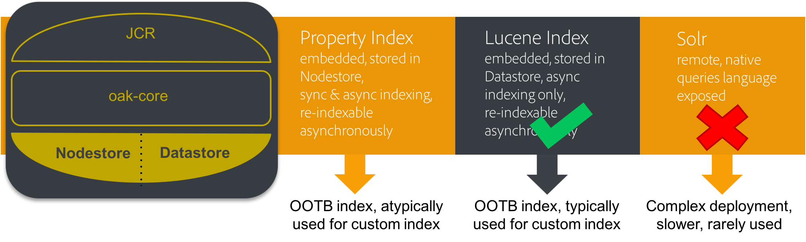

# Diretrizes de desempenho{#performance-guidelines}

Esta página fornece diretrizes gerais sobre como otimizar o desempenho da implantação do AEM. Se você não AEM, passe o mouse sobre as seguintes páginas antes de começar a ler as diretrizes de desempenho:

* [AEM conceitos básicos](/help/sites-deploying/deploy.md#basic-concepts)
* [Visão geral do armazenamento em AEM](/help/sites-deploying/storage-elements-in-aem-6.md#overview-of-storage-in-aem)
* [Implantações recomendadas](/help/sites-deploying/recommended-deploys.md)
* [Requisitos técnicos](/help/sites-deploying/technical-requirements.md)

Ilustradas abaixo estão as opções de implantação disponíveis para AEM (rolar para exibir todas as opções):

<table>
 <tbody>
  <tr>
   <td>
<strong>AEM</strong>
 
<strong>Produto</strong>
 </td>
   <td>
<strong>Topologia</strong>
 </td>
   <td>
<strong>Sistema Operacional</strong>
 </td>
   <td>
<strong>Servidor de aplicativos</strong>
 </td>
   <td>
<strong>JRE</strong>
 </td>
   <td>
<strong>Segurança</strong>
 </td>
   <td>
<strong>Micro kernel</strong>
 </td>
   <td>
<strong>Armazenamento de dados</strong>
 </td>
   <td>
<strong>Indexação</strong>
 </td>
   <td>
<strong>Servidor Web</strong>
 </td>
   <td>
<strong>Navegador</strong>
 </td>
   <td>
<strong>Marketing Cloud</strong>
 </td>
  </tr>
  <tr>
   <td>
Sites
 </td>
   <td>
Não-HA
 </td>
   <td>
Windows
 </td>
   <td>
CQSE
 </td>
   <td>
Oracle
 </td>
   <td>
LDAP
 </td>
   <td>
Tar
 </td>
   <td>
Segmento
 </td>
   <td>
Propriedade
 </td>
   <td>
Apache
 </td>
   <td>
Edge
 </td>
   <td>
Destino
 </td>
  </tr>
  <tr>
   <td>
Assets
 </td>
   <td>
Publicar-HA
 </td>
   <td>
Solaris
 </td>
   <td>
WebLogic
 </td>
   <td>
IBM
 </td>
   <td>
SAML
 </td>
   <td>
MongoDB
 </td>
   <td>
Arquivo
 </td>
   <td>
Lucene
 </td>
   <td>
IIS
 </td>
   <td>
IE
 </td>
   <td>
Analytics
 </td>
  </tr>
  <tr>
   <td>
Communities
 </td>
   <td>
Autor-CS
 </td>
   <td>
Chapéu Vermelho
 </td>
   <td>
WebSphere
 </td>
   <td>
HP
 </td>
   <td>
Oauth
 </td>
   <td>
RDB/Oracle
 </td>
   <td>
S3/Azure
 </td>
   <td>
Solr
 </td>
   <td>
iPlanet
 </td>
   <td>
FireFox
 </td>
   <td>
Campaign
 </td>
  </tr>
  <tr>
   <td>
Forms
 </td>
   <td>
Author-Offload
 </td>
   <td>
HP-UX
 </td>
   <td>
Tomcat
 </td>
   <td>
 
 </td>
   <td>
 
 </td>
   <td>
RDB/DB2
 </td>
   <td>
MongoDB
 </td>
   <td>
 
 </td>
   <td>
 
 </td>
   <td>
Chrome
 </td>
   <td>
Social
 </td>
  </tr>
  <tr>
   <td>
Móvel
 </td>
   <td>
Cluster de Autores
 </td>
   <td>
IBM AIX
 </td>
   <td>
JBoss
 </td>
   <td>
 
 </td>
   <td>
 
 </td>
   <td>
RDB/MySQL
 </td>
   <td>
RDBMS
 </td>
   <td>
 
 </td>
   <td>
 
 </td>
   <td>
Safari
 </td>
   <td>
Público
 </td>
  </tr>
  <tr>
   <td>
Vários sites
 </td>
   <td>
ASRP
 </td>
   <td>
SUSE
 </td>
   <td>
 
 </td>
   <td>
 
 </td>
   <td>
 
 </td>
   <td>
RDB/SQLServer
 </td>
   <td>
 
 </td>
   <td>
 
 </td>
   <td>
 
 </td>
   <td>
 
 </td>
   <td>
Assets
 </td>
  </tr>
  <tr>
   <td>
Commerce
 </td>
   <td>
MSRP
 </td>
   <td>
Apple OS
 </td>
   <td>
 
 </td>
   <td>
 
 </td>
   <td>
 
 </td>
   <td>
 
 </td>
   <td>
 
 </td>
   <td>
 
 </td>
   <td>
 
 </td>
   <td>
 
 </td>
   <td>
Ativação
 </td>
  </tr>
  <tr>
   <td>
Dynamic Media
 </td>
   <td>
JSRP
 </td>
   <td>
 
 </td>
   <td>
 
 </td>
   <td>
 
 </td>
   <td>
 
 </td>
   <td>
 
 </td>
   <td>
 
 </td>
   <td>
 
 </td>
   <td>
 
 </td>
   <td>
 
 </td>
   <td>
Móvel
 </td>
  </tr>
  <tr>
   <td>
Brand Portal
 </td>
   <td>
J2E
 </td>
   <td>
 
 </td>
   <td>
 
 </td>
   <td>
 
 </td>
   <td>
 
 </td>
   <td>
 
 </td>
   <td>
 
 </td>
   <td>
 
 </td>
   <td>
 
 </td>
   <td>
 
 </td>
   <td>
 
 </td>
  </tr>
  <tr>
   <td>
AoD
 </td>
   <td>
 
 </td>
   <td>
 
 </td>
   <td>
 
 </td>
   <td>
 
 </td>
   <td>
 
 </td>
   <td>
 
 </td>
   <td>
 
 </td>
   <td>
 
 </td>
   <td>
 
 </td>
   <td>
 
 </td>
   <td>
 
 </td>
  </tr>
  <tr>
   <td>
LiveFyre
 </td>
   <td>
 
 </td>
   <td>
 
 </td>
   <td>
 
 </td>
   <td>
 
 </td>
   <td>
 
 </td>
   <td>
 
 </td>
   <td>
 
 </td>
   <td>
 
 </td>
   <td>
 
 </td>
   <td>
 
 </td>
   <td>
 
 </td>
  </tr>
  <tr>
   <td>
Screens
 </td>
   <td>
 
 </td>
   <td>
 
 </td>
   <td>
 
 </td>
   <td>
 
 </td>
   <td>
 
 </td>
   <td>
 
 </td>
   <td>
 
 </td>
   <td>
 
 </td>
   <td>
 
 </td>
   <td>
 
 </td>
   <td>
 
 </td>
  </tr>
  <tr>
   <td>
Segurança de documento
 </td>
   <td>
 
 </td>
   <td>
 
 </td>
   <td>
 
 </td>
   <td>
 
 </td>
   <td>
 
 </td>
   <td>
 
 </td>
   <td>
 
 </td>
   <td>
 
 </td>
   <td>
 
 </td>
   <td>
 
 </td>
   <td>
 
 </td>
  </tr>
  <tr>
   <td>
Gerenciamento de processos
 </td>
   <td>
 
 </td>
   <td>
 
 </td>
   <td>
 
 </td>
   <td>
 
 </td>
   <td>
 
 </td>
   <td>
 
 </td>
   <td>
 
 </td>
   <td>
 
 </td>
   <td>
 
 </td>
   <td>
 
 </td>
   <td>
 
 </td>
  </tr>
  <tr>
   <td>
Aplicativo de desktop do  
 </td>
   <td>
 
 </td>
   <td>
 
 </td>
   <td>
 
 </td>
   <td>
 
 </td>
   <td>
 
 </td>
   <td>
 
 </td>
   <td>
 
 </td>
   <td>
 
 </td>
   <td>
 
 </td>
   <td>
 
 </td>
   <td>
 
 </td>
  </tr>
 </tbody>
</table>

>[!NOTE]
>
>As diretrizes de desempenho se aplicam principalmente ao AEM Sites.

## Quando utilizar as diretrizes de desempenho {#when-to-use-the-performance-guidelines}

Você deve usar as diretrizes de desempenho nas seguintes situações:

* **Implantação pela primeira vez**: Ao planejar a implantação do AEM Sites ou do Assets pela primeira vez, é importante entender as opções disponíveis ao configurar o Micro Kernel, a Loja de nós e a Loja de dados (em comparação com as configurações padrão). Por exemplo, alterar as configurações padrão do Data Store para TarMK para File Data Store.
* **Atualização para uma nova versão**: Ao atualizar para uma nova versão, é importante entender as diferenças de desempenho em comparação ao ambiente em execução. Por exemplo, atualização do AEM 6.1 para 6.2 ou do AEM 6.0 CRX2 para 6.2 OAK.
* **O tempo de resposta é lento**: Quando a arquitetura do Nodestore selecionada não estiver atendendo aos seus requisitos, é importante compreender as diferenças de desempenho em comparação com outras opções de topologia. Por exemplo, implantar o TarMK em vez do MongoMK ou usar um File Data Store em vez de um Amazon S3 ou Microsoft Azure Data Store.
* **Adicionar mais autores**: Quando a topologia TarMK recomendada não atende aos requisitos de desempenho e o redimensionamento do nó Autor atingiu a capacidade máxima disponível, é importante entender as diferenças de desempenho em comparação ao uso do MongoMK com três ou mais nós Autor. Por exemplo, implantar MongoMK em vez de TarMK.
* **Adicionar mais conteúdo**: Quando a arquitetura recomendada do Data Store não atender aos seus requisitos, é importante compreender as diferenças de desempenho em comparação com outras opções do Data Store. Exemplo: usando o Amazon S3 ou o Microsoft Azure Data Store em vez de um File Data Store.

## Introdução {#introduction}

Este capítulo fornece uma visão geral da arquitetura de AEM e seus componentes mais importantes. Ele também fornece diretrizes de desenvolvimento e descreve os cenários de teste usados nos testes de benchmark TarMK e MongoMK.

### A plataforma AEM {#the-aem-platform}

A plataforma de AEM consiste nos seguintes componentes:

Para obter mais informações sobre a plataforma de AEM, consulte [O que é AEM](/help/sites-deploying/deploy.md#what-is-aem).

### A arquitetura AEM {#the-aem-architecture}

Há três blocos fundamentais importantes para uma implantação de AEM. O **Instância do autor** , que é usada por autores, editores e aprovadores de conteúdo para criar e revisar conteúdo. Quando o conteúdo é aprovado, ele é publicado em um segundo tipo de instância chamado de **Instância de publicação** de onde é acessado pelos usuários finais. O terceiro bloco de construção é o **Dispatcher** que é um módulo que lida com o armazenamento em cache e a filtragem de URL e é instalado no servidor da Web. Para obter mais informações sobre a arquitetura de AEM, consulte [Cenários típicos de implantação](/help/sites-deploying/deploy.md#typical-deployment-scenarios).

### Micro Kernels {#micro-kernels}

Micro Kernels atuam como gerentes de persistência em AEM. Existem três tipos de Micro Kernels usados com AEM: TarMK, MongoDB e Banco de Dados Relacional (sob suporte restrito). Escolher um que atenda às suas necessidades depende da finalidade de sua ocorrência e do tipo de implantação que você esteja considerando. Para obter mais informações sobre Micro Kernels, consulte o [Implantações recomendadas](/help/sites-deploying/recommended-deploys.md) página.

### Nodestore {#nodestore}

No AEM, os dados binários podem ser armazenados independentemente dos nós de conteúdo. O local onde os dados binários são armazenados é chamado de **Armazenamento de dados**, enquanto a localização dos nós e propriedades de conteúdo é chamada de **Loja de nós**.

>[!NOTE]
>
>O Adobe recomenda que o TarMK seja a tecnologia de persistência padrão usada pelos clientes para as instâncias de Autor do AEM e Publicação.

>[!CAUTION]
>
>O Micro Kernel do Banco de Dados Relacional está sob suporte restrito. Contato [Atendimento ao cliente do Adobe](https://helpx.adobe.com/br/marketing-cloud/contact-support.html) antes de usar esse tipo de Micro Kernel.

### Armazenamento de dados {#data-store}

Ao lidar com um grande número de binários, é recomendável usar um armazenamento de dados externo em vez dos armazenamentos de nó padrão para maximizar o desempenho. Por exemplo, se o projeto exigir um grande número de ativos de mídia, armazená-los no Arquivo ou no Data Store do Azure/S3 fará com que o acesso seja mais rápido do que armazená-los diretamente em um MongoDB.

Para obter mais detalhes sobre as opções de configuração disponíveis, consulte [Configuração de nós e armazenamentos de dados](/help/sites-deploying/data-store-config.md).

>[!NOTE]
>
>O Adobe recomenda escolher a opção de implantar AEM no Azure ou no Amazon Web Services (AWS) usando o Adobe Managed Services, onde os clientes se beneficiarão de uma equipe que tem a experiência e as habilidades de implantar e operar AEM nesses ambientes de computação em nuvem. Consulte a [documentação adicional sobre o Adobe Managed Services](https://www.adobe.com/marketing-cloud/enterprise-content-management/managed-services-cloud-platform.html?aemClk=t).
>
>Para recomendações sobre como implantar AEM no Azure ou no AWS, fora do Adobe Managed Services, recomendamos trabalhar diretamente com o provedor de nuvem ou um de nossos parceiros que oferecem suporte à implantação do AEM no ambiente de nuvem de sua escolha. O provedor ou parceiro de nuvem selecionado é responsável pelas especificações de dimensionamento, pelo design e pela implementação da arquitetura que ele oferecerá suporte para atender aos requisitos específicos de desempenho, carga, escalabilidade e segurança.
>
>Para obter detalhes adicionais, consulte também a seção [requisitos técnicos](/help/sites-deploying/technical-requirements.md#supported-platforms) página.

### Pesquisar {#search-features}

Listados nesta seção são os provedores de índice personalizados usados com o AEM. Para saber mais sobre indexação, consulte [Consultas e indexação do Oak](/help/sites-deploying/queries-and-indexing.md).

>[!NOTE]
>
>Para a maioria das implantações, o Adobe recomenda o uso do Índice Lucene. Você deve usar o Solr somente para escalabilidade em implantações especializadas e complexas.

### Diretrizes de desenvolvimento {#development-guidelines}

Você deve desenvolver AEM com o objetivo de **desempenho e escalabilidade**. Apresentamos abaixo uma série de práticas recomendadas que podem ser seguidas:

**DO**

* Aplicar separação de apresentação, lógica e conteúdo
* Use APIs AEM existentes (por exemplo: Sling) e ferramentas (ex: Replicação)
* Desenvolver no contexto do conteúdo real
* Desenvolver para otimizar a capacidade de armazenamento em cache
* Minimize o número de salvamentos (por exemplo: ao usar workflows transitórios)
* Certifique-se de que todos os pontos finais HTTP sejam RESTful
* Restringir o escopo da observação do JCR
* Considere o encadeamento assíncrono

**NÃO**

* Não use APIs JCR diretamente, se você puder
* Não altere /libs, mas use sobreposições
* Não use consultas sempre que possível
* Não use o Sling Bindings para obter serviços OSGi no código Java, mas use:

   * @Reference em um componente DS
   * @Inject em um Modelo Sling
   * sling.getService() em uma Classe de Uso Sightly
   * sling.getService() em um JSP
   * um ServiceTracker
   * acesso direto ao registro do serviço OSGi

Para obter mais detalhes sobre o desenvolvimento no AEM, leia [Desenvolvimento - Noções básicas](/help/sites-developing/the-basics.md). Para obter mais práticas recomendadas, consulte [Práticas recomendadas de desenvolvimento](/help/sites-developing/best-practices.md).

### Cenários de referência {#benchmark-scenarios}

>[!NOTE]
>
>Todos os testes de benchmark exibidos nesta página foram executados em uma configuração de laboratório.

Os cenários de teste detalhados abaixo são usados para as seções de benchmark dos capítulos TarMK, MongoMk e TarMK vs MongoMk. Para ver qual cenário foi usado para um teste de referencial específico, leia o campo Cenário da [Especificações técnicas](/help/sites-deploying/performance-guidelines.md#tarmk-performance-benchmark) tabela.

**Cenário de produto único**

AEM Assets:

* Interações do usuário: Pesquise ativos / Pesquise ativos / Baixe ativos / Leia metadados do ativo / Atualize metadados do ativo / Carregar ativo / Executar fluxo de trabalho de upload de ativo
* Modo de execução: usuários simultâneos, única interação por usuário

**Cenário de combinação de produtos**

AEM Sites + Ativos:

* Interações do usuário do Sites: Ler Página Do Artigo / Ler Página / Criar Parágrafo / Editar Parágrafo / Criar Página De Conteúdo / Ativar Página De Conteúdo / Pesquisar Do Autor
* Interações do usuário do Assets: Pesquise ativos / Pesquise ativos / Baixe ativos / Leia metadados do ativo / Atualize metadados do ativo / Carregar ativo / Executar fluxo de trabalho de upload de ativo
* Modo de execução: usuários simultâneos, interações mistas por usuário

**Cenário de caso de uso vertical**

Mídia:

* Ler Página Do Artigo (27.4%), Página De Leitura (10.9%), Criar Sessão (2.6%), Ativar Página De Conteúdo (1.7%), Criar Página De Conteúdo (0.4%), Criar Parágrafo (4.3%), Editar Parágrafo (0.9%), Componente De Imagem (0.9%), Pesquisar Ativos (20%), Ler Metadados De Ativos (8.5 %), Baixar Ativo (4.2%), Pesquisar Ativo (0.2%), Atualizar Metadados De Ativo (2.4%), Fazer Upload De Ativo (1.2%), Procurar Projeto (4.9%), Ler Projeto (6.6%), Adicionar Ativo (1.2%), Adicionar Projeto (1.2%), Criar Projeto (0.1%), Pesquisa Do Autor )
* Modo de execução: usuários simultâneos, interações mistas por usuário

## TarMK {#tarmk}

Este capítulo fornece diretrizes gerais de desempenho para o TarMK, especificando os requisitos mínimos de arquitetura e a configuração das configurações. Os testes de referência são também fornecidos para maior clarificação.

O Adobe recomenda que o TarMK seja a tecnologia de persistência padrão usada pelos clientes em todos os cenários de implantação, tanto para as instâncias de Autor e Publicação do AEM.

Para obter mais informações sobre TarMK, consulte [Cenários de implantação](/help/sites-deploying/recommended-deploys.md#deployment-scenarios) e [Armazenamento Tar](/help/sites-deploying/storage-elements-in-aem-6.md#tar-storage).

### Diretrizes de arquitetura mínima do TarMK {#tarmk-minimum-architecture-guidelines}

>[!NOTE]
>
>As diretrizes mínimas de arquitetura apresentadas abaixo são para ambientes de produção e sites de alto tráfego. Estes **not** o [especificações mínimas](/help/sites-deploying/technical-requirements.md#prerequisites) necessário para executar o AEM.

Para estabelecer um bom desempenho ao usar o TarMK, você deve começar com a seguinte arquitetura:

* Uma instância de autor
* Duas instâncias de publicação
* Dois Dispatchers

As diretrizes de arquitetura para AEM sites e AEM Assets estão ilustradas abaixo.

>[!NOTE]
>
>A replicação sem binário deve ser desativada **ATIVADO** se o armazenamento de dados do arquivo for compartilhado.

**Diretrizes de arquitetura Tar para a AEM Sites**

**Diretrizes de arquitetura Tar para a AEM Assets**

### Diretriz de configurações do TarMK {#tarmk-settings-guideline}

Para um bom desempenho, você deve seguir as diretrizes de configuração apresentadas abaixo. Para obter instruções sobre como alterar as configurações, [veja esta página](https://helpx.adobe.com/experience-manager/kb/performance-tuning-tips.html).

<table>
 <tbody>
  <tr>
   <td><strong>Configuração</strong></td>
   <td><strong>Parâmetro</strong></td>
   <td><strong>Valor</strong></td>
   <td><strong>Descrição</strong></td>
  </tr>
  <tr>
   <td>Filas de Trabalho Sling</td>
   <td><code>queue.maxparallel</code></td>
   <td>Defina o valor para metade do número de núcleos da CPU. </td>
   <td>Por padrão, o número de threads simultâneos por fila de trabalhos é igual ao número de núcleos da CPU.</td>
  </tr>
  <tr>
   <td>Fila de Fluxo de Trabalho Transitório do Granite</td>
   <td><code>Max Parallel</code></td>
   <td>Defina o valor para metade do número de núcleos da CPU</td>
   <td> </td>
  </tr>
  <tr>
   <td>Parâmetros da JVM</td>
   <td>
<code>Doak.queryLimitInMemory</code>
 
<code>Doak.queryLimitReads</code>
 
<code>Dupdate.limit</code>
 
<code>Doak.fastQuerySize</code>
 </td>
   <td>
500000
 
100000
 
250000
 
Verdadeiro
 </td>
   <td>Adicione esses parâmetros da JVM no script de início de AEM para impedir que consultas expansivas sobrecarreguem os sistemas.</td>
  </tr>
  <tr>
   <td>Configuração do índice Lucene</td>
   <td>
<code>CopyOnRead</code>
 
<code>CopyOnWrite</code>
 
<code>Prefetch Index Files</code>
 </td>
   <td>
Ativado
 
Ativado
 
Ativado
 </td>
   <td>Para obter mais detalhes sobre os parâmetros disponíveis, consulte <a href="https://jackrabbit.apache.org/oak/docs/query/lucene.html">esta página</a>.</td>
  </tr>
  <tr>
   <td>Armazenamento de dados = Armazenamento de dados S3</td>
   <td>
<code>maxCachedBinarySize</code>
 
<code>cacheSizeInMB</code>
 </td>
   <td>
1048576 (1MB) ou menor
 
2-10% do tamanho máximo do heap
 </td>
   <td>Consulte também <a href="/help/sites-deploying/data-store-config.md#data-store-configurations">Configurações do armazenamento de dados</a>.</td>
  </tr>
  <tr>
   <td>Fluxo de trabalho do Ativo de atualização DAM</td>
   <td><code>Transient Workflow</code></td>
   <td>verificado</td>
   <td>Esse fluxo de trabalho controla a atualização de ativos.</td>
  </tr>
  <tr>
   <td>Writeback de metadados DAM</td>
   <td><code>Transient Workflow</code></td>
   <td>verificado</td>
   <td>Esse workflow gerencia XMP write-back para o binário original e define a data da última modificação no JCR.</td>
  </tr>
 </tbody>
</table>

### Benchmark de desempenho do TarMK {#tarmk-performance-benchmark}

#### Especificações técnicas {#technical-specifications}

Os testes de benchmark foram realizados com as seguintes especificações:

|  | **Nó do autor** |
|---|---|
| Servidor | Hardware de metal nu (HP) |
| Sistema Operacional | RedHat Linux |
| CPU / núcleos | CPU Intel(R) Xeon(R) CPU E5-2407 @2,40GHz, 8 núcleos |
| RAM | 32GB |
| Disco | Magnético |
| Java | Oracle JRE versão 8 |
| Heap da JVM | 16GB |
| Produto | AEM 6.2 |
| Nodestore | TarMK |
| Armazenamento de dados | DS de arquivo |
| Cenário | Produto único: Ativos / 30 threads simultâneos |

#### Resultados do benchmark de desempenho {#performance-benchmark-results}

>[!NOTE]
>
>Os números apresentados abaixo foram normalizados para 1 como linha de base e não são os números reais da taxa de transferência.

 

## MongoMK {#mongomk}

O motivo principal para escolher o back-end de persistência do MongoMK sobre o TarMK é dimensionar as instâncias horizontalmente. Isso significa ter duas ou mais instâncias de autor ativas em execução contínua e usar o MongoDB como o sistema de armazenamento de persistência. A necessidade de executar mais de uma instância de autor geralmente resulta do fato de que a CPU e a capacidade de memória de um único servidor, suportando todas as atividades de criação simultâneas, não são mais sustentáveis.

Para obter mais informações sobre TarMK, consulte [Cenários de implantação](/help/sites-deploying/recommended-deploys.md#deployment-scenarios) e [Armazenamento Mongo](/help/sites-deploying/storage-elements-in-aem-6.md#mongo-storage).

### Diretrizes de arquitetura mínima do MongoMK {#mongomk-minimum-architecture-guidelines}

Para estabelecer um bom desempenho ao usar o MongoMK, você deve começar com a seguinte arquitetura:

* Três instâncias de autor
* Duas instâncias de publicação
* Três instâncias do MongoDB
* Dois Dispatchers

>[!NOTE]
>
>Em ambientes de produção, o MongoDB sempre será usado como um conjunto de réplicas com um primário e dois segundos. Leituras e gravações vão para o primário e as leituras podem ir para os secundários. Se o armazenamento não estiver disponível, um dos secundários pode ser substituído por um árbitro, mas os conjuntos de réplicas do MongoDB devem sempre ser compostos por um número ímpar de instâncias.

>[!NOTE]
>
>A replicação sem binário deve ser desativada **ATIVADO** se o armazenamento de dados do arquivo for compartilhado.

### Diretrizes de configurações do MongoMK {#mongomk-settings-guidelines}

Para um bom desempenho, você deve seguir as diretrizes de configuração apresentadas abaixo. Para obter instruções sobre como alterar as configurações, [veja esta página](https://helpx.adobe.com/experience-manager/kb/performance-tuning-tips.html).

<table>
 <tbody>
  <tr>
   <td><strong>Configuração</strong></td>
   <td><strong>Parâmetro</strong></td>
   <td><strong>Value (padrão)</strong></td>
   <td><strong>Descrição</strong></td>
  </tr>
  <tr>
   <td>Filas de Trabalho Sling</td>
   <td><code>queue.maxparallel</code></td>
   <td>Defina o valor para metade do número de núcleos da CPU. </td>
   <td>Por padrão, o número de threads simultâneos por fila de trabalhos é igual ao número de núcleos da CPU.</td>
  </tr>
  <tr>
   <td>Fila de Fluxo de Trabalho Transitório do Granite</td>
   <td><code>Max Parallel</code></td>
   <td>Defina o valor para metade do número de núcleos da CPU.</td>
   <td> </td>
  </tr>
  <tr>
   <td>Parâmetros da JVM</td>
   <td>
<code>Doak.queryLimitInMemory</code>
 
<code>Doak.queryLimitReads</code>
 
<code>Dupdate.limit</code>
 
<code>Doak.fastQuerySize</code>
 
<code>Doak.mongo.maxQueryTimeMS</code>
 </td>
   <td>
500000
 
100000
 
250000
 
Verdadeiro
 
60000
 </td>
   <td>Adicione esses parâmetros da JVM no script de início de AEM para impedir que consultas expansivas sobrecarreguem os sistemas.</td>
  </tr>
  <tr>
   <td>Configuração do índice Lucene</td>
   <td>
<code>CopyOnRead</code>
 
<code>CopyOnWrite</code>
 
<code>Prefetch Index Files</code>
 </td>
   <td>
Ativado
 
Ativado
 
Ativado
 </td>
   <td>Para obter mais detalhes sobre os parâmetros disponíveis, consulte <a href="https://jackrabbit.apache.org/oak/docs/query/lucene.html">esta página</a>.</td>
  </tr>
  <tr>
   <td>Armazenamento de dados = Armazenamento de dados S3</td>
   <td>
<code>maxCachedBinarySize</code>
 
<code>cacheSizeInMB</code>
 </td>
   <td>
1048576 (1MB) ou menor
 
2-10% do tamanho máximo do heap
 </td>
   <td>Consulte também <a href="/help/sites-deploying/data-store-config.md#data-store-configurations">Configurações do armazenamento de dados</a>.</td>
  </tr>
  <tr>
   <td>DocumentNodeStoreService</td>
   <td>
<code>cache</code>
 
<code>nodeCachePercentage</code>
 
<code>childrenCachePercentage</code>
 
<code>diffCachePercentage</code>
 
<code>docChildrenCachePercentage</code>
 
<code>prevDocCachePercentage</code>
 
<code>persistentCache</code>
 </td>
   <td>
2048
 
35 (25)
 
20 (10)
 
30 (5)
 
10 (3)
 
4 (4)
 
./cache,size=2048,binary=0,-compact,-compress
 </td>
   <td>
O tamanho padrão do cache é definido como 256 MB.
 
Tem impacto no tempo necessário para executar a invalidação do cache.
 </td>
  </tr>
  <tr>
   <td>oak-observation</td>
   <td>
<code>thread pool</code>
 
<code>length</code>
 </td>
   <td>
mín. e máx. = 20
 
50000
 </td>
   <td> </td>
  </tr>
 </tbody>
</table>

### Benchmark de desempenho do MongoMK {#mongomk-performance-benchmark}

### Especificações técnicas {#technical-specifications-1}

Os testes de benchmark foram realizados com as seguintes especificações:

|  | **Nó Autor** | **Nó MongoDB** |
|---|---|---|
| Servidor | Hardware de metal nu (HP) | Hardware de metal nu (HP) |
| Sistema Operacional | RedHat Linux | RedHat Linux |
| CPU / núcleos | CPU Intel(R) Xeon(R) CPU E5-2407 @2,40GHz, 8 núcleos | CPU Intel(R) Xeon(R) CPU E5-2407 @2,40GHz, 8 núcleos |
| RAM | 32GB | 32GB |
| Disco | Magnético - >IOPS de 1k | Magnético - >IOPS de 1k |
| Java | Oracle JRE versão 8 | N/A |
| Heap da JVM | 16GB | N/A |
| Produto | AEM 6.2 | MongoDB 3.2 WiredTiger |
| Nodestore | MongoMK | N/A |
| Armazenamento de dados | DS de arquivo | N/A |
| Cenário | Produto único: Ativos / 30 threads simultâneos | Produto único: Ativos / 30 threads simultâneos |

### Resultados do benchmark de desempenho {#performance-benchmark-results-1}

>[!NOTE]
>
>Os números apresentados abaixo foram normalizados para 1 como linha de base e não são os números reais da taxa de transferência.

 

## TarMK vs MongoMK {#tarmk-vs-mongomk}

A regra básica que precisa ser levada em conta ao escolher entre os dois é que o TarMK foi projetado para desempenho, enquanto o MongoMK é usado para escalabilidade. O Adobe recomenda que o TarMK seja a tecnologia de persistência padrão usada pelos clientes em todos os cenários de implantação, tanto para as instâncias de Autor e Publicação do AEM.

O motivo principal para escolher o back-end de persistência do MongoMK sobre o TarMK é dimensionar as instâncias horizontalmente. Isso significa ter duas ou mais instâncias de autor ativas em execução contínua e usar o MongoDB como o sistema de armazenamento de persistência. A necessidade de executar mais de uma instância de autor geralmente resulta do fato de que a CPU e a capacidade de memória de um único servidor, suportando todas as atividades de criação simultâneas, não são mais sustentáveis.

Para obter mais detalhes sobre TarMK vs MongoMK, consulte [Implantações recomendadas](/help/sites-deploying/recommended-deploys.md#microkernels-which-one-to-use).

### Diretrizes do TarMK vs MongoMk {#tarmk-vs-mongomk-guidelines}

**Benefícios do TarMK**

* Propósito criado para aplicativos de gerenciamento de conteúdo
* Os arquivos são sempre consistentes e podem ser copiados em backup usando qualquer ferramenta de backup baseada em arquivo
* Fornece um mecanismo de failover - consulte [Modo de espera a frio](/help/sites-deploying/tarmk-cold-standby.md) para obter mais detalhes
* Fornece alto desempenho e armazenamento de dados confiável com o mínimo de sobrecarga operacional
* TCO mais baixo (custo total de propriedade)

**Critérios para escolher MongoMK**

* Número de usuários nomeados conectados em um dia: nos milhares ou mais
* Número de usuários simultâneos: nas centenas ou mais
* Volume de ingestões de ativos por dia: em centenas de milhares ou mais
* Volume de edições de página por dia: em centenas de milhares ou mais
* Volume de pesquisas por dia: em dezenas de milhares ou mais

### TarMK vs. Benchmarks do MongoMK {#tarmk-vs-mongomk-benchmarks}

>[!NOTE]
>
>Os números apresentados abaixo foram normalizados para 1 como linha de base e não são números reais da taxa de transferência.

### Especificações técnicas do cenário 1 {#scenario-technical-specifications}

<table>
 <tbody>
  <tr>
   <td><strong> </strong></td>
   <td><strong>Nó OAK do autor</strong></td>
   <td><strong>Nó MongoDB</strong></td>
   <td> </td>
  </tr>
  <tr>
   <td>Servidor</td>
   <td>Hardware de metal nu (HP)</td>
   <td>Hardware de metal nu (HP)</td>
   <td> </td>
  </tr>
  <tr>
   <td>Sistema Operacional</td>
   <td>RedHat Linux</td>
   <td>RedHat Linux</td>
   <td> </td>
  </tr>
  <tr>
   <td>CPU / núcleos</td>
   <td>CPU Intel(R) Xeon(R) CPU E5-2407 @2,40GHz, 8 núcleos</td>
   <td>CPU Intel(R) Xeon(R) CPU E5-2407 @2,40GHz, 8 núcleos</td>
   <td> </td>
  </tr>
  <tr>
   <td>RAM</td>
   <td>32GB</td>
   <td>32GB</td>
   <td> </td>
  </tr>
  <tr>
   <td>Disco</td>
   <td>Magnético - &gt;IOPS de 1k</td>
   <td>Magnético - &gt;IOPS de 1k</td>
   <td> </td>
  </tr>
  <tr>
   <td>Java</td>
   <td>Oracle JRE versão 8</td>
   <td>N/A</td>
   <td> </td>
  </tr>
  <tr>
   <td>JVM Heap16GB</td>
   <td>16GB</td>
   <td>N/A</td>
   <td> </td>
  </tr>
  <tr>
   <td>Produto </td>
   <td>AEM 6.2</td>
   <td>MongoDB 3.2 WiredTiger</td>
   <td> </td>
  </tr>
  <tr>
   <td>Nodestore</td>
   <td>TarMK ou MongoMK</td>
   <td>N/A</td>
   <td> </td>
  </tr>
  <tr>
   <td>Armazenamento de dados</td>
   <td>DS de arquivo </td>
   <td>N/A</td>
   <td> </td>
  </tr>
  <tr>
   <td>Cenário</td>
   <td>
  Produto único: Ativos / 30 threads simultâneos por execução
 </td>
   <td> </td>
   <td> </td>
  </tr>
 </tbody>
</table>

### Resultados do benchmark de desempenho do cenário 1 {#scenario-performance-benchmark-results}

### Cenário 2 Especificações técnicas {#scenario-technical-specifications-1}

>[!NOTE]
>
>Para ativar o mesmo número de Autores com MongoDB como com um sistema TarMK, você precisa de um cluster com dois nós AEM. Um cluster MongoDB de quatro nós pode lidar com 1,8 vezes o número de Autores de uma instância TarMK. Um cluster MongoDB de oito nós pode lidar com 2,3 vezes o número de Autores de uma instância TarMK.

<table>
 <tbody>
  <tr>
   <td><strong> </strong></td>
   <td><strong>Nó TarMK do autor</strong></td>
   <td><strong>Nó MongoMK do autor</strong></td>
   <td><strong>Nó MongoDB</strong></td>
  </tr>
  <tr>
   <td>Servidor</td>
   <td>AWS c3.8xlarge</td>
   <td>AWS c3.8xlarge</td>
   <td>AWS c3.8xlarge</td>
  </tr>
  <tr>
   <td>Sistema Operacional</td>
   <td>RedHat Linux</td>
   <td>RedHat Linux</td>
   <td>RedHat Linux</td>
  </tr>
  <tr>
   <td>CPU / núcleos</td>
   <td>32</td>
   <td>32</td>
   <td>32</td>
  </tr>
  <tr>
   <td>RAM</td>
   <td>60GB</td>
   <td>60GB</td>
   <td>60GB</td>
  </tr>
  <tr>
   <td>Disco</td>
   <td>SSD - IOPS de 10 mil</td>
   <td>SSD - IOPS de 10 mil</td>
   <td>SSD - IOPS de 10 mil</td>
  </tr>
  <tr>
   <td>Java</td>
   <td>Oracle JRE versão 8</td>
   <td>  Oracle JRE versão 8</td>
   <td>N/A</td>
  </tr>
  <tr>
   <td>JVM Heap16GB</td>
   <td>30GB</td>
   <td>30GB</td>
   <td>N/A</td>
  </tr>
  <tr>
   <td>Produto </td>
   <td>AEM 6.2</td>
   <td>AEM 6.2</td>
   <td>  MongoDB 3.2 WiredTiger</td>
  </tr>
  <tr>
   <td>Nodestore</td>
   <td>TarMK </td>
   <td>MongoMK</td>
   <td>  N/A</td>
  </tr>
  <tr>
   <td>Armazenamento de dados</td>
   <td>DS de arquivo </td>
   <td>  DS de arquivo</td>
   <td>  N/A</td>
  </tr>
  <tr>
   <td>Cenário</td>
   <td>
    Caso de uso vertical: Mídia / 2000 threads simultâneos
 </td>
   <td></td>
   <td></td>
  </tr>
 </tbody>
</table>

### Resultados do benchmark de desempenho do cenário 2 {#scenario-performance-benchmark-results-1}

### Diretrizes De Escalabilidade Da Arquitetura Para AEM Sites E Ativos {#architecture-scalability-guidelines-for-aem-sites-and-assets}

## Resumo das diretrizes de desempenho  {#summary-of-performance-guidelines}

As diretrizes apresentadas nesta página podem ser resumidas da seguinte maneira:

* **TarMK com armazenamento de dados de arquivo** é a arquitetura recomendada para a maioria dos clientes:

   * Topologia mínima: uma instância de Autor, duas instâncias de Publicação, dois Dispatchers
   * Replicação sem binário ativada se o armazenamento de dados do arquivo for compartilhado

* **MongoMK com armazenamento de dados de arquivo** é a arquitetura recomendada para a escalabilidade horizontal do nível Autor:

   * Topologia mínima: três instâncias de Autor, três instâncias de MongoDB, duas instâncias de Publicação, dois Dispatchers
   * Replicação sem binário ativada se o armazenamento de dados do arquivo for compartilhado

* **Nodestore** deve ser armazenado no disco local, não em um NAS (Network Attached Storage, armazenamento conectado à rede)
* Ao usar **Amazon S3**:

   * O armazenamento de dados do Amazon S3 é compartilhado entre a camada Autor e Publicação
   * A replicação sem binário deve ser ativada
   * A coleta de lixo do armazenamento de dados requer uma primeira execução em todos os nós Autor e Publicação e, em seguida, uma segunda execução no Autor

* **O índice personalizado deve ser criado além do índice predefinido** com base nas pesquisas mais comuns

   * Índices Lucene devem ser usados para índices personalizados

* **A personalização do fluxo de trabalho pode melhorar substancialmente o desempenho**, por exemplo, remoção da etapa de vídeo no fluxo de trabalho &quot;Atualizar ativo&quot;, desativação de ouvintes que não são usados etc.

Para obter mais detalhes, leia também a [Implantações recomendadas](/help/sites-deploying/recommended-deploys.md) página.
