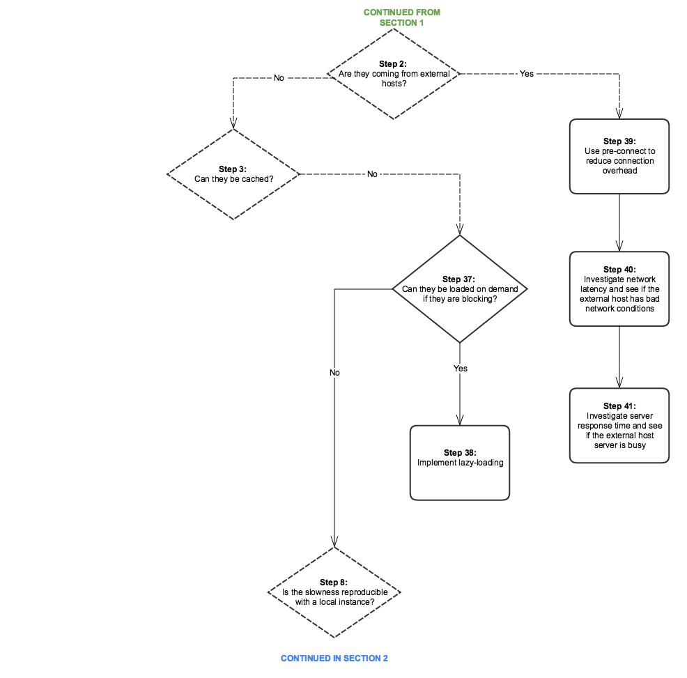
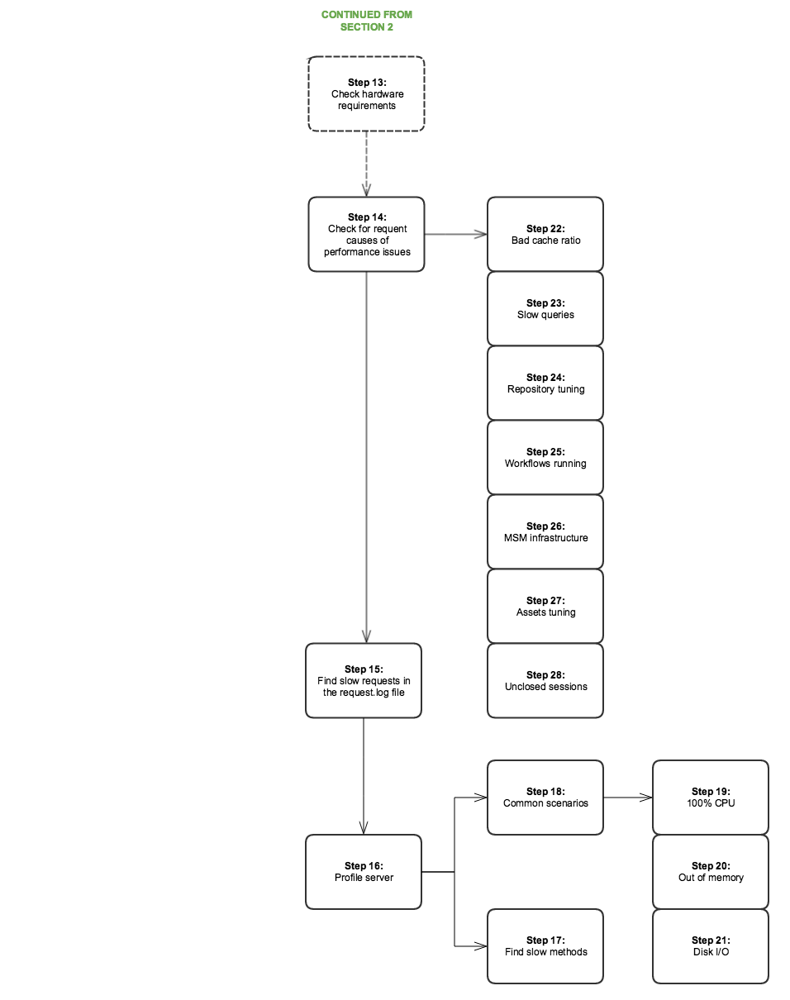

# Árvore de desempenho{#performance-tree}

## Escopo {#scope}

O diagrama abaixo serve para fornecer orientação sobre as etapas que precisam ser tomadas para solucionar problemas de desempenho. Ele é dividido em 5 seções para facilitar a leitura.

Cada etapa do diagrama é vinculada a um recurso de documentação ou a uma recomendação.

## Pré-requisitos e pressupostos {#prerequisites-and-assumptions}

A suposição é que um problema de desempenho seja observado em uma determinada página (um console AEM ou uma página da Web) e possa ser reproduzido de forma consistente. Ter uma maneira de testar ou monitorar o desempenho é um pré-requisito antes de iniciar a investigação.

A análise começa na etapa 0. O objetivo é determinar qual entidade (dispatcher, host externo ou AEM) é responsável pelo problema de desempenho e, em seguida, determinar qual área (servidor ou rede) deve ser investigada.

### Seção 1 {#section}

### Seção 2 {#section-1}

### Seção 3 {#section-2}

### Seção 4 {#section-3}

### Seção 5 {#section-4}

## Links de referência {#reference-links}

<table>
 <tbody>
  <tr>
   <td><strong>Etapa</strong></td>
   <td><strong>Título</strong></td>
   <td><strong>Recursos</strong></td>
  </tr>
  <tr>
   <td><strong>Etapa 0</strong></td>
   <td>Analisar fluxo de solicitação</td>
   <td>
Você pode usar a análise de solicitação HTTP padrão no navegador para analisar o fluxo de solicitação. Para obter mais informações sobre como fazer isso no Chrome, consulte:  
 
<a href="https://developers.google.com/web/tools/chrome-devtools/profile/network-performance/resource-loading">https://developers.google.com/web/tools/chrome-devtools/profile/network-performance/resource-loading</a><a href="https://developers.google.com/web/tools/chrome-devtools/profile/network-performance/understanding-resource-timing">  https://developers.google.com/web/tools/chrome-devtools/profile/network-performance/understanding-resource-timing</a>  
 </td>
  </tr>
  <tr>
   <td><strong>Etapa 2</strong></td>
   <td>As solicitações vêm de hosts externos?</td>
   <td>Você pode usar a análise de solicitação HTTP padrão no navegador para analisar o fluxo de solicitação. Veja os links acima sobre como fazer isso no Chrome.  </td>
  </tr>
  <tr>
   <td><strong>Etapa 3</strong></td>
   <td>As solicitações podem ser armazenadas em cache?</td>
   <td>Para obter mais informações sobre solicitações armazenáveis em cache e recomendações gerais de otimização de desempenho do Dispatcher, consulte <a href="/help/sites-deploying/configuring-performance.md#optimizing-performance-when-using-the-dispatcher">Otimização de desempenho do Dispatcher</a>.</td>
  </tr>
  <tr>
   <td><strong>Etapa 4</strong></td>
   <td>As solicitações vêm do Dispatcher?</td>
   <td>
Verifique a <a href="https://helpx.adobe.com/experience-manager/dispatcher/using/dispatcher-configuration.html#debugging">Documentação de depuração do Dispatcher</a> para ver se as solicitações estão armazenadas em cache corretamente.  
 </td>
  </tr>
  <tr>
   <td><strong>Etapa 5</strong></td>
   <td>O Dispatcher está tentando autenticar cada solicitação via AEM?</td>
   <td>Verifique se o dispatcher envia <code>HEAD</code> solicitações de AEM para autenticação antes de entregar o recurso em cache. Você pode fazer isso procurando por <code>HEAD</code> solicitações no AEM <code>access.log</code>. Para obter mais informações, consulte <a href="/help/sites-deploying/configure-logging.md">Registro</a>.  </td>
  </tr>
  <tr>
   <td><strong>Etapa 6</strong></td>
   <td>A localização geográfica do Dispatcher está longe dos usuários?</td>
   <td>Mova o Dispatcher para mais perto dos usuários.</td>
  </tr>
  <tr>
   <td><strong>Etapa 7</strong></td>
   <td>A camada de rede do Dispatcher está correta?</td>
   <td>  Investigue a camada de rede para problemas de saturação e latência.
 
 </td>
  </tr>
  <tr>
   <td><strong>Etapa 8</strong></td>
   <td>A lentidão é reprodutível com uma instância local?</td>
   <td>  
Use <a href="/help/sites-developing/tough-day.md">Dia difícil</a> para replicar condições de "mundo real" das instâncias de produção. Se isso não for realista para o ritmo de desenvolvimento, teste a instância de produção (ou uma de preparo idêntica) em um contexto de rede diferente.  
 </td>
  </tr>
  <tr>
   <td><strong>Etapa 9</strong></td>
   <td>A localização geográfica do servidor está longe dos usuários?</td>
   <td>Aproxime o servidor dos usuários.</td>
  </tr>
  <tr>
   <td><strong>Etapas 10 e 29</strong></td>
   <td>Investigar camada de rede</td>
   <td>
Investigue a camada de rede para problemas de saturação e latência.
 
Para o nível de criação, é recomendável que a latência não ultrapasse 100 milissegundos.
 
Para obter mais informações sobre dicas de otimização de desempenho, consulte <a href="https://helpx.adobe.com/experience-manager/kb/performance-tuning-tips.html">esta página</a>.
 </td>
  </tr>
  <tr>
   <td><strong>Etapa 11</strong></td>
   <td>Aproxime o servidor ou adicione um por região</td>
   <td> </td>
  </tr>
  <tr>
   <td><strong>Etapa 12</strong></td>
   <td>Solução de problemas AEM servidor</td>
   <td>Verifique as seguintes subetapas no diagrama para obter mais informações.</td>
  </tr>
  <tr>
   <td><strong>Etapa 13</strong></td>
   <td>Verificar requisitos de hardware</td>
   <td>Verifique a documentação em <a href="/help/managing/hardware-sizing-guidelines.md">Diretrizes de dimensionamento do hardware</a>.  </td>
  </tr>
  <tr>
   <td><strong>Etapa 14</strong></td>
   <td>Verifique se há causas frequentes de problemas de desempenho</td>
   <td> </td>
  </tr>
  <tr>
   <td><strong>Etapa 15</strong></td>
   <td>Localizar solicitações lentas</td>
   <td>
Você pode verificar se há solicitações lentas analisando o <code>request.log</code> ou usando <code>rlog.jar</code>.
 
Para obter mais informações sobre o uso do rlog.jar, consulte esta página.
 
Consulte <a href="/help/sites-deploying/monitoring-and-maintaining.md#using-rlog-jar-to-find-requests-with-long-duration-times">Usar o rlog.jar para localizar solicitações com tempos de longa duração</a>.  
 
 
 </td>
  </tr>
  <tr>
   <td><strong>Etapa 16</strong></td>
   <td>Servidor de perfil</td>
   <td>
Para obter informações sobre ferramentas de criação de perfis que podem ser usadas com AEM, consulte <a href="/help/sites-deploying/monitoring-and-maintaining.md#tools-for-monitoring-and-analyzing-performance">Ferramentas para monitorar e analisar o desempenho</a>.  
 </td>
  </tr>
  <tr>
   <td><strong>Etapa 17</strong></td>
   <td>Encontre métodos lentos na criação de perfis</td>
   <td> </td>
  </tr>
  <tr>
   <td><strong>Etapa 18</strong></td>
   <td>Cenários comuns de criação de perfis</td>
   <td>Consulte <a href="/help/sites-deploying/monitoring-and-maintaining.md#analyzing-specific-scenarios">Análise de cenários específicos</a> na seção Otimização de desempenho .  </td>
  </tr>
  <tr>
   <td><strong>Etapa 19</strong></td>
   <td>CPU 100%</td>
   <td><a href="/help/sites-deploying/monitoring-and-maintaining.md#monitoring-performance">https://helpx.adobe.com/experience-manager/6-3/sites-deploying/monitoring-and-maintaining.html#MonitoringPerformance</a></td>
  </tr>
  <tr>
   <td><strong>Etapa 20</strong></td>
   <td>Memória insuficiente</td>
   <td> 
    <ol>
     <li><a href="/help/sites-deploying/monitoring-and-maintaining.md#out-of-memory">Sem memória</a></li>
     <li><a href="/help/sites-deploying/troubleshooting.md">Meu aplicativo lança erros de falta de memória</a></li>
     <li><a href="https://helpx.adobe.com/experience-manager/kb/AnalyzeMemoryProblems.html">Analise problemas de memória na Helpx.</a>  </li>
    </ol> </td>
  </tr>
  <tr>
   <td><strong>Etapa 21</strong></td>
   <td>E/S de disco</td>
   <td>
Consulte a <a href="/help/sites-deploying/monitoring-and-maintaining.md#disk-i-o">E/S de disco</a> na documentação Monitoramento e manutenção.
 </td>
  </tr>
  <tr>
   <td><strong>Etapas 22 e 22.1</strong></td>
   <td>Taxa de cache</td>
   <td>Consulte <a href="/help/sites-deploying/configuring-performance.md#calculating-the-dispatcher-cache-ratio">Calculando a Taxa de Cache do Dispatcher</a>.    </td>
  </tr>
  <tr>
   <td><strong>Etapa 23</strong></td>
   <td>Consultas lentas</td>
   <td><a href="/help/sites-deploying/best-practices-for-queries-and-indexing.md">Práticas recomendadas para consultas e indexação</a></td>
  </tr>
  <tr>
   <td><strong>Etapa 24</strong></td>
   <td>Ajuste do repositório</td>
   <td>
    <ul>
     <li><a href="https://helpx.adobe.com/experience-manager/kb/performance-tuning-tips.html">Dicas para ajuste de desempenho</a></li>
     <li><a href="/help/sites-deploying/configuring-performance.md#configuring-for-performance">Configuração para desempenho</a></li>
     <li><a href="https://www.slideshare.net/jukka/repository-performance-tuning">Ajuste de desempenho do repositório</a></li>
    </ul> </td>
  </tr>
  <tr>
   <td><strong>Etapa 25</strong></td>
   <td>Fluxos de trabalho em execução</td>
   <td>
    <ul>
     <li><a href="/help/sites-deploying/configuring-performance.md#concurrent-workflow-processing">Processamento de fluxo de trabalho simultâneo</a></li>
     <li><a href="/help/sites-deploying/configuring-performance.md#configure-the-queue-for-a-specific-workflow">Configurar a fila para um fluxo de trabalho específico</a></li>
     <li><a href="/help/sites-administering/workflows-administering.md#regular-purging-of-workflow-instances">Limpeza regular de instâncias de fluxo de trabalho</a></li>
     <li><a href="/help/sites-developing/workflows.md#transient-workflows">Workflows transitórios</a>  </li>
    </ul> 
 
 </td>
  </tr>
  <tr>
   <td><strong>Etapa 26</strong></td>
   <td>Infraestrutura MSM</td>
   <td>
<a href="/help/sites-administering/msm-best-practices.md">Práticas recomendadas do Multi Site Manager</a>  
 </td>
  </tr>
  <tr>
   <td><strong>Etapa 27</strong></td>
   <td>Ajuste de ativos</td>
   <td>
    <ol>
     <li><a href="/help/sites-deploying/configuring-performance.md#cq-dam-asset-synchronization-service">Serviço de sincronização de ativos</a></li>
     <li><a href="/help/sites-deploying/configuring-performance.md#multiple-dam-instances">Várias instâncias do DAM</a></li>
     <li>Artigos sobre dicas de ajuste de desempenho <a href="https://helpx.adobe.com/experience-manager/kb/performance-tuning-tips.html">here</a> e <a href="https://helpx.adobe.com/experience-manager/kb/performance-tuning-tips.html">here</a>.  </li>
    </ol> </td>
  </tr>
  <tr>
   <td><strong>Etapa 28</strong></td>
   <td>Sessões não fechadas</td>
   <td>
 
 
<a href="/help/sites-administering/troubleshoot.md#checking-for-unclosed-jcr-sessions">Verificando se há sessões JCR não fechadas</a>
 
 
 </td>
  </tr>
  <tr>
   <td><strong>Etapa 30</strong></td>
   <td>Mover o dispatcher para mais perto (adicionar um por "região"?)</td>
   <td> </td>
  </tr>
  <tr>
   <td><strong>Etapa 31</strong></td>
   <td>Usar CDN na frente do dispatcher</td>
   <td><a href="https://helpx.adobe.com/experience-manager/dispatcher/using/dispatcher.html#using-dispatcher-with-a-cdn">Uso do Dispatcher com um CDN</a>  </td>
  </tr>
  <tr>
   <td><strong>Etapa 32</strong></td>
   <td>Use o gerenciamento de sessões no nível do dispatcher para descarregar AEM servidor</td>
   <td>
<a href="https://helpx.adobe.com/experience-manager/dispatcher/using/dispatcher-configuration.html#enabling-secure-sessions-sessionmanagement">Ativar sessões seguras</a>
 </td>
  </tr>
  <tr>
   <td><strong>Etapa 33</strong></td>
   <td>Tornar solicitações armazenáveis em cache</td>
   <td>
    <ol>
     <li><a href="https://helpx.adobe.com/experience-manager/dispatcher/using/dispatcher.html">Configuração geral do Dispatcher</a></li>
     <li><a href="https://helpx.adobe.com/experience-manager/dispatcher/using/dispatcher-configuration.html#configuring-the-dispatcher-cache-cache">Configuração do Cache do Dispatcher</a></li>
    </ol> 
Como melhorar a taxa de cache; fazer solicitações com capacidade de cache (práticas recomendadas do Dispatcher)
 
Além disso, considere as configurações abaixo para otimizar suas configurações de cache  

    <ol>
     <li>Definir uma regra sem cache para solicitações HTTP que não são GET</li>
     <li>Configurar cadeias de consulta para não poder ser armazenadas em cache</li>
     <li>Não armazene URLs em cache com extensões ausentes</li>
     <li>Cabeçalhos de autenticação de cache (possível desde a versão 4.1.10 do Dispatcher)</li>
    </ol> </td>
  </tr>
  <tr>
   <td><strong>Etapa 34</strong></td>
   <td>Atualizar versão do dispatcher</td>
   <td>
Você pode baixar a versão mais recente do Dispatcher neste local:
 
<a href="https://helpx.adobe.com/experience-manager/dispatcher/release-notes.html">Seguir link</a>
 </td>
  </tr>
  <tr>
   <td><strong>Etapa 35</strong></td>
   <td>Configurar dispatcher</td>
   <td><a href="https://helpx.adobe.com/pt/experience-manager/dispatcher/using/dispatcher-configuration.html">Configuração do Dispatcher</a>  </td>
  </tr>
  <tr>
   <td><strong>Etapa 36</strong></td>
   <td>Verificar invalidação do cache</td>
   <td> 
    <ul>
     <li><a href="https://helpx.adobe.com/experience-manager/dispatcher/using/page-invalidate.html#invalidating-dispatcher-cache-from-the-authoring-environment">Invalidação de cache para a camada do autor;</a></li>
     <li><a href="https://helpx.adobe.com/experience-manager/dispatcher/using/page-invalidate.html#invalidating-dispatcher-cache-from-a-publishing-instance">Invalidação de cache para a camada de publicação.</a></li>
    </ul> </td>
  </tr>
  <tr>
   <td><strong>Etapas 37 e 38</strong></td>
   <td>Carregamento lento</td>
   <td><a href="https://experienceleague.adobe.com/docs/experience-manager-gems-events/gems/gems2016/aem-web-performance.html?lang=en">Consulte a Sessão Gem em Desempenho AEM Web.</a>  </td>
  </tr>
  <tr>
   <td><strong>Etapa 39</strong></td>
   <td>Usar pré-conexão para reduzir a sobrecarga da conexão</td>
   <td>Consulte a Sessão Gem indicada acima. Além disso, pré-conexão de documentação adicional no W3c:<a href="https://www.w3.org/TR/resource-hints/#dfn-preconnect"> https://www.w3.org/TR/resource-hints/#dfn-preconnect</a></td>
  </tr>
  <tr>
   <td><strong>Etapas 40 e 41</strong>  </td>
   <td>Latência e tempo de resposta de hosts externos</td>
   <td>Investigue a latência e o tempo de resposta dos hosts externos.</td>
  </tr>
  <tr>
   <td><strong>Etapas 45  e 47</strong>  </td>
   <td>Uso de HTTP/2</td>
   <td>Consulte a Sessão Gem para ver as etapas 37, 38 e 39. Além disso, confira <a href="https://help-forums.adobe.com/content/adobeforums/en/experience-manager-forum/adobe-experience-manager.topic.html/forum__kdzc-does_anyoneknowwhe.html">this</a> publicação do fórum no suporte HTTP/2.  </td>
  </tr>
  <tr>
   <td><strong>Etapa 49</strong></td>
   <td>Reduzir tamanho da carga</td>
   <td><a href="/help/sites-deploying/osgi-configuration-settings.md">Ativar o Gzip</a> e <a href="https://experienceleague.adobe.com/docs/experience-manager-gems-events/gems/gems2016/aem-web-performance.html?lang=en">reduzir o tamanho da imagem</a>.  </td>
  </tr>
  <tr>
   <td><strong>Etapas 42 e 43</strong></td>
   <td>Keep-Alive</td>
   <td>
É o <code>Keep-Alive</code> cabeçalho presente nas diferentes solicitações para reutilizar conexões? Caso contrário, significaria que cada pedido levaria a outro estabelecimento de conexão, o que introduz despesas gerais desnecessárias. (Análise de solicitação HTTP padrão no navegador)
 
Você pode verificar o <a href="/help/sites-administering/proxy-jar.md">Ferramenta Servidor Proxy</a> para verificar se há conexões Keep-Alive.  
 </td>
  </tr>
  <tr>
   <td><strong>Etapa 44</strong></td>
   <td>Quantos pedidos são feitos?</td>
   <td>Execute a análise de solicitação HTTP padrão no navegador.</td>
  </tr>
  <tr>
   <td><strong>Etapa 46</strong></td>
   <td>Reduzir o número de solicitações</td>
   <td>
    <ol>
     <li>Concatenar recursos (imagens, sprites de CSS, JSON etc.)  </li>
     <li>Incorporação de clientlibs:
      <ol>
       <li><a href="/help/sites-developing/clientlibs.md#creating-client-library-folders">Criação de pastas da biblioteca do cliente</a> - consulte cabeçalho Uso da incorporação para minimizar solicitações</li>
      </ol> </li>
    </ol> </td>
  </tr>
  <tr>
   <td><strong>Etapa 48</strong></td>
   <td>Qual é o tamanho da carga?</td>
   <td>Análise de solicitação HTTP padrão no navegador</td>
  </tr>
  <tr>
   <td><strong>Etapas 50 e 51</strong></td>
   <td>Bloqueio de código JS</td>
   <td><a href="https://experienceleague.adobe.com/docs/experience-manager-gems-events/gems/gems2016/aem-web-performance.html?lang=en">https://experienceleague.adobe.com/docs/experience-manager-gems-events/gems/gems2016/aem-web-performance.html?lang=en</a></td>
  </tr>
 </tbody>
</table>
