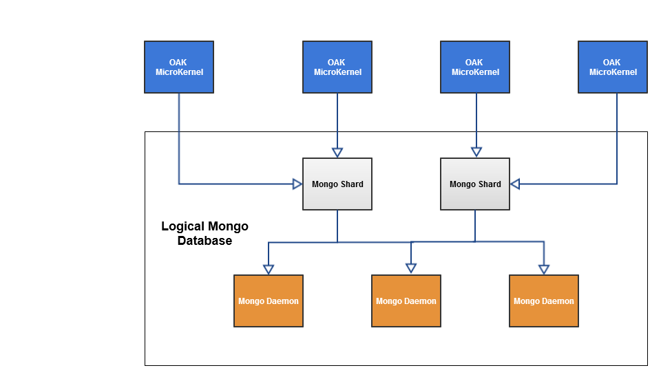

# Introdução à plataforma AEM{#introduction-to-the-aem-platform}

A plataforma AEM no AEM 6 é baseada no Apache Jackrabbit Oak.

O Apache Jackrabbit Oak é um esforço para implementar um repositório de conteúdo hierárquico escalável e eficiente para uso como base de sites modernos de classe mundial e outros aplicativos complexos de conteúdo.

É o sucessor do Jackrabbit 2 e é usado pelo AEM 6 como o backend padrão para seu repositório de conteúdo, o CRX.

## Princípios e objetivos do projeto {#design-principles-and-goals}

O Oak implementa a especificação [JSR-283](https://www.day.com/day/en/products/jcr/jsr-283.html) (JCR 2.0). Os seus principais objetivos de concepção são:

* Melhor suporte para grandes repositórios
* Vários nós de cluster distribuídos para alta disponibilidade
* Melhor desempenho
* Suporte para vários nós filhos e níveis de Controle de acesso

## Conceito de arquitetura {#architecture-concept}

### Armazenamento {#storage}

A finalidade da camada de Armazenamento é:

* Implementar um modelo de árvore
* Tornar o armazenamento plugado
* Fornecer um mecanismo de agrupamento

### Oak Core {#oak-core}

O Oak Core adiciona várias camadas à camada do armazenamento:

* Controles de nível de acesso
* Pesquisa e indexação
* Observação

### JCR Oak {#oak-jcr}

O principal objetivo do JCR Oak é transformar a semântica do JCR em operações em árvore. É igualmente responsável por:

* Implementação da API JCR
* Contendo ganchos de confirmação que implementam restrições do JCR

Além disso, implementações não Java agora são possíveis e fazem parte do conceito JCR Oak.

## Visão geral do armazenamento {#storage-overview}

A camada de armazenamento Oak fornece uma camada de abstração para o armazenamento real do conteúdo.

Atualmente, existem duas implementações de armazenamento disponíveis no AEM6: **Armazenamento Tar** e **Armazenamento MongoDB**.

### Armazenamento de barra {#tar-storage}

O armazenamento Tar usa arquivos tar. Ele armazena o conteúdo como vários tipos de registros em segmentos maiores. Os journais são usados para rastrear o estado mais recente do repositório.

Existem vários princípios básicos de design que foram construídos em torno:

* **Segmentos imutáveis**

O conteúdo é armazenado em segmentos que podem ter até 256 KiB. Eles são imutáveis, o que facilita o cache de segmentos acessados com frequência e reduz erros do sistema que podem corromper o repositório.

Cada segmento é identificado por um identificador exclusivo (UUID) e contém um subconjunto contínuo da árvore de conteúdo. Além disso, os segmentos podem fazer referência a outro conteúdo. Cada segmento mantém uma lista de UUIDs de outros segmentos referenciados.

* **Localidade**

Os registros relacionados, como um nó e seus filhos imediatos, geralmente são armazenados no mesmo segmento. Isso torna a pesquisa no repositório muito rápida e evita a maioria das falhas de cache para clientes típicos que acessam mais de um nó relacionado por sessão.

* **Compactação**

A formatação de registros é otimizada para tamanho, a fim de reduzir os custos de E/S e ajustar o máximo de conteúdo possível em caches.

### Armazenamento Mongo {#mongo-storage}

O armazenamento MongoDB aproveita o MongoDB para compartilhamento e agrupamento. A árvore do repositório é mantida em um banco de dados MongoDB onde cada nó é um documento separado.

Ele tem várias particularidades:

* Revisões

Para cada atualização (confirmação) do conteúdo, uma nova revisão é criada. Uma revisão é basicamente uma string que consiste em três elementos:

1. Um carimbo de data e hora derivado da hora do sistema da máquina em que foi gerado
1. Um contador para distinguir as revisões criadas com o mesmo carimbo de data e hora
1. A ID do nó do cluster em que a revisão foi criada

* Marcas

Há suporte para ramificações, o que permite que o cliente registre várias alterações e as torne visíveis com uma única chamada de mesclagem.

* Documentos anteriores

O armazenamento MongoDB adiciona dados a um documento com todas as modificações. No entanto, isso só exclui dados se uma limpeza for explicitamente acionada. Os dados antigos são movidos quando um determinado limite é atingido. Os documentos anteriores contêm apenas dados imutáveis, o que significa que contêm apenas revisões confirmadas e unidas.

* Metadados do nó de cluster

Os dados sobre nós de cluster ativos e inativos são mantidos no banco de dados para facilitar as operações de cluster.

Uma configuração típica de cluster AEM com o armazenamento MongoDB:

## O que é diferente do Jackrabbit 2? {#what-is-different-from-jackrabbit}

Como o Oak foi projetado para ser retrocompatível com o padrão JCR 1.0, quase não haverá alterações no nível do usuário. No entanto, há algumas diferenças notáveis que você precisa levar em conta ao configurar uma instalação de AEM baseada no Oak:

* Oak não cria índices automaticamente. Por isso, será necessário criar índices personalizados quando necessário.
* Ao contrário do Jackrabbit 2, onde as sessões sempre refletem o estado mais recente do repositório, com o Oak uma sessão reflete uma visualização estável do repositório a partir do momento em que a sessão foi adquirida. Isso se deve ao modelo MVCC no qual o Oak está baseado.
* O mesmo nome de irmãos (SNS) não é suportado no Oak.

## Outra documentação relacionada à plataforma {#other-platform-related-documentation}

Para obter mais informações sobre a plataforma AEM, consulte também os artigos abaixo:

* [Configuração de armazenamento de nós e armazenamento de dados no AEM 6](/help/sites-deploying/data-store-config.md)
* [Query Oak e indexação](/help/sites-deploying/queries-and-indexing.md)
* [Elementos do armazenamento no AEM 6](/help/sites-deploying/storage-elements-in-aem-6.md)
* [AEM com MongoDB](/help/sites-deploying/aem-with-mongodb.md)

