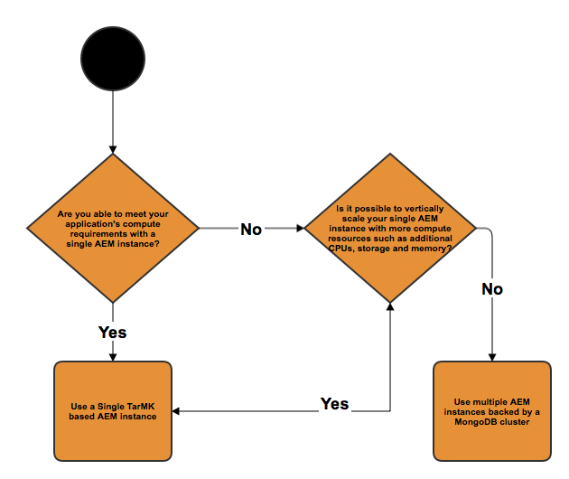

# Implantações recomendadas{#recommended-deployments}

>[!NOTE]
>
>Esta página se refere às topologias recomendadas para AEM. Para obter mais informações sobre os recursos de agrupamento e como configurá-los, consulte a [documentação da API Sling Discovery do Apache](https://sling.apache.org/documentation/bundles/discovery-api-and-impl.html).

Os MicroKernels atuam como gerentes de persistência a partir AEM 6.2. Escolher um para atender às suas necessidades depende da finalidade da sua instância e do tipo de implantação que você está considerando.

Os exemplos a seguir devem ser uma indicação de quais são seus usos recomendados nas configurações mais comuns de AEM.

## Cenários de implantação {#deployment-scenarios}

### Instância Single TarMK {#single-tarmk-instance}

Nesse cenário, uma única instância TarMK é executada em um único servidor.

**Essa é a implantação padrão para instâncias do autor.**

As vantagens:

* Simples
* Manutenção fácil
* Bom desempenho

As desvantagens:

* Não escalável além dos limites da capacidade do servidor
* Sem capacidade de failover

### Modo de espera frio TarMK {#tarmk-cold-standby}

Uma instância TarMK atua como a instância principal. O repositório do principal é replicado para um sistema de failover stand-by.

O mecanismo de espera por frio também pode ser usado como um backup porque o repositório completo é constantemente replicado para o servidor de failover. O servidor de failover está sendo executado no modo de espera frio, o que significa que somente o HttpReceiver da instância está sendo executado.

As vantagens:

* Simplicidade
* Manutenção
* Show
* Failover

As desvantagens:

* Não escalável além dos limites da capacidade do servidor
* Um servidor está inativo a maior parte do tempo
* O failover não é automático. Ela deve ser detectada externamente antes que o sistema de failover possa start atendendo solicitações.

>[!NOTE]
>
>Para obter mais informações sobre como configurar o AEM com o TarMK Cold Standby, consulte o artigo [this](/help/sites-deploying/tarmk-cold-standby.md).

>[!NOTE]
>
>A implantação do modo de espera frio neste exemplo do TarMK exige que as instâncias principal e standby sejam licenciadas separadamente, pois há replicação constante para o servidor de failover. Para obter mais informações sobre licenciamento, consulte os [Termos gerais de licenciamento do Adobe](https://www.adobe.com/legal/terms/enterprise-licensing.html).

### Farm TarMK {#tarmk-farm}

Várias instâncias Oak executam cada uma com uma instância TarMK. Os repositórios TarMK são independentes e precisam ser mantidos em sincronia.

Manter os repositórios sincronizados é fornecido com o fato de que o servidor do autor está publicando o mesmo conteúdo para cada membro do farm. Para obter mais informações, consulte [Replicação](/help/sites-deploying/replication.md).

Para AEM Communities, o conteúdo gerado pelo usuário (UGC) nunca é replicado. Para suportar UGC em um farm TarMK, consulte [considerações para AEM Communities](#considerations-for-aem-communities).

**Essa é a implantação padrão para ambientes de publicação.**

As vantagens:

* Show
* Escalabilidade para acesso de leitura
* Failover

### Cluster Oak com failover MongoMK para alta disponibilidade em um único datacenter {#oak-cluster-with-mongomk-failover-for-high-availability-in-a-single-datacenter}

Essa abordagem implica que várias instâncias Oak acessem um conjunto de réplicas MongoDB em um único data center, criando um cluster ativo-ativo para o ambiente do autor AEM. Os conjuntos de réplicas no MongoDB são usados para fornecer alta disponibilidade e redundância no evento de uma falha de hardware ou rede.

As vantagens:

* Capacidade de dimensionar horizontalmente com novas instâncias do autor AEM
* Alta disponibilidade, redundância e failover automatizado da camada de dados

As desvantagens:

* O desempenho pode ser menor do que com o TarMK em alguns cenários

### Cluster Oak com failover MongoMK em vários datacenters {#oak-cluster-with-mongomk-failover-across-multiple-datacenters}

Essa abordagem implica que várias instâncias Oak acessem um conjunto de réplicas MongoDB em vários data centers, criando um cluster ativo-ativo para o ambiente do autor AEM. Com vários data centers, a replicação MongoDB oferece a mesma disponibilidade e redundância, mas agora inclui a capacidade de lidar com uma interrupção no data center.

As vantagens:

* Capacidade de dimensionar horizontalmente com novas instâncias do autor AEM
* Alta disponibilidade, redundância e failover automatizado de camadas de dados (incluindo paralisações do data center)

>[!NOTE]
>
>No diagrama acima, AEM Server 3 e AEM Server 4 são apresentados com um status inativo assumindo uma latência de rede entre os Servidores AEM no Data Center 2 e o nó primário MongoDB no Data Center 1 que seja superior ao requisito documentado [aqui](/help/sites-deploying/aem-with-mongodb.md#checklists). Se a latência máxima for compatível com os requisitos, por exemplo, por meio do uso de zonas de disponibilidade, os servidores AEM no Data Center 2 também poderão estar ativos, criando um cluster AEM ativo-ativo em vários datacenters.

>[!NOTE]
>
>Para obter informações adicionais sobre os conceitos arquitetônicos MongoDB descritos nesta seção, consulte [Replicação MongoDB](https://docs.mongodb.org/manual/replication/).

## Microkernels: qual usar {#microkernels-which-one-to-use}

A regra básica que precisa ser considerada ao escolher entre os dois microkernels disponíveis é que o TarMK foi projetado para desempenho, enquanto o MongoMK é usado para escalabilidade.

Você pode usar essas matrizes de decisão para determinar qual é o melhor tipo de implantação adequado às suas necessidades.

O Adobe recomenda que o TarMK seja a tecnologia de persistência padrão usada pelos clientes em todos os cenários de implantação, tanto para as instâncias de autor e publicação do AEM, exceto nos casos de uso descritos abaixo.

### Exceções para escolher AEM MongoMK em TarMK em Instâncias de autor {#exceptions-for-choosing-aem-mongomk-over-tarmk-on-author-instances}

O principal motivo para escolher o backend de persistência MongoMK sobre TarMK é dimensionar as instâncias horizontalmente. Isso significa ter duas ou mais instâncias do autor ativas em execução o tempo todo e usar o MongoDB como sistema de armazenamento de persistência. A necessidade de executar mais de uma instância do autor resulta geralmente do fato de a CPU e a capacidade de memória de um único servidor, suportando todas as atividades de criação simultâneas, não serem mais sustentáveis.

É quase impossível prever qual será o modelo exato de simultaneidade após a entrada em funcionamento de um novo site. Portanto, o Adobe recomenda que você considere os seguintes critérios ao avaliar se deve usar o MongoMK e dois ou mais nós ativos do Autor:

1. Número de usuários nomeados conectados em um dia: nos milhares ou mais.
1. Número de usuários simultâneos: nas centenas ou mais.
1. Volume de ingestões de ativos por dia: em centenas de milhares ou mais.
1. Volume de edições de página por dia: em centenas de milhares ou mais (incluindo atualizações automatizadas por meio do Multi Site Manager ou ingestões de feed de notícias, por exemplo).
1. Volume de pesquisas por dia: em dezenas de milhares ou mais.

>[!NOTE]
>
>O Dia difícil pode ser usado para avaliar o desempenho do aplicativo do cliente no contexto da configuração de hardware implantada. Mais informações sobre esta ferramenta estão disponíveis [aqui](/help/sites-developing/tough-day.md).

Uma implantação mínima com MongoDB normalmente envolverá a seguinte topologia:

* Um conjunto de réplicas MongoDB que consiste em um nó primário, dois nós secundários com cada uma das instâncias MongoDB em execução em uma zona de disponibilidade com uma latência inferior a 15 milissegundos em cada nó;
* Um cluster de instâncias do autor com um nó líder, um nó não líder e ambos ativos a qualquer momento, com cada uma das instâncias do autor em execução em cada um dos datacenters, onde as instâncias primárias e secundárias do MongoDB estão em execução.

Além disso, é altamente recomendável configurar o armazenamento de dados em um sistema de arquivos compartilhado ou Amazon S3, de modo que os ativos ou binários não sejam armazenados no MongoDB. Isso garantirá o desempenho ideal na implantação.

Um dos benefícios adicionais da implantação de um conjunto de réplicas MongoDB com um cluster de duas ou mais instâncias do autor é ter um cenário de recuperação automatizada com o mínimo de tempo de inatividade no caso de instâncias do autor, réplica MongoDB ou uma falha completa do datacenter. No entanto, a escolha do MongoMK em relação ao TarMK não deve ser exclusivamente orientada pelo requisito de recuperação, já que o TarMK também pode fornecer uma solução de tempo de inatividade mínimo com um mecanismo de failover controlado.

Se os critérios acima não forem cumpridos durante os primeiros 18 meses de implantação, é recomendável implantar AEM usando o TarMK, reavaliar sua configuração posteriormente quando os critérios acima se aplicarem e, por fim, determinar se deve permanecer no TarMK ou migrar para o MongoMK.

### Exceções para escolher AEM MongoMK em TarMK em Instâncias de publicação {#exceptions-for-choosing-aem-mongomk-over-tarmk-on-publish-instances}

Não é recomendado implantar MongoMK para instâncias de publicação. A camada de publicação da implantação é quase sempre implantada como um farm de instâncias de publicação totalmente independentes executando o TarMK, que são mantidas em sincronia por meio da replicação de conteúdo das instâncias do autor. Essa arquitetura de &quot;nada compartilhado&quot;, própria às instâncias de publicação, permite que a implantação da camada de publicação seja dimensionada horizontalmente de forma linear. A topologia de farm também oferece a vantagem de aplicar qualquer atualização ou atualização para publicar instâncias em uma base móvel, de modo que qualquer alteração na camada de publicação não exigirá tempo de inatividade.

Isso não se aplica à AEM Communities usando clusters MongoMK na camada de publicação sempre que houver mais de um editor. Se você escolher JSRP (consulte [Armazenamento de conteúdo da comunidade](/help/communities/working-with-srp.md)), um cluster MongoMK seria apropriado, assim como qualquer cluster lateral de publicação independentemente do MK escolhido, como MongoDB ou RDB.

### Pré-requisitos e Recommendations ao implantar AEM com MongoMK {#prerequisites-and-recommendations-when-deploying-aem-with-mongomk}

Um conjunto de pré-requisitos e recomendações está disponível se você estiver considerando uma implantação MongoMK para AEM:

**Pré-requisitos obrigatórios para implantações MongoDB:**

1. A arquitetura e o dimensionamento da implantação do MongoDB devem fazer parte da implementação do projeto com a ajuda dos arquitetos da Adobe Consulting ou do MongoDB que conhecem AEM;
1. A experiência do MongoDB deve estar presente no parceiro ou na equipe do cliente, a fim de ter confiança em ser capaz de manter e manter um ambiente MongoDB atual ou novo;
1. Você pode optar por implantar a versão comercial ou de código aberto do MongoDB (o AEM suporta ambos), mas deve adquirir um contrato MongoDB Maintenance and Support diretamente da MongoDB Inc;
1. As arquiteturas e infraestruturas AEM e MongoDB devem ser bem definidas e validadas por um arquiteto de Adobe AEM;
1. Você deve revisar o modelo de suporte para implantações AEM que incluem MongoDB.

**Recomendações fortes para implantações MongoDB:**

* Consulte o MongoDB para Adobe Experience Manager [article](https://www.mongodb.com/lp/contact/mongodb-adobe-experience-manager);
* Revise a produção do MongoDB [checklist](https://docs.mongodb.org/manual/administration/production-checklist/);
* Participe de uma classe de certificação no MongoDB disponível on-line [aqui](https://university.mongodb.com/).

>[!NOTE]
>
>Para todas as perguntas adicionais sobre essas diretrizes, pré-requisitos e recomendações, entre em contato com o [Atendimento ao cliente do Adobe](https://helpx.adobe.com/br/marketing-cloud/contact-support.html).

### Considerações para AEM Communities {#considerations-for-aem-communities}

Para sites que planejam implantar [AEM Communities](/help/communities/overview.md), é recomendável [escolher uma implantação](/help/communities/working-with-srp.md#characteristicsofstorageoptions) otimizada para lidar com o UGC postado pelos membros da comunidade do ambiente de publicação.

Ao usar um [armazenamento comum](/help/communities/working-with-srp.md), o UGC não precisa ser replicado entre as instâncias de autor e outras instâncias de publicação para obter uma visualização consistente do UGC.

Abaixo está um conjunto de matrizes decisivas que podem ajudá-lo a escolher o melhor tipo de persistência para sua implantação:

#### Escolhendo o tipo de implantação para instâncias do autor {#choosing-the-deployment-type-for-author-instances}

#### Escolhendo o tipo de implantação para instâncias de publicação {#choosing-the-deployment-type-for-publish-instances}

>[!NOTE]
>
>O MongoDB é um software de terceiros e não está incluído no pacote de licenciamento AEM. Para obter mais informações, consulte a página [Política de licenciamento MongoDB](https://www.mongodb.org/about/licensing/).
>
>Para obter o máximo de sua implantação AEM, a Adobe recomenda licenciar a versão MongoDB Enterprise para se beneficiar do suporte profissional.
>
>A licença inclui um conjunto de réplicas padrão, composto por uma e duas instâncias primárias que podem ser usadas para o autor ou as implantações de publicação.
>
>Caso deseje executar o autor e publicar no MongoDB, duas licenças separadas precisam ser compradas.
>
>Para obter mais informações, consulte a [página MongoDB para Adobe Experience Manager](https://www.mongodb.com/lp/contact/mongodb-adobe-experience-manager).

