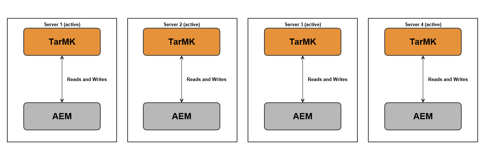

# Implantações recomendadas{#recommended-deployments}

>[!NOTE]
>
>Esta página se refere às topologias recomendadas para AEM. Para obter mais informações sobre recursos de cluster e como configurá-los, consulte o [Documentação da API Apache Sling Discovery](https://sling.apache.org/documentation/bundles/discovery-api-and-impl.html).

Os MicroKernels atuam como gerentes de persistência a partir do AEM 6.2. Escolher um para atender às suas necessidades depende da finalidade da sua instância e do tipo de implantação que você está considerando.

Os exemplos abaixo devem ser uma indicação de quais são seus usos recomendados nas configurações de AEM mais comuns.

## Cenários de implantação {#deployment-scenarios}

### Instância única do TarMK {#single-tarmk-instance}

Nesse cenário, uma única instância TarMK é executada em um único servidor.

**Essa é a implantação padrão para instâncias de autor.**

As vantagens:

* Simples
* Manutenção fácil
* Bom desempenho

As desvantagens:

* Não escalável além dos limites da capacidade do servidor
* Sem capacidade de failover

### TarMK Cold Standby {#tarmk-cold-standby}

Uma instância TarMK atua como a instância principal. O repositório do principal é replicado para um sistema de failover em standby.

O mecanismo de standby frio também pode ser usado como um backup porque o repositório completo é replicado constantemente para o servidor de failover. O servidor de failover está sendo executado no modo de espera passiva, o que significa que somente o HttpReceiver da instância está em execução.

As vantagens:

* Simplicidade
* Manutenção
* Show
* Failover

As desvantagens:

* Não escalável além dos limites da capacidade do servidor
* Um servidor está inativo na maior parte do tempo
* O failover não é automático. Tem de ser detectado externamente antes de o sistema de ativação pós-falha poder começar a servir pedidos.

>[!NOTE]
>
>Para obter mais informações sobre como configurar AEM com o TarMK Cold Standby, consulte [this](/help/sites-deploying/tarmk-cold-standby.md) artigo 10. o

>[!NOTE]
>
>A implantação do Cold Standby neste exemplo TarMK requer que as instâncias primárias e de standby sejam licenciadas separadamente, pois há replicação constante para o servidor de failover. Para obter mais informações sobre licenciamento, consulte o [Termos de Licenciamento Geral do Adobe](https://www.adobe.com/legal/terms/enterprise-licensing.html).

### Farm TarMK {#tarmk-farm}

Várias instâncias do Oak são executadas cada uma com uma instância TarMK. Os repositórios TarMK são independentes e precisam ser sincronizados.

Manter os repositórios sincronizados é fornecido com o fato de que o servidor do autor está publicando o mesmo conteúdo para cada membro do farm. Para obter mais informações, consulte [Replicação](/help/sites-deploying/replication.md).

Para o AEM Communities, o conteúdo gerado pelo usuário (UGC) nunca é replicado. Para obter suporte ao UGC em um farm TarMK, consulte [considerações para a AEM Communities](#considerations-for-aem-communities).

**Essa é a implantação padrão para ambientes de publicação.**

As vantagens:

* Show
* Escalabilidade para acesso de leitura
* Failover

### Cluster Oak com Failover MongoMK para Alta Disponibilidade em um Único Datacenter {#oak-cluster-with-mongomk-failover-for-high-availability-in-a-single-datacenter}

Essa abordagem implica várias instâncias do Oak acessando um conjunto de réplicas do MongoDB em um único data center, criando um cluster ativo-ativo para o ambiente de criação do AEM. Os conjuntos de réplicas no MongoDB são usados para fornecer alta disponibilidade e redundância em caso de falha de hardware ou de rede.

As vantagens:

* Capacidade de dimensionar horizontalmente com novas instâncias do autor de AEM
* Alta disponibilidade, redundância e failover automatizado da camada de dados

As desvantagens:

* O desempenho pode ser menor do que com o TarMK em alguns cenários

### Cluster Oak com Failover MongoMK em vários data centers {#oak-cluster-with-mongomk-failover-across-multiple-datacenters}

Essa abordagem implica várias instâncias do Oak acessando um conjunto de réplicas do MongoDB em vários data centers, criando um cluster ativo-ativo para o ambiente de criação do AEM. Com vários data centers, a replicação do MongoDB oferece a mesma alta disponibilidade e redundância, mas agora inclui a capacidade de lidar com uma interrupção do data center.

As vantagens:

* Capacidade de dimensionar horizontalmente com novas instâncias do autor de AEM
* Alta disponibilidade, redundância e failover automatizado da camada de dados (incluindo paralisações do data center)

>[!NOTE]
>
>No diagrama acima, o AEM Server 3 e o AEM Server 4 são apresentados com um status inativo, assumindo uma latência de rede entre os AEM Servers no Data Center 2 e o nó principal do MongoDB no Data Center 1 que é superior ao requisito documentado [here](/help/sites-deploying/aem-with-mongodb.md#checklists). Se a latência máxima for compatível com os requisitos, por exemplo, por meio do uso de zonas de disponibilidade, os servidores de AEM no Data Center 2 também poderão estar ativos, criando um cluster de AEM ativo-ativo em vários data centers.

>[!NOTE]
>
>Para obter mais informações sobre os conceitos arquiteturais do MongoDB descritos nesta seção, consulte [Replicação do MongoDB](https://docs.mongodb.org/manual/replication/).

## Microkernels: qual usar {#microkernels-which-one-to-use}

A regra básica que precisa ser levada em conta ao escolher entre os dois microkernels disponíveis é que o TarMK foi projetado para desempenho, enquanto o MongoMK é usado para escalabilidade.

Você pode usar essas matrizes de decisão para estabelecer qual é o melhor tipo de implantação adequado às suas necessidades.

O Adobe recomenda que o TarMK seja a tecnologia de persistência padrão usada pelos clientes em todos os cenários de implantação, tanto para as instâncias de Autor e Publicação do AEM, exceto nos casos de uso descritos abaixo.

### Exceções para escolher AEM MongoMK em vez de TarMK em Instâncias do Autor {#exceptions-for-choosing-aem-mongomk-over-tarmk-on-author-instances}

O motivo principal para escolher o back-end de persistência do MongoMK sobre o TarMK é dimensionar as instâncias horizontalmente. Isso significa ter duas ou mais instâncias de autor ativas em execução contínua e usar o MongoDB como o sistema de armazenamento de persistência. A necessidade de executar mais de uma instância de autor geralmente resulta do fato de que a CPU e a capacidade de memória de um único servidor, suportando todas as atividades de criação simultâneas, não são mais sustentáveis.

É quase impossível prever qual será o modelo exato de simultaneidade depois que um novo site entrar em funcionamento. Portanto, o Adobe recomenda que você considere os seguintes critérios ao avaliar se deve usar o MongoMK e dois ou mais nós ativos do Author:

1. Número de usuários nomeados conectados em um dia: nos milhares ou mais.
1. Número de usuários simultâneos: nas centenas ou mais.
1. Volume de ingestões de ativos por dia: em centenas de milhares ou mais.
1. Volume de edições de página por dia: em centenas de milhares ou mais (incluindo atualizações automatizadas via Multi Site Manager ou ingestões de feed de notícias, por exemplo).
1. Volume de pesquisas por dia: em dezenas de milhares ou mais.

>[!NOTE]
>
>O Dia difícil pode ser usado para avaliar o desempenho do aplicativo do cliente no contexto da configuração de hardware implantada. Mais informações sobre esta ferramenta estão disponíveis [here](/help/sites-developing/tough-day.md).

Uma implantação mínima com MongoDB normalmente envolverá a seguinte topologia:

* Um conjunto de réplicas MongoDB que consiste em um nó principal, dois nós secundários com cada uma das instâncias MongoDB em execução em uma zona de disponibilidade com uma latência abaixo de 15 milissegundos em cada nó;
* Um cluster de instâncias de autor com um nó líder, um nó não líder e ambos ativos a qualquer momento, com cada uma das instâncias de autor em execução em cada um dos data centers, onde as instâncias primárias e secundárias do MongoDB estão em execução.

Além disso, é altamente recomendável configurar o armazenamento de dados em um sistema de arquivos compartilhado ou no Amazon S3, de modo que os ativos ou binários não sejam armazenados no MongoDB. Isso garantirá o desempenho ideal na implantação.

Um dos benefícios adicionais da implantação de um conjunto de réplicas do MongoDB com um cluster de duas ou mais instâncias do autor é ter um cenário de recuperação automatizada com o mínimo de tempo de inatividade no caso de instâncias do autor, réplica do MongoDB ou uma falha completa do datacenter. Não obstante, a escolha do MongoMK em relação ao TarMK não deve ser exclusivamente orientada pelo requisito de recuperação, uma vez que o TarMK também pode fornecer uma solução mínima de tempo de inatividade com um mecanismo de failover controlado.

Se os critérios acima não forem esperados durante os primeiros dezoito meses de implantação, é recomendável primeiro implantar AEM usando o TarMK e, em seguida, reavaliar sua configuração em uma data posterior, quando os critérios acima forem aplicados, e finalmente determinar se deseja permanecer no TarMK ou migrar para o MongoMK.

### Exceções para escolher AEM MongoMK em vez de TarMK em Instâncias de Publicação {#exceptions-for-choosing-aem-mongomk-over-tarmk-on-publish-instances}

Não é recomendado implantar o MongoMK para instâncias de publicação. O nível de publicação da implantação é quase sempre implantado como um farm de instâncias de publicação totalmente independentes que executam o TarMK, que são mantidas em sincronia ao replicar conteúdo das instâncias do autor. Essa arquitetura &quot;nada compartilhado&quot;, adequada às instâncias de publicação, permite que a implantação do nível de publicação seja dimensionada horizontalmente de forma linear. A topologia farm também fornece a vantagem de aplicar qualquer atualização ou atualização a instâncias de publicação em uma base contínua, de modo que qualquer alteração no nível de publicação não exigirá tempo de inatividade.

Isso não se aplica ao AEM Communities que usa clusters MongoMK no nível de publicação sempre que há mais de um editor. Se estiver escolhendo JSRP (consulte [Armazenamento de conteúdo da comunidade](/help/communities/working-with-srp.md)), um cluster MongoMK seria apropriado, assim como qualquer cluster do lado de publicação independentemente do MK escolhido, como MongoDB ou RDB.

### Pré-requisitos e Recommendations ao implantar AEM com MongoMK {#prerequisites-and-recommendations-when-deploying-aem-with-mongomk}

Um conjunto de pré-requisitos e recomendações está disponível se você estiver considerando uma implantação do MongoMK para AEM:

**Pré-requisitos obrigatórios para implantações do MongoDB:**

1. A arquitetura e o dimensionamento da implantação do MongoDB devem fazer parte da implementação do projeto com a ajuda dos arquitetos do Adobe Consulting ou do MongoDB familiarizados com o AEM;
1. A experiência do MongoDB deve estar presente no parceiro ou na equipe do cliente para ter confiança em ser capaz de manter e manter um ambiente MongoDB existente ou novo;
1. Você pode optar por implantar a versão comercial ou de código aberto do MongoDB (o AEM suporta ambos), mas deve adquirir um contrato de manutenção e suporte do MongoDB diretamente da MongoDB Inc;
1. As arquiteturas e infraestruturas globais do AEM e do MongoDB devem ser bem definidas e validadas por um arquiteto de AEM Adobe.
1. Você deve revisar o modelo de suporte para implantações de AEM que incluem o MongoDB.

**Recomendações fortes para implantações do MongoDB:**

* Consulte o MongoDB para Adobe Experience Manager [artigo](https://www.mongodb.com/lp/contact/mongodb-adobe-experience-manager);
* Revisar a produção do MongoDB [lista de verificação](https://docs.mongodb.org/manual/administration/production-checklist/);
* Participe de uma classe de certificação no MongoDB disponível online [here](https://university.mongodb.com/).

>[!NOTE]
>
>Para todas as perguntas adicionais sobre essas diretrizes, pré-requisitos e recomendações, entre em contato com o [Atendimento ao cliente do Adobe](https://helpx.adobe.com/br/marketing-cloud/contact-support.html).

### Considerações para o AEM Communities {#considerations-for-aem-communities}

Para sites que planejam implantar [AEM Communities](/help/communities/overview.md), recomenda-se [escolha uma implantação](/help/communities/working-with-srp.md#characteristicsofstorageoptions) otimizado para lidar com o UGC publicado por membros da comunidade do ambiente de publicação.

Ao usar um [loja comum](/help/communities/working-with-srp.md), o UGC não precisa ser replicado entre o autor e outras instâncias de publicação para obter uma exibição consistente do UGC.

Abaixo está um conjunto de matrizes decisivas que podem ajudá-lo a escolher o melhor tipo de persistência para sua implantação:

#### Escolha do tipo de implantação para instâncias do autor {#choosing-the-deployment-type-for-author-instances}

#### Escolha do tipo de implantação para instâncias de publicação {#choosing-the-deployment-type-for-publish-instances}

>[!NOTE]
>
>O MongoDB é um software de terceiros e não está incluído no pacote de licenciamento AEM. Para obter mais informações, consulte [Política de licenciamento do MongoDB](https://www.mongodb.org/about/licensing/) página.
>
>Para obter o máximo de sua implantação de AEM, o Adobe recomenda o licenciamento da versão MongoDB Enterprise para se beneficiar do suporte profissional.
>
>A licença inclui um conjunto de réplicas padrão, composto por uma instância primária e duas instâncias secundárias que podem ser usadas para o autor ou para as implantações de publicação.
>
>Caso deseje executar o autor e publicar no MongoDB, duas licenças separadas precisam ser compradas.
>
>Para obter mais informações, consulte o [MongoDB para página do Adobe Experience Manager](https://www.mongodb.com/lp/contact/mongodb-adobe-experience-manager).
