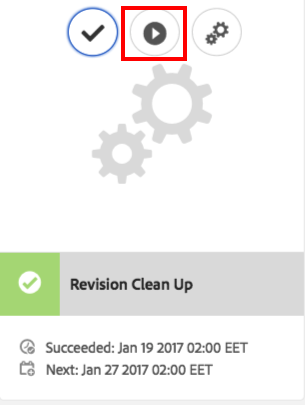
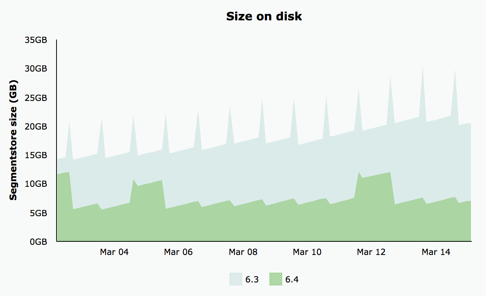

# Limpeza de revisão{#revision-cleanup}

## Introdução {#introduction}

Cada atualização no repositório cria uma nova revisão de conteúdo. Como resultado, a cada atualização o tamanho do repositório aumenta. Para evitar o crescimento descontrolado do repositório, as revisões antigas precisam ser limpas para liberar recursos de disco. Essa funcionalidade de manutenção é chamada de Revisão de limpeza. Ele está disponível como uma rotina offline desde o AEM 6.0.

Com o AEM 6.3, uma versão online dessa funcionalidade chamada Limpeza de Revisão Online foi introduzida. Comparada à Limpeza de Revisão Offline, onde a instância de AEM deve ser encerrada, a Limpeza de Revisão Online pode ser executada enquanto a instância de AEM estiver online. A Limpeza de Revisão Online é ativada por padrão e é a maneira recomendada de executar uma limpeza de revisão.

**Observação**:  [Consulte o ](https://helpx.adobe.com/experience-manager/kt/platform-repository/using/revision-cleanup-technical-video-use.html) Vídeo para obter uma introdução e como usar a Limpeza de revisão online.

O processo de limpeza de revisão consiste em três fases: **estimativa**, **compactação** e **limpeza**. A estimativa determina se a próxima fase (compactação) deve ser executada ou não com base na quantidade de lixo que pode ser coletada. Durante a fase de compactação, os segmentos e os arquivos tar são regravados, sem o conteúdo não utilizado. A fase de limpeza remove subsequentemente os segmentos antigos, incluindo qualquer lixo que eles possam conter. O modo offline geralmente pode recuperar mais espaço, pois o modo online precisa considerar AEM conjunto de trabalho que retém segmentos adicionais de serem coletados.

Para obter mais detalhes sobre a Limpeza de revisão, consulte os seguintes links:

* [Como executar a limpeza de revisão online](/help/sites-deploying/revision-cleanup.md#how-to-run-online-revision-cleanup)
* [Perguntas frequentes sobre limpeza de revisão online](/help/sites-deploying/revision-cleanup.md#online-revision-cleanup-frequently-asked-questions)
* [Como executar a limpeza de revisão offline](/help/sites-deploying/revision-cleanup.md#how-to-run-offline-revision-cleanup)

Além disso, você também pode ler a [documentação oficial do Oak.](https://jackrabbit.apache.org/oak/docs/nodestore/segment/overview.html)

### Quando usar a Limpeza de Revisão Online em vez da Limpeza de Revisão Offline? {#when-to-use-online-revision-cleanup-as-opposed-to-offline-revision-cleanup}

**A Limpeza de Revisão Online é a maneira recomendada de executar a limpeza de revisão.** A limpeza de Revisão Offline deve ser usada somente em uma base excepcional - por exemplo, antes de migrar para o novo formato de armazenamento ou se você for solicitado pelo Atendimento ao Cliente do Adobe a fazer isso.

## Como executar a limpeza de revisão online {#how-to-run-online-revision-cleanup}

A Limpeza de Revisão Online é configurada por padrão para ser executada automaticamente uma vez por dia nas instâncias de Autor e Publicação do AEM. Tudo o que você precisa fazer é definir a janela de manutenção durante um período com a menor atividade do usuário. Você pode configurar a tarefa Limpeza de Revisão Online da seguinte maneira:

1. Na janela principal do AEM, vá para **Tools - Operations - Dashboard - Maintenance** ou aponte o navegador para: `https://serveraddress:serverport/libs/granite/operations/content/maintenance.html`

   

1. Passe o mouse sobre **Janela de manutenção diária** e clique no ícone **Configurações**.

   

1. Insira os valores desejados (recorrência, hora de início, hora de término) e clique em **Save**.

   

Como alternativa, se você quiser executar a tarefa de limpeza de revisão manualmente, poderá:

1. Vá para **Ferramentas - Operações - Painel - Manutenção** ou navegue diretamente para `https://serveraddress:serverport/libs/granite/operations/content/maintenance.html`
1. Clique na **Janela de Manutenção Diária**.
1. Passe o mouse sobre o ícone **Revisão de limpeza**.
1. Clique em **Executar**.

   

### Executando a Limpeza de Revisão Online Após a Limpeza de Revisão Offline {#running-online-revision-cleanup-after-offline-revision-cleanup}

O processo de limpeza de revisão recupera revisões antigas por gerações. Isso significa que cada vez que você executa a limpeza de revisão, uma nova geração é criada e mantida no disco. No entanto, há uma diferença entre os dois tipos de limpeza de revisão: a limpeza de revisão offline mantém uma geração, enquanto a limpeza de revisão online mantém duas gerações. Portanto, quando você executa a limpeza de revisão online **após** a limpeza de revisão offline, ocorre o seguinte:

1. Depois que a primeira limpeza de revisão online for executada, o repositório terá o dobro de tamanho. Isso acontece porque agora há duas gerações que são mantidas em disco.
1. Durante as execuções subsequentes, o repositório crescerá temporariamente enquanto a nova geração for criada e estabilizará de volta ao tamanho que teve após a primeira execução, já que o processo de limpeza de revisão online recupera a geração anterior.

Além disso, lembre-se de que, dependendo do tipo e do número de commits, cada geração pode variar em tamanho em comparação à anterior, de modo que o tamanho final pode variar de uma execução para outra.

Devido a esse fato, é recomendável dimensionar o disco pelo menos duas ou três vezes maior que o tamanho do repositório inicialmente estimado.

## Modos de compactação completa e final {#full-and-tail-compaction-modes}

**O AEM 6.5** apresenta  **dois novos** modelos para a fase de  **** compactação do processo de Limpeza de Revisão Online:

* O modo **compactação completa** reescreve todos os segmentos e arquivos tar em todo o repositório. A fase de limpeza subsequente pode, assim, remover a quantidade máxima de lixo no repositório. Como a compactação completa afeta todo o repositório, ela requer uma quantidade considerável de recursos do sistema e tempo para ser concluída. A compactação completa corresponde à fase de compactação no AEM 6.3.
* O modo **tail compaction** reescreve apenas os segmentos e arquivos tar mais recentes no repositório. Os segmentos e arquivos tar mais recentes são os que foram adicionados desde a última execução da compactação completa ou de tail. A fase de limpeza subsequente só pode remover o lixo contido na parte recente do repositório. Como a compactação de tail afeta apenas uma parte do repositório, ela requer consideravelmente menos recursos do sistema e tempo para concluir do que a compactação completa.

Estes modos de compactação constituem uma compensação entre eficiência e consumo de recursos: embora a compactação da cauda seja menos eficaz, também tem menos impacto no funcionamento normal do sistema. Pelo contrário, a compactação completa é mais eficaz, mas tem um impacto maior no funcionamento normal do sistema.

O AEM 6.5 também introduz um mecanismo de desduplicação de conteúdo mais eficiente durante a compactação, o que reduz ainda mais o espaço ocupado em disco pelo repositório.

Os dois gráficos a seguir apresentam resultados de testes laboratoriais internos que ilustram a redução dos tempos de execução médios e da pegada média no disco no AEM 6.5 em comparação com o AEM 6.3:

 

### Como configurar a compactação completa e final {#how-to-configure-full-and-tail-compaction}

A configuração padrão executa a compactação de cauda em dias da semana e a compactação completa nos domingos. A configuração padrão pode ser alterada usando o novo valor de configuração `full.gc.days` da `RevisionCleanupTask` [tarefa de manutenção](/help/sites-deploying/revision-cleanup.md#how-to-run-online-revision-cleanup).

Ao configurar o valor `full.gc.days`, lembre-se de que a compactação completa será executada durante o(s) dia(s) definido(s) no valor e a compactação de tail será executada durante os dias que não estão definidos no valor. Por exemplo, se você configurar a compactação completa para ser executada no domingo, a compactação de cauda será executada de segunda a sábado. Por exemplo, se você configurar a compactação completa para ser executada todos os dias da semana, a compactação de cauda não será executada.

Além disso, tenha em consideração que:

* **A** compactação de cauda é menos eficaz e tem menos impacto nas operações normais do sistema. Destina-se, assim, a ser executado durante dias úteis.
* **A** compactação completa é mais eficaz, mas tem também um impacto maior nas operações normais do sistema. Destina-se, assim, a ser utilizado fora dos dias úteis.
* Tanto a compactação da cauda como a compactação completa devem ser programadas para serem executadas durante horários fora do horário de pico.

### Resolução de problemas {#troubleshooting}

Ao usar os novos modos de compactação, lembre-se do seguinte:

* Você pode monitorar a atividade de entrada/saída (E/S), por exemplo: Operações de E/S, CPU aguardando E/S, confirmar tamanho da fila. Isso ajuda a determinar se o sistema está se tornando vinculado à E/S e requer o redimensionamento.
* O `RevisionCleanupTaskHealthCheck` indica o status de integridade geral da Limpeza de Revisão Online. Funciona da mesma forma que no AEM 6.3 e não distingue entre compactação completa e de cauda.
* As mensagens de log transmitem informações relevantes sobre os modos de compactação. Por exemplo, quando a Limpeza de Revisão Online é iniciada, as mensagens de log correspondentes indicam o modo de compactação. Além disso, em alguns casos, o sistema reverterá para compactação completa quando foi agendado para executar uma compactação de tail e as mensagens de log indicarão essa mudança. As amostras de log abaixo indicam o modo de compactação e a mudança de cauda para compactação completa:

```
TarMK GC: running tail compaction
TarMK GC: no base state available, running full compaction instead
```

### Limitações conhecidas {#known-limitations}

Em alguns casos, alternar entre a cauda e os modos de compactação completos atrasa o processo de limpeza. Mais precisamente, o repositório crescerá após uma compactação completa (dobrará de tamanho). O espaço extra será recuperado na compactação de cauda subsequente, quando o repositório cair abaixo do tamanho de compactação pré-completo. As execuções de tarefas de manutenção paralelas também devem ser evitadas.

**Recomenda-se dimensionar o disco pelo menos duas ou três vezes maior que o tamanho do repositório inicialmente estimado.**

## Perguntas frequentes sobre limpeza de revisão online {#online-revision-cleanup-frequently-asked-questions}

### Considerações sobre a atualização do AEM 6.5 {#aem-upgrade-considerations}

<table>
 <tbody>
  <tr>
   <td>Perguntas </td>
   <td>Respostas</td>
  </tr>
  <tr>
   <td>O que devo estar ciente quando atualizo para o AEM 6.5?</td>
   <td><p>O formato de persistência do TarMK será alterado com o AEM 6.5. Essas alterações não exigem uma etapa de migração proativa. Os repositórios existentes passarão por uma migração contínua, que é transparente para o usuário. O processo de migração é iniciado na primeira vez em que o AEM 6.5 (ou ferramentas relacionadas) acessa o repositório.</p> <p><strong>Depois que a migração para o formato de persistência AEM 6.5 for iniciada, o repositório não poderá ser revertido para o formato de persistência AEM 6.3 anterior.</strong></p> </td>
  </tr>
 </tbody>
</table>

### Migrando para o Oak Segment Tar {#migrating-to-oak-segment-tar}

<table>
 <tbody>
  <tr>
   <td><strong>Perguntas</strong></td>
   <td><strong>Respostas</strong></td>
   <td> </td>
  </tr>
  <tr>
   <td><strong>Por que preciso migrar o repositório?</strong></td>
   <td><p>No AEM 6.3 foram necessárias alterações no formato de armazenamento, especialmente para melhorar o desempenho e a eficácia da Limpeza de Revisão Online. Essas alterações não são compatíveis com versões anteriores e os repositórios criados com o segmento antigo do Oak (AEM 6.2 e anterior) devem ser migrados.</p> <p>Benefícios adicionais da alteração do formato de armazenamento:</p>
    <ul>
     <li>Melhor escalabilidade (tamanho otimizado do segmento).</li>
     <li>Coleta de lixo do armazenamento de dados mais rápida <a href="/help/sites-administering/data-store-garbage-collection.md" target="_blank">.<br /></a> </li>
     <li>Trabalho em terra para aprimoramentos futuros.</li>
    </ul> </td>
   <td> </td>
  </tr>
  <tr>
   <td><strong>O formato Tar anterior ainda é compatível?</strong></td>
   <td>Somente o novo Oak Segment Tar é compatível com o AEM 6.3.</td>
   <td> </td>
  </tr>
  <tr>
   <td><strong>A migração de conteúdo é sempre obrigatória?</strong></td>
   <td>Sim. A menos que você comece com uma nova instância, sempre precisará migrar o conteúdo.</td>
   <td> </td>
  </tr>
  <tr>
   <td><strong>Posso atualizar para a versão 6.3 e fazer a migração posteriormente (por exemplo, usando outra janela de manutenção)?</strong></td>
   <td>Não, como explicado acima, a migração de conteúdo é obrigatória.</td>
   <td> </td>
  </tr>
  <tr>
   <td><strong>O tempo de inatividade pode ser evitado ao migrar?</strong></td>
   <td>Não. Esse é um esforço único que não pode ser feito em uma instância em execução.</td>
   <td> </td>
  </tr>
  <tr>
   <td><strong>O que acontece se eu executar acidentalmente em relação ao formato de repositório incorreto?</strong></td>
   <td>Se você tentar executar o módulo oak-segment em um repositório oak-segment-tar (ou vice-versa), a inicialização falhará com um <em>IllegalStateException</em> com a mensagem "Formato de segmento inválido". Não haverá corrupção de dados.</td>
   <td> </td>
  </tr>
  <tr>
   <td><strong>Será necessário reindexar os índices de pesquisa?</strong></td>
   <td>Não. A migração de oak-segment para oak-segment-tar introduz alterações no formato do contêiner. Os dados contidos não são afetados e não serão modificados.</td>
   <td> </td>
  </tr>
  <tr>
   <td><strong>Como calcular melhor o espaço em disco esperado necessário durante e após a migração?</strong></td>
   <td>A migração equivale a recriar o armazenamento de segmentos no novo formato. Isso pode ser usado para estimar o espaço em disco adicional necessário durante a migração. Após a migração, o armazenamento de segmento antigo pode ser excluído para recuperar espaço.</td>
   <td> </td>
  </tr>
  <tr>
   <td><strong>Como estimar melhor a duração da migração?</strong></td>
   <td>O desempenho da migração pode ser significativamente melhorado se <a href="/help/sites-deploying/revision-cleanup.md#how-to-run-offline-revision-cleanup">limpeza de revisão offline</a> for executada antes da migração. Todos os clientes são aconselhados a executá-lo como um pré-requisito do processo de atualização. Em geral, a duração da migração deve ser semelhante à duração da tarefa de limpeza de revisão offline, supondo que a tarefa de limpeza de revisão offline tenha sido executada antes da migração.</td>
   <td> </td>
  </tr>
 </tbody>
</table>

### Executando Limpeza de Revisão Online {#running-online-revision-cleanup}

<table>
 <tbody>
  <tr>
   <td><strong>Perguntas</strong></td>
   <td><strong>Respostas</strong></td>
   <td> </td>
  </tr>
  <tr>
   <td><strong>Com que frequência a Limpeza de Revisão Online deve ser executada?</strong></td>
   <td>Uma vez ao dia. Essa é a configuração padrão no Painel de operações.</td>
   <td> </td>
  </tr>
  <tr>
   <td><strong>Como posso configurar a hora de início da tarefa de manutenção de Limpeza de Revisão Online?</strong></td>
   <td>Consulte a seção <a href="/help/sites-deploying/revision-cleanup.md#how-to-run-online-revision-cleanup">Como executar a Limpeza de Revisão Online</a> . </td>
   <td> </td>
  </tr>
  <tr>
   <td><strong>Existe uma frequência máxima que não deve ser excedida para a Limpeza de Revisão Online?</strong></td>
   <td>Recomenda-se executar a Limpeza de Revisão Online uma vez por dia, conforme configurado por padrão.<br /> </td>
   <td> </td>
  </tr>
  <tr>
   <td><strong>Quais são os principais indicadores que determinam a frequência na qual a Limpeza de Revisão Online deve ser executada?</strong></td>
   <td>Não há necessidade de determinar a frequência, pois a Limpeza de Revisão Online está configurada como uma tarefa de manutenção e é executada automaticamente a cada dia.</td>
   <td> </td>
  </tr>
  <tr>
   <td><strong>Por que a Limpeza de Revisão Online não recupera espaço quando executada pela primeira vez?</strong></td>
   <td>A Limpeza de Revisão Online recupera as antigas revisões por gerações. Uma nova geração é gerada sempre que a limpeza da revisão é executada. Apenas o conteúdo que tem pelo menos duas gerações será recuperado, o que significa que, numa primeira execução, não há nada a reclamar.</td>
   <td> </td>
  </tr>
  <tr>
   <td><strong>Por que a primeira Limpeza de Revisão Online não recupera espaço quando executada após a Limpeza de Revisão Offline?</strong></td>
   <td><p>A Limpeza de Revisão Offline recupera tudo, menos a última geração, em comparação com as últimas duas gerações para a Limpeza de Revisão Online. No caso de um repositório novo, a Limpeza de Revisão Online não recuperará espaço quando for executada pela primeira vez após a Limpeza de Revisão Offline, pois não há geração antiga o suficiente para ser recuperada.</p> <p>Além disso, leia a seção "Executando limpeza de revisão online após limpeza de revisão offline" de <a href="/help/sites-deploying/revision-cleanup.md#how-to-run-online-revision-cleanup">this chapter</a>.</p> </td>
   <td> </td>
  </tr>
  <tr>
   <td><strong>O Autor e a Publicação normalmente teriam diferentes janelas de Limpeza de Revisão Online?</strong></td>
   <td>Isso depende do horário comercial e dos padrões de tráfego da presença online do cliente. As janelas de manutenção devem ser configuradas fora dos principais tempos de produção para permitir a melhor eficácia de limpeza. Para várias instâncias de publicação do AEM (farm TarMK), as janelas de manutenção para limpeza de revisão online devem ser escalonadas.</td>
   <td> </td>
  </tr>
  <tr>
   <td><strong>Existem pré-requisitos antes de executar a Limpeza de Revisão Online?</strong></td>
   <td><p>A Limpeza de Revisão Online está disponível somente com AEM 6.3 e versões posteriores. Além disso, se estiver usando uma versão mais antiga do AEM, será necessário migrar para o novo <a href="/help/sites-deploying/revision-cleanup.md#migrating-to-oak-segment-tar">Oak Segment Tar</a>.</p> </td>
   <td> </td>
  </tr>
  <tr>
   <td><strong>Quais são os fatores que determinam a duração da Limpeza de Revisão Online?</strong></td>
   <td>Os fatores são:<br />
    <ul>
     <li>Tamanho do repositório</li>
     <li>Carregar no sistema (solicitações por minuto, especificamente operações de gravação)</li>
     <li>Padrão de atividade (leituras versus gravações)</li>
     <li>Especificações de hardware (desempenho da CPU, memória, IOPS)</li>
    </ul> </td>
   <td> </td>
  </tr>
  <tr>
   <td><strong>Os autores ainda podem trabalhar enquanto a Limpeza de Revisão Online estiver em execução?</strong></td>
   <td>Sim, a Limpeza de Revisão Online pode lidar com gravações simultâneas. No entanto, a Limpeza de Revisão Online funciona de forma mais rápida e eficiente sem transações de gravação simultâneas. É recomendável agendar a tarefa de manutenção de Limpeza de Revisão Online para um tempo relativamente silencioso sem muito tráfego.</td>
   <td> </td>
  </tr>
  <tr>
   <td><strong>Quais são os requisitos mínimos para espaço em disco e memória heap ao executar a Limpeza de Revisão Online?</strong></td>
   <td><p>O espaço em disco é continuamente monitorado durante a Limpeza de Revisão Online. Se o espaço em disco disponível cair abaixo de um valor crítico, o processo será cancelado. O valor crítico é 25% do espaço ocupado pelo disco atual do repositório e não é configurável.</p> <p><strong>Recomenda-se dimensionar o disco pelo menos duas ou três vezes maior que o tamanho do repositório inicialmente estimado.</strong></p> <p>O espaço livre de heap é continuamente monitorado durante o processo de limpeza. Se o espaço livre de heap cair abaixo de um valor crítico, o processo será cancelado. O valor crítico é configurado por meio de org.apache.jackrabbit.oak.segment.SegmentNodeStoreService#MEMORY_THRESHOLD. O valor padrão é 15%.</p> <p>O Recommendations para dimensionamento mínimo de heap de compactação não é separado das recomendações de dimensionamento de memória AEM. Regra geral: <strong>Se uma instância de AEM for dimensionada bem o suficiente para lidar com os casos de uso e a carga esperada nela, o processo de limpeza obterá memória suficiente.</strong></p> </td>
   <td> </td>
  </tr>
  <tr>
   <td><strong>Qual é o impacto esperado no desempenho ao executar a Limpeza de Revisão Online?</strong></td>
   <td>A Limpeza de Revisão Online é um processo em segundo plano que lê e grava no repositório simultaneamente em operações normais do sistema. Em particular, pode ser necessário adquirir acesso exclusivo ao repositório por um curto período de tempo, impedindo que outros threads gravem o repositório.</td>
   <td> </td>
  </tr>
  <tr>
   <td><strong>Por quanto tempo a Limpeza de Revisão Online deve ser executada?</strong></td>
   <td>Não deve levar mais de 2 horas para ser executado de acordo com os testes de desempenho mais recentes que realizamos internamente.</td>
   <td> </td>
  </tr>
  <tr>
   <td><strong>O que deve ser feito se a Limpeza de Revisão Online demorar mais?</strong></td>
   <td>
    <ul>
     <li>Certifique-se de que seja executado diariamente.<br /> </li>
     <li>Certifique-se de que ele seja executado durante as atividades mínimas do repositório, configurando as janelas de manutenção no Painel de Operações de acordo.</li>
     <li>Aumente os recursos do sistema (CPU, Memória, E/S).</li>
    </ul> </td>
   <td> </td>
  </tr>
  <tr>
   <td><strong>O que acontece se a Limpeza de Revisão Online exceder o Windows de Manutenção configurado?</strong></td>
   <td>Verifique se outras tarefas de manutenção não estão atrasando a execução. Isso pode ser o caso se mais tarefas de manutenção do que a Limpeza de Revisão Online forem executadas na mesma janela de manutenção. Observe que as tarefas de manutenção são executadas sequencialmente sem uma ordem configurável.</td>
   <td> </td>
  </tr>
  <tr>
   <td><strong>Por que a coleta de lixo de revisão é ignorada?</strong></td>
   <td><p>A Limpeza de Revisão depende de uma fase de estimativa para decidir se há lixo suficiente para ser limpo. O avaliador compara o tamanho atual com o tamanho do repositório após ser compactado pela última vez. Se o tamanho exceder o delta configurado, a limpeza será executada. O tamanho delta é definido em 1 GB. Isso significa efetivamente que, se o tamanho do repositório não crescer em 1 GB desde a última execução da limpeza, a nova iteração de limpeza da revisão será ignorada. </p> <p>Abaixo estão as entradas de log relevantes para a fase de estimativa:</p>
    <ul>
     <li>O GC de revisão será executado: <em>O delta de tamanho é N% ou N/N (bytes N/N), portanto, executando a compactação</em></li>
     <li>O GC de revisão <strong>não</strong> será executado: <em>O tamanho delta é N% ou N/N (bytes N/N), portanto, ignorando a compactação por enquanto</em></li>
    </ul> </td>
   <td> </td>
  </tr>
  <tr>
   <td><strong>É possível suspender com segurança a compactação automática se o impacto no desempenho for muito alto?</strong></td>
   <td>Sim. Desde o AEM 6.3, ele pode ser interrompido com segurança pela Janela Tarefa de Manutenção no Painel de Operações ou por meio de JMX.</td>
   <td> </td>
  </tr>
  <tr>
   <td><strong>Se a instância de AEM for desligada durante uma tarefa de limpeza agendada, o processo aborta com segurança ou o desligamento é bloqueado até que a compactação tenha terminado?</strong></td>
   <td>A limpeza da revisão será interrompida e o repositório será desligado com segurança.</td>
   <td> </td>
  </tr>
  <tr>
   <td><strong>O que acontece quando o sistema falha durante a limpeza de revisão online?</strong></td>
   <td>Nesses casos, não há risco de corrupção de dados. Os restos de lixo serão limpos por uma execução subsequente.</td>
   <td> </td>
  </tr>
  <tr>
   <td><strong>Qual é o impacto da não execução da Limpeza de Revisão Online?</strong></td>
   <td>Degradação de desempenho ao longo do tempo.</td>
   <td> </td>
  </tr>
  <tr>
   <td><strong>Quais revisões estão sendo coletadas?</strong></td>
   <td>Por padrão, a Limpeza de Revisão Online coleta revisões que têm pelo menos 24 horas.</td>
   <td> </td>
  </tr>
  <tr>
   <td><strong>O que acontece em caso de interferência excessiva de gravações simultâneas no repositório?</strong></td>
   <td><p>Se houver simultaneidade de gravação no sistema, a limpeza de revisão online pode exigir acesso exclusivo de gravação para poder confirmar as alterações no final de um ciclo de compactação. O sistema entrará no <strong>modo forceCompact</strong>, conforme explicado em mais detalhes na <a href="https://jackrabbit.apache.org/oak/docs/nodestore/segment/overview.html" target="_blank">documentação do oak</a>. Durante a compactação forçada, um bloqueio de gravação exclusivo é adquirido para finalmente confirmar as alterações sem interferência de gravações simultâneas. Para limitar o impacto nos tempos de resposta, é possível definir um valor de tempo limite. Esse valor é definido como 1 minuto por padrão, o que significa que se o compacto de força não for concluído em 1 minuto, o processo de compactação será anulado em favor de commits simultâneos.</p> <p>A duração do pacto de força depende dos seguintes fatores:</p>
    <ul>
     <li>hardware: especificamente IOPS. A duração diminui com mais IOPS.</li>
     <li>tamanho do armazenamento do segmento: a duração aumenta com o tamanho do armazenamento de segmentos.</li>
    </ul> </td>
   <td> </td>
  </tr>
  <tr>
   <td><p><strong>Como a Limpeza de Revisão Online é executada em uma instância de standby?</strong></p> </td>
   <td><p>Em uma configuração de standby frio, somente a instância principal precisa ser configurada para executar a Limpeza de Revisão Online. Na instância de standby, a Limpeza de Revisão Online não precisa ser programada especificamente.</p> <p>A operação correspondente em uma instância de standby é a Limpeza Automática - isso corresponde à fase de limpeza da Limpeza de Revisão Online. A Limpeza Automática é executada na instância de standby após a execução da Limpeza de Revisão Online na instância principal.</p> <p>As fases de estimativa e compactação não serão executadas em uma instância standby.</p> </td>
   <td> </td>
  </tr>
  <tr>
   <td><strong>A Limpeza de Revisão Offline pode liberar mais espaço em disco do que a Limpeza de Revisão Online?</strong></td>
   <td><p>A Limpeza de Revisão Offline pode remover imediatamente as revisões antigas, enquanto a Limpeza de Revisão Online precisa considerar as revisões antigas que ainda estão sendo referenciadas pela pilha de aplicativos. A primeira pode, assim, retirar o lixo mais agressivamente do que a segunda, onde o efeito é amortizado ao longo de alguns ciclos de coleta de lixo.</p> <p>Além disso, leia a seção "Executando limpeza de revisão online após limpeza de revisão offline" de <a href="/help/sites-deploying/revision-cleanup.md#how-to-run-online-revision-cleanup">this chapter</a>.</p> </td>
   <td> </td>
  </tr>
  <tr>
   <td>Alguma consideração sobre operações de arquivos mapeados de memória?</td>
   <td>
    <ul>
     <li><strong>Em ambientes</strong> do Windows, o acesso regular a arquivos é sempre aplicado, de modo que o acesso mapeado pela memória não é usado. Como conselho geral, toda a RAM disponível deve ser alocada no heap e o tamanho segmentCache deve ser aumentado. Você aumenta o segmentCache adicionando a opção segmentCache.size ao org.apache.jackrabbit.oak.segment.SegmentNodeStoreService.config (por exemplo, segmentCache.size=20480). Lembre-se de deixar de fora alguma RAM para o sistema operacional e outros processos.</li>
     <li><strong>Em ambientes</strong> que não sejam Windows, aumente o tamanho da memória física para melhorar o mapeamento da memória do repositório.</li>
    </ul> </td>
   <td>
    <ul>
     <li> </li>
    </ul> </td>
  </tr>
 </tbody>
</table>

### Monitoramento da Limpeza de Revisão Online {#monitoring-online-revision-cleanup}

<table>
 <tbody>
  <tr>
   <td><strong>O que precisa ser monitorado durante a Limpeza de Revisão Online?</strong></td>
   <td>
    <ul>
     <li>O espaço em disco deve ser monitorado quando a Limpeza de Revisão Online estiver ativada. A limpeza não será executada ou terminará preventivamente quando não houver espaço em disco suficiente.</li>
     <li>Verifique os registros quanto ao tempo de conclusão da Limpeza de Revisão Online. Não deve demorar mais de 2 horas.</li>
     <li>Número de pontos de verificação. Se houver mais de 3 pontos de verificação quando a compactação for executada, é recomendável limpar os pontos de verificação.</li>
    </ul> </td>
   <td> </td>
  </tr>
  <tr>
   <td><strong>Como verificar se a Limpeza de Revisão Online foi concluída com êxito?</strong></td>
   <td><p>Você pode verificar se a Limpeza de Revisão Online foi concluída com êxito, verificando os logs.</p> <p>Por exemplo, "<code>TarMK GC #{}: compaction completed in {} ({} ms), after {} cycles</code>" significa que a etapa de compactação foi concluída com êxito, a menos que seja precedida pela mensagem "<code>TarMK GC #{}: compaction gave up compacting concurrent commits after {} cycles</code>", o que significa que havia muita carga simultânea.</p> <p>Correspondentemente, há uma mensagem "<code>TarMK GC #{}: cleanup completed in {} ({} ms</code>" para a conclusão bem-sucedida da etapa de limpeza.</p> </td>
   <td><p> </p> </td>
  </tr>
  <tr>
   <td><strong>Onde podemos encontrar as estatísticas das últimas execuções de Limpeza de Revisão Online ?</strong></td>
   <td><p>O status, o progresso e as estatísticas são expostos via JMX (<code>SegmentRevisionGarbageCollection</code> MBean). Para obter mais detalhes sobre o MBean <code>SegmentRevisionGarbageCollection</code>, leia o <a href="https://jackrabbit.apache.org/oak/docs/nodestore/segment/overview.html#monitoring-via-jmx" target="_blank">parágrafo a seguir</a>.</p> <p>O progresso pode ser rastreado por meio do atributo <code>EstimatedRevisionGCCompletion</code> do <code>SegmentRevisionGarbageCollection MBean.</code></p> <p>Você pode obter uma referência do MBean usando o <code>ObjectName org.apache.jackrabbit.oak:name="Segment node store revision garbage collection",type="SegmentRevisionGarbageCollection”</code>.</p> <p>Observe que as estatísticas só estão disponíveis desde o último início do sistema. Ferramentas de monitoramento externo podem ser aproveitadas para manter os dados além AEM tempo de atividade. Consulte <a href="/help/sites-administering/operations-dashboard.md#monitoring-with-nagios" target="_blank">a documentação de AEM para anexar verificações de integridade ao Nagios como um exemplo para uma ferramenta de monitoramento externo</a>.</p> </td>
   <td> </td>
  </tr>
  <tr>
   <td><strong>Quais são as entradas de log relevantes?</strong></td>
   <td>
    <ul>
     <li>A Limpeza de Revisão Online foi iniciada / parada
      <ul>
       <li>A Limpeza de Revisão Online é composta de três fases: estimativa, compactação e limpeza. A estimativa pode forçar a compactação e a limpeza a ignorar se o repositório não contiver lixo suficiente. Na versão mais recente do AEM, a mensagem "<code>TarMK GC #{}: estimation started</code>" marca o início da estimativa, "<code>TarMK GC #{}: compaction started, strategy={}</code>" marca o início da compactação e "T<code>arMK GC #{}: cleanup started. Current repository size is {} ({} bytes</code>" marca o início da limpeza.</li>
      </ul> </li>
     <li>Espaço em disco obtido pela limpeza da revisão
      <ul>
       <li>O espaço é recuperado somente quando a fase de limpeza é concluída. A conclusão da fase de limpeza é marcada pela mensagem de log "T<code>arMK GC #{}: cleanup completed in {} ({} ms</code>". O tamanho da limpeza da postagem é {} ({} bytes) e espaço recuperado {} ({} bytes). O peso/profundidade do mapa de compactação é {}/{} ({} bytes/{})."</li>
      </ul> </li>
     <li>Ocorreu um problema durante a limpeza da revisão
      <ul>
       <li>Há muitas condições de falha, todas elas são marcadas por mensagens de log AVISO ou ERRO começando com "TarMK GC".</li>
      </ul> </li>
    </ul> <p>Além disso, consulte a seção <a href="/help/sites-deploying/revision-cleanup.md#troubleshooting-based-on-error-messages">Solução de problemas com base em mensagens de erro</a> abaixo.</p> </td>
   <td> </td>
  </tr>
  <tr>
   <td><strong>Como verificar quanto espaço foi recuperado após a conclusão da Limpeza de Revisão Online?</strong></td>
   <td>Há uma mensagem no log no final do ciclo de limpeza: "<code>TarMK GC #3: cleanup completed</code>" que inclui o tamanho do repositório e a quantidade de lixo recuperada.</td>
   <td> </td>
  </tr>
  <tr>
   <td><strong>Como verificar a integridade do repositório após a conclusão da Limpeza de Revisão Online?</strong></td>
   <td><p>Uma verificação de integridade do repositório não é necessária após a Limpeza de Revisão Online. </p> <p>No entanto, você pode executar as seguintes ações para verificar o status do repositório após a limpeza:</p>
    <ul>
     <li>Um repositório <a href="/help/sites-deploying/consistency-check.md" target="_blank">traversal check</a></li>
     <li>Use a ferramenta oak-run após a conclusão do processo de limpeza para verificar se há inconsistências. Para obter mais informações sobre como fazer isso, verifique a <a href="https://github.com/apache/jackrabbit-oak/blob/trunk/oak-doc/src/site/markdown/nodestore/segment/overview.md#check" target="_blank">Documentação do Apache.</a> Não é necessário desligar o AEM para executar a ferramenta.</li>
    </ul> </td>
   <td> </td>
  </tr>
  <tr>
   <td><strong>Como detectar se a Limpeza de Revisão Online falhou e quais são as etapas para recuperação?</strong></td>
   <td>As condições de falha são marcadas por mensagens de log AVISO ou ERRO, começando com "TarMK GC". Além disso, consulte a seção <a href="/help/sites-deploying/revision-cleanup.md#troubleshooting-based-on-error-messages">Solução de problemas com base em mensagens de erro</a> abaixo.</td>
   <td> </td>
  </tr>
  <tr>
   <td><strong>Que informações são expostas na Verificação de Integridade da Revisão de Limpeza? Como e quando eles contribuem para os níveis de status do código de cores? </strong></td>
   <td><p>A Verificação de Integridade da Revisão de Limpeza faz parte do <a href="/help/sites-administering/operations-dashboard.md#health-reports" target="_blank">Painel de Operações</a>.<br /> </p> <p>O status será <strong>VERDE</strong> se a última execução da tarefa de manutenção de Limpeza de Revisão Online tiver sido concluída com êxito.</p> <p>Será <strong>AMARELO</strong> se a tarefa de manutenção de Limpeza de Revisão Online tiver sido cancelada uma vez.<br /> </p> <p>Será <strong>RED</strong> se a tarefa de manutenção da Limpeza de Revisão Online tiver sido cancelada três vezes seguidas. <strong>Nesse caso, a interação manual é </strong> necessária, ou a Limpeza de Revisão Online provavelmente falhará novamente. Para obter mais informações, leia a seção <a href="/help/sites-deploying/revision-cleanup.md#troubleshooting-online-revision-cleanup">Solução de problemas</a> abaixo.<br /> </p> <p>Observe também que o status da verificação de integridade será redefinido após a reinicialização do sistema. Portanto, uma instância recém-reiniciada mostrará um status verde na Verificação de integridade da limpeza de revisão. Ferramentas de monitoramento externo podem ser aproveitadas para manter os dados além AEM tempo de atividade. Consulte <a href="/help/sites-administering/operations-dashboard.md#monitoring-with-nagios">a documentação de AEM para anexar verificações de integridade ao Nagios como um exemplo para uma ferramenta de monitoramento externo</a>.</p> </td>
   <td> </td>
  </tr>
  <tr>
   <td><p><strong>Como monitorar a limpeza automática em uma instância de standby?</strong></p> </td>
   <td><p>O status, o progresso e as estatísticas são expostos via JMX usando o MBean <code>SegmentRevisionGarbageCollection</code>. Consulte também a seguinte <a href="https://jackrabbit.apache.org/oak/docs/nodestore/segment/overview.html#monitoring-via-jmx" target="_blank">documentação do Oak</a>. </p> <p>Você pode obter uma referência do MBean usando o <code>ObjectName org.apache.jackrabbit.oak:name="Segment node store revision garbage collection",type="SegmentRevisionGarbageCollection”</code>.</p> <p>Observe que as estatísticas estão disponíveis somente desde o último início do sistema. As ferramentas de monitoramento externo podem ser aproveitadas para manter os dados além do tempo de atividade AEM. Além disso, consulte <a href="/help/sites-administering/operations-dashboard.md#monitoring-with-nagios" target="_blank">a documentação de AEM para anexar verificações de integridade ao Nagios como um exemplo para uma ferramenta de monitoramento externo</a>.</p> <p>Os arquivos de log também podem ser usados para verificar o status, o progresso e as estatísticas da Limpeza Automática.</p> </td>
   <td> </td>
  </tr>
  <tr>
   <td><p><strong>O que precisa ser monitorado durante a limpeza automática em uma instância de standby?</strong></p> </td>
   <td>
    <ul>
     <li>O espaço em disco deve ser monitorado quando a Limpeza automática for executada.</li>
     <li>Tempo de conclusão (por meio dos logs) para garantir que 2 horas não sejam excedidas.</li>
     <li>Tamanho do armazenamento de segmentos após a execução da limpeza automática. O tamanho do armazenamento de segmentos na instância de standby deve ser aproximadamente o mesmo da instância principal.</li>
    </ul> </td>
   <td> </td>
  </tr>
 </tbody>
</table>

### Solução de problemas de limpeza de revisão online {#troubleshooting-online-revision-cleanup}

<table>
 <tbody>
  <tr>
   <td><strong>Qual é o pior que pode acontecer se você não executar a Limpeza de Revisão Online?</strong></td>
   <td>A instância de AEM ficará sem espaço em disco, o que causará interrupções na produção.</td>
   <td> </td>
  </tr>
  <tr>
   <td><strong>O alto tráfego de usuários é problemático para executar a Limpeza de Revisão Online em uma instância de publicação?</strong></td>
   <td>O alto tráfego do usuário afeta se a fase de compactação é capaz de terminar ou não com êxito.<br /> </td>
   <td> </td>
  </tr>
  <tr>
   <td><strong>De acordo com a Verificação de Integridade e as entradas de log, a Limpeza de Revisão Online não foi concluída com êxito três vezes seguidas. O que é necessário para concluir com sucesso a Limpeza de Revisão Online?</strong></td>
   <td>Você pode adotar várias etapas para encontrar e corrigir o problema:<br />
    <ul>
     <li>Primeiro, verifique as entradas de log<br /> </li>
     <li>Dependendo das informações nos logs, tome as ações apropriadas:
      <ul>
       <li>Se os registros mostrarem cinco ciclos compactos perdidos e um tempo limite no ciclo <code>forceCompact</code>, agende a janela de manutenção para um tempo silencioso quando a quantidade de gravações do repositório for baixa. Você pode verificar as gravações do repositório na ferramenta de monitoramento de métricas do repositório localizada em <em>https://serveraddress:serverport/libs/granite/operations/content/monitoring/page.html</em></li>
       <li>Se a limpeza parou no final da janela de manutenção, verifique se a configuração da janela de manutenção na interface do usuário Tarefas de Manutenção é grande o suficiente</li>
       <li>Se a memória heap disponível não for suficiente, verifique se a instância tem memória suficiente.</li>
       <li>No caso de uma reação tardia, o armazenamento de segmentos pode crescer demais para que a Limpeza de Revisão Online seja concluída mesmo em uma janela de manutenção mais longa. Por exemplo, se não houver uma Limpeza de Revisão Online bem-sucedida concluída na última semana, é recomendável planejar uma manutenção offline e executar a Limpeza de Revisão Offline para trazer o armazenamento de segmentos de volta a um tamanho gerenciável.</li>
      </ul> </li>
    </ul> </td>
   <td> </td>
  </tr>
  <tr>
   <td><strong>O que precisa ser feito quando o alerta Healthcheck estiver ativado?</strong></td>
   <td>Ver o ponto anterior.</td>
   <td> </td>
  </tr>
  <tr>
   <td><strong>O que acontece se a Limpeza de Revisão Online ficar sem tempo durante a janela de manutenção programada?</strong></td>
   <td>A Limpeza de Revisão Online será cancelada e os remanescentes serão removidos. Ele será reiniciado na próxima vez que a janela de manutenção for agendada.</td>
   <td> </td>
  </tr>
  <tr>
   <td><strong>O que está fazendo com que as instâncias <code>SegmentNotFoundException</code> sejam registradas no <code>error.log</code> e como posso recuperar?</strong></td>
   <td><p>Um <code>SegmentNotFoundException</code> é registrado pelo TarMK quando ele tenta acessar uma unidade de armazenamento (um segmento) que não pode ser encontrada. Há três cenários que podem causar esse problema:</p>
    <ol>
     <li>Um aplicativo que evita os mecanismos de acesso recomendados (como Sling e a API JCR) e usa uma API/SPI de nível inferior para acessar o repositório e, em seguida, excede o tempo de retenção de um segmento. Ou seja, ele mantém uma referência a uma entidade por mais tempo do que o tempo de retenção permitido pela Limpeza de Revisão Online (24 horas por padrão). Esse caso é transitório e não resulta em corrupção de dados. Para recuperar, a ferramenta oak-run deve ser usada para confirmar a natureza transitória da exceção (a verificação oak-run não deve relatar nenhum erro). Para fazer isso, a instância precisa ser colocada offline e reiniciada posteriormente.</li>
     <li>Um evento externo causou a corrupção dos dados no disco. Pode ser uma falha de disco, falta de espaço em disco ou uma modificação acidental dos arquivos de dados necessários. Nesse caso, a instância precisa ser colocada offline e reparada usando a verificação oak-run. Para obter mais detalhes sobre como executar a verificação oak-run, leia a seguinte <a href="https://github.com/apache/jackrabbit-oak/blob/trunk/oak-doc/src/site/markdown/nodestore/segment/overview.md#check" target="_blank">documentação do Apache</a>.</li>
     <li>Todas as outras ocorrências devem ser abordadas por meio do <a href="https://helpx.adobe.com/br/marketing-cloud/contact-support.html" target="_blank">Adobe Customer Care</a>.</li>
    </ol> </td>
   <td> </td>
  </tr>
 </tbody>
</table>

### Solução de problemas com base em mensagens de erro {#troubleshooting-based-on-error-messages}

O error.log será detalhado se houver incidentes durante o processo de limpeza de revisão online. A matriz a seguir tem como objetivo explicar as mensagens mais comuns e fornecer possíveis soluções:

| **Fase** | **Mensagens de registro** | **Explicação** | **Próximas etapas** |
|---|---|---|---|
|  |  |  |  |
| Estimativa | TarMK GC nº 2: estimativa ignorada porque a compactação está pausada | A fase de estimativa é ignorada quando a compactação é desativada no sistema por configuração. | Habilite a Limpeza de Revisão Online. |
|  | TarMK GC nº 2: estimativa interrompida: ${REASON}. Ignorando compactação. | A fase de estimativa terminou prematuramente. Alguns exemplos de eventos que podem interromper a fase de estimativa: não há memória ou espaço em disco suficiente no sistema host. | Depende do motivo especificado. |
| Compactação | TarMK GC nº 2: compactação pausada | Desde que a fase de compactação seja pausada pela configuração, nem a fase de estimativa nem a fase de compactação serão executadas. | Habilite a limpeza de revisão online. |
|  | TarMK GC nº 2: compactação cancelada: ${REASON}. | A fase de compactação terminou prematuramente. Alguns exemplos de eventos que podem interromper a fase de compactação: não há memória ou espaço em disco suficiente no sistema host. Além disso, a compactação também pode ser cancelada ao desligar o sistema ou ao cancelar explicitamente o sistema por meio de interfaces administrativas, como a Janela de manutenção no Painel de operações. | Depende do motivo especificado. |
|  | TarMK GC nº 2: a compactação falhou em 32,902 min (1974140 ms), após 5 ciclos | Esta mensagem não significa que houve um erro irrecuperável, mas somente que a compactação foi encerrada após uma certa quantidade de tentativas. Além disso, leia o [parágrafo a seguir](https://jackrabbit.apache.org/oak/docs/nodestore/segment/overview.html#how-does-compaction-works-with-concurrent-writes). | Leia a seguinte [Documentação do Oak](https://jackrabbit.apache.org/oak/docs/nodestore/segment/overview.html#how-does-compaction-works-with-concurrent-writes) e a última pergunta da seção [Execução de Limpeza de Revisão Online](/help/sites-deploying/revision-cleanup.md#running-online-revision-cleanup). |
| Limpar | TarMK GC nº 2: limpeza interrompida | A limpeza foi cancelada ao encerrar o repositório. Não é esperado qualquer impacto na consistência. Além disso, é provável que o espaço em disco não seja recuperado na íntegra. Ele será recuperado durante o próximo ciclo de limpeza de revisão. | Investigue por que o repositório foi desligado e, a partir de agora, tente evitar desligar o repositório durante as janelas de manutenção. |

## Como executar a limpeza de revisão offline {#how-to-run-offline-revision-cleanup}

>[!CAUTION]
>
>Diferentes versões da ferramenta Oak-run precisam ser usadas, dependendo da versão do Oak usada com sua instalação do AEM. Verifique a lista de requisitos de versão abaixo antes de usar a ferramenta:
>
>* Para versões do Oak **1.0.0 até 1.0.11** ou **1.1.0 até 1.1.6**, use a versão Oak-run** 1.0.11**
   >
   >
* Para versões do Oak **mais recentes do que o acima**, use a versão do Oak-run que corresponde ao núcleo do Oak de sua instalação AEM.

>


O Adobe fornece uma ferramenta chamada **Oak-run** para executar a limpeza de revisão. Ele pode ser baixado no seguinte local:

[https://repo1.maven.org/maven2/org/apache/jackrabbit/oak-run/](https://repo1.maven.org/maven2/org/apache/jackrabbit/oak-run/)

A ferramenta é um jar executável que pode ser executado manualmente para compactar o repositório. O processo é chamado de limpeza de revisão offline porque o repositório precisa ser desligado para executar a ferramenta adequadamente. Certifique-se de planejar a limpeza de acordo com sua janela de manutenção.

Para obter dicas sobre como aumentar o desempenho do processo de limpeza, consulte [Aumentar o desempenho da limpeza de revisão offline](/help/sites-deploying/revision-cleanup.md#increasing-the-performance-of-offline-revision-cleanup).

>[!NOTE]
>
>Você também pode limpar pontos de verificação antigos antes que a manutenção ocorra (etapas 2 e 3 no procedimento abaixo). Isso é recomendado somente para instâncias com mais de 100 pontos de verificação.

1. Sempre verifique se você tem um backup recente da instância de AEM.

   Desligue AEM.

1. (Opcional) Use a ferramenta para encontrar pontos de verificação antigos:

   ```xml
   java -jar oak-run.jar checkpoints install-folder/crx-quickstart/repository/segmentstore
   ```

1. (Opcional) Em seguida, exclua os pontos de verificação não referenciados:

   ```xml
   java -jar oak-run.jar checkpoints install-folder/crx-quickstart/repository/segmentstore rm-unreferenced
   ```

1. Execute a compactação e aguarde até que ela seja concluída:

   ```xml
   java -jar -Dsun.arch.data.model=32 oak-run.jar compact install-folder/crx-quickstart/repository/segmentstore
   ```

### Aumentar o desempenho da limpeza de revisão offline {#increasing-the-performance-of-offline-revision-cleanup}

A ferramenta oak-run apresenta vários recursos que visam aumentar o desempenho do processo de limpeza de revisão e minimizar a janela de manutenção o máximo possível.

A lista inclui vários parâmetros de linha de comando, conforme descrito abaixo:

* **-mmap.** Você pode definir isso como verdadeiro ou falso. Se definido como true, o acesso mapeado da memória será usado. Se definido como false, o acesso ao arquivo será usado. Se não especificado, o acesso mapeado à memória é usado em sistemas de 64 bits e o acesso a arquivos é usado em sistemas de 32 bits. No Windows, o acesso regular a arquivos é sempre aplicado e essa opção é ignorada. **Esse parâmetro substituiu o parâmetro -Dtar.memoryMapped.**

* **-Dupdate.limit**. Define o limite para a liberação de uma transação temporária em disco. O valor padrão é 10000.

* **-Dcompress-range**. Número de entradas do mapa de compactação a serem mantidas até compactar o mapa atual. O padrão é 1000000. Você deve aumentar esse valor para um número ainda mais alto para uma taxa de transferência mais rápida, se houver memória heap suficiente disponível. **Esse parâmetro foi removido no Oak versão 1.6 e não tem efeito.**

* **-Dcompaction-progress-log**. O número de nós compactados que serão registrados em log. O valor padrão é 150000, o que significa que os primeiros 150000 nós compactados serão registrados durante a operação. Use isso junto com o próximo parâmetro documentado abaixo.

* **-Dtar.PersistCompactionMap.** Defina esse parâmetro como true para usar espaço em disco em vez de memória heap para a persistência do mapa de compactação. Requer a ferramenta oak-run **versões 1.4** e superiores. Para obter mais detalhes, consulte a pergunta 3 na seção [Limpeza de Revisão Offline Perguntas Frequentes](/help/sites-deploying/revision-cleanup.md#offline-revision-cleanup-frequently-asked-questions) . **Esse parâmetro foi removido no Oak versão 1.6 e não tem efeito.**

* **—força.** Forçar compactação e ignorar uma versão de armazenamento de segmento não correspondente.

>[!CAUTION]
>
>Usar o parâmetro `--force` atualizará o armazenamento de segmentos para a versão mais recente, que é incompatível com versões mais antigas do Oak. Além disso, considere que não é possível fazer downgrade. Como regra geral, você deve usar esses parâmetros com cautela e somente se tiver conhecimento sobre como usá-los.

Um exemplo dos parâmetros em uso:

```xml
java -Dupdate.limit=10000 -Dcompaction-progress-log=150000 -Dlogback.configurationFile=logback.xml -Xmx8g -jar oak-run-*.jar checkpoints <repository>
```

### Métodos adicionais para acionar a limpeza da revisão {#additional-methods-of-triggering-revision-cleanup}

Além dos métodos apresentados acima, você também pode acionar o mecanismo de limpeza de revisão usando o console JMX da seguinte maneira:

1. Abra o Console JMX acessando [http://localhost:4502/system/console/jmx](http://localhost:4502/system/console/jmx)
1. Clique no MBean **RevisionGarbageCollection**.
1. Na próxima janela, clique em **startRevisionGC()** e, em seguida, em **Invoke** para iniciar o trabalho Revision Garbage Collection.

### Perguntas frequentes sobre limpeza de revisão offline {#offline-revision-cleanup-frequently-asked-questions}

<table>
 <tbody>
  <tr>
   <td><strong>Quais são os fatores que determinam a duração da limpeza de revisão offline?</strong></td>
   <td><p>O tamanho do repositório e a quantidade de revisões que precisam ser limpas determinam a duração da limpeza.</p> </td>
  </tr>
  <tr>
   <td><strong>Qual é a diferença entre uma revisão e uma versão de página?</strong></td>
   <td>
    <ul>
     <li><strong>Revisão do Oak:</strong> o Oak organiza todo o conteúdo em uma grande hierarquia de árvore que consiste em nós e propriedades. Cada instantâneo ou revisão dessa árvore de conteúdo é imutável e as alterações na árvore são expressas como uma sequência de novas revisões. Normalmente, cada modificação de conteúdo aciona uma nova revisão. Consulte também <a href="https://jackrabbit.apache.org/dev/ngp.html" target="_blank"> Seguir link</a>.</li>
     <li><strong>Versão da página: </strong> o controle de versão cria um "instantâneo" de uma página em um ponto específico do tempo. Normalmente, uma nova versão é criada quando uma página é ativada. Para obter mais informações, consulte <a href="/help/sites-authoring/working-with-page-versions.md" target="_blank">Trabalhar com versões de página</a>.</li>
    </ul> </td>
  </tr>
  <tr>
   <td><strong>Como acelerar a tarefa de Limpeza de Revisão Offline se ela não for concluída em 8 horas ?</strong></td>
   <td>Se a tarefa de revisão não for concluída em 8 horas e o <a href="/help/sites-administering/operations-dashboard.md#diagnosis-tools" target="_blank">despejos de thread</a> revelar que o ponto de acesso principal é <code>InMemoryCompactionMap.findEntry</code>, use o seguinte parâmetro com a ferramenta oak-run <strong>versões 1.4 </strong>ou superior: <code>-Dtar.PersistCompactionMap=true</code>. Esteja ciente de que o parâmetro <code>-Dtar.PersistCompactionMap</code> foi removido no Oak versão 1.6.</td>
  </tr>
 </tbody>
</table>

