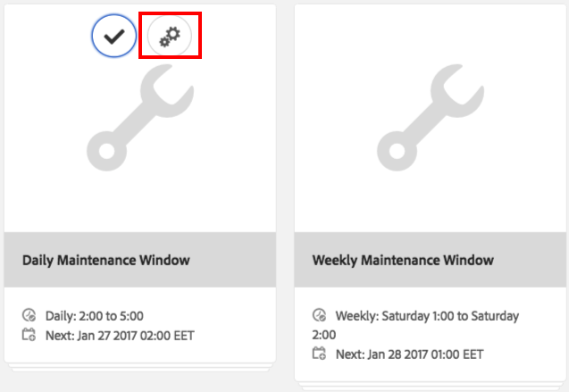
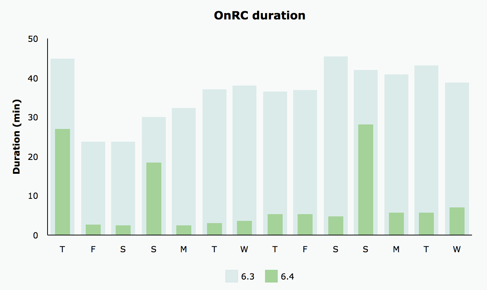

# Limpeza de revisão{#revision-cleanup}

## Introdução {#introduction}

Cada atualização no repositório cria uma nova revisão de conteúdo. Como resultado, a cada atualização o tamanho do repositório aumenta. Para evitar o crescimento descontrolado do repositório, as revisões antigas precisam ser removidas para liberar recursos de disco. Essa funcionalidade de manutenção é chamada de Limpeza de revisão. Ele está disponível como uma rotina offline desde o AEM 6.0.

Com o AEM 6.3 e superior, uma versão online dessa funcionalidade chamada Limpeza de revisão online foi introduzida. Comparada à Limpeza de revisão offline, em que a instância de AEM precisa ser desligada, a Limpeza de revisão online pode ser executada enquanto a instância de AEM está online. A Limpeza de revisão online está ativada por padrão e é a maneira recomendada de executar uma limpeza de revisão.

**Nota**: [Assista ao vídeo](https://helpx.adobe.com/experience-manager/kt/platform-repository/using/revision-cleanup-technical-video-use.html) para obter uma introdução e como usar a Limpeza de revisão online.

O processo de limpeza de revisão consiste em três fases: **estimativa**, **compactação** e **limpar**. A estimativa determina se a próxima fase (compactação) será executada ou não com base na quantidade de lixo que pode ser coletada. Durante a fase de compactação, os segmentos e arquivos tar são regravados, eliminando qualquer conteúdo não utilizado. A fase de limpeza remove posteriormente os segmentos antigos, incluindo qualquer lixo que eles possam conter. O modo offline geralmente pode recuperar mais espaço porque o modo online precisa levar em conta o conjunto de trabalho AEM, que impede que segmentos adicionais sejam coletados.

Para obter mais detalhes sobre a Limpeza de revisão, consulte os seguintes links:

* [Como executar a limpeza de revisão online](/help/sites-deploying/revision-cleanup.md#how-to-run-online-revision-cleanup)
* [Perguntas frequentes sobre limpeza de revisão online](/help/sites-deploying/revision-cleanup.md#online-revision-cleanup-frequently-asked-questions)
* [Como executar a limpeza de revisão offline](/help/sites-deploying/revision-cleanup.md#how-to-run-offline-revision-cleanup)

Além disso, você também pode ler a [documentação oficial do Oak.](https://jackrabbit.apache.org/oak/docs/nodestore/segment/overview.html)

### Quando usar a Limpeza de revisão online em vez da Limpeza de revisão offline? {#when-to-use-online-revision-cleanup-as-opposed-to-offline-revision-cleanup}

**A Limpeza de revisão online é a maneira recomendada de executar a limpeza de revisão.** A limpeza de revisão offline deve ser usada somente em uma base excepcional - por exemplo, antes de migrar para o novo formato de armazenamento ou se você for solicitado pelo Atendimento ao cliente do Adobe a fazê-lo.

## Como executar a limpeza de revisão online {#how-to-run-online-revision-cleanup}

A Limpeza de revisão online é configurada por padrão para ser executada automaticamente uma vez por dia nas instâncias de Autor e Publicação do AEM. Tudo o que você precisa fazer é definir a janela de manutenção durante um período com menos atividade do usuário. Você pode configurar a tarefa Limpeza de revisão on-line da seguinte maneira:

1. Na janela principal do AEM, acesse **Ferramentas - Operações - Painel - Manutenção** ou aponte seu navegador para: `https://serveraddress:serverport/libs/granite/operations/content/maintenance.html`

   

1. Focalizar **Janela de manutenção diária** e clique no link **Configurações** ícone.

   

1. Insira os valores desejados (recorrência, hora inicial, hora final) e clique em **Salvar**.

   

Como alternativa, se você quiser executar a tarefa de limpeza de revisão manualmente, é possível:

1. Ir para **Ferramentas - Operações - Painel - Manutenção** ou navegue diretamente para `https://serveraddress:serverport/libs/granite/operations/content/maintenance.html`
1. Clique em **Janela de manutenção diária**.
1. Passe o mouse sobre **Limpeza de revisão** ícone.
1. Clique em **Executar**.

   

### Execução de limpeza de revisão online após a limpeza de revisão offline {#running-online-revision-cleanup-after-offline-revision-cleanup}

O processo de limpeza de revisão recupera revisões antigas por gerações. Isso significa que cada vez que você executa a limpeza de revisão, uma nova geração é criada e mantida no disco. Há uma diferença, no entanto, entre os dois tipos de limpeza de revisão: a limpeza de revisão offline mantém uma geração, enquanto a limpeza de revisão online mantém duas gerações. Assim, ao executar a limpeza de revisão online **após** limpeza de revisão offline o seguinte acontece:

1. Após a primeira execução de limpeza de revisão online, o repositório terá o tamanho dobrado. Isso acontece porque agora há duas gerações que são mantidas no disco.
1. Durante as execuções subsequentes, o repositório crescerá temporariamente enquanto a nova geração é criada e, em seguida, se estabilizará de volta ao tamanho que tinha após a primeira execução, à medida que o processo de limpeza da revisão online recupera a geração anterior.

Além disso, lembre-se de que, dependendo do tipo e do número de confirmações, cada geração pode variar de tamanho em comparação à anterior, de modo que o tamanho final pode variar de uma execução para a outra.

Devido a esse fato, é recomendável dimensionar o disco pelo menos duas ou três vezes maior que o tamanho estimado do repositório inicialmente.

## Modos De Compactação Total E Final  {#full-and-tail-compaction-modes}

**AEM 6.5** introduz **dois novos modos** para o **compactação** fase do processo de Limpeza de revisão online:

* A variável **compactação completa** O modo substitui todos os segmentos e arquivos tar no repositório inteiro. A fase de limpeza subsequente pode remover a quantidade máxima de lixo no repositório. Como a compactação total afeta todo o repositório, ela requer uma quantidade considerável de recursos do sistema e tempo para ser concluída. A compactação completa corresponde à fase de compactação no AEM 6.3.
* A variável **compactação traseira** O modo substitui somente os segmentos e arquivos tar mais recentes no repositório. Os segmentos e arquivos tar mais recentes são aqueles que foram adicionados desde a última vez que a compactação completa ou traseira foi executada. A fase subsequente de limpeza só pode remover o lixo contido na parte recente do repositório. Como a compactação traseira afeta apenas uma parte do repositório, ela requer consideravelmente menos recursos do sistema e tempo para ser concluída do que a compactação completa.

Estes modos de compactação constituem um compromisso entre a eficiência e o consumo de recursos: embora a compactação traseira seja menos eficaz, ela também tem menos impacto no funcionamento normal do sistema. Por outro lado, a compactação total é mais eficaz, mas tem um impacto maior na operação normal do sistema.

O AEM 6.5 também introduz um mecanismo mais eficiente de desduplicação de conteúdo durante a compactação, o que reduz ainda mais o espaço em disco do repositório.

Os dois gráficos abaixo apresentam resultados de testes laboratoriais internos que ilustram a redução do tempo médio de execução e o impacto médio no disco do AEM 6.5 em comparação com o AEM 6.3:

 

### Como configurar a compactação completa e traseira {#how-to-configure-full-and-tail-compaction}

A configuração padrão executa a compactação traseira em dias da semana e a compactação completa aos domingos. A configuração padrão pode ser alterada usando o novo valor de configuração `full.gc.days` do `RevisionCleanupTask` [tarefa de manutenção](/help/sites-deploying/revision-cleanup.md#how-to-run-online-revision-cleanup).

Ao configurar o `full.gc.days` valor esteja ciente de que a compactação completa será executada durante o(s) dia(s) definido(s) no valor e a compactação traseira será executada durante os dias que não estiverem definidos no valor. Por exemplo, se você configurar a compactação total para ser executada no domingo, a compactação traseira será executada de segunda a sábado. Se, por exemplo, você configurar a compactação completa para ser executada todos os dias da semana, a compactação traseira não será executada.

Além disso, considere que:

* **Compactação da cauda** é menos eficaz e tem menos impacto nas operações normais do sistema. Assim, ele deve ser executado durante dias úteis.
* **Compactação completa** é mais eficaz, mas também tem um impacto maior nas operações normais do sistema. Por conseguinte, destina-se a ser utilizado fora dos dias úteis.
* A compactação traseira e a compactação completa devem ser agendadas para serem executadas fora do horário de pico.

### Resolução de problemas {#troubleshooting}

Ao usar os novos modos de compactação, lembre-se do seguinte:

* Você pode monitorar a atividade de entrada/saída (E/S), por exemplo: operações de E/S, CPU aguardando E/S, tamanho da fila de confirmação. Isso ajuda a determinar se o sistema está se tornando vinculado à E/S e requer upsizing.
* A variável `RevisionCleanupTaskHealthCheck` indica o status de integridade geral da Limpeza de revisão online. Funciona da mesma forma que no AEM 6.3 e não distingue entre compactação total e de cauda.
* As mensagens de log trazem informações relevantes sobre os modos de compactação. Por exemplo, quando a Limpeza de revisão online é iniciada, as mensagens de log correspondentes indicarão o modo de compactação. Além disso, em alguns casos de canto, o sistema reverterá para compactação completa quando for agendado para executar uma compactação traseira e as mensagens de log indicarão essa alteração. As amostras de log abaixo indicam o modo de compactação e a mudança da cauda para a compactação completa:

```
TarMK GC: running tail compaction
TarMK GC: no base state available, running full compaction instead
```

### Limitações conhecidas {#known-limitations}

Em alguns casos, a alternância entre os modos de cauda e compactação total atrasa o processo de limpeza. Mais precisamente, o repositório crescerá após uma compactação completa (ele dobrará de tamanho). O espaço extra será recuperado na compactação traseira subsequente, quando o repositório cair abaixo do tamanho de compactação pré-completo. As execuções de tarefas de manutenção paralelas também devem ser evitadas.

**É recomendável dimensionar o disco pelo menos duas ou três vezes maior que o tamanho estimado do repositório inicialmente.**

## Perguntas frequentes sobre limpeza de revisão online {#online-revision-cleanup-frequently-asked-questions}

### Considerações sobre a atualização do AEM 6.5 {#aem-upgrade-considerations}

<table style="table-layout:auto">
 <tbody>
  <tr>
   <td>Perguntas </td>
   <td>Respostas</td>
  </tr>
  <tr>
   <td>O que devo estar ciente ao atualizar para o AEM 6.5?</td>
   <td><p>O formato de persistência do TarMK será alterado com o AEM 6.5. Essas alterações não exigem uma etapa de migração proativa. Os repositórios existentes passarão por uma migração contínua, que é transparente para o usuário. O processo de migração é iniciado na primeira vez que o AEM 6.5 (ou ferramentas relacionadas) acessa o repositório.</p> <p><strong>Depois que a migração para o formato de persistência AEM 6.5 for iniciada, o repositório não poderá ser revertido para o formato de persistência AEM 6.3 anterior.</strong></p> </td>
  </tr>
 </tbody>
</table>

### Migração para o Oak Segment Tar {#migrating-to-oak-segment-tar}

<table style="table-layout:auto">
 <tbody>
  <tr>
   <td><strong>Perguntas</strong></td>
   <td><strong>Respostas</strong></td>
   <td> </td>
  </tr>
  <tr>
   <td><strong>Por que é necessário migrar o repositório?</strong></td>
   <td><p>No AEM 6.3, foram necessárias alterações no formato de armazenamento, especialmente para melhorar o desempenho e a eficácia da Limpeza de revisão on-line. Essas alterações não são compatíveis com versões anteriores e os repositórios criados com o segmento Oak antigo (AEM 6.2 e anterior) devem ser migrados.</p> <p>Benefícios adicionais da alteração do formato de armazenamento:</p>
    <ul>
     <li>Melhor escalabilidade (tamanho de segmento otimizado).</li>
     <li>Mais rápido <a href="/help/sites-administering/data-store-garbage-collection.md" target="_blank">Coleta de lixo do armazenamento de dados</a>.<br /> </li>
     <li>Trabalho de base para aprimoramentos futuros.</li>
    </ul> </td>
   <td> </td>
  </tr>
  <tr>
   <td><strong>O formato Tar anterior ainda é suportado?</strong></td>
   <td>Somente o novo Oak Segment Tar é compatível com AEM 6.3 ou superior.</td>
   <td> </td>
  </tr>
  <tr>
   <td><strong>A migração de conteúdo é sempre obrigatória?</strong></td>
   <td>Sim. A menos que você comece com uma nova instância, sempre será necessário migrar o conteúdo.</td>
   <td> </td>
  </tr>
  <tr>
   <td><strong>Posso atualizar para a versão 6.3 ou superior e fazer a migração posteriormente (por exemplo, usando outra janela de manutenção)?</strong></td>
   <td>Não, como explicado acima, a migração de conteúdo é obrigatória.</td>
   <td> </td>
  </tr>
  <tr>
   <td><strong>O tempo de inatividade pode ser evitado durante a migração?</strong></td>
   <td>Não. Esse é um esforço único que não pode ser feito em uma instância em execução.</td>
   <td> </td>
  </tr>
  <tr>
   <td><strong>O que acontece se eu executar acidentalmente no formato de repositório incorreto?</strong></td>
   <td>Se você tentar executar o módulo oak-segment em um repositório oak-segment-tar (ou vice-versa), a inicialização falhará com um <em>IllegalStateException</em> com a mensagem "Formato de segmento inválido". Não ocorrerá corrupção de dados.</td>
   <td> </td>
  </tr>
  <tr>
   <td><strong>Será necessário um reindexação dos índices de pesquisa?</strong></td>
   <td>Não. A migração de oak-segment para oak-segment-tar introduz alterações no formato do contêiner. Os dados contidos não são afetados e não serão modificados.</td>
   <td> </td>
  </tr>
  <tr>
   <td><strong>Como calcular melhor o espaço em disco necessário durante e após a migração?</strong></td>
   <td>A migração é equivalente a recriar o armazenamento de segmentos no novo formato. Isso pode ser usado para estimar o espaço adicional em disco necessário durante a migração. Após a migração, o armazenamento de segmentos antigo pode ser excluído para recuperar espaço.</td>
   <td> </td>
  </tr>
  <tr>
   <td><strong>Como estimar melhor a duração da migração?</strong></td>
   <td>O desempenho da migração pode ser muito melhor se <a href="/help/sites-deploying/revision-cleanup.md#how-to-run-offline-revision-cleanup">limpeza de revisão offline</a> O é executado antes da migração. Todos os clientes são aconselhados a executá-lo como um pré-requisito do processo de atualização. Em geral, a duração da migração deve ser semelhante à duração da tarefa de limpeza de revisão offline, supondo que a tarefa de limpeza de revisão offline tenha sido executada antes da migração.</td>
   <td> </td>
  </tr>
 </tbody>
</table>

### Executando a Limpeza de Revisão Online {#running-online-revision-cleanup}

<table style="table-layout:auto">
 <tbody>
  <tr>
   <td><strong>Perguntas</strong></td>
   <td><strong>Respostas</strong></td>
   <td> </td>
  </tr>
  <tr>
   <td><strong>Com que frequência a Limpeza de revisão online deve ser executada?</strong></td>
   <td>Uma vez ao dia. Essa é a configuração padrão no Painel de operações.</td>
   <td> </td>
  </tr>
  <tr>
   <td><strong>Como posso configurar a hora de início da tarefa de manutenção da Limpeza de revisão online?</strong></td>
   <td>Consulte a <a href="/help/sites-deploying/revision-cleanup.md#how-to-run-online-revision-cleanup">Como executar a Limpeza de revisão online</a> seção. </td>
   <td> </td>
  </tr>
  <tr>
   <td><strong>Há uma frequência máxima que não deve ser excedida para a Limpeza de revisão online?</strong></td>
   <td>É recomendável executar a Limpeza de revisão online uma vez por dia, conforme configurado por padrão.<br /> </td>
   <td> </td>
  </tr>
  <tr>
   <td><strong>Quais são os principais indicadores que determinam a frequência com que a Limpeza de revisão online deve ser executada?</strong></td>
   <td>Não há necessidade de determinar a frequência, pois a Limpeza de revisão online é configurada como uma tarefa de manutenção e é executada automaticamente todos os dias.</td>
   <td> </td>
  </tr>
  <tr>
   <td><strong>Por que a Limpeza de revisão online não recupera espaço quando executada pela primeira vez?</strong></td>
   <td>A Limpeza de revisão online recupera revisões antigas por gerações. Uma nova geração é gerada sempre que a limpeza de revisão é executada. Somente o conteúdo com pelo menos duas gerações será recuperado, o que significa que, em uma primeira execução, não há nada para ser recuperado.</td>
   <td> </td>
  </tr>
  <tr>
   <td><strong>Por que a primeira Limpeza de revisão online não recupera espaço quando executada após a Limpeza de revisão offline?</strong></td>
   <td><p>A Limpeza de revisão offline está recuperando tudo, exceto a geração mais recente, em comparação às duas gerações mais recentes da Limpeza de revisão online. No caso de um repositório novo, a Limpeza de revisão online não recuperará espaço quando executada pela primeira vez após a Limpeza de revisão offline, pois não há geração antiga o suficiente para ser recuperada.</p> <p>Além disso, leia a seção "Execução de limpeza de revisão online após a limpeza de revisão offline" do <a href="/help/sites-deploying/revision-cleanup.md#how-to-run-online-revision-cleanup">este capítulo</a>.</p> </td>
   <td> </td>
  </tr>
  <tr>
   <td><strong>O Author e o Publish normalmente têm diferentes janelas de Limpeza de Revisão Online?</strong></td>
   <td>Isso depende do horário comercial e dos padrões de tráfego da presença online do cliente. As janelas de manutenção devem ser configuradas fora dos tempos de produção principais para permitir a melhor eficiência de limpeza. Para várias instâncias de publicação do AEM (farm TarMK), as janelas de manutenção da Limpeza de revisão online devem ser escalonadas.</td>
   <td> </td>
  </tr>
  <tr>
   <td><strong>Há algum pré-requisito antes de executar a Limpeza de revisão on-line?</strong></td>
   <td><p>A Limpeza de revisão online está disponível somente com o AEM 6.3 e versões posteriores. Além disso, se você estiver usando uma versão mais antiga do AEM, será necessário migrar para o novo <a href="/help/sites-deploying/revision-cleanup.md#migrating-to-oak-segment-tar">Oak Segment Tar</a>.</p> </td>
   <td> </td>
  </tr>
  <tr>
   <td><strong>Quais são os fatores que determinam a duração da Limpeza de revisão online?</strong></td>
   <td>Os fatores são:<br />
    <ul>
     <li>Tamanho do repositório</li>
     <li>Carregar no sistema (solicitações por minuto, especificamente operações de gravação)</li>
     <li>Padrão de atividade (leituras versus gravações)</li>
     <li>Especificações de hardware (desempenho de CPU, memória, IOPS)</li>
    </ul> </td>
   <td> </td>
  </tr>
  <tr>
   <td><strong>Os autores ainda podem trabalhar enquanto a Limpeza de revisão online está em execução?</strong></td>
   <td>Sim, a Limpeza de revisão online pode lidar com gravações simultâneas. No entanto, a Limpeza de revisão on-line funciona de forma mais rápida e eficiente sem transações simultâneas de gravação. É recomendável agendar a tarefa de manutenção Limpeza de revisão online para um tempo relativamente silencioso, sem muito tráfego.</td>
   <td> </td>
  </tr>
  <tr>
   <td><strong>Quais são os requisitos mínimos de espaço em disco e memória heap ao executar a Limpeza de revisão online?</strong></td>
   <td><p>O espaço em disco é continuamente monitorado durante a Limpeza de revisão on-line. Se o espaço disponível em disco ficar abaixo de um valor crítico, o processo será cancelado. O valor crítico é 25% do espaço em disco atual do repositório e não é configurável.</p> <p><strong>É recomendável dimensionar o disco pelo menos duas ou três vezes maior que o tamanho estimado do repositório inicialmente.</strong></p> <p>O espaço livre em heap é continuamente monitorado durante o processo de limpeza. Se o espaço livre do heap cair abaixo de um valor crítico, o processo será cancelado. O valor crítico é configurado por meio de org.apache.jackrabbit.oak.segment.SegmentNodeStoreService#MEMORY_THRESHOLD. O valor padrão é 15%.</p> <p>O Recommendations para dimensionamento mínimo de heap de compactação não é separado das recomendações de dimensionamento de memória do AEM. Regra geral: <strong>Se uma instância de AEM tiver o tamanho suficiente para lidar com os casos de uso e a carga esperada, o processo de limpeza obterá memória suficiente.</strong></p> </td>
   <td> </td>
  </tr>
  <tr>
   <td><strong>Qual é o impacto de desempenho esperado ao executar a Limpeza de revisão online?</strong></td>
   <td>A Limpeza de revisão on-line é um processo em segundo plano que lê e grava no repositório simultaneamente em operações normais do sistema. Especificamente, ela pode precisar adquirir acesso exclusivo ao repositório por um curto período, impedindo que outros threads gravem no repositório.</td>
   <td> </td>
  </tr>
  <tr>
   <td><strong>Por quanto tempo se espera que a Limpeza de revisão online seja executada?</strong></td>
   <td>Não deve levar mais de 2 horas para ser executado de acordo com os testes de desempenho mais recentes que realizamos internamente.</td>
   <td> </td>
  </tr>
  <tr>
   <td><strong>O que deve ser feito se a Limpeza de revisão online demorar mais?</strong></td>
   <td>
    <ul>
     <li>Certifique-se de que ele seja executado diariamente.<br /> </li>
     <li>Certifique-se de que ele seja executado durante as atividades mínimas do repositório, configurando as janelas de manutenção no Painel de operações adequadamente.</li>
     <li>Aumente os recursos do sistema (CPU, memória, E/S).</li>
    </ul> </td>
   <td> </td>
  </tr>
  <tr>
   <td><strong>O que acontece se a Limpeza de revisão online exceder as Janelas de manutenção configuradas?</strong></td>
   <td>Verifique se outras tarefas de manutenção não estão atrasando sua execução. Isso pode ocorrer se mais tarefas de manutenção do que a Limpeza de revisão online forem executadas na mesma janela de manutenção. Observe que as tarefas de manutenção são executadas sequencialmente sem uma ordem configurável.</td>
   <td> </td>
  </tr>
  <tr>
   <td><strong>Por que a coleta de lixo de revisão é ignorada?</strong></td>
   <td><p>A Limpeza de revisão depende de uma fase de estimativa para decidir se há lixo suficiente para ser limpo. O avaliador compara o tamanho atual com o tamanho do repositório após a última compactação. Se o tamanho exceder o delta configurado, a limpeza será executada. O delta de tamanho é definido em 1 GB. Isso significa que, se o tamanho do repositório não aumentar em 1 GB desde a última execução de limpeza, a nova iteração de limpeza de revisão será ignorada. </p> <p>Abaixo estão as entradas de log relevantes para a fase de estimativa:</p>
    <ul>
     <li>O GC de revisão será executado: <em>O delta de tamanho é N% ou N/N (N/N bytes), portanto, executando a compactação</em></li>
     <li>O GC de revisão irá <strong>não</strong> executar: <em>O delta de tamanho é N% ou N/N (N/N bytes), então a compactação é ignorada por enquanto</em></li>
    </ul> </td>
   <td> </td>
  </tr>
  <tr>
   <td><strong>É possível abortar com segurança a compactação automática se o impacto no desempenho for muito alto?</strong></td>
   <td>Sim. Desde o AEM 6.3, ele pode ser interrompido com segurança pela janela Tarefa de manutenção no Painel de operações ou pelo JMX.</td>
   <td> </td>
  </tr>
  <tr>
   <td><strong>Se a instância do AEM for desligada durante uma tarefa de limpeza agendada, o processo será abortado com segurança ou o desligamento será bloqueado até que a compactação seja concluída?</strong></td>
   <td>A Limpeza de revisão será interrompida e o repositório será desligado com segurança.</td>
   <td> </td>
  </tr>
  <tr>
   <td><strong>O que acontece quando o sistema trava durante a Limpeza de revisão online?</strong></td>
   <td>Não há risco de corrupção de dados nesses casos. Os restos de lixo serão limpos por uma execução subsequente.</td>
   <td> </td>
  </tr>
  <tr>
   <td><strong>Qual é o impacto de não executar a Limpeza de revisão online?</strong></td>
   <td>Degradação do desempenho ao longo do tempo.</td>
   <td> </td>
  </tr>
  <tr>
   <td><strong>Quais revisões estão sendo coletadas?</strong></td>
   <td>Por padrão, a Limpeza de revisão online coleta apenas revisões que tenham pelo menos 24 horas.</td>
   <td> </td>
  </tr>
  <tr>
   <td><strong>O que acontece em caso de interferência excessiva de gravações simultâneas no repositório?</strong></td>
   <td><p>Se houver simultaneidade de gravação no sistema, a limpeza de revisão on-line poderá exigir acesso de gravação exclusivo para poder confirmar as alterações no final de um ciclo de compactação. O sistema entrará em <strong>modo forceCompact</strong>, tal como explicado mais pormenorizadamente na seção <a href="https://jackrabbit.apache.org/oak/docs/nodestore/segment/overview.html" target="_blank">documentação do oak</a>. Durante a compactação forçada, um bloqueio de gravação exclusivo é adquirido para finalmente confirmar as alterações sem nenhuma interferência de gravações simultâneas. Para limitar o impacto nos tempos de resposta, um valor de tempo limite pode ser definido. Esse valor é definido como 1 minuto por padrão, o que significa que se a opção de forçar a compactação não for concluída em 1 minuto, o processo de compactação será anulado em favor de confirmações simultâneas.</p> <p>A duração da força compacta depende dos seguintes fatores:</p>
    <ul>
     <li>hardware: especificamente IOPS. A duração diminui com mais IOPS.</li>
     <li>tamanho do armazenamento de segmentos: a duração aumenta de acordo com o tamanho do armazenamento de segmentos.</li>
    </ul> </td>
   <td> </td>
  </tr>
  <tr>
   <td><p><strong>Como a Limpeza de revisão on-line é executada em uma instância em standby?</strong></p> </td>
   <td><p>Em uma configuração de standby inativo, somente a instância principal precisa ser configurada para executar a Limpeza de revisão online. Na instância de standby, a Limpeza de revisão on-line não precisa ser programada especificamente.</p> <p>A operação correspondente em uma instância em espera é a Limpeza automática, que corresponde à fase de limpeza da Limpeza de revisão on-line. A Limpeza Automática é executada na instância stand-by após a execução da Limpeza de Revisão On-line na instância principal.</p> <p>As fases de estimativa e compactação não serão executadas em uma instância em espera.</p> </td>
   <td> </td>
  </tr>
  <tr>
   <td><strong>A Limpeza de revisão offline pode liberar mais espaço em disco do que a Limpeza de revisão online?</strong></td>
   <td><p>A Limpeza de revisão offline pode remover imediatamente revisões antigas, enquanto a Limpeza de revisão online precisa considerar as revisões antigas que ainda estão sendo referenciadas pela pilha do aplicativo. A primeira pode, assim, remover o lixo de forma mais agressiva do que a segunda, onde o efeito é amortizado ao longo de alguns ciclos de coleta de lixo.</p> <p>Além disso, leia a seção "Execução de limpeza de revisão online após a limpeza de revisão offline" do <a href="/help/sites-deploying/revision-cleanup.md#how-to-run-online-revision-cleanup">este capítulo</a>.</p> </td>
   <td> </td>
  </tr>
  <tr>
   <td>Alguma consideração sobre as operações de arquivos com mapeamento de memória?</td>
   <td>
    <ul>
     <li><strong>Em ambientes Windows</strong>, o acesso regular a arquivos é sempre aplicado, de modo que o acesso mapeado à memória não é usado. Como conselho geral, toda a RAM disponível deve ser alocada para o heap e o tamanho do segmentCache deve ser aumentado. Você aumenta o segmentCache adicionando a opção segmentCache.size à org.apache.jackrabbit.oak.segment.SegmentNodeStoreService.config (por exemplo, segmentCache.size=20480). Lembre-se de deixar de fora alguma RAM para o sistema operacional e outros processos.</li>
     <li><strong>Em ambientes não Windows</strong>, aumente o tamanho da memória física para melhorar o mapeamento da memória do repositório.</li>
    </ul> </td>
   <td>
    <ul>
     <li> </li>
    </ul> </td>
  </tr>
 </tbody>
</table>

### Monitorar limpeza de revisão online {#monitoring-online-revision-cleanup}

<table style="table-layout:auto">
 <tbody>
  <tr>
   <td><strong>O que precisa ser monitorado durante a Limpeza de revisão online?</strong></td>
   <td>
    <ul>
     <li>O espaço em disco deve ser monitorado quando a Limpeza de Revisão Online estiver habilitada. A limpeza não será executada ou será encerrada preventivamente quando não houver espaço em disco suficiente.</li>
     <li>Verifique os logs para a hora de conclusão da Limpeza de revisão online. Não deve levar mais de 2 horas.</li>
     <li>Número de pontos de verificação. Se houver mais de três pontos de verificação ao executar a compactação, será recomendável limpar os pontos de verificação.</li>
    </ul> </td>
   <td> </td>
  </tr>
  <tr>
   <td><strong>Como verificar se a Limpeza de revisão online foi concluída com êxito?</strong></td>
   <td><p>Você pode verificar se a Limpeza de revisão online foi concluída com êxito verificando os logs.</p> <p>Por exemplo, "<code>TarMK GC #{}: compaction completed in {} ({} ms), after {} cycles</code>" significa que a etapa de compactação foi concluída com êxito, a menos que precedida pela mensagem "<code>TarMK GC #{}: compaction gave up compacting concurrent commits after {} cycles</code>", o que significa que havia muita carga simultânea.</p> <p>Da mesma forma, há uma mensagem "<code>TarMK GC #{}: cleanup completed in {} ({} ms</code>" para a conclusão bem-sucedida da etapa de limpeza.</p> </td>
   <td><p> </p> </td>
  </tr>
  <tr>
   <td><strong>Onde podemos encontrar as estatísticas das últimas execuções de Limpeza de revisão online?</strong></td>
   <td><p>O status, o progresso e as estatísticas são expostos por meio de JMX (<code>SegmentRevisionGarbageCollection</code> MBean). Para obter mais detalhes sobre o <code>SegmentRevisionGarbageCollection</code> MBean, leia o <a href="https://jackrabbit.apache.org/oak/docs/nodestore/segment/overview.html#monitoring-via-jmx" target="_blank">parágrafo seguinte</a>.</p> <p>O progresso pode ser monitorado por meio das <code>EstimatedRevisionGCCompletion</code> atributo de <code>SegmentRevisionGarbageCollection MBean.</code></p> <p>Você pode obter uma referência do MBean usando o <code>ObjectName org.apache.jackrabbit.oak:name="Segment node store revision garbage collection",type="SegmentRevisionGarbageCollection"</code>.</p> <p>Observe que as estatísticas só estão disponíveis desde a última inicialização do sistema. As ferramentas de monitoramento externas podem ser aproveitadas para manter os dados além do tempo de atividade do AEM. Consulte <a href="/help/sites-administering/operations-dashboard.md#monitoring-with-nagios" target="_blank">a documentação do AEM para anexar verificações de integridade ao Nagios como exemplo para uma ferramenta de monitoramento externa</a>.</p> </td>
   <td> </td>
  </tr>
  <tr>
   <td><strong>Quais são as entradas de log relevantes?</strong></td>
   <td>
    <ul>
     <li>Limpeza de Revisão Online iniciada/interrompida
      <ul>
       <li>A Limpeza de revisão online é composta por três fases: estimativa, compactação e limpeza. A estimativa pode forçar a compactação e a limpeza a serem ignoradas se o repositório não contiver lixo suficiente. Na versão mais recente do AEM, a mensagem "<code>TarMK GC #{}: estimation started</code>" marca o início da estimativa, "<code>TarMK GC #{}: compaction started, strategy={}</code>" marca o início da compactação e "T<code>arMK GC #{}: cleanup started. Current repository size is {} ({} bytes</code>" marca o início da limpeza.</li>
      </ul> </li>
     <li>Espaço em disco obtido pela limpeza da revisão
      <ul>
       <li>O espaço é recuperado somente quando a fase de limpeza é concluída. A conclusão da fase de limpeza é marcada pela mensagem de registro "T<code>arMK GC #{}: cleanup completed in {} ({} ms</code>". O tamanho da limpeza da publicação é {} ({} bytes) e o espaço recuperado é {} ({} bytes). O peso/profundidade do mapa de compactação é {}/{} ({} bytes/{}).".</li>
      </ul> </li>
     <li>Ocorreu um problema durante a limpeza da revisão
      <ul>
       <li>Há muitas condições de falha, todas elas são marcadas por mensagens de log de AVISO ou ERRO iniciadas com "TarMK GC".</li>
      </ul> </li>
    </ul> <p>Além disso, consulte a <a href="/help/sites-deploying/revision-cleanup.md#troubleshooting-based-on-error-messages">Solução de problemas com base nas mensagens de erro</a> abaixo.</p> </td>
   <td> </td>
  </tr>
  <tr>
   <td><strong>Como verificar quanto espaço foi recuperado após a conclusão da Limpeza de revisão online?</strong></td>
   <td>Há uma mensagem no log no final do ciclo de limpeza: "<code>TarMK GC #3: cleanup completed</code>" que inclui o tamanho do repositório e a quantidade de lixo recuperado.</td>
   <td> </td>
  </tr>
  <tr>
   <td><strong>Como verificar a integridade do repositório após a conclusão da Limpeza de revisão online?</strong></td>
   <td><p>Uma verificação de integridade do repositório não é necessária após a Limpeza de revisão online. </p> <p>No entanto, você pode executar as seguintes ações para verificar o status do repositório após a limpeza:</p>
    <ul>
     <li>Um repositório <a href="/help/sites-deploying/consistency-check.md" target="_blank">verificação de percurso</a></li>
     <li>Use a ferramenta oak-run após a conclusão do processo de limpeza para verificar se há inconsistências. Para obter mais informações sobre como fazer isso, verifique a <a href="https://github.com/apache/jackrabbit-oak/blob/trunk/oak-doc/src/site/markdown/nodestore/segment/overview.md#check" target="_blank">Documentação do Apache.</a> Não é necessário desligar o AEM para executar a ferramenta.</li>
    </ul> </td>
   <td> </td>
  </tr>
  <tr>
   <td><strong>Como detectar se a Limpeza de revisão online falhou e quais são as etapas a serem recuperadas?</strong></td>
   <td>As condições de falha são marcadas por mensagens de log de AVISO ou ERRO começando com "TarMK GC". Além disso, consulte a <a href="/help/sites-deploying/revision-cleanup.md#troubleshooting-based-on-error-messages">Solução de problemas com base nas mensagens de erro</a> abaixo.</td>
   <td> </td>
  </tr>
  <tr>
   <td><strong>Quais informações são expostas na Verificação de integridade da Limpeza de revisão? Como e quando eles contribuem para os níveis de status codificados por cores? </strong></td>
   <td><p>A Verificação de integridade da limpeza da revisão faz parte da <a href="/help/sites-administering/operations-dashboard.md#health-reports" target="_blank">Painel de operações</a>.<br /> </p> <p>O status será <strong>VERDE</strong> se a última execução da tarefa de manutenção Limpeza de revisão online foi concluída com êxito.</p> <p>Será <strong>AMARELO</strong> se a tarefa de manutenção Limpeza de revisão online foi cancelada uma vez.<br /> </p> <p>Será <strong>VERM</strong> se a tarefa de manutenção Limpeza de revisão online foi cancelada três vezes seguidas. <strong>Nesse caso, é necessária a interação manual</strong> ou a Limpeza de revisão on-line provavelmente falhará novamente. Para obter mais informações, leia a <a href="/help/sites-deploying/revision-cleanup.md#troubleshooting-online-revision-cleanup">Solução de problemas</a> abaixo.<br /> </p> <p>Observe também que o status da Verificação de integridade será redefinido após a reinicialização do sistema. Portanto, uma instância recém-reiniciada mostrará um status verde na Verificação de integridade da limpeza de revisão. As ferramentas de monitoramento externas podem ser aproveitadas para manter os dados além do tempo de atividade do AEM. Consulte <a href="/help/sites-administering/operations-dashboard.md#monitoring-with-nagios">a documentação do AEM para anexar verificações de integridade ao Nagios como exemplo para uma ferramenta de monitoramento externa</a>.</p> </td>
   <td> </td>
  </tr>
  <tr>
   <td><p><strong>Como monitorar a Limpeza automática em uma instância em espera?</strong></p> </td>
   <td><p>O status, o progresso e as estatísticas são expostos por meio do JMX usando o <code>SegmentRevisionGarbageCollection</code> MBean. Consulte também o seguinte <a href="https://jackrabbit.apache.org/oak/docs/nodestore/segment/overview.html#monitoring-via-jmx" target="_blank">Documentação do Oak</a>. </p> <p>Você pode obter uma referência do MBean usando o <code>ObjectName org.apache.jackrabbit.oak:name="Segment node store revision garbage collection",type="SegmentRevisionGarbageCollection"</code>.</p> <p>Observe que as estatísticas estão disponíveis somente desde a última inicialização do sistema. As ferramentas de monitoramento externas podem ser aproveitadas para manter os dados além do tempo de atividade do AEM. Além disso, consulte <a href="/help/sites-administering/operations-dashboard.md#monitoring-with-nagios" target="_blank">a documentação do AEM para anexar verificações de integridade ao Nagios como exemplo para uma ferramenta de monitoramento externa</a>.</p> <p>Os arquivos de log também podem ser usados para verificar o status, o progresso e as estatísticas da Limpeza automática.</p> </td>
   <td> </td>
  </tr>
  <tr>
   <td><p><strong>O que precisa ser monitorado durante a Limpeza Automática em uma instância em espera?</strong></p> </td>
   <td>
    <ul>
     <li>O espaço em disco deve ser monitorado quando a Limpeza Automática for executada.</li>
     <li>Tempo de conclusão (por meio dos logs) para garantir que 2 horas não sejam excedidas.</li>
     <li>Tamanho do armazenamento de segmentos após a execução da Limpeza automática. O tamanho do armazenamento de segmentos na instância em standby deve ser aproximadamente o mesmo que o da instância primária.</li>
    </ul> </td>
   <td> </td>
  </tr>
 </tbody>
</table>

### Solução de problemas de limpeza de revisão online {#troubleshooting-online-revision-cleanup}

<table style="table-layout:auto">
 <tbody>
  <tr>
   <td><strong>O que é o pior que pode acontecer se você não executar a Limpeza de revisão online?</strong></td>
   <td>A instância do AEM ficará sem espaço em disco, o que causará paralisações na produção.</td>
   <td> </td>
  </tr>
  <tr>
   <td><strong>O alto tráfego de usuário é problemático para executar a Limpeza de revisão online em uma instância de publicação?</strong></td>
   <td>O alto tráfego de usuários afeta se a fase de compactação pode ser concluída com sucesso ou não.<br /> </td>
   <td> </td>
  </tr>
  <tr>
   <td><strong>De acordo com a Verificação de integridade e as entradas de log, a Limpeza de revisão online não foi concluída com êxito três vezes seguidas. O que é necessário para que a Limpeza de revisão online seja concluída com êxito?</strong></td>
   <td>Você pode executar várias etapas para encontrar e corrigir o problema:<br />
    <ul>
     <li>Primeiro, verifique as entradas do log<br /> </li>
     <li>Dependendo das informações nos logs, tome as medidas apropriadas:
      <ul>
       <li>Se os registros mostrarem cinco ciclos compactos perdidos e um tempo limite no <code>forceCompact</code> ciclo, agendar a janela de manutenção para um tempo de silêncio quando a quantidade de gravações no repositório for baixa. Você pode verificar as gravações do repositório na ferramenta de monitoramento de métricas do repositório, localizada em <em>https://serveraddress:serverport/libs/granite/operations/content/monitoring/page.html</em></li>
       <li>Se a limpeza for interrompida ao final da janela de manutenção, verifique se a configuração da janela de manutenção na interface do usuário Tarefas de manutenção é grande o suficiente</li>
       <li>Se a memória heap disponível não for suficiente, verifique se a instância tem memória suficiente.</li>
       <li>No caso de uma reação tardia, o armazenamento de segmentos pode crescer demais para que a Limpeza de revisão online seja concluída mesmo em uma janela de manutenção mais longa. Por exemplo, se não houve uma Limpeza de revisão online bem-sucedida concluída na última semana, é recomendável planejar uma manutenção offline e executar a Limpeza de revisão offline para trazer o armazenamento de segmentos de volta a um tamanho gerenciável.</li>
      </ul> </li>
    </ul> </td>
   <td> </td>
  </tr>
  <tr>
   <td><strong>O que precisa ser feito depois que o alerta de Verificação de integridade estiver ativado?</strong></td>
   <td>Cf. ponto anterior.</td>
   <td> </td>
  </tr>
  <tr>
   <td><strong>O que acontece se a Limpeza de revisão online ficar sem tempo durante a janela de manutenção programada?</strong></td>
   <td>A Limpeza de revisão online será cancelada e as sobras serão removidas. Ele será iniciado novamente na próxima vez que a janela de manutenção for programada.</td>
   <td> </td>
  </tr>
  <tr>
   <td><strong>O que está causando <code>SegmentNotFoundException</code> instâncias a serem registradas na <code>error.log</code> e como posso me recuperar?</strong></td>
   <td><p>A <code>SegmentNotFoundException</code> é registrado pelo TarMK quando ele tenta acessar uma unidade de armazenamento (um segmento) que não consegue encontrar. Há três cenários que podem causar esse problema:</p>
    <ol>
     <li>Um aplicativo que contorna os mecanismos de acesso recomendados (como Sling e a API JCR) e usa uma API/SPI de nível inferior para acessar o repositório e, em seguida, excede o tempo de retenção de um segmento. Ou seja, ela mantém uma referência a uma entidade por mais tempo do que o tempo de retenção permitido pela Limpeza de revisão online (24 horas por padrão). Esse caso é transitório e não causa corrupção de dados. Para recuperar, a ferramenta oak-run deve ser usada para confirmar a natureza transitória da exceção (a verificação oak-run não deve relatar erros). Para fazer isso, a instância precisa ser colocada offline e reiniciada posteriormente.</li>
     <li>Um evento externo causou a corrupção dos dados no disco. Isso pode ser uma falha de disco, falta de espaço em disco ou uma modificação acidental dos arquivos de dados necessários. Nesse caso, a instância precisa ser colocada offline e reparada usando a verificação oak-run. Para obter mais detalhes sobre como executar a verificação oak-run, leia o seguinte <a href="https://github.com/apache/jackrabbit-oak/blob/trunk/oak-doc/src/site/markdown/nodestore/segment/overview.md#check" target="_blank">Documentação do Apache</a>.</li>
     <li>Todas as outras ocorrências devem ser abordadas através do <a href="https://helpx.adobe.com/br/marketing-cloud/contact-support.html" target="_blank">Atendimento ao cliente Adobe</a>.</li>
    </ol> </td>
   <td> </td>
  </tr>
 </tbody>
</table>

### Solução De Problemas Baseada Em Mensagens De Erro {#troubleshooting-based-on-error-messages}

O error.log será detalhado se houver incidentes durante o processo de limpeza de revisão online. A matriz a seguir tem como objetivo explicar as mensagens mais comuns e fornecer possíveis soluções:

<!---| **Phase** |**Log Messages** |**Explanation** |**Next Steps** |
|---|---|---|---|
|   |  |  |  |
| Estimation |TarMK GC #2: estimation skipped because compaction is paused |The estimation phase is skipped when compaction is disabled on the system by configuration. |Enable Online Revision Cleanup. |
|   |TarMK GC #2: estimation interrupted: ${REASON}. Skipping compaction. |The estimation phase terminated prematurely. Some examples of events that could interrupt the estimation phase: not enough memory or disk space on the host system. |Depends on the given reason. |
| Compaction |TarMK GC #2: compaction paused |As long as the compaction phase is paused by configuration, neither the estimation phase nor the compaction phase will be executed. |Enable online revision cleanup. |
|   |TarMK GC #2: compaction cancelled: ${REASON}. |The compaction phase terminated prematurely. Some examples of events that could interrupt the compaction phase: not enough memory or disk space on the host system. Moreover, compaction can also be cancelled by shutting down the system or by explicitly cancelling it via administrative interfaces such as the Maintenance Window within the Operations Dashobard. |Depends on the given reason. |
|   |TarMK GC #2: compaction failed in 32.902 min (1974140 ms), after 5 cycles |This message doesn’t mean that there was an unrecoverable error, but only that compaction was terminated after a certain amount of attempts. Also, read the [following paragraph](https://jackrabbit.apache.org/oak/docs/nodestore/segment/overview.html#how-does-compaction-works-with-concurrent-writes). |Read the following [Oak documentation](https://jackrabbit.apache.org/oak/docs/nodestore/segment/overview.html#how-does-compaction-works-with-concurrent-writes), and the last question of the [Running Online Revision Cleanup](/help/sites-deploying/revision-cleanup.md#running-online-revision-cleanup) section. |
| Cleanup |TarMK GC #2: cleanup interrupted |Cleanup has been cancelled by shutting down the repository. No impact on consistency is expected. Also, disk space is most likely not reclaimed to full extent. It will be reclaimed during next revision cleanup cycle. |Investigate why repository has been shut down and going forward try to avoid shutting down the repository during maintenance windows. |-->

<table style="table-layout:auto">
 <tbody>
  <tr>
    <th>Fase</th>
    <th>Mensagens de registro</th>
    <th>Explicação</th>
    <th>Próximas etapas</th>
  </tr>  
  <tr>
    <td>Estimativa</td>
    <td>TarMK GC #2: estimativa ignorada porque a compactação está pausada.</td>
    <td>A fase de estimativa é ignorada quando a compactação é desabilitada no sistema pela configuração.</td>
    <td>Ative a Limpeza de revisão online.</td>
  </td>
  </tr>
  <tr>
    <td>N/A</td>
    <td>TarMK GC #2: estimativa interrompida: ${REASON}. Ignorando compactação.</td>
    <td>A fase de estimativa terminou prematuramente. Alguns exemplos de eventos que podem interromper a fase de estimativa: memória ou espaço em disco insuficiente no sistema host.</td>
    <td>Depende do motivo fornecido.</td>
  </td>
  </tr>
  <tr>
    <td>Compactação</td>
    <td>TarMK GC #2: compactação pausada.</td>
    <td>Desde que a fase de compactação seja pausada pela configuração, nem a fase de estimativa nem a fase de compactação serão executadas.</td>
    <td>Habilitar limpeza de revisão online.</td>
  </td>
  </tr>
   <tr>
    <td>N/A</td>
    <td>TarMK GC #2: compactação cancelada: ${REASON}.</td>
    <td>A fase de compactação terminou prematuramente. Alguns exemplos de eventos que podem interromper a fase de compactação: memória ou espaço em disco insuficiente no sistema host. Além disso, a compactação também pode ser cancelada desligando o sistema ou cancelando-o explicitamente por meio de interfaces administrativas, como a Janela de manutenção no Painel de operações.</td>
    <td>Depende do motivo fornecido.</td>
  </td>
  </tr>
  <tr>
    <td>N/A</td>
    <td>TarMK GC #2: a compactação falhou em 32.902 min (1974140 ms), após 5 ciclos.</td>
    <td>Essa mensagem não significa que houve um erro irrecuperável, mas somente que a compactação foi encerrada após uma certa quantidade de tentativas. Além disso, leia o <a href="https://jackrabbit.apache.org/oak/docs/nodestore/segment/overview.html#how-does-compaction-works-with-concurrent-writes">parágrafo seguinte.</a></td>
    <td>Leia o seguinte <a href="https://jackrabbit.apache.org/oak/docs/nodestore/segment/overview.html#how-does-compaction-works-with-concurrent-writes">Documentação do Oak</a>, e a última pergunta da seção Execução de limpeza de revisão online.</a></td>
  </td>
  </tr>
  <tr>
    <td>Limpar</td>
    <td>TarMK GC #2: limpeza interrompida.</td>
    <td>A limpeza foi cancelada ao desligar o repositório. Não é esperado nenhum impacto na consistência. Além disso, é provável que o espaço em disco não seja recuperado em toda a extensão. Ele será recuperado durante o próximo ciclo de limpeza de revisão.</td>
    <td>Investigue por que o repositório foi encerrado e tente evitar o seu encerramento durante as janelas de manutenção.</td>
  </td>
  </tr>
  </tbody>
</table>

## Como executar a limpeza de revisão offline {#how-to-run-offline-revision-cleanup}

>[!CAUTION]
>
>Use uma versão da ferramenta Oak-run que tenha um número de versão (principal e secundária) que corresponda à versão principal Oak da instalação do AEM. Por exemplo, se a instância do AEM tiver a versão principal do Oak 1.22.x, você deverá usar a versão mais recente da ferramenta Oak-run 1.22.x.

O Adobe fornece uma ferramenta chamada **Oak-run** para executar a limpeza de revisão. Ele pode ser baixado no seguinte local:

[https://repo1.maven.org/maven2/org/apache/jackrabbit/oak-run/](https://repo1.maven.org/maven2/org/apache/jackrabbit/oak-run/)

A ferramenta é um jar executável que pode ser executado manualmente para compactar o repositório. O processo é chamado de limpeza de revisão offline porque o repositório precisa ser desligado para executar a ferramenta corretamente. Certifique-se de planejar a limpeza de acordo com a janela de manutenção.

Para obter dicas sobre como aumentar o desempenho do processo de limpeza, consulte [Aumentar o desempenho da limpeza de revisão offline](/help/sites-deploying/revision-cleanup.md#increasing-the-performance-of-offline-revision-cleanup).

>[!NOTE]
>
>Você também pode limpar pontos de verificação antigos antes da manutenção ocorrer (etapas 2 e 3 no procedimento abaixo). Isso é recomendado somente para instâncias com mais de 100 pontos de verificação.

1. Verifique sempre se você tem um backup recente da instância do AEM.

   Desligue o AEM.

1. (Opcional) Use a ferramenta para localizar pontos de verificação antigos:

   ```xml
   java -jar oak-run.jar checkpoints install-folder/crx-quickstart/repository/segmentstore
   ```

1. (Opcional) Em seguida, exclua os pontos de verificação não referenciados:

   ```xml
   java -jar oak-run.jar checkpoints install-folder/crx-quickstart/repository/segmentstore rm-unreferenced
   ```

1. Execute a compactação e aguarde até que ela seja concluída:

   ```xml
   java -jar -Dsun.arch.data.model=32 oak-run.jar compact install-folder/crx-quickstart/repository/segmentstore
   ```

### Aumentar o desempenho da limpeza de revisão offline {#increasing-the-performance-of-offline-revision-cleanup}

A ferramenta oak-run apresenta vários recursos que visam aumentar o desempenho do processo de limpeza de revisão e minimizar a janela de manutenção o máximo possível.

A lista inclui vários parâmetros de linha de comando, conforme descrito abaixo:

* **-mmap.** Você pode definir isso como verdadeiro ou falso. Se definido como verdadeiro, o acesso com mapeamento de memória será usado. Se definido como falso, o acesso a arquivos será usado. Se não especificado, o acesso mapeado à memória é usado em sistemas de 64 bits e o acesso a arquivos é usado em sistemas de 32 bits. No Windows, o acesso regular a arquivos é sempre aplicado e essa opção é ignorada. **Esse parâmetro substituiu o parâmetro -Dtar.memoryMapped.**

* **-Dupdate.limit**. Define o limite para a liberação de uma transação temporária para o disco. O valor padrão é 10000.

* **-Dcompress-interval**. Número de entradas do mapa de compactação a serem mantidas até a compactação do mapa atual. O padrão é 1000000. Você deve aumentar esse valor para um número ainda maior para um rendimento mais rápido, se houver memória heap suficiente disponível. **Este parâmetro foi removido na versão 1.6 do Oak e não tem efeito.**

* **-Dcompaction-progress-log**. O número de nós compactados que serão registrados em log. O valor padrão é 150000, o que significa que os primeiros 150000 nós compactados serão registrados durante a operação. Use isso em conjunto com o próximo parâmetro documentado abaixo.

* **-Dtar.PersistCompactionMap** Defina esse parâmetro como true para usar espaço em disco em vez de memória heap para persistência do mapa de compactação. Requer a ferramenta oak-run **versões 1.4** e superior. Para mais pormenores, ver a questão 3 do [Perguntas frequentes sobre limpeza de revisão offline](/help/sites-deploying/revision-cleanup.md#offline-revision-cleanup-frequently-asked-questions) seção. **Este parâmetro foi removido na versão 1.6 do Oak e não tem efeito.**

* **— force.** Forçar compactação e ignorar uma versão não correspondente do armazenamento de segmentos.

>[!CAUTION]
>
>Usar o `--force` O parâmetro atualizará o armazenamento de segmentos para a versão mais recente, que é incompatível com as versões mais antigas do Oak. Além disso, considere que nenhum downgrade é possível. Como regra geral, você deve usar esses parâmetros com cuidado e somente se tiver conhecimento sobre como usá-los.

Um exemplo dos parâmetros em uso:

```xml
java -Dupdate.limit=10000 -Dcompaction-progress-log=150000 -Dlogback.configurationFile=logback.xml -Xmx8g -jar oak-run-*.jar checkpoints <repository>
```

### Métodos adicionais de acionamento da limpeza de revisão {#additional-methods-of-triggering-revision-cleanup}

Além dos métodos apresentados acima, você também pode acionar o mecanismo de limpeza de revisão usando o console JMX da seguinte maneira:

1. Abra o console JMX acessando [http://localhost:4502/system/console/jmx](http://localhost:4502/system/console/jmx)
1. Clique em **RevisionGarbageCollection** MBean.
1. Na próxima janela, clique em **startRevisionGC()** e depois **Chamar** para iniciar o trabalho de Coleta de Lixo de Revisão.

### Perguntas frequentes sobre limpeza de revisão offline {#offline-revision-cleanup-frequently-asked-questions}

<table style="table-layout:auto">
 <tbody>
  <tr>
   <td><strong>Quais são os fatores que determinam a duração da Limpeza de revisão offline?</strong></td>
   <td><p>O tamanho do repositório e a quantidade de revisões que precisam ser limpas determinam a duração da limpeza.</p> </td>
  </tr>
  <tr>
   <td><strong>Qual é a diferença entre uma revisão e uma versão de página?</strong></td>
   <td>
    <ul>
     <li><strong>Revisão do Oak:</strong> O Oak organiza todo o conteúdo em uma grande hierarquia de árvore que consiste em nós e propriedades. Cada instantâneo ou revisão desta árvore de conteúdo é imutável, e as alterações na árvore são expressas como uma sequência de novas revisões. Normalmente, cada modificação de conteúdo aciona uma nova revisão. Consulte também <a href="https://jackrabbit.apache.org/dev/ngp.html" target="_blank"> Seguir link</a>.</li>
     <li><strong>Versão da página:</strong> O controle de versão cria um "instantâneo" de uma página em um momento específico. Normalmente, uma nova versão é criada quando uma página é ativada. Para obter mais informações, consulte <a href="/help/sites-authoring/working-with-page-versions.md" target="_blank">Trabalhar com versões de páginas</a>.</li>
    </ul> </td>
  </tr>
  <tr>
   <td><strong>Como acelerar a tarefa de Limpeza de revisão offline se ela não for concluída em 8 horas?</strong></td>
   <td>Se a tarefa de revisão não for concluída em 8 horas e o <a href="/help/sites-administering/operations-dashboard.md#diagnosis-tools" target="_blank">despejos de encadeamento</a> revelar que o ponto de conexão principal é <code>InMemoryCompactionMap.findEntry</code>, use o seguinte parâmetro com a ferramenta oak-run <strong>versões 1.4 </strong>ou superior: <code>-Dtar.PersistCompactionMap=true</code>. Esteja ciente de <code>-Dtar.PersistCompactionMap</code> O parâmetro do foi removido na versão 1.6 do Oak.</td>
  </tr>
 </tbody>
</table>
