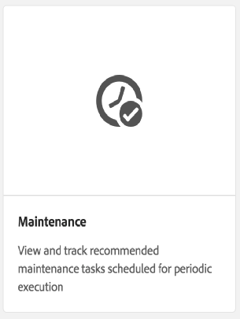

# Limpeza de revisão{#revision-cleanup}

## Introdução {#introduction}

Cada atualização no repositório cria uma nova revisão de conteúdo. Como resultado, a cada atualização o tamanho do repositório aumenta. Para evitar o crescimento descontrolado do repositório, é necessário limpar revisões antigas para liberar recursos de disco. Esta funcionalidade de manutenção é chamada de Limpeza de revisão. Ele está disponível como uma rotina offline desde AEM 6.0.

Com o AEM 6.3 foi introduzida uma versão on-line dessa funcionalidade chamada Online Revision Cleanup. Em comparação com a Limpeza de revisão offline, onde a instância AEM precisa ser desligada, a Limpeza de revisão online pode ser executada enquanto a instância AEM estiver online. A Limpeza de revisão online está ativada por padrão e é a maneira recomendada de executar uma limpeza de revisão.

**Observação**:  [Consulte o ](https://helpx.adobe.com/experience-manager/kt/platform-repository/using/revision-cleanup-technical-video-use.html) Vídeo para obter uma introdução e como usar a Limpeza de revisão online.

O processo de limpeza da revisão consiste em três fases: **estimated**, **compaction** e **limpeza**. A estimativa determina se a próxima fase (compactação) deve ser executada ou não com base na quantidade de lixo que pode ser coletada. Durante a fase de compactação, os segmentos e arquivos tar são regravados, excluindo qualquer conteúdo não utilizado. A fase de limpeza remove subsequentemente os segmentos antigos, incluindo qualquer lixo que eles possam conter. O modo offline geralmente pode recuperar mais espaço porque o modo online precisa levar em conta AEM conjunto de trabalho que retém a coleta de segmentos adicionais.

Para obter mais detalhes sobre a Limpeza de revisão, consulte os seguintes links:

* [Como executar a limpeza de revisão online](/help/sites-deploying/revision-cleanup.md#how-to-run-online-revision-cleanup)
* [Perguntas frequentes sobre a limpeza de revisão online](/help/sites-deploying/revision-cleanup.md#online-revision-cleanup-frequently-asked-questions)
* [Como executar a limpeza de revisão offline](/help/sites-deploying/revision-cleanup.md#how-to-run-offline-revision-cleanup)

Além disso, você também pode ler a documentação do [Oak oficial.](https://jackrabbit.apache.org/oak/docs/nodestore/segment/overview.html)

### Quando usar a Limpeza de revisão online em vez da Limpeza de revisão offline? {#when-to-use-online-revision-cleanup-as-opposed-to-offline-revision-cleanup}

**A Limpeza de revisão on-line é a maneira recomendada de realizar a limpeza de revisão.** A limpeza de revisão offline deve ser usada somente em uma base excepcional - por exemplo, antes de migrar para o novo formato de armazenamento ou se o Atendimento ao cliente da Adobe solicitar que você faça isso.

## Como executar a limpeza de revisão online {#how-to-run-online-revision-cleanup}

A Limpeza de revisão online é configurada por padrão para ser executada automaticamente uma vez por dia nas instâncias de autor e publicação do AEM. Tudo o que você precisa fazer é definir a janela de manutenção durante um período com a menor atividade do usuário. Você pode configurar a tarefa de Limpeza de revisão online da seguinte maneira:

1. Na janela principal do AEM, vá para **Ferramentas - Operações - Painel - Manutenção** ou aponte o navegador para: `https://serveraddress:serverport/libs/granite/operations/content/maintenance.html`

   

1. Passe o mouse sobre **Janela de manutenção diária** e clique no ícone **Configurações**.

   

1. Insira os valores desejados (recorrência, hora do start, hora de término) e clique em **Salvar**.

   

Como alternativa, se quiser executar a tarefa de limpeza de revisão manualmente, você pode:

1. Vá para **Ferramentas - Operações - Painel - Manutenção** ou navegue diretamente para `https://serveraddress:serverport/libs/granite/operations/content/maintenance.html`
1. Clique na **Janela de manutenção diária**.
1. Passe o mouse sobre o ícone **Limpeza de revisão**.
1. Clique em **Executar**.

   

### Executando a Limpeza de Revisão On-line Após a Limpeza de Revisão Off-line {#running-online-revision-cleanup-after-offline-revision-cleanup}

O processo de limpeza da revisão recupera revisões antigas por gerações. Isso significa que cada vez que você executa a limpeza de revisão, uma nova geração é criada e mantida no disco. Entretanto, há uma diferença entre os dois tipos de limpeza de revisão: a limpeza de revisão offline mantém uma geração enquanto a limpeza de revisão online mantém duas gerações. Portanto, quando você executa a limpeza de revisão on-line **depois** da limpeza de revisão off-line, acontece o seguinte:

1. Após a primeira limpeza de revisão on-line, o repositório será duplo. Isso acontece porque agora há duas gerações que ficam em disco.
1. Durante as execuções subsequentes, o repositório crescerá temporariamente enquanto a nova geração for criada e estabilizará de volta ao tamanho que teve após a primeira execução, à medida que o processo de limpeza de revisão online recupera a geração anterior.

Além disso, lembre-se de que, dependendo do tipo e do número de confirmações, cada geração pode variar de tamanho em relação à anterior, de modo que o tamanho final pode variar de uma execução para outra.

Devido a esse fato, é recomendável dimensionar o disco pelo menos duas ou três vezes maior que o tamanho do repositório inicialmente estimado.

## Modos de compactação completos e de cauda {#full-and-tail-compaction-modes}

**AEM 6.5** apresenta  **dois novos** modelos para a fase de  **** compactação do processo de Limpeza de revisão online:

* O modo **compactação completa** regrava todos os segmentos e arquivos tar em todo o repositório. A fase de limpeza subsequente pode, assim, remover a quantidade máxima de lixo no repositório. Como a compactação completa afeta todo o repositório, ela requer uma quantidade considerável de recursos e tempo para ser concluída. A compactação completa corresponde à fase de compactação no AEM 6.3.
* O modo de compactação **tail** regrava apenas os segmentos e arquivos tar mais recentes no repositório. Os segmentos e arquivos tar mais recentes são os que foram adicionados desde a última vez que a compactação completa ou secundária foi executada. A fase de limpeza subsequente só pode, portanto, remover o lixo contido na parte recente do repositório. Como a compactação de cauda afeta apenas uma parte do repositório, ela requer consideravelmente menos recursos e tempo de conclusão do sistema do que a compactação completa.

Estes modos de compactação constituem uma compensação entre eficiência e consumo de recursos: embora a compactação da cauda seja menos eficaz, também tem menos impacto no funcionamento normal do sistema. Em contraste, a compactação completa é mais eficaz, mas tem um impacto maior no funcionamento normal do sistema.

AEM 6.5 também introduz um mecanismo desduplicação-duplicado de conteúdo mais eficiente durante a compactação, o que reduz ainda mais a área de ocupação do repositório no disco.

Os dois gráficos a seguir apresentam resultados de testes laboratoriais internos que ilustram a redução do tempo médio de execução e da pegada média no disco no AEM 6.5 em comparação com o AEM 6.3:

 

### Como configurar a compactação completa e final {#how-to-configure-full-and-tail-compaction}

A configuração padrão executa compactação de cauda em dias da semana e compactação completa aos domingos. A configuração padrão pode ser alterada usando o novo valor de configuração `full.gc.days` da `RevisionCleanupTask` [tarefa de manutenção](/help/sites-deploying/revision-cleanup.md#how-to-run-online-revision-cleanup).

Ao configurar o valor `full.gc.days`, lembre-se de que a compactação completa será executada durante o(s) dia(s) definido(s) na compactação do valor e da cauda durante os dias que não estão definidos no valor. Por exemplo, se você configurar a compactação completa para ser executada no domingo, a compactação de rabo será executada de segunda a sábado. Por exemplo, se você configurar a compactação completa para ser executada todos os dias da semana, a compactação de cauda não será executada.

Além disso, tenha em consideração que:

* **A** compactação de cauda é menos eficaz e tem menos impacto nas operações normais do sistema. Pretende - se, assim, que a sua duração seja de dias úteis.
* **A** compactação completa é mais eficaz, mas tem também um impacto maior nas operações normais do sistema. Pretende - se, assim, ser utilizado fora dos dias úteis.
* A compactação da cauda e a compactação completa devem ser executadas durante as horas fora do pico.

### Resolução de problemas {#troubleshooting}

Ao usar os novos modos de compactação, lembre-se do seguinte:

* Você pode monitorar a atividade de entrada/saída (E/S), por exemplo: Operações de E/S, CPU aguardando E/S, confirmar tamanho da fila. Isso ajuda a determinar se o sistema está se tornando vinculado a E/S e requer o redimensionamento.
* O `RevisionCleanupTaskHealthCheck` indica o status geral de integridade da Limpeza de revisão online. Funciona da mesma forma que no AEM 6.3 e não distingue entre compactação completa e a cauda.
* As mensagens de registro contêm informações relevantes sobre os modos de compactação. Por exemplo, quando start de Limpeza de revisão online, as mensagens de registro correspondentes indicarão o modo de compactação. Além disso, em alguns casos, o sistema reverterá para compactação completa quando estiver programado para executar uma compactação de cauda e as mensagens de registro indicarão essa mudança. As amostras de log abaixo indicam o modo de compactação e a mudança da cauda para compactação completa:

```
TarMK GC: running tail compaction
TarMK GC: no base state available, running full compaction instead
```

### Limitações conhecidas {#known-limitations}

Em alguns casos, alternar entre os modos de cauda e compactação completa atrasa o processo de limpeza. Mais precisamente, o repositório crescerá após uma compactação completa (o duplo será feito). O espaço extra será recuperado na compactação subsequente da cauda, quando o repositório cair abaixo do tamanho da compactação pré-cheia. As execuções de tarefas de manutenção paralela também devem ser evitadas.

**É recomendável dimensionar o disco pelo menos duas ou três vezes maior que o tamanho do repositório inicialmente estimado.**

## Perguntas frequentes sobre a limpeza de revisão online {#online-revision-cleanup-frequently-asked-questions}

### AEM 6.5 Considerações sobre atualização {#aem-upgrade-considerations}

<table>
 <tbody>
  <tr>
   <td>Perguntas </td>
   <td>Respostas</td>
  </tr>
  <tr>
   <td>O que devo saber quando atualizo para o AEM 6.5?</td>
   <td><p>O formato de persistência do TarMK será alterado com o AEM 6.5. Essas alterações não exigem uma etapa de migração pró-ativa. Os repositórios existentes passarão por uma migração contínua, que é transparente para o usuário. O processo de migração é iniciado pela primeira vez AEM 6.5 (ou ferramentas relacionadas) acessam o repositório.</p> <p><strong>Depois que a migração para o formato de persistência AEM 6.5 for iniciada, o repositório não poderá ser revertido para o formato de persistência AEM 6.3 anterior.</strong></p> </td>
  </tr>
 </tbody>
</table>

### Migração para Oak Segment Tar {#migrating-to-oak-segment-tar}

<table>
 <tbody>
  <tr>
   <td><strong>Perguntas</strong></td>
   <td><strong>Respostas</strong></td>
   <td> </td>
  </tr>
  <tr>
   <td><strong>Por que preciso migrar o repositório?</strong></td>
   <td><p>No AEM 6.3 foram necessárias alterações no formato do armazenamento, especialmente para melhorar o desempenho e a eficácia da Limpeza de Revisão Online. Essas alterações não são compatíveis com versões anteriores e os repositórios criados com o antigo segmento Oak (AEM 6.2 e anterior) devem ser migrados.</p> <p>Benefícios adicionais da alteração do formato do armazenamento:</p>
    <ul>
     <li>Melhor escalabilidade (tamanho de segmento otimizado).</li>
     <li>Coleta de Lixo do Data Store mais rápida <a href="/help/sites-administering/data-store-garbage-collection.md" target="_blank">.<br /></a> </li>
     <li>Trabalho em terra para futuros aprimoramentos.</li>
    </ul> </td>
   <td> </td>
  </tr>
  <tr>
   <td><strong>O formato anterior do Tar ainda é compatível?</strong></td>
   <td>Somente a nova barra de segmentos do Oak é suportada com a AEM 6.3.</td>
   <td> </td>
  </tr>
  <tr>
   <td><strong>A migração de conteúdo é sempre obrigatória?</strong></td>
   <td>Sim. A menos que você start uma nova instância, sempre precisará migrar o conteúdo.</td>
   <td> </td>
  </tr>
  <tr>
   <td><strong>É possível atualizar para a versão 6.3 e fazer a migração mais tarde (por exemplo, usando outra janela de manutenção)?</strong></td>
   <td>Não, como explicado acima, a migração de conteúdo é obrigatória.</td>
   <td> </td>
  </tr>
  <tr>
   <td><strong>O tempo de inatividade pode ser evitado ao migrar?</strong></td>
   <td>Não. Este é um esforço único que não pode ser feito em uma instância em execução.</td>
   <td> </td>
  </tr>
  <tr>
   <td><strong>O que acontece se eu executar acidentalmente no formato de repositório incorreto?</strong></td>
   <td>Se você tentar executar o módulo oak-segment em relação a um repositório oak-segment-tar (ou vice-versa), a inicialização falhará com um <em>IllegalStateException</em> com a mensagem "Formato de segmento inválido". Nenhum dado corrompido ocorrerá.</td>
   <td> </td>
  </tr>
  <tr>
   <td><strong>Será necessário reindexar os índices de pesquisa?</strong></td>
   <td>Não. A migração de oak-segment para oak-segment-tar introduz alterações no formato de container. Os dados contidos não são afetados e não serão modificados.</td>
   <td> </td>
  </tr>
  <tr>
   <td><strong>Como calcular melhor o espaço em disco esperado necessário durante e após a migração?</strong></td>
   <td>A migração equivale a recriar o armazenamento de segmentos no novo formato. Isso pode ser usado para estimar o espaço em disco adicional necessário durante a migração. Após a migração, o armazenamento de segmentos antigo pode ser excluído para recuperar espaço.</td>
   <td> </td>
  </tr>
  <tr>
   <td><strong>Como melhor estimar a duração da migração?</strong></td>
   <td>O desempenho da migração pode ser consideravelmente melhorado se <a href="/help/sites-deploying/revision-cleanup.md#how-to-run-offline-revision-cleanup">limpeza de revisão offline</a> for executada antes da migração. Todos os clientes devem executá-lo como um pré-requisito do processo de atualização. Em geral, a duração da migração deve ser semelhante à duração da tarefa de limpeza de revisão offline, supondo que a tarefa de limpeza de revisão offline tenha sido executada antes da migração.</td>
   <td> </td>
  </tr>
 </tbody>
</table>

### Execução da Limpeza de Revisão Online {#running-online-revision-cleanup}

<table>
 <tbody>
  <tr>
   <td><strong>Perguntas</strong></td>
   <td><strong>Respostas</strong></td>
   <td> </td>
  </tr>
  <tr>
   <td><strong>Com que frequência a Limpeza de revisão online deve ser executada?</strong></td>
   <td>Uma vez ao dia. Esta é a configuração padrão no Painel Operações.</td>
   <td> </td>
  </tr>
  <tr>
   <td><strong>Como posso configurar o tempo de start da tarefa de manutenção da Limpeza de revisão online?</strong></td>
   <td>Consulte a seção <a href="/help/sites-deploying/revision-cleanup.md#how-to-run-online-revision-cleanup">Como executar a Limpeza de revisão online</a>. </td>
   <td> </td>
  </tr>
  <tr>
   <td><strong>Existe uma frequência máxima que não deve ser excedida para a Limpeza de revisão online?</strong></td>
   <td>Recomenda-se executar a Limpeza de Revisão Online uma vez por dia, conforme configurado por padrão.<br /> </td>
   <td> </td>
  </tr>
  <tr>
   <td><strong>Quais são os principais indicadores que determinam a frequência com que a Limpeza de revisão online deve ser executada?</strong></td>
   <td>Não há necessidade de determinar a frequência, pois a Limpeza de revisão online está configurada como uma tarefa de manutenção e é executada automaticamente a cada dia.</td>
   <td> </td>
  </tr>
  <tr>
   <td><strong>Por que a Limpeza de revisão online não recupera nenhum espaço quando executada pela primeira vez?</strong></td>
   <td>A Limpeza de revisão online recupera revisões antigas por gerações. Uma nova geração é gerada sempre que a limpeza de revisões for executada. Só o conteúdo que tem pelo menos duas gerações será recuperado, o que significa que, em primeiro lugar, não há nada a reclamar.</td>
   <td> </td>
  </tr>
  <tr>
   <td><strong>Por que a primeira Limpeza de revisão on-line não recupera nenhum espaço quando executada após a Limpeza de revisão off-line?</strong></td>
   <td><p>A Limpeza de revisão offline está recuperando tudo, menos a última geração, em comparação com as últimas duas gerações para a Limpeza de revisão online. No caso de um repositório novo, a Limpeza de revisão online não recuperará nenhum espaço quando executada pela primeira vez após a Limpeza de revisão offline, pois não há geração antiga o suficiente para ser recuperada.</p> <p>Além disso, leia a seção "Executando a limpeza de revisão online após a limpeza de revisão offline" de <a href="/help/sites-deploying/revision-cleanup.md#how-to-run-online-revision-cleanup">this chapter</a>.</p> </td>
   <td> </td>
  </tr>
  <tr>
   <td><strong>Geralmente, o Autor e a Publicação teriam janelas diferentes de Limpeza de Revisão Online?</strong></td>
   <td>Isso depende do horário comercial e dos padrões de tráfego da presença on-line do cliente. As janelas de manutenção devem ser configuradas fora dos principais tempos de produção para permitir a melhor eficácia de limpeza. Para várias instâncias de publicação de AEM (farm TarMK), as janelas de manutenção para a limpeza de revisão online devem ser escalonadas.</td>
   <td> </td>
  </tr>
  <tr>
   <td><strong>Há algum pré-requisito antes de executar a Limpeza de revisão online?</strong></td>
   <td><p>A Limpeza de revisão online está disponível somente com AEM 6.3 e versões posteriores. Além disso, se você estiver usando uma versão mais antiga do AEM, é necessário migrar para a nova <a href="/help/sites-deploying/revision-cleanup.md#migrating-to-oak-segment-tar">Barra de segmentos Oak</a>.</p> </td>
   <td> </td>
  </tr>
  <tr>
   <td><strong>Quais são os fatores que determinam a duração da Limpeza de revisão online?</strong></td>
   <td>Os fatores são:<br />
    <ul>
     <li>Tamanho do repositório</li>
     <li>Carregar no sistema (solicitações por minuto, especificamente operações de gravação)</li>
     <li>padrão de atividade (leituras versus gravações)</li>
     <li>Especificações de hardware (desempenho da CPU, memória, IOPS)</li>
    </ul> </td>
   <td> </td>
  </tr>
  <tr>
   <td><strong>Os autores ainda podem trabalhar enquanto a Limpeza de revisão online estiver sendo executada?</strong></td>
   <td>Sim, a Limpeza de revisão online pode lidar com gravações simultâneas. No entanto, a Limpeza de revisão online funciona de forma mais rápida e eficiente sem transações de gravação simultâneas. É recomendável agendar a tarefa de manutenção da Limpeza de revisão online para um tempo relativamente silencioso sem muito tráfego.</td>
   <td> </td>
  </tr>
  <tr>
   <td><strong>Quais são os requisitos mínimos de espaço em disco e memória heap ao executar a Limpeza de revisão online?</strong></td>
   <td><p>O espaço em disco é monitorado continuamente durante a Limpeza de revisão online. Se o espaço em disco disponível cair abaixo de um valor crítico, o processo será cancelado. O valor crítico é 25% do espaço ocupado em disco atual do repositório e não é configurável.</p> <p><strong>É recomendável dimensionar o disco pelo menos duas ou três vezes maior que o tamanho do repositório inicialmente estimado.</strong></p> <p>O espaço livre no heap é monitorado continuamente durante o processo de limpeza. Se o espaço livre do heap cair abaixo de um valor crítico, o processo será cancelado. O valor crítico é configurado por meio de org.apache.Jackrabbit.oak.segment.SegmentNodeStoreService#MEMORY_THRESHOLD. O valor padrão é 15%.</p> <p>O Recommendations para dimensionamento mínimo de heap de compactação não é separado das recomendações de dimensionamento de memória AEM. Regra geral: <strong>Se uma instância AEM for suficientemente dimensionada para lidar com os casos de uso e com a carga esperada, o processo de limpeza obterá memória suficiente.</strong></p> </td>
   <td> </td>
  </tr>
  <tr>
   <td><strong>Qual é o impacto esperado no desempenho ao executar a Limpeza de revisão online?</strong></td>
   <td>A Limpeza de revisão online é um processo em segundo plano que lê e grava no repositório simultaneamente nas operações normais do sistema. Em particular, pode ser necessário adquirir o acesso exclusivo ao repositório por um curto período de tempo, impedindo que outros segmentos escrevam no repositório.</td>
   <td> </td>
  </tr>
  <tr>
   <td><strong>Quanto tempo a Limpeza de revisão online deve ser executada?</strong></td>
   <td>Não deve levar mais de 2 horas para ser executado de acordo com os testes de desempenho mais recentes que realizamos internamente.</td>
   <td> </td>
  </tr>
  <tr>
   <td><strong>O que deve ser feito se a Limpeza de revisão online demorar mais?</strong></td>
   <td>
    <ul>
     <li>Certifique-se de que é executado diariamente.<br /> </li>
     <li>Certifique-se de que ele seja executado durante atividades mínimas do repositório, configurando as janelas de manutenção no Operations Painel de acordo.</li>
     <li>Aumente os recursos do sistema (CPU, Memória, E/S).</li>
    </ul> </td>
   <td> </td>
  </tr>
  <tr>
   <td><strong>O que acontece se a Limpeza de revisão online exceder o Windows de manutenção configurado?</strong></td>
   <td>Verifique se outras tarefas de manutenção não estão atrasando sua execução. Esse pode ser o caso se mais tarefas de manutenção do que a Limpeza de revisão online forem executadas dentro da mesma janela de manutenção. Observe que as tarefas de manutenção são executadas sequencialmente sem uma ordem configurável.</td>
   <td> </td>
  </tr>
  <tr>
   <td><strong>Por que a coleta de lixo de revisão é ignorada?</strong></td>
   <td><p>A Limpeza de revisão depende de uma fase de estimativa para decidir se há lixo suficiente para ser limpo. O avaliador compara o tamanho atual com o tamanho do repositório após a última compactação. Se o tamanho exceder o delta configurado, a limpeza será executada. O tamanho delta é definido em 1 GB. Isso significa que, se o tamanho do repositório não aumentar em 1 GB desde a última execução da limpeza, a nova iteração de limpeza da revisão será ignorada. </p> <p>Abaixo estão as entradas relevantes do registro para a fase de estimativa:</p>
    <ul>
     <li>O GC de revisão será executado: <em>O delta de tamanho é N% ou N/N (bytes N/N), portanto, executando a compactação</em></li>
     <li>O GC de revisão <strong>não</strong> será executado: <em>O delta de tamanho é N% ou N/N (bytes N/N), portanto, ignorando a compactação por enquanto</em></li>
    </ul> </td>
   <td> </td>
  </tr>
  <tr>
   <td><strong>É possível interromper com segurança a compactação automática se o impacto no desempenho for muito alto?</strong></td>
   <td>Sim. Desde AEM 6.3, pode ser interrompido com segurança através da Janela da Tarefa de Manutenção no Painel Operações ou através do JMX.</td>
   <td> </td>
  </tr>
  <tr>
   <td><strong>Se a instância AEM for desligada durante uma tarefa de limpeza programada, o processo será abortado com segurança ou o desligamento será bloqueado até que a compactação seja concluída?</strong></td>
   <td>A Limpeza de revisão será interrompida e o repositório será encerrado com segurança.</td>
   <td> </td>
  </tr>
  <tr>
   <td><strong>O que acontece quando o sistema trava durante a Limpeza de revisão online?</strong></td>
   <td>Nesses casos, não há risco de corrupção de dados. Os restos de lixo serão limpos por uma execução subsequente.</td>
   <td> </td>
  </tr>
  <tr>
   <td><strong>Qual é o impacto de não executar a Limpeza de revisão online?</strong></td>
   <td>Degradação do desempenho ao longo do tempo.</td>
   <td> </td>
  </tr>
  <tr>
   <td><strong>Quais revisões estão sendo coletadas?</strong></td>
   <td>Por padrão, a Limpeza de revisão online coleta apenas revisões com pelo menos 24 horas de vida.</td>
   <td> </td>
  </tr>
  <tr>
   <td><strong>O que acontece em caso de interferência excessiva de gravações simultâneas no repositório?</strong></td>
   <td><p>Se houver simultaneidade de gravação no sistema, a limpeza de revisão on-line pode exigir acesso exclusivo de gravação para poder confirmar as alterações ao final de um ciclo de compactação. O sistema entrará no <strong>modo forceCompact</strong>, conforme explicado em mais detalhes na <a href="https://jackrabbit.apache.org/oak/docs/nodestore/segment/overview.html" target="_blank">documentação do carvalho</a>. Durante o pacto de força, um bloqueio de gravação exclusivo é adquirido para finalmente confirmar as mudanças sem que gravações simultâneas interfiram. Para limitar o impacto nos tempos de resposta, um valor de tempo limite pode ser definido. Esse valor é definido como 1 minuto por padrão, o que significa que, se o pacto de força não for concluído dentro de 1 minuto, o processo de compactação será abortado em favor dos compromissos simultâneos.</p> <p>A duração do pacto de força depende dos seguintes fatores:</p>
    <ul>
     <li>hardware: especificamente IOPS. A duração diminui com mais IOPS.</li>
     <li>tamanho do armazenamento do segmento: a duração aumenta com o tamanho do armazenamento de segmentos.</li>
    </ul> </td>
   <td> </td>
  </tr>
  <tr>
   <td><p><strong>Como a Limpeza de revisão online é executada em uma instância stand-by?</strong></p> </td>
   <td><p>Em uma configuração em espera fria, somente a instância principal precisa ser configurada para executar a Limpeza de revisão online. Na instância stand-by, a Limpeza de revisão online não precisa ser programada especificamente.</p> <p>A operação correspondente em uma instância stand-by é a Limpeza automática - isso corresponde à fase de limpeza da Limpeza de revisão online. A Limpeza automática é executada na instância stand-by após a execução da Limpeza de revisão online na instância principal.</p> <p>As fases de estimativa e compactação não serão executadas em uma instância stand-by.</p> </td>
   <td> </td>
  </tr>
  <tr>
   <td><strong>A Limpeza de revisão offline pode liberar mais espaço em disco do que a Limpeza de revisão online?</strong></td>
   <td><p>A Limpeza de revisão offline pode remover imediatamente revisões antigas enquanto a Limpeza de revisão online precisa levar em conta revisões antigas que ainda estão sendo referenciadas pela pilha de aplicativos. A primeira pode, assim, retirar o lixo mais agressivamente do que a segunda, onde o efeito é amortizado ao longo de alguns ciclos de coleta de lixo.</p> <p>Além disso, leia a seção "Executando a limpeza de revisão online após a limpeza de revisão offline" de <a href="/help/sites-deploying/revision-cleanup.md#how-to-run-online-revision-cleanup">this chapter</a>.</p> </td>
   <td> </td>
  </tr>
  <tr>
   <td>Alguma consideração sobre operações de arquivos mapeados de memória?</td>
   <td>
    <ul>
     <li><strong>Nos ambientes</strong> do Windows, o acesso regular a arquivos é sempre aplicado, de modo que o acesso mapeado à memória não é usado. Como conselho geral, toda a RAM disponível deve ser alocada para o heap e o tamanho segmentCache deve ser aumentado. Você aumenta o segmentCache adicionando a opção segmentCache.size à org.apache.Jackrabbit.oak.segment.SegmentNodeStoreService.config (por exemplo, segmentCache.size=20480). Lembre-se de deixar de fora alguma RAM para o sistema operacional e outros processos.</li>
     <li><strong>Em ambientes</strong> que não sejam do Windows, aumente o tamanho da memória física para melhorar o mapeamento da memória do repositório.</li>
    </ul> </td>
   <td>
    <ul>
     <li> </li>
    </ul> </td>
  </tr>
 </tbody>
</table>

### Monitoramento da Limpeza de Revisão Online {#monitoring-online-revision-cleanup}

<table>
 <tbody>
  <tr>
   <td><strong>O que precisa ser monitorado durante a Limpeza de revisão online?</strong></td>
   <td>
    <ul>
     <li>O espaço em disco deve ser monitorado quando a Limpeza de revisão online estiver ativada. A limpeza não será executada ou será encerrada preemptivamente quando não houver espaço em disco suficiente.</li>
     <li>Verifique nos registros o tempo de conclusão da Limpeza de revisão online. Não deve demorar mais de 2 horas.</li>
     <li>Número de pontos de verificação. Se houver mais de 3 pontos de verificação quando a compactação for executada, é recomendável limpar os pontos de verificação.</li>
    </ul> </td>
   <td> </td>
  </tr>
  <tr>
   <td><strong>Como verificar se a Limpeza de revisão online foi concluída com êxito?</strong></td>
   <td><p>Você pode verificar se a Limpeza de revisão online foi concluída com êxito verificando os registros.</p> <p>Por exemplo, "<code>TarMK GC #{}: compaction completed in {} ({} ms), after {} cycles</code>" significa que a etapa de compactação foi concluída com êxito, a menos que seja precedida pela mensagem "<code>TarMK GC #{}: compaction gave up compacting concurrent commits after {} cycles</code>", o que significa que houve muita carga simultânea.</p> <p>De forma correspondente, há uma mensagem "<code>TarMK GC #{}: cleanup completed in {} ({} ms</code>" para a conclusão com êxito da etapa de limpeza.</p> </td>
   <td><p> </p> </td>
  </tr>
  <tr>
   <td><strong>Onde podemos encontrar as estatísticas das últimas execuções de Limpeza de Revisão Online?</strong></td>
   <td><p>O status, o progresso e as estatísticas são expostos via JMX (<code>SegmentRevisionGarbageCollection</code> MBean). Para obter mais detalhes sobre o MBean <code>SegmentRevisionGarbageCollection</code>, leia o <a href="https://jackrabbit.apache.org/oak/docs/nodestore/segment/overview.html#monitoring-via-jmx" target="_blank">parágrafo a seguir</a>.</p> <p>O progresso pode ser rastreado pelo atributo <code>EstimatedRevisionGCCompletion</code> da variável <code>SegmentRevisionGarbageCollection MBean.</code></p> <p>Você pode obter uma referência do MBean usando <code>ObjectName org.apache.jackrabbit.oak:name="Segment node store revision garbage collection",type="SegmentRevisionGarbageCollection”</code>.</p> <p>Observe que as estatísticas só estão disponíveis desde o último start do sistema. A ferramenta de monitoramento externo pode ser aproveitada para manter os dados fora AEM tempo de atividade. Consulte <a href="/help/sites-administering/operations-dashboard.md#monitoring-with-nagios" target="_blank">a documentação AEM para anexar verificações de integridade a Nagios como exemplo para uma ferramenta de monitoramento externo</a>.</p> </td>
   <td> </td>
  </tr>
  <tr>
   <td><strong>Quais são as entradas relevantes do registro?</strong></td>
   <td>
    <ul>
     <li>A Limpeza de Revisão Online foi iniciada / parada
      <ul>
       <li>A Limpeza de revisão online é composta de três fases: estimativa, compactação e limpeza. A estimativa pode forçar a compactação e a limpeza a pular se o repositório não tiver lixo suficiente. Na versão mais recente do AEM, a mensagem "<code>TarMK GC #{}: estimation started</code>" marca o start de estimativa, "<code>TarMK GC #{}: compaction started, strategy={}</code>" marca o start de compactação e "T<code>arMK GC #{}: cleanup started. Current repository size is {} ({} bytes</code>" marca o start de limpeza.</li>
      </ul> </li>
     <li>Espaço em disco ganho pela limpeza da revisão
      <ul>
       <li>O espaço é recuperado somente quando a fase de limpeza é concluída. A conclusão da fase de limpeza é marcada pela mensagem de registro "T<code>arMK GC #{}: cleanup completed in {} ({} ms</code>". O tamanho da limpeza da postagem é {} ({} bytes) e o espaço recuperado {} ({} bytes). O peso/profundidade do mapa de compactação é {}/{} ({} bytes/{})."</li>
      </ul> </li>
     <li>Ocorreu um problema durante a limpeza da revisão
      <ul>
       <li>Há muitas condições de falha, todas elas são marcadas por mensagens de registro WARN ou ERROR que começam com "TarMK GC".</li>
      </ul> </li>
    </ul> <p>Além disso, consulte a seção <a href="/help/sites-deploying/revision-cleanup.md#troubleshooting-based-on-error-messages">Solução de problemas com base em mensagens de erro</a> abaixo.</p> </td>
   <td> </td>
  </tr>
  <tr>
   <td><strong>Como verificar quanto espaço foi recuperado após a conclusão da Limpeza de revisão online?</strong></td>
   <td>Há uma mensagem no registro ao final do ciclo de limpeza: "<code>TarMK GC #3: cleanup completed</code>" que inclui o tamanho do repositório e a quantidade de lixo recuperado.</td>
   <td> </td>
  </tr>
  <tr>
   <td><strong>Como verificar a integridade do repositório após a conclusão da Limpeza de revisão online?</strong></td>
   <td><p>Uma verificação de integridade do repositório não é necessária após a Limpeza de revisão online. </p> <p>No entanto, você pode executar as seguintes ações para verificar o status do repositório após a limpeza:</p>
    <ul>
     <li>Um repositório <a href="/help/sites-deploying/consistency-check.md" target="_blank">verificação transversal</a></li>
     <li>Use a ferramenta de execução de carvalho após a conclusão do processo de limpeza para verificar se há inconsistências. Para obter mais informações sobre como fazer isso, consulte a <a href="https://github.com/apache/jackrabbit-oak/blob/trunk/oak-doc/src/site/markdown/nodestore/segment/overview.md#check" target="_blank">Documentação do Apache.</a> Não é necessário desligar o AEM para executar a ferramenta.</li>
    </ul> </td>
   <td> </td>
  </tr>
  <tr>
   <td><strong>Como detectar se a Limpeza de revisão online falhou e quais são as etapas para recuperar?</strong></td>
   <td>As condições de falha são marcadas por mensagens de registro WARN ou ERROR que começam com "TarMK GC". Além disso, consulte a seção <a href="/help/sites-deploying/revision-cleanup.md#troubleshooting-based-on-error-messages">Solução de problemas com base em mensagens de erro</a> abaixo.</td>
   <td> </td>
  </tr>
  <tr>
   <td><strong>Que informações são expostas na Verificação de integridade da limpeza de revisão? Como e quando contribuem para os níveis de status de códigos de cores? </strong></td>
   <td><p>A Verificação de integridade da revisão faz parte do Painel <a href="/help/sites-administering/operations-dashboard.md#health-reports" target="_blank">Operações</a>.<br /> </p> <p>O status será <strong>VERDE</strong> se a última execução da tarefa de manutenção da Limpeza de revisão online tiver sido concluída com êxito.</p> <p>Será <strong>AMARELO</strong> se a tarefa de manutenção da Limpeza de Revisão Online tiver sido cancelada uma vez.<br /> </p> <p>Será <strong>VERMELHO</strong> se a tarefa de manutenção da Limpeza de revisão online for cancelada três vezes seguidas. <strong>Nesse caso, a interação manual é </strong> necessária; a Limpeza de revisão online provavelmente falhará novamente. Para obter mais informações, leia a seção <a href="/help/sites-deploying/revision-cleanup.md#troubleshooting-online-revision-cleanup">Resolução de problemas</a> abaixo.<br /> </p> <p>Observe também que o status da verificação de integridade será redefinido após a reinicialização do sistema. Assim, uma instância recém-reiniciada mostrará um status verde na Verificação de integridade da limpeza da revisão. A ferramenta de monitoramento externo pode ser aproveitada para manter os dados fora AEM tempo de atividade. Consulte <a href="/help/sites-administering/operations-dashboard.md#monitoring-with-nagios">a documentação AEM para anexar verificações de integridade a Nagios como exemplo para uma ferramenta de monitoramento externo</a>.</p> </td>
   <td> </td>
  </tr>
  <tr>
   <td><p><strong>Como monitorar a Limpeza automática em uma instância stand-by?</strong></p> </td>
   <td><p>O status, o progresso e as estatísticas são expostos via JMX usando o MBean <code>SegmentRevisionGarbageCollection</code>. Consulte também a seguinte <a href="https://jackrabbit.apache.org/oak/docs/nodestore/segment/overview.html#monitoring-via-jmx" target="_blank">documentação do Oak</a>. </p> <p>Você pode obter uma referência do MBean usando o <code>ObjectName org.apache.jackrabbit.oak:name="Segment node store revision garbage collection",type="SegmentRevisionGarbageCollection”</code>.</p> <p>Observe que as estatísticas estão disponíveis somente desde o último start do sistema. A ferramenta de monitoramento externo pode ser aproveitada para manter os dados além do tempo de funcionamento AEM. Além disso, consulte <a href="/help/sites-administering/operations-dashboard.md#monitoring-with-nagios" target="_blank">a documentação AEM para anexar verificações de integridade a Nagios como exemplo para uma ferramenta de monitoramento externo</a>.</p> <p>Os arquivos de log também podem ser usados para verificar o status, o progresso e as estatísticas da Limpeza automática.</p> </td>
   <td> </td>
  </tr>
  <tr>
   <td><p><strong>O que precisa ser monitorado durante a Limpeza automática em uma instância stand-by?</strong></p> </td>
   <td>
    <ul>
     <li>O espaço em disco deve ser monitorado quando a Limpeza automática for executada.</li>
     <li>Tempo de conclusão (através dos registros) para garantir que 2 horas não sejam excedidas.</li>
     <li>Tamanho do armazenamento de segmentos depois que a Limpeza automática é executada. O tamanho do armazenamento de segmentos na instância stand-by deve ser aproximadamente o mesmo da instância principal.</li>
    </ul> </td>
   <td> </td>
  </tr>
 </tbody>
</table>

### Solução de problemas de limpeza de revisão online {#troubleshooting-online-revision-cleanup}

<table>
 <tbody>
  <tr>
   <td><strong>Qual é o pior que pode acontecer se você não executar a Limpeza de revisão online?</strong></td>
   <td>A instância AEM ficará sem espaço em disco, o que causará paralisações na produção.</td>
   <td> </td>
  </tr>
  <tr>
   <td><strong>O tráfego alto do usuário é problemático para executar a Limpeza de revisão online em uma instância de publicação?</strong></td>
   <td>O alto tráfego de usuários afeta se a fase de compactação é capaz de terminar ou não com êxito.<br /> </td>
   <td> </td>
  </tr>
  <tr>
   <td><strong>De acordo com a Verificação de integridade e as entradas do registro, a Limpeza de revisão online não foi concluída com êxito três vezes seguidas. O que é necessário para que a Limpeza de revisão online seja concluída com êxito?</strong></td>
   <td>Você pode executar várias etapas para localizar e corrigir o problema:<br />
    <ul>
     <li>Primeiro, verifique as entradas de registro<br /> </li>
     <li>Dependendo das informações nos registros, tome as medidas apropriadas:
      <ul>
       <li>Se os registros mostrarem cinco ciclos compactos perdidos e um tempo limite no ciclo <code>forceCompact</code>, agende a janela de manutenção para um tempo silencioso quando a quantidade de gravações no repositório for baixa. Você pode verificar gravações no repositório na ferramenta de monitoramento de métricas do repositório localizada em <em>https://serveraddress:serverport/libs/granite/operations/content/monitoring/page.html</em></li>
       <li>Se a limpeza parou no final da janela de manutenção, verifique se a configuração da janela de manutenção na interface do usuário do Maintenance Tarefa é grande o suficiente</li>
       <li>Se a memória heap disponível não for suficiente, verifique se a instância tem memória suficiente.</li>
       <li>No caso de uma reação tardia, o armazenamento de segmentos pode aumentar demais para que a Limpeza de revisão online seja concluída mesmo dentro de uma janela de manutenção mais longa. Por exemplo, se a Limpeza de revisão online não tiver sido concluída com êxito na última semana, é recomendável planejar uma manutenção offline e executar a Limpeza de revisão offline para trazer o armazenamento de segmentos de volta a um tamanho gerenciável.</li>
      </ul> </li>
    </ul> </td>
   <td> </td>
  </tr>
  <tr>
   <td><strong>O que precisa ser feito quando o alerta de exame de saúde estiver ativado?</strong></td>
   <td>Ver o ponto anterior.</td>
   <td> </td>
  </tr>
  <tr>
   <td><strong>O que acontece se a Limpeza de revisão online ficar sem tempo durante a janela de manutenção programada?</strong></td>
   <td>A Limpeza de revisão on-line será cancelada e as sobras serão removidas. Ele será start novamente na próxima vez que a janela de manutenção for programada.</td>
   <td> </td>
  </tr>
  <tr>
   <td><strong>O que está fazendo com que as instâncias <code>SegmentNotFoundException</code> sejam registradas em <code>error.log</code> e como posso recuperar?</strong></td>
   <td><p>Um <code>SegmentNotFoundException</code> é registrado pelo TarMK quando tenta acessar uma unidade de armazenamento (um segmento) que não pode ser encontrada. Há três cenários que podem causar esse problema:</p>
    <ol>
     <li>Um aplicativo que contorna os mecanismos de acesso recomendados (como Sling e JCR API) e usa uma API/SPI de nível inferior para acessar o repositório e, em seguida, excede o tempo de retenção de um segmento. Ou seja, mantém uma referência a uma entidade maior que o tempo de retenção permitido pela Limpeza online de revisão (24 horas por padrão). Esse caso é transitório e não resulta em corrupção de dados. Para recuperar, a ferramenta de execução de carvalho deve ser usada para confirmar a natureza transitória da exceção (a verificação de execução de carvalho não deve reportar erros). Para isso, é necessário colocar a instância offline e reiniciá-la depois.</li>
     <li>Um evento externo causou a corrupção dos dados no disco. Isso pode ser uma falha de disco, espaço em disco insuficiente ou uma modificação acidental dos arquivos de dados necessários. Nesse caso, a instância precisa ser colocada off-line e reparada usando a verificação de carvalho-run. Para obter mais detalhes sobre como executar a verificação de carvalho, leia a seguinte <a href="https://github.com/apache/jackrabbit-oak/blob/trunk/oak-doc/src/site/markdown/nodestore/segment/overview.md#check" target="_blank">documentação do Apache</a>.</li>
     <li>Todas as outras ocorrências devem ser tratadas pelo <a href="https://helpx.adobe.com/br/marketing-cloud/contact-support.html" target="_blank">Atendimento ao cliente do Adobe</a>.</li>
    </ol> </td>
   <td> </td>
  </tr>
 </tbody>
</table>

### Solução de problemas com base em mensagens de erro {#troubleshooting-based-on-error-messages}

O error.log será detalhado se houver incidentes durante o processo de limpeza de revisão online. A matriz a seguir tem como objetivo explicar as mensagens mais comuns e fornecer possíveis soluções:

| **Fase** | **Mensagens de registro** | **Explicação** | **Próximas etapas** |
|---|---|---|---|
|  |  |  |  |
| Estimativa | TarMK GC nº 2: estimativa ignorada porque a compactação está pausada | A fase de estimativa é ignorada quando a compactação é desativada no sistema por configuração. | Ativar a Limpeza de revisão online. |
|  | TarMK GC nº 2: estimativa interrompida: ${RAZÃO}. Ignorando compactação. | A fase de estimativa terminou prematuramente. Alguns exemplos de eventos que podem interromper a fase de estimativa: memória ou espaço em disco insuficiente no sistema host. | Depende do motivo dado. |
| Compactação | TarMK GC nº 2: compactação pausada | Enquanto a fase de compactação for pausada pela configuração, nem a fase de estimativa nem a fase de compactação serão executadas. | Habilitar limpeza de revisão online. |
|  | TarMK GC nº 2: compactação cancelada: ${RAZÃO}. | A fase de compactação terminou prematuramente. Alguns exemplos de eventos que podem interromper a fase de compactação: memória ou espaço em disco insuficiente no sistema host. Além disso, a compactação também pode ser cancelada através do encerramento do sistema ou do cancelamento explícito do sistema através de interfaces administrativas, como a Janela de manutenção no Painel de operações. | Depende do motivo dado. |
|  | TarMK GC nº 2: a compactação falhou em 32,902 min (1974140 ms), após 5 ciclos | Essa mensagem não significa que houve um erro irrecuperável, mas somente que a compactação foi encerrada após uma certa quantidade de tentativas. Além disso, leia o [parágrafo a seguir](https://jackrabbit.apache.org/oak/docs/nodestore/segment/overview.html#how-does-compaction-works-with-concurrent-writes). | Leia a seguinte [Documentação do Oak](https://jackrabbit.apache.org/oak/docs/nodestore/segment/overview.html#how-does-compaction-works-with-concurrent-writes) e a última pergunta da seção [Execução da Limpeza de Revisão Online](/help/sites-deploying/revision-cleanup.md#running-online-revision-cleanup). |
| Limpar | TarMK GC nº 2: limpeza interrompida | A limpeza foi cancelada ao encerrar o repositório. Não se prevê qualquer impacto na coerência. Além disso, é provável que o espaço em disco não seja recuperado na sua totalidade. Ele será recuperado durante o próximo ciclo de limpeza de revisão. | Analise por que o repositório foi desligado e tente evitar o desligamento do repositório durante as janelas de manutenção. |

## Como executar a limpeza de revisão offline {#how-to-run-offline-revision-cleanup}

>[!CAUTION]
>
>Diferentes versões da ferramenta Oak-run precisam ser usadas, dependendo da versão Oak usada com a instalação do AEM. Verifique a lista de requisitos de versão abaixo antes de usar a ferramenta:
>
>* Para as versões Oak **1.0.0 a 1.0.11** ou **1.1.0 a 1.1.6**, use a versão Oak-run*** 1.0.11***
   >
   >
* Para versões do Oak **mais recentes do que as anteriores**, use a versão do Oak-run que corresponde ao núcleo do Oak da instalação do AEM.

>


O Adobe fornece uma ferramenta chamada **Oak-run** para executar limpeza de revisão. Ele pode ser baixado no seguinte local:

[https://repo1.maven.org/maven2/org/apache/jackrabbit/oak-run/](https://repo1.maven.org/maven2/org/apache/jackrabbit/oak-run/)

A ferramenta é um jar executável que pode ser executado manualmente para compactar o repositório. O processo é chamado de limpeza de revisão offline porque o repositório precisa ser desligado para executar a ferramenta corretamente. Certifique-se de planejar a limpeza de acordo com a janela de manutenção.

Para obter dicas sobre como aumentar o desempenho do processo de limpeza, consulte [Aumentando o desempenho da limpeza de revisão offline](/help/sites-deploying/revision-cleanup.md#increasing-the-performance-of-offline-revision-cleanup).

>[!NOTE]
>
>Você também pode limpar os pontos de verificação antigos antes que a manutenção ocorra (etapas 2 e 3 no procedimento abaixo). Isso é recomendado somente para instâncias que tenham mais de 100 pontos de verificação.

1. Sempre verifique se você tem um backup recente da instância AEM.

   Desligue AEM.

1. (Opcional) Use a ferramenta para localizar pontos de verificação antigos:

   ```xml
   java -jar oak-run.jar checkpoints install-folder/crx-quickstart/repository/segmentstore
   ```

1. (Opcional) Em seguida, exclua os pontos de verificação não referenciados:

   ```xml
   java -jar oak-run.jar checkpoints install-folder/crx-quickstart/repository/segmentstore rm-unreferenced
   ```

1. Execute a compactação e aguarde até que ela seja concluída:

   ```xml
   java -jar -Dsun.arch.data.model=32 oak-run.jar compact install-folder/crx-quickstart/repository/segmentstore
   ```

### Aumentando o desempenho da limpeza de revisão offline {#increasing-the-performance-of-offline-revision-cleanup}

A ferramenta executada em carvalho apresenta vários recursos que visam aumentar o desempenho do processo de limpeza da revisão e minimizar a janela de manutenção o máximo possível.

A lista inclui vários parâmetros de linha de comando, conforme descrito abaixo:

* **-mmap.** Você pode definir isso como verdadeiro ou falso. Se definido como true, o acesso mapeado de memória será usado. Se definido como falso, o acesso ao arquivo será usado. Se não for especificado, o acesso mapeado de memória será usado em sistemas de 64 bits e o acesso a arquivos será usado em sistemas de 32 bits. No Windows, o acesso regular a arquivos é sempre aplicado e essa opção é ignorada. **Esse parâmetro substituiu o parâmetro -Dtar.memoryMapped.**

* **-Dupdate.limit**. Define o limite para a liberação de uma transação temporária em disco. O valor padrão é 10000.

* **-Descompactar intervalo**. Número de entradas do mapa de compactação a serem mantidas até a compactação do mapa atual. O padrão é 1000000. Você deve aumentar esse valor para um número ainda maior para obter uma throughput mais rápida, se houver memória heap suficiente disponível. **Esse parâmetro foi removido no Oak versão 1.6 e não tem efeito.**

* **-Dcompaction-progress-log**. O número de nós compactados que serão registrados em log. O valor padrão é 150000, o que significa que os primeiros 150000 nós compactados serão registrados durante a operação. Use-o em conjunto com o próximo parâmetro documentado abaixo.

* **-Dtar.PersistCompactionMap.** Defina esse parâmetro como true para usar espaço em disco em vez de memória heap para a persistência do mapa de compactação. Exige a ferramenta de execução de carvalho **versões 1.4** e posteriores. Para obter mais detalhes, consulte a pergunta 3 na seção [Limpeza de revisão offline Perguntas frequentes](/help/sites-deploying/revision-cleanup.md#offline-revision-cleanup-frequently-asked-questions). **Esse parâmetro foi removido no Oak versão 1.6 e não tem efeito.**

* **—força.** Forçar compactação e ignorar uma versão de armazenamento de segmentos não correspondente.

>[!CAUTION]
>
>Usar o parâmetro `--force` atualizará o armazenamento de segmentos para a versão mais recente, que é incompatível com versões anteriores do Oak. Além disso, considere que não é possível qualquer downgrade. Como regra geral, você deve usar esses parâmetros com cautela e somente se tiver conhecimento sobre como usá-los.

Um exemplo dos parâmetros em uso:

```xml
java -Dupdate.limit=10000 -Dcompaction-progress-log=150000 -Dlogback.configurationFile=logback.xml -Xmx8g -jar oak-run-*.jar checkpoints <repository>
```

### Métodos adicionais para acionar a limpeza de revisão {#additional-methods-of-triggering-revision-cleanup}

Além dos métodos apresentados acima, você também pode acionar o mecanismo de limpeza de revisão usando o console JMX da seguinte maneira:

1. Abra o console JMX acessando [http://localhost:4502/system/console/jmx](http://localhost:4502/system/console/jmx)
1. Clique em **RevisionGarbageCollection** MBean.
1. Na janela seguinte, clique em **startRevisionGC()** e em **Invocar** para start do trabalho Revision Garbage Collection.

### Perguntas frequentes sobre a limpeza de revisão offline {#offline-revision-cleanup-frequently-asked-questions}

<table>
 <tbody>
  <tr>
   <td><strong>Quais são os fatores que determinam a duração da Limpeza de revisão offline?</strong></td>
   <td><p>O tamanho do repositório e a quantidade de revisões que precisam ser limpas determinam a duração da limpeza.</p> </td>
  </tr>
  <tr>
   <td><strong>Qual é a diferença entre uma revisão e uma versão de página?</strong></td>
   <td>
    <ul>
     <li><strong>Revisão de Oak:</strong> Oak organiza todo o conteúdo em uma hierarquia de árvore grande que consiste em nós e propriedades. Cada instantâneo ou revisão dessa árvore de conteúdo é imutável e as alterações na árvore são expressas como uma sequência de novas revisões. Normalmente, cada modificação de conteúdo aciona uma nova revisão. Consulte também <a href="https://jackrabbit.apache.org/dev/ngp.html" target="_blank"> Seguir link</a>.</li>
     <li><strong>Versão da página:O </strong> controle de versão cria um "instantâneo" de uma página em um ponto específico no tempo. Normalmente, uma nova versão é criada quando uma página é ativada. Para obter mais informações, consulte <a href="/help/sites-authoring/working-with-page-versions.md" target="_blank">Trabalhar com versões de página</a>.</li>
    </ul> </td>
  </tr>
  <tr>
   <td><strong>Como acelerar a tarefa de Limpeza de revisão offline se ela não for concluída em 8 horas?</strong></td>
   <td>Se a tarefa de revisão não for concluída dentro de 8 horas e o thread <a href="/help/sites-administering/operations-dashboard.md#diagnosis-tools" target="_blank"> despejar</a> revelar que o ponto de conexão principal é <code>InMemoryCompactionMap.findEntry</code>, use o seguinte parâmetro com a ferramenta de execução de carvalho <strong>versões 1.4 </strong>ou superior: <code>-Dtar.PersistCompactionMap=true</code>. Observe que o parâmetro <code>-Dtar.PersistCompactionMap</code> foi removido no Oak versão 1.6.</td>
  </tr>
 </tbody>
</table>

