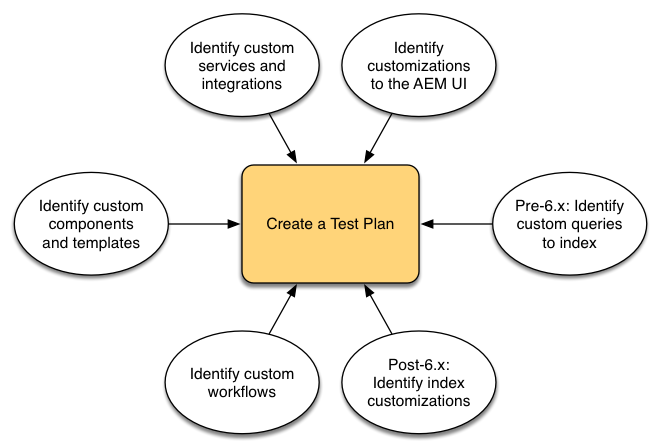
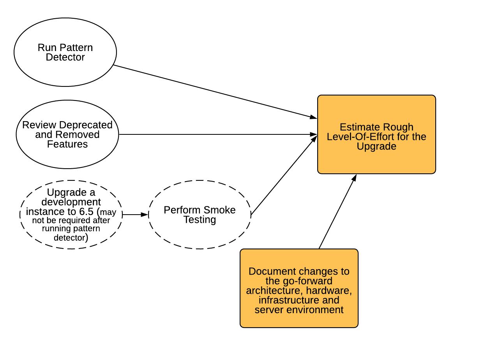

# Planejamento da sua atualização{#planning-your-upgrade}

## Visão geral do projeto AEM {#aem-project-overview}

AEM geralmente é usado em implantações de alto impacto que podem atender a milhões de usuários. Na maioria dos casos, há aplicativos personalizados que são implantados nas instâncias, o que aumenta a complexidade. Qualquer esforço de atualização dessa implantação precisa ser feito de forma metódica.

Este guia ajuda a estabelecer metas, fases e resultados claros ao planejar sua atualização. Centra-se na execução e orientações gerais do projeto. Embora forneça uma visão geral das etapas de atualização reais, ela se refere aos recursos técnicos disponíveis, quando adequado. Deve ser utilizado em conjunto com os recursos técnicos disponíveis referidos no documento.

O processo de atualização de AEM precisa de fases de planejamento, análise e execução cuidadosamente manipuladas com os principais resultados finais definidos para cada fase.

Observe que é possível atualizar diretamente das versões 6.0 e até 6.5 do AEM. Os clientes que executam a 5.6.x e versões inferiores precisam primeiro atualizar para a versão 6.0 ou superior, com a recomendação 6.0(SP3). Além disso, o novo formato OAK Segment Tar é usado agora para o Segment Node Store desde a versão 6.3, e a migração do repositório para esse novo formato é obrigatória mesmo para as versões 6.0, 6.1 e 6.2.

>[!CAUTION]
>
>Se estiver atualizando do AEM 6.2 para o 6.3, você deverá atualizar das versões (**6.2-SP1-CFP1 - -6.2SP1-CFP12.1**) ou **6.2SP1-CFP15** em diante. Caso contrário, se estiver atualizando de **6.2SP1-CFP13/6.2SP1CFP14** para AEM 6.3, também deverá atualizar para pelo menos a versão **6.3.2.2**. Caso contrário, o AEM Sites falharia após a atualização.

## Atualizar Escopo e Requisitos {#upgrade-scope-requirements}

Abaixo você encontrará uma lista de áreas afetadas em um projeto típico de Atualização de AEM:

<table>
 <tbody>
  <tr>
   <td><strong>Componente</strong></td>
   <td><strong>Impacto</strong></td>
   <td><strong>Descrição</strong></td>
  </tr>
  <tr>
   <td>Sistema Operacional</td>
   <td>Efeitos incertos, mas sutis</td>
   <td>No momento da atualização do AEM, pode ser hora de atualizar o sistema operacional também, o que pode ter algum impacto.</td>
  </tr>
  <tr>
   <td>Java Runtime</td>
   <td>Impacto moderado</td>
   <td>AEM 6.3 requer JRE 1.7.x (64 bits) ou posterior. O JRE 1.8 é a única versão atualmente suportada pelo Oracle.</td>
  </tr>
  <tr>
   <td>Hardware</td>
   <td>Impacto moderado</td>
   <td>A Limpeza de Revisão Online requer espaço livre  em disco igual a 25% do tamanho do repositório e 15% do espaço livre de heap  para ser concluída com sucesso. Talvez seja necessário atualizar seu hardware para   garantir recursos suficientes para a Limpeza de Revisão Online para ser totalmente executada . Além disso, se estiver atualizando de uma versão anterior ao AEM 6, poderá haver   requisitos adicionais de armazenamento.</td>
  </tr>
  <tr>
   <td>Repositório de conteúdo (CRX ou Oak)</td>
   <td>Alto impacto</td>
   <td>A partir da versão 6.1, o AEM não é compatível com o CRX2, portanto, uma migração para  Oak (CRX3) é necessária se estiver atualizando de uma versão mais antiga. AEM 6.3 implementou  um novo Armazenamento de nó do segmento que também requer uma migração. A ferramenta   crx2oak é usada para essa finalidade.</td>
  </tr>
  <tr>
   <td>Componentes AEM/Conteúdo</td>
   <td>Impacto moderado</td>
   <td><code>/libs</code> e <code>/apps</code> são facilmente manipuladas por meio da atualização, mas <code>/etc</code> geralmente requer alguma reaplicação manual de personalizações.</td>
  </tr>
  <tr>
   <td>Serviços AEM</td>
   <td>Baixo impacto</td>
   <td>A maioria dos serviços principais de AEM é testada para atualização. Esta é uma área de baixo impacto.</td>
  </tr>
  <tr>
   <td>Serviços de aplicativos personalizados</td>
   <td>Baixo para alto impacto</td>
   <td>Dependendo do aplicativo e da personalização, pode haver   dependências na JVM, versões do sistema operacional e algumas alterações relacionadas à indexação , já que os índices não são gerados automaticamente no Oak.</td>
  </tr>
  <tr>
   <td>Conteúdo do aplicativo personalizado</td>
   <td>Baixo para alto impacto</td>
   <td>O conteúdo que não será tratado por meio da atualização pode ser feito backup  antes que a atualização ocorra e, em seguida, movido de volta para o repositório.  A maioria dos conteúdos pode ser tratada com a ferramenta de migração.</td>
  </tr>
 </tbody>
</table>

É importante garantir que você esteja executando um sistema operacional compatível, Java runtime, httpd e versão do Dispatcher. Para obter mais informações, consulte a página [AEM 6.5 Requisitos técnicos](/help/sites-deploying/technical-requirements.md). A atualização desses componentes precisará ser contabilizada no plano do projeto e deverá ocorrer antes da atualização do AEM.

## Fases do projeto {#project-phases}

Muito trabalho é feito no planejamento e na execução de uma atualização de AEM. A fim de clarificar os diferentes esforços desenvolvidos neste processo, dividimos os exercícios de planeamento e execução em fases distintas. Nas seções abaixo, cada fase resulta em um delivery que geralmente é aproveitado por uma fase futura do projeto.

### Planejamento para treinamento de autor {#planning-for-author-training}

Com qualquer nova versão, há possíveis alterações na interface do usuário e nos fluxos de trabalho do usuário que podem ser introduzidas. Além disso, novas versões apresentam novos recursos que podem ser benéficos para a empresa aproveitar. Recomendamos revisar as alterações funcionais que foram introduzidas e organizar um plano para treinar os usuários a aproveitá-las com eficiência.

Novos recursos no AEM 6.5 podem ser encontrados na [seção AEM de adobe.com](/help/release-notes/release-notes.md). Observe todas as alterações nas interfaces do usuário ou nos recursos do produto que são comumente usados em sua organização. Ao examinar os novos recursos, tome nota de qualquer recurso que possa ser útil para sua organização. Depois de analisar o que mudou no AEM 6.5, desenvolva um plano de treinamento para seus autores. Isso pode envolver o aproveitamento de recursos livremente disponíveis, como os vídeos de recursos do helpx ou o treinamento formal oferecido por meio do [Adobe Digital Learning Services](https://www.adobe.com/training.html).

### Criação de um plano de teste {#creating-a-test-plan}

A implementação de AEM de cada cliente é exclusiva e foi personalizada para atender às necessidades de seus negócios. Como resultado, é importante determinar todas as personalizações feitas no sistema para que possam ser incluídas em um plano de teste. Esse plano de teste alimentará o processo de controle de qualidade que executamos na instância atualizada.

O ambiente de produção exato precisa ser duplicado e os testes devem ser executados nele após a atualização para garantir que todos os aplicativos e códigos personalizados ainda sejam executados como desejado. Você precisa recuperar toda a personalização e executar testes de desempenho, carga e segurança. Ao organizar seu plano de teste, certifique-se de cobrir todas as personalizações feitas no sistema, além de IUs e fluxos de trabalho prontos para uso que são aproveitados em suas operações diárias. Eles podem incluir serviços e servlets OSGI personalizados, integrações com a Adobe Marketing Cloud, integrações com terceiros por meio de conectores AEM, integrações personalizadas de terceiros, componentes e modelos personalizados, sobreposições de interface personalizada em AEM e fluxos de trabalho personalizados. Para clientes que migram de uma versão anterior ao AEM 6, quaisquer consultas personalizadas devem ser analisadas, pois elas podem precisar ser indexadas. Para clientes que já estão em uma versão AEM 6.x, essas consultas ainda devem ser testadas para garantir que seus índices continuem a funcionar efetivamente após a atualização.

### Determinando as alterações necessárias na arquitetura e na infraestrutura {#determining-architectural-and-infrastructure-changes-needed}

Ao atualizar, é possível que você também precise atualizar outros componentes em sua pilha técnica, como o sistema operacional ou a JVM. Além disso, é possível que, devido a alterações na composição do repositório, seja necessário hardware adicional. Isso geralmente só ocorre para clientes que migram de instâncias anteriores à versão 6.x, mas é importante considerar. Finalmente, pode haver alterações necessárias em suas práticas operacionais, incluindo monitoramento, manutenção e processos de backup e recuperação de desastres.

Revise os Requisitos Técnicos do AEM 6.5 e verifique se o hardware e o software atuais serão suficientes. Para possíveis alterações nos processos operacionais, consulte os seguintes documentos:

**Monitorização e manutenção:**

[Painel de operações](/help/sites-administering/operations-dashboard.md)

[Práticas recomendadas de monitoramento de ativos](/help/assets/assets-monitoring-best-practices.md)

[Monitorar recursos do servidor usando o console JMX](/help/sites-administering/jmx-console.md)

[Limpeza de revisão](/help/sites-deploying/revision-cleanup.md)

**Backup/restauração e recuperação de desastres:**

[Backup e restauração](/help/sites-administering/backup-and-restore.md)

[Desempenho e escalabilidade](/help/sites-deploying/performance.md)

[Como executar AEM com o TarMK Cold Standby](/help/sites-deploying/tarmk-cold-standby.md)

#### Considerações sobre a reestruturação de conteúdo {#content-restructuring-considerations}

AEM introduziu alterações na estrutura do repositório que ajudarão a tornar as atualizações mais simples. As alterações envolvem mover o conteúdo da pasta /etc para pastas, incluindo /libs, /apps e /content, com base no fato de o Adobe ou um cliente deter o conteúdo, limitando assim as chances de substituir o conteúdo durante as versões. A reestruturação do repositório foi feita de tal forma que não deve exigir alterações de código no momento da atualização do 6.5, embora seja recomendável revisar os detalhes em [Reestruturação do Repositório em AEM](/help/sites-deploying/repository-restructuring.md) enquanto planeja uma atualização.

### Avaliação da complexidade da atualização {#assessing-upgrade-complexity}

Devido à grande variedade na quantidade e na natureza das personalizações que nossos clientes aplicam a seus ambientes de AEM, é importante passar algum tempo antes para determinar o nível geral de esforço que deve ser esperado em sua atualização.

Há duas abordagens que você pode tomar para avaliar a complexidade da atualização, uma fase preliminar pode apenas usar o Detector de padrões recém-introduzido, que está disponível para ser executado em suas instâncias AEM 6.1, 6.2 e 6.3. O detector de padrões é a maneira mais fácil de avaliar a complexidade geral da atualização que se espera usando padrões relatados. O relatório do detector de padrões inclui padrões para identificação de APIs indisponíveis que estão em uso pela base de código personalizada (isso foi feito usando verificações de compatibilidade de pré-atualização no 6.3).

Após a avaliação inicial, poderá ser dado um passo mais abrangente no sentido de efetuar uma atualização numa instância de ensaio e realizar alguns ensaios básicos de fumos. O Adobe também fornece alguns . Além disso, a lista de [Recursos obsoletos e removidos](/help/release-notes/deprecated-removed-features.md) deve ser revisada não apenas para a versão para a qual você está atualizando, mas também para qualquer versão entre as versões de origem e de destino. Por exemplo, se estiver atualizando do AEM 6.2 para o 6.5, é importante revisar os recursos obsoletos e removidos do AEM 6.3, além dos recursos do AEM 6.5.

O Detector de padrões introduzido recentemente deve fornecer uma estimativa bastante precisa do que esperar durante uma atualização para a maioria dos casos. No entanto, para personalizações e implantações mais complexas em que você tem alterações incompatíveis, é possível atualizar uma instância de desenvolvimento para AEM 6.5 de acordo com as instruções em [Execução de uma atualização no local](/help/sites-deploying/in-place-upgrade.md). Depois de concluído, faça alguns testes de fumaça de alto nível neste ambiente. O objetivo deste exercício não é concluir exaustivamente o inventário dos casos de teste e produzir um inventário formal de defeitos, mas fornecer uma estimativa aproximada da quantidade de trabalho que será necessário para atualizar o código para a compatibilidade com o 6.5. Quando combinada com a [Detecção de padrão](/help/sites-deploying/pattern-detector.md) e as alterações de arquitetura que foram determinadas na seção anterior, uma estimativa aproximada pode ser fornecida à equipe de gerenciamento do projeto para planejar a atualização.

### Criando o Runbook de Atualização e Reversão {#building-the-upgrade-and-rollback-runbook}

Embora o Adobe tenha documentado o processo de atualização de uma instância de AEM, o layout de rede, a arquitetura de implantação e as personalizações de cada cliente exigirão o ajuste e a personalização dessa abordagem. Por esse motivo, recomendamos que você revise toda a documentação que fornecemos e use-a para informar um runbook específico do projeto que descreve os procedimentos específicos de atualização e reversão que você seguirá em seu ambiente. Se estiver atualizando do CRX2, certifique-se de avaliar quanto tempo a migração de conteúdo levará ao mudar do CRX2 para o Oak. Para repositórios grandes, pode ser substancial.

Fornecemos procedimentos de atualização e reversão em [Procedimento de Atualização](/help/sites-deploying/upgrade-procedure.md), bem como instruções passo a passo para aplicar a atualização em Execução de uma [Atualização no Local](/help/sites-deploying/in-place-upgrade.md). Essas instruções devem ser revisadas e consideradas com a arquitetura do sistema, as personalizações e a tolerância ao tempo de inatividade para determinar os procedimentos apropriados de switch e reversão que você executará durante a atualização. Quaisquer alterações na arquitetura ou no tamanho do servidor devem ser incluídas ao criar seu runbook personalizado. É importante notar que este aspecto deve ser tratado como um primeiro projeto. À medida que sua equipe conclui os ciclos de controle de qualidade e desenvolvimento e implanta a atualização no ambiente de preparo, é provável que a necessidade de algumas etapas adicionais seja necessária. Idealmente, esse documento deve conter informações suficientes para que, se ele fosse entregue a um membro da equipe de operações, ele pudesse concluir a atualização completamente a partir das informações contidas no .

### Desenvolvimento de um plano de projeto {#developing-a-project-plan}

Podemos usar o resultado dos exercícios anteriores para criar um plano de projeto que cubra os prazos esperados para nossos esforços de teste ou desenvolvimento, treinamento e execução de atualização real.

Um plano de projeto global deve incluir:

* Finalização dos planos de desenvolvimento e de ensaio
* Atualização de ambientes de desenvolvimento e controle de qualidade
* Atualização da base de código personalizada para o AEM 6.5
* Um teste de controle de qualidade e um ciclo de correção
* Atualização do ambiente de preparo
* Integração, desempenho e teste de carga
* Certificação do ambiente
* Ativa

### Execução de desenvolvimento e controle de qualidade {#performing-development-and-qa}

Fornecemos procedimentos para que [Upgrade Code and Customizations](/help/sites-deploying/upgrading-code-and-customizations.md) sejam compatíveis com o AEM 6.5. Como esse processo iterativo é executado, as alterações devem ser feitas no runbook, conforme necessário. Consulte também [Compatibilidade com versões anteriores no AEM 6.5](/help/sites-deploying/backward-compatibility.md) sobre as informações sobre como as personalizações podem manter-se compatíveis com versões anteriores na maioria dos casos, sem exigir desenvolvimento imediatamente após a atualização.

O processo de desenvolvimento e teste é geralmente iterativo. Devido a personalizações, as alterações feitas durante a atualização podem tornar potencialmente inutilizável uma seção inteira do produto. Depois que os desenvolvedores resolverem a causa raiz do problema e a equipe de teste tiver acesso para testar esses recursos, há potencial para descobrir problemas adicionais. À medida que forem detectados problemas que exijam ajustes no processo de atualização, adicione-os ao seu runbook de atualização personalizado. Após várias iterações de teste e correção, a base de código deve ser totalmente validada e pronta para implantação no ambiente de preparo temporário.

### Teste final {#final-testing}

Recomendamos uma rodada final de testes depois que a base de código tiver sido certificada pela equipe de QA de sua organização. Essa rodada de testes envolverá a validação do runbook em um ambiente de preparo, seguido de rodadas de aceitação, desempenho e teste de segurança do usuário.

Essa etapa é essencial, pois é a única vez que você pode validar as etapas no runbook em relação a um ambiente semelhante à produção. Depois que o ambiente for atualizado, é importante permitir que os usuários finais façam logon e passem pelas atividades que fazem ao usar o sistema em suas atividades diárias. Não é incomum que os usuários aproveitem uma parte do sistema que não foi considerada anteriormente. Encontrar e corrigir problemas nessas áreas antes da ativação pode ajudar a evitar paralisações dispendiosas na produção. Como uma nova versão do AEM contém alterações significativas na plataforma subjacente, também é importante executar testes de desempenho, carga e segurança no sistema como se estivéssemos inicializando pela primeira vez.

### Execução da atualização {#performing-the-upgrade}

Depois de receber o último sinal de aprovação de todas as partes interessadas, é tempo de executar os procedimentos de runbook que foram definidos. Fornecemos etapas para atualização e reversão em [Procedimento de atualização](/help/sites-deploying/upgrade-procedure.md) e etapas de instalação em Execução de uma [Atualização no local](/help/sites-deploying/in-place-upgrade.md) como ponto de referência.

Fornecemos algumas etapas nas instruções de atualização para validação de ambiente. Isso inclui verificações básicas, como verificar os logs de atualização e verificar se todos os pacotes OSGi foram iniciados corretamente, mas recomendamos também validar com seus próprios casos de teste com base em seus processos comerciais. Também recomendamos verificar o agendamento da limpeza de revisão online AEM e as rotinas relacionadas para garantir que elas ocorrerão durante um período de silêncio para sua empresa. Essas rotinas são essenciais para o desempenho a longo prazo da AEM.
